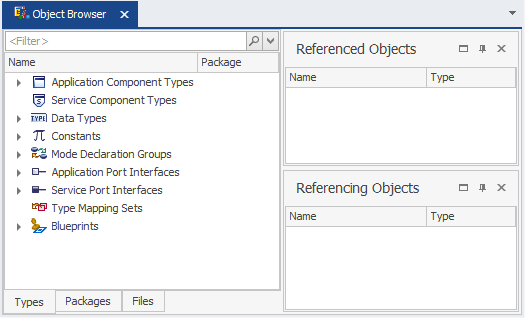

---
# 这是文章的标题
title: Autosar davinci developer classic使用教程
# 你可以自定义封面图片
# cover: /assets/images/cover1.jpg
# 这是页面的图标
icon: file
# 这是侧边栏的顺序
order: 1
# 设置作者
# author: Ms.Hope
# 设置写作时间
date: 2024-01-15
# 一个页面可以有多个分类
category:
  - Autosar
# 一个页面可以有多个标签
tag:
  - tool
  - developer
# 此页面会在文章列表置顶
# sticky: true
# 此页面会出现在文章收藏中
star: true
isOriginal: false
article: true
timeline: true
# 你可以自定义页脚
# footer: 这是测试显示的页脚
# 你可以自定义版权信息
# copyright: 无版权
---

本文主要讲解Autosar davinci developer classic基本使用

<!-- more -->

## 1.介绍
为autosar ECU 设计软件组件架构，位于V形流程的Application Software Development;
通过图形视图或文本网格视图，可以设计包括端口、数据在内的软件组件类型、连接器和内部行为。

## 2.工作空间(workspace)

## 3. SWC 设计

1. 应用组件(Application Components)
2. 端口、端口初始值和数据元素(Ports, Port Init Values and Data Elements)
3. 连接(Connections)
4. 可运行实体(Runnables)
5. 触发器(Triggers)
6. 端口访问(Port Access)
7. 数据映射(Data Mapping)

### 1. 创建 Application Components

在 object browser界面有三种视图：Type-oriented、Package-oriented 和 File-oriented

1. 在 Type-oriented 视图右键即可创建新Application Component type

### 2. 理解类型、原型和接口(Types, Prototypes and Interfaces)

在Object Browser中，软件组件是类型，端口是接口。只要你
使用它们，它们就变成了原型

- Port Interface used by a component type -> Port Prototype
- Component Type in Object Browser used in software design view -> Component Prototype

### 3. 端口、端口初始值和 数据元素(元数据的一个原子数据单元)

在使用应用程序端口之前，必须定义应用程序端口接口。要完全定义端口接口，如果不想使用预定义的数据类型，则必须首先定义数据类型。
端口有以下几个类别
- Sender Ports to provide information
- Receiver Ports to receive information
- Sender/Receiver Ports to provide and receive information within one port
- Server Ports to provide services (operations)
- Client Ports to use services (operations)
- Calibration Ports to hand over calibration parameters
- Mode Ports to e.g. trigger or not trigger runnables within certain modes

### 4. 在应用程序组件中配置服务端口

### 5. 定义runnables

### 6. 为runnable配置触发器、 Port Access

### 7. 生成模板

如果计划手动实现SWC(而不是使用基于模型的代码生成器)，可以生成SWC模板和合约头文件。
要生成代码，可以在对象浏览器中选择SWC，并通过上下文调用代码生成器菜单

