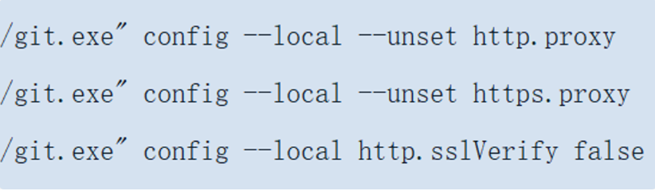

---
# 这是文章的标题
title: git常用指令
# 你可以自定义封面图片
# cover: /assets/images/cover1.jpg
# 这是页面的图标
icon: file
# 这是侧边栏的顺序
order: 1
# 设置作者
# author: Ms.Hope
# 设置写作时间
date: 2023-11-28
# 一个页面可以有多个分类
category:
  - 使用指南
# 一个页面可以有多个标签
tag:
  - git
  - 代理配置
  - 分支切换
  - 使用指南
# 此页面会在文章列表置顶
# sticky: true
# 此页面会出现在文章收藏中
star: true
isOriginal: true
article: true
timeline: true
# 你可以自定义页脚
# footer: 这是测试显示的页脚
# 你可以自定义版权信息
# copyright: 无版权
---

git常用指令场景

<!-- more -->
## 代理配置

### 设置代理
```shell
git config --global http.proxy http://127.0.0.1:[Port]
git config --global https.proxy https://127.0.0.1:1080:[Port]
```
### 取消代理
```shell
git config --global --unset http.proxy
git config --global --unset https.proxy
```
::: tip
[Port]替换为你本地代理的端口
--global 可替换为--system、--local
:::
## 生效优先级
system级指的是程序级别的配置，配置文件在程序的配置目录中
global级是用户级别的配置，配置文件在用户目录中
local级是仓库级别的配置，配置文件在仓库下的.git目录中
::: tip
优先级：local > global > system
:::
### 案例

在一个git脚本中当执行取消代理指令



遇到报错


通过执行代理查看指令
```shell
git config --global --get http.proxy
git config --global --get https.proxy
```
发现global级别配置了代理地址，取消global级别的代理配置后，问题解决


## 分支切换

场景假设：假设在dev分支上开发后要切换到主分支上main，覆盖主分支的内容

可以通过以下步骤来实现：

1. **首先，确保工作目录是干净的**，没有未提交的更改，或者先把未提交的更改暂存或提交。

2. **切换到替换的分支**。假设你想替换的分支叫做`old-branch`：

   ```sh
   git checkout old-branch
   ```

3. **强制推送（force push）** 你的目标分支到与另一个分支（比如`new-branch`）相同的状态。这将使用`new-branch`的内容覆盖`old-branch`的内容：

   ```sh
   git reset --hard new-branch
   git push origin +old-branch
   ```

   或者，如果你的Git版本支持，可以使用`git switch`命令：

   ```sh
   git switch old-branch
   git reset --hard new-branch
   git push origin +old-branch
   ```

请注意，使用`git push --force`或`git push origin +<branch>`会覆盖远程仓库中`old-branch`的历史记录，这可能会导致其他人丢失工作，因此在执行此操作前，请确保你有权限这样做，并且了解其后果。

另外，如果你只是想在本地重置一个分支而不影响远程分支，你可以省略`git push`命令。然而，如果你想更新远程分支，那么`git push`是必要的。在执行强制推送之前，最好与团队成员沟通，以避免不必要的冲突或数据丢失。

::: tip
若本文对您有用，欢迎送个表情包或评论
;若有不对之处或建议，欢迎评论
:::
