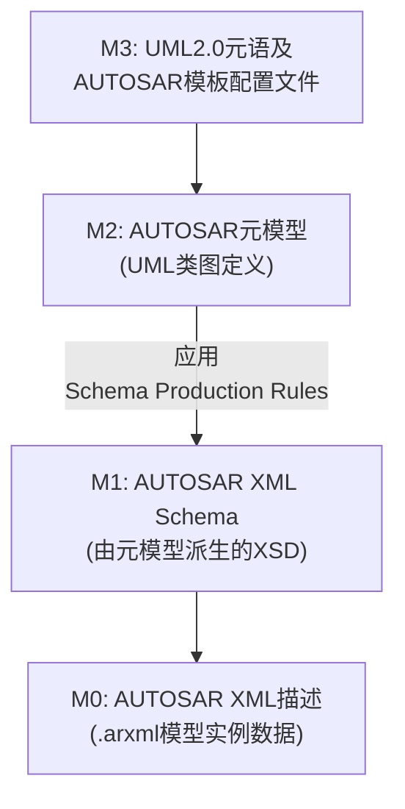

**引言：** AUTOSAR（AUTomotive Open System ARchitecture）是汽车电子软件架构的开放标准，它通过定义通用的软件接口和架构促进不同厂商的协同开发。在AUTOSAR标准中，系统的所有信息实体都由一套严格定义的元模型来描述，而XML被选为AUTOSAR系统描述的交换格式基础。所谓AUTOSAR XML Schema Production Rules（XML Schema生成规则），就是将AUTOSAR元模型映射为对应的XML Schema（XSD）的一系列规则。这些规则建立了UML建模世界与XML描述世界之间的桥梁，使AUTOSAR模型能够以XML文件（.arxml）的形式进行交换和验证。

本指南将全面解析AUTOSAR XML Schema Production Rules的技术细节，并结合AUTOSAR R24-11官方文档和实际案例进行说明。内容涵盖元模型到XML Schema的映射原理、属性和引用的处理、XML名称和顺序等规则详解，以及AUTOSAR XML在整车厂（OEM）和供应商项目中的应用方式。此外，我们还将介绍主流AUTOSAR工具链（如Vector DaVinci、EB tresos等）如何支持并利用这些规则生成或消费ARXML文件，并通过实例演示从UML模型到ARXML再到代码生成的完整流程。读者将能系统地理解AUTOSAR XML Schema Production Rules的方方面面，并学会在工程实践中正确应用和遵循这些规则。

## 1. AUTOSAR XML Schema Production Rules 概述与设计原则

### 1.1 元模型与XML Schema映射的体系架构

在AUTOSAR架构中，采用元建模的分层方法来定义系统描述语言。简单来说，AUTOSAR定义了不同的抽象层级（通常称为M3、M2、M1、M0四个层级）：

* **M3层（元-元模型）**：UML 2.0定义及AUTOSAR提供的模板配置文件（Profile）。这一层定义了AUTOSAR元模型可以使用的建模语言元素和扩展机制。
* **M2层（元模型）**：AUTOSAR的 UML 2.0 元模型，即采用UML类图形式描述的AUTOSAR语言元素（比如各种模板中的类、属性及关系）。这是对AUTOSAR系统进行描述的抽象语言定义。
* **M1层（模型）**：AUTOSAR XML Schema（XSD模式）。根据元模型，通过XML Schema Production Rules生成出的XML模式，定义了合法AUTOSAR XML文件的结构。可以理解为AUTOSAR数据交换格式的正式规范。
* **M0层（实例数据）**：AUTOSAR XML描述，即具体的.arxml文件，承载了某个AUTOSAR模型实例的信息。每个这样的XML描述必须通过AUTOSAR XML Schema成功验证，确保其结构符合标准。

上述分层结构表明，AUTOSAR元模型经过XML Schema Production Rules的处理，被映射为可在工具间交换的XML Schema定义；而实际的AUTOSAR模型数据则以ARXML文件形式承载，并在交换时由XML Schema保证其合规性。下面的示意图展示了该分层关系和映射过程：

### 1.2 AUTOSAR XML命名规则与元素顺序

AUTOSAR定义了一套规范的XML命名规则，以保证由元模型派生的XML Schema和元素名称具有一致的格式。这些规则主要包括：

1. **名称大写**：元模型中的名称转换为XML名称时，所有字母均转换为大写形式；
2. **拆分单词**：按照元模型名称中的大小写边界或数字，将名称拆分为若干标记（token）；
3. **移除特殊字符**：忽略名称中所有非字母数字的字符；
4. **连字符连接**：使用连字符（“-”）将各个标记连接起来形成完整的XML名称。

按照上述规则，例如元模型中的类名 `TestECUClass12ADC` 在转换为XML名称时，将被拆解并转换为 `TEST-ECU-CLASS-12-ADC`。所有AUTOSAR XML Schema中的元素名、类型名、属性名均遵循此“全大写加连字符”的命名约定。

除了命名规范外，AUTOSAR XML Schema还规定了XML元素的默认排列顺序，以提升可读性和处理效率。默认情况下，同一复合元素内部的子元素按照名称的字母顺序排序。这种排序使不同工具生成的ARXML文件在结构上具有一致性，方便比较和版本管理。如果需要改变默认顺序，元模型可以通过在属性上设置 `xml.sequenceOffset` 标记来自定义元素的排列顺序。`xml.sequenceOffset`通常接受整数值，值越小的元素会被排序到更靠前的位置，以此方式精细调整XML输出中元素的先后次序。

## 2. AUTOSAR XML Schema生成规则详解

### 2.1 UML类与XML Schema类型的映射

在AUTOSAR元模型中，每一个UML类（如软件组件、接口、信号等的定义）最终都会映射为XML Schema中的相应类型定义。具体而言，默认情况下**每个UML类映射为一个`xsd:complexType`复杂类型**。这个复杂类型描述了该类的所有包含属性。在生成`complexType`的同时，通常还会为该类生成一个**命名的组（`xsd:group`）**，以便在需要时复用其定义结构。如果某个类被标记为需要全局元素（即设置了`xml.globalElement=true`），那么该类还会在Schema中生成对应的顶层`xsd:element`元素定义，用于作为XML文档的根元素或独立片段使用。

对于特殊类型的类，映射规则会有所不同。例如：**基本数据类型类**（如表示整数、字符串等的类）不会生成复杂类型，而是直接映射为XML Schema的内建简单类型引用；**枚举类**（定义一组离散值）则映射为`xsd:simpleType`并在其中定义枚举的可能取值列表。通过这些机制，AUTOSAR元模型中定义的各种类型（复杂结构、原始类型、枚举等）都能在XML Schema中得到精确对应的表示。

值得一提的是，UML类之间的**继承关系**在XML Schema中也会体现出来。如果一个类继承自另一个基类，那么在XML Schema中通常会让该子类的`complexType`通过`xsd:extension`扩展基类的类型，从而共享基类定义的通用属性。这样，继承层次结构也被忠实地反映到XML Schema中，保证模型层次的信息不丢失。

### 2.2 属性（Property）的映射规则

在AUTOSAR元模型的UML类中定义的属性和关联关系，按照其性质不同，在XML Schema中的表现形式也不同。大体可以分为**两类属性**：一种是组成关系（Composite）的属性，即该属性所指对象被视为所属类内容的一部分；另一种是引用关系（Reference）的属性，即该属性仅引用另一个独立存在的对象。Production Rules针对这两种情况有不同的处理方式。

* **组合类属性**：对于组成关系的属性，一般映射为XML中的子元素。举例来说，如果一个软件组件类有一个属性是某个数据元素（composition关系），那么在ARXML中会通过在组件的XML节点下嵌套一个对应的数据元素子节点来表示这一包含关系。**默认情况下**，每个属性都会作为单独的XML元素出现，其名称由前述命名规则确定。但在以下特殊情况下会有不同映射： (1) 若属性的数据类型是简单类型且被配置为XML属性（`xml.attribute=true`），则不会生成子元素，而是作为父元素的一个XML属性出现。这种情况通常用于一些简单数值或标志等，使XML结构更紧凑；(2) 若属性允许多个值（多重性大于1），通常会使用特定的包装元素或重复元素来包含多个实例。我们将在后文讨论标记值组合对元素结构的影响。

* **引用类属性**：对于表示引用关系的属性（即UML中的关联，但非组合关系），它在XML中不直接嵌入被引用对象的内容，而是以某种**引用机制**来指向目标对象。AUTOSAR XML支持两种主要的引用表示方式：一种是使用XML Schema的`ID/IDREF`机制，即被引用目标在XML中有唯一ID，引用处通过`IDREF`引用该ID；另一种是使用路径字符串，即通过一个字符串属性存放被引用对象在模型层次中的路径（通常以`/`分隔表示层次结构）。具体采用哪种方式由元模型配置决定。在AUTOSAR 4.x的实践中，更常见的是使用路径引用（通常在Schema中体现为`*REF`元素，内部文本为路径），因为它可以方便地引用跨文件的元素且直观可读。而IDREF方式在需要引用同一XML内部元素时也会被采用。无论哪种方式，XML Schema都会相应地对引用的格式加以约束（例如IDREF必须匹配某种ID类型，路径则通常有特定的正则模式）。

最后需要考虑\*\*属性的多重性（Multiplicity）\*\*如何在XML Schema中表示。UML属性可以有下限和上限（如0..1，1..\*等）。Production Rules将其转换为XML Schema中元素的出现次数约束：下限对应`minOccurs`，上限对应`maxOccurs`。例如，一个0..1的可选属性会在Schema定义为`minOccurs="0" maxOccurs="1"`，而1..\*的属性则可能定义为`minOccurs="1" maxOccurs="unbounded"`表示至少出现一次、可多次出现。在某些场景下，元模型设计者可以通过配置强制特定的出现要求，比如即便某属性下限为0也要求在XML中至少出现一次等，我们将在下节介绍的标记值中看到通过`xml.enforceMinMultiplicity`等实现此效果。

### 2.3 生成规则的关键标记值（Tagged Values）

XML Schema Production Rules的强大之处在于，它允许通过在元模型中设置\*\*标记值（tagged value）\*\*来调整具体的映射行为。以下列出了AUTOSAR元模型中常用的主要标记值及其含义：

* **`xml.name`**：用于覆盖默认的XML名称。通常情况下，XML名称由元模型名称按规则转换得出，但通过设置`xml.name`，可以指定一个自定义的名称，用于特殊情况的命名调整。
* **`xml.globalElement`**：布尔值，指示是否为该类生成一个全局元素定义。默认仅生成类型，但某些顶层元素（如根节点AUTOSAR本身，或需要单独作为文件入口的元素）需要设置true以便在Schema中拥有顶层元素声明。
* **`xml.ordered`**：布尔值，指示是否保持属性在元模型中声明的顺序。默认情况下Schema会按字母序排列子元素，但若此值为true，则表示应按模型中定义的顺序输出。这通常与`xml.sequenceOffset`结合精细控制顺序。
* **`xml.attribute`**：布尔值，适用于简单类型属性，表示是否将该属性映射为XML属性而非子元素。设置true会令其在Schema中成为`xsd:attribute`，便于表示一些简单配置项；false则按默认映射为`xsd:element`。
* **`xml.roleElement`**：布尔值，适用于复合（组合）属性，表示是否为该属性创建一个角色元素。所谓角色元素，即使用属性在关联中的角色名称作为一个中间XML元素来包裹实际的类型实例。若true，每个实例将被包含在一个角色命名的元素下。
* **`xml.roleWrapperElement`**：布尔值，适用于复合属性，表示是否创建一个角色包装元素。包装元素通常是该角色名称的复数形式，用于在XML中将一组子元素整体包裹。例如角色为Wheel，复数包装可能是Wheels。
* **`xml.typeElement`**：布尔值，适用于复合属性，表示是否使用类型元素。类型元素指以被引用类型的名称作为XML元素。例如当一个属性类型不止一种子类时，使用类型元素可以明确标识实例的具体类型。
* **`xml.typeWrapperElement`**：布尔值，适用于复合属性，表示是否创建类型包装元素。当某属性可包含不同类型的多组元素时，可以按类型分别再加一层容器。例如将不同子类型的元素分别放在不同的类型集合中。
* **`xml.enforceMinMultiplicity`**：布尔值，指示是否强制执行最小多重性要求。若设为true，即使元模型中某属性下限为0，也可能在Schema中要求至少出现一次该元素。
* **`xml.enforceMaxMultiplicity`**：布尔值，指示是否强制执行最大多重性要求。一般用于限制某属性在XML中最多只能出现一次，即使元模型容许多次出现（比如有些配置出于实际考虑希望至多一项）。
* **`xml.sequenceOffset`**：整数值，用于调整XML元素的顺序。默认排序规则可被此偏移量覆盖，较小的offset会使元素排列到更靠前的位置。通过设置不同offset，可以明确控制XML中元素的先后顺序，避免仅按字母顺序造成的阅读不便。

需要注意的是，某些标记值的组合有规则限制。例如，如果将`xml.attribute`设置为true，那么针对复合属性的其它标记如`xml.roleElement`、`xml.typeElement`等将被忽略。再如，`xml.typeWrapperElement`的使用必须伴随`xml.typeElement=true`方有意义，否则类型包装层无具体类型元素也就没有存在必要。实际上，四个元素相关标记（roleElement/roleWrapperElement/typeElement/typeWrapperElement）理论上有16种组合，但规范中只有11种是合法定义的，其余组合要么不适用要么含义重复。常见的配置模式包括：只使用角色包装和类型元素 (`xml.roleWrapperElement=true, xml.typeElement=true`)，这会在XML中生成一个复数容器元素，内部直接使用类型名元素表示每个实例；或者在需要严格区分角色时使用全部四层包装 (`xml.roleElement, xml.roleWrapperElement, xml.typeElement, xml.typeWrapperElement`全为true)，会产生较复杂的嵌套结构。开发者在设计元模型时应根据实际需求选择合理的标记组合，以在XML表示中取得语义清晰和结构简洁的平衡。

## 3. AUTOSAR XML在实际项目中的应用

AUTOSAR定义的ARXML文件在整车厂（OEM）和供应商的实际开发项目中扮演着至关重要的角色。作为系统架构和配置的数据载体，ARXML文件覆盖了从ECU硬件描述、软件组件配置，到车辆网络通信矩阵等各方面的信息，以标准化格式支持不同团队和工具链之间的协作。下面我们分别介绍ARXML在几个核心方面的应用。

### 3.1 ECU描述文件

在AUTOSAR项目中，“**ECU描述文件**”通常是指针对特定ECU的系统配置描述（有时称为ECU Extract）以及后续详细的ECU配置描述两类文档。这类ARXML文件由整车级配置提取出单个ECU相关的信息，供ECU开发者使用和进一步配置。

首先，**系统配置描述文件**（System Description）是在系统架构设计阶段生成的，包含整车中所有ECU及其通信关系的全集信息。其中包括：系统中有哪些ECU、各ECU通过什么网络相连（总线拓扑及配置）、通信矩阵（定义了在网络上传输的所有信号及其打包到帧/PDU中的方式）、所有软件组件（SWC）的接口和连接关系，以及SWC到ECU的分配映射等。系统描述文件通常由OEM使用架构设计工具（例如Vector PREEvision、Dassault System**Desk**等）创建，作为整个系统配置的输出成果。

在完成整车系统配置后，会针对每一个具体的ECU从系统描述中**提取ECU描述文件**（ECU Extract）。顾名思义，ECU描述ARXML包含的是某个ECU所需的全部相关配置信息子集。例如，它包括该ECU上有哪些SWC实例、这些SWC使用了哪些接口信号、ECU所连接网络及消息等。相比完整的系统描述，ECU提取文件过滤掉了与本ECU无关的其他内容，只保留单个ECU视角下需要“知道”的配置。这个ECU描述文件通常由OEM提供给供应商，作为ECU开发的输入。

需要注意，ECU提取描述文件虽然包含了应用软件和通信相关的配置，但通常**不包含具体的基础软件（BSW）配置细节**。换言之，ECU Extract描述了系统中要求该ECU共同遵守的配置元素，但还不足以直接生成可运行代码。接下来供应商会在此基础上执行ECU级的详细配置，包括OS和各基础软件模块的参数配置。

当供应商完成ECU的具体配置后，会生成**ECU配置描述文件**，这也是一个.arxml格式的文件。其中包含了该ECU上RTE、OS、通信栈、诊断服务以及各基础软件模块的全部配置参数。这个文件连同之前的SWC代码一起，作为生成最终可执行程序的直接输入。ECU配置描述文件相当于完整描述了某ECU的软件和硬件配置（除了应用逻辑本身），通过AUTOSAR标准格式确保这些配置可以被后续的代码生成工具正确解析和处理。

### 3.2 软件组件（SWC）描述与配置

AUTOSAR的软件组件（Software Component, SWC）及其内部配置也采用ARXML文件进行描述和交换。每一个SWC（例如一个应用功能组件）通常会有对应的**SWC描述文件**，其中包括该组件的各类元素定义：例如组件实现的Runnable实体、所提供和需要的端口（P-Port和R-Port）、接口引用、内部参数、校准参数以及组件行为配置等。这些信息符合AUTOSAR软件组件模板（Software Component Template）的标准格式。

SWC描述ARXML文件通常由供应商（或负责应用软件开发的团队）生成，然后提供给系统集成方（OEM或主管系统设计的团队）。通过SWC ARXML，系统集成人员无需了解组件内部实现的代码细节，就能够在架构层面对SWC进行集成和配置，例如将SWC分配到某个ECU上、连接SWC之间的通信端口等。

在实践中，SWC描述文件往往由专门的AUTOSAR建模工具生成，例如Vector DaVinci Developer、MathWorks的AUTOSAR Authoring支持（Simulink/Embedded Coder）或者ETAS ISOLAR等工具。工程师可以在这些工具中以图形化或表格方式配置SWC的接口和属性，然后一键导出符合标准的ARXML文件。借助标准化的SWC ARXML，不同团队之间可以方便地交换组件设计：供应商提供SWC描述，OEM导入后即可将其纳入整体系统模型，确保双方对接口和需求的理解一致。

值得一提的是，AUTOSAR还定义了参数配置（Parameter）和模式管理（Mode Declaration）等与SWC相关的内容，这些也通过SWC描述ARXML承载。例如，一个SWC若有标定标参，ARXML中会包含Parameter Definitions和Values部分，描述参数的定义及默认值；再如SWC若实现了模式管理接口，其模式定义也体现在ARXML内。通过这些标准格式，OEM可以在系统集成阶段统一配置各SWC的参数（例如不同车型的标定数据），并利用工具自动生成对应的配置代码。

### 3.3 通信矩阵与信号建模

汽车电子系统中大量的ECU间通信（例如CAN报文、以太网帧等）需要统一的通信矩阵描述。传统上，这类网络信号和消息通常由网络架构工程师在DBC、LDF等文件中定义。而在AUTOSAR方法中，这些通信元素被纳入AUTOSAR模型，以便和应用软件配置紧密结合。**通信矩阵**相关的信息在ARXML中体现为系统模板的一部分，包括**网络总线定义、帧(Frame)和PDU(Protocol Data Unit)定义、网络信号(Signal)定义**，以及信号到PDU、PDU到帧的封装关系等。

在AUTOSAR 4.x的System Template规范中，一个总线（如CAN总线）在ARXML里表示为一个**集群(Cluster)**对象，内部包含若干**帧**的定义。每个帧可以承载一个或多个PDU，在ARXML中表现为帧下的PDU列表。每个PDU则包含若干信号（Signal）或信号组的定义，描述具体的信号长度、偏移、数据类型等。通过层层嵌套的结构，ARXML完整地表示了从总线到帧、再到PDU、再到信号的通信架构。

除了定义静态的通信元素之外，ARXML还可描述ECU在网络通信中的**映射关系**。例如某个应用信号由哪个SWC的哪个端口产生/消耗，该信号映射到网络中的哪一个PDU以及在PDU中的偏移位置等，都可以通过System Description中的映射元素（如`I-SIGNAL-TO-I-PDU-MAPPING`等）来加以表述。这使得AUTOSAR模型既涵盖了应用层的信号接口，也包括了底层网络传输细节，实现端到端的配置信息统一。

通过使用AUTOSAR标准的通信矩阵ARXML，OEM和供应商可以在没有歧义的情况下交换车辆网络的配置信息。例如，OEM可以将整车CAN网络的所有消息和信号定义整合到System Description的ARXML文件中，提供给各ECU供应商。供应商则可据此将自己ECU相关的信号接口与该通信矩阵对接起来（即对应的端口连接到相应信号），并利用配置工具确保生成的通讯代码（如COM配置、PDUR路由等）与整车网络一致。这避免了人工对接通信矩阵可能产生的错误，提高了协作效率。

### 3.4 配置流程与RTE生成

AUTOSAR方法论将整个开发流程划分为系统配置阶段和ECU配置阶段，两者通过标准格式的ARXML文件衔接。我们以典型的Classic Platform开发为例，说明从系统配置到RTE生成的流程：

1. **系统设计与配置**：架构工程师使用AUTOSAR建模工具进行系统级设计，如定义SWC组成、ECU拓扑、通信矩阵等。当系统配置完成后，导出**系统描述ARXML**文件（System Description）。该文件是后续步骤的基础输入。
2. **ECU提取**：针对每个ECU，从系统描述中提取出该ECU相关的配置子集，形成**ECU提取ARXML**文件（ECU Extract）。它仅包含单个ECU所需的信息，例如ECU上的SWC列表、涉及该ECU的通信信号等。
3. **ECU级配置**：ECU开发人员将ECU Extract导入AUTOSAR ECU配置工具（如Vector DaVinci Configurator或EB tresos Studio），并结合具体的硬件和基础软件需求进行详细配置。这包括配置OS调度表、各BSW模块（COM、CAN、Diag等）的参数、以及生成RTE所需的信息。完成配置后，工具生成**ECU配置描述ARXML**文件作为输出。
4. **生成代码**：最后，代码生成器（通常集成在配置工具中）读取ECU配置ARXML以及SWC描述ARXML，自动生成相应的C代码和头文件。这包括RTE模块代码、各BSW驱动的配置代码、以及与SWC接口相关的定义等。生成的代码与SWC的应用代码相结合，经过编译链接，得到可在目标ECU上运行的可执行文件。

通过上述流程，AUTOSAR模型信息被逐步细化并传递：从整车级的抽象配置到每个ECU的具体实现，每一步的输出ARXML都作为下一步的输入。标准化的ARXML保证了这一链条上的信息一致性和无歧义传输，使不同供应商开发的组件能够集成到统一的系统中，并由自动化工具生成符合整体需求的代码。

### 3.5 ARXML文档的组织与管理

在大型AUTOSAR项目中，ARXML配置数据量庞大，因此通常会将其拆分存储在多个文件中，并通过包（Package）结构进行组织管理。每个ARXML文件的顶层是`<AUTOSAR>`根元素，其中包含一个或多个`AR-PACKAGE`子元素，用于将模型内容按照功能或模板归类。例如，可能有一个`AR-PACKAGE`专门存放关于通讯网络（如Frame和Signal）的定义，另一个`AR-PACKAGE`存放所有SWC类型定义，再另有一个包存放ECU实例和它们的配置。

这种包结构不仅方便模块化管理，也支持**分布式协作开发**。不同团队可以各自维护不同的ARXML文件（对应不同的包），最终通过导入/合并形成完整的系统配置。包之间通过限定的短名称（Short Name）路径引用互相关联。例如，在SWC描述中引用某数据类型时，使用的是`/DataTypes`包下定义的类型的路径；这样即使SWC和数据类型定义位于不同文件，只要都在同一整体模型命名空间下，引用关系依然清晰有效。

AUTOSAR规范并未强制规定如何拆分文件，但提供了推荐的命名和分包方案（例如按模板分层次包）。工具在导入多个ARXML文件时，会根据文件中定义的包层次将内容合并到统一的模型树中。如果遇到重复定义或不一致引用，Schema验证或工具的检查功能会报错提示。常见的做法是，每个ECU都会有自己独立的ECU配置文件，一些共用定义（如基础数据类型、接口定义）集中在平台文件中，而系统级的文件则由OEM维护并分发。

对工程师来说，理解ARXML文件的组织方式有助于定位配置项并排查问题。当某个元素在一个文件中修改后，相关引用在其他文件中也会随之改变（通常通过工具执行）。使用版本管理时，也往往按ARXML文件为单位进行差分和审查。因此，清晰的分包策略和一致的命名约定，是团队协作顺利进行的关键一环。

## 4. AUTOSAR工具链对ARXML的支持

标准化的ARXML格式为AUTOSAR工具链之间的数据交换提供了基础。无论是设计软件组件、进行系统集成，还是配置基础软件模块，各环节的工具都以ARXML作为输入输出，从而保证不同厂商的工具能够协同工作。下面介绍几个主流的AUTOSAR工具及其对ARXML Production Rules的支持。

### 4.1 Vector DaVinci Developer 与 Configurator

Vector公司的DaVinci工具套件是AUTOSAR经典平台中应用广泛的商业工具。其中，**DaVinci Developer**用于AUTOSAR软件组件的建模与配置。工程师可以在Developer中创建SWC，定义接口和运行实体，并将配置导出为ARXML文件。Developer能够导入OEM提供的接口定义（ARXML格式）或已有SWC描述，以便在统一的元模型约束下进行组件设计。这意味着Developer本身内置了AUTOSAR元模型和Schema规则的支持，确保它输出的ARXML文件符合标准（通常通过Artop平台或自研解析引擎实现）。同时，Developer还可以根据SWC ARXML生成部分代码框架（例如运行实体的函数原型），帮助加速开发。

与之对应，**DaVinci Configurator**聚焦于ECU层面的配置，特别是基础软件（BSW）模块和RTE的配置生成。Configurator可以读取系统描述ARXML或ECU提取ARXML，获取该ECU相关的应用软件和通信配置，然后提供图形界面让用户配置OS、COM、CDD、DCM等一系列BSW模块参数。当配置完成后，Configurator会生成ECU配置ARXML文件以及对应的C代码（包括RTE代码和BSW配置代码）。整个过程中，Configurator严格遵循AUTOSAR Schema Production Rules，以保证生成的ARXML能被其他工具（甚至其他公司的代码生成器）正确识别。Vector的配置工具与开发工具配合，使得从SWC设计到ECU配置的链路无缝衔接。

### 4.2 EB tresos Studio

EB tresos Studio是Elektrobit公司提供的另一款AUTOSAR经典平台配置工具，被广泛用于基础软件模块配置和MCAL驱动配置。tresos Studio类似于DaVinci Configurator，其能够导入SWC描述和ECU提取ARXML，然后让用户针对特定ECU进行BSW和OS配置。tresos提供了丰富的模块配置界面（基于AUTOSAR ECUC模块定义），用户在界面中所做的配置最终都以ARXML形式保存。例如，当用户在tresos中配置CAN通信参数时，软件实际上就是在构建符合AUTOSAR Schema的ARXML数据结构；完成配置后，tresos导出ARXML文件，同时通过内置的生成器产出相应的C代码（如Com、CanIf等模块的配置表）。

tresos Studio完全遵循AUTOSAR元模型和Schema Production Rules，这意味着它可以无缝地和其他工具交换配置数据。例如，一个供应商可以使用tresos导入OEM提供的系统描述ARXML，进行ECU配置，然后生成的ECU配置ARXML又能供其他工具（如矢量的DaVinci或者整个集成测试环境）使用。这种互操作性归功于Production Rules确保的格式一致性。

### 4.3 ARXML编辑与其他工具

除了上述大型工具之外，工程师有时也会直接查阅或编辑ARXML文件。一种方式是利用AUTOSAR开放工具平台**Artop**。Artop是基于Eclipse的AUTOSAR工具基础框架，它实现了AUTOSAR元模型、读写ARXML及模型合规检查等核心功能。许多商业和定制工具（包括DaVinci系列）都构建于Artop之上，也因此能较快跟进行业新版本规范。通过Artop，开发者可以在Eclipse中以模型视图或XML视图查看和编辑ARXML内容，并在保存时确保符合Production Rules。

另外，也存在一些轻量的ARXML可视化/编辑器工具。例如Vector AUTOSAR Explorer提供了只读浏览ARXML结构的界面，方便快速定位信息。对于简单的修改，通用的XML编辑器（如XML Notepad++插件）配合AUTOSAR XSD Schema也可起到作用：工程师可以加载官方提供的XSD，通过语法提示与验证来编辑ARXML。但由于ARXML文件往往庞大且结构复杂，手工编辑容易出错，一般仅用于微小调整或学习研究。

值得关注的是，AUTOSAR社区中也出现了一些将ARXML转换为其他格式的工具和脚本（例如转换为JSON、YAML等）。这并非主流用法，但在特定场景下可以方便数据处理或与非AUTOSAR生态的集成。不过，无论通过哪种方式处理ARXML，遵循AUTOSAR XML Schema Production Rules都是根本要求，只有合规的ARXML文件才能被各AUTOSAR工具正确识别和利用。

## 5. 元模型与ARXML的双向映射意义

AUTOSAR XML Schema Production Rules最核心的价值，在于**保证了AUTOSAR元模型与ARXML格式之间的双向可转换**。换句话说，凡是符合AUTOSAR元模型的数据，都可以无损地序列化为ARXML文件；反之，任何一个合法的ARXML文件也对应着AUTOSAR模型中的某些实例，可以被解析还原回模型表示。这种双向映射的意义重大：

首先，它使得AUTOSAR工具链能够以ARXML作为统一的数据交换格式。不同厂商、不同环节的工具（需求管理、架构设计、软件开发、配置、测试等）都可以将自身的数据导出为ARXML，供其他工具加载利用。如果没有这样严格一致的规则，各工具之间很难做到信息共享和结果复用。

其次，双向映射使模型的**可追溯性**和**一致性**得到保障。在开发过程中，工程师可能在图形化建模环境中搭建系统模型，也可能在配置工具中直接编辑参数。无论操作来自何处，最终生成/修改的ARXML都能被重新载入其他工具继续使用，而不会丢失或曲解信息。这意味着设计和实现各阶段的数据可以通过ARXML实现真正的联动：模型改动自动反映为配置更改，配置更新也可以反馈回模型视图。这对复杂系统的持续集成、变更管理极为重要。

再次，由于Production Rules定义的是通用的映射规则，它具有很好的**扩展兼容性**。AUTOSAR每一版新的规范（如R20-11、R24-11等）如果引入新的模型元素，只需要在元模型中添加相应定义，然后依据既定规则生成更新的Schema即可。老版本的ARXML文件也能够通过版本适配，在新Schema下被识别或转换。这种机制让AUTOSAR标准能够演进的同时，尽可能保护既有投资，并简化升级过程。

最后，双向映射打开了更多自动化处理的可能性。例如，有了标准的Schema和模型对应关系，开发者可以编写脚本或使用开源库对ARXML进行分析、转换，甚至生成不同形式的配置文档（如表格汇总或HTML报告）。在某些研究中，人们还探讨将AUTOSAR模型以JSON等格式表示，以便与IT系统对接或者更易读写。虽然目前AUTOSAR生态仍主要采用XML，但这些探索都建立在既有Production Rules的映射定义之上。

总的来说，AUTOSAR XML Schema Production Rules确保了“模型所见即XML所得”，使AUTOSAR模型与实现描述能够保持一一对应。这不仅让跨团队跨工具的协作成为可能，也为将来的工具创新和流程优化奠定了基础。可以说，没有这套严谨的Production Rules，就没有AUTOSAR复杂生态下真正的互联互通与高效协同。

## 6. 为什么AUTOSAR钟情ARXML而非JSON？

近年来JSON在轻量级数据交换中大行其道，但AUTOSAR始终采用XML（即ARXML）作为标准格式，这是经过深思熟虑的选择。总结起来，主要原因包括：

1. **复杂结构表达能力**：AUTOSAR模型包含大量层次嵌套的复杂结构（如ECU->SWC->端口->信号->数据类型等）。XML擅长表示树状的层次结构，支持嵌套标签和属性，能够自然地映射AUTOSAR的复杂关系。而JSON虽然简洁，但在表现复杂嵌套和多样数据类型方面不如XML直观。
2. **严格的验证与约束**：AUTOSAR高度强调模型数据的正确性，这需要强大的模式校验机制。XML Schema (XSD) 提供了类型约束、元素出现次数、模式限制等完备的验证手段，能确保ARXML文件的每个部分都符合规范。相反，JSON缺少先天的模式约束标准（虽然有JSON Schema但远未如XSD成熟普及），这使得用JSON很难达到AUTOSAR同等程度的严格验证要求。
3. **工具链成熟度**：AUTOSAR标准起步于2000年代，当时XML已广泛应用且工具成熟，而JSON尚未流行。AUTOSAR社区多年来积累了大量基于XML的工具（如架构设计、配置、验证等），切换到JSON成本极高。此外，AUTOSAR各成员都熟悉XML相关技术，延续使用XML有利于标准的推广和落地。
4. **良好的扩展性**：XML的自描述和可扩展特性允许AUTOSAR在保持向后兼容的同时，添加新元素新属性以支持新功能。JSON虽然也易于扩展，但缺乏像XML命名空间这样的机制来区分不同版本和供应商的扩展。这对AUTOSAR这样复杂且需要长期演进的标准而言非常关键。
5. **标准化与互操作性**：XML作为国际标准（W3C规范）有明确定义，各厂商实现基本一致，并且有丰富的标准库支持（例如解析、转换、验证库）。这确保了基于XML的ARXML文件在不同工具之间互操作毫无障碍。JSON虽然简单，但不同实现对数据类型处理、格式细节可能略有差异，潜在影响互操作的一致性。
6. **大规模项目支持**：汽车电子系统配置庞杂，ARXML文件往往成千上万行，XML的层次结构和注释等特性在一定程度上反而有助于管理如此庞大的信息。例如，开发者可以在ARXML中添加注释说明，利用XSD拆分模块，方便多人协作。而JSON不支持注释，大文件阅读和管理上不及XML直观。

综合来说，XML与AUTOSAR元模型高度契合，其丰富的描述能力和严谨的校验机制满足了汽车领域对数据交换的苛刻要求。当然，JSON也有其优势（轻量、简洁），在某些场景下可作为补充格式。然而对于AUTOSAR标准规定的配置交换，选择ARXML是为了在复杂性与可靠性之间取得平衡，确保不同供应商和工具之间能无缝协同工作。现阶段来看，ARXML仍将是AUTOSAR生态的主导交换格式。

## 7. 总结

AUTOSAR XML Schema Production Rules作为AUTOSAR标准的重要组成部分，为模型和实现的信息交换提供了坚实基础。从技术角度，它严格规定了元模型到XML Schema的映射方式，确保ARXML文件能够完整无误地承载AUTOSAR系统的各种配置数据；从实践角度，它让各类开发工具能够“说同一种语言”，在OEM与供应商、软件与硬件、应用层与基础软件层之间架起沟通的桥梁。在本指南中，我们深入探讨了Production Rules的细节规则和设计理念，并结合实际项目场景说明了ARXML的应用与意义。通过实例演示可以看到，遵循这些标准规则所带来的直接收益就是开发流程的标准化和自动化——模型一经确定，后续的配置与代码都可由工具按规则生成，大幅降低人工出错概率和工作量。

面向未来，AUTOSAR还在持续演进，其元模型和Production Rules也会随之更新（如Classic Platform的R24-11版本对部分概念进行了澄清和调整；在Adaptive Platform中也引入了相应的元模型和XML描述规范，扩展了ARXML在服务接口和系统清单等方面的应用）。然而万变不离其宗，核心思想依然是通过统一的规则保持模型与实现的一致。对于AUTOSAR工程师而言，深入理解XML Schema Production Rules不仅有助于正确使用工具和排查问题，也能帮助更好地理解AUTOSAR背后的建模哲学。在AUTOSAR生态系统日益庞大的今天，掌握并遵循这套规则，是确保不同模块、不同团队协同工作的关键，也是每一个AUTOSAR从业者应具备的素养。相信随着对Production Rules的全面理解和熟练运用，工程师们可以更加游刃有余地应对复杂的汽车电子软件开发挑战。

