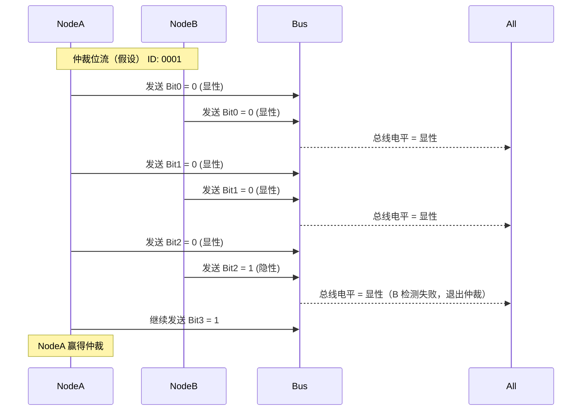

CAN（Controller Area Network）作为嵌入式通信的核心总线之一，广泛用于各类汽车ECU之间的实时数据交互。AUTOSAR 将其抽象为一套标准的软件模块，底层由 MCAL 驱动控制器，中间通过 `CanIf` 接口与上层模块如 `PduR`、`Com` 等交互。本文将全面梳理 AUTOSAR CAN 模块的作用、配置方式以及工程实践中如何识别与处理应用报文。

---
## 模块结构概览

```text
[Application Layer]
    ↑
  [COM / RTE]
    ↑
  [PduR]
    ↑
  [CanIf]
    ↑
  [CAN Driver (Can)] ← 本文重点
    ↑
  [CAN Controller Hardware]
```

* **Can（MCAL）**：硬件抽象层，直接控制寄存器、发送/接收 CAN 帧。
* **CanIf**：接口层，对上统一抽象 Tx/Rx 接口，支持多个 Controller。

## 1. CAN模块功能解析

### 电平定义与隐性/显性位的解释

CAN 协议的物理层采用差分信号，通过 `CAN_H`（高电平线）与 `CAN_L`（低电平线）之间的电压差来表示逻辑位。具体如下：

| 逻辑值 | 状态  | CAN\_H - CAN\_L | 电平行为描述                           |
| --- | --- | --------------- | -------------------------------- |
| 0   | 显性位 | ≥ 1.5V          | 发送器主动驱动 CAN\_H ↑，CAN\_L ↓，表示逻辑 0 |
| 1   | 隐性位 | ≈ 0V            | 两线电压相近（如 2.5V），发送器释放总线           |

#### 为什么 0 是显性，1 是隐性？

* **总线仲裁机制要求**： 在多个节点尝试同时发送时，显性（逻辑 0）会覆盖隐性（逻辑 1），以便根据 ID 的位级比较决定谁赢得总线使用权；优先级高的节点（ID 小）将率先发出显性位，从而获胜。

* **电气层设计原则**： 显性位通过节点主动拉高 CAN\_H、拉低 CAN\_L；隐性位则所有节点都释放总线（不驱动），CAN\_H 与 CAN\_L 电压趋于一致。

* **鲁棒性考虑**： 显性位电压差大，更容易被接收器检测；隐性电平较弱，有利于在存在显性驱动时被压制，确保仲裁正确。

#### 图示说明：显性/隐性与仲裁过程



说明：
- 仲裁从最高位 ID0 开始
- 节点 A 与 B 在前两位都发送相同值（0），总线电平一致
- 第三位（ID2）节点 A 发送 0（显性），节点 B 发送 1（隐性），总线呈现显性 → 节点 B 侦测失败，退出仲裁

* 图中演示两个节点试图同时发送报文：尽管 ID 相同用于简化，但在实际场景中，优先级更高（ID 更小）的节点在关键位发送显性 0，而另一个发送隐性 1；
* 总线电平呈显性，发送隐性位的节点检测到差异后退出仲裁，仲裁过程完成。

💡 提示：该物理机制是实现无冲突多主通信的基础。


### 初始化管理

* `Can_Init()`：配置寄存器、波特率、邮箱等
* `Can_SetControllerMode()`：支持 `START`, `STOP`, `INIT` 等状态切换

### 报文发送流程

```text
Com → PduR → CanIf_Transmit() → Can_Write() → Mailbox → 物理发送
```

### 报文接收流程

```text
CAN中断 → Can_RxInterruptHandler → CanIf_RxIndication → PduR → Com
```

### 中断与轮询支持

* 支持 Tx/Rx 中断方式
* 支持 POLLING（需周期调用 `Can_MainFunction_Write()` 等）

### 错误管理

* BusOff 检测与恢复
* Error Passive / Warning 状态切换

#### 什么是 Warning 与 Error Passive 状态？

CAN 协议中定义了三个错误级别状态，用于反映节点通信的稳定性：

| 状态            | 条件                    | 行为变化                       |
| ------------- | --------------------- | -------------------------- |
| Error Active  | TEC < 128 且 REC < 128 | 正常通信，报文中可主动发送错误标志位         |
| Error Passive | TEC ≥ 128 或 REC ≥ 128 | 降级通信，不再主动发错误帧，发送报文延迟一个 bit |
| BusOff        | TEC > 255             | 节点断开总线，不再通信                |

#### 状态转换规则：

* **从 Error Active → Error Passive**：当 TEC 或 REC ≥ 128
* **从 Error Passive → Error Active**：当 TEC 和 REC 同时 < 128
* **从 Error Passive → BusOff**：当 TEC > 255

#### 工程意义：

* Warning 和 Error Passive 状态不会阻断通信，但说明通信质量下降，应进行诊断记录（DEM）
* 建议监控节点状态变化，以便预警或主动干预（如提前重启 CAN 控制器）
* BusOff 检测与恢复
* Error Passive / Warning 状态切换

### 控制器状态管理

* 状态包括：`CAN_CS_UNINIT`、`CAN_CS_STOPPED`、`CAN_CS_STARTED`
* 不同状态对应不同的硬件使能/禁用状态，应根据系统初始化流程正确调用 `Can_SetControllerMode()` 进行转换

### BusOff 处理策略

#### 什么是 BusOff？

BusOff 是 CAN 协议中定义的一种“自我保护”状态。当一个节点连续多次发送失败（如未收到 ACK），其发送错误计数器 TEC（Transmit Error Counter，发送错误计数器）将不断上升；一旦 TEC > 255，节点将进入 BusOff 状态，彻底从总线上断开，**不再发送或接收任何消息**。

这一机制的设计目的是防止某个故障节点持续干扰总线通信，保护整个系统的稳定性。

#### 触发机制详解

* CAN 控制器发送帧失败时，`TEC` 递增；
* 当 TEC > 255 时，控制器进入 BusOff 状态，完全中止通信；
* 常见触发原因包括：总线短路、ACK 丢失、ID 冲突、未接终端电阻等；

#### 检测方式

* AUTOSAR 系统中，CAN 模块通过中断或轮询方式检测 BusOff；
* 通常调用 `CanIf_ControllerBusOff()` 上报至 CanSM（CAN 状态管理模块）；
* 在 POLLING 模式下，也可由 `Can_MainFunction_BusOff()` 轮询检查；

#### 恢复策略分类

| 策略类型 | AUTOSAR 配置项                 | 说明                                                   |
| ---- | --------------------------- | ---------------------------------------------------- |
| 自动恢复 | `CanBusOffRecovery = TRUE`  | 某些硬件支持 TEC 自动复位，控制器自动退出 BusOff 状态                    |
| 手动恢复 | `CanBusOffRecovery = FALSE` | 上层必须调用 `Can_SetControllerMode(STOPPED → STARTED)` 恢复 |

#### 恢复流程推荐（手动恢复）

```c
if (Can_IsBusOff(controllerId)) {
    Can_SetControllerMode(controllerId, CAN_CS_STOPPED);
    delay_ms(10); // 冷却时间，确保硬件清除状态
    Can_SetControllerMode(controllerId, CAN_CS_STARTED);
}
```

* 建议配合 CanSM 状态机处理，避免多模块竞争控制器模式；

#### 注意事项

* 恢复前必须进入 STOPPED 状态，否则 STARTED 无法生效；
* 某些芯片（如 NXP FlexCAN）需执行特定寄存器重置或等待冷却时间；
* 推荐在恢复流程中记录 DEM（诊断事件）用于故障分析；
* 是否采用自动恢复策略，取决于系统可靠性要求与硬件能力

#### 触发机制详解

* 当 CAN 控制器发送帧发生错误，`TEC（Transmit Error Counter，发送错误计数器）` 会递增；
* 当 TEC > 255 时，控制器进入 BusOff 状态，此时完全断开与 CAN 总线的连接，不再收发数据；
* 常见原因包括：总线短路、ACK 丢失、ID 冲突、终端电阻缺失等；

#### 检测方式

* AUTOSAR 系统中，CAN 模块通过中断或轮询方式检测 BusOff 事件；
* 通常调用 `CanIf_ControllerBusOff()` 上报至 CanSM（CAN 状态管理模块）；
* 在 POLLING 模式下，也可由 `Can_MainFunction_BusOff()` 轮询检查；

#### 恢复策略分类

| 策略类型 | AUTOSAR 配置项                 | 说明                                |
| ---- | --------------------------- | --------------------------------- |
| 自动恢复 | `CanBusOffRecovery = TRUE`  | 某些硬件支持 TEC 自动复位，控制器自动退出 BusOff 状态 |
| 手动恢复 | `CanBusOffRecovery = FALSE` | 需上层手动调用状态切换恢复通信                   |

#### 恢复流程推荐（手动恢复）

```c
if (Can_IsBusOff(controllerId)) {
    Can_SetControllerMode(controllerId, CAN_CS_STOPPED);
    delay_ms(10); // 冷却时间，确保硬件清除状态
    Can_SetControllerMode(controllerId, CAN_CS_STARTED);
}
```

* 建议配合 CanSM 状态机处理，避免多模块竞争控制器模式；

#### 注意事项

* 恢复前必须进入 STOPPED 状态，否则 STARTED 可能不生效；
* 某些芯片需重置内部寄存器或等待冷却周期（如 NXP FlexCAN）；
* 建议在恢复逻辑中记录诊断事件（DEM），方便问题溯源；
* BusOff 触发条件：Tx 错误计数 > 255
* 是否自动恢复由 `CanConfigSet/CanController/CanBusOffRecovery` 决定
* 若配置为手动恢复，则上层需监测 BusOff 并调用 `Can_SetControllerMode(STOPPED → STARTED)` 恢复通信

## 2. 配置关键项详解

### CanController

每个控制器的配置块：

* `CanControllerId`: 控制器编号
* `CanControllerBaudRate`: 波特率（如 500kbps）
* `CanControllerActivation`: 是否激活
* `CanControllerDefaultBaudrate`: 默认波特率索引

### CanHardwareObject

表示实际的邮箱（Tx/Rx Mailbox）：

* `CanObjectId`
* `CanObjectType`: `TRANSMIT` / `RECEIVE`
* `CanIdType`: `STANDARD` / `EXTENDED`

  * `STANDARD`（标准帧）：11 位 ID，范围为 0x000 ～ 0x7FF，应用最广泛，资源消耗低，硬件效率高；
  * `EXTENDED`（扩展帧）：29 位 ID，范围为 0x00000000 ～ 0x1FFFFFFF，支持更多节点，常用于诊断或网关应用，但对硬件资源要求高，处理效率略低。
  * **注意：控制器必须显式支持扩展帧，否则配置无效**；在实际项目中应根据报文 ID 范围选择对应类型。
* `CanHandleType`: `FULL` 或 `BASIC`（具体对比见下方章节）
* `CanHwFilterCode` 与 `CanHwFilterMask`：用于接收过滤配置，支持 ID 掩码匹配 表示实际的邮箱（Tx/Rx Mailbox）：
* `CanObjectId`
* `CanHandleType`: `FULL`（独占）或 `BASIC`（共享）
* `CanObjectType`: `TRANSMIT` / `RECEIVE`
* `CanIdType`: `STANDARD` / `EXTENDED`

  * `STANDARD`（标准帧）：11 位 ID，范围为 0x000 ～ 0x7FF，应用最广泛，资源消耗低，硬件效率高；
  * `EXTENDED`（扩展帧）：29 位 ID，范围为 0x00000000 ～ 0x1FFFFFFF，支持更多节点，常用于诊断或网关应用，但对硬件资源要求高，处理效率略低。
  * **注意：控制器必须显式支持扩展帧，否则配置无效**；在实际项目中应根据报文 ID 范围选择对应类型。
* `CanHwFilterCode` 与 `CanHwFilterMask`：用于接收过滤配置，支持 ID 掩码匹配 表示实际的邮箱（Tx/Rx Mailbox）：
* `CanObjectId`
* `CanHandleType`: `FULL`（独占）或 `BASIC`（共享）
* `CanObjectType`: `TRANSMIT` / `RECEIVE`
* `CanIdType`: `STANDARD` / `EXTENDED`
* `CanHwFilterCode` 与 `CanHwFilterMask`：用于接收过滤配置，支持 ID 掩码匹配

### 多控制器支持

* AUTOSAR 支持一 ECU 配置多个 CAN 控制器（如 CAN0、CAN1）
* 每个控制器拥有独立 `CanController` 配置块及其专属 `CanHardwareObject`
* 各控制器的中断、波特率、回调均可独立配置

### CAN FD 支持（如有）

CAN FD（CAN with Flexible Data-rate）是对经典 CAN 协议的扩展，提供了更高的数据传输效率和更大的数据负载能力。

#### 实现原理

CAN FD 相较于传统 CAN 协议，在**帧结构、比特率控制、数据长度**方面都做了重要改进：

1. **帧结构扩展**

   * CAN FD 帧引入了两个新标志位：

     * **FDF（FD Format）位**：标记该帧为 FD 帧
     * **BRS（Bit Rate Switch）位**：仲裁段之后是否启用高速传输
   * 仲裁段（ID 区段）使用原始速率，**数据段**可切换为更高速率（由 BRS 控制）

2. **数据长度改进**

   * 扩展 DLC（Data Length Code）编码，支持 0～64 字节的数据负载
   * 兼容老设备时需注意：**经典 CAN 控制器无法正确解析 FD 帧**

3. **位填充与 CRC 扩展**

   * FD 帧为保证可靠性，引入**更长的 CRC 校验位**（17 或 21 位）
   * 同时优化位填充机制（Stuff Bit Rules）

4. **硬件依赖性**

   * 仅支持 CAN FD 的控制器（如 Bosch M\_CAN、NXP FlexCAN）可识别 FDF/BRS 位
   * 驱动层（MCAL）必须支持 CAN FD 协议扩展，包括配置速率切换点、发送接口等

#### 主要特性

* **更大的数据载荷**：单帧最大支持 64 字节数据（传统 CAN 为 8 字节）
* **更高的传输速率**：在数据段允许更高的比特率（通常 2\~5 Mbps）
* **帧结构扩展**：增加了 BRS（Bit Rate Switch）与 ESI（Error State Indicator）等新字段

#### AUTOSAR 配置支持

* `CanFdEnable = TRUE`：启用 CAN FD 模式
* `CanControllerFdBaudrate`: 配置数据阶段（数据段）的速率，与仲裁段分开设置
* `CanIdType`: 支持 `STANDARD`, `EXTENDED`, 以及混合 `MIXED` 模式
* `CanFdPaddingValue`: 不足 64 字节时的填充值配置（用于防止数据泄露）

#### 使用建议

* **确认硬件支持 CAN FD**（如 Bosch M\_CAN、NXP FlexCAN 等）
* **MCAL 驱动需实现 CAN FD 接口扩展**（如 `Can_WriteFd()`）
* 与 CANoe、CANalyzer 等工具兼容性需验证（特别是波特率切换点）

#### 工程注意事项

* CAN FD 与经典 CAN 可共存于一条总线，但经典 CAN 节点无法解析 FD 帧 → 需合理规划网络节点兼容性
* 调试时关注仲裁段与数据段是否分别使用不同速率，并正确配置同步跳跃宽度（SJW）
* 部分 CAN FD 控制器对帧长度支持有限（可能仅 8/12/16/20/64）

#### 示例配置片段（伪 XML）

```xml
<CanController>
  <CanFdEnable>true</CanFdEnable>
  <CanControllerBaudRate>500</CanControllerBaudRate> <!-- Arbitration Phase -->
  <CanControllerFdBaudrate>2000</CanControllerFdBaudrate> <!-- Data Phase -->
</CanController>
```

通过 CAN FD，可有效提高诊断、OTA 等大数据传输场景的通信性能，是未来汽车电子通信的重要方向。

CAN FD（CAN with Flexible Data-rate）是对经典 CAN 协议的扩展，提供了更高的数据传输效率和更大的数据负载能力。

#### 主要特性

* **更大的数据载荷**：单帧最大支持 64 字节数据（传统 CAN 为 8 字节）
* **更高的传输速率**：在数据段允许更高的比特率（通常 2\~5 Mbps）
* **帧结构扩展**：增加了 BRS（Bit Rate Switch）与 ESI（Error State Indicator）等新字段

#### AUTOSAR 配置支持

* `CanFdEnable = TRUE`：启用 CAN FD 模式
* `CanControllerFdBaudrate`: 配置数据阶段（数据段）的速率，与仲裁段分开设置
* `CanIdType`: 支持 `STANDARD`, `EXTENDED`, 以及混合 `MIXED` 模式
* `CanFdPaddingValue`: 不足 64 字节时的填充值配置（用于防止数据泄露）

#### 使用建议

* **确认硬件支持 CAN FD**（如 Bosch M\_CAN、NXP FlexCAN 等）
* **MCAL 驱动需实现 CAN FD 接口扩展**（如 `Can_WriteFd()`）
* 与 CANoe、CANalyzer 等工具兼容性需验证（特别是波特率切换点）

#### 工程注意事项

* CAN FD 与经典 CAN 可共存于一条总线，但经典 CAN 节点无法解析 FD 帧 → 需合理规划网络节点兼容性
* 调试时关注仲裁段与数据段是否分别使用不同速率，并正确配置同步跳跃宽度（SJW）
* 部分 CAN FD 控制器对帧长度支持有限（可能仅 8/12/16/20/64）

#### 示例配置片段（伪 XML）

```xml
<CanController>
  <CanFdEnable>true</CanFdEnable>
  <CanControllerBaudRate>500</CanControllerBaudRate> <!-- Arbitration Phase -->
  <CanControllerFdBaudrate>2000</CanControllerFdBaudrate> <!-- Data Phase -->
</CanController>
```

通过 CAN FD，可有效提高诊断、OTA 等大数据传输场景的通信性能，是未来汽车电子通信的重要方向。

* `CanFdEnable`: 启用 CAN FD 模式
* `CanControllerFdBaudrate`: 配置数据阶段波特率
* `CanIdType`: 可为 `STANDARD`, `EXTENDED`, `MIXED`
* 注意硬件与 MCAL 驱动需支持 FD 才可使用

### FULL vs BASIC 类型选择

#### 什么是 `CanHandleType`？

`CanHandleType` 表示该硬件对象（Mailbox）在发送数据时的使用方式，决定了发送资源是否独占、是否支持并发调度。

#### FULL（独占）类型

* 每一个 `CanHardwareObject` 对应一个独立的发送缓冲区（Tx Mailbox）；
* 同时支持多个报文发送，不会相互排队干扰；
* 支持帧优先级调度（ID 越小优先级越高）；
* 推荐用于：**诊断响应报文、多帧分段报文、关键功能性周期报文**。

#### BASIC（共享）类型

* 所有 `BASIC` 类型报文共用一个 FIFO 队列（硬件仅支持单个发送缓冲区）；
* 报文按 FIFO 先进先出方式排队发送，后发报文需等待；
* 无法并发处理多个发送请求，也不支持优先级调度；
* 适用于：**低优先级的应用周期报文、测试报文、调试报文等**。

#### 类型对比表格

| 类型     | 是否独占缓冲区       | 是否支持并发          | 是否支持优先级 | 推荐使用场景         |
| ------ | ------------- | --------------- | ------- | -------------- |
| FULL   | ✅ 是           | ✅ 是             | ✅ 是     | 应用周期、诊断响应等关键报文 |
| BASIC  | ❌ 否           | ❌ 否             | ❌ 否     | 低优先级/简单周期报文    |
| ------ | ----------    | ------          |         |                |
| FULL   | 应用周期报文、诊断响应   | 独占缓冲区，支持并发，优先级高 |         |                |
| BASIC  | 低优先级报文、共用发送资源 | 排队发送，适合节省资源     |         |                |

### POLLING vs INTERRUPT 模式

| 模式        | 优点          | 缺点         | 推荐场景         |
| --------- | ----------- | ---------- | ------------ |
| POLLING   | 降低中断压力，调度统一 | 需要周期任务轮询   | 周期性报文、大量数据通信 |
| INTERRUPT | 实时响应快       | 系统负担重，复杂性高 | 诊断响应、事件触发报文  |

## 3. 报文识别：如何判断是否为应用报文

对于发送方或接收方，正确识别“应用报文”是配置 `CanHardwareObject` 类型与传输策略的前提。

### 判断标准（Rx方向）：

1. **PduR 路由路径是否为：** `CanIfRxPdu` → `PduR` → `Com`
2. **是否由 Com 模块解析为信号？**（存在于 `ComSignal`、`ComRxIPdu`）
3. **是否被 RTE 或应用任务读取？**（如 `Rte_Read_Speed()`）
4. **是否周期性数据报文？**

### 非应用报文特征：

* 路由到 `Dcm`、`CanNm`、`CanTp`
* 报文 ID 为诊断类（0x7E8/0x7DF等）
* 名称包含 Diag/Nm/Tp 等关键词

## 4. 诊断响应报文为何不用 BASIC + INTERRUPT？

尽管 `BASIC + INTERRUPT` 理论上可用，但在实际工程中并不推荐用于诊断响应报文，原因如下：

### 原因 1：实时性要求高

UDS 等诊断协议要求 ECU 必须在固定时间窗口内响应（如 50ms），若使用 BASIC 类型缓冲区，一旦 FIFO 被占用，诊断响应会延迟甚至超时。

### 原因 2：多帧传输要求并发性

诊断响应可能涉及多帧（如 DTC 报告），需要持续发送，BASIC 类型不支持并发多个 Tx 报文，容易阻塞。

### 原因 3：共享资源冲突

使用 BASIC 意味着多个 Tx 报文共用 FIFO，诊断报文可能与周期应用报文互相干扰，导致时序不可控。

### 原因 4：中断价值无法充分发挥

诊断传输（如 CanTp）依赖中断反馈进行下一帧调度，BASIC 仅支持一个 Tx，不能支持并发传输中的精确中断反馈。

### 推荐配置

| 报文类型   | CanHandleType | ProcessingType | 说明       |
| ------ | ------------- | -------------- | -------- |
| 诊断响应报文 | FULL ✅        | INTERRUPT ✅    | 实时、独立、可靠 |
| 周期应用报文 | FULL / BASIC  | POLLING        | 资源可控     |

## 5. 实战配置建议

### 应用报文配置

| 项目               | 推荐配置                                           |
| ---------------- | ---------------------------------------------- |
| `CanHandleType`  | FULL                                           |
| `CanObjectType`  | TRANSMIT / RECEIVE                             |
| `ProcessingType` | POLLING（周期帧）或 INTERRUPT（诊断响应）                  |
| 配套配置             | `Can_MainFunction_Write()` / `Read()` 在周期任务中调用 |

### 示例 XML 配置片段（简化）

```xml
<CanHardwareObject>
  <CanObjectId>0</CanObjectId>
  <CanHandleType>FULL</CanHandleType>
  <CanObjectType>TRANSMIT</CanObjectType>
  <CanIdType>STANDARD</CanIdType>
  <CanControllerRef>CanController_0</CanControllerRef>
</CanHardwareObject>
```

## 6. 常用 API 接口

| API                                 | 功能               |
| ----------------------------------- | ---------------- |
| `Can_Init()`                        | 初始化控制器与对象        |
| `Can_Write()`                       | 发送报文             |
| `Can_SetControllerMode()`           | 控制启动/停止          |
| `Can_DisableControllerInterrupts()` | 关闭中断             |
| `Can_EnableControllerInterrupts()`  | 启用中断             |
| `Can_MainFunction_Write()`          | POLLING 模式下处理 Tx |
| `Can_MainFunction_Read()`           | POLLING 模式下处理 Rx |

## 7. 总结与建议

* ✅ **应用层周期报文：使用 **`CanHandleType = BASIC` + `ProcessingType = POLLING`** 是主流组合**
* ✅ **诊断响应报文：使用 **`CanHandleType = FULL` + `ProcessingType = INTERRUPT`** 实现及时发送**
* ✅ **Rx 报文是否为应用层，关键看 PduR 路由和 Com 配置**
* ✅ **充分利用工具自动生成配置，结合工程需求适配 Mailbox 策略**
* ✅ **关注 BusOff 恢复策略与 ID 过滤配置，避免运行期问题**
* ✅ **多控制器、多帧并发、CAN FD 特性可根据平台灵活启用**
