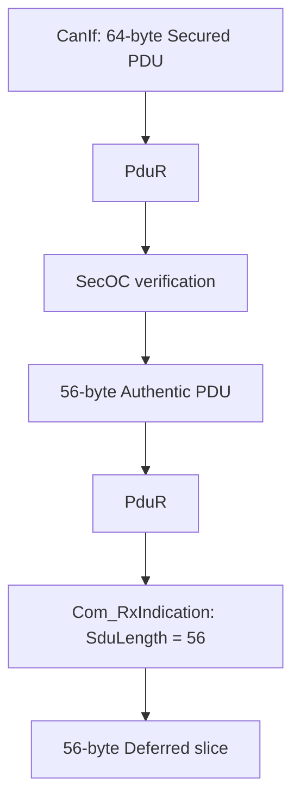
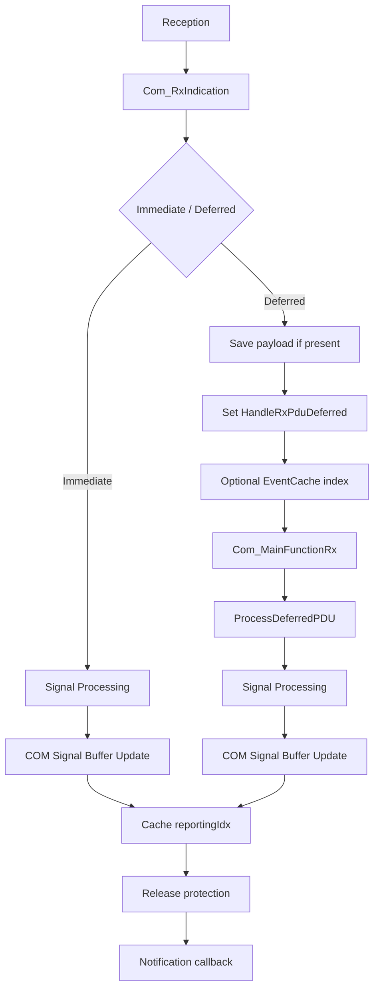

在 AUTOSAR COM 的配置里，`ComIPduSignalProcessing` 看起来只是一个很简单的选择：

```text
IMMEDIATE
DEFERRED
```

直觉上，它们似乎只是在回答一个问题：收到 I-PDU 以后，是立即处理 Signal，还是等到 `Com_MainFunctionRx()` 再处理？

但真正沿着 Vector MICROSAR COM 的生成代码往下追，会发现 `DEFERRED` 远不只是“晚一点执行”。为了把一次 reception 从接收调用链迁移到周期处理路径，Vector 还需要解决一系列更具体的问题：原始 PDU 在哪里保存？同一个 PDU 连续到达多次怎么办？MainFunction 如何知道哪些 PDU 有待处理工作？用于加速查找的 EventCache 满了怎么办？Signal 更新期间为什么要关中断保护？既然已经搬到 MainFunction，为什么还要周期性释放 protection？Notification 又为什么不直接在 Signal Processing 中调用？

这些问题串在一起以后，`DEFERRED` 才显露出它真正的实现轮廓：它是一套围绕**静态内存、pending 状态、latest-state 合并、调度边界和实时性保护**构建的接收模型。

本文基于一套实际的 Vector MICROSAR COM 生成代码分析。所分析的 COM 软件版本为 v28.1.3，生成工具为 DaVinci Configurator Classic 5.31.55 SP5；`Com.h` 中声明的 COM AUTOSAR compatibility 为 4.0.3。这里的版本信息只用于限定本文源码结论的适用范围，不能据此推导整个 ECU 工程的 AUTOSAR 版本，也不能把 Vector 的具体实现方式泛化成 AUTOSAR COM 的唯一实现。

## 一、Deferred 到底把什么延后了？

先从两条接收路径看起。

在 Immediate 路径中，`Com_RxIndication()` 的 reception call chain 会继续进入 Immediate Processing，并在当前调用链内执行 I-PDU 的 Signal Processing：

```text
Com_RxIndication
    ↓
Immediate Processing
    ↓
ProcessImmediatePDU
    ↓
Signal / SignalGroup Processing
```

Deferred 路径则不同。`Com_RxIndication()` 并不在这次 reception call chain 中继续解析 Signal，而是先记录一份“以后还需要处理”的接收状态：

```text
Com_RxIndication
    ↓
Deferred Processing
    ↓
保存 payload（如果存在）
记录 pending state
    ↓
返回

        ……

Com_MainFunctionRx
    ↓
ProcessDeferredPDU
    ↓
Signal / SignalGroup Processing
```

所以从当前源码能直接看到的核心差异，是 **Signal Processing 的执行位置发生了迁移**。

这里需要避免一个常见但没有证据支撑的说法：`Com_RxIndication()` 并不能在本文中直接等同于“ISR context”。它最终可能从什么上下文被调用，取决于具体下层调用链和系统集成。因此更准确的描述是：Immediate 在 `Com_RxIndication` 的 reception/caller context 中完成 Signal Processing，而 Deferred 把这部分工作交给后续的 `Com_MainFunctionRx()`。

从工程结构上看，这可以理解为一种 **Reception Path Minimalism**：接收路径只保留当前 reception 必需完成的工作，把更复杂的 Signal 解析、过滤和更新迁移到可调度的处理路径。但“降低 ISR latency”属于工程解释，而不是当前源码中明确写出的 Vector 设计意图。

## 二、不立即解析，报文数据放在哪里？

一旦 Signal Processing 被延后，第一个问题马上出现：`Com_RxIndication()` 返回以后，原始 PDU 数据总不能跟着消失。

一个很自然的猜想是，Generator 会为每个 Deferred PDU 生成一个独立数组：

```text
RxPdu_A_Buffer[]
RxPdu_B_Buffer[]
RxPdu_C_Buffer[]
...
```

Vector 当前实现并不是这样。

它生成的是一个统一的 `uint8` flat buffer：

```c
Com_RxDefPduBuffer[RX_DEF_BUFFER_SIZE];
```

每个真正需要保存 payload 的 Deferred Rx PDU，通过生成的 `RxDefPduBufferStartIdx` 和 `RxDefPduBufferEndIdx` 占用其中一段连续 slice：

```text
Com_RxDefPduBuffer

0                                                     N
│                                                     │
├── RxPdu_A ──┼──── RxPdu_B ────┼── RxPdu_C ────────┤
```

这组索引采用 `[StartIdx, EndIdx)` 形式，因此：

```text
slice size = EndIdx - StartIdx
```

`EndIdx` 是 exclusive。

更有意思的是，这个总 Buffer 长度并不是一个单独配置出来的“COM Deferred Buffer Size”。沿配置反查可以看到，每个 payload Deferred PDU 的 slice capacity 来自它经 `ComPduIdRef` 引用的 EcuC PDU `PduLength`；Generator 再把这些 per-PDU capacity 连续静态排布，最终得到整个 `Com_RxDefPduBuffer` 的总长度。

也就是说，这条链路更接近：

```text
EcuC PduLength
      ↓
ComPduIdRef
      ↓
Generator
      ↓
per-PDU slice capacity
      ↓
连续静态 packing
      ↓
Com_RxDefPduBuffer[]
```

这比“给每个 PDU 动态申请一块内存”更符合经典嵌入式系统的资源模型：RAM 占用在生成期确定，运行时只做基于索引的地址访问，不依赖动态内存分配。

### copy 长度为什么还要再取一次 min？

Deferred reception 保存 payload 时，当前实现并不是无条件按照接收到的 `SduLength` 去拷贝，而是把实际 copy 长度限制为：

```text
copyLength = min(
    generated RxDefPduBuffer capacity,
    PduInfoPtr->SduLength
)
```

源码能够直接说明的只有两件事：

```text
copyLength <= generated capacity
copyLength <= received SduLength
```

从行为上，可以把它理解为一层 runtime copy boundary protection；但这是工程解释，不能写成 Vector 官方声明的设计目的。

## 三、一个反直觉的例外：Deferred PDU 不一定需要 payload buffer

如果分析只停在普通 PDU，很容易形成一个错误印象：

> 只要是 Deferred，就一定要占一段 `RxDefPduBuffer`。

实际生成配置里存在一个很好的反例。这里将业务符号脱敏为 `ZeroBitSyncPdu`：

```text
ZeroBitSyncPdu

PduLength        = 0
SignalProcessing = DEFERRED
Signal type      = ZEROBIT
RxDefPduBuffer   = none
Deferred Handle  = yes
```

它是一个真正的 Deferred PDU，却没有任何 payload byte，因此 Generator 没有给它分配 `RxDefPduBuffer` slice。

这说明了一个非常重要的区别：

```text
Deferred payload storage
```

和：

```text
Deferred pending state
```

不是同一个概念。

对于普通 Deferred PDU，需要保存：

```text
payload + pending state
```

而对于当前这个 ZeroBit PDU，只需要：

```text
pending state
```

因为它根本没有 payload 可以保存。

这个特殊案例，正好解释了 Vector 源码里另一个一开始很容易让人忽略的细节：`SduLength + 1`。

## 四、为什么 `HandleRxPduDeferred` 存的是 `SduLength + 1`？

Deferred reception 完成后，Vector 会设置类似下面的状态：

```c
HandleRxPduDeferred = PduInfoPtr->SduLength + 1u;
```

源码旁边还有一条非常关键的 Vector 注释，其含义明确指向 ZeroBit PDU：通过保存 `SduLength + 1` 来标记 PDU 已经被存储，因为必须支持 ZeroBit PDU。

为什么不能直接保存 `SduLength`？

假设直接这样做：

```text
Handle = SduLength
```

那么系统马上会遇到状态冲突：

```text
没有 pending reception       → 0
收到一个 zero-length PDU     → 0
```

两个语义都变成了 0。

而 `SduLength + 1` 把状态空间错开以后：

```text
Handle = 0
→ no pending

Handle = 1
→ pending zero-length PDU

Handle = N + 1
→ pending PDU, actual length = N
```

MainFunction 消费 Deferred PDU 时再通过：

```text
actualLength = Handle - 1
```

恢复真正的 `SduLength`。

### ZeroBit PDU 的 runtime 是怎么跑通的？

以脱敏后的 `ZeroBitSyncPdu` 为例，接收时：

```text
SduLength = 0
```

因为它没有 `RxDefPduBuffer`，payload memcpy 分支不会发生；但 Deferred Handle 仍然被设置为：

```text
0 + 1 = 1
```

到了 `Com_MainFunctionRx()`：

```text
Handle = 1 > 0
→ 当前存在 pending work

actualLength = 1 - 1 = 0
SduDataPtr   = NULL_PTR
```

它对应的 ZeroBit Signal 配置 `ValidDlc = 0`，并且 Signal Processing 的相关分支在 `SduDataPtr == NULL_PTR` 时不会尝试读取 payload；由于也没有实际的 Rx Signal Buffer，数据 copy 同样成为 no-op。

但这并不妨碍这次 reception 继续进入已经配置好的 reporting/notification 处理路径。

于是这个案例把 `HandleRxPduDeferred` 的意义暴露得非常清楚：它不只是“记录 Buffer 里有多少字节”，更是在表达：

> **有没有一份尚未消费的 reception work。**

对于 ZeroBit PDU，payload 可以不存在，但 reception state 仍然存在。

## 五、同一个 Deferred PDU 连续到达三次，会保存三份吗？

有了 flat buffer 和 pending state，另一个问题就出现了。

假设同一个 `RxPdu_A` 在 MainFunction 消费前连续到达三次：

```text
RxPdu_A(data1)
RxPdu_A(data2)
RxPdu_A(data3)
```

它们会不会形成一个三元素 FIFO？

不会。

同一个 PDU 始终写入同一段静态 slice：

```text
RxDefPduBuffer[RxPdu_A]

data1
  ↓ overwrite
data2
  ↓ overwrite
data3
```

与此同时，`HandleRxPduDeferred` 只需要表达“当前有 pending work”，而不是保存 reception 次数。

如果 EventCache 功能启用，producer 侧也会先检查该 PDU 当前是否已经 pending：只有尚未 pending 时才需要把 PDU index 放进 EventCache；之后重复 reception 仍然可以继续覆盖 payload，但没有必要反复压入相同的 work index。

这可以抽象成 **Latest-State Coalescing**：在同一 Deferred PDU 当前 pending work 尚未被 `ProcessDeferredPDU()` 消费前，后续 reception 可以覆盖同一 slice 中更早的数据。

这里不能把结论扩大成“Deferred 永远只处理最后一帧”。准确边界是**当前 pending interval**。一旦 MainFunction 已经开始消费这份 work，之后新到达的 reception 将形成新的 pending 状态；具体交错还受到当前 protection 和调用时序约束。

所以 Deferred Buffer 从来就不是一个 per-frame message queue，它更接近一份 per-PDU latest-state storage。

## 六、MainFunction 怎么知道哪些 PDU 有待处理数据？

到这里其实已经出现了三个概念：

```text
RxDefPduBuffer
HandleRxPduDeferred
EventCache
```

它们很容易被混在一起，但职责完全不同：

```text
RxDefPduBuffer
→ 数据是什么

HandleRxPduDeferred
→ 有没有 pending work

EventCache
→ 去哪里更快地找到 pending work
```

其中真正承载 correctness state 的是 `HandleRxPduDeferred`。EventCache 更像是一份 work discovery index。

如果系统配置了大量 Rx PDU，而一个周期里真正 pending 的只有少数几个，逐项 full scan 显然会做很多无效检查。EventCache 的价值就在这里：producer 在首次进入 pending 时把对应的 `RxPduInfoIdx` 放进 cache，MainFunction 后续优先从 cache 中取出需要处理的 PDU。

但当前分析的实际配置中 EventCache 并未启用，因此 runtime 走的是 full-scan 路径。下面对 EventCache 的讨论来自同一版本 Vector 源码中的可配置实现路径，而不是当前项目的 runtime trace。

## 七、EventCache 满了，为什么 Deferred 功能仍然成立？

一个性能索引真正有意思的地方，不是正常情况，而是它失效的时候。

Producer 侧，当 `Com_EventCache_Put()` 发现 cache 已满，会返回 `E_NOT_OK`，并不会覆盖已有的 cache entry。

关键在于：**EventCache Put 失败，并不会阻止后面的 Deferred reception state 更新。**

也就是说，payload slice 和 `HandleRxPduDeferred` 仍然可以被正常更新：

```text
EventCache_Put
      ↓ full
    E_NOT_OK
      ↓
仍然更新 payload / pending state
```

Consumer 侧，如果 MainFunction 发现 EventCache 已经 full，或者 cache iteration 达到相应 read limit，会 Flush EventCache 并切换到 fallback full scan：

```text
EventCache fast path
      ↓
cache full / fallback required
      ↓
Flush cache index
      ↓
IterateOverAllRxPdus
      ↓
检查 HandleRxPduDeferred
```

Flush 的对象是 EventCache 自己的索引状态，并不会清除 `RxDefPduBuffer` 或 `HandleRxPduDeferred`。

所以更加准确的说法不是“EventCache 保证不丢报文”，而是：

> **EventCache entry 的缺失不会让已经记录在 payload/pending state 中的 work 变得不可发现。**

这与“保存每一次 received frame”是两回事。前面已经看到，同一个 PDU 在 pending interval 内本身就可能发生 latest-state coalescing。

从设计角度，可以把这套结构概括成：

```text
Fast Path
    EventCache
       ↓ failure
Correctness Fallback
    Full Scan + Handle
```

也就是：**状态是真相，索引只是优化。**

## 八、Deferred 已经搬到 MainFunction，为什么还不能一直处理到底？

把 Signal Processing 从 reception call chain 搬到 MainFunction，并不意味着实时性问题自然消失了。

原因在于，MainFunction 自己的 Signal Processing 同样需要保护 COM 内部共享状态。

当前实现中：

```text
SchM_Enter_Com_COM_EXCLUSIVE_AREA_RX()
        ↓
SuspendAllInterrupts()
```

继续沿 OS 源码往下，可以看到 `SuspendAllInterrupts()` 进入 `Os_Api_SuspendAllInterrupts()`，并最终调用 interrupt suspension 逻辑。当前 OS 源码的注释明确说明，这会禁用**当前执行 core 的 Category 1 + Category 2 ISR delivery**。

因此不能把它写成“关闭整个多核 MCU 的所有中断”。当前证据只证明了 core-local interrupt delivery suspension。

MainFunction 中的 Deferred Signal Processing、COM Signal Buffer 更新等内部状态操作位于这段 protection 之内。如果 MainFunction 在进入 protection 以后连续扫描和处理大量 PDU，并且始终不退出，那么当前 core 上受影响的 interrupt service 就会持续推迟。

从工程上，这意味着潜在的 interrupt latency 和 jitter 会增加。

但这里同样要控制结论边界：源码并不能直接证明“CAN FIFO 一定 overflow”“一定丢帧”或者“一定 deadline miss”。这些结果还取决于实际执行时间、总线负载、硬件 FIFO 深度和系统调度等运行时条件。

Vector 接下来使用的 `Com_ISRThreshold`，正是在这个上下文里才真正容易理解。

## 九、ISRThreshold：给连续 protected work 切片

`Com_ISRThreshold` 不是一个“固定时间片”机制，它实际控制的是连续 protected processing 可以推进多少次检查，再创造一次 release opportunity。

当前配置里的 Threshold Value 为 1。对应的 decrement 逻辑并不是“处理一个 PDU 就释放一次”，而是：

| ThresholdCheck | Counter Before | Counter After | Return | Release |
|---:|---:|---:|---|---|
| 1 | 1 | 0 | TRUE | No |
| 2 | 0 | 0 | FALSE | Yes |
| 3 | 1 | 0 | TRUE | No |
| 4 | 0 | 0 | FALSE | Yes |

因此，在当前 full-scan 路径下，每两次 `ThresholdCheck` 会产生一次 release opportunity。

这里的单位尤其重要：**不是“每两个 pending PDU”**。

原因是 full-scan loop 中，即使当前这个 Rx PDU 没有 pending work，循环末尾仍然会执行 `ThresholdCheck`。所以更加准确的描述是按 RxPdu/loop iteration 计数。

当 threshold 到达释放点时，源码结构大致是：

```text
ExitExclusiveArea
      ↓
ProcessRxFctPtrCache
      ↓
EnterExclusiveArea
```

这意味着同一个 release window 做了两件事：

1. 暂时恢复当前 core 的 interrupt delivery；
2. 在 protection 外执行已经缓存的 Rx notification callback。

从结构上可以把它理解成一种 **Work-Bounded Protection**：Deferred 把复杂处理迁到 MainFunction 以后，又通过 work-count threshold 避免 MainFunction 长时间连续占用同一 protection 区间。

它并不提供固定的微秒级 WCET；没有 runtime benchmark，也不能量化一次 release 能改善多少 interrupt latency。

## 十、Notification 为什么还要再缓存一次？

很多人第一次看到这里会产生一个疑问：Signal 已经处理完、COM Buffer 也已经更新了，为什么不直接调用上层 callback？为什么还要再放进 Notification Cache？

当前 Rx 路径的源码边界非常清楚：

```text
LOCKED
│
├─ Signal Processing
├─ Filter / validity processing
├─ COM Signal Buffer update
└─ cache reportingIdx

UNLOCKED
│
└─ process cached notification callback
```

也就是说，COM 内部状态更新和外部 callback execution 被放在不同的 protection 区域。

Notification Cache 保存的也不是 Signal data，更不是直接的 callback pointer，而是一个 `reportingIdx`。真实映射中间还存在一层 `Com_Reporting[]`：

```text
reportingIdx
    ↓
Com_Reporting[reportingIdx]
    ↓
MultiIndirection2FuncPtrIdx
    ↓
Com_Notifications[notificationIdx]
    ↓
callback
```

这也是为什么把 `reportingIdx` 直接称为“function pointer index”并不准确。

从工程上，这种结构的一个明显作用，是避免在 COM 内部 protected processing 中直接执行外部、执行时间未知、并且可能再次调用 COM API 的代码。但这属于对结构的工程解释，而不是源码中的作者意图注释。

### Notification 传的是“事件”，不是 Signal value

真实的 RTE callback 调用结构还能说明另一个容易混淆的问题。

脱敏后可以抽象为：

```c
void Rte_COMCbk_SignalA(void)
{
    SignalType value;

    (void)Com_ReceiveSignal(ComSignal_SignalA, &value);
    Rte_SignalA = value;
}
```

这里的 callback 本身没有携带 Signal value。Notification 的作用是形成 control flow：告诉上层“这里有一次 configured notification”。真正的数据读取仍然通过 `Com_ReceiveSignal()` 从 COM Signal Buffer 完成。

因此可以把两条链明确分开：

```text
Control Flow
COM → Notification → RTE callback

Data Flow
COM Signal Buffer → Com_ReceiveSignal → RTE variable → SWC
```

这也解释了为什么 EventCache、Notification Cache、RTE DataReceivedEvent、OS Event 不能因为都带有“event”概念就混成同一个东西。本文只讨论已经从当前 Rx 路径中得到源码证据的这两条链。

## 十一、为什么总线侧是 64 bytes，COM 最终却只看到 56 bytes？

在分析 Deferred Buffer sizing 时，还有一个非常容易误判的案例。

假设一个脱敏后的安全接收 PDU `SecureRxPdu_A`，CanIf 侧接收到的是 64-byte PDU，而 COM 侧生成的 Deferred slice 却只有 56 bytes。

如果只对着两个数字看，很容易得出错误结论：

```text
CanIf 收到 64 bytes
    ↓
COM buffer 只有 56 bytes
    ↓
COM 把后 8 bytes 截掉了
```

真实路径并不是这样。

沿 PduR 和 SecOC 路由继续追踪以后，会发现 64 bytes 和 56 bytes 根本不是同一个抽象层的 PDU：



SecOC 在 verification 成功后构造新的 `PduInfoType`，其中 `SduLength` 使用 Authentic PDU 的实际长度。所以 COM 最终收到的是：

```text
SduLength = 56
```

而不是 64。

当前 SecOC 配置中还可以继续对上这 8-byte 差值：

```text
SecOCAuthInfoTruncLength        = 48 bit = 6 bytes
SecOCFreshnessValueTruncLength = 16 bit = 2 bytes
```

因此当前配置对应：

```text
64-byte Secured PDU
=
56-byte Authentic PDU
+ 6-byte truncated authentication information
+ 2-byte truncated freshness value
```

这里应当使用“authentication information”这一配置层术语，而不自行扩展成 MAC、CMAC 或 signature，因为本文没有进一步证明具体密码学算法。

这也顺便解释了前面 `copyLength = min(...)` 在这个案例中的实际行为：

```text
min(56, 56) = 56
```

COM 根本没有在正常路径中执行 64→56 的 truncation；真正的抽象转换已经发生在 SecOC 的 Secured PDU → Authentic PDU 过程中。

这个例子很重要，因为它提醒我们：**比较不同 BSW 层的 PDU length 之前，首先要确认它们是不是同一个 PDU identity。** 单纯拿 CanIf DLC 和 COM buffer capacity 做数值比较，很容易跨抽象层得出错误结论。

## 十二、把这些机制放在一起：Deferred 真正构建的是什么？

走到这里，可以把整个 Rx Deferred 路径重新放到一张图里：



这里其实没有一个“万能队列”。每个结构只解决一个问题：

- `RxDefPduBuffer`：保存尚未解析的 payload；
- `HandleRxPduDeferred`：保存 pending state，并编码实际长度；
- EventCache：提供可选的 work discovery fast path；
- `Com_ISRThreshold`：限制连续 protected work 的推进长度；
- Notification Cache：把 COM 内部状态处理与外部 callback execution 分隔开。

这也是这套实现最值得借鉴的地方：**数据、状态、索引、调度和外部执行边界没有被混成一种机制。**

## 十三、从源码中可以抽象出的九条设计原则

### 1. Reception Path Minimalism

Deferred 的核心不是“延迟”这个时间概念，而是把 Signal Processing 从 reception call chain 迁移到 scheduled processing path。接收路径负责留下以后能够继续处理所必需的状态。

### 2. Static Memory Planning

payload Deferred PDU 的 `PduLength` 在生成期转换为固定 slice，所有 slice 再组成 flat `RxDefPduBuffer`。这让 RAM 使用和地址关系在生成期确定。

### 3. Latest-State Coalescing

同一个 Deferred PDU 在当前 pending work 被消费前重复到达时，可以覆盖同一 slice 中的旧 payload。它不是 per-frame FIFO，而是更接近 per-PDU latest-state storage。

### 4. State Before Index

`HandleRxPduDeferred` 承载真实 pending state，EventCache 只是查找这份状态的性能索引。索引可以 fallback，真实状态不能依赖索引是否成功写入。

### 5. Fast Path With Correctness Fallback

EventCache 是 fast path；cache full 或其它 fallback 条件出现后，full scan 仍然可以通过 Handle 找回 pending work。

### 6. Sentinel Encoding

`SduLength + 1` 同时编码 pending 与 PDU length，使 `0 = no pending` 与 `1 = pending zero-length PDU` 可以共存。ZeroBit PDU 是这个设计最直观的真实案例。

### 7. Data Flow / Control Flow Separation

Notification callback 负责形成 control flow；真正的 Signal value 仍然从 COM Signal Buffer 经 `Com_ReceiveSignal()` 读取。事件通知和数据传递没有绑定在同一个参数通道里。

### 8. Internal / External Execution Boundary

COM 内部 Signal Processing 和 Buffer update 位于 protection 内，外部 Notification callback 则在退出 protection 后执行。内部共享状态与外部代码执行被明确分隔。

### 9. Work-Bounded Protection

MainFunction 虽然已经脱离 reception call chain，但内部 processing 仍然可能位于 interrupt protection 之下。ISRThreshold 通过 work-count 产生周期性 release opportunity，避免连续 protected work 无限制延长。

## 十四、分析边界

本文刻意没有把所有观察扩展成“Vector COM 的普遍规则”。有几项结论仍然只适用于当前分析范围。

首先，当前工程没有可用于验证 `DynamicLength = true` 的 Deferred Rx PDU，因此本文关于 `PduLength → fixed slice` 的分析只覆盖已经观察到的静态长度配置，不能直接外推动态长度 PDU 的 Buffer sizing 规则。

其次，SecOC 部分只追踪了 verification 成功后 Secured PDU 转换为 Authentic PDU 的正常接收路径；verification failure 时的 forwarding/drop 行为不在本文结论范围内。

EventCache 在当前配置中没有实际启用，因此它的 producer、overflow 和 fallback 行为来自同版本 Vector 源码的配置路径分析，而不是当前项目 runtime trace。

ISRThreshold 的代码可以证明 work-count 和 release opportunity 的关系，但没有微秒级 benchmark，因此本文不量化它对 interrupt latency 的实际改善。

另外，当前 protection 分析能够证明的是当前 OS 实现中的 core-local Cat1/Cat2 interrupt delivery suspension，不能由此泛化整个多核系统中的跨 core COM synchronization 策略。

最后，ZeroBit PDU 的 runtime 已经能够证明其进入 configured reporting/notification path，但本文没有闭环其具体业务 callback，因此公开文章不写任何真实 callback 名或业务语义。

## 结语

如果只停留在 DaVinci 配置界面，`IMMEDIATE / DEFERRED` 很容易被理解成一个“现在处理还是以后处理”的简单开关。

但源码真正展示的是另一幅图景：

```text
Reception
   ↓
Static payload storage
   +
Pending state
   ↓
Latest-state coalescing
   ↓
Optional fast index
   ↓
Scheduled Signal Processing
   ↓
Work-bounded protection
   ↓
Notification staging
   ↓
External callback
```

Deferred 的价值不在某一个函数，而在这些职责如何被拆开：payload 归 payload，pending 归 pending，索引只是索引，内部状态更新和外部 callback 也各自处在不同执行边界。

从这个角度看，Vector COM Rx Deferred 最值得学习的并不是“某个 API 怎么调用”，而是一种很典型的嵌入式软件设计思路：**先把真实状态保存下来，再把性能优化、调度策略和外部执行边界逐层叠加上去，并确保优化路径失效时，correctness state 仍然成立。**
