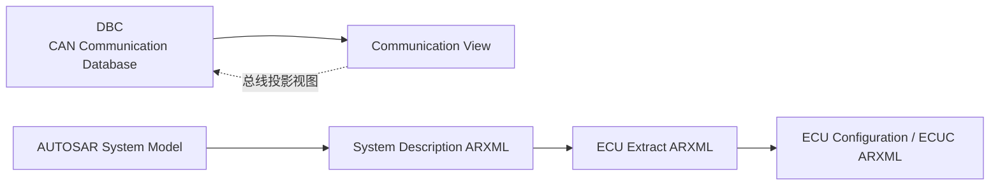
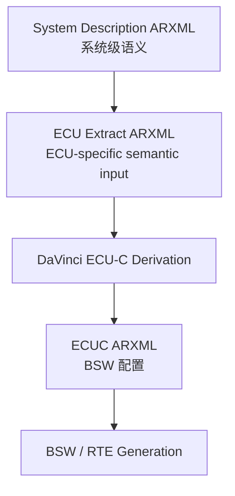
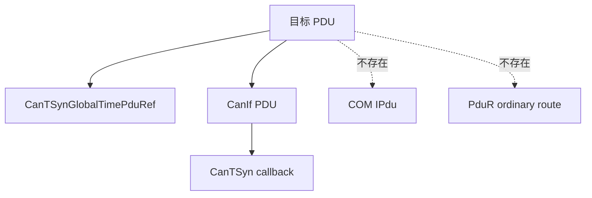
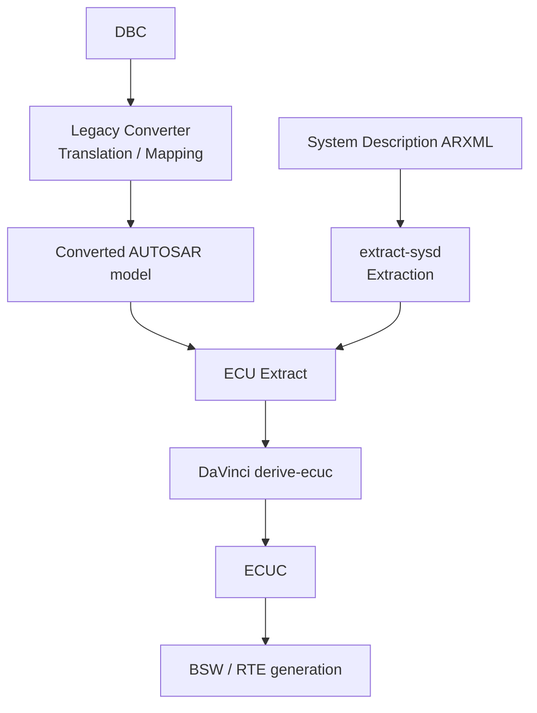
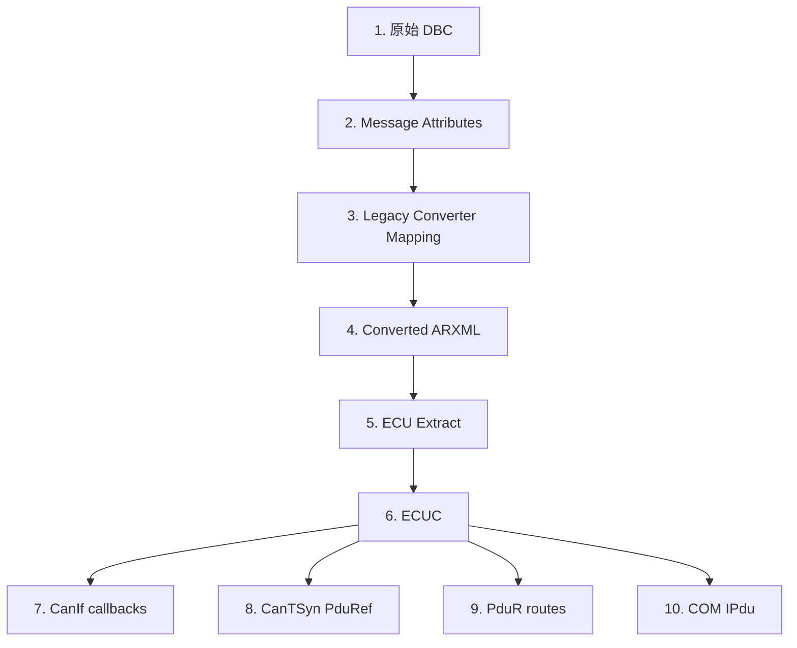
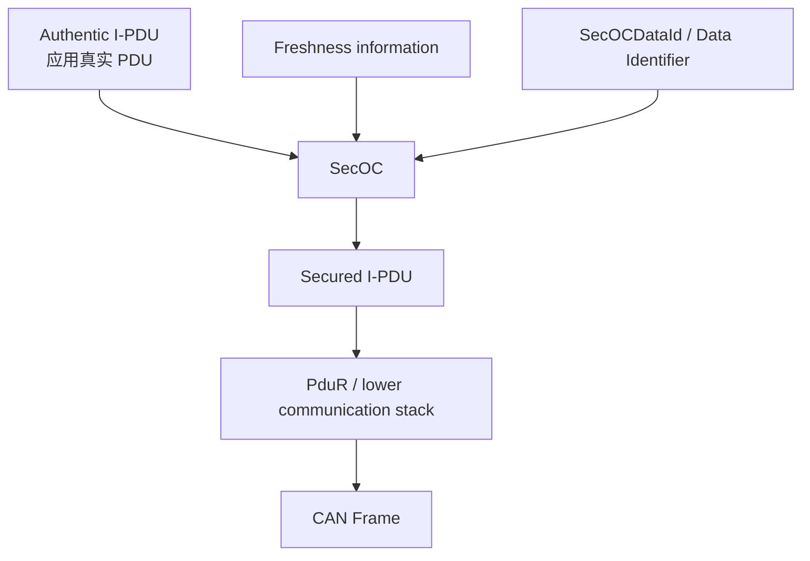
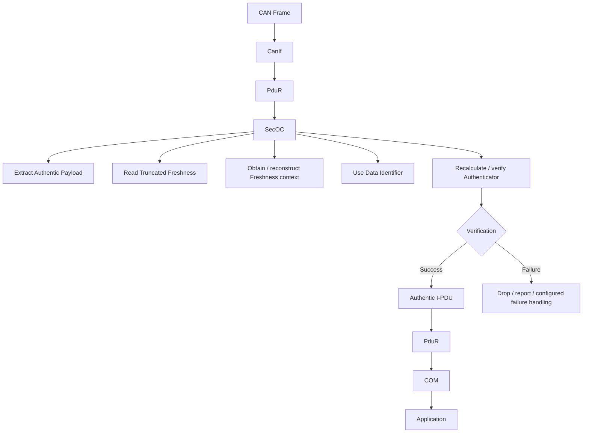
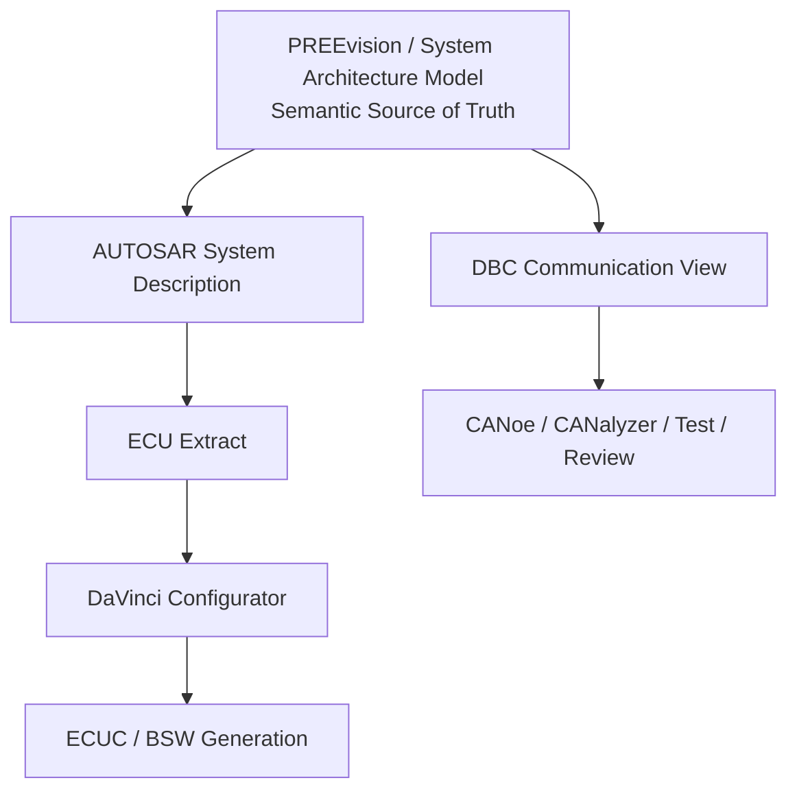
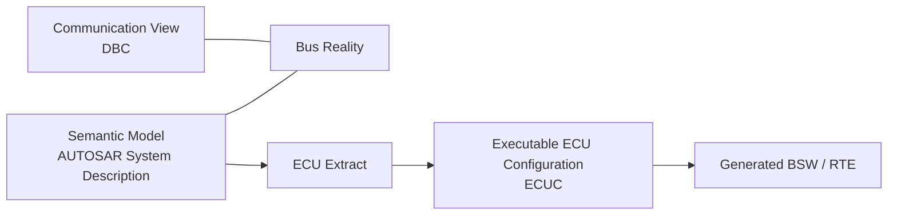

一条 CAN 时间同步报文在 DBC 里有完整的 CAN ID、DLC、周期、CRC、Counter 和时间字段；把它导入 AUTOSAR 配置工具后，却可能先出现一组看起来像普通 COM Signal 的派生对象，最终配置里这些对象又被移除，而同一个 PDU 实际被 `CanTSyn` 直接挂到了 `CanIf` 上。

如果只从“报文有没有被解析出来”这个角度看，这种现象很容易被归结为“DBC 不支持时间同步”或者“DaVinci 解析错了”。但这两个判断都不够准确。

真正的问题是：**DBC 描述的主要是总线上“传了什么”，而 AUTOSAR 系统模型还需要知道“这个通信对象是什么、属于谁、经过谁、为什么这样配置”。** 对普通 CAN Signal，这两种视角往往能重合；一旦进入 `CanTSyn`、`SecOC`、`CanTp`、`CanNm`、SOME/IP 等领域，两者之间的抽象层差异就会迅速暴露出来。

这篇文章不把 DBC 和 ARXML 简单分成“旧格式”和“新格式”，也不试图证明谁一定优于谁。目标是建立一套更适合工程实践的心智模型：

```text
DBC                    → Bus / Communication View
AUTOSAR System Model   → Semantic View
ECU Extract            → ECU-specific Semantic Input
ECUC                    → Executable BSW Configuration
```

全文会沿着两个完整案例展开：

- **CanTSyn**：为什么一条“时间同步 CAN Message”不能只靠 Signal Layout 决定它属于 COM 还是 CanTSyn；
- **SecOC**：为什么 DBC 可以看见 Freshness 和 MAC，却仍然看不见完整的安全通信模型。

最后再回到 Vector DaVinci / EcuXPro 工具链，讨论 DBC、System Description、ECU Extract、ECUC 在真实项目中应该怎样分工，以及大型 AUTOSAR 项目究竟应该把什么当作 Source of Truth。

> 本文中的 `ADAS_TimeSync`、`VehicleStatus`、`SecOCDataId=0x1234`、Freshness/MAC 长度等均为脱敏后的工程示例，用于说明模型关系，不代表任何 OEM 的固定协议或 AUTOSAR 强制配置值。涉及 AUTOSAR 标准行为时以 AUTOSAR 官方规范为准；涉及 Vector 工具行为时以 Vector 官方 DaVinci/EcuXPro 文档为准；无法由公开资料证明的项目现象会明确标为“工程推断”。

---

## 一、先把问题摆正：DBC 和 ARXML 根本不是同一层级

很多争论从一开始就把问题设错了。

如果把 DBC 和 ARXML 都看成“描述 CAN 报文的文件”，那么 ARXML 看上去只是更啰嗦、更复杂、能放更多字段的 DBC。反过来，如果只从 AUTOSAR 工具链看，又很容易得到“ARXML 更高级，所以 DBC 应该淘汰”的结论。

两种理解都不准确。

Vector 对 DBC 的定义很直接：DBC 是一种 ASCII CAN 数据库/翻译文件，用于给 CAN Frame 中的数据赋予标识名称、缩放、偏移等定义。换句话说，DBC 天生贴近**总线观察视角**：给定一个 CAN ID，我们希望知道它是谁发的、里面有哪些字段、每个字段在什么 bit、物理值怎么算。[Vector 的 DBC Glossary](https://elearning.vector.com/mod/glossary/showentry.php?eid=1734) 正是从这个角度描述 DBC。

而 ARXML 本身甚至不能被视为“一种单一模型”。`.arxml` 只是 AUTOSAR 各类模型的 XML 序列化载体。一个 ARXML 文件里可能装的是：

- System Description；
- SWC Description；
- ECU Extract；
- ECU Configuration（ECUC）；
- BSW Module Description；
- 数据类型、接口、Service、Variant 等其他 AUTOSAR 模型。

因此更准确的关系是：



从项目角色看，它们回答的问题也不同：

| 问题 | DBC 擅长回答 | AUTOSAR System/ECUC 擅长回答 |
|---|---|---|
| CAN ID 是多少 | 是 | 是 |
| DLC / bit layout 是什么 | 是 | 是 |
| Signal factor / offset 是什么 | 是 | 是 |
| 谁 Tx / Rx | 是 | 是 |
| Frame 内承载哪个 PDU | 很弱/依赖扩展 | 是 |
| PDU 由 COM 还是 CanTSyn 处理 | 无标准结构语义 | 是 |
| Authentic PDU 与 Secured PDU 什么关系 | 无标准结构语义 | 是 |
| SWC、Port、RTE 如何关联通信 | 否 | 是 |
| Global Time Domain / StbM TimeBase | 否 | 是 |
| ECU 的 BSW 最终如何配置 | 否 | ECUC 可表达 |

所以，**ARXML 不是“更高级的 DBC”，DBC 也不是“缩水版 ARXML”**。它们服务的是不同抽象层。

---

## 二、DBC 为什么到今天仍然非常好用

理解 DBC 的局限之前，必须先承认它为什么成功。

### 2.1 对 CAN 工程师来说，DBC 的信息密度非常高

假设有一条 8 Byte 报文：

```dbc
BO_ 256 VehicleStatus: 8 Gateway
 SG_ VehicleSpeed : 0|16@1+ (0.01,0) [0|300] "km/h" ADAS
 SG_ Gear         : 16|4@1+ (1,0) [0|15] "" ADAS
 SG_ ACC_Status   : 20|4@1+ (1,0) [0|15] "" ADAS
 SG_ AliveCounter : 24|8@1+ (1,0) [0|255] "" ADAS
```

不需要打开任何模型工具，一个熟悉 DBC 的工程师已经能快速看出：

- Message ID；
- Message Name；
- DLC；
- Tx Node；
- Signal Name；
- Start Bit；
- Length；
- Byte Order；
- Signed/Unsigned；
- Factor / Offset；
- 物理范围；
- Unit；
- Rx Node。

如果问题只是“Trace 里这个值为什么是 123.45 km/h”，这恰恰是最合适的抽象层。

### 2.2 DBC 非常适合 Trace、Restbus 和快速联调

对 CANoe / CANalyzer 一类工具来说，DBC 是极自然的输入。测试工程师真正关心的经常是：

```text
0x100 当前值是什么？
哪个 ECU 没发？
Counter 有没有跳变？
某 Signal 是否超范围？
报文周期从 20 ms 变成 50 ms 了吗？
```

这些问题根本不需要先追到 `I-SIGNAL-I-PDU`、`PDU-TRIGGERING`、`FRAME-TRIGGERING`、SWC Port 或 BSW ownership。

所以在以下场景中，DBC 不仅“还能用”，而且往往是效率更高的工具：

- CAN Trace 解码；
- CANoe Restbus Simulation；
- CANalyzer 总线分析；
- 通信矩阵 Review；
- 测试脚本；
- ECU 联调；
- 自动生成 CAPL / Python 测试数据；
- 快速比较两个版本通信矩阵。

### 2.3 文本简单，天然适合脚本和 Git Diff

DBC 的另一个长期优势是工程工具链成本极低。

例如一个周期修改：

```diff
- BA_ "GenMsgCycleTime" BO_ 256 20;
+ BA_ "GenMsgCycleTime" BO_ 256 50;
```

Review 人员几乎不需要任何上下文，就能看出发生了什么。

同样的业务变化落到大型 ARXML 模型里，有时会同时触发引用重排、Package 变化、工具重新序列化、Derived 对象更新等噪声。ARXML 并不是不能做 Git Review，而是**人类阅读成本通常高得多**。

脚本处理也是如此。DBC 可以很方便地被：

```text
grep
diff
Python
cantools
自研 parser
CI 检查脚本
```

消费。对“通信矩阵层面的自动化”，这是非常实际的生产力优势。

---

## 三、DBC 的 Attribute：强大的扩展机制，也是语义边界

说 DBC“只能描述 ID 和 Signal”并不准确。

DBC 有一套很灵活的 Attribute 机制，核心常见关键字包括：

```text
BA_DEF_
BA_DEF_DEF_
BA_
```

它们可以近似理解成：

```text
BA_DEF_      → 定义一个 Attribute
BA_DEF_DEF_  → 定义这个 Attribute 的默认值
BA_          → 给具体对象赋 Attribute 值
```

例如：

```dbc
BA_DEF_ BO_ "GenMsgCycleTime" INT 0 65535;
BA_DEF_DEF_ "GenMsgCycleTime" 0;

BA_ "GenMsgCycleTime" BO_ 256 500;
```

表达的是：

```text
定义一个 Message 级别的 GenMsgCycleTime 整型属性
默认值 = 0
Message 256 的值 = 500
```

其中 `BO_` 表示 Message 对象。同样还可以给 Signal、Node 等对象定义属性。

### 3.1 DBC 完全可以“标记时间同步报文”

例如 OEM 完全可以自定义：

```dbc
BA_DEF_ BO_ "MessageType"
  ENUM "Normal","TimeSync","NM","Diag";

BA_ "MessageType" BO_ 256 "TimeSync";
```

从 DBC 文件格式层面，这没有任何问题。

因此下面这句话是不准确的：

> DBC 无法标注时间同步报文。

更准确的说法是：

> **DBC 可以通过 User Defined Attribute 给 Message 添加 `TimeSync` 等标签，但这种标签本身不是 AUTOSAR 标准化的 CanTSyn 结构语义。**

### 3.2 “工具能读到值”和“工具理解语义”是两回事

这是全文最重要的分界之一。

假设 Legacy Converter 读到了：

```text
MessageType = TimeSync
```

它此时只获得了一个值。要把这个值真正映射成 AUTOSAR 对象，转换工具还必须知道：

```text
TimeSync 对应 CanTSyn 还是 OEM 私有协议？
这个 ECU 是 Master 还是 Slave？
GlobalTimeDomainId 是多少？
对应哪个 StbMSynchronizedTimeBase？
使用哪种 Message Format？
CRC 配置是什么？
对应哪个 PDU？
```

也就是说：

```text
Attribute Value
      ≠
Typed Semantic Model
```

进一步：

```text
能够读取 Attribute
      ≠
知道如何转换成 AUTOSAR 对象
```

真正形成 AUTOSAR 语义，需要有明确的映射合同：


这也是为什么某些 Vector/OEM 约定属性可以很好地参与转换，而随手新建一个：

```text
UpperLayer = CanTSyn
```

并不会天然让任何 AUTOSAR 工具都“懂”。

这里必须区分四件事：

1. DBC 文件格式允许 Attribute；
2. CANdb++ 能管理这些 Attribute；
3. 某些 Attribute 在具体 Vector/OEM 工具链中有约定语义；
4. Legacy Converter 是否存在对应 Mapping Rule。

只有 3、4 成立，才可能稳定完成“属性 → AUTOSAR 模型”的转换。

对于某个 OEM 私有的 TimeSync/SecOC Attribute 是否被某一版 Vector Legacy Converter 支持，如果没有公开文档，**必须查对应安装版本的 Legacy Converter Technical Reference，而不能从属性名字猜**。Vector 当前 EcuXPro 文档也明确指出，这份 Technical Reference 位于 Legacy Converter 安装目录下的 `Documentation` 中。

---

## 四、ARXML 真正强的不是 XML，而是 AUTOSAR Meta-Model

如果只比较文本格式，XML 甚至很难说是一种“优势”。

它冗长、引用多、人类阅读成本高。ARXML 真正有价值的是 XML 背后的 **AUTOSAR Meta-Model**：对象有明确类型、关系、Multiplicity、Reference、约束和标准语义。

### 4.1 System Description、ECU Extract、ECUC 不是一回事

工程中经常有人笼统地说“拿 ARXML 配 DaVinci”，但 ARXML 本身还必须继续分层。

#### System Description

它面向系统级设计，例如：

```text
System
├── ECU Instance
├── CAN / Ethernet Cluster
├── Physical Channel
├── Frame
├── PDU
├── Signal
├── SWC
├── Port
├── Communication Mapping
├── Service
└── Variant
```

它回答的是：

> 整个系统由什么组成，通信对象怎样连接，各 ECU 在系统中扮演什么角色。

#### ECU Extract

ECU Extract 是从系统级模型中切出“与某个 ECU 相关的那一部分”。

可以把它理解成：

```text
整车 System Description
          ↓
只保留 ECU_X 所需的信息
          ↓
ECU Extract
```

Vector 当前把 EcuXPro 定义为生成这类 ECU-specific extract 的工具。其官方文档明确说明，System Description 可以通过 `extract-sysd` 被抽取成 ECU Extract；legacy communication data 则先转换，再参与合并。

#### ECU Configuration / ECUC

DaVinci Configurator Classic 最终工作的对象是 **ECU Configuration**。

Vector 当前文档明确写道：要从 ECU Extract 派生 ECU Configuration，ECU Extract 必须是 ARXML 输入，然后由 BSW context 派生具体模块并施加预配置。最终才进入 COM、PduR、CanIf、CanTSyn、SecOC 等 ECU 侧配置对象。

所以不要把它们写成：

```text
“ARXML 可以配置一切”
```

更准确的链条是：



---

## 五、Message 和 PDU 不是一回事：这是 DBC 与 AUTOSAR 的核心分水岭

对传统 CAN 工程来说，最自然的模型是：

```text
CAN Frame
   ↓
Signals
```

这也是 DBC 最舒服的观察方式。

但 AUTOSAR 通信栈必须引入一个关键中间层：

```text
Frame
  ↓
PDU
  ↓
Signal
```

### 5.1 为什么不能把 PDU 省掉

Frame 是总线层上的传输单元；PDU 是软件栈中模块之间交换和路由的数据单元。二者在简单场景下可能看起来接近一一对应，但软件语义并不等价。

一个 CAN Frame 在 AUTOSAR 侧可能承载：

- 普通 COM I-PDU；
- CanTp 相关 PDU；
- CanNm PDU；
- CanTSyn PDU；
- SecOC Secured I-PDU；
- J1939 相关 PDU；
- CDD 自定义 PDU。

如果只保留：

```text
Frame → Signal
```

那么最关键的问题——“谁来处理这个 PDU”——就没有标准位置可以表达。

### 5.2 BSW Ownership 才是配置工具真正关心的语义

假设 DBC 中有：

```text
BO_ 0x123 ADAS_TimeSync
```

从总线视角，它就是一条 CAN Message。

但 AUTOSAR ECU 侧需要进一步知道：

```text
它是 COM I-PDU？
还是 CanTSyn Global Time PDU？
还是被 SecOC 保护后的 Secured PDU？
```

不同答案对应完全不同的软件路径。

普通 COM Signal 典型是：

```text
SWC
 ↓
RTE
 ↓
COM
 ↓
PduR
 ↓
CanIf
 ↓
CAN Driver
```

而 CanTSyn 则是专用 BSW 用户：

```text
CanTSyn
  ↓
CanIf
  ↓
CAN Driver
```

这种区别无法靠 CAN ID、DLC、Signal bit position 自然推出来。

你当然可以在 DBC 里增加：

```text
UpperLayer = CanTSyn
```

但这仍然只是一个 Attribute。它不是标准的：

```text
PDU Reference
BSW Module Ownership
Routing Relation
Configuration Container
```

这就是 DBC 在 AUTOSAR 项目中的结构性边界。

---

## 六、CanTSyn：一条“时间同步报文”为何不是普通 COM Message

下面用一个完整的脱敏示例把这个问题展开。

假设 DBC 中存在：

```text
ADAS_TimeSync
CAN ID = 0x5A0
DLC = 16
Cycle = 500 ms

Payload:
- MessageType
- SequenceCounter
- CRC
- Timestamp
- UserData
```

### 6.1 从 DBC 的角度，这条报文已经描述得很好

DBC 可以完整给出：

```text
CAN ID
DLC
Tx ECU
Rx ECU
Cycle
Signal Layout
CRC
Counter
Timestamp
Factor / Offset
```

甚至可以补：

```text
MessageType = TimeSync
```

用于人工和工具分类。

如果任务是 CANoe Trace 解码，到这里甚至已经足够。

### 6.2 但 AUTOSAR CanTSyn 需要的是另一组信息

真正的 CanTSyn 配置还要表达：

```text
CanTSyn Global Time Domain
├── Domain ID
├── Master / Slave role
├── Synchronized Time Base Reference
├── Message Format
├── CRC / security-related mode
└── Global Time PDU Reference
```

并与 `StbM` 建立关联。

Vector 自己的 AUTOSAR E-Learning 对 CanTSyn 的定义也很清楚：`CanTSyn` 实现 CAN-specific time synchronization protocol，而 SWC 访问同步时间基准需要 `StbM`。[Vector CanTSyn Glossary](https://elearning.vector.com/mod/glossary/view.php?hook=C&id=10198&mode=letter&sortkey=&sortorder=asc)

因此两种模型实际上在回答不同问题：

```text
DBC：
“这条同步报文在线上长什么样？”

AUTOSAR：
“这个 PDU 为什么存在、属于哪个时间域、
谁是 Master/Slave、使用哪个 TimeBase、由哪个 BSW 处理？”
```

### 6.3 CanTSyn 的处理路径为什么绕过 COM/PduR 的普通信号路径

从软件职责上，CanTSyn 是 CanIf 的上层用户之一。发送侧更严谨的概念模型是：

```text
CanTSyn 周期处理
     │
     ├─ 获取/使用 StbM 时间基准
     │
     ▼
组织 SYNC / FUP 等时间同步内容
     │
     ▼
CanIf_Transmit()
     │
     ▼
CAN Driver
     │
     ▼
CAN Bus
```

注意这里不应该写成“StbM 主动调用 CanTSyn 发送”。StbM 与 CanTSyn 存在时间基准交互关系，但协议报文的组织和发送职责属于 CanTSyn。

接收方向可以抽象为：

```text
CAN Bus
   ↓
CAN Driver
   ↓
CanIf
   ↓
configured CanTSyn Rx indication path
   ↓
CanTSyn
   ↓
StbM
```

因此它和普通：

```text
RTE → COM → PduR → CanIf
```

根本不是同一条上层链路。

### 6.4 什么证据能真正证明“这个 PDU 属于 CanTSyn”

在实际 DaVinci ECUC 中，如果看到：

```xml
<CanIfTxPduUserTxConfirmationName>
    CanTSyn_TxConfirmation
</CanIfTxPduUserTxConfirmationName>
```

这是一条非常有价值的证据，因为它直接表明该 CanIf Tx PDU 的上层 TxConfirmation 用户指向 CanTSyn。

再结合：

```text
CanTSynGlobalTimePduRef → 引用同一个 PDU
COM 中没有对应最终 ComIPdu
PduR 中没有普通 COM route
```

就可以形成较强的闭环：



这里的证明力排序大致是：

```text
强：
CanTSyn PduRef
CanIf Upper Layer callback

中：
PduR route 的存在/缺失
COM IPdu 的存在/缺失

弱：
某个 derived COM container 被标记删除
```

---

## 七、`DV:RemovedDerivedContainer`：它能证明什么，不能证明什么

在 DaVinci 生成/派生结果里，有时可以看到：

```xml
<ANNOTATION-ORIGIN>DV:RemovedDerivedContainer</ANNOTATION-ORIGIN>
```

看到这个标记后，一个很诱人的解释是：

> 因为这个 Signal/PDU 实际属于 CanTSyn，所以 DaVinci 把 COM 派生对象删掉了。

这个解释**可能符合某个具体工程的实际过程，但不能仅凭 Annotation 本身直接证明**。

更安全的结论是：

> `DV:RemovedDerivedContainer` 是 Vector/DaVinci 派生生命周期中的工具侧标记，表示某个 derived container 没有保留在当前最终配置中。

它本身不能回答：

```text
为什么被删除？
谁接管了它？
它最终属于哪个 BSW？
```

这些因果关系必须通过其他配置闭环。

因此文章或问题报告里更严谨的写法应该是：

> COM 中相应 Derived Container 未保留在最终配置。结合同一 PDU 被 `CanTSynGlobalTimePduRef` 引用、CanIf 上层回调指向 CanTSyn、且最终 COM/PduR 普通路径不存在，可以进一步确认该 PDU 的实际处理者是 CanTSyn。

这和“看到 RemovedDerivedContainer 就断言是 CanTSyn 导致的”是两个证据等级。

---

## 八、Vector 到底怎样把 DBC 带进 AUTOSAR 世界

前面的问题最终会落到工具链上：如果 DBC 只是 Communication View，为什么 DaVinci 又能“导入 DBC”？

答案是：**当前 Vector 工作流并不是把 DBC 直接当作完整 AUTOSAR ECU 模型使用，而是先经过 EcuXPro / Legacy Converter，把 legacy communication data 转成 ECU Extract，再进入 ECU-C derivation。**

Vector 当前官方文档给出的允许输入格式包括：

```text
ARXML
DBC
LDF
FIBEX
VSDE
```

但同时明确区分：

- `.dbc/.ldf/.fibex/.vsde` 属于 Legacy Communication Data；
- 处理这些格式需要 Legacy Converter；
- System Description ARXML 则通过 `extract-sysd` 抽取特定 ECU；
- 结果统一形成 ECU Extract；
- DaVinci Configurator 再从 ECU Extract 派生 ECU Configuration。

官方说明可参考：

- [Vector — Generate ECU Extract](https://help.vector.com/davinci-configurator-classic/en/latest/user-manual/project-setup/import/create-ecu-extract.html)
- [Vector — Ecu Extract Producer](https://help.vector.com/davinci-configurator-classic/en/latest/user-manual/tools/ecuxpro/about-ecuxpro.html)
- [Vector — Derive ECU-C From ECU Extract](https://help.vector.com/davinci-configurator-classic/en/latest/user-manual/project-setup/import/derive-ecuc.html)

把这两条路径画在一起会更清楚：



### 8.1 DBC → AUTOSAR 是 Translation / Mapping

DBC 世界和 AUTOSAR 世界的对象模型不同，所以转换器必须做“解释”：

```text
DBC Message
   ↓
对应什么 CAN Frame？
   ↓
需要创建什么 PDU？
   ↓
Signals 如何映射到 PDU？
   ↓
Tx/Rx 如何变成 ECU-specific communication relation？
```

对于普通 Signal Communication，这种映射通常比较直观。

但一旦遇到：

```text
CanTSyn
CanNm
CanTp
SecOC
E2E
OEM proprietary protocol
```

就需要更多语义输入。

### 8.2 System ARXML → ECU Extract 是 Extraction

System Description 已经处于 AUTOSAR 模型世界里。

EcuXPro 做的是：

```text
整车/系统模型
    ↓
按 ECU Instance 抽取
    ↓
只保留这个 ECU 相关的标准对象
```

这更接近“裁剪”而不是“猜测”。

所以：

```text
DBC → AUTOSAR：翻译 + 映射
System ARXML → ECU Extract：抽取
```

这两个动作不能混在一起。

### 8.3 DaVinci 后面仍然不是简单“一比一复制”

Vector 对 EcuXPro 的官方说明还特别指出：ECU Extract 进入 DaVinci Configurator 后，会结合 **AUTOSAR derivation rules（System Template Annex C）** 和 **MICROSAR-specific mapping logic** 生成最终 EcuC-ARXML。

这意味着看到最终 ECUC 的某个对象时，不能机械认为它一定在原始输入中一模一样地存在。

工程上需要接受一个事实：

```text
Input Model
   ↓
Conversion / Extraction
   ↓
Merge
   ↓
Derivation
   ↓
Vendor-specific mapping
   ↓
Final ECUC
```

每一层都可能改变“对象以什么形式出现”。

---

## 九、如果时间同步报文被错误当成普通 COM Message，怎么查根因

不要从最后一个 `RemovedDerivedContainer` 倒推整个原因。

更可靠的取证路径是顺着数据流逐层看：



具体问题可以逐项问：

### 原始 DBC

- 报文是否只是普通 Message + Signal？
- 有没有 `MessageType`、`PduType`、OEM TimeSync Attribute？
- Attribute 是标准/Vector 约定，还是 OEM 私有？

### Legacy Converter

- Technical Reference 是否定义了该 Attribute 的 mapping？
- 它会把 TimeSync Message 转成什么 AUTOSAR 对象？
- 是否需要额外 VSDE / ARXML / converter config？

### 转换后的 ARXML / ECU Extract

- PDU 是否已被区分为特殊用途？
- 是否已经出现 Time Synchronization 相关系统语义？
- 还是仍然只是普通 I-Signal-I-PDU？

### 最终 ECUC

- `CanTSynGlobalTimePduRef` 指向什么？
- CanIf callback 是谁？
- COM 是否最终持有该 PDU？
- PduR 是否存在普通 route？

到这里，才能区分三种完全不同的根因：

```text
A. DBC 根本没提供足够语义
B. DBC 提供了 Attribute，但 Converter 没有对应 Mapping
C. ECU Extract 已有正确语义，但后续 Derivation/项目配置发生了变化
```

这比一句“DBC 有局限”更有工程价值。

---

## 十、SecOC：DBC 可以看见 MAC，却看不见完整安全模型

如果 CanTSyn 还只是“BSW ownership”问题，那么 SecOC 会把 DBC 的模型边界暴露得更彻底。

下面用一个可以算清楚的例子。

假设应用原本有一个 8 Byte 的 Authentic I-PDU：

```text
VehicleStatus_Authentic

Byte 0..7:
VehicleSpeed
Gear
ACC_Status
AliveCounter
Other application data
```

没有 SecOC 时，可以抽象成：

```text
SWC
 ↓
RTE
 ↓
COM
 ↓
Authentic I-PDU
 ↓
PduR
 ↓
CanIf
 ↓
CAN/CAN FD
```

现在项目要求对它做 SecOC 保护。

为了说明模型关系，假设配置：

```text
Authentic I-PDU          = 8 Byte
SecOCDataId               = 0x1234
Complete Freshness Value = 64 bit
Truncated Freshness      = 16 bit
Full Authenticator       = 128 bit
Truncated Authenticator  = 48 bit
```

注意：这些长度只是本文示例，不是 AUTOSAR 对所有 SecOC 报文的固定要求。

最终总线上发送：

```text
8 Byte Authentic Payload
+ 2 Byte Truncated Freshness
+ 6 Byte Truncated Authenticator
= 16 Byte
```

示意图：

```text
Byte 0                                      7 8    9 10            15
┌────────────────────────────────────────────┬──────┬────────────────┐
│          Authentic I-PDU 8 Byte           │ FV   │ Truncated MAC  │
│                                            │ 2 B  │      6 B       │
└────────────────────────────────────────────┴──────┴────────────────┘
```

### 10.1 DBC 对这 16 Byte 仍然可以描述得非常好

例如：

```text
VehicleSpeed = 80 km/h
Gear         = D
Counter      = 7
Freshness    = 0x56A2
MAC          = 0x12AB34CD5678
```

CANoe 可以把它解析得清清楚楚。

这件事非常重要，因为它说明：

> **“DBC 无法描述 SecOC 报文”这句话是错的。**

更准确的说法是：

> **DBC 可以很好地描述 SecOC 处理后最终在总线上的 Frame Layout，但它无法用标准 DBC 模型完整表达产生和验证这个 Frame 的安全语义。**

也就是说，DBC 完成的是：

> **Bus Decoding**

而 SecOC 配置需要的是：

> **Security Processing Model**

---

## 十一、SecOC 丢失的第一层语义：Authentic I-PDU 与 Secured I-PDU

从 DBC 看：

```text
CAN Frame
├── VehicleSpeed
├── Gear
├── Counter
├── Freshness
└── MAC
```

这很自然。

但 AUTOSAR SecOC 的软件模型更接近：



也就是说，前 8 Byte 不是单纯“一组直接属于 CAN Frame 的应用 Signal”。从软件层看，它们先属于一个 **Authentic I-PDU**，随后这个 PDU 被 SecOC 包装/保护形成另一个 **Secured I-PDU**。

标准 DBC 的核心模型没有：

```text
Authentic I-PDU
Secured I-PDU
Authentic-to-Secured relationship
```

这种对象关系。

这就是第一层信息损失。

---

## 十二、SecOC 丢失的第二层语义：SecOCDataId 甚至可能根本不在线上

这是一类特别适合说明“Bus View ≠ Semantic View”的数据。

假设：

```text
SecOCDataId = 0x1234
```

用于参与认证计算。

从概念上，可以把认证输入理解成：

```text
DataToAuthenticator =
    Data Identifier
  + Authentic Payload
  + Freshness information
```

但 `0x1234` 并不要求自己成为 CAN Frame 里的两个可见 Byte。它可能只是 SecOC 配置中的逻辑标识。

于是出现一个 DBC 很难原生表达的事实：

> **一个没有占用任何 CAN bit 的配置值，会直接影响总线上最终的 MAC。**

传统 DBC 最舒服的模型是：

```text
Bit Position → Signal
```

但 `SecOCDataId` 可能是：

```text
No bus bit
    ↓
Configuration semantic
    ↓
Authenticator input
    ↓
Changes bus MAC
```

当然，可以用 Attribute 硬塞进去：

```dbc
BA_DEF_ BO_ "SecOCDataId" INT 0 65535;
BA_ "SecOCDataId" BO_ 256 4660;
```

这能保存数值，却仍然没有标准化表达：

```text
这个值属于哪个 SecOC 配置对象？
它如何与 Authentic I-PDU 绑定？
它在哪一步进入 Authenticator input？
```

---

## 十三、SecOC 丢失的第三层语义：Complete Freshness 与线上 Truncated Freshness

继续假设完整 Freshness 为：

```text
0x00000012345656A2
```

总线上只发送低 16 bit：

```text
0x56A2
```

DBC 可以完美描述：

```text
Byte 8..9 = Freshness = 0x56A2
```

但 SecOC 需要知道的远不止 16 bit。

它还要处理：

```text
这 16 bit 是完整 Freshness 的哪一部分？
Complete Freshness 的长度是什么？
完整 Freshness 从哪里获得？
Freshness Provider / Freshness Manager 怎样参与？
接收端怎样根据 truncated value 和本地状态恢复/验证？
Authenticator 使用的是完整信息还是线上截断值？
```

因此：

```text
DBC 看到：
0x56A2

SecOC 看到：
Truncated Freshness
      ↓
结合 Freshness 状态
      ↓
Complete / reconstructed freshness context
      ↓
Authentication verification
```

这类“线上字段只是内部安全状态的投影”正是总线数据库与安全语义模型的根本差别。

---

## 十四、SecOC 丢失的第四层语义：MAC 不只是 48 个 bit

在 DBC 里：

```text
Byte 10..15
=
48 bit Authenticator
```

到这里它的工作已经完成。

但 ECU 配置还要继续问：

```text
使用哪个认证算法/primitive？
关联哪个 Crypto Job？
使用哪个 key/reference？
完整 Authenticator 长度是多少？
为什么发送时截断到 48 bit？
认证输入由哪些字段组成？
失败后采取什么策略？
```

这里还需要一个重要边界：**ARXML 并不意味着把真实密钥明文写进 System Description**。实际项目里通常是配置对象、Key/Job Reference、Crypto stack 关系等在不同 ECUC/安全配置中建立关联，真正的 key material 还涉及 HSM、Key Management、provisioning 等更深层机制。

这反过来也说明“ARXML 能表达 SecOC”不能被简化成“一个 ARXML 文件里把所有安全细节都写全”。

正确理解应该是：

> AUTOSAR 模型提供了结构化对象和引用，使 SecOC 与 Authentic/Secured PDU、Freshness、Crypto 配置、PduR 路由等软件关系能够被工具链表达和校验。

---

## 十五、接收方向最能说明：DBC 只看到了输入，没看到安全门控

总线收到 16 Byte Secured I-PDU 后，真实的软件处理不是：

```text
CAN Frame
  ↓
COM
  ↓
Application
```

而更接近：



最核心的语义是：

> **只有通过认证验证后，Authentic I-PDU 才能进入后续可信通信路径。**

DBC 没有对象模型表达这一条“security gate”。

它能告诉 CANoe：

```text
MAC = 0x12AB34CD5678
```

但不会因为有这个 Signal 就自动知道：

```text
这个 MAC 必须在 SecOC 中验证成功之后，
前 8 Byte 才能作为 Authentic PDU 交给 COM。
```

这也是为什么“DBC 能把 MAC 定义成 Signal”远远不等于“DBC 覆盖了 SecOC”。

---

## 十六、能不能用一堆 `BA_` 把 SecOC 全塞进 DBC？

理论上，可以不断扩展。

例如：

```dbc
BA_ "PduType"              BO_ 256 "SecOC";
BA_ "AuthenticPdu"         BO_ 256 "VehicleStatus_Authentic";
BA_ "SecOCDataId"          BO_ 256 4660;
BA_ "FreshnessLength"      BO_ 256 64;
BA_ "FreshnessTruncLength" BO_ 256 16;
BA_ "AuthLength"           BO_ 256 128;
BA_ "AuthTruncLength"      BO_ 256 48;
BA_ "CryptoAlgorithm"      BO_ 256 "AES-CMAC";
BA_ "CryptoJob"            BO_ 256 "SecOC_Job_1";
```

再继续扩展：

```text
FreshnessProvider
FailurePolicy
AuthenticPduRef
SecuredPduRef
PduRRoute
CryptoKeyRef
...
```

做到这里会发生一个有趣的变化：

> 你已经不是“给 DBC 增加几个辅助标签”，而是在使用 DBC 私有 Attribute **重新发明一套 SecOC Meta-Model**。

问题也随之出现：

```text
OEM A: AuthenticPduName
OEM B: OriginalPdu
Supplier C: SecurePduReference
Tool D: ProprietarySecocLink
```

每一方都可能定义自己的名字、取值、关联方式和转换规则。

这不是技术上绝对做不到，而是**失去了标准化对象模型的互操作优势**。

因此 DBC User Attribute 的正确定位应该是：

> 对 Communication View 进行高效扩展，或者作为某个确定工具链的输入约定。

而不是：

> 用任意 BA_ 完整替代 AUTOSAR Meta-Model。

---

## 十七、DBC 与 ARXML 的系统对比

下面把前面的结论收敛成一张表。

| 维度 | DBC | AUTOSAR ARXML / Model |
|---|---|---|
| CAN ID / Frame | 非常强，直观 | 强 |
| Signal bit layout | 非常强 | 强 |
| Factor / Offset / Unit | 强 | 强 |
| Tx / Rx Node | 强 | 强 |
| Cycle 等通信属性 | 强，常通过 Attribute | 强 |
| 人工可读性 | **很强** | 中到弱 |
| Git Diff | **很友好** | 容易产生结构/序列化噪声 |
| Python / grep 快速处理 | **很方便** | 可处理，但需理解引用关系 |
| CANoe / CANalyzer | **极适合** | 可用，但不是最轻量视图 |
| Restbus Simulation | **很适合** | 可用，复杂系统更完整 |
| Communication Matrix Review | **很适合** | 信息完整但阅读成本高 |
| User Attribute 扩展 | **非常灵活** | 有标准对象及 vendor extension |
| Frame / PDU / Signal 分层 | 原生较弱 | **标准结构化表达** |
| BSW Ownership | 无通用标准模型 | **可结构化派生/配置** |
| COM | 可表达总线布局 | **可表达 I-PDU/Signal 配置关系** |
| CanTp | 能看 CAN Frame | **能表达 TP 软件语义** |
| CanNm | 能看 NM Frame/Signal | **能表达 NM 模块关系** |
| CanTSyn | 能看同步 Frame/字段 | **Domain、role、TimeBase、PDU Ref 等** |
| SecOC | 能看 secured frame/FV/MAC | **Authentic/Secured PDU、安全处理关系** |
| StbM | 无原生模型 | **有标准配置模型** |
| Ethernet / SOME/IP | 不是核心适用域 | **适合系统/服务模型** |
| SWC / Port / RTE | 不覆盖 | **核心 AUTOSAR 模型** |
| Variant | 可用属性模拟 | **标准 Variation 模型** |
| ECU Extract | 不属于 DBC 模型 | **标准 AUTOSAR work product** |
| ECUC | 不属于 DBC 模型 | **核心用途之一** |
| System Description | 不覆盖完整系统模型 | **核心用途** |
| 学习成本 | **低到中** | 高 |
| 工具依赖 | 低 | 中到高 |
| 跨 OEM 私有扩展一致性 | Attribute 容易碎片化 | 标准语义更强，但仍有 vendor/version 差异 |

注意最后一行不能被误解成“ARXML 跨工具 100% 无损”。

AUTOSAR 标准化了大量 Meta-Model 和交换规则，但工程中仍然存在：

- AUTOSAR release 差异；
- Vendor-specific extension；
- Vendor-specific mapping；
- 工具支持范围；
- 输入文件 merge/priority；
- derivation 行为；
- variant 处理。

Vector 自己就明确说明 DaVinci 在 AUTOSAR derivation rules 之外还使用 MICROSAR-specific mapping logic。所以“都是 ARXML”并不等于“任何工具都能无损往返”。

---

## 十八、ARXML 的代价：表达力不是免费的

把 ARXML 描述成“什么都比 DBC 好”同样脱离工程现实。

### 18.1 Meta-Model 的学习成本很高

DBC 的核心对象很少：

```text
Node
Message
Signal
Attribute
```

AUTOSAR System/ECUC 一旦深入，就会遇到：

```text
SYSTEM-SIGNAL
I-SIGNAL
I-SIGNAL-I-PDU
I-SIGNAL-TO-I-PDU-MAPPING
PDU-TRIGGERING
FRAME
FRAME-TRIGGERING
PORT-PROTOTYPE
ECU-INSTANCE
COMMUNICATION-CONNECTOR
ECUC-MODULE-CONFIGURATION-VALUES
...
```

真正难的不是 `<SHORT-NAME>` 这些 XML 标签，而是每个对象在 Meta-Model 里的角色。

### 18.2 人工修改容易破坏引用和约束

大型 ARXML 里还存在：

```text
REF
DEST
AR-PACKAGE
UUID
Variation
Split
Multiplicity
```

手工改一个名字，有可能产生大量 unresolved reference。

所以大型项目天然依赖 PREEvision、DaVinci、EB tresos、ISOLAR 等模型/配置工具。

### 18.3 Git Diff 不一定代表业务 Diff

工具重新序列化后可能出现：

- 对象排序变化；
- Package 顺序变化；
- derived container 更新；
- annotation 更新；
- reference path 调整。

业务层只改了一个 Signal，文本层 Diff 可能远不止一行。

这也是为什么成熟团队往往会额外生成：

```text
Communication Matrix
DBC
HTML Report
Model Diff Report
```

作为 Review View。

### 18.4 Debug 单个 CAN Signal 时，ARXML 可能是过度抽象

如果现在现场问题只有：

> `0x513` 的 bit 21 为什么为 1？

让工程师沿着：

```text
FrameTriggering
→ PduTriggering
→ ISignalIPdu
→ ISignalMapping
→ ISignal
```

去找，并不比直接开 DBC 更“先进”。

**正确的抽象不是越完整越好，而是和当前问题匹配。**

---

## 十九、真实工程场景到底怎么选

### 场景 A：CAN Trace 分析

**推荐：DBC。**

原因：

- 信息密度高；
- CANoe/CANalyzer 直接使用；
- 不需要 BSW 系统语义。

风险：

- 不要从“DBC 能解析”推导“ECU 软件配置也正确”。

### 场景 B：CANoe Restbus Simulation

**推荐：DBC 优先，复杂 AUTOSAR 系统可结合 ARXML。**

普通 CAN Restbus 的核心是 Frame/Signal/Timing，DBC 已经非常高效。如果仿真目标开始涉及 service、复杂 PDU 关系、安全处理，则需要更完整模型或额外配置。

### 场景 C：通信矩阵 Review

**推荐：DBC 或从主模型自动生成的矩阵视图。**

不要让 Reviewer 为了确认一个周期变化去阅读几十层 AUTOSAR reference。

### 场景 D：OEM 与 Tier1 交换普通 CAN Signal 定义

**推荐：DBC 可以接受，但要明确边界。**

如果交付内容只是普通 CAN Communication Matrix，DBC 很合适。

如果同一接口还承担：

```text
CanTSyn
SecOC
CanTp
CanNm
E2E semantics
```

就必须同时交付 mapping contract、额外描述或 System/ECU Extract ARXML。

### 场景 E：COM / PduR / CanIf 自动配置

**推荐：AUTOSAR ECU Extract / ARXML。**

因为真正决定配置的不只是 bit layout，而是 PDU、route、upper layer、triggering 等关系。

### 场景 F：CanTSyn

**推荐：ARXML/结构化 AUTOSAR 输入。**

DBC 可以继续作为 CAN Trace View，但不能承担 Global Time Domain、StbM TimeBase 和 BSW ownership 的完整语义真源。

### 场景 G：SecOC

**推荐：ARXML + ECU security/crypto configuration。**

DBC 很适合把线上 Secured Frame 解出来，但 Authentic/Secured PDU、Freshness、Authenticator、crypto reference 等必须由结构化配置闭环。

### 场景 H：Ethernet + SOME/IP

**推荐：ARXML。**

DBC 本来就不是面向 Ethernet Service Interface 的核心格式。

### 场景 I：整车 System Description

**推荐：AUTOSAR System Model / ARXML。**

这里已经完全超出单一 CAN Database 的边界。

### 场景 J：ECU Extract

**推荐：ARXML。**

这是 AUTOSAR ECU-specific system input，本身就是标准工作产物。

### 场景 K：ECUC / BSW Code Generation

**推荐：ARXML / 配置工具原生模型。**

最终目标是可校验、可生成的 BSW configuration，而不是总线数据库。

### 场景 L：Git Review

**推荐：分层。**

- 通信矩阵业务变化：DBC / generated report 更友好；
- AUTOSAR 系统关系变化：ARXML/model diff 必不可少。

### 场景 M：自动化脚本处理

**推荐：看问题层级。**

- 批量查 Signal / CAN ID / 周期：DBC；
- 查 PDU reference / BSW ownership / ECU Extract 完整性：ARXML parser。

不要为了“格式统一”强迫所有脚本只接受其中一种。

---

## 二十、为什么 DBC 不会被 ARXML 淘汰

现在可以回答一个很现实的问题：

> 既然 ARXML 表达能力明显更强，为什么行业还长期保留 DBC？

因为绝大多数现场总线问题根本不需要完整 AUTOSAR 语义。

测试工程师想知道：

```text
谁没发？
周期是多少？
这个 bit 是什么？
Signal 为什么越界？
```

DBC 是更好的工具。

而且很多团队成员根本不负责 ECU BSW 配置：

```text
测试
标定
车辆集成
台架
数据分析
供应商接口 Review
```

对他们来说，Communication View 才是工作主界面。

所以 DBC 的长期价值不在于“兼容老项目”，而在于：

> **它是一个非常好的总线通信投影视图。**

---

## 二十一、为什么 AUTOSAR 项目又不能只使用 DBC

反方向的问题同样重要：

> DBC 既简单又能扩展，能不能把所有语义都用 BA_ 加进去，整个 AUTOSAR 项目只发 DBC？

短期看可以不断“补字段”，长期会越来越像：

```text
PduType
UpperLayer
SecOCDataId
FreshnessProvider
CanTSynDomain
TimeBaseRef
AuthenticPduRef
SecuredPduRef
ServiceId
InstanceId
EventGroup
...
```

到最后，相当于：

> 用私有 Attribute 重新实现一套没有标准 Meta-Model、没有统一 reference 约束、没有统一 schema 的 AUTOSAR。

这会带来三个直接问题。

### 21.1 语义不统一

同一个概念每个 OEM/供应商都可能叫不同名字。

### 21.2 引用关系弱

`AuthenticPdu = "ABC"` 是一个字符串，并不天然等价于一个有 DEST、类型校验、存在性校验的标准 Reference。

### 21.3 工具链高度绑定

只有“知道这些私有 Attribute 约定”的 converter 才能正确理解。

一旦换工具或换供应商，Attribute 仍然在，语义却丢了。

所以大型 AUTOSAR 项目的问题不是“DBC 表达不了任意字符串”，而是：

> **缺少标准化、类型化、可引用、可校验的系统语义模型。**

---

## 二十二、Source of Truth：真正应该避免的是“双主”

既然两种格式都有价值，最危险的工程做法反而是：

```text
工程师 A 手工维护 DBC
+
工程师 B 手工维护 System ARXML
+
双方都认为自己是 Master
```

这种“双主”迟早会出现：

```text
DBC cycle = 20 ms
ARXML cycle = 50 ms

DBC Rx ECU = A/B
System Model Rx ECU = A/C

DBC MessageType = Normal
ECU 配置实际上 = CanTSyn
```

然后团队花大量时间讨论：

> 到底哪个文件才是真的？

更合理的架构是：



这里还要再精确一步：

> **真正的 Source of Truth 往往不是某一个 `.arxml` 文件，而是系统架构/通信建模数据库。**

ARXML 是它的标准化交换产物。

如果某个 OEM 的流程本来就是“System Description ARXML 文件即正式交付基线”，那么在接口层也可以把这套 ARXML 视为 Semantic Source of Truth；但内部仍然应该坚持：

```text
One Master
→ Multiple Derived Views
```

而不是 DBC/ARXML 双向随意人工修改。

### 22.1 Source of Truth 不是“文件扩展名之争”

这里还需要避免另一个误区：把 Source of Truth 直接理解成“以后只认 `.arxml`，不认 `.dbc`”。

真正需要统一的是**数据所有权和变更入口**，而不是文件后缀。

假设整车团队在 PREEvision 中维护系统通信模型，那么 PREEvision 数据库可能才是主模型；System Description ARXML 是正式交换产物；ECU Extract 是面向单 ECU 的裁剪；DBC 是面向 CAN 工具的投影。此时 `.arxml` 和 `.dbc` 都只是主模型生命周期中的不同 artifact。

另一家公司也可能没有统一系统建模数据库，而是把经评审的 AUTOSAR System Description ARXML 作为接口基线。只要责任清楚、变更流程单向、能够自动生成下游 View，同样可以工作。

因此 Source of Truth 应至少满足四个条件：

1. **对象所有权明确**：谁负责 CAN ID、Signal、PDU、Time Domain、SecOC 关系等不同类型的数据；
2. **变更入口明确**：修改应发生在哪一层，谁批准；
3. **派生方向明确**：哪些文件是生成物，哪些禁止人工反向修改；
4. **一致性可验证**：下游 DBC、ECU Extract、ECUC 能追溯到同一版本的上游基线。

真正危险的不是项目使用了很多格式，而是没有人能回答：

```text
这个值最初在哪里定义？
这个文件是谁生成的？
这里能不能直接改？
改完以后应该回灌到哪一层？
两个交付物冲突时以谁为准？
```

如果这些问题没有答案，即使所有文件都叫 ARXML，也仍然可能存在“双主”和配置漂移。

### 22.2 ARXML 也不能替代工程治理

AUTOSAR Meta-Model 能提供强类型对象和引用约束，但它不会自动替团队决定业务责任。

例如同一系统可能同时有：

```text
OEM System Description
Tier1 ECU Extract enrichment
Vector MICROSAR pre-configuration
项目手工 ECUC 参数
安全团队交付的 Crypto 配置
```

这些数据最后都可能以 ARXML 形式出现，却来自不同 owner。

因此“使用 ARXML”只能解决一部分技术交换问题，不能自动解决：

```text
需求版本管理
接口冻结
冲突仲裁
供应商责任
配置基线
变更审批
```

成熟流程仍然需要把“标准模型”和“配置治理”分开设计。

### 22.3 最实用的原则：谁拥有语义，谁拥有 Master

可以用一个简单原则决定主数据归属：

> **哪个层级真正拥有某项语义，哪个层级就应该拥有它的 Master。**

例如：

```text
CAN ID / Signal layout
→ 系统通信设计 owner

CanTSyn Domain / Master-Slave topology
→ 时间同步系统设计 owner

SecOC protection relationship
→ 系统安全/通信安全设计 owner

具体 BSW buffer size / task period
→ ECU integration owner
```

这些数据最终都可能投影到 DBC、System Description、ECU Extract 或 ECUC，但不应该因为某个下游文件“也能存这个值”，就把所有权反向转移给下游。

这条原则能显著减少一种常见反模式：**为了让某个工具方便导入，把本应属于系统模型的语义偷偷塞进私有 DBC Attribute，最后再把这个工具约定误认为系统设计本身。**

DBC Attribute 可以是很好的工具接口；它不应该在缺少治理的情况下变成隐藏的系统架构数据库。

## 二十三、ARXML → DBC 本质上是一次“语义投影”

从系统主模型生成 DBC 非常合理。

通常可以较好投影：

```text
CAN ID
Frame Name
DLC
Signal
Bit Position
Byte Order
Factor
Offset
Unit
Tx ECU
Rx ECU
Cycle
部分 timeout / send type
```

这些本来就是 DBC 擅长的 Bus View。

但是下面这些信息通常无法无损回到标准 DBC 模型：

```text
PDU hierarchy
BSW ownership
PduR routing semantics
CanTSyn Global Time Domain
StbM TimeBase
SecOC Authentic/Secured PDU relationship
Complete Freshness semantics
Crypto configuration/reference
SWC / Port / RTE
SOME/IP Service model
复杂 Variant
ECUC
```

所以：

```text
ARXML/System Model → DBC
```

更准确的术语是：

> **Semantic Projection / Information Reduction**

这不是缺陷，而是 View 的本质。

就像数据库里从完整关系模型生成一张报表：报表本来就应该只保留读者需要的信息。

问题只会发生在团队忘记“DBC 是投影视图”，反过来把投影文件当成完整系统真源时。

---

## 二十四、把两种格式放进一次真实变更：为什么“能互转”不等于“能无损往返”

前面的讨论还是偏静态：一个 DBC 有什么、一个 ARXML 有什么。真正到了项目里，更棘手的问题往往发生在**变更传播**上。

假设系统设计团队新增一个车速状态接口。最初它只是普通 CAN 通信：

```text
VehicleStatus
CAN ID = 0x320
Cycle = 20 ms
VehicleSpeed
Gear
Counter
CRC
```

如果系统主模型维护在 PREEvision 一类架构工具中，一条理想的数据链可以是：

```text
System Model
   ↓
System Description ARXML
   ↓
ECU Extract
   ↓
DaVinci ECUC

同时：

System Model
   ↓
DBC
   ↓
CANoe / 测试 / 台架
```

此时 DBC 和 ECUC 看见的是同一个接口的不同投影。测试人员用 DBC 检查 `VehicleSpeed` 的物理值，ECU 集成人员在 COM/PduR/CanIf 中看到对应 I-PDU。两边没有冲突。

几个月后，安全分析要求这条报文加入 SecOC。业务接口的 `VehicleSpeed`、`Gear` 并没有变化，但系统语义已经发生了很大的变化：

```text
原来：

COM I-PDU
   ↓
PduR
   ↓
CanIf

现在：

COM
 ↓
Authentic I-PDU
 ↓
PduR
 ↓
SecOC
 ↓
Secured I-PDU
 ↓
PduR
 ↓
CanIf
```

如果只看新导出的 DBC，测试团队可能只是发现：

```text
DLC 从 8 Byte 变成 16 Byte
末尾多出 Freshness 和 MAC
```

从总线视角，这完全合理。

但如果有人把这份新 DBC 再反向当成 ECU 配置真源，希望 Converter “恢复”完整 SecOC 模型，问题就出现了。因为从最终 16 Byte Frame 并不能唯一反推出：

```text
前 8 Byte 是否一定是一个独立 Authentic I-PDU？
哪个 PDU 是 Secured I-PDU？
SecOCDataId 是多少？
Complete Freshness 多长？
线上 16 bit Freshness 是完整值的哪一部分？
Authenticator 的完整长度是多少？
SecOC 与 Crypto Job 怎样关联？
Rx verification failure 如何处理？
```

也就是说：

```text
System Model
    ↓
DBC
```

可以是一个非常实用的**有损投影**；

但：

```text
System Model
    ↓
DBC
    ↓
System Model
```

一般不能假定是无损 round-trip。

### 24.1 “能导出”和“能重建”是两种完全不同的能力

工程里常出现一句话：

> 既然工具可以 ARXML 转 DBC，也可以 DBC 转 ARXML，那为什么不能把两者看成等价格式？

这个推理忽略了信息论意义上的不对称。

假设完整模型里有：

```text
A = CAN Frame layout
B = PDU hierarchy
C = BSW ownership
D = SecOC relation
E = Variant
```

导出 DBC 时只保留：

```text
A + 一部分可投影属性
```

那么后来再把 DBC 转回 AUTOSAR，Converter 面对的是：

```text
A
→ 猜 B、C、D、E
```

如果额外有稳定的 Attribute Mapping、OEM rule、VSDE 或其他 ARXML 辅助输入，工具可以补回一部分信息；但这些信息不是从 CAN bit layout “推导”出来的，而是**由额外合同重新注入**的。

因此一条很重要的数据治理原则是：

> **不要把“工具支持双向格式转换”误解成“两个格式的信息集合相同”。**

转换器的存在只能证明有一个 mapping process，不能证明 mapping 是双射。

### 24.2 同样的 CAN Frame，可以对应不同的软件架构

再做一个更极端的思想实验。

总线上同时看到两条完全一样布局的 8 Byte Frame：

```text
Frame A:
Counter
Payload
CRC

Frame B:
Counter
Payload
CRC
```

仅靠 DBC，它们可能几乎没有结构差异。

但 ECU 软件里可能是：

```text
Frame A
  ↓
COM
  ↓
SWC
```

而：

```text
Frame B
  ↓
CanTp / proprietary transport / CDD
```

或者：

```text
Frame B
  ↓
CanTSyn
  ↓
StbM
```

“bit 长得像什么”并不能唯一决定“软件由谁处理”。

这就是 BSW ownership 不能只从 Frame Layout 推导的根本原因。

同理，一条报文里出现 `CRC` Signal，也不能仅凭名字判断它就是：

```text
AUTOSAR E2E CRC
SecOC Authenticator
普通应用 CRC
OEM 私有保护字段
```

Signal Name 是 Communication View 中的人类语义提示，不是足以建立 BSW 配置的强类型证据。

### 24.3 变更管理应该比较“哪个层级发生了变化”

成熟项目在评审通信变更时，最好不要只问：

> DBC diff 是什么？

而应该进一步把变更分类。

#### 仅 Bus View 变化

例如：

```text
Cycle 20 ms → 50 ms
Signal factor 修改
CAN ID 修改
Receiver 增减
```

此时 DBC diff 很可能就是最有效的 Review 入口。

#### Semantic Model 变化

例如：

```text
普通 COM PDU → SecOC protected PDU
新增 CanTSyn domain
PDU ownership 从 COM 改为 CDD
新增 Service/EventGroup
增加 Variant condition
```

这时仅审 DBC 极有可能漏掉关键架构变化。

#### ECU Configuration 变化

例如：

```text
PduR route 增减
CanIf upper layer callback 改变
SecOC verification policy 调整
COM processing mode 改变
BSW module parameter 改变
```

这类变化甚至可能不改变线上的任何 bit。

一个很典型的情况是：

```text
CAN Frame 完全不变
DBC 完全不变
但 ECUC 行为已经改变
```

例如接收处理从某个普通上层模块切到另一个模块，只要最终 Frame Layout 保持一致，DBC 就不会告诉你软件架构发生过变化。

因此 Review 体系更合理的方式是：

```text
Bus change      → DBC / communication report
Semantic change → System model / ARXML model diff
ECUC change     → DaVinci / ECUC diff + generated configuration review
```

这不是增加流程，而是在不同层级使用最合适的证据。

### 24.4 OEM 与 Tier1 交付时，最需要明确的是“交付契约”

很多集成问题并不是格式本身造成的，而是双方没有明确：

> 这份 DBC 到底承担什么职责？

一种健康的接口协议应该把交付物分成至少三类：

```text
1. Communication data
2. AUTOSAR semantic data
3. Tool-/project-specific mapping data
```

如果 OEM 只交 DBC，需要明确：

```text
DBC 是完整配置输入，还是仅通信矩阵？
哪些 BA_ Attribute 有正式语义？
这些 Attribute 的命名、类型、默认值是什么？
对应哪个 Legacy Converter 版本？
缺少 Attribute 时 converter 的 default behavior 是什么？
```

如果同时交 System Description / ECU Extract，则应明确：

```text
哪一个是 authoritative source？
DBC 是从 ARXML 自动生成的吗？
两者不一致时以谁为准？
供应商是否允许反向修改 DBC？
变更是否必须回灌到 System Model？
```

最糟糕的情况不是“只有 DBC”，而是：

```text
DBC 看起来像 Master
ARXML 也看起来像 Master
双方都没有定义优先级
```

这会把每一次通信变更都变成数据一致性问题。

### 24.5 一个可落地的 CI 思路：验证投影一致性，而不是维护两个真源

如果团队确实同时大量使用 DBC 和 ARXML，可以把一致性检查放到 CI 中，而不是依赖人工记忆。

例如从 System Model / ECU Extract 提取一个“可比较通信子集”：

```text
FrameName
CAN ID
DLC
Tx ECU
Rx ECU
SignalName
StartBit
Length
ByteOrder
Factor
Offset
Unit
Cycle
```

再和生成的 DBC 做机器比较：

```text
Semantic Master
      ↓
communication projection
      ↓
canonical table
      ↕ compare
DBC
      ↓
canonical table
```

CI 只验证二者在**本应一致的投影域**是否一致。

至于：

```text
CanTSyn Domain
SecOC relation
PduR route
SWC port
```

则不应该强行塞进这个 DBC consistency check，因为它们本来就不属于 DBC 能无损承载的公共子集。

这种设计有一个很大的好处：

> 它承认 DBC 是派生视图，同时又保留了 DBC 在测试和协作中的便利性。

### 24.6 对工具链排障也应该遵循同样的“层级定位”

当 DaVinci 派生结果异常时，可以先判断问题属于哪一层：

```text
DBC 本身错？
    ↓
Communication Input 问题

Attribute mapping 错？
    ↓
Translation 问题

ECU Extract 中对象已错？
    ↓
Preprocessing / merge 问题

ECU Extract 正确、ECUC 错？
    ↓
Derivation / BSW context / project config 问题

ECUC 正确、运行时行为错？
    ↓
Generated code / integration / runtime 问题
```

这样做比从最终生成代码一路猜回 DBC 更有效，因为每一层都有不同的证据和责任边界。

这也是本文最终想强调的工程方法：**格式本身不是目的，先识别当前问题处于哪一个抽象层，才知道该看哪一份数据。**

---

## 二十五、给 ECU 集成工程师一套实际判断规则

实际项目里并不需要每次都争论“到底该用 DBC 还是 ARXML”。可以用下面这组问题快速判断。

### 可以优先接受 DBC 的情况

如果需求基本都能由下面的问题描述：

```text
这条 CAN Frame 的 ID 是什么？
DLC 是多少？
谁发谁收？
周期多少？
Signal 在哪里？
物理值怎么算？
```

DBC 大概率够用。

### 应该要求 AUTOSAR System / ECU Extract 语义的情况

一旦问题开始出现：

```text
这个 PDU 属于哪个 BSW？
它经过哪个 PduR route？
是 Authentic 还是 Secured PDU？
属于哪个 Time Domain？
关联哪个 StbM TimeBase？
是哪个 SOME/IP Service/Event？
哪个 SWC/Port 消费它？
Variant 条件是什么？
```

就已经跨出了 DBC 的核心抽象层。

### 如果 OEM 只给 DBC，但项目又必须做复杂 AUTOSAR 配置

这时不要简单拒绝 DBC，而应该要求一份明确的 **Mapping Contract**：

```text
哪些 Attribute 是标准/Vector-known？
哪些是 OEM 自定义？
每个 Attribute 映射成什么 AUTOSAR 对象？
Converter 版本是什么？
Technical Reference 在哪里？
还需要哪些额外 ARXML / VSDE / security data？
```

只有这些信息闭环，DBC 才能成为可靠的“Legacy Input”。

---

## 二十六、从一个 CanTSyn 异常重新看完整问题

回到开头：

```text
DBC 中明明有 TimeSync Message
      ↓
导入后出现普通 COM 派生对象
      ↓
最后 COM 对象被移除
      ↓
CanIf callback 指向 CanTSyn
```

现在不应该再用一句：

> “DBC 不支持同步报文。”

来解释。

更完整的分析应该是：

```text
1. DBC 很可能已经完整描述了总线 Frame 和 Signal；
2. 它甚至可能通过 Attribute 标记了 TimeSync；
3. 但 Attribute 是否有 AUTOSAR CanTSyn 语义，取决于 Legacy Converter Mapping；
4. DBC → AUTOSAR 是 translation，不是简单读取；
5. ECU Extract → ECUC 又经过 AUTOSAR derivation 和 MICROSAR-specific mapping；
6. 最终 PDU ownership 应由 CanTSyn PduRef、CanIf callback、COM/PduR route 等证据确认；
7. RemovedDerivedContainer 只能作为派生过程的辅助迹象，不能单独证明因果。
```

这套思路不仅适用于 CanTSyn，也适用于：

```text
CanNm
CanTp
SecOC
E2E
J1939
OEM proprietary communication
```

任何“总线 Frame 看起来一样，但软件栈处理方式不同”的场景。

---

## 二十七、工程上真正应该建立的是“三层模型意识”

全文看似在比较两种文件格式，真正需要建立的是三个抽象层。

### 第一层：Communication View

关心：

```text
Bus
Frame
Signal
Tx/Rx
Timing
Physical Value
```

DBC 是这一层非常优秀的实现。

### 第二层：Semantic Model

关心：

```text
Frame/PDU hierarchy
ECU/Cluster
SWC/Port
BSW ownership
Service
Security
Time Domain
Variant
Reference
```

AUTOSAR System Model / System Description 是这一层的核心载体。

### 第三层：Executable ECU Configuration

关心：

```text
COM container
PduR route
CanIf PDU
CanTSyn domain
SecOC processing
StbM timebase
Crypto references
RTE / BSW code generation
```

ECUC 和配置工具承担这一层。

可以画成：



当团队把三个层次混在一起时，才会出现：

```text
“DBC 能看到这个 Signal，为什么 COM 没有？”
“ARXML 里有这个 PDU，为什么 CANoe 解不出来？”
“TimeSync 有 MessageType，为什么没自动生成 CanTSyn？”
“MAC 在 DBC 里有 Signal，为什么 SecOC 还缺配置？”
```

这些问题本质上都不是“文件解析失败”，而是**拿错抽象层回答了问题**。

---

## 二十八、最终取舍：不要选一个格式统治所有流程

如果必须用一句工程建议收束全文，我不会建议：

```text
全部改成 ARXML
```

也不会建议：

```text
继续全部用 DBC + 私有 Attribute
```

更合理的方案是：

```text
System Architecture / AUTOSAR Semantic Model
                │
                │ 作为 Master
                ▼
        System Description
          ┌─────┴────────────┐
          ▼                  ▼
      ECU Extract     DBC Communication View
          │                  │
          ▼                  ▼
       DaVinci        CANoe / CANalyzer
          │           Test / Debug / Review
          ▼
        ECUC
          │
          ▼
     BSW / RTE
```

这样每个格式都被放在最擅长的位置：

**DBC 强在：**

- 快；
- 简单；
- 可读；
- 总线贴近；
- 测试生态成熟；
- 自动化成本低。

**ARXML / AUTOSAR Model 强在：**

- 类型化；
- 引用化；
- 系统级；
- 能表达 PDU/BSW/SWC/Service；
- 能支持 ECU Extract；
- 能支持标准化 ECU 配置派生。

它们不是竞争关系，而是：

> **不同抽象层的互补关系。**

---

## 二十九、结论清单

最后把最容易混淆的几个问题逐一回答。

### 1. DBC 最大优势是什么？

**把 CAN/CAN FD 总线通信讲得简单、直接、可消费。**

对于 Trace、Restbus、Signal Debug、通信矩阵 Review，它往往比完整 AUTOSAR 模型更高效。

### 2. DBC 最大局限是什么？

不是“字段少”，而是：

> **缺少 AUTOSAR 标准的 PDU hierarchy、BSW ownership、SWC/Service/Security/Time Domain 等结构化系统语义。**

### 3. ARXML 最大优势是什么？

不是 XML 语法，而是：

> **AUTOSAR Meta-Model 提供了类型、对象关系、Reference 和可校验语义。**

### 4. ARXML 最大缺点是什么？

复杂度高、人类阅读成本高、工具依赖强、Diff 噪声大，而且不同 AUTOSAR release / vendor mapping 之间仍然存在实际兼容成本。

### 5. 为什么 DBC User Attribute 不能完全替代 AUTOSAR Meta-Model？

因为：

```text
Attribute = Value
```

只能保存信息。

而 AUTOSAR Model 还提供：

```text
Type
Reference
Multiplicity
Relationship
Constraint
Standard semantics
```

除非双方提前约定 Mapping Rule，否则任意 Attribute 只是私有标签。

### 6. 为什么 CanTSyn 是典型案例？

因为线上只是一条普通 CAN Frame，但软件侧却需要：

```text
Global Time Domain
Master/Slave
StbM TimeBase
GlobalTimePduRef
CanIf upper layer
```

这正好体现 Bus View 与 Semantic View 的差别。

### 7. 为什么 SecOC 是更强的案例？

因为 DBC 可以看到：

```text
Authentic payload bits
Truncated Freshness
Authenticator
```

却看不到：

```text
Authentic PDU → SecOC → Secured PDU
Complete freshness context
Data Identifier
Crypto relationship
verification gate
```

**“看见 MAC”不等于“看见安全模型”。**

### 8. Vector DaVinci 项目什么时候可以只接受 DBC？

普通 CAN Communication Matrix、测试、Trace、Restbus，以及已经存在成熟且可审计的 OEM DBC→AUTOSAR Mapping 合同时，可以。

如果涉及 CanTSyn、SecOC、复杂 PDU hierarchy、Ethernet/SOME/IP、SWC/RTE、Variant 等，应要求 System Description / ECU Extract 或与之等价的结构化语义输入。

### 9. 大型 AUTOSAR Classic 项目的 Source of Truth 应该是什么？

优先是：

> **System Architecture / Communication Model 数据库。**

AUTOSAR System Description ARXML 作为标准交换产物，DBC 作为从主模型派生的 Communication View。

最重要的是避免：

> DBC 和 ARXML 两边都被人工当作 Master。

---

## 一句话总结

> **DBC 强在把总线通信讲清楚；ARXML 强在把系统语义讲完整。AUTOSAR 工程应以语义模型为主、DBC 为通信视图，避免双主维护。**

---

## 参考资料

### AUTOSAR

1. [AUTOSAR Classic Platform](https://www.autosar.org/standards/classic-platform/)
2. [AUTOSAR Documents Search](https://www.autosar.org/search/)
3. AUTOSAR Classic Platform — *Specification of Time Synchronization over CAN*（CanTSyn，按项目 AUTOSAR Release 选择对应版本）
4. AUTOSAR Classic Platform — *Specification of Secure Onboard Communication*（SecOC）
5. AUTOSAR Foundation — *Protocol Specification of Secure Onboard Communication*
6. AUTOSAR — *System Template* / System Description 相关规范（按项目 Release 选择）

### Vector

1. [Vector DaVinci Configurator Classic — Ecu Extract Producer](https://help.vector.com/davinci-configurator-classic/en/latest/user-manual/tools/ecuxpro/about-ecuxpro.html)
2. [Vector DaVinci Configurator Classic — Generate ECU Extract](https://help.vector.com/davinci-configurator-classic/en/latest/user-manual/project-setup/import/create-ecu-extract.html)
3. [Vector DaVinci Configurator Classic — Derive ECU-C From ECU Extract](https://help.vector.com/davinci-configurator-classic/en/latest/user-manual/project-setup/import/derive-ecuc.html)
4. [Vector E-Learning — DBC Glossary](https://elearning.vector.com/mod/glossary/showentry.php?eid=1734)
5. [Vector E-Learning — AUTOSAR Exchange Formats](https://certification.vector.com/mod/page/view.php?id=444)

### 证据边界说明

- 某个具体 OEM DBC Attribute 能否被某版本 Legacy Converter 自动映射为 CanTSyn/SecOC 对象，需要查该版本 **Legacy Converter Technical Reference**，本文不对未公开 mapping 做推断。
- `DV:RemovedDerivedContainer` 的具体触发原因不能仅由 Annotation 名称反推，必须结合项目 ECUC 派生前后模型和 BSW 引用关系判断。
- SecOC 章节中的 PDU 长度、Freshness 长度、Authenticator 长度、DataId 等数值均为用于解释结构关系的示例，不代表 AUTOSAR 固定 profile。
