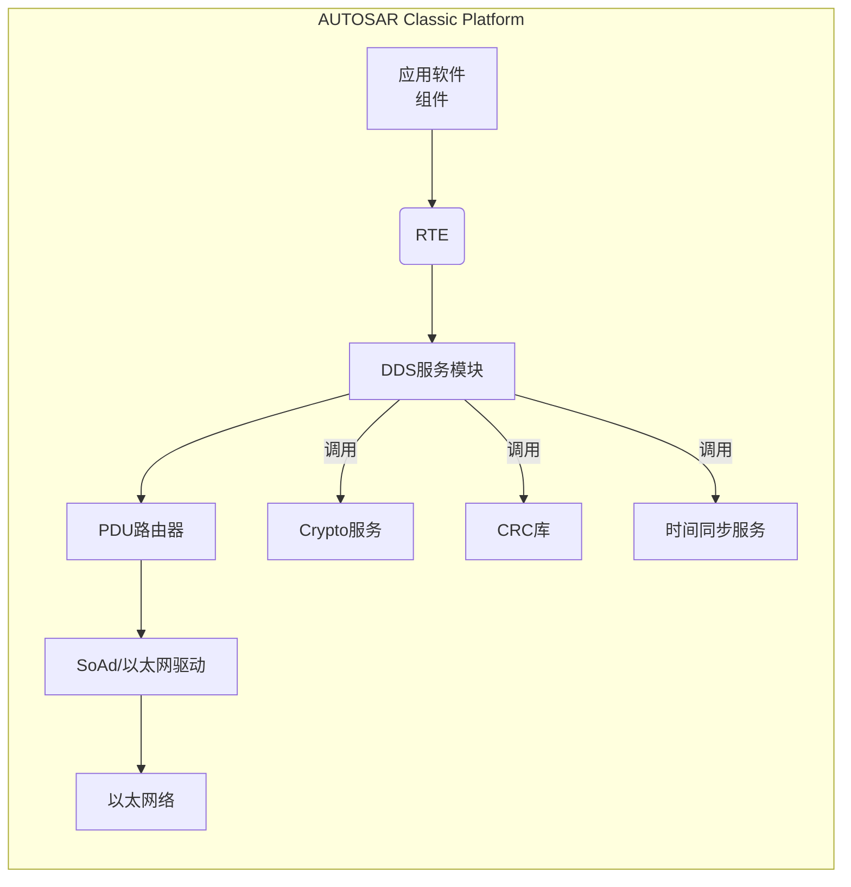
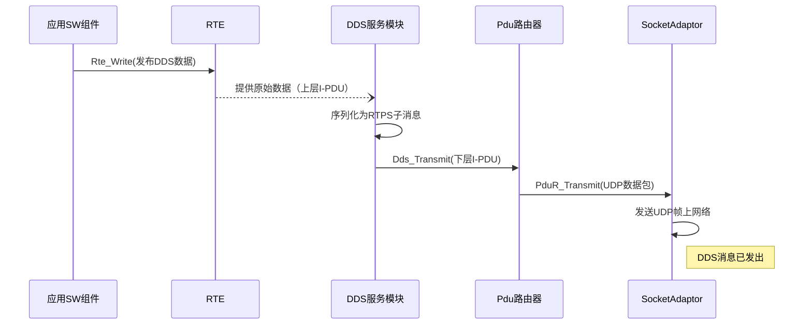
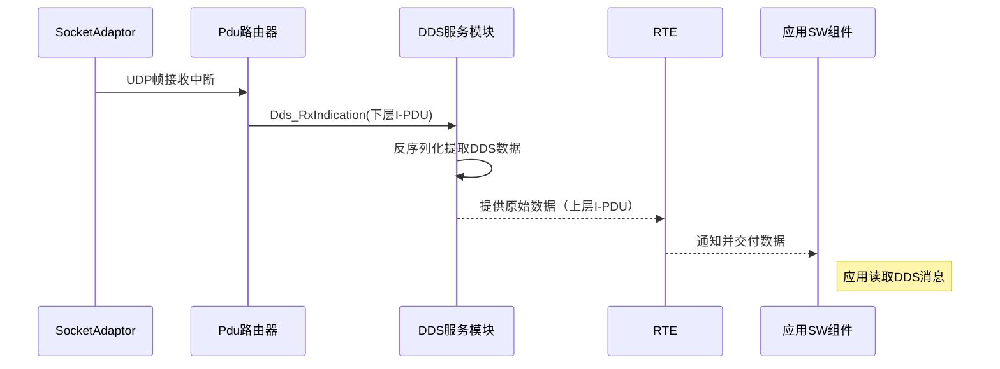

## 引言与背景

随着汽车电子电气架构的演进，车辆内部和车际间的数据交换需求日益增长，传统的面向信号总线（如CAN/FlexRay）和面向服务通信（如SOME/IP）在**大数据量、多发布/多订阅**场景下开始遇到挑战。近年来，由OMG（对象管理组织）提出的DDS（*Data Distribution Service*，数据分发服务）成为嵌入式分布式系统中流行的高性能**数据中心发布/订阅**中间件标准。在汽车领域，DDS以其**数据驱动**、高吞吐量和灵活QoS等特性，逐渐受到关注。AUTOSAR组织自2018年在Adaptive Platform引入DDS以来（作为通信管理的一种网络绑定），近期也在Classic Platform中推出了DDS基础软件模块。**AUTOSAR Classic DDS模块**的规范在AUTOSAR R22-11中首次发布（由华为主导提案，RTI等公司支持），目标是为经典平台上的ECU提供DDS数据分发能力。

本篇博客将面向AUTOSAR开发工程师、通信协议研究人员和嵌入式系统学习者，对AUTOSAR Classic Platform中DDS协议的实现原理与模块设计进行深入剖析。内容涵盖DDS基础概念、AUTOSAR官方规范解读、Classic DDS模块架构与接口、QoS策略、序列化/安全/安全机制（E2E）、Fast-DDS开源实现分析、AUTOSAR DDS与Fast-DDS的映射和集成、典型配置示例、与SOME/IP及CAN等通信的关系，以及DDS在车载通信中的实际应用场景和Classic与Adaptive平台DDS方案的差异对比等方面。文章将通过丰富的**Mermaid图表**、代码片段（包括ARXML配置和C/C++示例）以及必要的注释说明，帮助读者系统地理解AUTOSAR Classic DDS模块的设计思想和实践要点。

## DDS基本概念与OMG标准简介

**数据分发服务DDS**是OMG在实时分布式系统领域制定的一套**发布/订阅（Pub/Sub）**中间件协议和API标准。DDS采用**数据中心（Data-Centric）**的通信模型，将系统中交流的信息抽象为**主题（Topic）**，数据通过**全局数据空间**进行分发。在DDS中，参与通信的主要实体包括：

* **Domain（域）**：DDS通信的逻辑范围，用一个整型域ID标识。处于**相同Domain ID**的参与者才能互相发现并交换数据，不同Domain则相互隔离。DDS的默认实现通常将Domain与特定的网络端口范围或多播地址相关联，使相同Domain内的节点通过固定端口进行发现和通信。
* **DomainParticipant（域参与者）**：应用进程在某个DDS域中的实例，是DDS实体的顶级容器。一个DomainParticipant代表节点在该域上的身份，负责创建所属域内的**发布器（Publisher）**、\*\*订阅器（Subscriber）**和**主题（Topic）\*\*等实体，并提供对这些实体的管理。多个DomainParticipant可存在于同一进程或不同设备上，只要它们共享Domain ID就属于同一DDS网络。
* **Topic（主题）**：DDS通信的基本单元，定义了数据的名称和类型。Topic可以理解为**数据流的名称**，只有发布和订阅**同名同类型Topic**的实体才能进行数据匹配。Topic在一个Domain内必须具有唯一的名称。每个Topic关联一个数据类型，通常使用IDL（接口描述语言）或OMG定义的**XTypes**类型系统定义数据结构。
* **Publisher（发布器）**：用于发送DDS数据的实体，作为**数据发布端**的角色。Publisher可以包含一个或多个**DataWriter（数据写入器）**。Publisher本身主要用于对一组DataWriter进行QoS配置的批管理，一个DomainParticipant下可创建多个Publisher实例（例如划分不同功能模块）。但在AUTOSAR Classic DDS配置中，Publisher是可选容器（0..\*），若不配置则DataWriter也可直接隶属于Participant。
* **DataWriter（数据写入器）**：真正执行数据发送的DDS实体。每个DataWriter关联到一个特定Topic，应用通过调用DataWriter的写接口将数据实例发布出去。DataWriter维护着该Topic的数据变化历史（DataWriterHistory）用于可靠传输和历史缓存等。在DDS中，写入操作通常支持**异步/同步**模式和多缓冲策略，如果可靠QoS下缓冲区满时写操作可阻塞或超时。多个DataWriter可以发布同一Topic（多发布者场景），DDS协议确保所有匹配的订阅者都能收到数据。
* **Subscriber（订阅器）**：用于接收DDS数据的实体，作为**数据接收端**的角色。一个Subscriber可以包含一个或多个**DataReader（数据读取器）**。类似Publisher，Subscriber提供对其包含的DataReader的一组QoS批配置功能，一个DomainParticipant下也可创建多个Subscriber实例。
* **DataReader（数据读取器）**：真正执行数据接收的DDS实体。每个DataReader订阅一个特定Topic，DDS中只有Topic匹配且QoS兼容的DataWriter和DataReader之间才能建立数据流通道。DataReader将接收到的网络数据反序列化为应用数据，并提供缓存（DataReaderHistory）来存储未读样本。应用可以通过轮询读取或注册监听器回调的方式获取新数据。DataReader也维护一些状态（如实例状态、样本状态）供应用检查（例如区分新数据或重复数据等）。

除了以上主要实体，DDS规范还定义了**QoS策略**（Quality of Service）和**Listener**（监听器）机制。**QoS**策略允许对Topic、DataWriter、DataReader等实体的行为进行配置，例如可靠性、历史深度、延迟预算等，从而**塑造数据分发的服务质量**。**Listener**则是一种回调接口，实体可通过Listener来异步接收事件通知（如数据到达、匹配上新发布者等）。凡是支持QoS配置和事件回调的DDS对象都称为**DDS实体**。

DDS的通信**模型特点**是**发布/订阅松耦合**：发布者和订阅者之间并不直接互知对方，而是通过共同的Topic名称和类型在DDS中进行匿名匹配。DDS运行时提供**自动发现**功能，利用RTPS（Real-Time Publish Subscribe）**发现协议**在Domain内发现新的参与者、发布者和订阅者，并建立通信关系。这带来高度的动态性和扩展性。然而，在资源受限或安全需求高的场合，也可以使用**静态配置**的方式预先指定参与者和Topic匹配，以避免动态发现的开销。

作为一个**开放标准**，DDS规范定义了接口（DDS-DCPS层）和**网络互通协议RTPS**。多家公司和组织实现了DDS标准，如RTI Connext DDS、eProsima Fast-DDS、Eclipse Cyclone DDS等。DDS的网络互操作性由RTPS协议保障——RTPS是一种二进制**消息协议**，规定了DDS数据在网络上传输的封装格式和**发现机制**，从而实现不同厂商DDS实现之间的互联通信。DDS规范从1.2版开始还定义了**扩展可携带类型（XTypes）**，支持复杂数据类型的描述和序列化规则（如可变长度序列、可选字段、兼容版本演化等），这也是DDS区别于简单消息协议的重要特性之一。

总之，DDS提供了一个**高性能、可扩展、数据中心化**的通信中间件，在汽车中的V2X通信、ADAS传感器融合、车辆云数据同步等场景有潜在应用。下面我们将深入AUTOSAR Classic平台DDS模块，看看AUTOSAR如何将DDS引入传统ECU架构。

## AUTOSAR Classic DDS模块架构与关键接口

AUTOSAR Classic平台的DDS模块（在AUTOSAR规范中称为**Dds BSW Module**）定位于**基础软件服务层**，为应用软件提供DDS协议的数据发布/订阅能力。它并非一个独立运行的进程，而是集成在经典平台的OS和BSW框架下，通过与RTE、PduR等模块协作实现通信功能。根据AUTOSAR官方规范，DDS模块与多个基础软件模块存在接口依赖关系，包括：

* **RTE（运行时环境）**：DDS模块的周期性任务（MainFunction）由RTE的BSW调度器调用，从而在OS上按配置的周期运行。RTE还充当应用与DDS模块之间的数据接口桥梁。
* **PduR（PDU路由器）**：DDS模块将打包好的DDS网络报文通过PduR下发到底层通信驱动；同时从PduR接收来自网络的DDS报文。PduR在DDS模块中担当“上下层PDU”路由的中介。
* **SoAd（Socket Adapter）/以太网驱动**：虽然规范未直接列出SoAd，但DDS通信显然依赖以太网TCP/IP栈发送UDP帧。典型实现中，DDS模块通过PduR与SoAd交互，将DDS数据发送到UDP端口或从UDP端口接收DDS数据帧。
* **StbM（时间基管理）**：用于获取高精度时间戳。DDS/RTPS允许在发送消息中附带发送时间。Classic DDS模块调用StbM\_GetCurrentTime提供时间戳，以支持例如DESTINATION\_ORDER等QoS策略按发送时间排序数据。
* **Crypto Service Manager（加解密服务管理）**：用于DDS安全机制，例如生成和校验消息鉴权码MAC。DDS模块通过CryptoSM的Csm\_MacGenerate和Csm\_MacVerify接口完成消息签名和验证。配置上需要为DDS模块指定使用的CSM Job以及对应的密钥等（后续安全机制部分详述）。
* **CrcLib（CRC校验库）**：用于DDS安全机制中的数据完整性校验。DDS模块通过Crc\_CalculateCRC32/64接口对发送数据计算CRC或校验接收数据中的CRC。这与AUTOSAR的E2E（端到端）通信保护机制类似，提供检测数据篡改或错误的能力。

在AUTOSAR架构中，DDS模块被归类为一个基础软件模块，遵循AUTOSAR BSW模块的通用规范。它提供标准的模块初始化、主函数、传输接口和错误通知等API。本节我们先总体介绍DDS模块在Classic平台的架构定位，然后详细说明其关键接口和运行时流程。

### 模块架构概览

AUTOSAR Classic的DDS模块可以视为在**通信服务层**提供的一种新的通信协议支持，与传统的COM/SOMEIP等通信栈并列。不同之处在于DDS模块直接面向应用的发送/接收数据（RTE信号）进行序列化处理，然后通过以太网发送RTPS报文。下图展示了DDS模块在Classic平台中的分层结构及交互关系：



如上所示，应用SW组件通过RTE与DDS模块交互：发送数据时，RTE将来自应用的信号（未序列化数据）提供给DDS模块，后者序列化后交给PduR路由到底层SoAd发送为UDP/IP帧；接收数据时，SoAd收到UDP帧通过PduR通知DDS模块，DDS模块反序列化出应用数据并通过RTE交付给应用。整个过程中，DDS模块需要使用Crypto服务进行消息认证、使用CRC库进行数据CRC附加/校验、使用时间服务获取时间戳等。需要注意，DDS模块的以太网通信**独占特定UDP端口**，不得与SOME/IP等共用端口或套接字，以避免干扰。AUTOSAR明确规定DDS和SOME/IP**不能共享接收端口**，也不能混用同一SoAd Socket连接。因此通常会为DDS模块在SoAd中配置**专用的UDP通道**（端口号区分于SOME/IP端口）。

另一方面，DDS模块**仅支持在以太网上的UDP/IP通信**，不支持直接在CAN等非IP总线上承载DDS协议。规范指出根据OMG DDS标准，应使用UDP/IP作为DDS的运输层协议。因此，DDS模块目前定位于**车载以太网**环境，在CAN、LIN等总线上的使用（比如将DDS消息网关到CAN）不在支持范围内。

### 关键接口与运行流程

AUTOSAR DDS模块面向上层提供类似Com或PduR的接口，但由于DDS自身需要进行数据序列化和协议处理，其接口略有不同，主要包括以下函数（AUTOSAR\_SWS\_DDS规范第8章定义了API）：

* **Dds\_Init(ConfigPtr)**：模块初始化函数。在系统启动时由ECU状态管理调用，传入配置指针。该函数配置内部缓冲区、状态和数据结构，将DDS模块置为初始化就绪状态。注意DDS模块要求在初始化时就获取所有必要的静态配置信息（通过Config结构），运行过程中不支持动态改变配置。
* **Dds\_Transmit(TxPduId, \*PduInfo)**：数据发送请求接口。当上层（RTE/PduR）有DDS相关的I-PDU需要发送时，调用此函数提交数据给DDS模块处理。参数TxPduId标识要发送的“上层PDU”，PduInfo指向待发送的数据和长度。DDS模块接收到调用后，会首先验证参数合法性（如模块已初始化、PDU ID有效等），然后将收到的未序列化数据**存入内部发送缓冲**，触发后续的序列化与网络发送过程。如果缓冲已满或请求不可接受，则Dds\_Transmit返回失败并通过Default Error Tracer报告错误。成功接受时返回E\_OK，但不代表立即发送完成，只表示已进入DDS模块待发送队列。实际发送由模块的任务函数异步完成。需要注意，根据设计**RTE/Com并不对DDS数据做任何序列化**，因此传给Dds\_Transmit的PDU内容就是应用原始数据。
* **Dds\_RxIndication(RxPduId, \*PduInfo)**：数据接收指示接口。当下层（PduR/SoAd）接收到DDS相关的网络PDU时，调用此函数通知DDS模块。参数RxPduId标识接收到的“下层PDU”，PduInfo包含数据指针和长度。DDS模块收到后，将网络报文存入内部接收缓冲，随后由模块任务解析处理。如果接收缓冲满或者PDU不期望，则可报告相应错误。正常情况下此函数不应长时间阻塞，快速返回，实际的数据解析在后续周期函数中进行。
* **Dds\_TxConfirmation(TxPduId)**：数据发送确认接口。当下层传输模块（如SoAd/TCPIP）完成一个PDU发送后，PduR调用此函数告知DDS模块发送完成。DDS模块据此可以更新内部状态（例如清除对应缓存，统计发送成功）等。如果发送失败或丢弃等情况，DDS模块也可能通过该接口得到通知（例如错误码），并采取相应处理。
* **Dds\_TriggerTransmit(TxPduId, \*PduInfo)**：发送触发接口。这是在一些情况下下层模块主动向上请求数据的接口。例如某些协议（像CAN FD的TP传输）可能在需要数据时调用此函数让DDS提供下一段数据。但规范中限制DDS的TriggerTransmit仅用于**下层主动调用**的场景，应用层不应直接调用。Classic平台中一般使用周期发送，不太依赖TriggerTransmit。
* **Dds\_MainFunctionTx() / Dds\_MainFunctionRx()**：DDS模块的主函数任务，分别负责发送处理和接收处理。RTE会依据配置的周期调用这两个函数（例如周期10ms等）。**Tx主函数**负责从发送缓冲取出待发送的数据，将其封装为DDS RTPS消息后通过PduR发送出去，并处理重发等待等；**Rx主函数**则检查接收缓冲，如果有新报文则进行解析，提取DDS样本数据并交付上层。AUTOSAR规定这些主函数必须是非阻塞、快速返回的，不应有长耗时操作，避免影响周期调度。
* **Det\_ReportError() / Det\_ReportRuntimeError()**：错误上报接口。DDS模块在开发模式下通过DET报告参数错误、状态错误等开发错误，在运行时如果发生通信异常（如序列化失败、CRC校验失败等）则通过DEM报告运行时错误码。这些接口不是DDS模块独有，但在DDS实现中必须正确调用，以方便调试和诊断。

结合以上接口，DDS模块的**发送/接收流程**可以详细描述如下。为了清晰起见，我们以时序图展示应用数据从发送端SWC一直到接收端SWC的过程：

#### DDS消息发送流程



如上，应用通过`Rte_Write()`调用发送DDS数据（例如某传感器数据Topic）。RTE根据配置识别出该数据属于DDS通信，随后**直接调用DDS模块**（可能通过PduR的上层API间接调用）提供未序列化的数据缓冲。DDS模块接受数据后，将按照DDS XTypes标准将其**序列化**封装成RTPS协议的**Data子消息**，存入内部发送队列。接着，DDS模块调用`PduR_DdsTransmit`将该序列化后的**下层I-PDU**交给PduR。PduR根据路由配置，将该PDU发送给SoAd的UDP传输接口。SoAd则通过底层以太网驱动发送UDP帧到网络上。整个流程中，DDS模块对应用数据做了关键的**序列化和协议封装**，其他层基本不干涉数据内容。

#### DDS消息接收流程



在接收端，SoAd监听DDS专用端口，当有UDP包到达时触发接收中断，报文经TCP/IP栈递交给PduR。PduR识别该UDP PDU属于DDS通信，遂调用DDS模块的`Dds_RxIndication`接口，将报文数据传入DDS模块。DDS模块将此网络数据加入接收缓冲，并很快在其Rx主函数中对报文进行**解析和反序列化**。若数据通过安全检查和QoS过滤，DDS模块从中恢复出原始的应用数据（即DDS样本），写入对应的RTE信号（上层I-PDU）缓冲。最后，RTE将此新数据交付给应用SWC，常见方式包括：触发绑定的Rte\_ReceiveEvent通知任务或设置相应的接收旗标，由应用在下一个周期调用Rte\_Read读取数据等。至此，一个DDS发布的数据样本顺利抵达了远端订阅该Topic的应用。

需要强调，在Classic DDS模块中，**应用与DDS模块交互的粒度是信号（I-PDU）级别**，应用并不直接感知DDS的Topic概念，也不直接调用DDS API（不像Adaptive中应用可以使用DDS API）。应用只是通过通常的Rte\_Write/Rte\_Read对某个端口发送/接收数据，而底层已将该端口/信号映射为DDS Topic发布/订阅。这样做的好处是：**沿用AUTOSAR既有的发送接收接口语义**，开发者无需学习新的API即可使用DDS通信。然而，与之相应的限制是：DDS很多动态特性在Classic平台上变成**配置期静态定义**——Topic名字、数据类型、发布者/订阅者关联等全都在配置工具中确定，运行时不能改变。这正是Classic平台与Adaptive平台在DDS支持上的根本区别之一，后文会详细讨论。

### 模块配置与内部结构

为了支持上述运行，DDS模块在实现上维护一定的数据结构和配置。根据AUTOSAR规范，DDS模块的配置主要包括：

* **General配置**：模块全局配置参数，例如开发错误检测开关（DdsDevErrorDetect）、下层PDU缓冲大小（DdsLowerLayerIPduBufferSize）、主函数调用周期（DdsMainRxFunctionPeriod / DdsMainTxFunctionPeriod）等。这些参数由容器`DdsGeneral`承载，一般在ECU配置时统一设定。

* **DdsIPdu定义**：用于描述DDS模块涉及的I-PDU。DDS模块实际上处理两类I-PDU：**上层I-PDU**（未序列化数据）和**下层I-PDU**（已序列化的RTPS数据）。配置中每个DdsIPdu条目通常包含：一个唯一的Pdu ID、Pdu长度、方向（上层或下层）等属性，以及可能的缓冲大小等。上层I-PDU往往对应应用信号的数据块，下层I-PDU则对应网络传输的RTPS消息。DdsIPdu配置在Ecuc上属于`DdsConfig`容器的子容器。

* **DomainParticipant配置**：即DDS域参与者配置。在Classic DDS配置中，每个ECU节点可以**属于一个或多个DDS Domain**。为此，配置可以添加多个`DdsDomainParticipant`条目，每个包含：DomainParticipant ID（对应DDS Domain ID）、可选的QoS设置（如EntityFactory等）、可选的Crypto信息（配置安全所需的CSM Job引用）等。更重要的是，每个DomainParticipant下面会配置具体的Publisher、Subscriber、Topic等子容器来定义通信内容。

* **Topic配置**：每个DomainParticipant下可配置若干`DdsTopic`子容器。Topic配置包含**Topic名称**（DdsTopicName）和**关联的数据类型**（DdsTopicImplementationType）。数据类型引用的是已有的AUTOSAR Implementation Data Type定义，类别可以是结构、基本类型、数组等。Classic DDS模块要求Topic名在Domain内唯一且所用数据类型不含不支持的成分（如联合union、指针）。Topic还包含一个子容器`DdsTopicQoS`，其中可以配置Topic层面的QoS策略，比如是否设置Topic级别的注释数据（TopicData QoS）等。

* **Publisher/Subscriber配置**：在DomainParticipant下，可选地添加Publisher和Subscriber容器来归组DataWriter和DataReader。每个`DdsPublisher`包含0..\*个DataWriter，`DdsSubscriber`包含0..\*个DataReader。Publisher/Subscriber本身也可有QoS配置（PublisherQoS/SubscriberQoS），如组数据QoS（GroupData）、分区QoS（Partition）、展示顺序QoS（Presentation）等。不过在很多简单配置场景，可以不显式配置Publisher/Subscriber容器，让DataWriter/DataReader直接隶属于DomainParticipant也是允许的（Multiplicity下界为0）。

* **DataWriter/DataReader配置**：这是最重要的部分，定义具体发布和订阅的数据端点。每个`DdsDataWriter`配置对应DDS一个数据发布端，包含：

  * 引用所属Topic（DdsDataWriterTopicRef）。
  * 引用一个上层I-PDU（DdsDataWriterUpperLayerIPduRef）作为数据来源，即应用向DDS提供的数据缓冲。
  * 引用一个下层I-PDU（DdsDataWriterLowerLayerIPduRef）作为序列化后发送的数据单元（将发送至网络）。
  * DataWriter的QoS配置容器（DdsDataWriterQoS），支持配置此DataWriter相关的各类QoS策略。
  * DataWriter所属的Publisher（通过父容器关系已明确）。规范规定一个DataWriter只能属于一个Publisher，Publisher可以有多个DataWriter。

  相应地，每个`DdsDataReader`配置对应DDS一个数据订阅端，包含：

  * 引用所属Topic（DdsDataReaderTopicRef）。
  * 引用一个下层I-PDU（DdsDataReaderLowerLayerIPduRef）作为网络接收的载体。
  * 引用一个上层I-PDU（DdsDataReaderUpperLayerIPduRef）作为提供给应用的缓冲。
  * DataReader的QoS配置容器（DdsDataReaderQoS），其中可配置此DataReader支持的QoS策略。
  * DataReader所属Subscriber（通过父容器关系）。一个Subscriber可含多个DataReader，但DataReader仅属单一Subscriber。

  值得注意的是，DataReader的UpperLayerIPduRef容许配置**多个**（Multiplicity 1..\*）。这意味着一个DataReader可以将收到的DDS数据发布给多个上层I-PDU（例如多个应用接收端）。这在配置上为一对多数据分发提供了支持。当然，也可以通过RTE直接将一个上层PDU映射给多个接收端SWC，但配置多个UpperLayerIPduRef更灵活，可针对不同接收方定制不同I-PDU。

* **QoS策略配置**：QoS是DDS的重要特性，AUTOSAR通过配置容器将支持的QoS实例化为参数。如前述，每类实体（Topic/DataWriter/DataReader/Publisher/Subscriber/DomainParticipant）均有对应的QoS子容器，可选地启用某些QoS策略。例如：

  * *Durability*（持久化）QoS：控制DDS样本在发布端保存及新加入订阅者时获取历史数据的策略。Classic DDS支持VOLATILE和TRANSIENT\_LOCAL等级别。配置上Durability QoS是Topic/DataWriter/DataReader均可设置的（TopicQoS和DataWriterQoS/DataReaderQoS里都有Durability子容器）。
  * *Reliability*（可靠性）QoS：控制传输可靠性，可设置BEST\_EFFORT或RELIABLE。Classic DDS模块支持可靠传输，配置上通过DdsReliability子容器启用并可设置MaxBlockingTime等参数。
  * *History*（历史记录）QoS：指定DDS缓存保留多少历史样本，可配置KEEP\_LAST(N)/KEEP\_ALL以及深度等。
  * *Deadline*（期限）QoS：发布者承诺数据发布的周期，订阅者端可监视是否发布方失约。配置上在DataWriterQoS/DataReaderQoS里可添加DdsDeadline并设定期限时间。
  * *LatencyBudget*（延迟预算）QoS：提示数据传输的期望延迟，可以帮助中间件优化。
  * *Liveliness*（存活性）QoS：用于监测参与者或DataWriter是否存活（需定期发送心跳），Classic模块支持该QoS以检测节点故障。
  * *Ownership*（所有权）QoS及*OwnershipStrength*：用于多发布者争夺同一数据源时决定哪一个发布的数据有效（独占/共享所有权，及强度值）。
  * *TimeBasedFilter*（基于时间过滤）QoS：允许DataReader声明只想每隔一定时间获取一次数据，即跳过过于频繁的样本。这对节流高频数据很有用。
  * *Lifespan*（寿命）QoS：让发布的数据在DDS网络中只存活一定时间，到期未被读就丢弃（类似有效期）。
  * *UserData / TopicData / GroupData*：允许在实体（Participant、Topic、Publisher等）上附加任意用户数据（比如标识），可用于发现匹配或调试。配置上有对应容器可填充字节数组。
  * *Partition*（分区）QoS：Publisher/Subscriber可以设置字符串分区名，只有分区匹配的发布订阅才通信。Classic配置提供Partition容器来列举分区名称。
  * *Presentation*（展示顺序）QoS：控制同一Publisher或Subscriber下不同Topic数据在分发时的组播顺序（例如是否保序、组顺序等）。经典模块支持Basic的Presentation配置。
  * *EntityFactory* QoS：控制Participant创建子实体时的自动启用行为。可在ParticipantQoS/PublisherQoS/SubscriberQoS配置EntityFactory布尔值。

  **小结**：Classic DDS模块支持了OMG DDS标准中**大部分主流QoS**策略，只是因为Classic的静态配置性质，所有QoS都是**编译期配置**，节点运行中不会动态协商QoS。发布者与订阅者QoS不兼容时将无法配对通信，因此在设计配置时需确保QoS设置一致或兼容。例如订阅者要求可靠，而发布者配置不可靠，那么就不会匹配。AUTOSAR配置工具应在生成配置或校验时就发现这种不一致并报错。

经过以上配置和架构分析，我们可以看到：AUTOSAR Classic DDS模块本质上将DDS通信概念映射到了AUTOSAR已有的通信配置模型上——通过**容器和参数**描述Domain、Topic、Publisher、DataWriter等，并关联到AUTOSAR信号（IPdu）以承载数据，再利用已有PduR、SoAd模块完成实际传输。**应用软件不直接调用DDS API**，而是通过读写RTE端口来发布/接收数据；DDS模块在背后完成序列化和协议处理，实现了DDS网络通信。这种设计在AUTOSAR生态中最大化了复用和兼容性，也符合AUTOSAR追求配置可管理、组件可替换的理念。

接下来，我们将深入DDS模块在关键方面的实现细节，包括数据序列化机制、支持的安全机制和功能安全（E2E）机制等。

## DDS数据序列化机制与类型映射

**数据序列化**是DDS模块实现中的核心环节。DDS数据需按照RTPS协议规定的格式序列化成二进制后通过网络传输，并在接收端反序列化还原。AUTOSAR规范明确要求Classic DDS模块对数据进行**标准DDS序列化**，并遵循OMG DDS的**线缆互通协议（Wire Protocol）**。这意味着Classic DDS模块序列化后的数据应完全符合RTPS（DDSI-RTPS）2.2标准。这样才能保证与其他DDS实现（如ROS2节点或Adaptive上的DDS应用）在网络层面互通。

Classic DDS模块的序列化机制基于**DDS XTypes 1.2规范**。XTypes定义了扩展的可携带类型系统和CDR（Common Data Representation）序列化规则。以下是Classic DDS序列化的要点：

* **等价数据类型映射**：AUTOSAR应用数据类型（Implementation Data Type）需要映射到DDS的内建类型。规范提供了一张AUTOSAR基元类型到DDS基本类型的对应表。例如：AUTOSAR的`uint8`/`sint8`都对应DDS的Byte类型，`uint16`->UInt16，`sint16`->Int16，布尔类型直接对应DDS Boolean，float64对应Float64等。利用这张表，DDS模块知道如何将基本数据按DDS标准大小端格式编码。
* **字节序和对齐**：DDS CDR序列化默认采用**小端序**编码（XTypes允许大端，但实际实现通常使用小端），并对数据按4字节边界对齐填充。Classic DDS模块在序列化时必须确保与DDS其他实现采用相同的字节序和对齐规则，以互通。规范提到要按照DDS标准的序列化规则，包括字符串的编码格式和末尾对齐填充。
* **结构体、数组序列化**：对于AUTOSAR定义的结构体类型、静态数组类型，DDS模块按DDS XTypes的规则序列化各字段。规范要求：

  * 数组类型：按照DDS ARRAY类型的规则序列化，即数组元素顺序展开。
  * 结构类型：按照DDS STRUCT类型规则序列化各成员，并对于AUTOSAR中声明为可选（Optional）的成员，在序列化中标记Present/NotPresent标志。Classic DDS模块需要根据ImplementationDataType的可选性为可选字段添加标志位。
  * 枚举类型：按照DDS ENUM类型序列化，将枚举值（通常是int）序列化。
* **不支持的类型**：Classic DDS模块**不支持**序列化包含联合（union）或指针类型的AUTOSAR数据类型。如果某Topic的数据类型含union或pointer，配置验证应报错禁止。因为DDS XTypes虽然支持union，但实现复杂且Classic明确未实现对union的处理。同样指针在网络传输没有意义。所有需传输的数据类型必须是值类型且可确定大小。
* **序列（Sequence）**：DDS的sequence相当于可变长数组。在AUTOSAR层面若需可变大小集合，一般通过动态长度的ImplementationDataType或者传输时使用一个长度字段+后随数组模拟。Classic规范目前未详细提及动态长度序列支持，但XTypes 1.2支持sequence类型。考虑到“DDS Dynamic类型”在限制中被提及不支持（Dynamic Discovery未支持），Classic可能暂不支持真正可变长序列，或需要通过固定长度最高值+长度字段方式实现。
* **序列化触发**：根据规范要求，**不得在RTE级别进行任何数据转换**，DDS模块应接收原始数据并自行序列化。这保证了序列化规则完全由DDS模块掌控，避免与RTE transformers冲突。因此RTE配置不得为DDS相关的信号添加Transformer，否则配置检查会报错。
* **反序列化**：在接收端，DDS模块读取RTPS消息，对其中的Data数据进行反序列化，恢复出原始类型。这里需要借助先前配置的类型信息（TopicImplementationType）来解释字节流。Classic模块可使用静态生成的解析代码或者通用解析库。反序列化后数据存入上层I-PDU供应用读取。

值得一提，DDS模块在实现序列化时可以**借鉴利用现有DDS序列化库**。例如，eProsima的Fast-DDS实现有独立的Fast-CDR库用于高效序列化；RTI Connext Micro也提供序列化支持。如果Classic DDS模块实现者选择集成这些库，可以减轻开发工作并保证互通性。AUTOSAR标准未规定实现细节，但要求结果必须符合DDS规范。

下面以一个简单示例说明Classic DDS序列化：假设定义一个Topic "RadarObject"，数据类型为：

```c
struct RadarObject {
    uint32 id;
    float32 distance;
    float32 speed;
};
```

AUTOSAR中对应ImplementationDataType为一个结构，包含id、distance、speed三个元素。DDS模块序列化一个RadarObject实例时，将按DDS XCDR编码：

* `id`（UInt32）占4字节小端序。
* `distance`（Float32）占4字节，根据CDR需要对齐到4字节边界（前面的id已经4字节，对齐满足），序列化为IEEE 754小端字节。
* `speed`（Float32）同样4字节紧随其后。
  总共序列化结果12字节。如果有可选字段或序列，需要额外标志或长度信息。

反序列化时则逆过程重建RadarObject结构。如果传输中字节序不同（DDS支持大端模式），需要转换字节序；但通常双方约定都使用小端。

通过以上过程，Classic DDS模块实现了将应用的原生数据类型映射到DDS的传输表示，实现**端到端的类型安全通信**。这一机制使得不同ECU只要配置了相同的Topic名和数据类型，就能在网络层直接交换解析后的数据结构，极大地方便了多节点间复杂数据的共享。

## DDS信息安全机制（DDS Security）

在车联网和高度自动驾驶场景下，通信的**信息安全**尤为重要。DDS标准提供了**DDS-Security**扩展规范（版本1.1）用于支持认证、加密、访问控制等安全特性。AUTOSAR Classic DDS模块为了能够与其他DDS系统互通，也要求实现DDS-Security定义的安全机制。根据AUTOSAR规范，Classic DDS的安全机制主要聚焦在**消息认证**和**保密性**方面，结合AUTOSAR Crypto Service提供服务：

* **消息完整性与认证（MAC）**：Classic DDS模块支持对发送的每条DDS消息计算并附加**消息鉴别码（MAC，Message Authentication Code）**，接收端验证MAC以确保消息未被篡改且确实来自可信发送者。具体实现上，DDS模块利用Crypto Service Manager中配置的对称密钥算法来生成MAC。配置里每个DomainParticipant可以指定一个MAC生成的CSM任务（DdsDomainParticipantCsmAuthenticateJob）和一个MAC校验任务（DdsDomainParticipantCsmVerifyJob），并要求这两个任务使用**相同的对称密钥**算法且共享密钥。这样，一个DomainParticipant内的所有DDS实体发送的消息都会带上基于该密钥的MAC，接收方（使用同密钥配置的Participant）验算MAC匹配则接受，否则丢弃消息并报告错误。目前Classic DDS仅支持对称密钥（如HMAC），不涉及公私钥签名，这是考虑到ECU资源有限以及车内多为闭域通信，预共享对称密钥较为高效。
* **访问控制**：DDS-Security规范包括基于权限文件的访问控制，即控制哪个Participant可以发布或订阅哪些Topic。Classic DDS未提及实现复杂的权限检查机制，可能依赖于配置约束（系统设计时就约定哪些节点有权限）。Adaptive DDS已有IAM（Identity and Access Management）功能集成DDS认证。Classic由于资源限制，目前重点在MAC鉴权，真正的身份认证（如基于证书的握手）并未实装。可以推测在未来版本，Classic可能引入轻量认证机制，但现阶段DDS Classic更适用于**预先信任模型**下的封闭网络。
* **保密（加密）**：DDS-Security允许对数据payload加密传输。Classic规范未明确说明是否实现加密。但Crypto SM同样可提供对称加密算法。如果需要机密性，完全可以在发送时对序列化后的数据字段加密、接收时解密。考虑到性能和实时性，Classic ECU上对大型数据全量加密可能开销较大。当前版本或许主要聚焦MAC，不对数据加密。但这并不妨碍在将来扩展。例如，可配置Crypto Job用于AES加解密DDS数据。如果启用加密，则安全配置需包含密钥分发等。Adaptive DDS方面已经在DDS网络绑定中规划了与AUTOSAR安全管理集成实现DDS加密。
* **安全握手与发现**：DDS安全规范定义了Participant间的鉴权握手和安全发现过程。然而Classic DDS由于**关闭了动态发现**，所有通信关系静态配置，因此在Classic场景可能**跳过复杂的握手**，改为离线预共享密钥。这简化实现，也避免在资源受限ECU上跑公钥证书运算。即Classic可能假定每对通信参与方在配置时已经分配了相同的密钥，故不需要运行时交换。这样上面说的MAC验证即可保证通信双方身份。虽然不如完整DDS-Security的认证体系安全，但在车内封闭网络中通常可接受。
* **配置与密钥管理**：安全的配置集中在`DdsDomainParticipantCryptoInfo`容器中，包括两个引用：AuthenticateJob和VerifyJob，以及隐含地需要Crypto Key的配置。这些CSM Job在Crypto服务配置中会绑定具体的算法（如HMAC-SHA256）和密钥槽位。AUTOSAR并未定义如何管理密钥，但典型做法是通过OTA或生产线把对称密钥载入每个ECU的Crypto驱动，配置用引用指向相应密钥的Job即可。密钥需确保通信双方一致，并且对于不同DDS Domain或不同通信组可以用不同密钥以实现域隔离。规范要求同一DomainParticipant配置的生成和验证Job**必须使用相同的密钥**，否则配置校验失败。开发者务必确保这一点。

当安全机制启动后，Classic DDS模块在**发送路径**上会在序列化后的数据末尾附加MAC（和可能的其它安全标头），从而增加PDU长度；在**接收路径**上则会根据安全头信息先验算MAC，比对失败则丢弃数据并报告`DDS_E_CSM_CHECK_FAILED`或`DDS_E_CRC_CHECK_FAILED`之类错误。这些错误通过Det\_ReportRuntimeError报告，便于故障监测。成功验证后再进行后续反序列化。

需要指出，AUTOSAR Classic DDS的安全机制与Adaptive DDS有些差异：Adaptive由于有更强算力，可以执行完整的DDS Security，包括实体认证、访问控制策略等。而Classic走的是**轻量级高效**路线，以MAC校验为主，辅以静态信任。对于大多数车内应用，这样的平衡是可接受的。在实际项目中，如果要达到更高安全要求，可能考虑让DDS通信跑在车载安全域中，或者通过安全MCU承担密钥管理和复杂握手，主ECU只做MAC校验。

综上，Classic DDS模块通过Crypto服务集成，实现了DDS消息级别的完整性保护，为车载DDS通信提供了**基础的信息安全保障**。随着AUTOSAR标准演进，我们可以期待将来Classic DDS模块会引入更多DDS-Security特性，比如基于DDS Identity的节点认证等，以满足更严苛的安全需求。

## DDS功能安全机制（E2E保护）

汽车系统还关注**功能安全**，即通信错误（如消息丢失、顺序错误、数据篡改）不能导致功能失效或危险行为。AUTOSAR在传统通信中采用**端到端（E2E）通信保护协议**（如E2E Library）加入序列号、CRC等检查手段。Classic DDS模块同样在DDS通信中融入了相应的安全机制，以满足ISO 26262的要求。

根据规范，DDS模块针对通信可能出现的典型故障，采取了如下措施：

* **重复或插入帧检测**：利用DDS RTPS协议中自带的**序列号**。RTPS Data子消息等都有序号（SequenceNumber），ACK/NACK反馈也包含期望序列号。DDS模块在发送时对每Topic每DataWriter维护递增的序列号，在接收端记录最近序列号。若接收到的序列号小于或等于已接收最大值，说明是重复或旧帧（可能攻击插入），模块将**丢弃该消息**并报告运行时错误`DDS_E_SAMPLE_REJECTED`。
* **丢失或次序错误检测**：同样基于序列号。若接收端发现新的序列号不是期望的下一个（跳号了），则判定发生丢帧或乱序。由于DDS可靠传输下乱序可能通过重排解决，但若是关键Topic在非可靠模式下丢失，模块将**报告`DDS_E_SAMPLE_LOST`错误**。对于可靠模式，RTPS内建会通过重传补齐，这种错误主要针对非可靠通信的监测。总之序号机制保证能够检测信息**遗失**或**顺序错误**情况。
* **信息延迟检测**：DDS的Deadline、LatencyBudget、Lifespan、TimeBasedFilter等QoS可用于监控和限制数据的时延。规范指出DDS模块应结合这些QoS监测是否出现数据延迟过大（发送者未在Deadline内发布或接收者长久未收到新数据）。如果发送端超时未发送，将报告`DDS_E_SENDER_TIMING_MISSED`，接收端超时未收到则报告`DDS_E_RECEIVER_TIMING_MISSED`。这样可以将通信超时作为故障传递给诊断层或安全机制处理（如进入安全状态）。需要配合配置合理的Deadline等QoS参数。
* **信息腐败检测**：通过**CRC校验**附加。Classic DDS模块对每个DDS消息计算CRC（32位或64位）附加在消息中。接收端重新计算CRC比对，不符则说明数据**腐化**（bit flip等），模块将丢弃消息并报告`DDS_E_CRC_CHECK_FAILED`运行时错误。CRC能够检测随机错误篡改，降低静默数据错误风险。
* **综合容错**：对于可靠传输场景，DDS模块本身结合RTPS可靠协议（ACK/NACK重传，heartbeat）提供传输层保证，再辅以上述机制，可实现**错误检测覆盖率**接近传统E2E Profile标准。非可靠传输场景下，则更多依赖序列号和CRC来发现问题。

值得注意的是，DDS的序列号和ACK机制主要保证可靠性，而CRC主要保证数据完整性，两者结合便可满足ISO 26262对通信**D等级**的一些要求（检测随机硬件错误和指定的故障模式）。AUTOSAR在DDS模块中集成这些机制，使DDS通信达到类似于CAN E2E保护的效果，这是Classic DDS模块相较普通DDS实现的一大特点，也体现了AUTOSAR面向功能安全的考量。

**示例**：假设ECU A和ECU B通过DDS交换制动指令（Topic "BrakeCmd"）。配置为可靠QoS且Deadline=100ms，同时启用CRC和MAC。ECU A每50ms发布一次序列号递增的命令数据：

* 若ECU B未在100ms内收到新命令，则DDS模块在ECU B报告接收超时（ReceiverTimingMissed）以提醒控制软件进入安全状态（例如冗余策略生效）。
* 若网络上某条指令帧重复到达或被攻击者重放，ECU B检测到序列号重复，丢弃并报告SampleRejected，不执行该指令。
* 若指令在网络中丢失，ECU B序号跳变，DDS可靠层会请求重传；如不可恢复则报告SampleLost，可触发降级处理。
* 若数据途中受干扰造成比特翻转，MAC或CRC校验将失败，DDS模块丢弃该帧并报告CRC校验失败错误，不会将错误数据交给应用执行。

通过以上机制，DDS模块将绝大部分通信故障都拦截在应用软件之外，提高了系统安全裕度。与Adaptive DDS相比，Classic DDS显式地引入CRC等措施，而Adaptive环境下可能假设传输可靠性主要由DDS QoS保障。不过据RTI消息，Adaptive DDS也在分析类似安全机制与ISO26262的对应。

综上，AUTOSAR Classic DDS模块融合了**序列号检查、超时监控、CRC校验**等手段，实现了一个**AUTOSAR风格的E2E通信保护**。这使DDS这种高性能通信机制在满足实时的同时，也满足功能安全对错误检测的要求，适合应用在对安全有要求的汽车系统中（如底盘控制分布式系统、冗余传感器融合等）。

## eProsima Fast-DDS源码实现分析

AUTOSAR Classic DDS模块的规范和实现虽然相对新颖，但我们可以借鉴现有开源DDS项目来加深理解。其中**eProsima Fast-DDS**（原称Fast RTPS）是一个广泛使用且开源的DDS实现（Apache 2.0许可），在ROS 2等系统中扮演默认DDS中间件角色。Fast-DDS以C++编写，支持Linux、Windows和一些RTOS环境，并具备良好的性能和可移植性。下面我们从Fast-DDS的架构、通信流程和序列化等方面，分析其源码设计，以类比AUTOSAR DDS模块的可能实现方式。

Fast-DDS的分层架构示意图（应用层、DDS层、RTPS层和传输层）。Fast-DDS整体分为四层：顶层为**应用层**（使用DDS API的用户应用），下方是**Fast-DDS层**（实现DDS规范的核心，常称DCPS层），再下是**RTPS协议层**（负责DDS互联的标准协议实现），最底层是**传输层**（如UDP、TCP或共享内存等具体运输实现）。这种架构非常清晰地将应用逻辑、DDS状态管理和网络通讯解耦。各层的主要功能：

* **应用层**：用户应用通过Fast-DDS提供的DDS API创建DomainParticipant、Publisher、Subscriber等实体，配置QoS并读写数据。应用层线程调用DDS API（如DataWriter.write）进行数据发布，或通过Listener回调接收数据。这一层相当于Classic AUTOSAR中的SWC + RTE部分（应用逻辑触发DDS发送/接收）。
* **DDS层（Fast-DDS层）**：处理DDS规范的所有实体和逻辑，包括：维护Domain内的所有Participants、每个Participant下管理Publishers/Subscribers和Topics，以及DataWriter/DataReader。它实现了诸如QoS兼配、实体生命周期管理、数据缓存（History）等核心功能。例如，当应用调用DataWriter.write时，DDS层会将数据存入DataWriterHistory并触发RTPS层发送。又如，RTPS层收到数据包后通知DDS层对应的DataReader，由DDS层完成反序列化并将样本加入DataReaderHistory，然后通过Listener告知应用。**QoS策略**的大部分逻辑也在这一层实现（例如可靠性的ACK管理由DDS层驱动RTPS层、Deadline监控等在DDS层定时检查）。
* **RTPS层**：实现OMG定义的**RTPS wire protocol**。它承担两个主要任务：一是**发现协议**（SPDP/Sedp），在Domain内发现其他Participants及其endpoints（DataWriter/DataReader），建立匹配；二是**数据传输协议**，包括Writer发送Data submessage、Reader发送ACKNACK等，以及心跳包管理等。RTPS层有自己的**RTPSParticipant**概念（对应每个DomainParticipant一个），其下有**RTPSWriter**和**RTPSReader**对象与DDS层的DataWriter/DataReader关联。RTPSWriter负责将DDS层来的数据打包成RTPS Message（包含Header、Submessages等），通过Transport发送；RTPSReader负责接受RTPS消息解析出Submessage并交给DDS层。如果QoS要求可靠，RTPSWriter会缓存已发送样本并等待ACK；RTPSReader收到样本后会回ACK或NACK。当NACK请求重传时，RTPSWriter从缓存重发对应序列号的数据。这些机制都在RTPS层通过状态机或消息队列实现。
* **传输层**：抽象底层传输通道。Fast-DDS默认提供UDPv4、UDPv6、TCP和共享内存传输实现。在代码上，传输层定义接口类TransportInterface，有不同子类实现。RTPS层通过Transport接口发送字节流，不关心具体传输方式。这种设计允许在PC上用UDP，在某些进程内通信用SHM等。对于AUTOSAR，传输层实际对应SoAd/TCPIP模块提供的UDP发送接收接口。理论上，如果要把Fast-DDS移植到AUTOSAR OS上，可以实现一个Transport适配调用AUTOSAR SoAd API即可。

了解架构后，我们看Fast-DDS的**通信数据流**：以下以发布数据为例简述其源码流程：

1. **应用写入**：应用线程调用`DataWriter::write(void* data)`接口（由DDS层的DataWriter实现）。DataWriter首先获取一个实例句柄（根据data里的key字段，如果有定义的话），然后将数据封装为一个`CacheChange`对象存入自己的History（HistoryCache）。`CacheChange`包含序列号、数据序列化后的payload、时间戳等。Fast-DDS的数据类型由用户提供的TypeSupport负责序列化成payload。通常用户用IDL定义类型，Fast-DDS-Gen代码生成工具会生成一个派生自TopicDataType的TypeSupport类，其中实现了`serialize()`和`deserialize()`函数（利用Fast-CDR库）以及`getKey()`等函数。DataWriter在write时会调用TypeSupport的serialize将传入的data对象转成payload字节串（除非缓存中已有相同数据优化）。
2. **通知RTPS发送**：DataWriter成功将CacheChange放入History后，会通过RTPS层的RTPSWriter接口把这个CacheChange交付发送。实际实现中，DataWriter持有指向对应RTPSWriter的指针（在创建时绑定），调用如`RTPSWriter::newChange(CacheChange)`。RTPSWriter将该CacheChange加入发送队列，并根据发送策略立即或定时发送。Fast-DDS支持**异步发布模式**：可选择由专门发送线程异步发送缓存的数据。默认是同步发布——调用write即刻发送。对于可靠模式，RTPSWriter发送后会保存CacheChange在HistoryCheckpoint，等待ACK；对于非可靠模式，发送后可丢弃CacheChange以节省内存。
3. **封装与发送**：RTPSWriter调用`MessageReceiver/MessageSender`等组件构造RTPS Message。一个RTPS Message由Header（包含协议标识、GUID前缀等）和若干Submessage组成（如InfoTS时间戳、Data数据、Heartbeat等）。Fast-DDS实现中，序列化在`RTPSMessageGroup`等类中完成，使用Fast-CDR按照RTPS标准将CacheChange的数据填充到Data submessage中。然后通过Transport接口发送字节缓冲。Transport底层调用socket发送UDP包（或TCP），将RTPS Message发往目标地址。RTPS的寻址可能是**多播**地址（默认discovery用239.255.0.1域ID端口，多播Data）或单播地址（配置下可直接单播）。Fast-DDS默认会对每个DomainParticipant分配一组UDP端口用于Unicast和Multicast，端口号根据OMG定义公式(7400+…)。这个端口计算在`BuiltinProtocols.cpp`中实现，确保同Domain使用相同端口范围。
4. **远端接收**：远端节点Transport收到UDP包后交给RTPS层的`MessageReceiver`处理。它解析Header验证来源，然后解析各个Submessage。对于Data Submessage，会根据其Writer GUID在本地找到对应的RTPSReader并将CacheChange递给它。RTPSReader将Data反序列化成CacheChange，赋予递增的序列号（按发送端信息）等，然后调用对应DDS层DataReader去处理。
5. **数据分发给DDS层**：DataReader收到来自RTPSReader的新CacheChange后，存入自己的HistoryCache，并触发Listener或条件变量通知应用。有Listener时应用回调在此线程执行；或应用线程稍后轮询读取DataReader取出样本。在取出时DataReader会用TypeSupport的deserialize将payload字节转回数据对象提供给应用代码。这样应用得到的就是当初发布端write的数据副本。Reliable模式下，RTPSReader每收到一个CacheChange会暂存并回传ACKNACK，如果缺帧就要求重传，这都在RTPS层自动完成，对DDS层和应用透明。

整个流程可以对应到AUTOSAR DDS模块的实现：应用RTE\_Write相当于DataWriter.write; Classic DDS模块负责序列化数据类似TypeSupport.serialize+CacheChange组装; 之后调用PduR相当于Transport发送; 远端DDS模块Rx Indication如MessageReceiver解析然后DataReaderListener通知应用。

Fast-DDS源码里比较关键的模块还有：

* **Discovery**：位于`builtin`目录，包括SPDP（Simple Participant Discovery Protocol）通过广播Participant数据，SEDP（Simple Endpoint Discovery Protocol）通过DDS内置Topic广播各DataWriter/DataReader的存在等。Classic DDS关闭了动态发现，因而实现时可以选择跳过这些步骤，改用静态手段配置。但Fast-DDS的这些代码展现了DDS发现的复杂性。
* **ResourceEvent与线程**：Fast-DDS用一个`ResourceEvent`线程集中处理定时事件（如Deadline检查、Liveliness发心跳等）。Classic实现中，由于依赖RTE任务调度，可以利用MainFunction定期调用替代线程定时。
* **池化与性能**：Fast-DDS实现做了大量优化，如内存池分配CacheChange、提前初始化序列化buffers等，以减少动态分配。Classic C实现也需考虑无动态内存或限用malloc，通过静态缓冲配置（如DdsLowerLayerIPduBufferSize）确保足够的缓冲空间。

通过分析Fast-DDS源码，我们体会到DDS实现的**复杂度**：涉及多线程并发控制、可靠协议状态机、复杂的发现与QoS匹配逻辑等。AUTOSAR Classic DDS模块要在资源受限单芯片上实现全部功能并不容易。因此，一个实际可行的路径是**在Classic DDS模块中集成精简的DDS库**。例如，RTI提供的Connext Micro就是专为嵌入式设计的DDS实现，据RTI透露其已移植到AUTOSAR OS上运行。Fast-DDS目前主要针对通用OS，但其源码也给Classic DDS实现提供了宝贵参考。如果开发者想验证Classic DDS，可尝试在AUTOSAR外的环境用Fast-DDS模拟，或者将Fast-DDS裁剪后作为AUTOSAR CDD（Complex Device Driver）运行。事实上，在Classic DDS标准完全成熟前，RTI已经提供了Integration Toolkit以CDD形式将DDS引入Classic。

总之，Fast-DDS源码展现了DDS实现应有的架构和功能细节，对于AUTOSAR DDS模块的设计和优化很有借鉴意义。下面我们将比对AUTOSAR Classic DDS配置与Fast-DDS概念的对应关系，并讨论将Fast-DDS这类实现**集成**到AUTOSAR环境的实践方式。

## AUTOSAR DDS模块与Fast-DDS的映射关系与集成实践

尽管AUTOSAR Classic DDS模块采用了配置驱动、接口简化的方式，但其概念与标准DDS是一致的。我们可以将前文AUTOSAR DDS的各元素，与Fast-DDS（乃至DDS规范）的概念一一对应：

* **DdsDomainParticipant** （AUTOSAR配置）≈ **DomainParticipant**（DDS实体） ：AUTOSAR中通过配置决定一个ECU加入哪些DDS Domain（域），每个DomainParticipant在实现时可对应创建一个DDS DomainParticipant对象。DomainParticipant ID相当于DDS Domain ID。Classic不支持动态创建Participant（都是静态配置），而Fast-DDS允许运行时创建和销毁。但本质角色相同，都作为DDS资源容器和工厂。
* **DdsPublisher / DdsSubscriber** ≈ **Publisher / Subscriber**：AUTOSAR将DataWriter归属于某Publisher容器，对应DDS中Publisher管理多个DataWriter。同理Subscriber管理DataReader。在Fast-DDS中Publisher/Subscriber主要提供QoS和批操作接口，在AUTOSAR中如果不配置Publisher也可以直接挂DataWriter，但若配置了PublisherQoS则应映射DDS的Publisher对象并设定对应QoS（如Partition等）。
* **DdsTopic** ≈ **Topic**：Topic名和数据类型在两边应一致。AUTOSAR配置的TopicName就是DDS里的Topic名称，ImplementationDataType通过代码生成可转为DDS IDL定义的类型。为了互通，务必确保不同平台对Topic名和类型使用**相同的字符串和数据结构定义**。比如AUTOSAR定义了"RadarObject"结构，则Adaptive侧或其他DDS应用应使用兼容的IDL定义，否则认不出。RTI的工具可将ARXML的类型自动转为IDL。
* **DdsDataWriter** ≈ **DataWriter**，**DdsDataReader** ≈ **DataReader**：这是一一对应的。每个AUTOSAR配置的数据写入器在实际实现中需要创建一个DDS DataWriter对象，附加在DomainParticipant的Publisher上，使用前述Topic。同时，需将AUTOSAR的UpperLayerIPdu数据源绑定到这个DataWriter的写操作中——通常通过RTE触发时调用DataWriter.write。类似地，每个DdsDataReader配置对应创建一个DDS DataReader对象，订阅相同Topic，并在数据到达时，将DDS DataReader取出的数据写入UpperLayerIPdu供应用。由于Classic应用本身不直接调用DDS API，这些DataWriter/DataReader对象的创建与使用逻辑需要由DDS模块的内部实现代劳。
* **QoS配置**：AUTOSAR配置的QoS策略需要映射到Fast-DDS等实现的QoS设置调用。例如：

  * DdsReliability=RELIABLE 对应 Fast-DDS的DataWriterQos可靠性kind设置为RELIABLE。
  * DdsHistoryDepth=N 对应设置DataWriterQos.history.depth=N等。
  * Partition字符串列表对应DDS的PublisherQos.partition配置等等。
    在集成时，应在创建DDS实体（Participant/DataWriter/DataReader）前，从AUTOSAR配置读取QoS参数并调用DDS API设置QoS。如果某QoS Classic未配置则用默认值。
* **MAC/加密**：如果启用了安全，AUTOSAR模块会在发送前自行计算MAC附加，这等价于DDS-Security的“DataWriter发送前加签”过程。在纯Fast-DDS实现中，安全插件通常由RTPS层处理。集成时可以两种方式：一是利用DDS Security插件架构，让AUTOSAR提供密钥给DDS库，由DDS库内置的安全算子计算MAC；二是Classic模式下索性不使用DDS库的安全插件，而是在AUTOSAR DDS模块外层做MAC处理，送入DDS库的数据已经是附加MAC的整体，当作普通payload发送。这需要通信双方约定MAC长度和算法，属于应用层协议。由于AUTOSAR已经实现MAC逻辑，倾向于第二种方式，这样DDS库部分无需aware安全。

**集成实践**方面，有几种可能的模式：

1. **完全自主实现**：即AUTOSAR BSW厂商自行根据规范用C语言实现DDS协议。这需要自行编码RTPS消息封装、QoS处理等，工作量大风险高。目前可能还没有哪家完全走通（规范还在draft）。因此此路实现短期内可能功能受限甚至不互通。

2. **移植精简DDS库作为BSW模块**：这是较现实方案。比如，将eProsima Fast-DDS库瘦身移植到AUTOSAR上：

   * 把Fast-DDS作为静态库与BSW一起编译，初始化时创建相应DomainParticipant等对象。
   * 编写一个适配层，使Fast-DDS调用AUTOSAR提供的发送/接收而不是BSD Socket。可以自定义Transport类，内部调用PduR传输。接收可通过继承Transport类，从AUTOSAR RxIndication回调时将数据喂给Fast-DDS的MessageReceiver。
   * 由于Classic任务调度的特点，可以将Fast-DDS的线程替换为定期由RTE调用其处理函数。例如Fast-DDS可以运行在single thread模式，只在MainFunction中pump事件（可利用它的NVThriouch configuration? 需要修改源）。
   * 利用AUTOSAR配置生成代码：如前所述，可用RTI的工具将ARXML内的数据类型导出为IDL/TypeSupport代码，生成DDS数据类型的序列化/反序列化代码，从而兼容Fast-DDS的数据序列化。
   * QoS方面，大部分QoS Fast-DDS支持，实现集成时需把AUTOSAR配置项翻译为对Fast-DDS实体的QoS设置调用。
   * 安全方面，可能暂不使用Fast-DDS Security插件，而是在外层按照AUTOSAR规范实现MAC附加检查（如果希望用DDS Security标准流程，则需引入DDS Security库，比如利用OpenSSL进行Handshake，这复杂且Classic不要求）。
   * E2E方面Fast-DDS本身不提供CRC检查，但因为我们可以在MAC后自行加CRC，这就相当于把E2E实现也放在BSW外层做完，再交给DDS库透明传输即可。

   走这一路线，需要对Fast-DDS源码进行裁剪和适配，但好处是可以较快得到一个功能完整的DDS模块雏形，并且与其他DDS节点互通验证容易。事实上，RTI Integration Toolkit对于Classic就是类似思路，只不过他们使用的是RTI Connext Micro库，且作为CDD融合而非BSW。Connext Micro更小巧且有MISRA C兼容，对安全也有Cert版，但不开源。Fast-DDS虽开源但偏重桌面环境，需要一定取舍，例如去掉TCP、各OS的线程，简化发现协议等。社区上也出现了针对嵌入式的DDS变种如**Cyclone DDS**的极简配置，或者**micro-ROS**里的**micro XRCE-DDS**（极小DDS代理-客户端架构）。不过XRCE-DDS是另外协议，不是全DDS。

3. **作为Complex Device Driver**：如果不想修改现有BSW，另一种做法是把DDS库当作一个Complex Device Driver任务跑在应用态，通过RTE和Com或Socket接口实现通信。这样不需要定制PduR接口，但需要应用SWC来驱动。RTI工具的Classic方案其实就采用CDD runnable，把DDS逻辑放在SWC里，通过RTE Send/Receive Ports跟其它SWC通讯，再经SOME/IP或Sockets发出去。这种方式绕开了BSW标准流程，但违背了AUTOSAR DDS模块标准，不在我们的主线讨论之列。

对于已经提供Classic DDS BSW模块的供应商（如Huawei在自家平台实现了原型），他们或许部分借鉴开源成果。无论如何，**验证互通**是评估实现完成度的重要步骤：可将Classic ECU与PC上的Fast-DDS运行的节点进行Topic通信测试。比如让ECU发布Topic“A”，PC上Fast-DDS订阅Topic“A”打印数据，反之亦然。如果均成功，则说明序列化和协议正确。由于AUTOSAR规范承诺RTPS互通，这是必须的测试。

总的来说，AUTOSAR Classic DDS模块与标准DDS实现在概念上一致，差异在于实现形式（静态配置 vs 动态API）。通过合理的映射和适配，我们完全可以把成熟的DDS库融入Classic平台，从而兼顾了AUTOSAR生态和DDS生态的优势。未来随着AUTOSAR标准的完善和开源项目的协同，我们有望看到即插即用的Classic DDS模块实现。

## AUTOSAR DDS典型配置示例

下面通过一个简化的配置实例，展示AUTOSAR Classic DDS模块的ARXML配置如何描述Publisher、Subscriber、Topic等，以及如何与I-PDU和Crypto等关联。假设场景：ECU1发布`RadarObject`数据，ECU2订阅该数据并发布`MapUpdate`数据，两者Domain均为0，使用可靠传输和安全认证。

**ECU1 配置片段**：

```xml
<EcucModuleConfigurationValues>
  <ShortName>Dds</ShortName>
  <!-- General Settings -->
  <Container name="DdsGeneral">
    <Parameter name="DdsDevErrorDetect" value="true"/>  <!-- 开启开发错误检测 -->
    <Parameter name="DdsMainTxFunctionPeriod" value="0.01"/>  <!-- 10ms周期 -->
    <Parameter name="DdsMainRxFunctionPeriod" value="0.01"/>
    <Parameter name="DdsLowerLayerIPduBufferSize" value="512"/> <!-- 下层缓冲512字节 -->
  </Container>
  <!-- Dds Configuration -->
  <Container name="DdsConfig">
    <!-- Define IPdus -->
    <Container name="DdsIPdu" uuid="UPPER_RadarObject_IPDU">
      <Parameter name="PduId" value="DdsUpper_RadarObject_Tx"/>  <!-- 上层PDU标识 -->
      <Parameter name="PduLength" value="12"/>  <!-- RadarObject序列化后约12字节 -->
      <Parameter name="DdsIPduDirection" value="Upstream"/>  <!-- 上层方向 -->
    </Container>
    <Container name="DdsIPdu" uuid="LOWER_RadarObject_IPDU">
      <Parameter name="PduId" value="DdsLower_RadarObject_Tx"/>
      <Parameter name="PduLength" value="24"/> <!-- 包含MAC/CRC等开销 -->
      <Parameter name="DdsIPduDirection" value="Downstream"/> <!-- 下层网络方向 -->
    </Container>
    <!-- Domain Participant -->
    <Container name="DdsDomainParticipant">
      <Parameter name="DdsDomainParticipantId" value="0"/>  <!-- Domain ID 0 -->
      <!-- Security configuration -->
      <Container name="DdsDomainParticipantCryptoInfo">
        <Reference name="DdsDomainParticipantCsmAuthenticateJob" destination="/CryptoJobs/MacGenerate_DDSKey"/>
        <Reference name="DdsDomainParticipantCsmVerifyJob" destination="/CryptoJobs/MacVerify_DDSKey"/>
      </Container>
      <!-- Define Topic -->
      <Container name="DdsTopic">
        <Parameter name="DdsTopicName" value="RadarObject"/>
        <ForeignReference name="DdsTopicImplementationType" destination="IMPLEMENTATION-DATA-TYPE" foreignKeyRef="/ImplementationDataTypes/RadarObject"/>
        <Container name="DdsTopicQoS">
          <Container name="DdsDurability">
            <Parameter name="DdsDurabilityKind" value="VOLATILE"/>
          </Container>
          <Container name="DdsReliability">
            <Parameter name="DdsReliabilityKind" value="RELIABLE"/>
            <Parameter name="DdsReliabilityMaxBlockingTime" value="0"/> <!-- 0 = 不阻塞 -->
          </Container>
        </Container>
      </Container>
      <!-- Publisher with one DataWriter -->
      <Container name="DdsPublisher">
        <Container name="DdsPublisherQoS">
          <Container name="DdsPartition">
            <Parameter name="DdsPartitionName" value="FrontSensors"/>  <!-- 设置发布分区 -->
          </Container>
        </Container>
        <Container name="DdsDataWriter">
          <Reference name="DdsDataWriterTopicRef" destination="DdsTopic" value="RadarObject"/>
          <Reference name="DdsDataWriterUpperLayerIPduRef" destination="DdsIPdu" value="UPPER_RadarObject_IPDU"/>
          <Reference name="DdsDataWriterLowerLayerIPduRef" destination="DdsIPdu" value="LOWER_RadarObject_IPDU"/>
          <Container name="DdsDataWriterQoS">
            <Container name="DdsHistory">
              <Parameter name="DdsHistoryKind" value="KEEP_LAST"/>
              <Parameter name="DdsHistoryDepth" value="5"/>
            </Container>
            <Container name="DdsDeadline">
              <Parameter name="DdsDeadlinePeriod" value="0.1"/>  <!-- 100ms 发布期限 -->
            </Container>
            <Container name="DdsWriterDataLifecycle">
              <Parameter name="AutoDisposeUnregisteredInstances" value="true"/>
            </Container>
          </Container>
        </Container>
      </Container>
      <!-- (Optional) could also configure Subscriber if needed -->
    </Container>
  </Container>
</EcucModuleConfigurationValues>
```

上述配置定义了ECU1的DDS模块：加入Domain 0，声明一个Topic *RadarObject*（类型引用RadarObject ImplementationDataType）。配置了Publisher发布RadarObject数据，DataWriter关联上层PDU（应用提供数据）和下层PDU（序列化输出），QoS上设定可靠传输、KeepLast(5)历史和Deadline=100ms等。还指定Crypto Jobs用于MAC计算，意味着发送的每条RadarObject消息都会附加一个MAC（具体算法在CryptoJobs配置，如HMAC-SHA256，以及在Crypto Key配置里指定密钥）。CRC库的使用可以由DdsLowerLayerIPduBufferSize和内部实现决定是否附加CRC（规范未直接配置CRC使能，一般固定打开）。

**ECU2 配置片段**（只列出与RadarObject订阅和MapUpdate发布相关）：

```xml
<!-- 省略General 和 DdsConfig 开头 -->
<Container name="DdsDomainParticipant">
  <Parameter name="DdsDomainParticipantId" value="0"/>
  <Container name="DdsDomainParticipantCryptoInfo">
    <Reference name="DdsDomainParticipantCsmAuthenticateJob" destination="/CryptoJobs/MacGenerate_DDSKey"/>
    <Reference name="DdsDomainParticipantCsmVerifyJob" destination="/CryptoJobs/MacVerify_DDSKey"/>
  </Container>
  <!-- RadarObject Topic（同名同类型） -->
  <Container name="DdsTopic">
    <Parameter name="DdsTopicName" value="RadarObject"/>
    <ForeignReference name="DdsTopicImplementationType" destination="IMPLEMENTATION-DATA-TYPE" foreignKeyRef="/ImplementationDataTypes/RadarObject"/>
    <Container name="DdsTopicQoS">
      <Container name="DdsDurability">
        <Parameter name="DdsDurabilityKind" value="VOLATILE"/>
      </Container>
      <Container name="DdsReliability">
        <Parameter name="DdsReliabilityKind" value="RELIABLE"/>
      </Container>
    </Container>
  </Container>
  <!-- MapUpdate Topic -->
  <Container name="DdsTopic">
    <Parameter name="DdsTopicName" value="MapUpdate"/>
    <ForeignReference name="DdsTopicImplementationType" destination="IMPLEMENTATION-DATA-TYPE" foreignKeyRef="/ImplementationDataTypes/MapUpdate"/>
    <Container name="DdsTopicQoS">
      <Container name="DdsReliability">
        <Parameter name="DdsReliabilityKind" value="BEST_EFFORT"/>
      </Container>
    </Container>
  </Container>
  <!-- Subscriber for RadarObject -->
  <Container name="DdsSubscriber">
    <Container name="DdsSubscriberQoS">
      <Container name="DdsPartition">
        <Parameter name="DdsPartitionName" value="FrontSensors"/>
      </Container>
    </Container>
    <Container name="DdsDataReader">
      <Reference name="DdsDataReaderTopicRef" destination="DdsTopic" value="RadarObject"/>
      <Reference name="DdsDataReaderLowerLayerIPduRef" destination="DdsIPdu" value="LOWER_RadarObject_IPDU_Rx"/>
      <Reference name="DdsDataReaderUpperLayerIPduRef" destination="DdsIPdu" value="UPPER_RadarObject_IPDU_Rx"/>
      <Container name="DdsDataReaderQoS">
        <Container name="DdsHistory">
          <Parameter name="DdsHistoryKind" value="KEEP_LAST"/>
          <Parameter name="DdsHistoryDepth" value="5"/>
        </Container>
        <Container name="DdsTimeBasedFilter">
          <Parameter name="MinSeparation" value="0.05"/> <!-- 50ms最小间隔 -->
        </Container>
      </Container>
    </Container>
  </Container>
  <!-- Publisher for MapUpdate -->
  <Container name="DdsPublisher">
    <Container name="DdsDataWriter">
      <Reference name="DdsDataWriterTopicRef" value="MapUpdate"/>
      <Reference name="DdsDataWriterUpperLayerIPduRef" value="UPPER_MapUpdate_IPDU"/>
      <Reference name="DdsDataWriterLowerLayerIPduRef" value="LOWER_MapUpdate_IPDU"/>
      <Container name="DdsDataWriterQoS">
        <Container name="DdsHistory">
          <Parameter name="DdsHistoryKind" value="KEEP_LAST"/>
          <Parameter name="DdsHistoryDepth" value="1"/>
        </Container>
      </Container>
    </Container>
  </Container>
</Container>
```

解释：ECU2也在Domain 0，配置了同样的RadarObject Topic和一个MapUpdate Topic。RadarObject采用Subscriber -> DataReader来接收，其Partition与ECU1发布端一致（FrontSensors）以确保匹配。DataReader绑定一个下层PDU（用于接收网络数据）和一个上层PDU（供应用读取数据）。MapUpdate由Publisher -> DataWriter发布，Reliability设置为BEST\_EFFORT假定允许丢帧。两个Participant都用了CryptoInfo引用相同的MAC生成/校验任务，因此共享密钥，保证MAC匹配。这样ECU2可以校验ECU1发来的RadarObject消息MAC，ECU1也可校验ECU2发来的MapUpdate消息MAC（假设都用同一对称密钥域）。

在ECU2上，RadarObject DataReader的TimeBasedFilter QoS配置了最小间隔50ms，意味着即使发布端50ms内连发多次，也只取一部分，避免过高频率。History深度5则缓存最近5个样本。Deadline可选配置如果需要监控发布端周期。

以上配置在实际ARXML中会更繁琐（含UUID、定义引用等），此处简化以突出逻辑。通过这个示例我们看到，Classic DDS配置涉及多个层次容器，**相互引用**关系较多，必须谨慎保持一致性。同时，一些QoS如可靠性、分区必须双方一致，否则通信不上。这就要求在系统集成层面，对于各ECU DDS配置要有全局视图。例如通常在System Extract中会汇总DDS Topic及QoS，然后分发给各ECU配置。

目前AUTOSAR标准还在改进DDS配置的易用性，也许未来会有更抽象的方法描述Topic通信并自动生成这些详细配置。但理解底层配置有助于我们排查通信问题，例如Topic名拼写不一致、IPdu没正确路由、Crypto Job不匹配导致MAC验失败等，都能从配置中找到蛛丝马迹。

## DDS与SOME/IP、CAN通信的关系

AUTOSAR Classic平台在DDS推出之前，常用的车载通信技术包括**CAN**等总线（以信号为中心）和**SOME/IP**（服务为中心）等以太网通信。引入DDS后，不可避免地要考虑它与现有通信的边界关系和协同。

首先，**DDS vs. SOME/IP**：两者都是以太网上运行的通信中间件，但**定位不同**：

* SOME/IP属于**服务导向**架构(SOA)，以方法调用和事件通知的服务接口建模，更适合请求/响应和控制命令的通信。
* DDS属于**数据导向**架构(DCPS)，以Topic(数据流)为核心，更适合持续的大数据流或多参与者的数据广播。

因此在实际项目中，DDS可能承担如**传感器融合数据广播、V2X环境模型分发**等，而SOME/IP继续用于**传统ECU间的控制命令和诊断服务**。

AUTOSAR明确规定DDS和SOME/IP**不能共用传输套接字**，需在SoAd层进行隔离。这意味着即使它们都跑UDP，也必须绑定不同端口甚至不同网段的IP配置。同时，要防止它们在PDUR或IPduM层做拼接混用。幸运的是，DDS和SOME/IP在应用层也几乎不会混淆：DDS应用不会调用SOME/IP API，反之亦然，开发者根据需求选择适用技术即可。

**DDS vs. CAN**：目前Classic DDS模块**不支持直接在CAN上运行**。CAN等总线带宽有限且帧长度小，不适合DDS。若必须跨CAN和DDS传输，则需一个**网关节点**：例如某ECU订阅DDS Topic并将数据再通过CAN发送。但这转换逻辑需自行实现，不属于DDS模块功能。理论上，也可开发一个特殊Transport使DDS在CAN FD上发送，但实时性和QoS保障都会受限，不在AUTOSAR标准考虑范围内。因此DDS主要应用于以太网范围（含TSN、车载千兆网络等）。

**DDS与经典Com**：AUTOSAR提供了Com模块用于典型信号路由和组包，但在DDS场景下并未采用Com，而是让DDS模块自行序列化数据。一方面因为DDS序列化复杂度高，Com无法胜任；另一方面DDS Topic数据通常是大块结构，不适合Com逐信号处理。因此在软件架构上，DDS模块可以看作**平行于Com**的另一个通信服务模块，分别服务不同通信需求。系统集成时，可以并行使用Com/SOMEIP和DDS模块，互不冲突，只需确保RTE配置上不同端口数据流分开。

**互操作**：Adaptive平台支持DDS和SOME/IP两种通信。对于Classic和Adaptive的交互，最理想是通过DDS桥接，使Classic DDS节点直接与Adaptive DDS节点通信（都遵循DDSI-RTPS）。这种互通已在Adaptive规范DDS网络绑定中定义。所以如果一个Adaptive ECU上跑DDS（比如Connext or CycloneDDS），Classic ECU跑DDS BSW，它们之间Topic匹配且QoS兼容，就应能直接通信。这提供了一种**跨Classic-Adaptive的统一通信框架**。相较之下，Classic SOME/IP和Adaptive SOME/IP之间也能通过SOME/IP网关通信，但那需要服务发现和RPC绑定等，更繁琐。DDS因为天然全分布，反而简洁。

当然，采用DDS不代表SOME/IP等就淘汰了。在车载网络里，不同协议各有擅长领域。未来或许高带宽数据用DDS，常规控制用SOME/IP/CAN，二者由系统架构综合使用。需要警惕的是资源竞争，比如DDS的大量广播流量可能占用带宽影响SOME/IP实时性，因此网络设计和流量整形需要协调。

最后，从开发流程看，DDS的引入也对组织分工有影响——传统上应用开发只需定义接口（RTE Port和Interface），无需考虑底层通信细节（由Com配置或者SOME/IP服务自动生成）；而DDS由于涉及Topic QoS等，需要应用开发和网络架构师协同定义Topic，以及决定哪些数据用DDS发布。这有点类似SOME/IP服务定义，但DDS的自由度更高，没有集中Service Interface规范，可能需要制定项目内部的数据字典和Topic清单，以免混乱。

## DDS在车载通信中的应用场景

DDS作为一种数据分发中间件，在车辆内部和车与外界的通信中有广阔的应用前景。以下列举几种典型场景，说明DDS如何发挥作用：

* **V2X通信**：车辆与万物通信（Vehicle-to-Everything）需要在动态环境中与道路基础设施、云平台、其他车辆交换信息。例如**道路危险警告**、**红绿灯信号相位**、**协同感知**等数据。这些数据往往是广播给周边所有车辆的，传统请求响应不适用。DDS的**多播发布/订阅**非常契合这种需求。车路边单元RSU可以作为DDS节点发布路况、信号灯状态Topic，附近车辆订阅获取，实现快速群体广播。而QoS可用于确保重要警告消息可靠交付、或限定延迟等。相比802.11p自定义消息，DDS提供了标准化接口和灵活的数据定义能力，便于不同厂商设备互通。当然，V2X也有现有标准（如C-V2X），但DDS可作为上层数据汇聚，用于将来自不同V2X消息的数据融入车辆内部DDS总线中。例如把接收到的CAM、DENM消息转成DDS Topic，在车内各模块（ADS、导航等）订阅使用，这将各通信技术桥接到统一的数据空间。
* **ADAS传感器融合**：高级驾驶辅助和自动驾驶系统中，多传感器（摄像头、雷达、激光雷达等）数据需要汇聚融合形成环境模型。DDS常被用于这种**高吞吐量、多消费者**的数据分发。例如，一个中央计算单元需要获取全车多个摄像头的感知结果、若干雷达目标点云等。如果采用传统做法，每个传感器ECU需要与中央ECU建立点对点连接，数量多复杂度高。采用DDS后，每个传感器ECU将其感知结果作为Topic发布（如“CamObjects”、“RadarObjects”），中央计算以及其他需要的ECU（比如备份ECU或数据记录设备）都订阅这些Topic即可收到数据。这是一个典型的**一对多**（甚至多对多）数据分发，用DDS极大降低了接口耦合。QoS方面，雷达、摄像头Topic可根据需要设置BEST\_EFFORT（允许部分丢帧以降低延迟）或RELIABLE（关键对象绝不丢失）。历史QoS可让新加入的调试节点获取最近N帧历史用于分析。车辆内DDS这样形成了一个**全局数据空间**，各模块只要关心数据内容，不必关心数据从属的ECU来源。这与DDS在军工和机器人系统中的用法类似，被形象地称为**数据总线**（Databus）架构。
* **高精度地图同步**：自动驾驶需要高精地图，车辆可能定期从云端获取地图更新，或者车队内部共享本地环境地图。DDS可用于**地图数据块**的分发同步。例如云端服务器作为一个DDS节点，向车队广播“MapTile” Topic（地图切片）数据，车辆根据自身位置订阅相关Topic ID，获取最新地图。或者在车与车之间，前车探测到前方施工信息，生成一段新的局部地图数据，通过DDS发布给后车使用。由于地图数据较大，可以利用DDS的分段传输能力（RTPS的DataFrag机制）拆分发送，并通过QoS可靠传输和Lifespan（数据有效期）控制。如果数据需要保密，DDS安全能够加密这些Topic数据，只让授权车辆解读。此外DDS的**内容过滤**（ContentFilteredTopic）特性在Adaptive DDS已支持，Classic目前没有，但将来可能扩展，使订阅者可以按区域过滤只接收特定ID范围的地图数据，减少带宽占用。总之DDS在动态数据（如地图）的分发上比传统请求模型更高效灵活。
* **车队/云端协同**：DDS不仅用于车内，也可以扩展到车与云形成**广域DDS网络**。一些DDS实现支持通过DDS Router或Bridge实现WAN桥接。想象一个应用：一家公司管理一队自动驾驶出租车，需要将每辆车的状态（位置、乘客请求等）发送到云端汇总，又将调度指令下发给特定车辆。可以用DDS的 **多域** 或 **多Topic** 方案：车辆在本地Domain跑DDS用于内部控制，同时连上一个VPN隧道加入云端DDS Domain，通过Topic与云后端交换数据。云端作为DDS参与者之一，可订阅每辆车状态Topic，发布调度指令Topic给特定车辆。DDS的优点是当车队规模扩大，Topic的发布订阅可以动态适应，基础架构不需要更改连接配置，只需在DDS层做好权限和QoS管理。这有点类似于ROS2在云端扩展，但是用于商用需要解决安全和带宽问题。AUTOSAR Adaptive中其实已经讨论通过DDS实现车云通信的可能性，Classic ECU也可以通过网关融入这种体系。
* **冗余系统状态同步**：在一些安全关键系统，可能存在双ECU冗余（主/备）。两套系统需要实时同步重要状态。DDS的强一致性和实时性能适合用于主备间状态镜像。例如主ECU定期将自身感知的车辆状态作为Topic发布，备ECU订阅校验并准备接管时使用。相比定制心跳+状态消息，使用DDS让开发者可以直接针对状态数据编程，并利用QoS的顺序保证、及时性监控来自动管理同步质量。同时数据带有语义名称易于诊断。若主备间网络抖动导致Deadline QoS触发，就知道切换备份。这种应用DDS更像传统E2E的升级版，但由于DDS灵活扩展，未来若增加第三个冗余节点，也只需简单订阅Topic即可，无需修改主ECU逻辑。

以上场景仅是DDS潜力的冰山一角。在软件定义汽车的趋势下，车辆内部的通信模式从过去严格静态的信号，向更动态、数据驱动转变，这是DDS大显身手的舞台。事实上，ROS2（基于DDS）在自动驾驶原型系统中已经广泛使用，DDS作为背后的功臣验证了其实用性。AUTOSAR将DDS纳入标准，有望把这种能力引入量产车规模的开发体系中。

## Classic与Adaptive DDS模块的差异与选型建议

AUTOSAR在Classic和Adaptive两个平台都引入了DDS，但两者的实现方式和适用场景有所不同，针对项目应进行合理选型。下面对比Classic DDS模块与Adaptive DDS（Communication Management DDS网络绑定）的主要差异，并提出选型考虑：

* **动态性**：Adaptive DDS支持**动态创建和发现**。应用可运行时创建DomainParticipant、DataWriter等，并通过服务发现（DNS-SD或DDS内置Discovery）自动匹配通信。Classic DDS则完全**静态**：所有参与者、Topic在ECU配置阶段确定，运行中不能新增节点或Topic。因此，如果系统需要在运行中根据条件启停通信（例如车辆不同模式下订阅不同数据），Adaptive更胜任；Classic更适合固定架构的通信。
* **服务导向集成**：Adaptive DDS与ara::com服务框架集成紧密。Adaptive的Service定义可以自动生成DDS IDL，通信管理将服务请求/响应映射为DDS Topic交互。这实现了服务语义与数据分发的结合，并允许Adaptive应用以服务调用形式使用DDS传输。而Classic DDS完全处于**Send/Receive**信号语义，和Client/Server的服务调用模型无关。如果项目重度使用SOA架构（如许多诊断和控制服务），Adaptive DDS才能自然支持（但Adaptive中更多使用SOME/IP Binding，因为服务RPC更直观）；Classic DDS更适合**连续数据流**而非RPC服务。
* **资源与性能**：Classic平台ECU一般是**微控制器**，主频内存有限。而DDS（尤其可靠传输、大数据）对资源有较高要求。Adaptive平台通常运行在车载计算机（多核处理器，Linux/QNX），可轻松跑完整DDS堆栈，包括安全插件等。因此，在**高带宽或大数据**场景（比如相机视频流，原始点云），Adaptive环境更能胜任DDS（可能结合共享内存Transport）。Classic ECU上跑DDS需慎重考虑数据量和频率，避免因性能不足导致丢包或延迟无法满足实时性。如果某场景下Classic MCU需要处理大数据（如雷达点云），要么升级为有以太网的大算力MCU，要么考虑把该通信交给邻近的Adaptive节点处理。
* **QoS与安全完备性**：Adaptive DDS已经发展多年，RTI等实现支持几乎全部DDS QoS和DDS-Security特性。例如基于权限文件的访问控制、域参与者认证等都在推进中。而Classic DDS目前QoS支持虽广但未完全，安全则仅实现MAC等基本功能，**不支持粒度权限控制和复杂认证**。如果系统需要高级安全机制（比如不同节点不同Topic访问权限划分、在线证书验证），Adaptive DDS较易实现（可接入Adaptive的IAM功能）；Classic DDS较难办，需要外部手段保证安全域隔离。
* **标准成熟度**：Adaptive DDS网络绑定已经在AUTOSAR Adaptive规范中历经数次迭代（到R22-11已有第五版）并在量产项目试用。而Classic DDS模块是R22-11才初次发布，且规范标注了一些部分为Draft（比如很多配置参数状态为draft），表明尚处于验证和改进阶段。因此在短期内，**Adaptive DDS更为成熟稳定**。Classic DDS或许在2024年后才会被AUTOSAR会员充分验证和修订。如果您的项目时间紧，对新技术接受度有限，Adaptive DDS是更稳妥的选择（前提是系统架构允许使用Adaptive ECUs）。
* **与其它通信共存**：Adaptive系统中DDS是Comm管理的一个选项，可以与SOME/IP、TSN等共存使用，且通过标准API区分开。Classic中DDS模块与Com/SOMEIP并存，但由于Classic资源少，一般ECU只跑需要的协议，不会全都上。所以在架构上，可能**中央域控制器**（跑Adaptive）同时承担DDS和一些服务通信，而**边缘传感器ECU**（Classic）如果只是产出数据，可以只跑DDS模块简化应用设计。对于纯执行器/控制器ECU（比如一个车灯控制器，只接收简单命令），仍用CAN或SOMEIP更轻量无需引入DDS。**所以选型可以混合**：需要数据广播、高吞吐的节点上使用DDS，其余节点维持原有通信。
* **工具链支持**：Adaptive的开发更多借助C++ DDS API和VS/IDE等调试工具，RTI提供了完善的监视工具查看DDS Topic和数据。Classic走配置方式，传统AUTOSAR配置工具需要更新支持DDS模块。当前一些工具（Vector Davinci，EB Tresos等）已宣称支持DDS配置（因为RTI工具包测试过它们）。但调试Classic DDS稍难，因为你无法像Adaptive那样在程序中printf或者利用DDS Spy工具订阅Topic（Classic没有shell）。不过可以借助将Classic节点连入一个PC DDS网络，用PC上的工具观察Topic，起到监视作用。所以实施上，要评估供应商和工具链对Classic DDS的支持程度，**成熟度不够时慎选**。

**选型建议**：综合考虑，

* 如果系统已有AUTOSAR Adaptive环境，并且涉及跨域大数据交换或与云通信，建议优先采用Adaptive DDS网络绑定来构建数据总线，因为Adaptive计算能力和DDS栈成熟度都更高，开发调试也更方便。Classic ECU则通过网关或者简单DDS参与以馈入必要数据，复杂逻辑放Adaptive侧。
* 如果系统全是Classic ECU，但有强需求实现某些数据分发（如多ECU传感器融合），可以试点采用Classic DDS模块。但要在早期充分测试验证互通和性能，必要时缩减DDS使用范围（比如只在几个ECU上启用DDS，其它仍用常规通信），以降低风险。同时可能需要借助第三方如RTI的Integration Toolkit加速开发。
* 对于一些全新设计的E/E架构，如中央计算+区域控制器模式，DDS可作为统一通讯骨干。此时通常中央是Adaptive（跑DDS），区域控制器Classic部分可跑DDS客户端。由于区域控制器性能也在增强（如NXP S32Z高性能MCU），未来Classic跑DDS将更可行。因此从长远看，如果公司技术路线倾向数据总线架构，现在开始在Classic节点尝试DDS有战略意义，可以积累经验。只是要确保安全冗余方面有相应备援（万一DDS部分失效，不至于全车功能降级）。
* 对小规模点对点数据交换，没有多接入者的，DDS不一定是必要的，可以沿用CAN或SOME/IP简单可靠。在架构设计时，可遵循**按需引入**原则：DDS适合**一对多、数据流、大数据量、不定动态节点**场景；否则就可能“杀鸡用牛刀”。

最后提及**互补协同**：Classic vs Adaptive并非对立，在实际项目中经常共存。因此可能的最佳实践是**混合架构**：车内核心数据通过DDS Topic汇聚（跨Classic和Adaptive），而服务控制面仍跑SOME/IP。这需要架构师和开发团队对两套技术都精通。在开发初期，可以构建混合测试环境，比如一个传感器ECU (Classic DDS BSW) + 一个中央计算PC (Ubuntu上Fast-DDS) + 一个测试仪 (Simulink生成SOME/IP)一起运行，看数据和控制能否顺畅交融。这将帮助确定DDS选型的收益和问题。

## 总结

AUTOSAR Classic平台引入DDS协议，为车载分布式系统提供了一种**高性能、松耦合的数据分发**机制。通过本文深入的分析，我们可以总结出以下要点：

* DDS是一种发布/订阅中间件标准，核心在于以Topic为中心的**数据中心通信**模型，提供丰富的QoS策略来满足不同实时和可靠性需求。AUTOSAR采纳DDS，是顺应汽车电子架构从信号/服务导向向数据导向演进的体现。
* AUTOSAR Classic DDS模块将DDS功能集成到经典平台BSW中，实现架构上**与RTE、PduR、Crypto等的协同**。它采用静态配置驱动方式，限定在以太网UDP上传输DDS数据，不干扰既有SOME/IP通信，并通过专用端口/Socket隔离确保兼容性。
* Classic DDS模块**实现了DDS规范的关键特性**：包括标准RTPS协议的序列化/反序列化、主要QoS策略（可靠性、历史、截止期限等）以及安全机制（消息MAC鉴权）和安全机制（序列号、CRC）。这些都通过AUTOSAR配置容器参数化呈现，使得开发者可以在工具中组装DDS的通信关系。
* 在实现层面，Classic DDS模块可以看作是在MCU上“浓缩版”的DDS实现。参考开源Fast-DDS源码可以发现，DDS内部涉及的数据缓存、ACK重传、发现等逻辑相当复杂。AUTOSAR通过限制动态性和精简需求，降低了实现复杂度。例如禁用动态发现就免除了实现SPDP协议的必要。即便如此，若无成熟现成库，BSW供应商需投入较大开发量。因此**实际项目中多会借助成熟DDS库**（如RTI Connext Micro、eProsima Fast-DDS裁剪版）来实现，以保证互通性和可靠性。
* 在应用方面，DDS适用于**车内外高吞吐、多对多数据共享**的场景，如V2X、传感器融合、地图更新等。它提供了比传统总线更灵活强大的通信模式，有助于实现车辆全局数据中心（databus）的架构，实现不同功能间的数据解耦和复用。例如一个传感器数据Topic可以供多个不同模块订阅用于各自目的，不用各拉各的数据拷贝，提高系统效率和扩展性。
* Classic vs Adaptive DDS的对比表明：**Adaptive DDS更成熟灵活**（动态、适配服务接口、安全特性齐全），适合高性能计算场景；**Classic DDS轻量固化**，能将部分DDS能力下放到MCU节点，在一定条件下满足需要，但受限也明显。工程上应根据ECU角色和资源选择合适的平台来部署DDS通信，以扬长避短。
* 对于准备采用DDS的项目团队，建议充分评估网络带宽、ECU负载和安全需求，制定Topic数据模型和QoS策略标准。同时，尽早进行跨节点互通试验，包含Classic <-> Classic，Classic <-> Adaptive，Adaptive <-> 外部DDS，验证配置和实现的正确。借助仿真和测试工具（如RTI的AdminConsole或eProsima的FastDDS Monitor）观察DDS网络，可以快速发现问题，比如Topic未匹配、QoS不兼容导致不通信等，从而及时调整配置。
* 随着AUTOSAR标准演进，我们可以预见Classic DDS模块将在未来版本中更完善，也会有更多ECU开始部署DDS通信。或许多年之后，DDS会像今天的CAN一样常见，成为汽车“大数据总线”的基石。而Classic DDS模块就是让现有传统ECU也能参与这一网络的桥梁技术。

总之，DDS为汽车电子架构带来了全新的通信范式，而AUTOSAR Classic DDS模块的出现，打通了传统ECU与新型数据网络之间的壁垒。在实践中合理地将DDS纳入架构，将有助于汽车系统更好地整合海量数据、实现功能协同。
