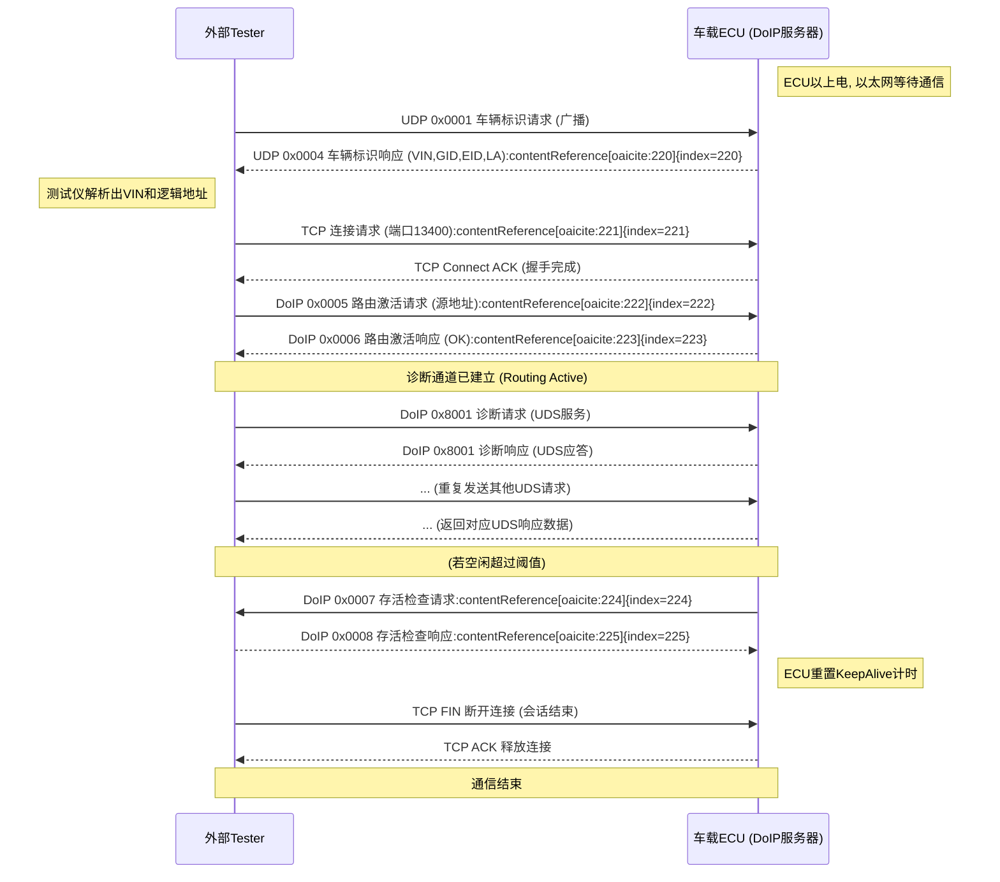
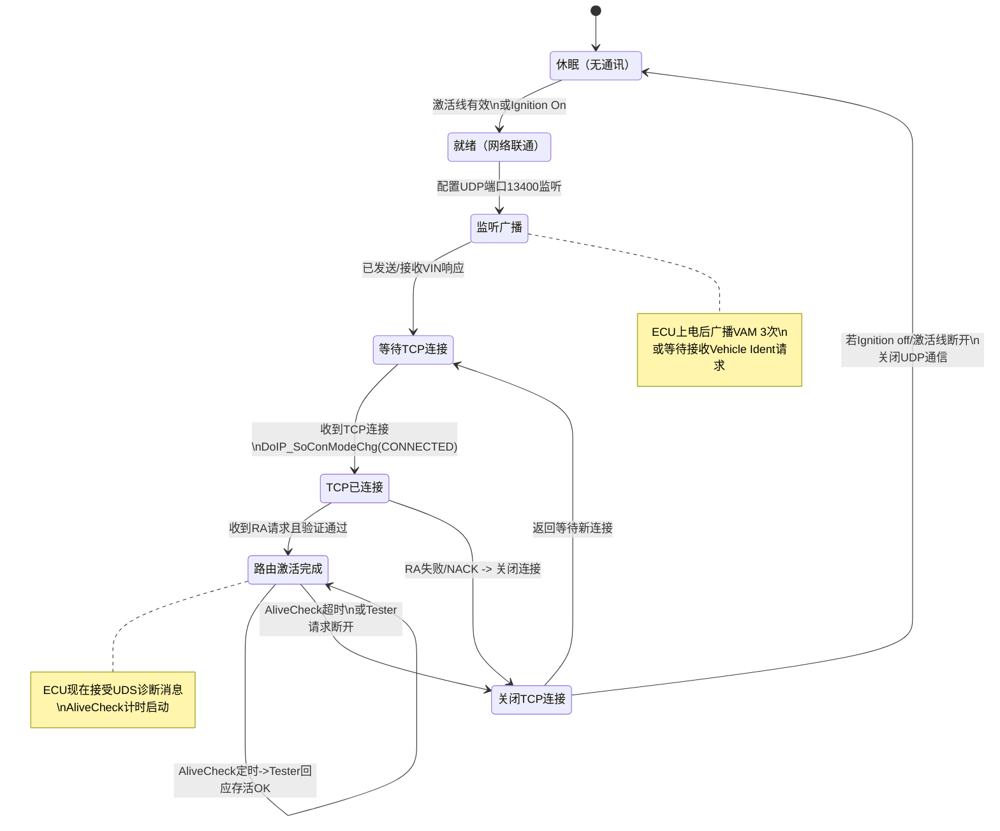

# AUTOSAR DoIP模块深入解析

## 第一章 DoIP 概述

汽车电子诊断经历了从**串行通信**到**总线通信**的长足进步，如今正迈向基于以太网的诊断时代。**DoIP（Diagnostics over Internet Protocol）**即**基于IP的诊断**协议，是为满足现代车辆诊断需求而出现的新一代标准。它将传统**UDS**（统一诊断服务）协议承载于IP网络之上，使得车辆ECU与诊断设备之间能够通过以太网或无线网络进行高速通信。DoIP最早由ISO组织制定标准（ISO 13400系列），本质上是**DoCAN**（CAN总线诊断）的以太网对应方案。**本章**将介绍DoIP产生的背景、优势及其在汽车诊断中的重要意义。

### 1.1 DoIP的背景与产生动因

传统汽车诊断主要依赖CAN总线等低速网络来传输UDS诊断消息。然而，随着车辆软件复杂度和数据量的激增，**传统总线的带宽和效率难以满足需求**。例如，过去对ECU的固件刷写（Flash编程）经常需要数小时甚至更长时间才能完成，这对生产和售后维护造成很大困扰。同时，远程诊断和OTA升级等新兴应用也要求车辆支持通过网络远程访问的能力。为了解决这些问题，ISO组织在2010年代推出了**ISO 13400**标准系列，即DoIP协议族，旨在统一基于以太网的诊断通信接口。简单来说，DoIP的诞生是为了**提高诊断通信速度、支持远程诊断和满足未来软件定义汽车的需求**。

### 1.2 DoIP的定义与优势

**DoIP（基于互联网协议的诊断）**是一种运行在汽车以太网（或任何IP网络）上的诊断通信协议。它将标准的UDS诊断服务封装在TCP/IP数据包中，通过以太网传输，从而**摆脱了CAN等传统总线的速率限制**。DoIP相比前辈协议有以下显著优势：

* **高带宽高速率**：以太网带宽远高于CAN。如100 Mbps以太网相比500 kbps CAN，理论速度提升数百倍。实际诊断传输效率也大幅提高，**数据传输更快、响应更迅速**。据统计，DoIP可在一次网络传输中发送最大近4 GB的数据，而CAN每帧仅8字节有效载荷且需分段传输。因此，DoIP能显著缩短诊断和刷写时间。例如，在同等数据量下，使用DoIP执行ECU刷新可能仅需几分钟，相比之下通过CAN可能需要数小时甚至无法完成。

* **远程诊断能力**：DoIP支持通过以太网络（包括无线网络如Wi-Fi、蜂窝）远程连接车辆，进行故障诊断和软件更新。这意味着**技术人员不必亲临车辆现场**，即可诊断和排除故障，实现真正的远程维护。尤其在联网汽车和移动出行场景下，DoIP为云端诊断、OTA升级提供了**标准化接口**，降低成本并提高效率。

* **IP标准互通**：DoIP建立在TCP/IP协议族之上，遵循通用网络标准。ISO 13400规范确保不同厂商的诊断设备和车辆实现能够互相兼容。换句话说，**DoIP提供了标准化的车辆外部通信接口**，屏蔽了车辆内部具体总线技术差异。这有利于诊断设备厂商、汽车厂商之间形成统一生态，使**跨OEM的诊断更容易实现互联互通**。

* **大数据传输与并行**：由于没有物理层帧大小限制，DoIP可在一个IP数据包中传输**大块数据**而无需拆分。这对诊断大数据量（如完整内存转储、固件）的场景非常有利。此外，以太网支持**并行通信**，理论上可以同时诊断或刷新多个ECU，不像CAN需逐帧仲裁顺序进行。这些特性使DoIP在复杂诊断、批量刷写时效率成倍提升。

* **安全性增强**：现代DoIP标准（2019年后版本）引入了**TLS加密**机制，在传输层保障数据机密性和完整性。通过TLS握手建立安全通道后，诊断通信数据将被对称加密传输，防止敏感信息泄露和篡改。这类似于HTTP到HTTPS的升级，使远程诊断更加安全可靠。此外，DoIP协议本身也考虑了**访问控制**等机制（如路由激活需要认证），以防止未经授权的诊断连接。

综上，DoIP作为**UDS在以太网上的实现**，**兼具高速率、远程化、标准化和安全性**等优点。它的推出大大缓解了传统诊断的性能瓶颈，顺应了汽车电子“软件定义、互联互通”的发展趋势。在**车载以太网**逐步普及的当下（AUTOSAR 4.x开始全面支持以太网通信），DoIP正成为新车型诊断的**标配协议**。下一节将介绍DoIP所依据的ISO 13400国际标准系列，以更系统地理解其各组成部分。

*图1：DoIP背景下的OSI网络模型定位。DoIP作为传输层协议，运行在标准的TCP/IP协议之上，将UDS诊断服务承载于以太网等IP网络，实现与传统CAN诊断的功能等价。*

## 第二章 ISO 13400 标准解析

DoIP协议由ISO制定的13400系列标准规范。**ISO 13400**系列目前涵盖了多个部分，其中与实现DoIP直接相关的主要有**ISO 13400-2、13400-3和13400-4**。本章将对这些标准进行解析，包括协议架构、报文格式、状态机和通信流程等。其中：

* **ISO 13400-2**定义了DoIP的传输层和网络层服务，即**DoIP协议本身**的内容（如消息格式、通信服务等）。
* **ISO 13400-3**定义了有线以太网诊断接口的**物理层和数据链路层**要求（基于IEEE 802.3），以及**以太网激活线**机制等。
* **ISO 13400-4**定义了诊断用以太网接口的硬件连接器要求（即**以太网诊断连接器**在车辆和测试设备上的引脚与电气规范）。

下面将依次介绍这些标准要点，并辅以必要的结构图和表格说明。

### 2.1 ISO 13400-2：DoIP协议（传输与网络层）

**ISO 13400-2**是DoIP协议的核心规范，详细规定了诊断消息在传输层和网络层的封装格式、类型定义和通信服务。简而言之，ISO 13400-2提供了**在不依赖具体物理介质的情况下**，实现诊断消息通过IP传输的标准方法。其主要内容包括：

**（1）DoIP通用报文头格式**：所有DoIP消息均使用统一的消息头结构。根据标准，DoIP头由**8字节固定字段**组成：

* **Protocol Version（协议版本，1字节）**：当前使用的DoIP协议版本号。例如0x02表示版本2，0x03表示最新版本3。
* **Inverse Protocol Version（协议版本取反值，1字节）**：为冗余校验字段，保存上述协议版本字节的按位取反值，用于简单校验协议版本一致性。
* **Payload Type（有效载荷类型，2字节）**：标识消息的类型或用途。例如0x0001表示车辆标识请求，0x0005表示路由激活请求，0x8001表示诊断消息等。标准定义了一系列有效载荷类型值，列举于下文。
* **Payload Length（有效载荷长度，4字节）**：指示消息中**数据段**（不包括上述头部）的字节长度。接收方据此确定读取多少字节的数据。

上述头部之后即为**DoIP Payload（有效载荷）**，其结构依赖于Payload Type的取值。通常情况下，DoIP有效载荷本身又可以进一步拆解，例如：

* 当Payload Type表示**车辆标识响应**时，载荷中包含VIN、EID、GID等车辆标识信息各字段。
* 当Payload Type表示**路由激活请求**时，载荷中包含测试设备的源地址、认证信息等。
* 当Payload Type表示**诊断消息**时，载荷则封装了具体的UDS诊断PDU（含目标地址、源地址和UDS服务数据）。

*图2：DoIP通用报文头结构示意图。前8字节为统一格式的协议版本、取反、类型及长度字段。不同Payload Type定义了随后的数据字段格式，用于携带具体诊断信息。*

**（2）DoIP消息类型与编码**：ISO 13400-2定义了一系列**Payload Type值**对应的消息类型，涵盖了从连接建立、保持到诊断传输的各个阶段。表2-1列出了主要的DoIP消息类型：

表2-1：常见DoIP消息类型及其Payload Type值速查（根据ISO 13400-2）

| Payload Type | 消息名称                | 适用传输层   | 描述                                                                          |
| ------------ | ------------------- | ------- | --------------------------------------------------------------------------- |
| 0x0000       | 通用否定确认（NACK）        | UDP和TCP | 当接收到无法识别或处理的消息时，由服务器发送此错误响应。包含错误代码指示原因。                                     |
| 0x0001       | 车辆标识请求              | UDP广播   | 测试器广播查询车载DoIP节点标识信息，请求VIN等。                                                 |
| 0x0002       | 带EID的车辆标识请求         | UDP单播   | 指定EID已知情况下，测试器单播查询对应车辆身份。                                                   |
| 0x0003       | 带VIN的车辆标识请求         | UDP单播   | 指定VIN已知情况下，测试器单播查询对应车辆身份。                                                   |
| 0x0004       | 车辆通告/车辆标识响应         | UDP     | 车载DoIP节点发送的**车辆通告消息**（Vehicle Announcement），或对标识请求的响应。载荷含VIN、EID、GID、逻辑地址等。 |
| 0x0005       | 路由激活请求              | TCP     | 测试器建立TCP连接后发送，请求激活诊断路由。载荷含测试器源地址等。                                          |
| 0x0006       | 路由激活响应              | TCP     | 车载节点对路由激活请求的回复，指示成功（含分配的地址等）或失败原因。                                          |
| 0x0007       | 存活检查请求（Alive Check） | TCP     | **服务器**（车载节点）主动发送，检查测试器是否仍保持连接。                                             |
| 0x0008       | 存活检查响应              | TCP     | **客户端**（测试器）对Alive Check的回应。                                                |
| 0x4001       | DoIP实体状态请求          | UDP     | 测试器请求车辆上DoIP实体的状态信息（如当前连接数等）。                                               |
| 0x4002       | DoIP实体状态响应          | UDP     | 车载节点返回自身状态（如剩余连接名额等）。                                                       |
| 0x4003       | 诊断功率模式信息请求          | UDP     | 测试器询问车辆当前是否处于可进行诊断的电源/模式状态。                                                 |
| 0x4004       | 诊断功率模式信息响应          | UDP     | 车载节点告知当前是否具备诊断就绪状态（如车辆电源模式）。                                                |
| 0x8001       | 诊断消息（UDS消息传输）       | TCP     | 承载具体UDS请求/响应消息的数据包，用于发送诊断服务请求或应答。此消息含源地址、目标地址及UDS负载数据。                      |
| 0x8002       | 诊断消息正响应确认           | TCP     | 针对0x8001消息的肯定确认，一般用于复杂场景下的应用确认。                                             |
| 0x8003       | 诊断消息负响应确认           | TCP     | 针对0x8001消息的错误通知，表示诊断消息未能被正确处理。                                              |

*注：* **车辆通告消息（Vehicle Announcement Message, VAM）**是DoIP的一个特色机制，指车载ECU在上电后自动广播0x0004消息，向网络宣告自己的存在和标识。此消息包含车辆VIN等信息，使测试设备无需主动请求即可发现车辆。在实际实现中，VAM通常在ECU启动后**发送3次**，每次间隔约500ms，以确保网络上的测试器能够接收到至少一条。如果测试器在一定时间内未发现VAM，也可主动发送0x0001请求来获取车辆标识。

通过上述消息类型，ISO 13400-2规定了**从发现车辆、建立连接、一致性检查到传输UDS诊断数据**的完整交互。**典型流程**如图3所示：测试器首先UDP广播**车辆标识请求**，车辆响应VIN等信息；然后测试器建立TCP连接并发送**路由激活请求**，收到**激活响应**后，即可发送UDS诊断消息并接收响应。通信过程中，车辆可定期发送**存活检查**确认测试器在线。诊断完成后，关闭TCP连接结束会话。后文第六章将详细分析这一流程。

*图3：DoIP典型通信流程序列图示意（Vehicle Discovery与Diagnostic Session）。测试仪首先通过UDP端口13400广播发现车辆VIN（或等待车辆主动广播VAM）；确认车辆后，建立TCP连接并进行路由激活握手；然后通过TCP通道传输UDS诊断请求和响应。在会话期间，ECU可能发送Alive Check确保连接存活。*

**（3）DoIP寻址和连接机制**：ISO 13400-2的实现中，一个重要概念是**逻辑地址**。每个车载DoIP节点有一个**逻辑地址（Logical Address）**，用作诊断通信中的目标地址。典型地，逻辑地址是2字节，范围0x0000~~0x3FFF供ECU使用，0x4000~~0x7FFF为功能地址，0x8000以上为保留等。测试设备本身也有一个逻辑地址，通常在路由激活时由其提供。**路由激活（Routing Activation）**过程除了建立诊断通道外，还用于**绑定测试者源地址和目标ECU的逻辑地址**，确保之后的诊断消息能被正确路由到对应ECU。在AUTOSAR实现中，如果激活需要进一步认证或安全确认，可由上层应用介入（后文将述）。

DoIP通信使用的网络端口也在ISO 13400-2中固定：**UDP的13400端口**用于发现和广播，**TCP的13400端口**用于建立诊断会话连接。此外，**3496端口**预留给加密的TLS通信。如下表所示：

表2-2：DoIP协议使用的标准端口

| 协议  | 端口           | 用途                                                                            |
| --- | ------------ | ----------------------------------------------------------------------------- |
| UDP | 13400        | 车载DoIP服务器监听UDP 13400，用于接收**发现请求**；车载ECU广播VAM时也从该端口发送。测试仪典型地使用系统分配的源端口发送UDP请求。 |
| TCP | 13400 (明文)   | 车载DoIP服务器监听TCP 13400，用于接受**诊断会话连接**。后续UDS诊断消息在该TCP连接上传输。                      |
| TCP | 3496 (TLS加密) | 若使用安全诊断，则车载服务器监听TCP 3496端口（对应TLS），测试仪通过TLS握手建立安全连接后进行诊断通信。                    |

需要注意，ISO 13400-2在设计上**独立于具体物理链路**。这意味着协议所描述的消息和流程，无论底层使用100BASE-TX以太网、1000BASE-T1汽车以太网，还是Wi-Fi、LTE等，只要提供IP传输能力，都可以遵循标准实现DoIP通信。正因为此，ISO 13400-2的服务定义很大程度上与网络层、传输层细节解耦，提供了一种**抽象的诊断传输协议**。

### 2.2 ISO 13400-3：有线车载以太网接口（物理/数据链路层）

**ISO 13400-3**标准全名为“道路车辆-基于IEEE 802.3的有线车辆接口”（Wired vehicle interface based on IEEE 802.3）。它主要针对**车载诊断以太网接口**的物理层和数据链路层要求，以及相应的**车辆端和测试设备端**的规范。ISO 13400-3可以视为对OSI模型第1层（物理）和第2层（数据链路）的特定规定。其关键内容包括：

* **物理层兼容性**：ISO 13400-3明确要求车辆诊断接口基于标准以太网物理层（如100BASE-TX）。它规定了信号电平、线对、拓扑等，以确保车辆接口与标准以太网设备（如笔记本网卡）能直接连接通信。例如，标准指定了使用双绞线电缆、RJ45（在车外）或特定汽车以太网收发器，以保证**物理层互联**。

* **链路发现与建立**：由于车载以太网可能在车辆熄火时关闭以节能，ISO 13400-3引入了**激活线（Activation Line）**机制。**激活线**是一根额外的信号线，通过OBD诊断连接器连接测试设备与车辆的以太网控制器，用于**唤醒和启用**车载以太网通信。当外部测试设备接入车辆并拉高激活线电压时，车载以太网控制器检测到该信号会从低功耗模式切换为正常工作模式，开启以太网物理层。这样可降低平时的电磁干扰和功耗，因为仅在诊断时以太网才被激活。ISO 13400-3详细规定了激活线的电气要求、典型电路方案（Option1和Option2两种接法）、激活和去激活的**电压阈值**和**时序**等。例如，标准指出Option1方案下激活电压阈值约为3.4V，Option2约为4.4V。测试设备需要提供一定电压（如12V）将激活线拉高一定时间以唤醒车辆以太网。图4示意了激活线原理。

* **接口模式和状态**：ISO 13400-3定义了**DoIP Edge Node**的概念，即车辆内实现DoIP的主机节点。激活线通常终止于Edge Node并控制其以太网收发器电源。当激活线有效且以太网链路建立后，Edge Node进入活动状态，可以响应DoIP诊断请求。车辆和测试设备双方关于激活线的具体要求和限制也在标准中提出，如**车辆厂家可自行决定是否实现激活线**（在某些架构中可能自动常通），以及不同厂家的激活线选项要求。

*图4：DoIP以太网激活线工作原理简图。测试设备通过诊断连接器的激活引脚向车辆发送电压信号（通常>5V），车载ECU检测到后使以太网收发器上电并建立物理链路。当诊断完成后移除激活信号，车辆以太网可返回低功耗状态。*

* **诊断接口介质**：ISO 13400-3还涵盖了诊断连接的传输介质要求。例如，标准选用了**100BASE-TX**（双绞线以太网）作为推荐的物理层，并说明可以通过适配层支持其他物理介质（如电容耦合的单对以太网100BASE-T1）。为了确保诊断接口的稳定，标准对诊断连接的线束、接插件都有所要求，避免在车外诊断环境下受到干扰。

简单来说，ISO 13400-3确保了**车载诊断以太网接口**在硬件层面上的统一，使得业内各种测试仪都能通过标准连接器和方法激活并访问车辆的以太网诊断端口。例如，一家制造商的车辆，其OBD接口针脚和以太网激活方式符合ISO 13400-3，那么第三方诊断仪器插上OBD即可按标准步骤唤醒车辆以太网、建立IP通信，进行DoIP诊断**而无需定制硬件**。这一点对于立法要求的OBD统一诊断接口也很重要，ISO 13400-3引用了通用的OBD以太网引脚分配方案（两种选项兼容历史和未来）。

### 2.3 ISO 13400-4：以太网诊断连接器

**ISO 13400-4**规范了**诊断用以太网连接器**的要求。这部分主要关注**车辆诊断插座**（通常即OBD II接口）在引脚定义和电气特性上的规定，以满足以太网诊断的需要。传统OBD接口有16针，其中已有两种针脚分配方案可用于以太网（称为Option 1和Option 2）。ISO 13400-4的主要要点包括：

* **引脚分配**：规定了两种以太网引脚布局方案，以兼容不同厂商已有设计。一是**Option 1**（如Annex A所示），利用OBD针脚3与11作为以太网差分线对，针脚8作为激活线。二是**Option 2**（Annex B），使用针脚1与9作为以太网线对，针脚8仍为激活线。Option1适用于某些老车型以太网引脚已经占用3和11的情况，而Option2针对可能冲突的情况提供替代选择。

* **车侧连接器要求**：对车上OBD插座中的相关引脚（尤其是以太网对和激活线）规定了功能和电气规范。包括接触电阻、线束阻抗匹配、屏蔽连接等，以确保高速数据可靠传输和信号完整性。

* **测试设备连接器要求**：对外部诊断仪的接口（OBD插头）的相应引脚功能也做了要求，以匹配车辆端的针脚定义。同时对连接线缆的质量、屏蔽、绞线等提供规范。

ISO 13400-4的这些要求确保**物理连接层面**的**兼容性和性能**。值得一提的是，ISO 13400-4参考了ISO 15031-3（即SAE J1962）立法规定的诊断接口标准。在许多国家，法规要求车辆OBD接口必须符合OBDII标准引脚。其中，为容纳以太网诊断，SAE在OBDII标准中加入了**以太网针脚**定义。ISO 13400-4正是对这些规定的承接和细化，使**基于以太网的诊断插头**满足法规与技术的双重需求。

综上，ISO 13400系列各部分相辅相成：第2部分定义了**DoIP协议的软件行为**，第3和4部分确保了**硬件链路和接口**的标准化和可用性。掌握这些标准，有助于理解DoIP在不同层面的实现细节。接下来将转向AUTOSAR标准框架下DoIP模块的具体实现，分别介绍经典平台和自适应平台中的DoIP。

## 第三章 Classic AUTOSAR 中的 DoIP 模块

**Classic AUTOSAR**（经典平台）是面向汽车ECU实时控制的标准架构，广泛应用于各类车辆电子控制单元。自AUTOSAR 4.x引入车载以太网以来，Classic平台的基础软件（BSW）中增加了对以太网协议栈和DoIP的支持。AUTOSAR将DoIP实现为一个独立的**基础软件模块**，并在AUTOSAR规范中发布了《Diagnostic over IP (DoIP)》的软件规范（SWS）供厂商实现。Classic平台中的DoIP模块遵循ISO 13400-2协议要求，同时需要集成到AUTOSAR通信栈和诊断架构中。**本章**将详细解析Classic AUTOSAR中DoIP模块的定位、接口、配置和工作机制，并对Classic平台内相关模块的交互进行说明。

### 3.1 Classic DoIP模块在架构中的位置

在Classic AUTOSAR架构中，DoIP模块属于**服务层（Services Layer）**的通信服务部分，具体地说是**诊断通信**相关模块之一。图5展示了DoIP模块在AUTOSAR通讯栈的典型位置：

```
应用层 (Application SW-C)
     ↓↑
诊断通信管理器 DCM (Diagnostics Communication Manager)  <-- 诊断应用接口
     ↓↑
PDU 路由器 PduR (Protocol Data Unit Router)          <-- 路由诊断PDU
     ↓↑
DoIP 模块 (Diagnostic over IP)                      <-- DoIP协议封装与解析
     ↓↑
套接字适配层 SoAd (Socket Adaptor)                  <-- UDP/TCP Socket接口
     ↓↑
TCP/IP 协议栈 (TCP/IP Stack)                         <-- 实现TCP, UDP, IP等
     ↓↑
以太网驱动及ECU硬件 (Eth If, Eth SM, Eth Driver)      <-- 硬件发送接收帧
```

如上所示：

* **DCM（Diagnostic Communication Manager）**：AUTOSAR中的诊断通信管理模块，负责处理诊断会话、路由UDS请求到不同通道（CAN或DoIP）等。DCM作为诊断服务的高层接口，与应用层诊断服务（如DEM故障码管理等）交互。在Classic中，DCM会通过PduR将诊断请求发送到相应的**下层通讯模块**（如CAN TP或DoIP）。

* **PduR（PDU Router）**：PDU路由器是AUTOSAR中一个通用的数据路由模块。针对诊断来说，PduR配置了从DCM到不同传输模块的**Routing Path**。当DCM需要通过以太网发送诊断消息时，PduR会将其路由到DoIP模块；反之，当DoIP接收到诊断消息（来自远程测试器）时，通过PduR路由给DCM处理。一句话，**PduR在DCM和DoIP之间传递诊断PDU**，起到连接桥梁作用。

* **DoIP模块**：实现ISO 13400-2规定的功能，包括接收和解析Vehicle Ident请求、发送Vehicle Announcement、处理Routing Activation handshake，以及封装/拆封UDS诊断消息等。DoIP模块对上提供接口供PduR/DCM调用，对下通过Socket接口收发数据。

* **SoAd（Socket Adaptor）**：套接字适配器模块，封装了操作系统TCP/IP栈或MICROSAR TCP/IP的Socket接口，提供AUTOSAR风格的接口给上层模块使用。DoIP通过调用SoAd来打开/关闭TCP或UDP连接、发送和接收字节流。SoAd接收到远程Tester的数据包后，会回调通知DoIP模块进行处理。SoAd的配置包含监听端口（13400等）、连接模式等参数。

* **TCP/IP与以太网驱动**：下层是具体的以太网驱动（Ethernet Driver）、以太网接口（EthIf）及**TCP/IP栈**实现。在AUTOSAR Classic中，TCP/IP栈可以使用AUTOSAR自带的TcpIp模块或集成第三方栈。SoAd利用这些模块实现Socket通信，将以太网帧发送到物理网络。

在AUTOSAR CP R20-11的DoIP SWS中给出了DoIP模块在整个架构中的关系图（Figure 1），显示DoIP位于AUTOSAR通信栈中**层次4**（传输层）左右的位置。换言之，Classic DoIP模块**不直接面对应用**，而是通过DCM->PduR->DoIP链路服务于诊断应用请求。对于外部测试器而言，DoIP模块则扮演**服务器**角色，处理其网络连接和诊断数据。

### 3.2 AUTOSAR DoIP模块功能与接口

根据AUTOSAR《Diagnostic over IP》SWS的描述，Classic平台DoIP模块具备以下主要**功能**：

* **车辆标识与通告**：模块应能够响应测试器发送的车辆标识请求（Vehicle Identification Request）。当ECU配置为**网关**或**激活节点**时，还可在上电时自动广播车辆通告（VAM），或根据上层请求触发广播。DoIP提供API `DoIP_TriggerVehicleAnnouncement()` 供应用/DEM在需要时调用，以发送车辆通告消息。

* **连接管理**：负责UDP 13400端口的监听（用于发现）和TCP 13400端口的监听（用于数据连接）。当测试器尝试建立TCP连接时，通过SoAd事件触发DoIP模块处理。DoIP模块可以接受或拒绝连接（例如已有最大连接数限制）。同时，DoIP模块维护**当前活动的连接列表**，包括每个连接对应的测试器源地址、路由激活状态等。

* **路由激活处理**：当新TCP连接建立后，测试器会发送Routing Activation请求（0x0005）。DoIP模块收到后，验证请求有效性：例如**源地址**是否为预期范围，是否需要**安全认证**等。AUTOSAR在R19-11及之后扩展了Routing Activation的机制，可以支持安全用例（如需更高级别确认）。DoIP模块通过调用户提供的回调`<User>_DoIPRoutingActivationAuthentication`来让应用层决定是否允许该激活。一旦激活通过，DoIP模块发送Routing Activation响应，并将该连接标记为**Routing Active**，后续诊断数据才会被路由到DCM。

* **诊断数据传输**：DoIP模块实现了一个**传输协议适配**，以便将DCM提供的诊断PDU封装成DoIP格式发送，并将接收到的DoIP诊断消息拆解并交给DCM处理。具体而言：

  * 向下行，DCM通过PduR调用`DoIP_TpTransmit()`或`DoIP_IfTransmit()`接口（对应大数据包或小数据包）发送UDS消息。DoIP模块会在内部构建0x8001消息头，加上源/目标地址和UDS负载，然后通过SoAd的Transmit接口发送出去。
  * 向上行，当SoAd收到远端测试器发送来的0x8001诊断消息数据后，会回调`DoIP_SoAdTpStartOfReception`/`CopyRxData`系列接口给DoIP模块。DoIP模块重组消息（如有分段），解析出其中的目标地址，然后将UDS PDU提交给PduR路由到对应的DCM。对于Classic ECU一般只有一个DCM，所有目标地址可能都映射到该DCM处理；若是网关ECU，可根据不同逻辑地址选择将PDU转发到CAN网络等。

* **Alive Check**：DoIP模块在路由激活后，可能启用**Keep-Alive**机制。标准规定当测试器长时间无数据交互时，车载ECU可发送Alive Check请求（0x0007）询问客户端状态。AUTOSAR DoIP模块提供`DoIP_MainFunction()`定期调度，监控各连接的**空闲时间**，在超时阈值到达时发送AliveCheck请求并等待响应。若未收到响应或超时，则可以主动关闭连接释放资源。

* **激活线控制**：AUTOSAR扩展提供了`DoIP_ActivationLineSwitch()`接口，允许在软件上控制激活线的状态。对于具备以太网激活线的ECU，BSW可能监测到物理信号后，通过该接口通知DoIP模块**激活或停用**DoIP服务。此外，在R18-10版本AUTOSAR中，就已添加对激活线的支持。DoIP模块在收到激活激活事件后，可执行如发送VAM之类的初始化动作。

* **错误处理与报告**：DoIP模块对一些错误情况要进行处理。例如，当收到未知Payload Type或格式错误时，发送通用NACK（0x0000）回复测试器。又如当路由激活失败（不被允许）时，发送相应的NACK或拒绝。模块还需要调用**Det\_ReportError**接口报告开发错误和运行时错误（比如配置不正确导致的错误）。这些遵循AUTOSAR错误处理机制的通用要求。

为了实现上述功能，AUTOSAR DoIP模块定义了一系列**API接口**供其他模块或应用调用，以及**回调接口**供SoAd等下层模块调用。部分关键接口概览如下：

**主要API函数**（DoIP模块向上层提供）：

* `DoIP_Init(const DoIP_ConfigType* Config)` – 初始化DoIP模块，使用传入的配置结构指针。
* `DoIP_GetVersionInfo(Std_VersionInfoType* versioninfo)` – 获取版本信息。
* `DoIP_MainFunction(void)` – 周期性调度函数（需在任务中周期调用），用于超时管理、AliveCheck触发等。
* `DoIP_TriggerVehicleAnnouncement(void)` – 触发发送车辆通告消息（VAM）。典型地，上层DEM在检测到某些事件（如网关启动、IP地址获取完成）后调用此函数发送VAM。
* `DoIP_ActivationLineSwitch(boolean ActivationState)` – 激活线状态变化通知。当硬件激活线切换时由EcuM或IO模块调用，通知DoIP模块**ActivationState=TRUE/FALSE**来启用/停用诊断服务。
* 传输接口：`DoIP_TpTransmit(PduIdType TxPduId, PduInfoType* PduInfoPtr)` – 通过TP通道发送长消息（segmentation），DCM将大于阈值的PDU通过此接口传输。`DoIP_IfTransmit`用于不分段的小PDU发送。
* 取消传输/接收接口：`DoIP_TpCancelTransmit`, `DoIP_TpCancelReceive`, `DoIP_IfCancelTransmit`等，用于在必要时取消正在进行的发送或清理接收。

**期望的回调接口**（DoIP依赖其他模块实现的接口）：

* `<User>_DoIPRoutingActivationConfirmation(uint16 sa, uint16 logicalAddr)` – *可选接口*：用户（比如SecOC或OEM定制层）实现，用于在路由激活成功后通知应用执行后续操作。比如某些安全需求下，要求应用层知道某测试器已连接。
* `<User>_DoIPRoutingActivationAuthentication(uint16 sa, uint16 logicalAddr)` – *可选接口*：DoIP模块调用此接口请求用户验证/认证一个路由激活请求是否允许。用户实现应返回布尔结果。同理，可以在此加入安全算法（如密码校验等）来决定是否接受诊断会话。
* `<User>_DoIPGetPowerModeCallback(void)` – *可选接口*：提供当前车辆诊断电源模式。如实现，则DoIP模块在响应0x4003诊断功率模式请求时通过此接口获取状态并填入响应。
* `<User>_DoIPGetFurtherActionByteCallback(...)` – *可选接口*：用于获取Vehicle Ident响应中的Further Action字节（例如指示需要点火钥匙开启等动作）。这个机制在R19-11中引入，以允许ECU告诉测试仪还需执行的额外步骤。
* `<User>_DoIPGetGidCallback()` / `<User>_DoIPTriggerGidSyncCallback()` – 对于使用\*\*组标识（GID）\*\*的情形（如多个ECU共用一个VIN），提供获取和同步Group ID的接口。

**SoAd模块调用的回调**（DoIP模块实现，SoAd上报事件时调用）：

* `DoIP_SoAdIfRxIndication(SocketId, const PduInfoType* info)` – 当SoAd接收到UDP数据（如Vehicle Ident Request）时，调用此接口通知DoIP模块进行处理。
* `DoIP_SoAdTpStartOfReception(SocketId, PduLengthType TpLength, PduIdType* RxPduIdPtr)` – 当新的TCP TP数据开始接收时调用，让DoIP模块做好接收准备（如分配缓冲等）。
* `DoIP_SoAdTpCopyRxData(...)` / `DoIP_SoAdTpRxIndication(...)` – SoAd分段将接收的数据拷贝给DoIP模块，最后RxIndication表示完整PDU接收完成或出错。
* `DoIP_SoAdTpCopyTxData(...)` / `DoIP_SoAdTpTxConfirmation(...)` – 对应发送流程，当SoAd发送数据需要获取下一个分段时调用CopyTxData，从DoIP获取数据片段；TxConfirmation在整个消息发送完成后调用，让DoIP模块知道发送成功。
* `DoIP_SoConModeChg(uint8 SoConId, SoAd_SoConModeType Mode)` – Socket连接模式改变通知。如TCP连接建立（Mode=SoAd\_SoConModeType::CONNECTED）或断开（CLOSED），SoAd会调用此函数。DoIP模块据此可以初始化新连接的结构，或清理断开连接的资源。

通过上述接口，AUTOSAR DoIP模块与上层DCM/PduR、下层SoAd/TCPIP紧密协作，实现DoIP通信的端到端功能。下面结合一个典型过程来说明：

**典型数据流**：当一个远程Tester通过以太网要读取ECU故障码时，消息流动如下：

1. 测试器UDP广播0x0001请求VIN -> SoAd接收后调用`DoIP_SoAdIfRxIndication`通知DoIP模块。DoIP模块生成包含VIN、EID、GID的0x0004车辆标识响应，通过SoAd发送UDP回去。
2. 测试器TCP连接13400端口 -> 底层TCP建立，SoAd通知DoIP模块`DoIP_SoConModeChg(…CONNECTED)`。DoIP记录连接。
3. 测试器发送0x0005路由激活请求 -> SoAd调用`StartOfReception`开始，随后`CopyRxData`传输数据给DoIP。DoIP拿到完整请求后，调用`<User>_DoIPRoutingActivationAuthentication`验证（如果配置需要），然后发送0x0006响应。同时标记该Tester地址已激活。
4. 测试器发送UDS请求（如服务0x19读取DTC）封装在0x8001消息 -> SoAd多次调用`CopyRxData`给DoIP传输，完成后`RxIndication`通知。DoIP解析出源地址SA和目标地址TA（自己的逻辑地址），将UDS PDU传递给PduR->DCM。DCM解析服务0x19并从DEM获取DTC数据，形成UDS响应PDU。
5. DCM通过PduR调用`DoIP_TpTransmit`发送响应 -> DoIP封装为0x8001消息，通过SoAd分段发送（期间SoAd调用`CopyTxData`获取数据片段）。Tester收到0x8001响应解封装出UDS数据。
6. 若在一定时间内Tester无后续请求，DoIP模块的MainFunction检测超时 -> 发送0x0007 AliveCheck请求。Tester应立即回发送0x0008 AliveCheck响应以保活连接。如未响应，DoIP可关闭TCP连接。
7. 通信完成后，Tester主动关闭TCP -> SoAd通知`DoIP_SoConModeChg(...CLOSED)`，DoIP清理该Tester会话的数据。

从上可见Classic DoIP模块对大量细节进行了处理，使得应用层（DCM）能够**无感知地通过以太网收发诊断服务**。对DCM而言，无论通过CAN或DoIP，接收到的都是UDS请求PDU，它所做处理相同。这种模块化设计也符合AUTOSAR分层思想。

### 3.3 Classic DoIP模块的配置要点（Vector工具示例）

Classic AUTOSAR的DoIP模块需要在ECU配置中进行诸多参数的配置。常见AUTOSAR配置工具（如Vector DaVinci Configurator）提供专门的配置界面来设置DoIP参数。以下结合Vector工具配置项目，介绍配置DoIP模块时的重要选项：

**1. 基本参数（DoIPGeneral容器）**：此部分定义DoIP模块的一些全局行为：

* **DoIPDevErrorDetect**：是否启用开发错误检测（DET）。开发阶段建议打开，以捕捉配置或调用错误。
* **DoIPProtocolVersion**：使用的DoIP协议版本号。如当前应配置为0x02或0x03，取决于支持的版本（大多数配置0x02对应ISO 2012版，0x03对应ISO 2019版）。
* **DoIPTcpAliveCheckReqInterval**：Alive Check请求间隔，单位ms。例如设置2000ms表示2秒检测空闲。
* **DoIPTcpAliveCheckRetry**：Alive Check失败重试次数。一般设置1\~2次，超过则认为断开。
* **DoIPTcpServerPort**：TCP服务器端口号，默认13400。一般不用修改，除非有特殊端口映射。
* **DoIPUdpServerPort**：UDP服务器端口号，默认13400。
* **DoIPMaxTcpConnections**：最大同时TCP连接数。默认1（只允许一个Tester连接），可根据需要提高（如网关ECU可能允许多个）。
* **DoIPNodeType**：节点类型配置。0表示普通DoIP节点，1表示DoIP网关。当配置为网关时，可能会启用组播VAM等特殊功能。

**2. 车辆标识信息（DoIPVehicleIdentification容器）**：配置ECU的身份标识数据：

* **DoIPVin**：车辆识别号VIN（17位字符）。需与车辆实际VIN一致，用于Vehicle Ident响应。
* **DoIPEid**：实体ID（EID），一个本地唯一的12字节标识符，可用于替代VIN进行发现。测试仪可以通过EID直接点对点发现车辆。
* **DoIPGid**：组ID（GID），用于标识一组ECU共享一个VIN的情况（如挂接同一车厢的多个ECU）。
* **DoIPLogicalAddress**：本ECU的逻辑地址（Logical Address），2字节。这个地址用于标识诊断消息的目标。例如动力总成ECU可能配置0x1001，车身ECU 0x1101等。必须确保车上各DoIP节点逻辑地址唯一且不与0x0E00\~0x0EFF保留Tester地址冲突。
* **DoIPFurtherActionReq**：进一步操作需求标志。当设为TRUE时，在VehicleIdent响应中指示Tester需要采取额外动作（如点火ON）才能继续诊断。通常配合DoIPFurtherActionValue字节使用。

**3. 路由激活（DoIPRoutingActivation容器）**：控制路由激活过程参数：

* **DoIPRoutingActivationTimeout**：路由激活阶段超时时间。例如1000ms内未完成激活则视为失败。
* **DoIPRoutingActivationAcceptance**：接受的Tester源地址范围。可以配置一组允许的源地址前缀或具体值。如果测试器发送的源地址不在此范围，DoIP将拒绝激活。典型地，外部Tester源地址使用0x0E00\~0x0EFF区间，大部分配置会允许该范围全部通过。
* **DoIPRoutingActivationAuthenticationReq**：是否启用路由激活认证。打开时，DoIP会调用`DoIPRoutingActivationAuthentication`回调，由用户代码决定是否允许。关闭则所有请求直接接受（除非其他原因拒绝）。
* **DoIPConcurrentDiagnostic**：是否允许并发诊断会话。如果允许多个Tester同时激活，则DoIPMaxTcpConnections应>1，且需仔细规划资源。大多数情况下此项关闭。
* **DoIPInternalTesterSupport**：是否支持**车内内部Tester**（Internal Tester）。AUTOSAR R20-11新增支持内部Tester（如车载网关作为Tester去诊断别的ECU）。打开此选项可能需要配置一套特殊源地址用于车内发起诊断。

**4. 网络交互配置**：这一部分在Vector工具中可能在SoAd或TCP/IP配置中体现，但与DoIP密切相关：

* **SoAdSocketConnection**：需配置两个SoAd Socket连接条目：

  * 一个UDP类型，Server模式，端口13400，用于监听Vehicle Ident请求和接收Tester状态查询。启用广播接收。
  * 一个TCP类型，Server模式，端口13400，用于监听Tester的TCP连接。允许的并发连接数与DoIPMaxTcpConnections一致。**注意**：如果要支持安全诊断，需额外配置一个TLS的Socket，端口3496，TLS配置指向Security模块证书等。
* **IP地址分配**：DoIP通常使用车辆本地IP进行通信。在实车上通常由DHCP或固定IP配置。AUTOSAR提供了**Dhcp**模块，SoAd可以在启动时通过DHCP获取IP并通知DoIP模块（通过`DoIP_LocalIpAddrAssignmentChg`接口）。配置上要确保车辆ECU能成功获得IP，否则Tester无法通信。开发测试时也可使用**静态IP**方案。
* **VIN获取**：DCM模块需要配置VIN读取服务（服务0x22的一个DID）并与DoIP模块交联，因为DoIP Vehicle Ident响应中可能通过调用`Dcm_GetVin()`获取VIN。AUTOSAR提供了`Dcm_GetVin`接口，DoIP模块在需要时调用以获取最新VIN（比如某些ECU VIN存储在NVM中可更新）。因此需在配置中将DCM的VIN提供使能。

**5. 其他**：

* **Diagnostic Power Mode**：如要支持0x4003/0x4004诊断电源模式查询，需要在ECU状态管理或EcuM配置相应接口，并实现`DoIPGetPowerModeCallback`来返回当前模式（如Ignition ON/OFF）。
* **Vehicle Announcement**：若要求ECU上电自动广播VAM，需要设置DoIP的触发条件。在AUTOSAR配置中，没有直接的“Auto VAM”开关，但可以通过在EcuM启动后调用`DoIP_TriggerVehicleAnnouncement`实现。Vector工具中可利用**Event**机制或定时任务在初始化后调用该函数。配合**DoIPAnnounceNum**和**DoIPAnnounceInterval**参数，可设置广播次数（通常3次）和间隔（标准500ms）发送通告。
* **安全通信**：如果开启TLS通信，需要在Crypto和SecOC模块配置TLS凭证（证书、密钥）及SecOC验证流程。DoIP模块本身只需在SoAd的Socket配置上引用相应的SecOC Channel即可。Vector工具允许在SoAd Socket里选用“Use TLS”并指定TLS配置。

配置完成后，Vector DaVinci会生成相应的DoIP配置源文件（如 `DoIP_Cfg.h/.c`），其中包括`DoIP_ConfigType`结构实例。这个结构包含上述所有配置值，初始化DoIP模块时传入。以下为可能生成的配置结构片段示例：

```c
CONST(DoIP_ConfigType, DOIP_CONST) DoIP_Config = {
    /* General settings */
    .MainFunctionPeriod = 10, // 10ms 主函数周期
    .TcpAliveCheckRetry = 1,
    .TcpAliveCheckMaxTimeout = 2000,
    .ProtocolVersion = 0x02,
    .ProtocolVersionInverse = 0xFD, //0x02按位取反
    .KeepAliveHandling = DOIP_ALIVE_CHECK_ENABLED,
    .ConcurrentTcps = 1,
    /* Vehicle Identification */
    .LogicalAddress = 0x1001,
    .EID = {0x00,0x01,...0x0C}, // 12字节EID
    .GID = {0xFF,0xFF}, // 2字节GID
    .VIN = "LR0XXX...123456789", // 17字节VIN
    .FurtherActionRequired = FALSE,
    /* Routing Activation */
    .RAAuthenticationReq = TRUE,
    .RAConfTimeout_ms = 1000,
    .SocIds[0] = SoAdConf_SocDoIP_TCP,  // 引用SoAd的TCP socket
    .SocIds[1] = SoAdConf_SocDoIP_UDP,  // 引用SoAd的UDP socket
    /* ... 其他 ... */
};
```

（以上配置片段仅为示例，具体字段名称和结构根据AUTOSAR版本可能不同。）

在Vector DaVinci Configurator中，会以可视化面板形式让工程师填写上述参数，工具会自动校验一些约束（如VIN长度17、逻辑地址范围等）并在生成时合入代码。

配置完成且代码集成后，Classic平台DoIP模块即可工作。在系统运行时，通常需要：

* 在**启动阶段**调用`DoIP_Init(&DoIP_Config)`完成初始化，包括打开UDP/TCP端口、准备内部缓冲等。
* 在**调度任务**中周期调用`DoIP_MainFunction()`，典型每10-20ms，用于处理超时和AliveCheck。
* 确保**DCM**正确配置并启动，这样当DoIP有诊断请求上报时，DCM才能处理。
* 如果有**DHCP**，在IP分配完成后调用`SoAd_LocalIpAddrAssignmentChg`以通知DoIP。Vector ECU层通常会自动处理这个过程，或通过配置Automotive ethernet management实现。

至此，我们在Classic AUTOSAR框架下了解了DoIP模块如何配置和运行。下一章将对比介绍Adaptive AUTOSAR平台中的DoIP实现，两者有不少区别和联系。

## 第四章 Adaptive AUTOSAR 中的 DoIP 模块

**Adaptive AUTOSAR**（自适应平台）是AUTOSAR为高性能计算单元（HPC）和服务导向架构引入的新平台。相较Classic平台的静态配置、周期调度，Adaptive平台采用POSIX操作系统、C++编程和服务架构，支持动态应用的加载和通信。这样的架构差异也影响了诊断功能的实现方式。本章将解析Adaptive AUTOSAR中的诊断机制，重点关注DoIP在Adaptive上的实现情况，并比较其与Classic平台的异同。

### 4.1 Adaptive平台诊断架构概览

在Adaptive AUTOSAR中，诊断功能由**Diagnostic Management (DM)**服务集群提供。Adaptive将每个运行的独立应用或功能划分为**软件集群（Software Cluster）**，每个软件集群可以视为一个逻辑ECU单元。根据Adaptive诊断架构：

* **每个软件集群**可以拥有一个**独立的诊断服务器实例**和**诊断地址**（类似Classic中每ECU一个逻辑地址）。因此，在一台Adaptive控制器（例如车辆HPC）上，可能有多个诊断地址分别对应不同的软件集群（通常5\~10个）。每个诊断地址都有各自的DM实例处理诊断请求。

* Adaptive平台对外仍使用**DoIP**作为诊断传输协议：外部Tester通过IP与HPC通信。与Classic单ECU单地址不同的是，Tester在诊断Adaptive节点时需要**选择特定诊断地址**来与对应的软件集群通信。通常流程为：Tester先获取车辆VIN，**然后通过VIN找出HPC的多个诊断地址**，针对不同子系统发送诊断请求。

* Adaptive的诊断服务由**Diagnostics Service**（也称DM）提供，DM实现了一套**UDSonIP**（Unified Diagnostic Services on IP）服务。ISO 14229-5（UDSonIP）标准定义了如何在IP环境中使用UDS，包括一些新特性。Adaptive DM遵循ISO 14229-5和ISO 13400-2，将UDS应用层与DoIP传输层结合。

* 配置上，Adaptive诊断使用\*\*DEXT (Diagnostic Extract)\*\*文件作为配置输入。DEXT可看作Classic DCM配置（ODX内容）的提取，包含所有诊断服务、DID、DTC等配置。Adaptive的DM依赖DEXT内容配置各诊断实例。比如不同软件集群有各自的诊断服务表，定义在DEXT中。

**Diagnostics in Adaptive**整体可理解为：Adaptive平台**每个软件集群**相当于Classic中的一个ECU，它有自己的**DM**（相当于DCM）、自己的**DoIP传输**和**逻辑地址**。而一台Adaptive ECU（如HPC）内部可能运行多个这样的诊断服务器。Adaptive通过**服务路由**，将外部Tester的DoIP消息分发到正确的软件集群。

图6示意Adaptive诊断架构：

```
外部Tester
   │
   │  DoIP/TCP (VIN发现/路由激活)
   ▼
Adaptive ECU (HPC):
 ┌──────────────────────────────┐
 │ ara::com / SOMEIP 通信中间件 │
 │         ...                 │
 │ Diagnostics Manager (DM) 服务(多个实例) │
 ├──────────┬──────────┬────────┤
 │ Cluster1 │ Cluster2 │ ...    │  <--- 软件集群，各有诊断服务
 │ (诊断地址A) (诊断地址B)       │
 └──────────┴──────────┴────────┘
```

在实现上，Adaptive平台没有像Classic那样的BSW模块划分，而是通过**服务接口**实现通信。Adaptive提供了标准的**Diagnostic Service** API（Adaptive SWS Diagnostic），应用可通过C++接口使用。传输层方面，Adaptive要求**DM具有兼容ISO 13400的传输层**，当前版本仅支持DoIP。也就是说，Adaptive DM内部集成了DoIP协议的处理，无需像Classic那样独立一个模块。但DM要利用**操作系统的Socket**功能来收发数据。

具体来说，Adaptive DM会在系统初始化时**打开一个TCP服务器**监听13400端口，以及UDP 13400端口。由于Adaptive基于POSIX，这可以通过BSD Socket完成。DM管理这些socket事件，当有新连接时，建立对应诊断会话实例。当Tester在TCP连接上发送UDS消息时，由DM接收并根据消息中的**目标地址**分配到相应的软件集群实例处理。这和Classic里DoIP模块+PduR+DCM组合的功能类似，只是Adaptive将其都涵盖在DM服务中，用软件实例区分不同逻辑ECU。

### 4.2 Classic vs Adaptive 平台DoIP实现差异

尽管Classic和Adaptive平台都支持DoIP诊断，但在实现形态和使用方式上存在显著差异，概括如下：

**（1）架构形态**：Classic将DoIP作为独立BSW模块，通过与DCM、SoAd协作完成功能。而Adaptive没有独立的“DoIP模块”概念，而是**DM服务内置对DoIP的支持**。Adaptive DM本身类似一个“DCM+DoIP合体”的角色：既负责会话和UDS处理，又负责网络传输层。因此，在Adaptive配置中，没有单独的DoIP模块配置，全都包含在诊断服务配置里。这也体现Adaptive的服务导向架构，将相关功能都聚合在服务中提供。

**（2）操作环境**：Classic运行在OSEK操作系统，网络通信通过AUTOSAR TCP/IP栈和BSW驱动完成。而Adaptive运行在Linux/QNX等POSIX OS，直接使用系统Socket。Adaptive应用可以多线程并行，因此**同一时间可处理多连接**较为自然（Classic上虽然可配置多连接，但受限于BSW设计和单核调度）。Adaptive DM理论上能更好地**利用多核并行处理多个诊断请求**，尤其在多个软件集群场景。

**（3）多目标地址**：在Classic，通常每个ECU只有一个DoIP逻辑地址用于诊断（一些ECU可能配置多个逻辑地址，但一般不超过255范围）。而Adaptive HPC常常有**多个诊断地址**（如5-10个）。Tester需针对不同诊断目的选择不同地址。例如，一个HPC的Cluster1管理ADAS功能，用诊断地址0x1001；Cluster2管理信息娱乐，用0x1002等。Classic情况则是一盒ECU所有诊断（动力、故障码、数据）都通过一个地址交互。Adaptive通过拆分地址，把诊断职责分区，这对复杂系统更有利，也与Adaptive应用独立性一致。

**（4）Vehicle Identification**：Classic中一个ECU通常不会主动广播VIN（除非网关特例），Tester通过发送0x0001请求获取VIN。Adaptive中，HPC可以在上电时**广播VAM**（0x0004），其中可以包含**多个逻辑地址**的信息？但ISO标准VAM格式主要容纳一个VIN/EID/GID/LA。如果HPC有多个诊断地址，那么可能需要Tester通过**VIN**来进一步查询ECU提供哪些诊断地址。Adaptive AUTOSAR建议每个诊断服务器在Vehicle Ident Response里包含自己的LA，并由Tester基于需要去分别激活。Zhihu/CSDN文章指出：**测试人员必须使用VIN管理相关车辆数据**，不能假定ECU的所有DTC信息都在单一诊断管理器可获取。因此Adaptive诊断更加**Vin中心化**，以VIN选车，再以地址选功能。

**（5）会话和安全**：Classic DCM只有一个会话机器（Default/Extended/Programming）。Adaptive每个Cluster的DM各自维护自己的会话状态。这样一来，不同软件集群可以有不同的会话（例如Cluster1进编程态刷写，而Cluster2仍在默认态监控）。这提供了并行性。安全访问（Security Access）等同理，由各DM自己处理，互不干扰。

**（6）配置方式**：Classic通过ECU描述ARXML配置DoIP和DCM模块参数。而Adaptive采用**DEXT**文件作为诊断配置输入。DEXT源自ODX（诊断数据）提取，包含服务和DoIP传输信息。Adaptive将DEXT加载进DM，配置比如逻辑地址分配、支持的服务ID、安全时间等。可以说**Adaptive配置在开发流程上更贴近诊断数据库**，Classic则在ECU配置中以参数形式体现。

**（7）内部Tester**：Adaptive易于实现**内部诊断**。例如OTA服务应用可以作为一个内部Tester，通过本地API调用DM服务来诊断其他软件集群。Adaptive DM支持通过D-PDU API扩展其它传输协议。Classic虽然在R20-11也加入了InternalTester支持，但受限于单机资源，内部Tester通常指同ECU里的冗余DCM实例。Adaptive可以真的有应用程序仿真Tester。

**（8）扩展与未来**：Adaptive诊断正向**SOVD**（面向服务的车辆诊断）演进，这是ASAM的新标准，旨在取代UDS。Adaptive由于采用服务架构，未来可以更容易集成SOVD服务，与云端基于RESTful/Websocket的诊断平台对接。这是在Classic上难以实现的。Classic DoIP仍围绕UDS，Adaptive有潜力跨入新的诊断范式。

### 4.3 Adaptive DoIP的实际工作流程

为了更清晰认识Adaptive上DoIP的运作，下面以一个实际用例场景说明Adaptive HPC处理DoIP诊断的过程：

**场景**：HPC上运行两个Adaptive应用集群：Cluster A（动力域）逻辑地址0x1000，Cluster B（ADAS域）逻辑地址0x1001。外部Tester希望读取Cluster B中的某传感器数据。

**过程**：

1. **发现车辆**：HPC上电后，Diagnostic Manager服务可能主动通过UDP广播一条Vehicle Announcement（0x0004），其中包含车辆VIN、EID、GID，以及HPC自身的一个默认逻辑地址（例如网关地址0x1000）。Tester侦听到VAM，提取VIN = XYZ123...。

2. **获取诊断地址**：Tester此时可能并不知道HPC里有多少诊断目标。Adaptive DM或配置可支持**Vehicle Ident with VIN请求**：Tester发送0x0003消息，填入VIN = XYZ123...，经UDP单播到车辆询问。HPC DM收到后，识别VIN匹配自己，回复0x0004 Vehicle Ident Response。此响应可能包含VIN和**多个Logical Address**列表（或以进一步Action指示有多地址）。例如回复指出有0x1000和0x1001两个可用诊断地址，分别代表不同功能域。

3. **选择目标ECU**：Tester根据用户需要，决定连接逻辑地址0x1001对应ADAS域。于是Tester与HPC建立TCP连接（目标仍是HPC IP的13400端口）。对于Adaptive DM而言，新TCP连接进来，它暂不知Tester要诊断哪个Cluster，但下一步Routing Activation会给出。

4. **路由激活**：Tester发送Routing Activation请求（0x0005），其中源地址=0x0E00（Tester默认），目标地址=0x1001（ADAS Cluster）。Adaptive DM收到请求，看到要激活0x1001，则将请求路由到Cluster B的诊断管理实例处理。Cluster B DM可以进行验证（如应用要求鉴权），然后返回Routing Activation响应0x0006。Adaptive DM将此响应发送回Tester，表示通路建立。

5. **诊断通信**：Tester现在对0x1001发送UDS请求（封装在0x8001 DoIP消息）。HPC的Adaptive DM监听TCP，获取消息target=0x1001，将UDS请求内容传给Cluster B DM处理。Cluster B DM执行相应诊断服务（可能调用对应应用提供的接口获取传感器数据）。然后Cluster B DM生成UDS响应，交由Adaptive DM通过先前的TCP连接发送回Tester（0x8001消息）。

6. **并行性**：在上述通信过程中，Cluster A（0x1000）仍然可独立运行。如果Tester另起一个连接访问0x1000，可以同时进行而互不干扰。这体现Adaptive的多实例并行诊断能力。

7. **Alive检查**：Adaptive DM也会对闲置连接发送Alive Check（0x0007）。由于Adaptive OS支持多线程，AliveCheck可由一个定时线程对各连接检查发送。如果Tester未回应0x0008，则Adaptive DM关闭该连接并通知对应Cluster的DM会话终止。

8. **会话结束**：Tester完成诊断后发送Session控制退出，会话结束。Adaptive DM等待一段超时后关闭TCP连接（或Tester主动FIN关闭）。

在这个过程中，我们看到Adaptive DM实际上扮演了**通讯调度者**的角色，将不同诊断地址的请求分配给正确的处理单元，每个Cluster DM像Classic的多个DCM。**DoIP协议细节**（握手、AliveCheck等）仍然全部适用，只是管理和路由逻辑更复杂一些。

Adaptive AUTOSAR的**诊断服务**仍在持续演进。例如将支持**CAN等传输**（扩展DM的Transport Layer），但截至目前DoIP仍是Adaptive的唯一诊断传输通道。这意味着**没有Ethernet连接就无法对Adaptive ECU诊断**，因为不像Classic可以在ECU上提供CAN后备诊断口。所以Adaptive上的DoIP显得更加关键，其可靠性和安全性也更受重视（HPC往往通过以太网对外，没有传统OBD CAN线）。

### 4.4 Adaptive与Classic DoIP协同场景

在过渡时期，一些车辆采用**混合架构**：既有Classic ECU，也有Adaptive ECU（HPC）。这种情况下诊断体系需要能同时覆盖两种平台。通常做法：

* HPC作为**网关**：HPC（Adaptive）连接车辆内部以太网并担任DoIP网关角色。外部Tester通过DoIP先连接HPC，然后HPC转发对Classic ECU的诊断请求到CAN/LIN等网络，再将响应打包回DoIP。这需要HPC具有Classic的网关功能和Adaptive的DM协同。现实中，一些HPC预装Classic BSW用于传统总线通信，Adaptive应用再与Classic部分交互，从而实现跨平台转发。
* Classic DoIP网关：在没有HPC时，一台Classic的以太网网关ECU可以实现对全车诊断的统一接入。Tester连接网关的DoIP，然后通过网关转CAN的UDS。此时，**Classic DoIP Gateway**会有特殊配置，比如能够维护多个逻辑地址映射关系，把UDS Target Address对应到具体CAN上的ECU地址，实现**寻址路由**。AUTOSAR DoIP支持网关模式配置，通过DoIPNodeType参数设置。当配置为网关后，ECU能转发Vehicle Ident请求到全车，让各ECU上报VIN/GID等，再由网关汇总回复。

Adaptive-Classic协同诊断领域相当复杂，但可以预见随着车辆集中式架构发展，**Adaptive DoIP**将逐步成为车内诊断访问的入口，然后借助网关（Classic或Adaptive内嵌）触及遗留总线ECU。这样对Tester来说，可能只需实现DoIP一种物理接入，就能诊断全车所有单元，提高一致性和效率。

本章阐述了Adaptive AUTOSAR诊断与DoIP的特性，可以看到Adaptive在多实例、多并发方面带来了新挑战，同时也体现出更灵活强大的诊断能力。下一章将结合实际项目经验，介绍DoIP在应用中的调试技巧及案例，加深对其工作的理解。

## 第五章 Vector DaVinci Configurator 配置详解

Classic AUTOSAR项目中，配置基础软件（BSW）模块通常借助专用工具完成。Vector公司的**DaVinci Configurator**是广泛使用的AUTOSAR BSW配置工具之一，它提供图形界面帮助工程师配置包括DoIP在内的各模块。本章将以Vector DaVinci Configurator为例，详细说明**DoIP模块的配置流程和要点**。通过实际截图和示例，说明每个配置项的作用和配置方法，并给出Vector工具中特定字段的含义解释。

> **说明**：本章节内容适用于已掌握DaVinci Configurator基础操作的读者。下文假设读者有一个包含以太网ECU的Classic AUTOSAR项目，并需要在其中配置DoIP功能。

### 5.1 新增DoIP模块与基础配置

**Step 1: 添加DoIP模块**
在DaVinci Configurator中打开目标ECU的BSW配置工程。首先需要确认已经导入了以太网相关的基础模块（如EthIf、TcpIp、SoAd等）。然后在BSW模块列表中找到**Diagnostic over IP**模块，如果未添加则需要将其添加到配置（通常通过新增Module配置）。Vector可能要求先添加SocketAdaptor模块，再添加DoIP模块，因为DoIP依赖SoAd等模块。添加后，在模块配置树中会出现“DoIP”节点。

**Step 2: 启用DoIP并基本设置**
点击DoIP模块节点，在右侧属性窗口中可以看到**General**配置项。例如：

* **Dev Error Detection**：勾选启用开发错误上报（对应DoIPDevErrorDetect）。
* **Main Function Period**：设置主函数周期，如10ms或20ms。
* **Max TCP Connections**：设置同时连接数（通常1）。
* **Protocol Version**：选择协议版本（一般v1对应0x02版本，v2对应0x03版本）。
* **Activation Line Support**：如果ECU具备以太网激活引脚，此处勾选支持，并配置相关IO硬件接口（有的工具此项在EcuC/IO里配置，DaVinci可能仅作为标记）。
* **Initial Vehicle Announcement**：是否在初始化后发送车辆通告。如果有此选项且需要，则勾选，并设置重发次数/间隔。

**Step 3: 配置Vehicle Identification**
展开DoIP配置树，一般会有子容器如“Vehicle Identification”或类似名称。点击进入后可设置：

* **VIN**：输入17位车辆VIN。通常工具会有格式校验（长度必须17，允许字母数字）。
* **EID**：输入12字节（24字符hex）的EID。如果不使用EID，可留空或默认。
* **GID**：输入2字节（4字符hex）的GID。如果没有组概念，可使用0xFFFF填充表示单一组。
* **Logical Address**：输入本ECU诊断逻辑地址（0x0000-0x3FFF）。需要确保全车唯一。DaVinci可能提供当前工程中其他DoIP ECU逻辑地址列表以避免冲突。
* **Further Action Required**：布尔项，表示是否在VIN响应中设置FAR位。如车辆需要点火才能诊断，可以设为TRUE，则Tester收到VIN响应会知道需进一步动作。

Vector工具在输入VIN等字段时，左侧会有简短说明。例如VIN字段说明其采用ISO 3779标准17字符的车辆识别号。配置人员应从车辆标定文档获取正确的VIN码填入。

**Step 4: Routing Activation参数**
在DoIP配置下可能有“RoutingActivation”子项。配置项包括：

* **RA Timeout**：路由激活超时时间（ms）。例如1000。
* **Authentication Required**：是否需要上层认证。DaVinci若有此勾选框，打勾表示需要实现`DoIPRoutingActivationAuthentication`逻辑。
* **Concurrent RA**：是否允许多个RA并行。通常不可编辑（Classic限制为false），或与Max Connections挂钩。
* **Allowed Source Addresses**：此处可能提供一个列表，让用户填入允许的Tester源地址范围。Vector工具或许让填**SA Filter**，可以使用通配符如0x0E00-0x0EFF。若不提供此配置，大多数实现默认为允许0x0E00-0x0EFFF。
* **Internal Tester SA**：如果支持Internal Tester，可指定内部Tester使用的源地址（例如0xEFFE之类）。不同实现方法不一，有的通过特殊API产生。

**Step 5: 端口与Socket**
DoIP模块需要知道使用哪个SoAd Socket。通常在DoIP配置中，会引用SoAd配置的Socket Connection名称。例如：

* **UDP Discovery Socket**：下拉选择对应SoAd里配置的UDP 13400 Socket。
* **TCP Data Socket**：选择SoAd里配置的TCP 13400 Socket。
* **Secure TCP Socket**（若支持TLS）：选择SoAd配置的3496 Socket。

如果SoAd尚未配置，这里可能无可选项。因此**SoAd配置要先完成**。SoAd的配置步骤：

* 添加一个Socket连接，名字如 "DoIP\_UDP\_Discovery"，类型UDP，角色Server，绑定端口13400，允许广播/多播接收。
* 添加一个Socket连接，名字如 "DoIP\_TCP\_Data"，类型TCP, 角色Server，端口13400，MaxConnections=1。
* 如果TLS，添加 "DoIP\_TCP\_Data\_TLS"，端口3496，类型TCP+TLS，配置引用证书。

完成SoAd配置后，回到DoIP模块，把对应socket绑定上。

**Step 6: 诊断相关联**
DoIP模块需要和DCM诊断服务关联。在DaVinci Configurator中，这通常通过**PduR**来实现，而无需手动在DoIP配置指定。但要确保：

* 在PduR的配置中，有路由条目将来自**DoIP**的PDU路由到**DCM**。Vector提供向导可以创建一个Diag PDU routing。其参数包括：上层模块DCM，下层模块DoIP，Identifier是本ECU逻辑地址。
* DCM的配置中，启用了**Transport Protocol**类型为DoIP的通道。DCM通常有多个Protocol条目（ISO15765 CAN, DoIP, etc），需要添加DoIP协议条目，关联对应的PduR路径和DoIP通道。
* DCM协议配置里填入本ECU的**诊断地址**（逻辑地址）以及Tester通用地址0xE000等用于匹配请求。Classic DCM通过`DcmDslProtocolRxID`配置来绑定特定CANID或DoIP地址的请求到此ECU处理。确保DcmDslProtocolAddrType配置为“Functional”或“Physical”正确区分。

DaVinci Developer（用于应用配置）也需保证**每个ECU**的**诊断SW-C**（如果有）正确配置。如果仅使用BSW DCM处理标准服务，则无需额外SW-C。

**Step 7: 激活线IO配置**
如果激活线功能开启，需要在**IO Hardware**或EcuM里配置哪个输入引脚代表激活线信号。Vector可能要求配置一个DigitalInput并绑定到DoIP。举例：将某IO port X的pin Y配置为DoIP Activation，触发方式（高电平时激活）等。然后EcuM或IO BSW需要周期采样这个引脚状态，检测到从低->高变化时调用`DoIP_ActivationLineSwitch(TRUE)`。DaVinci可以通过**Event-Action**机制实现：配置一个OnChange Event，当激活线IO变高时，Action调用DoIP接口。若工具不直接支持，也可生成代码自行实现。

**Step 8: 其他辅助配置**

* **Diagnostic Power Mode**：若ECU区分电源模式诊断可行/不可行，可以配置EcuM状态到DoIP。例如Mapping IGNITION\_ON to DiagnosticPowerMode=Ready等。DaVinci可能没有直接配置项，需要用户在ECU代码里实现`DoIPGetPowerModeCallback`返回值。
* **Error Handling**：确认DoIP模块配置的DET错误码，Vector通常提供默认。也配置Dem Event，如DoIP通信故障可上报（可选）。

以上完成后，点击DaVinci的**验证/校验**功能，工具会检查配置一致性。如果没有错误（如缺少路由等），即可生成代码。

### 5.2 配置示例截图与说明

下面以示例截图说明关键配置：

*图5：在Vector DaVinci Configurator中添加DoIP模块后，General配置界面。上图显示启用了开发错误检测（Development Error Detection），设置了MainFunction周期为20ms，协议版本选择为“Version 1 (ISO 13400-2:2012)”，最大允许连接数1等。右侧的属性说明帮助用户理解各字段功能。*

*图6：DoIP Vehicle Identification配置界面。可见VIN字段已经填写为“WVWZZZ...”示例VIN码，EID/GID采用缺省值（全F表示未指定组），Logical Address设为0x1001。Further Action Required选项未勾选，表示本ECU不需要Tester执行额外动作。这些参数将在车辆标识响应报文中使用。*

（假定图6为工具截图说明VIN等项）

*图7：Routing Activation配置及Socket绑定。左侧显示Routing Activation Timeout设置为1000ms，Authentication Required被勾选（表示需要应用确认激活请求）。右侧Socket Assignment中，Discovery Socket绑定到SoAd的“DoIP\_UDP\_Server”配置，Data Socket绑定“DoIP\_TCP\_Server”。这样DoIP模块知道使用哪些Socket通信。同时，SoAd配置窗口（未显示）中13400端口的Socket已配置为Server模式。*

（假定图7为工具截图说明RA和socket）

**配置验证**：在生成代码前，Vector工具的Validation可能给出一些警告或提示。例如：

* “No VIN configured for DoIP”如果VIN留空会警告。
* “No PduR routing for DoIP to DCM”如果忘了PduR配置，会报错。
* “Multiple ECU share same DoIP LogicalAddress”如果逻辑地址冲突，Validation会报错，需要修改使唯一。

**代码生成**：通过DaVinci生成代码后，可以在输出的`DoIP_Cfg.h`看到对应配置宏定义，如：

```c
#define DOIP_PROTOCOL_VERSION            0x02
#define DOIP_PROTOCOL_VERSION_INV        0xFD
#define DOIP_LOGICAL_ADDRESS             0x1001
...
#define DOIP_VIN                         {'V','F','1','A',...}
#define DOIP_EID                         {0x00,0x00,...0x00}
...
#define DOIP_TCP_PORT                    13400
#define DOIP_UDP_PORT                    13400
#define DOIP_MAX_TCP_CON                1
...
```

并在`DoIP_Cfg.c`里有对应结构赋值。这些与UI配置是一致的，可用于核对。

### 5.3 常见配置问题与解决

在实际配置DoIP的过程中，工程师可能遇到一些常见问题：

* **VIN不匹配实际**：如果VIN不是车辆真实值，Tester可能拒绝通信或后台系统报错。应确保VIN与车辆生产配置一致，并在刷写不同ECU时保持同步。
* **逻辑地址冲突**：当车上有多个DoIP ECU时，要确保每个逻辑地址唯一。常见做法是按照某规则分配，如动力总成0x1000，底盘0x1200，车身0x1400等。如果两个ECU配置一样，会导致Vehicle Ident响应无法区分。DaVinci可以跨工程检查冲突（需手动），没有的话人工约定表。
* **忘记PduR/DCM配置**：DoIP发送的PDU无人处理。表现为Tester发送0x8001后ECU无响应。这通常是PduR未将该target地址映射到DCM。解决：在PduR添加Routing，或检查Dcm是否启用了DoIP协议。
* **SoAd端口占用**：有时调试在PC上运行仿真，13400端口被操作系统占用，会导致无法监听。需关闭占用程序或修改使用端口。实际ECU不会有此问题，但PC模拟时要注意。
* **DHCP问题**：如果ECU配置为DHCP客户端获取IP，但测试时没有DHCP服务器，ECU拿不到IP地址，会导致DoIP无法通信。调试中经常遇到。解决办法：在测试环境中使用**静态IP**配置ECU和TesterPC，或者配置LinkLocal（Zeroconf）。DaVinci里TcpIp模块可以设置Static IP Mode。
* **激活线无效**：接车后发现Tester一直收不到ECU回应，可能因为车辆以太网未唤醒。检查OBD线缆是否支持Pin8触发激活。有些市售OBD转以太网的接口没有接出激活线。需要选用支持DoIP Activation Line的接口（如一些带激活触点的连接器）。另外，确保车辆已实现激活线逻辑。有的车辆默认以太网常开，此时配置激活也无碍；有的未实现激活则需要点火或唤醒车辆其他方式。
* **安全路由拒绝**：如配置了`Authentication Required`但未实现回调，则所有Routing Activation会被默认拒绝。症状是Tester连接后收到NACK错误（可能错误码0x10或0x05）。解决：若不需要安全，关闭Auth；若需要，提供回调返回TRUE合适时机。
* **AliveCheck超时误判**：默认AliveCheck 2秒、重试1次，对于慢速测试工具可能太短。可考虑适当延长Timeout或重试次数。特别当Tester在虚拟机或远程环境，网络时延高时，要避免过快断开。
* **DoIP网关配置**：如果本ECU是全车诊断网关，还需配置转发列表，这超出DoIP模块自身范畴，要在DCM或OEM自定义处实现。Vector工具可能没有完全自动配置，需要手工配置一个\*\*“functional to functional”\*\*路由：把DoIP收到的Functional请求转发到CAN上的Functional广播。具体复杂，这里不展开。

通过上述配置详解和排障建议，读者应能理解如何使用Vector DaVinci工具正确地配置一个DoIP模块，使其满足项目需求。在掌握配置后，我们可以进一步关注DoIP实际运行中的通信流程及调试方法，这将在下一章介绍。

## 第六章 DoIP 协议通信流程分析

本章将深入分析DoIP协议的通信流程，包括会话建立、诊断数据传输、保持连接和关闭连接等环节。通过顺序图和状态机图描述Tester与ECU之间的交互步骤，并结合上一章配置的参数说明各步骤背后的逻辑。理解这些流程有助于在调试中快速定位问题。

### 6.1 通信场景概述

**DoIP通信**一般发生在车辆通过以太网与外部诊断设备（Tester）互连的场景。典型的应用包括**车辆制造下线测试**、**售后诊断**、**ECU刷写**等。以下我们以**单个ECU直接DoIP诊断**（无网关）为例，说明标准交互流程：

1. **车辆网络激活**：测试设备连接车辆OBD，以太网链路建立。如有激活线则触发它，确保ECU以太网可通信。
2. **车辆发现**：Tester通过UDP广播“Vehicle Identification Request”（0x0001）请求车辆VIN等信息，等待车上ECU响应。若ECU配置广播VAM，也可能Tester无需请求即可收到ECU主动发的“Vehicle Announcement”（0x0004）。
3. **连接建立**：Tester基于获取的IP地址，与ECU的DoIP服务端TCP端口（13400）建立TCP连接。TCP握手成功后进入下一步。
4. **路由激活**：Tester立即在TCP上发送“Routing Activation Request”（0x0005），包含自己的诊断源地址。ECU收到后校验，若接受则回复“Routing Activation Response”（0x0006）。至此诊断通道建立完成。
5. **诊断会话**：Tester现在可以发送UDS请求（封装在0x8001 DoIP消息）给ECU。ECU解封后交给DCM处理并产生UDS响应，封装后经DoIP 0x8001发回Tester。反复进行多个服务请求/响应，完成需要的诊断操作。
6. **连接保持**：在长时间会话或间歇请求时，ECU可能启动KeepAlive策略。ECU发送“Alive Check Request”（0x0007）探测Tester。Tester若在线应立即回应0x0008，ECU收到则重置超时计时。
7. **会话终止**：当Tester完成诊断，会发送UDS会话控制退出（或直接断开）。然后Tester关闭TCP连接，ECU检测到后清理资源。或ECU因Alive超时主动断开连接。

下面通过Mermaid时序图形象展示这个流程：



*图8：DoIP诊断典型交互时序。*

以上时序图描述了一轮典型诊断的流程。值得注意的细节有：

* **UDP发现阶段**：实际中，一些Tester软件会先尝试监听VAM一定时间，如果收不到才发送请求广播。这两种方式ISO标准都允许。而ECU若主动发了VAM，Tester也可以直接根据VAM内容建立连接，无需发送0x0001。这取决于Tester实现和ECU配置。

* **Routing Activation**：ECU若拒绝，会发送NACK代替ACK响应，常见拒绝原因如：

  * Invalid Source Address（Tester SA不被接受，如超出0x0E00范围）。
  * Unsupported Target Address（请求的目标地址ECU不存在）。
  * Authentication failed（需要验证但Tester未通过）。
    在这些情况下Tester需中止会话或重试。

* **诊断消息**：DoIP层并不解读UDS应用层内容，它只负责传输。所以0x8001消息的内容完全是UDS的PDU，ECU按UDS协议处理后产生回复0x8001消息返回。对于每个UDS请求通常对应一个UDS响应。但如果UDS有多帧长数据，也会在DoIP层顺序发送多个0x8001消息（在同一TCP连接中按顺序传送）。

* **Alive Check**：标准要求Alive Check Request**只能由服务器发起**。所以Tester不会主动发0x0007。如果Tester收到了Alive Check Request，必须在**2秒内**发送0x0008，否则ECU认为连接断开。这个超时在AUTOSAR中可配置。一般Tester软件都自动回复0x0008。一些老的Tester若未实现AliveCheck，可能导致ECU2秒后就断线。所以调试时要了解双方AliveCheck支持情况。

* **连接断开**：正常结束由Tester关闭TCP，也可以是ECU因为掉电或错误而关连接。Tester应能处理连接中断并重新开始流程。如果ECU无AliveCheck等机制，则可能长时间挂起连接直到Tester动作。

### 6.2 DoIP服务器状态机

站在ECU（DoIP服务器）的角度，可以绘制其内部状态机以描述不同阶段的行为：



*图9：DoIP服务器（ECU）状态转换图。*

解释：

* **Dormant**：表示车辆网络未激活，比如下电休眠，此时以太网控制器关闭，ECU不监听任何端口。激活线或点火开启将引发进入Active状态。Dormant和Active的切换可视为物理层上下电的控制。

* **Active**：物理层电气激活，但尚未开始通信。很快转入配置监听端口。

* **UDP\_Listening**：ECU在此状态开始侦听UDP 13400端口，并可能发送VAM。它等待Tester的0x0001请求。如果发送了VAM则可以直接转入下一步Wait\_TCP（因为Tester可能直接连TCP）。

* **Wait\_TCP**：表示ECU已为被发现，正等待建立TCP连接。ECU可能在VIN响应发出后进入此状态。如果迟迟没有TCP连接，也可保持监听状态直到超时（通常不会超时，一直等）。

* **TCP\_Connected**：一旦TCP握手完成，进入已连接状态。还未完成路由激活前Remain在这个状态。ECU接收0x0005请求，如果验证失败则直接关闭进入Closing。如果通过则进入Routing\_Active。

* **Routing\_Active**：完全进入诊断会话状态。ECU将持续接收处理诊断消息。并启动AliveCheck定时器。例如设60s无流量发送一次AliveCheck。每次AliveCheck收到Tester响应，则状态不变继续会话。如果超时无响应，则视为连接异常跳到Closing。同时，如果Tester主动断开，也进入Closing。

* **Closing**：释放连接资源。ECU关闭socket，通知上层结束。之后回到等待下一个Tester连接或Dormant。

需要注意，如果车辆具有多个DoIP服务实例（Adaptive情况），则每个实例都有类似状态机，各自管理各自连接。

### 6.3 通信流程关键点分析

结合时序图和状态机，我们归纳DoIP通信几个关键点：

**(1) 启动与发现**：确保**IP网络层连通**是前提，包括物理链路、IP地址、路由设置等。调试初期若Tester完全收不到回应，需先检查**物理层**：激活线是否OK，车端是否在监听。可借助\*\*网络抓包（如Wireshark）\*\*在Tester PC端查看是否有VAM/响应包。如果没有，很可能是物理/配置问题而非协议问题。

**(2) 路由激活**：这是DoIP区别于其他传输的重要一步。很多通信失败发生在RA阶段。例如Tester收到路由激活NACK错误码。这个错误码在标准中定义如：0x10=Unsupported SA、0x11=Unsupported TA、0x12=Already active、0x13=Max connections reached等等。通过错误码分析，可确定失败原因：

* 若是Unsupported SA，则怀疑Tester的源地址不在ECU允许列表（可调整配置或修改Tester SA）。
* Unsupported TA可能Tester用错逻辑地址（比如网关ECU期待Tester对它地址0x2000激活，而Tester用了另一个）。
* Already active/Max reached表示已有一个会话占用资源，需要等前一会话结束或配置提高MaxConn。
  调试工具如CANoe DoIP、Vector Indigo都会显示RA结果码帮助诊断。

**(3) 诊断数据**：进入会话后，问题多来自UDS本身（服务不支持、数据长度等）。但也有DoIP层次的，如**分段传输**。DoIP支持超大数据包，但在实际实现中，多数ECU设置一个接收缓冲上限，如4096字节。如果Tester发送更大请求可能导致缓冲溢出。AUTOSAR DoIP配置通常定义`DoIPTcpRxBufferSize`等参数。如果要传大数据（比如读取大内存），需确保此参数充足。否则ECU可能通过0x8003 diag nack来响应拒绝。

**(4) AliveCheck/超时**：有时Tester可能挂起或者网络断线而ECU不知，此时AliveCheck发挥作用。但是AliveCheck也可能引发**误切断**：比如Tester处理繁忙未及时响应被ECU断开。遇到这种情况，可考虑**增大AliveCheck超时**配置或在Tester侧优化实时性。日志中通常可以看到ECU发送0x0007但未得到0x0008，然后关闭连接的记录。

**(5) 并发与网关**：如果同网络有多个ECU同时发送VAM，Tester应该选择正确目标VIN对应的ECU连接。这时**MAC/IP寻址**也重要。通常每个ECU分配不同IP。Tester软件需要有**车辆识别**逻辑，不能将两个不同ECU都视为同一车辆。这不是协议本身的问题，但调试人员要理解这种情况。Vector CANoe的DoIP功能支持配置**VIN Filter**，只连特定VIN的ECU以避免混乱。

**(6) TLS安全通信**：当启用TLS时，整个流程前会插入TLS handshake阶段（在TCP连接后立即进行握手）。若握手失败，诊断无法继续。常见如证书不匹配、协议版本不兼容等。调试TLS需使用支持解析TLS日志的工具。在Handshake完成后，后续过程与明文一致，只是包内容加密看不懂。调试可暂时关闭TLS先通明文再切换TLS。

### 6.4 实例：一次故障诊断流程分析

下面结合日志给出一个实际案例解析：

**场景**：某车型车身控制器支持DoIP，一台诊断仪（IP: 192.168.0.100）与车辆相连，希望读取车身控制器故障码。配置：车身控制器IP 192.168.0.50，VIN ABCD…, 逻辑地址0x1301。

**日志分析**（简化）：

```
Time    Source        Destination    Protocol Info
0.000   TesterPC      255.255.255.255 UDP      --> DoIP: Vehicle Ident Req (VIN) [0x0001]
0.010   CarBodyECU    192.168.0.100  UDP      <-- DoIP: Vehicle Ident Resp [0x0004] VIN="ABCD123...", LA=0x1301
1.000   TesterPC      192.168.0.50   TCP      [SYN] 13400 -> 13400 (Connection setup)
1.002   CarBodyECU    TesterPC       TCP      [SYN, ACK]
1.002   TesterPC      CarBodyECU     TCP      [ACK] (TCP handshake complete)
1.003   TesterPC      CarBodyECU     DoIP/TCP --> Routing Activation Req SA=0x0E00 TA=0x1301 [0x0005]
1.004   CarBodyECU    TesterPC       DoIP/TCP <-- Routing Activation Resp (ACK) [0x0006] Code=0x00 (OK)
1.010   TesterPC      CarBodyECU     DoIP/TCP --> Diagnostic Message [0x8001] (UDS: Service 0x19 Req)
1.030   CarBodyECU    TesterPC       DoIP/TCP <-- Diagnostic Message [0x8001] (UDS: Positive Response with DTC data)
2.500   CarBodyECU    TesterPC       DoIP/TCP <-- Alive Check Request [0x0007]
2.501   TesterPC      CarBodyECU     DoIP/TCP --> Alive Check Response [0x0008]
... (Tester does other diag commands, not shown)
5.000   TesterPC      CarBodyECU     DoIP/TCP --> Diagnostic Message [0x8001] (UDS: Session Control 0x10 -> Default)
5.001   CarBodyECU    TesterPC       DoIP/TCP <-- Diagnostic Message [0x8001] (UDS: Positive Response 0x50)
5.010   TesterPC      CarBodyECU     TCP      [FIN, ACK] (closing connection)
5.012   CarBodyECU    TesterPC       TCP      [ACK] (connection closed)
```

解读：

* 0\~0.01s：Tester广播请求，车身ECU 10ms后回复带VIN和LA，说明发现成功。
* 1.000s左右建立TCP连接握手。
* 1.003s Routing Activation请求SA=0x0E00（Tester默认），TA=0x1301（车身ECU），1.004s ECU回应ACK，表示会话建立。
* Tester发送UDS服务0x19（读取DTC），ECU 20ms后返回0x59响应附带DTC数据。
* 2.5s时ECU发送AliveCheck，Tester1ms内响应，连接保持。
* 5.0s Tester结束前发送会话控制退出（0x10服务），ECU回正响应0x50。随后Tester优雅地FIN断开，ECU ACK关闭。

整个流程顺畅无误。如果**某环节出错**会出现异常包：

* 比如RA被拒绝，ECU会在1.004s处发NACK而非ACK。
* 若Tester未回应AliveCheck，ECU会在2.503s左右发RST断开。
* 若UDS服务不支持，ECU回0x8001但里面UDS是NRC (7Fxx)。
  通过日志细节，可以定位问题层级：DoIP握手还是UDS应用。

因此，在DoIP调试中，**抓取网络日志**是非常重要的手段。使用Wireshark配合DoIP协议解析插件，可以直接看明文的VIN、服务ID等，非常方便故障分析。Vector CANoe也提供DoIP Trace窗口，可分层显示0x0001等消息并把UDS解析出含义。当遇到问题时，通过日志基本都能分清是配置问题（如逻辑地址错），还是时序问题（AliveCheck丢失），还是应用问题（UDS负荷）。

### 6.5 车联网与远程诊断流程

值得一提的是，如今许多远程诊断场景下，Tester并非直接连车，而是通过**云服务**和车上**T-Box**模块中转。其流程通常：

Tester PC –(DoIP over TLS/WebSocket)-> 云服务器 –(移动网络IP)-> 车载TBox –(内部以太网)-> 车载ECU

在TBox接入下，DoIP可能经过VPN或转换封装，但核心仍类似。TBox作为**内部Tester**或**DoIP网关**：它在车内与ECU用DoIP/TCP通信，对外通过TLS隧道向云发送。这种链路增加了时延和不可靠因素，所以AliveCheck等参数需要调整（云端调试时ECU AliveCheck超时常发生）。另外，安全方面全程TLS加密，用的证书认证极为关键。

总之，DoIP通信流程虽然步骤固定，但实际运行环境千差万别。只有深入理解协议各阶段行为，并结合具体网络配置，才能在调试中游刃有余。下一章我们将分享更多实战经验和调试技巧，以解决常见问题。

## 第七章 实战案例与调试技巧

将理论付诸实践，才能真正掌握DoIP调试的要领。本章通过实际案例，展示工程师在项目中遇到的DoIP相关问题，以及如何分析和解决。同时总结一系列**调试技巧**，帮助定位DoIP通信故障。

### 7.1 案例一：ECU不响应诊断请求

**现象**：某车型的网关ECU支持DoIP。测试人员连接后，能够成功获取VIN并激活会话，但发送任何UDS请求都没有响应。过几秒ECU会断开连接。

**分析**：

* VIN和Routing Activation都正常，说明DoIP协议握手阶段无问题。无响应的UDS请求很可能是**没有送达到DCM**或**DCM未处理**。
* 用Wireshark捕获数据，发现Tester发送0x8001 (UDS 0x22读取DID)后，ECU端完全没有发回消息，AliveCheck后就断开。怀疑**PduR路由问题**。
* 检查配置，发现在网关ECU的PduR里，**缺少DoIP到DCM的路由**（仅配置了CAN到DCM）。因此DoIP收到UDS后没有被传递到DCM层，ECU自然无法响应。
* 解决：在PduR增加对应路由或在DCM配置增加DoIP协议绑定逻辑地址。修改后，再测试UDS请求已得到正常响应。

**技巧总结**：当发生“会话建立但UDS无响应”时，优先考虑**路由和配置**问题。验证DCM是否收到了请求——可在ECU端加日志或利用Diagnostic Event的回调监视DCM进入服务。当配置正确后，一般就能收到响应。

### 7.2 案例二：连接频繁中断

**现象**：使用某第三方诊断仪连接车辆进行长时间数据流读取，发现连接总是过一段时间就断开，需要重新连接，无法持续监测超过2分钟。

**分析**：

* 判断断开原因：是Tester主动断开还是ECU超时断开？查看诊断仪日志，发现每次断开前并没有Tester主动发送断开命令。
* 怀疑ECU AliveCheck超时。连接约120秒断，猜测AliveCheck间隔120s而Tester未响应。
* 进一步验证：用Wireshark捕获，发现在断开前几秒ECU发了0x0007 AliveCheck但Tester毫无回应，随后ECU发送了\[TCP RST]中止连接。这证实Tester没有处理AliveCheck。
* 查阅该诊断仪说明，发现其DoIP实现可能基于旧标准，没有实现AliveCheck响应逻辑。
* 解决方案1：联系仪器厂商升级软件支持AliveCheck。
* 解决方案2（临时）：在ECU端增大AliveCheck超时或干脆关闭KeepAlive要求。在AUTOSAR配置将AliveCheckRetry设0，使ECU不主动检查。经过修改标定软件参数，连接不再中断。

**技巧总结**：当出现**定时中断**现象，考虑AliveCheck或其他超时。抓包是确认手段。对第三方设备兼容性问题，有时需要ECU参数妥协，如放宽超时或提供“兼容模式”（某些ECU固件有选项DisableAliveCheck专门为老设备设计）。当然，长期看应推动统一实现标准。

### 7.3 案例三：Vehicle Ident失败

**现象**：在实验室对一台ECU进行DoIP测试，发现在Vehicle Ident步骤ECU没有响应VIN请求。检查以太网物理连接和IP配置都正常，但Tester始终收不到VIN消息。

**分析**：

* 这种情况多半是**ECU端未接收到请求**或**没有配置VIN**。首先确认Tester UDP广播确实发出，可用PC抓包或CANoe监视。发现Tester确实每隔1秒广播0x0001。
* ECU为何没回应？可能原因：

  1. ECU不在同一广播域/子网，收不到包。
  2. ECU收到但**没有VIN**配置无法响应。
  3. ECU程序未启动DoIP UDP监听。
* 通过ping测试ECU IP，可以ping通，说明网络OK。用UDS通过CAN验证ECU内部确有VIN。
  但在DoIP配置中，VIN字段可能空白或者Vehicle Identification功能关掉了。
* 查ECU配置数据库，果然发现**DoIPVin字段为空**。AUTOSAR SWS未明确VIN空如何处理，实际实现可能直接不响应。由于实验室ECU未烧录正式VIN，所以配置空白。
* 解决：手动配置一个VIN字符串（哪怕假值），使ECU有内容可返回。重新刷配置后，再发请求，ECU立刻正确响应VIN。

**技巧总结**：当**Vehicle Ident无响应**，检查VIN/EID配置是关键。有些实现VIN空也会返回EID/GID，但大部分期待VIN存在。调试中如没有正式VIN，可以配置临时VIN来测试流程。

### 7.4 案例四：路由激活被拒绝

**现象**：一款多ECU网络的车，使用某诊断工具连接后，只有部分ECU激活成功，另一些ECU在Routing Activation阶段被拒绝（Tester报错“Routing Activation Denied”）。

**分析**：

* 同一Tester，不同ECU表现不同，说明Tester设置没问题，问题在ECU配置差异。
* 抓包看被拒绝的ECU返回的Routing Activation Response里面的**拒绝原因码**。发现所有失败ECU的响应Payload最后1字节为0x02。
* 根据AUTOSAR SWS或ISO，看0x02对应何种NACK错误。可能标准定义0x02=Failed due to unsupported source address (假设)。
* 这提示**Tester源地址**可能不被接受。有些ECU可能配置只接受特定源地址。通常0x0E00-0x0EFFF都接受，但也许开发人员为了安全，只允许0x0E00。
* 查看Tester发送的源地址，是0x0E01固定。如果ECU只认0x0E00，那0x0E01会被拒。
* 证实：通过修改诊断工具配置，将源地址改为0x0E00重新连接，这些ECU路由激活成功了。
* 进一步和供应商沟通，得知这些ECU确实将Allowed SA配置成固定0x0E00，防止多Tester同时连。了解原因后，可在车辆生产中统一将所有ECU配置放宽地址范围避免此问题。

**技巧总结**：遇到**Routing Activation拒绝**，精确查看NACK码很关键。ISO 13400-2和AUTOSAR定义了NACK的Further Action和错误码，可据此判断原因。常见就是SA/TA不支持或最大连接数满。针对不同原因采取不同措施：修改Tester SA、修正ECU配置的Allow列表、或者先断开前一个会话等。

### 7.5 调试常用技巧

**技巧1：抓包工具** – 强烈推荐使用Wireshark或CANoe来捕获DoIP数据流。Wireshark有现成的DoIP解析，能将0x0001等解析成人类可读形式。抓包能直接看到错误对话在哪一步发生，这是诊断DoIP最有效的方法。

**技巧2：日志与追踪** – 在ECU软件中埋点日志记录关键事件。例如：

* DoIP Init完成打印 “DoIP Init OK, IP=...”
* 每次收到VehicleIdent请求打印日志
* Routing Activation请求内容/结果日志
* AliveCheck超时日志
  通过这些，可以在不抓包时从ECU串口日志看出DoIP状态。同时，Tester侧也应看日志（大多数诊断软件提供Trace日志）。

**技巧3：模拟Tester/ECU** – 在开发时，可以使用**仿真工具**。如PC上用Python + Scapy库构造DoIP包发送；或者用Vector CANoe DoIP板卡模拟多个Tester或ECU。这有助于在没有实车时验证逻辑，还能构造异常场景（例如Tester不发AliveCheck响应，看看ECU行为）。

**技巧4：结合CAN诊断** – 有时可以用传统CAN诊断做对照。如果发现通过CAN正常但DoIP不行，说明问题多半不在应用而在传输。反之亦然。

**技巧5：版本兼容** – 注意不同年款车的DoIP协议版本。例如老车只支持ISO 2011版本（0x02）而Tester按新版发0x03版本，可能不兼容。这在一些标准升级时发生（虽然0x03 vs 0x02不同步很少见）。不过最好让Tester支持回退旧版本（多数Tester会尝试0x02和0x03）。

**技巧6：检查IP设置** – 有些低级但常见问题如IP地址冲突、子网不一致等。比如TesterPC网口要设置成和车辆同网段。DHCP模式下要确保PC能分到IP。还有电脑防火墙可能拦截13400端口数据（可以临时关闭防火墙测试）。

**技巧7：验证硬件接口** – 特别是在初期调试，如果用普通以太网线连接OBD转以太网，需要确认OBD转接头将以太网对和激活线正确连接。市面上一些OBD-以太网转换器仅连通CAN，没有接以太网针脚。这在试验中常被忽略。正确的器材应该标明支持DoIP。另外，线缆质量也影响高速信号，最好用短线和带屏蔽的接头。

**技巧8：逐步隔离问题** – 当不确定问题在Tester还是ECU时，可以换一边测试：

* 用不同诊断仪连接试试（验证Tester）。
* 用PC跑简单DoIP client脚本测试ECU（验证ECU）。
  逐步缩小范围。

**技巧9：参考标准** – ISO 13400文档和AUTOSAR SWS是最终权威。比如想知道NACK代码意义、AliveCheck时序、VIN字段格式等，查标准可避免猜测。随手放一份标准摘要方便查阅。

**技巧10：沟通反馈** – DoIP涉及车辆电子、电装配置、诊断设备多方面。如果确定是某一方的问题，及时向供应商或团队沟通。例如前述RoutingActivation的源地址限制，就是在调试会上提出后，供货商修改配置在后续版本放宽。协同解决能避免以后反复踩坑。

通过这些技巧和经验，工程师可以更有效地应对DoIP调试中的挑战。总的来说，**抓包和日志分析**仍是最重要的方法，而**深入理解协议**和**配置**是根本。下一章我们将进一步讨论DoIP的安全机制和发展趋势，以展望未来方向。

## 第八章 常见问题与解决方案

尽管DoIP相较传统诊断有诸多优势，但在实际应用中仍会遇到各种问题。上一章通过案例介绍了一些调试方法，本章将**聚焦于常见问题**列表，并给出对应的解决方案，方便工程师快速排除故障。

### 8.1 无法建立DoIP连接

**问题描述**：诊断仪器始终无法连接车辆DoIP模块，表现为Tester发送发现请求后无响应，或TCP连接尝试被拒绝。

**可能原因及解决方案**：

* **车辆以太网未唤醒**：确认OBD转以太网接口是否提供激活线（通常Pin8）。部分简单适配器没有该功能。解决：使用带DoIP Activation功能的接口，或人工给Pin8加电（一些Hack方法）。
* **IP通信不通**：比如ECU没有获取IP地址或与Tester不在同一网段。解决：使用ping测试ECU IP，若失败检查ECU IP配置。必要时用静态IP重配置双方。
* **ECU未启动DoIP服务**：可能ECU软件版本不支持DoIP或条件不满足（如需要车辆在开发模式）。解决：检查ECU软件S/W版本release note，确认DoIP是否启用。某些ECU只有在工厂模式下才启用DoIP。
* **OBD线缆问题**：低质量或错误线序网线导致物理层不通。解决：更换高质量屏蔽网线，或用网络测试仪检查连通性。线长也应尽量短（<5米）。
* **Tester防火墙阻断**：PC上运行Tester软件时，如果系统防火墙未放行UDP/TCP 13400端口，可能导致通信失败。解决：暂时关闭Windows防火墙或者添加规则放行该端口通信。
* **ECU故障或宕机**：ECU本身网络栈故障（如内存不足导致Socket无法创建）。解决：尝试复位ECU电源，若反复如此需分析软件Bug，必要时抓板上日志。
* **版本不兼容**：极少情况下Tester使用DoIP V1 (ISO2010草案)风格而ECU按ISO2012版实现，有可能握手逻辑有差异。解决：更新Tester软件或启用兼容模式（例如Vector CANoe允许配置使用旧协议格式）。

### 8.2 路由激活失败

**问题描述**：Tester报告路由激活失败，无法进入诊断会话。通常伴随DoIP报文NACK。

**可能原因及解决方案**：

* **源地址不被接受**：如案例所述，Tester SA不在ECU允许列表。解决：调整Tester源地址为0x0E00或ECU配置扩大范围。
* **目标地址不正确**：Tester可能对错误ECU地址激活，比如拼错了逻辑地址。解决：比对ECU配置文档中的逻辑地址，确认Tester选择的正确。
* **重复激活**：有的Tester可能在同一连接上二次发送RA（不必要）。ECU第二次会回应AlreadyActive NACK。解决：检查Tester逻辑，避免多余RA。或者忽略此报错，因不影响已经激活的连接。
* **ECU资源耗尽**：如果已有一个Tester连接激活，第二个连接来时ECU可能返回“Max Connections reached”。解决：断开前一连接或者在设计上不允许多Tester。可通过配置`MaxConnections`提升，但一般不鼓励>1。
* **需要安全认证**：一些ECU要求先做某种安全认证后才接受RA，如此Tester直接RA会被拒绝。解决：参考ECU文档，可能需要先执行一个预协议（比如发送某特殊UDP消息携带认证码），然后再RA。这个比较特殊，通常在OEM私有诊断流程中才出现。
* **ECU软件Bug**：有时候没有明显原因但RA失败，可能ECU处理逻辑问题。例如没有正确解析Tester地址字节序等。解决：联络ECU供应商分析修正。

### 8.3 诊断数据传输问题

**问题描述**：连接建立后，诊断数据收发异常，如：

* ECU总是返回0x8003（Diagnostic Message NACK）。
* 长数据传输中断或错误。
* 多帧UDS响应丢失部分数据。

**可能原因及解决方案**：

* **NACK 0x8003**：当ECU收到诊断请求但未能处理，会回0x8003负响应。常见情形：

  * 目标模块非活动：比如Tester对逻辑地址A发送UDS，但A并无此服务，网关ECU返回NACK表示无法路由。
  * 内部忙：ECU繁忙无暇处理，NACK立即拒绝。解决视情况优化应用或者增加Tester延迟。
* **分段处理错误**：对于超过一帧的UDS响应（>1400字节），ECU需分段发送多个0x8001。某些Tester不支持多DoIP消息拼装，导致后续帧丢弃。解决：升级Tester或尝试拆分请求成多个小块读。
* **缓冲区溢出**：ECU DoIP或DCM缓冲区有限。例如一次请求要读16KB数据但ECU只配置了8KB缓冲，会导致一半数据无法发送。可能ECU只发前8KB就结束。解决：联系ECU配置增大，或Tester分段读取。
* **网络不稳定**：如果网络抖动严重，TCP也可能出现重传、乱序。虽然TCP保证可靠，但若ECU TCP栈有Bug也可能漏处理。解决：换用可靠交换机直连避免丢包。检查ECU网卡错误计数。
* **不同协议干扰**：某些场景同时跑SOME/IP等大流量的以太网通信，会占用带宽导致诊断延迟甚至超时。解决：测试时关闭无关流量，或确保诊断QoS。如必要，可将诊断端口走独立以太网通道。

### 8.4 Alive/KeepAlive问题

**问题描述**：Alive Check 相关的问题主要有：

* Tester不支持AliveCheck，被ECU断开。
* ECU AliveCheck定时太短，误断开。
* Tester频繁发送AliveCheck Response（因为ECU发送得很勤）。
* 使用无线网络时AliveCheck不可靠。

**解决方案**：

* 关闭或延长AliveCheck：对于实验测试，可暂时禁用KeepAlive（配置AliveCheckRetry=0）或者大幅延长Timer，如60秒甚至更多，避免频繁触发。
* 更新Tester软件：大部分新诊断工具已支持AliveCheck协议，如果使用旧款，可以向厂家索要更新。
* 采用稳定网络：WiFi或4G延迟抖动大时，可考虑降低AliveCheck频率以适应。例如通过Ara::Com配置DP或其他手段通知ECU使用长超时专用于远程模式。
* 监控连接质量：在远程诊断场景下，最好在AliveCheck失败断开前，做一些预判通知用户“网络较差，可能中断”。这样避免突然中止造成误操作。
* 备用通道：一些系统实现双通道KeepAlive，例如同时在应用层Ping，双保险确保不误判。当然这复杂化，不是标准要求，只是某些设计思路。

### 8.5 多ECU及网关场景问题

**问题描述**：在全车DoIP网络中可能出现的问题：

* 有多个ECU会同时Broadcast车辆通告，引起Tester混淆。
* Tester只想连接特定ECU，但不知道其IP/地址。
* 网关ECU不能正确转发对下游ECU的诊断（部分下游ECU未响应）。
* VIN冲突：极少见但若两个ECU配置相同VIN，会导致发现阶段冲突。

**解决方案**：

* VIN区分：一般全车只有网关广播VIN，其它ECU不广播，以免冲突。各ECU配相同VIN但只网关/集中诊断节点广播Vehicle Announcement。若有多个广播，可在VIN附加EID/GID区分。Tester软件也应按照标准，以VIN聚合ECU信息。
* 指定目标：Tester可以使用“Vehicle Ident with EID”或“with logical address”消息点名发现一个ECU。前提是已知其EID或地址。这个在一些项目用OTA设置时可能已知，可利用来避免广播混淆。
* 网关配置：要确保网关ECU配置所有下游ECU的逻辑地址映射和路由。不响应的问题通常是网关不认识那个地址。解决：更新网关DoIP配置，添加Target ECU信息，以及转发表。AUTOSAR最新DoIP支持>255地址就是为了解决HPC需管理众多地址。
* VIN冲突避免：每车VIN唯一应由OEM把关。如果测试环境有人为设同样VIN，可通过EID/GID强制区分，但不建议。Tester发现重复VIN时可提示用户手动选择哪个IP连接。

### 8.6 安全相关问题

**问题描述**：关于安全，常见如：

* TLS连接建立失败，导致无法诊断。
* 有人担心DoIP端口暴露在车上，易被攻击。
* 诊断会话可能被中间人劫持。

**解决方案**：

* TLS问题：确保证书链正确配置。车载ECU需要有效证书并与Tester有共同CA。调试TLS可使用OpenSSL客户端尝试握手，看具体失败原因。大多问题是证书不匹配或协议版本不一致。升级软件或换证书可解决。
* 物理安全：DoIP接口通常通过OBD线连接物理上要求接近车辆才能插入，在行车时不易攻击。但未来无线接入时，需要启用认证。OEM往往实现**DoIP control**，如只有车辆驻车P档才能启用诊断网络，行驶中关闭端口。
* 防火墙：有的架构会在车辆网关上对外来IP做过滤，不允许随便连入。确保在车辆上启用诊断模式才打开DoIP服务端口。也可以要求Tester发送某特殊唤醒帧到激活线或其他信号才开放诊断。
* 防中间人：用TLS基本可以抵御MITM攻击。双方认证和加密保障数据不被篡改。对于Offline场景，保持OBD物理接入专线也是安全措施。

### 8.7 其他疑难问题

**1. DoIP与CAN诊断不同步**：有时通过CAN和DoIP对同一ECU执行一些操作，结果发现两个通道的会话或DTC信息不一致。这是因为ECU通常不能同时处理两路诊断（通常锁定一个）。解决是在设计上**避免并行多通道诊断**，或确保一个通道结束再用另一个。

**2. 车辆睡眠策略**：有的车过一段时间无操作会下电休眠，把以太网关掉导致诊断中断。解决是在测试前把车配置为维修模式，保持醒状态。或者定期发送保持唤醒的消息（某些OEM有KeepAlive DID等）。

**3. IP地址变化**：某些ECU每次上电DHCP分配不同IP，这对测试不方便。可以配置静态IP或者在Vehicle Ident Response中利用EID/GID帮助识别。这需要Tester智能处理。实践中实验室环境往往固定IP以省事。

**4. 带宽占用**：多ECU DoIP并发诊断时，以太网流量会较大。例如同时刷写2个ECU，则网络要跑2倍数据。要注意**交换机性能**，廉价交换机可能有瓶颈甚至丢包。在对带宽敏感的诊断如刷写，一般建议串行执行。

以上罗列了常见问题和建议对策。工程师应根据实际情况灵活运用。例如，有的问题允许通过配置解决，有的需要改变操作流程。关键是通过**现象-原因-方案**的思路，快速狭窄问题范围，然后应用对应方法解决。

## 第九章 安全机制与未来趋势

随着车辆高度网联化和自动驾驶的发展，DoIP面临着新的机遇和挑战。本章首先讨论DoIP协议在安全方面的机制，包括现有的TLS加密和访问控制措施。然后展望未来诊断技术趋势，如**SOVD**、**OTA远程诊断**、**以太网在新车架构的角色**，探讨DoIP可能的演进方向。

### 9.1 DoIP安全机制

#### 9.1.1 传输加密（TLS）

现代汽车诊断数据往往包含敏感信息，如车辆标识、故障细节等。在远程诊断或无线环境下，传输加密至关重要。ISO 13400-2在2019版中正式加入了对**TLS（Transport Layer Security）**的支持。DoIP通过在**3496端口**实现**TLS握手**，创建安全通道后，再在该通道上发送诊断数据。整个过程类似我们平常使用HTTPS取代HTTP：

* 首先，Tester与车辆进行TLS握手，采用非对称加密协商出会话密钥。握手过程中车辆需提供数字证书，Tester验证其签名信任后继续。
* 握手完成后，双方获得一个对称密钥，用于后续通信加密。
* 之后的DoIP消息（0x0005,0x0006,0x8001等）全部在TLS层加密传输。攻击者无法窃听内容，也无法篡改而不被发现。
* 如果攻击者企图假冒Tester或ECU，由于不持有有效证书/密钥，将无法完成TLS握手，从而被拒于连接之外。

在实现上，AUTOSAR Classic提供了**Crypto和SecOC**模块与DoIP集成，Adaptive则可用OpenSSL等库。TLS对于计算资源有一些开销，但一般HSM硬件或快的CPU可以承受。实际部署中，很多乘用车已经开始要求**诊断通信强制TLS**，确保安全远程诊断。

当然TLS也需要**密钥管理**：OEM必须为每辆车或每类车配备证书，Tester端也要有对应可信证书。这涉及PKI基础设施建设。汽车行业通常由车企发行根证书，授权供应商签署ECU证书等。

#### 9.1.2 访问控制与认证

除了加密，DoIP体系也可以结合**访问控制**来提高安全性。例如：

* **Routing Activation认证**：前述可选的`DoIPRoutingActivationAuthentication`回调，可用于软件层面认证Tester的合法性。OEM可以设计一个challenge-response或密钥校验机制，当Tester发送RA时，ECU要求附加认证码，否则拒绝。虽然ISO13400没有细节标准，但AUTOSAR提供了钩子，可以实现OEM自定义协议。
* **VIN白名单**：Tester软件侧也可以设定只允许连接特定VIN的车辆，避免误连攻击者伪装的ECU。
* **防重放**：ECU可以维护最近会话的一些标识，对频繁连接断开或异常行为的Tester提高警惕。结合SecOC的计数器思想，也可防止重放旧数据包。
* **物理层安全**：OBD端口将来或许增加**认证芯片**，插入正确诊断设备才激活以太网。或通过**安全网关**ECU控制OBD接口的开放，需要授权令牌才能启用Diagnostic mode。这些已经在一些车型实现，例如FCA的SGW模块等。

#### 9.1.3 IDS与监控

由于DoIP基于以太网IP，它可以融入车载**入侵检测系统（IDS）**。IDS可以监控诊断流量，检测异常模式：

* 非法源IP或MAC通信诊断端口。
* 诊断会话在非授权时间进行（如行车过程中出现非预期诊断命令）。
* 过于频繁的连接尝试，可能DoS攻击征兆。

AUTOSAR也推出了**IDS Manager (IdsM)**模块用于这些监控。对于DoIP端口，IDS可记录所有连接和操作日志，一旦发生安全事件可追溯。未来可能标准化一些**诊断防护**策略，比如限定刷写必须车辆静止等要求。

### 9.2 未来趋势展望

#### 9.2.1 服务化诊断（SOVD）

当前业界正探索**Service-Oriented Vehicle Diagnostics (SOVD)**，由ASAM组织主导。SOVD抛弃UDS这种基于服务ID和DID的传统模式，转向RESTful风格，使用更高级抽象和统一模型描述诊断数据。SOVD的交互可能通过HTTP或SomeIP进行。相比UDS/SID，SOVD更易扩展，支持复杂数据结构，适合软件定义汽车大量的软件组件诊断需求。

对于DoIP而言，SOVD并不直接取代它，因为DoIP主要定义**传输承载**。SOVD可以运行在**HTTP over TLS over IP**，实质上还是基于IP通信。因此，DoIP在SOVD时代可能演变为**车载诊断数据通道**的一部分，但上层协议换成HTTP/JSON等。这会对现有ECU提出巨大改变，因此预计SOVD将首先在Adaptive平台高性能域控上应用，与Classic过渡期共存。

Vector等公司已经开始提供SOVD方案，Softing等也有文章讨论。可以预见，未来十年内，**UDS+DoIP**仍是主流，但**SOVD**可能逐步渗透并最终成为新标准。届时，DoIP这个名词可能被更广义的“Vehicle Diagnostics over IP”所代替。

#### 9.2.2 OTA与云诊断

\*\*OTA（Over-the-Air）\*\*升级和诊断已成为车企标配需求。DoIP在OTA中扮演重要角色。例如：

* 远程云端下发刷新指令，通过TBox使用DoIP与各ECU通信完成刷写。
* 云诊断平台可周期性收集车辆状态（DTC、传感器）用于预测性维护。其数据采集通道可以基于DoIP或其变种。

未来趋势可能出现**标准化的远程诊断协议**。目前OEM多各自实现私有的方案，借助TLS加VPN隧道等。标准化后，也许会有**诊断代理**概念：在车辆上一个网关统一对接云服务，内部通过DoIP/SOVD与ECU对话。

同时，**边缘计算**可能参与：一些数据量特别大的诊断（如雷达原始数据抓取）不可能全部上传云，而需要车内先处理。这会催生对DoIP带宽、更智能化提出需求。千兆以太网、车载WiFi6乃至5G直连等都会提供更大管道，但也要求诊断协议更高效。UDS 8字节单帧在这种带宽下显得低效，这也是SOVD/新协议诞生的动因。

#### 9.2.3 全车以太网与集中式E/E架构

汽车电子电气架构正从域集中向“大集中”演进。集中式架构下，车辆可能只有极少数高性能计算单元，这些单元通过以太网互联，而传统ECU大量消失或成为外设从属。

在这种架构中，**以太网就是主干**，所有诊断几乎都将通过以太网（有线或无线）进行，CAN等总线可能只用于冗余或低级IO。这意味着**DoIP或其演进协议**将承担**全车诊断总线**的角色，取代CAN的地位。

优点是：

* 单一介质诊断，省去网关转发，多ECU信息可并行获取。
* 带宽富余，可以支持**并发刷写**，多个ECU同时升级以节省车厂下线时间。Softing报道某方案平行刷写减少20%时间, 更高速技术甚至可更多。
* 诊断工具可获取更深入的数据，如高带宽传感器流，进行车辆功能标定和验证（以前CAN受限无法实时传大图像数据等，现在以太网可行）。

挑战是：

* 需要更严密的安全措施，因为以太网攻击面大。未来汽车会有更强的网络安全规范，如轮换密钥、零信任架构等应用到诊断接口上。
* 工程师需要掌握更多IT网络知识。调试汽车诊断不再是看CAN信号，而是要抓TCP包、分析网络拓扑。也许会出现专门的**Vehicle IT Engineer**岗位应对车内网络复杂性。

#### 9.2.4 智能诊断与AI

有了高带宽和云连接，加上车辆本身算力增强，可以构想**智能诊断**时代：

* 车辆ECU自带诊断AI，根据传感器数据实时评估健康度，不仅报告故障码，还预测未来可能故障。
* 远程诊断云端AI汇总车队数据，为每辆车提供个性化保养建议。
* 诊断会话过程中，通过大模型对ECU返回数据即时分析，帮助技术人员快速定位问题，而不是人工翻阅维修手册。
* VR/AR技术辅助远程诊断，工程师戴AR眼镜，看到车况数据由车上传来叠加在实物上。

这些场景都需要**可靠、快速的诊断通信**作为支撑。DoIP作为目前车辆和外界信息交流的桥梁，其演进将持续围绕**更高效、安全和智能**展开。

综上，DoIP从最初为提高诊断速度而生，到现在已成为车辆网联诊断的基石。它紧跟着汽车技术的发展而发展。在安全方面，通过TLS等手段逐步完善，使远程应用成为可能。展望未来，诊断协议可能发生范式变化，但万变不离其宗，**基于IP的开放通信**仍是大势所趋。对汽车从业者来说，持续学习新标准（如SOVD）、掌握网络安全知识，将在下一个十年显得尤为重要。

## 附录：DoIP报文字段速查表

本附录汇总DoIP协议中常用的报文字段、类型和值，供读者快速查阅参考。包括通用头字段说明、各主要Payload Type及其含义、标准规定的端口号等。

**A. DoIP通用头字段**

| 字段名称                     | 大小  | 说明                                                              |
| ------------------------ | --- | --------------------------------------------------------------- |
| Protocol Version         | 1字节 | 协议版本号。目前标准版本对应值：0x02（ISO 2012），0x03（ISO 2019）。服务器和客户端应使用相同版本通信。 |
| Inverse Protocol Version | 1字节 | 协议版本取反，用于校验。例如版本0x02则此字节为0xFD。不匹配则表明报文错误。                       |
| Payload Type             | 2字节 | 消息类型标识。具体类型见下节表B。0x0000表示NACK等。数值采用网络字节序（大端）。                   |
| Payload Length           | 4字节 | 有效载荷长度（不含头部8字节）。如为0表示无后续数据，仅头。需注意字节序为大端。                        |
| Payload（可变长）             | 可变  | 实际数据段，可能包含进一步字段。其结构随Payload Type不同而不同（如诊断消息载荷含源/目标地址和UDS数据）。    |

**B. Payload Type对照**

| Payload Type 值 (Hex) | 名称及说明                                                                                                                                                                                                         |
| -------------------- | ------------------------------------------------------------------------------------------------------------------------------------------------------------------------------------------------------------- |
| 0x0000               | **通用否定确认 (General NACK)** - 服务器发送，用于指示错误情况。例如收到无法识别消息或协议版本不支持时发送。具体错误原因编码在NACK消息的第1字节（错误代码）。常见错误码：0x00=无错误（保留），0x01=不明，0x02=不支持诊断会话，0x10=无效源地址，0x11=无效目标地址，0x12=超出连接数等。                                       |
| 0x0001               | **车辆标识请求 (Vehicle Identification Req)** - 客户端（Tester）发送，通过广播/单播UDP，询问车载节点的标识信息。无额外载荷数据。                                                                                                                       |
| 0x0002               | **带EID的车辆标识请求** - Tester发送，携带已知的EID用于点对点识别请求。载荷中包含12字节EID。                                                                                                                                                    |
| 0x0003               | **带VIN的车辆标识请求** - Tester发送，携带已知的VIN用于点对点识别。载荷中17字节VIN。                                                                                                                                                        |
| 0x0004               | **车辆通告/标识响应 (Vehicle Announce/Ident Resp)** - 服务器发送。既可用作对0x0001/02/03请求的响应，也可用作ECU上电广播的通告（VAM）。载荷包含：本节点VIN（17字节）、Logical Address（2字节）、EID（12字节）、GID（2字节）、Further Action Req标志（1字节）等信息。                        |
| 0x0005               | **路由激活请求 (Routing Activation Req)** - Tester经TCP发送，请求激活诊断会话。载荷：源地址SA（2字节）、oem定义认证数据（可选，长度可变，长度字段指示）。                                                                                                          |
| 0x0006               | **路由激活响应 (Routing Activation Resp)** - 服务器经TCP发送对0x0005的回复。载荷：状态码（1字节，0x00=成功，其它失败代码参见ISO/AUTOSAR规范），再后面可能有oem定义的附加数据（如安全seed等）。                                                                              |
| 0x0007               | **存活检查请求 (Alive Check Req)** - 服务器发送，用于探测客户端是否在线。无附加载荷。典型发送场景是空闲超时到。                                                                                                                                          |
| 0x0008               | **存活检查响应 (Alive Check Resp)** - 客户端发送，对0x0007的应答。无附加载荷。                                                                                                                                                       |
| 0x4001               | **DoIP实体状态请求 (Entity Status Req)** - Tester UDP发送，请求ECU报告其当前状态。可能用于查询连接占用、电源状态等。无附加数据。                                                                                                                        |
| 0x4002               | **DoIP实体状态响应 (Entity Status Resp)** - 服务器UDP发送响应。载荷包含：当前活动连接数、剩余可用连接数、是否车辆就绪标志等（参考ISO13400定义表格）。                                                                                                              |
| 0x4003               | **诊断电源模式请求 (Diag Power Mode Req)** - Tester UDP发送，询问ECU是否处于可诊断模式（如点火开）。无附加载荷。                                                                                                                                 |
| 0x4004               | **诊断电源模式响应 (Diag Power Mode Resp)** - 服务器发送。载荷通常1字节，指示当前电源状态，比如0x00=关闭不可诊断，0x01=正常可诊断等，由OEM定义或标准建议。                                                                                                           |
| 0x8001               | **诊断消息 (Diagnostic Message)** - Tester或ECU通过TCP发送UDS诊断数据。载荷结构：源地址（2字节）、目标地址（2字节），后跟实际UDS PDU数据（N字节）。Tester->ECU的请求中SA=Tester地址（0xE..）、TA=ECU地址；ECU->Tester响应中SA=ECU地址、TA=Tester地址。UDS PDU最大长度可至4GB（但实际受限于实现）。 |
| 0x8002               | **诊断正响应确认 (Diagnostic Message positive ACK)** - 不常用。定义用于某些可靠传输模式下，确认成功收到诊断消息。AUTOSAR DoIP目前未使用，一般忽略。                                                                                                          |
| 0x8003               | **诊断负响应确认 (Diagnostic Message negative ACK)** - 当网关ECU无法将诊断消息投递到目的节点或处理出错时，发送此NACK给Tester。载荷可能包含错误原因码。例如某网关找不到目标地址则回此NACK通知Tester该请求无法完成。                                                                     |

*注：0x8002/0x8003通常出现在复杂网络或网关场景，普通单节点诊断场景很少见到。*

**C. 标准端口与网络参数**

* **UDP端口 13400**：DoIP发现和控制使用的UDP端口。Tester发送Vehicle Ident等请求至该端口的广播/多播地址。ECU监听此端口并发送响应。13400这个数字源自ISO标准号末尾（有趣的巧合）。
* **TCP端口 13400**：未加密诊断会话使用的TCP服务器端口。ECU在此端口等待连接。Tester作为客户端连接。一次成功握手+Routing Activation即建立一条诊断通道。
* **TCP端口 3496**：要求加密时使用的TLS端口（ISO 13400翻转写成003400，取前两字节3496）。ECU可同时监听13400和3496，取决于Tester选择。一般如果Tester支持，会优先尝试3496以建立TLS。
* **IP多播地址**：ISO 13400-2建议可使用**有限广播**(255.255.255.255)或**多播组**进行发现。有的实现ECU加入某多播组（224.0.0.\*\*之类）发送VAM。具体地址可OEM自定。大部分实现使用有限广播简便。
* **源/目标逻辑地址范围**：0x0E00-0x0EFF典型用于外部Tester源地址；0x0F00-0x0FFF保留给内部Tester；0x0000-0x0DFF和0x1000-0x3FFF分配给车载ECU目标地址（取决于AUTOSAR配置最大255或更多）。
* **EID/GID**：EID（12 bytes）全局唯一标识一个DoIP实体（例如用MAC地址扩展），GID（2 bytes）标识一组。用在大型车辆或挂接式车辆识别场景。一般乘用车无需关心，可全F填充。
* **超时时间**：ISO定义了一些缺省超时时间，如Routing Activation后Tester应在几秒内发送首个诊断请求，否则ECU可断开（一些实现设30秒）。Alive Check典型定为2s未收包触发。

以上内容涵盖了DoIP协议大部分关键字段和参数，希望能作为快速索引用。在阅读ISO规范或调试数据包时，可参考此表格更快地理解具体含义。
