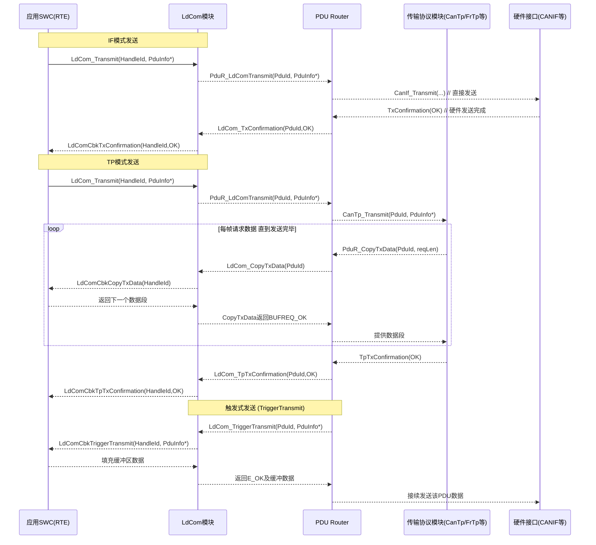
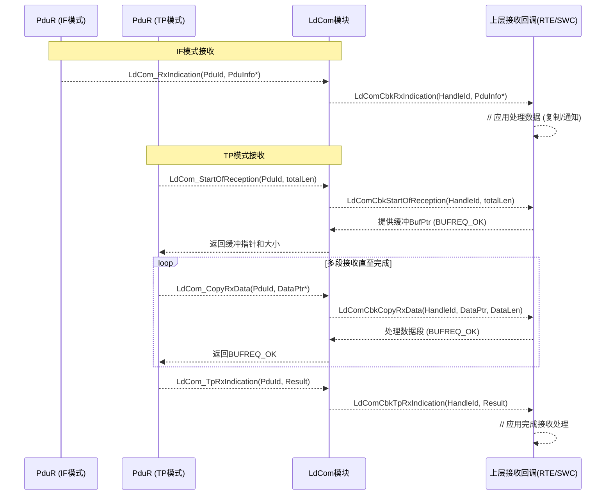

**摘要：**
AUTOSAR Classic 平台中的 Large Data COM（LdCom）模块是专门用于高效传输大数据量信号的基础软件模块。相较传统 COM 模块，LdCom 简化了数据处理流程，跳过了字节序转换、信号无效化、过滤等开销，以实现低延迟和高吞吐量的数据通信。本文基于 AUTOSAR R22-11 标准，系统性讲解 LdCom 模块的设计原理、配置方法、通信机制和实际应用，并对比 Classic 平台下 COM 模块和 Adaptive 平台下相关通信机制（如服务发现 Service Discovery）之间的差异。

## 目录

- [目录](#目录)
- [1. LdCom 模块的功能定位与演进历史](#1-ldcom-模块的功能定位与演进历史)
- [2. IF 与 TP 模式下的通信流程与 API 详解](#2-if-与-tp-模式下的通信流程与-api-详解)
  - [2.1 发送通信流程（IF 与 TP 模式）](#21-发送通信流程if-与-tp-模式)
  - [2.2 接收通信流程（IF 与 TP 模式）](#22-接收通信流程if-与-tp-模式)
- [3. LdCom 各类回调函数机制与使用示例](#3-ldcom-各类回调函数机制与使用示例)
  - [3.1 发送相关回调](#31-发送相关回调)
  - [3.2 接收相关回调](#32-接收相关回调)
- [4. Vector DaVinci Configurator 中的 LdCom 配置](#4-vector-davinci-configurator-中的-ldcom-配置)
- [5. LdCom 配置容器结构、用途与典型填写](#5-ldcom-配置容器结构用途与典型填写)
- [6. LdCom 与 COM 模块的信号管理及性能比较](#6-ldcom-与-com-模块的信号管理及性能比较)
- [7. 与 AUTOSAR Adaptive 平台通信机制的比较](#7-与-autosar-adaptive-平台通信机制的比较)
- [8. LdCom 与 PduR、CanTp、FrIsoTp 等模块的交互流程](#8-ldcom-与-pdurcantpfrisotp-等模块的交互流程)
- [9. 实际项目中的 LdCom 应用案例](#9-实际项目中的-ldcom-应用案例)
- [10. 常见错误配置与调试建议](#10-常见错误配置与调试建议)
- [11. 总结](#11-总结)

## 1. LdCom 模块的功能定位与演进历史

**模块定位：**AUTOSAR LdCom（Large Data Communication）模块是 Classic Platform 服务层中新引入的轻量级通信模块，定位于 **RTE 与 PDU Router 之间**，专门负责处理**大数据量信号**的发送与接收。简而言之，LdCom 为上层（应用/RTE）提供**面向信号**的接口（与 COM 类似），为下层（PduR/总线接口）提供**面向 PDU**的接口，用于高效传输大型数据。它是对传统 COM 模块的补充和优化，旨在在**自发的、非周期**通信场景中减少不必要的开销，实现**低延迟（Low Delay）**、高吞吐的大数据传输。


*图 1-1：AUTOSAR LdCom 模块在架构中的位置与交互关系示意图（位于 RTE 与 PduR 之间）。LdCom 专注于大数据的高效传输，不涉及信号端的复杂处理。图中展示了 LdCom 与 RTE、PDU Router 以及 DET 的关系。*

**设计动机：**随着汽车电子系统对大数据传输需求的增加（例如摄像头图像、雷达点云、地图更新数据等），传统 COM 模块在处理**大型信号**时效率变低。COM 模块原本为**小数据/周期信号**设计，在发送/接收过程中会执行字节序转换、信号打包拆包、周期传输调度、信号有效位更新、超时监控等操作。这些机制保证了信号语义的正确性，但处理**大块数据**时会引入额外的延迟和内存拷贝开销。同时，COM 模块对每个 I-PDU 默认维护内部缓冲区和 shadow 信号值，这在需要传输数十甚至上百字节的数据时并不高效。鉴于此，AUTOSAR 在4.2版本左右引入了 LdCom 模块（初始发布于 4.2.1），旨在提供一种**不经信号层解析、直接按字节块传递**数据的通道。LdCom 模块通过**精简通信栈功能**，绕过了许多 COM 层不必要的处理，实现**近似裸帧传输**的效率。从设计理念上看，LdCom 追求“低延迟”**和**“高吞吐”——通过省去非必须的步骤，最大限度降低发送接收的大数据在各层传递时的延迟。

模块特性：综上，LdCom 模块的核心特点可以总结如下：

* **聚焦大数据传输，降低协议开销：**仅支持**单一信号（字节数组）**的 I-PDU，不拆分为小信号处理，从而避免信号级的种种开销。同时仅采用**事件触发**传输模式，不支持周期/循环发送（没有周期调度），以便数据一产生就立即发送，无需等待调度周期。
* **最小化数据处理与复制：**LdCom **不对数据做格式转换**（字节序调整等），也不做信号级的无效化或过滤，应用传递过来的数据如何，便按原样发送。模块内部也**不维护本地缓冲区**，数据通常直接通过指针传递给下层或上层。这减少了不必要的拷贝次数，提高了传输效率。
* 集成传输协议支持：LdCom 既可以通过下层接口直接发送单帧数据（Interface API 模式），也可以调动下层传输协议模块进行分段传输（Transport Protocol 模式），以适应不同大小的数据包。这一点后文将详细解释。
* **简化 API 与配置：**相比 COM 繁多的配置项，LdCom 的 API 集合和配置参数更加**精简**。它主要围绕 I-PDU 和少数回调函数配置，不涉及信号组、信号端配置等，从而降低了配置复杂度（本文第四章将介绍配置细节）。

通过以上特性，LdCom 模块在 AUTOSAR 通信栈中扮演了**高效大数据通道**的角色。在诸如 SOME/IP 基于以太网的大数据通信场景下，经常会**组合使用 LdCom + 某种序列化协议**来实现高效的数据发送。例如，Vector 的实现中通常让 LdCom 与 SomeIpXf（SOME/IP Transformer）协同使用，以避免重复的数据拷贝和处理。可以认为，LdCom 为Classic Platform提供了在**资源受限环境**中传输大数据的标准化方案，对应Adaptive Platform中更灵活但更耗资源的通信中间件（后文第7章将比较二者差异）。

## 2. IF 与 TP 模式下的通信流程与 API 详解

LdCom 模块支持**两种通信模式**：**接口 (IF, Interface)** 模式和**传输协议 (TP, Transport Protocol)** 模式。这两种模式的区别在于数据包是否需要分段传输：当待发送的数据长度未超过底层总线的一帧容量时，可采用 IF 接口直接发送；若数据较大需要分段，则采用 TP 模式，借助底层的传输协议（如 CAN TP、FlexRay TP、SomeIP TP 等）完成分包/重组。在配置中通过参数 **LdComApiType** 来选择 I-PDU 的通信模式，典型取值为 **LDCOM\_IF** 或 **LDCOM\_TP**。本节将分别详述 **发送** 和 **接收** 方向上 IF 与 TP 模式的处理流程，以及相关 AUTOSAR 接口（API）的调用关系。

### 2.1 发送通信流程（IF 与 TP 模式）

发送过程可以由应用通过 RTE 主动触发，或由底层驱动触发（TriggerTransmit 机制）。首先介绍常规的主动发送流程，包括 IF 单帧发送和 TP 分段发送两种；随后介绍特殊的 TriggerTransmit 触发发送流程。图2-1给出了三种发送流程的时序图，下文配合解释每个阶段的细节。

**（1）IF 接口发送流程：**此流程用于发送**较小的数据包**（能够放入单帧PDU）。典型场景如：通过 CAN 发送不超过8字节的数据，或通过以太网发送一个不需分段的 UDP报文。流程如下：

* 步骤1：RTE 发起发送请求。应用层软件组件（SWC）调用 RTE 提供的发送函数（通常形如 `Rte_SwcX_Send_SignalY(dataPtr)`）。RTE 随即调用 LdCom 模块的服务接口 `LdCom_Transmit()`，将待发送的 LdCom 信号（SignalId 或 HandleId）和数据缓冲指针传入。在 AUTOSAR 配置中，每个 LdCom 可发送信号都会分配一个唯一的 HandleId，RTE 正是使用这个 ID 来索引发送对应的 I-PDU 数据。
* 步骤2：LdCom 模块处理发送请求。LdCom 收到请求后，根据传入的信号 ID 找到对应的 **LdComIPdu 配置**条目，其中包含该信号的长度、API 类型（IF/TP）等信息。对于 IF 类型的 I-PDU，LdCom 无需进行任何分段处理，直接将应用数据封装成一个 PDU。随后，LdCom 调用 PDU Router 提供的上层传输接口函数 `PduR_LdComTransmit(PduId, PduInfoPtr)`，将此 PDU 交由 PduR 模块进行路由发送。这里的 PduId对应该 I-PDU 的路由标识，由配置确定。调用 `PduR_LdComTransmit` 后，LdCom\_Transmit 即可返回结果（通常会返回 E\_OK 表示发送请求已成功提交）。
* 步骤3：PDU Router 发送数据。PduR 模块根据配置的路由路径，将该 I-PDU 转交给相应的总线接口模块。对于 IF 模式，由于数据无需分段，PduR 会直接调用底层如 CanIf 或 SoAd 等接口模块的 Transmit函数发送单帧。举例来说，若该 I-PDU 映射到CAN总线上的一个 CAN ID，PduR 将调用 `CanIf_Transmit(txPduId, PduInfoPtr)` 发送；如果是以太网 UDP，则可能调用 `SoAd_IfTransmit()` 发送。发送过程中，如果总线空闲且缓冲可用，数据将立即下发至物理网络。
* 步骤4：发送完成确认 (TxConfirmation)。当底层总线驱动（如 CAN Interface）成功地把帧放入总线或发送完成时，它会调用 PduR 的 TxConfirmation 接口通知发送完成。PduR 再据此调用回调函数 `LdCom_TxConfirmation(PduId, Result)` 通知 LdCom 模块发送结果。其中 Result 表示发送是否成功（OK或NOT\_OK）。
* 步骤5：通知上层应用发送结果。LdCom 收到 TxConfirmation 后，会进一步调用上层配置的回调函数，以通知应用层发送完成。例如，对于使用 RTE 的SWC，上层回调通常是 RTE 自动生成的 `Rte_LdComCbkTxConfirmation_<SignalName>()` 函数。RTE 收到该回调后，可相应地触发应用的通知逻辑（例如释放相关资源，或标记数据发送完成）。

上述流程中，值得强调的是 LdCom 在 IF 模式下**不涉及任何数据复制或转换**：应用提供的 data 指针往往直接指向 ComStack 内存中的一个缓冲区（可能由 RTE或SWC管理），LdCom 将此指针传递给 PduR 后便不再操作数据。正因为没有中间拷贝和处理，IF 模式路径非常高效。

（2）TP 接口发送流程：当待发送数据长度超过单帧容量时（例如需要发送100字节，而CAN单帧只能传8字节，或需要发送大型SomeIP消息超过一个以太网帧），LdCom 应配置为 **TP 模式 (LDCOM\_TP)**，以启用分段传输机制。TP 模式下发送流程相较 IF 模式增加了分段循环和传输协议交互，具体如下：

* 步骤1：RTE 发起发送请求。与 IF 流程相同，SWC 通过 RTE 调用 `LdCom_Transmit(HandleId, PduInfoPtr)` 请求发送。区别在于此 HandleId 所属的 LdComIPdu 配置了 LDCOM\_TP 模式，LdCom 据此判断需走 TP 路径。
* 步骤2：启动传输协议发送。LdCom 调用 `PduR_LdComTransmit()` 将发送请求提交给 PduR。此时 PduR 检索路由表，发现该 I-PDU 配置为经过某传输协议模块（如 CanTp、FrTp、SoAd/SomeIpTp）发送，于是调用对应TP模块的 Transmit函数。例如，在CAN网络，PduR 会调用 `CanTp_Transmit(txPduId, PduInfoPtr)` 开始TP传输；FlexRay则调用 `FrIsoTp_Transmit()`；以太网SomeIP可能直接通过SoAd和某种TP回调实现（视具体实现，通常以太网的TP由SOMEIP层处理）。
* **步骤3：传输协议请求数据分段。**传输协议模块（以 CAN TP 为例）初始化分段发送后，会**多次请求数据**直至发送完所有段。具体机制是：CanTp 每发送一帧后，当需要下一段数据时，会调用 PduR 的 CopyTxData 接口来向上层索要数据。于是 **PduR 调用 LdCom 提供的 `LdCom_CopyTxData(PduId, ... )` 接口**。LdCom\_CopyTxData 是 LdCom 模块实现的用于提供数据缓冲的函数，它在内部并不拥有完整数据，而是需要从上层获取。因此：
* 步骤4：LdCom 调用上层回调提供数据。LdCom 实现的 CopyTxData 会进一步调用配置的上层数据提供回调，如 `LdComUser_LdComCbkCopyTxData(HandleId, ... )`。对于使用RTE的场景，这个回调通常由 RTE 实现，内部会将请求转发给原始发送的 SWC，令其提供所需的数据段。常见方式是：应用最初发送时可能提供了完整缓冲区指针，RTE 保存该指针并在收到段请求时将相应偏移的数据地址和长度返回。总之，上层回调需要填充 `PduInfoPtr`（包含当前段数据指针和长度）。填充完成后回调返回一个 `BufReq_ReturnType` 给 LdCom：

  * 若成功提供数据段，则返回 **BUFREQ\_OK**，并附带尚未提供的数据剩余长度。
  * 若暂时没有数据（例如应用缓冲区暂不可用）则可返回 **BUFREQ\_E\_BUSY**，提示下层稍后重试。
  * 若发生错误无法提供，则返回 **BUFREQ\_E\_NOT\_OK**，终止发送。
* **步骤5：TP 模块发送各段数据帧。**每次 LdCom\_CopyTxData 返回 BUFREQ\_OK 后，传输协议模块就从提供的缓冲中取得一段数据发送出去，然后继续请求下一段，直至数据全部发送完成。整个过程中，LdCom 和上层通过 CopyTxData 回调配合，**逐段提供数据**。由于 LdCom 自身不存储完整数据，这种设计让**大数据可以分批从应用直接读取**，避免了在中间层存储整包的高内存占用。
* 步骤6：传输完成确认 (TpTxConfirmation)。当传输协议模块发送完所有段并收到接收端的确认（例如CAN TP完成所有帧且对端回ACK），会调用 PduR 的 TpConfirmation 接口。随后 PduR 调用 `LdCom_TpTxConfirmation(PduId, Result)` 通知 LdCom 模块整个TP发送完成。Result通常为E\_OK或E\_NOT\_OK，指示传输成功或失败。
* 步骤7：通知上层发送完成。LdCom 收到 TpTxConfirmation 后，将调用上层注册的 `LdComUser_LdComCbkTpTxConfirmation(HandleId, Result)` 回调。对使用RTE的SWC来说，RTE 会自动生成并注册该回调函数，收到调用后可据此通知应用层数据已可靠送达。应用可以在此回调中进行后续处理，如释放发送缓冲或记录日志等。

通过上述 TP 分段流程可以看出，LdCom 实际上充当了**上层数据缓冲的代理**：自身不存储大量数据，而是在下层请求时去上层取。这一机制确保即使发送几百KB的数据，LdCom 本身的内存占用也极小，仅需存一些状态（如已发送长度、剩余长度等）。而下层传输协议（如 CanTp）则负责流控、打包、CRC校验等（具体机制由传输协议模块实现，如分帧格式、SN序号、FC流控等遵循ISO-TP标准）。LdCom 与传输协议的协作通过 BufReq返回值和 TxConfirmation 实现，保证双方步调一致。例如，当应用未及时提供数据而返回BUSY时，CanTp会暂停并稍后重试 CopyTxData。总之，TP 模式流程体现了 AUTOSAR 分层设计中上层模块与下层TP的典型交互模式。

**（3）触发式发送流程（TriggerTransmit）：**有些总线传输场景下，帧的发送时机不是由上层主动调用，而是由**下层驱动定时触发**的。例如 FlexRay 周期性时隙发送：每当到达特定时隙，FlexRay Interface 会请求上层提供该时隙对应的帧数据。这种场景下，LdCom 支持 **TriggerTransmit** 机制：下层通过 PduR 调用 LdCom 的触发接口，LdCom 再向上获取数据。流程如下：

* 步骤1：下层触发请求发送。在需要数据发送的时候，PduR 会调用上层接口 `LdCom_TriggerTransmit(PduId, PduInfoPtr)`。这个调用通常源自某个总线接口驱动的请求：例如 FlexRay 如果某静态槽配置了该PDU，由驱动在槽起始时通过PduR要求数据。PduInfoPtr一般指向一个提供给上层填充数据的缓冲区。
* 步骤2：LdCom 获取最新数据。LdCom 的 TriggerTransmit 实现会立即调用上层注册的回调 `LdComUser_LdComCbkTriggerTransmit(HandleId, PduInfoPtr)`。上层（RTE或CDD）应该在此回调中将当前要发送的数据写入提供的缓冲区。与 CopyTxData 不同的是，这里往往不是分段而是一次性提供完整帧数据（因为请求者假定此PDU一帧就发出）。例如，如果应用有一个最新状态需要周期性广播，每次触发回调时应将最新状态打包成PDU写入缓冲。
* 步骤3：返回数据并发送。上层回调填好数据后返回，LdCom 将该缓冲区指针和长度返回给 PduR。随后 PduR 像处理IF模式一样，将此PDU交由底层驱动发送出去。由于调用发生在发送时隙正点，数据会立即发出。通常在 TriggerTransmit 流程中，如果发送成功，后续底层仍可能调用正常的 TxConfirmation 流程通知结果，只不过上层通常已经在提供数据时完成，其发送确认处理可以与 IF 情况类似处理。

TriggerTransmit 机制确保了在**下层定时触发**的场景中，LdCom 也能配合工作。配置上需要在 LdComIPdu 条目中将 **LdComTxTriggerTransmit** 设为 TRUE，并配置对应的上层 TriggerTransmit 回调函数。当配置此选项后，PduR才能调用 LdCom\_TriggerTransmit 接口。值得注意的是，如果使用 TriggerTransmit，则**应用层需确保随时提供最新数据**，尤其在高优先级中断场景下回调的执行时间要尽量短，以免错过发送时机。

下面用 Mermaid 时序图总结上述三种发送流程的交互关系：



*图 2-1：LdCom 模块发送方向 IF 模式、TP 模式及 TriggerTransmit 触发模式的交互时序图。IF 模式下数据一次发送完成；TP 模式下通过循环调用 CopyTxData 分段发送；TriggerTransmit 由下层定时请求上层数据。*

### 2.2 接收通信流程（IF 与 TP 模式）

接收方向上，LdCom 模块承担从 PDU Router 获取总线数据并上报给上层（RTE/应用）的职责。同发送类似，根据 I-PDU 是否分段，接收流程分为 **IF 接收** 和 **TP 接收** 两种模式；另外 LdCom 不执行传统 COM 的信号解析和字节序转换，而是**直接将数据原样交给上层**。下文分别介绍两种接收流程，并给出对应的回调和接口时序。

**（1）IF 接口接收流程：**用于接收**小数据量或单帧**的消息。例如CAN单帧消息、单个UDP数据包等。流程如下：

* 步骤1：底层驱动收到帧并上报 PduR。当总线接口（如 CANIF、FlexRay Interface、SoAd 等）收到一帧属于某个已配置 LdCom I-PDU 的数据时，首先通过 PduR 将该I-PDU的数据上报给上层模块。具体地，PduR 调用 `LdCom_RxIndication(PduId, PduInfoPtr)` 接口，将PDU的数据指针和长度传递给 LdCom 模块。这一调用类似于 COM 模块的 RxIndication，只是不涉及信号解析。PduId用于标识是哪一个 LdComIPdu。
* **步骤2：LdCom 处理收到的数据。**LdCom 收到 RxIndication 后，根据 PduId 找到对应的 LdComIPdu 配置，并确认其 **LdComApiType=IF** 且方向为 RECEIVE。由于IF模式没有分段，所以 LdCom 此时已经持有了完整的PDU数据（存放在 PduInfoPtr 指向的缓冲中，由PduR/下层提供）。LdCom 模块不会对数据内容进行任何修改（例如不会调整字节序或拆解信号），而是**直接准备通知上层**。
* 步骤3：通知上层应用收到数据。LdCom 调用上层配置的接收回调函数 `LdComUser_LdComCbkRxIndication(HandleId, PduInfoPtr)`，将数据指针和长度传给应用层。对于RTE场景，该回调通常由 RTE 实现，其内部会调用相应的 SWC 接口函数（例如 `Rte_Receive_<Port>_<DataElement>(data)`）将数据拷贝到应用接收缓冲或触发接收事件。在 CDD 场景，开发者需要提供这个回调函数的实现，自行处理数据。例如，可以在回调中直接解析收到的数据结构，或将数据复制到模块内部缓冲，再通过OS事件通知主循环处理。
* 步骤4：应用完成数据处理。一旦 RTE 或 CDD 的接收回调返回，表示应用已成功接管了该笔数据。由于 LdCom 没有本地缓冲，在回调返回后，这块数据缓冲便可被释放或复用。因此务必确保应用在回调中已经完成必要的数据复制或处理；否则回调退出后数据可能失效。

IF 接收流程相对简单直接：自始至终只有一份完整数据拷贝由总线接口驱动上交，经 PduR 调用 LdCom，再经回调交到应用。如果上层SWC配置了信号属性（例如通过 RTE 收发接口），RTE可能会在内部再做一次数据复制（取决于生成的代码策略），但不管怎样，LdCom 本身并不干涉数据内容，只是**透明地传递**。正因为流程精简，IF模式下 LdCom 接收延迟极小，基本相当于一个函数调用的开销。

（2）TP 接口接收流程：当通过传输协议分段发送的数据抵达接收端时，需要由 LdCom 与传输协议模块协作完成数据重组。这类似于发送时的逆过程。典型场景如：CANTP 分段的多帧CF接收，FlexRay 大PDU接收，以太网SomeIP分段大消息接收等。TP 接收流程如下：

* 步骤1：传输协议开始接收。底层传输协议模块（如 CanTp）接收到消息的首帧（First Frame或Single Frame）后，向上通知准备接收。例如CanTp在接收到首帧FF时，会调用 PduR 的 StartOfReception 接口上报。PduR 则调用 LdCom 提供的 `LdCom_StartOfReception(PduId, TpSduLength, BufPtr, BufSizePtr)` 接口，把以下信息告诉 LdCom：

  * PduId：标识哪一个 LdComIPdu。
  * TpSduLength：此次传输的总体预期长度（例如从FF帧里解析出的总数据长度）。
  * BufPtr 及 BufSizePtr：指向一个缓冲区以及长度变量，用于让上层提供用于存储接收数据的缓冲。

  LdCom\_StartOfReception 调用的主要目的是让上层分配或提供一个足以容纳 **TpSduLength** 大小数据的缓冲区，并将缓冲区指针和可用大小返回给传输协议模块。
* 步骤2：LdCom 请求上层分配缓冲。LdCom 模块实现的 StartOfReception 会进一步调用上层注册的回调 `LdComUser_LdComCbkStartOfReception(HandleId, TpSduLength, BufPtrPtr)`。对于RTE场景，RTE 可能预先为该信号生成了一个静态或动态缓冲区，并在回调中将其指针返回；对于CDD，开发者需要在回调中分配（或使用静态全局）缓冲。回调需根据TpSduLength决定是否能提供所需空间：

  * 如果**成功提供**缓冲，则设置 \*BufPtrPtr 指向缓冲区起始地址，返回 **BUFREQ\_OK**，并可将 \*BufSizePtr 填入本次提供的缓冲大小（通常等于TpSduLength或更大）。
  * 如果**无法提供**（内存不足等），则可返回 **BUFREQ\_E\_NOT\_OK**，将导致接收终止，传输协议将发送 Abort帧等。
  * 理论上还有 **BUFREQ\_E\_BUSY** 用法，但在接收初始阶段通常要么提供要么失败。

  当回调返回后，LdCom 将获得应用提供的缓冲地址和大小。
* 步骤3：传输协议分段接收数据。传输协议模块在收到上层 BUFREQ\_OK 和缓冲地址后，开始陆续接收后续数据段（如CF帧）。每当收到一段数据，就会调用 PduR 的 CopyRxData 接口，交付数据段内容并获取缓冲偏移更新。PduR 随即调用 LdCom 提供的 `LdCom_CopyRxData(PduId, PduInfoPtr)` 接口，将数据传给 LdCom。LdCom\_CopyRxData 的实现会直接调用上层回调 `LdComUser_LdComCbkCopyRxData(HandleId, DataPtr, DataLen)`，把收到的数据段指针和长度提供给应用进行处理或存储。

  * 数据存储：对RTE而言，如果前面 StartOfReception 时提供的是RTE内部缓冲，那么 CopyRxData 回调里可能不需要额外操作，因为PduR传进来的 DataPtr本身就指向了应用缓冲（零拷贝方式）。但某些实现也可能选择在回调中将 DataPtr 指向的数据复制到应用缓冲特定位置，再返回 BUFREQ\_OK。
  * BufReq 返回：每次 CopyRxData 回调处理完段数据后，应返回 **BUFREQ\_OK** 表示成功接收该段。如果应用缓冲满或其他原因无法继续接收，可返回 **BUFREQ\_E\_NOT\_OK** 提前终止。还能返回 BUFREQ\_E\_BUSY 让下层等待，但一般接收侧没有Busy的使用场景。

  这个循环会一直持续，直到传输协议声明所有段均已接收完毕。
* 步骤4：接收完成确认 (TpRxIndication)。当传输协议模块成功收到完整消息（或中途中止接收）后，调用 PduR 的 RxIndication 接口上报结果。PduR 再调用 `LdCom_TpRxIndication(PduId, Result)` 通知 LdCom 接收结束。Result指明成功 (E\_OK) 还是失败 (E\_NOT\_OK)。
* 步骤5：通知上层接收完成。LdCom 收到 TpRxIndication 后，调用上层配置的 `LdComUser_LdComCbkTpRxIndication(HandleId, Result)` 回调。对于RTE，此回调通常会触发 SWC 中相应接收完成的处理，比如发送ReceivedOk信号给状态管理或者直接调用Rte\_Receive接口最终交付数据。若Result为错误，应用可在回调中执行超时或错误处理（如丢弃已收部分）。

TP 接收流程中，LdCom 同样体现了**无缝传递数据**的特点：在整个接收过程中，LdCom 本身不对数据进行任何修改，只负责协调缓冲提供与数据搬运。所有实际的数据内容从下层传输协议直达上层提供的缓冲区，中间几乎没有拷贝（有时传输协议直接DMA到应用缓冲）。这极大提高了接收大数据时的内存利用效率。不过也需要注意由此带来的**责任转移**：应用提供的缓冲必须足够可靠，且应用需要正确处理回调时机。例如，在 StartOfReception 阶段如果估算长度不足或缓冲不匹配，可能导致数据截断或协议中止。

下图展示 IF 与 TP 两种接收流程的交互时序：



*图 2-2：LdCom 模块接收方向 IF 模式与 TP 模式的交互时序图。IF模式下一次RxIndication传递完整数据；TP模式下通过 StartOfReception 提供缓冲，循环多次 CopyRxData 接收段数据，最后通过 TpRxIndication 通知完成。*

通过以上分析可以看出，无论发送还是接收，LdCom 模块在 IF 和 TP 模式下都扮演着“数据直通”的角色：需要时向上层要数据缓冲或数据段，向下层交付数据或数据段，并通过回调将结果反馈给上层。**所有复杂的传输控制逻辑都委托给下层的 PduR 和传输协议模块**，这也是AUTOSAR分层架构的精髓之一。LdCom自身则聚焦于提供一个简洁、高效的接口，使大数据的传输对上层应用尽可能透明和轻量。上层开发者只需实现几个回调函数（或通过RTE配置通信接口），便可利用 LdCom 完成大数据的可靠通信。

## 3. LdCom 各类回调函数机制与使用示例

在上一章描述的通信流程中，多次提到了 **“上层回调函数”**。这些回调函数是 LdCom 模块与其上层用户（RTE 或 CDD）交互的接口，通过配置指定。理解每个回调的**触发时机、参数意义和典型用法**，对于正确实现应用逻辑非常重要。本节将分类介绍 LdCom 模块涉及的各种回调函数，包括发送相关回调和接收相关回调，并给出使用示例。

LdCom 上层回调函数可分为以下两组：

* 发送路径回调：发送确认和分段取数相关，包括普通发送完成、TP发送完成、触发发送、发送数据提供等回调。
* 接收路径回调：接收指示和分段供数相关，包括普通接收指示、TP接收开始、接收数据提供、接收完成等回调。

下面以分类小节方式详细说明。

### 3.1 发送相关回调

发送相关的上层回调主要在**发送过程结束**或**传输协议数据请求**时触发，用于通知应用发送结果或获取发送数据。根据不同模式，常见的发送回调有：

* **LdComUser\_LdComCbkTxConfirmation** – *发送完成确认回调（IF模式）*
  触发时机：IF模式下，当一个 I-PDU 成功（或失败）发送后，由 LdCom 调用本回调通知上层。对于使用 RTE 的SWC，RTE 会生成对应函数并提供给 LdCom 调用；CDD 则需自行实现。
  参数：典型定义为 `void LdComUser_LdComCbkTxConfirmation(CbkHandleIdType LdComHandleId, Std_ReturnType Result)`。第一个参数是配置的 HandleId（用于标识具体哪个信号发送完成），第二个参数Result表示发送结果（E\_OK或E\_NOT\_OK）。
  用途：应用可在此回调中执行后处理，例如：通知业务逻辑发送完成、记录日志、释放或复用发送缓冲、触发下一次发送等。如果发送失败（Result非OK），应用也可以在此进行错误处理或重发逻辑。
  示例：某SWC通过LdCom发送诊断日志数据，发送完成回调中将Result和日志ID记录到状态管理，以便上报诊断服务发送成功与否。

* **LdComUser\_LdComCbkTpTxConfirmation** – *分段发送完成确认回调（TP模式）*
  触发时机：TP模式下，完整大数据通过传输协议发送完毕后调用。它对应传输协议的 TpTxConfirmation 触发，由 LdCom 转发给上层。
  参数：类似TxConfirmation，`void LdComUser_LdComCbkTpTxConfirmation(CbkHandleIdType LdComHandleId, Std_ReturnType Result)`，含 HandleId 和发送结果。
  用途：与TxConfirmation用途类似，只是针对大数据发送结束。例如：应用在此回调中可以安全地释放此前分配的大数据缓冲，或者通知下位机“数据包已发送完成”。
  **区别：**若同时配置了IF和TP的发送（不太常见，同一IPdu一般选一种），则需要实现对应的回调。通常**IF模式下只配置 TxConfirmation，TP模式下只配置 TpTxConfirmation**。

* **LdComUser\_LdComCbkTriggerTransmit** – *触发发送请求回调*
  触发时机：当底层通过 PduR 调用 LdCom\_TriggerTransmit 请求数据发送时，LdCom 调用该回调以向上层获取数据。这通常发生在预配置的触发发送场景（如FlexRay静态帧）。
  **参数：**`Std_ReturnType LdComUser_LdComCbkTriggerTransmit(CbkHandleIdType LdComHandleId, PduInfoType* PduInfoPtr)`。HandleId标识请求的数据信号，PduInfoPtr指向需要上层填充数据的缓冲结构（包含DataPtr和长度）。
  **用途：**应用在回调中应将**当前最新的数据**拷贝到 `PduInfoPtr->SduDataPtr` 所指缓冲，并设置 `PduInfoPtr->SduLength`（实际填充的字节数）。通常，PduInfoPtr指向的缓冲是由下层提供的，长度为该PDU的最大长度。上层填完数据后，返回 E\_OK 表示提供成功。如果因为某种原因无数据可提供，则可以返回 E\_NOT\_OK，底层将发送空帧或不上报数据。
  示例：某 ECU 每隔100ms 需广播自身状态（含多个传感器值，总长度20字节）。配置该状态PDU为触发发送，由FlexRay驱动每100ms请求一次数据。SWC 实现的 LdComCbkTriggerTransmit 会读取当前20字节状态数据填入提供的缓冲，返回E\_OK。这样每个周期驱动都能发送最新状态。

* **LdComUser\_LdComCbkCopyTxData** – *发送数据段提供回调（TP模式）*
  触发时机：在 TP 分段发送过程中，每当传输协议需要获取下一段数据时，通过 PduR 调用 LdCom\_CopyTxData，LdCom 则调用此回调让上层提供数据段。该回调会被多次调用，直到数据发完。
  参数：通常定义为 `BufReq_ReturnType LdComUser_LdComCbkCopyTxData(CbkHandleIdType LdComHandleId, PduInfoType* PduInfoPtr, RetryInfoType* RetryPtr, PduLengthType* AvailableDataPtr)`。其中：

  * LdComHandleId 用于标识数据流；
  * PduInfoPtr 用于上层返回本次提供的数据段（DataPtr及其长度）；
  * RetryPtr 传递下层重试信息（如网络拥塞重发，不常用，可忽略或根据需求处理）；
  * AvailableDataPtr 上层可填写剩余未发送数据的总长度（供下层参考流控）。
    用途：应用需要在此回调中将请求的数据段拷贝到提供的缓冲区并设置长度，然后返回 BUFREQ\_OK。如果暂时没有数据可提供，可返回 BUFREQ\_E\_BUSY（提示下层稍后重试）；发生不可恢复错误则返回 BUFREQ\_E\_NOT\_OK 终止发送。通常 RTE 已封装好逻辑：例如在首次发送时记录了数据缓冲和长度，每次 CopyTxData 就根据一个静态索引提供下一块数据；CDD 则需自己实现索引管理。
    示例：SWC 要发送一个大型传感器数据（1000字节）。RTE 保留了该1000字节数组指针和总长=1000。每次 LdComCbkCopyTxData 调用时，RTE 根据静态偏移index提供 DataPtr=buffer+index，并Length=min(剩余, 请求长度)。AvailableDataPtr 设置为余下未发送字节数。第一次index=0长度=比如8字节，返回OK；多次调用后，当index达到1000且无剩余数据时，RTE在最后一次可能直接提供结尾数据并AvailableData=0。这样下层TP知道发送结束。

需要注意的是，发送方向的回调**大多是由 LdCom 主动调用上层**，开发者通常只需关注在这些回调中完成相应逻辑。例如，如果采用 RTE，则许多回调（TxConfirmation、TpTxConfirmation等）RTE会自动生成，开发者甚至无需手写，它们会自动调用SWC实现的RecvAck之类Runnable或者设置相应的RTE信号。如果采用CDD，则需要程序员提供这些回调函数实现并在配置中指明函数名。配置细节会在第5章讨论。

### 3.2 接收相关回调

接收方向的回调函数在**数据到达**或**传输开始/进行中**时触发，用于为下层提供缓冲或通知上层收到数据。主要包括：

* **LdComUser\_LdComCbkRxIndication** – *接收指示回调（IF模式）*
  触发时机：IF模式下，每当一个I-PDU数据包到达时由 LdCom 调用，用于通知上层收到数据。相当于传统COM的 ComRxIndication对应的RTE函数。
  参数：典型定义 `void LdComUser_LdComCbkRxIndication(CbkHandleIdType LdComHandleId, const PduInfoType* PduInfoPtr)`。HandleId标识收到的数据信号，PduInfoPtr则包含数据指针和长度。
  **用途：**应用应在此回调中处理接收到的数据。例如 RTE 场景下，RTE 可能会生成此回调函数并在内部调用 `Rte_Write/Receive` 将数据拷贝给SWC，或者直接触发一个数据接收事件。在CDD场景下，开发者可以在实现中解析PduInfoPtr里的数据，或复制到应用缓冲区后设置标志，通知任务线程继续处理。需要注意的是，该回调在**中断或高优先上下文**调用，应尽量快速返回，复杂处理应放到后续任务中进行。
  示例：一个CyclicSensor CDD实现了 LdComCbkRxIndication，每当接收到来自另一个ECU的传感器设置数据时，该回调将数据解析成配置参数并存入全局变量，然后设标志给主循环任务，在任务里真正应用这些设置。

* **LdComUser\_LdComCbkTpRxIndication** – *接收完成回调（TP模式）*
  触发时机：TP模式下，当整个大消息接收完成（或失败）时，由 LdCom 调用此回调通知上层。对应传输协议的 RxIndication结束。
  **参数：**`void LdComUser_LdComCbkTpRxIndication(CbkHandleIdType LdComHandleId, Std_ReturnType Result)`，表示哪个信号接收完成以及结果（E\_OK=成功，E\_NOT\_OK=中止）。
  用途：应用在此可以进行接收完成的收尾工作。例如，如果之前StartOfReception分配了动态缓冲，可以在此释放或者将指针转交其他模块处理；如果是RTE，则RTE可能在此调用SWC的Runnable表示“新数据包已经完整可用”。当Result不OK时，也应在此进行超时或错误处理（比如丢弃部分数据等）。
  示例：某SWC配置了接收一个大型文件分片（通过LdCom TP）。RTE在TpRxIndication回调中一方面将完整数据块指针交给SWC的一个处理Runnable处理文件，一方面如果Result失败则通知SWC发生错误。这让SWC可以在合适的时机开始处理长数据，而不是在每个段回调中处理。

* **LdComUser\_LdComCbkStartOfReception** – *开始接收回调（TP模式）*
  触发时机：TP模式下，当有大消息开始接收时调用，用于上层提供接收缓冲。这是传输协议首帧到达时的响应。
  参数：定义如 `BufReq_ReturnType LdComUser_LdComCbkStartOfReception(CbkHandleIdType LdComHandleId, PduLengthType TpSduLength, PduLengthType* BufferSizePtr)`。HandleId标识信号，TpSduLength是即将接收的总长度，BufferSizePtr用于返回上层提供的缓冲区大小。缓冲区指针本身通常不是直接参数，而是通过配置固定，或通过其他方式传回（比如在RTE实现里这个函数内部就知道缓冲区地址并把地址关联在LDCOM内部）。
  **用途：**应用需根据TpSduLength决定如何提供缓冲。如果有预先静态分配的缓冲（如数组），检查长度够不够，不够可能返回NOT\_OK；如果支持动态分配，可以malloc相应大小返回。然后将BufferSizePtr写入提供的缓冲区大小（通常等于TpSduLength，本实现**必须**提供足够大小，否则TP可能终止）。返回BUFREQ\_OK表示准备就绪。
  **注意：**AUTOSAR RTE对Sender/Receiver通信通常**不支持动态长度的Receiver缓冲**，因此RTE生成的StartOfReception回调往往只是检查配置的缓冲是否足够并返回OK/NOT\_OK。CDD可以灵活实现自己的分配策略。
  示例：某DataLogger CDD需要接收一个不定长的数据包。StartOfReception回调检查TpSduLength，比如最大允许2KB，如果大于2KB则返回NOT\_OK拒绝，否则调用 `malloc(TpSduLength)` 分配缓冲，将BufferSizePtr设置为分配大小并缓存指针，返回OK。后续 CopyRxData 段数据会写入这块缓冲。最后 TpRxIndication 再处理此缓冲的数据并 free。

* **LdComUser\_LdComCbkCopyRxData** – *接收数据段提供回调（TP模式）*
  触发时机：TP模式下，在接收过程中每当有新段数据到达时调用，通知上层有数据写入缓冲并可处理。通常RTE场景这个回调可能是空的（因为数据已经写入SWC缓冲，不需要额外动作），CDD场景可能需要copy。
  **参数：**`BufReq_ReturnType LdComUser_LdComCbkCopyRxData(CbkHandleIdType LdComHandleId, const PduInfoType* PduInfoPtr, PduLengthType* BufferAvailablePtr)`。PduInfoPtr指向当前收到的数据段内容（DataPtr及Length）。BufferAvailablePtr可由上层填写当前剩余缓冲大小。
  用途：应用可以在此将 PduInfoPtr->SduDataPtr 指向的数据段复制到自己的缓冲合适位置。如果StartOfReception时已经提供好了连续缓冲且下层直接写入，那么这里可能不需要做任何事，只需返回BUFREQ\_OK。BufferAvailablePtr用来告诉下层当前缓冲剩余空间（可选），一般在静态缓冲情况下=总长-已收，否则TP模块也有记录无需上层提供。
  返回值：通常返回BUFREQ\_OK；如果缓冲满或出错可返回NOT\_OK以中止。BUSY用法通常没有（因为接收一旦开始就应尽可能立即处理）。
  示例：在前述DataLogger例子中，如果CDD在StartOfReception malloc了一块内存并让TP直接写入，那么每次CopyRxData回调可以简单返回OK即可，不做别的。如果担心TP写入和应用处理同步问题，也可在此把段数据复制到另一个缓冲队列然后返回OK，但这通常没有必要。

综上所述，接收方向的回调重点在于**提供缓冲**和**及时处理段数据**。对于RTE自动生成的代码，大多会在StartOfReception和TpRxIndication中完成缓冲准备和最终交付，在CopyRxData中可能只是返回OK（数据已经放入RTE缓冲，由RTE自动在TpRxIndication时交付SWC）。对于CDD，开发者需要确保缓冲管理逻辑正确：Start时alloc，Copy时存，End时释放或通知。如果这些回调实现不当，常见问题有：缓冲不够导致丢数据，或者处理不及时导致TP层超时等。

最后需要强调：**所有回调函数必须在配置中正确声明并关联到对应 LdComIPdu**。下一章将介绍如何在Vector配置工具中配置这些回调函数的名称，以及配置容器的结构。正确的回调配置是确保上述通信流程顺畅的前提。

## 4. Vector DaVinci Configurator 中的 LdCom 配置

在AUTOSAR工程中，LdCom 模块的使用需要在 ECU 配置中进行相应配置，包括全局开关、I-PDU 列表以及各类回调函数的绑定。Vector公司的 DaVinci Configurator 工具提供了直观的图形界面来配置 LdCom 模块的参数。本节将介绍在 DaVinci 工具中配置 LdCom 的**典型步骤、配置界面路径**，并通过截图说明关键配置项。

配置入口：打开 DaVinci Configurator 工程后，在左侧的 BSW 模块列表中找到 “**LdCom**”。通常 LdCom 属于服务层模块列表，和 Com、PduR 等同级。如果工程最初未启用 LdCom模块，需要在 ECUC Module Configuration下添加 LdCom 模块的实例。一旦加入 LdCom，在配置树中会出现 LdCom 模块的配置结构。

配置结构：LdCom 模块的配置大体分为两层：**全局配置 (General)** 和 **I-PDU 列表 (LdComIPdu)**。在 DaVinci 工具中，这表现为 LdCom 下有一个 General 容器和若干 LdComIPdu 子容器。图4-1示意了该结构：


*图 4-1：LdCom 模块配置结构示意图（DaVinci Configurator）。左侧为配置容器层次，右侧列出选中容器的参数。LdComGeneral 包含全局开关，LdComIPdu 列出每个大数据PDU配置，其中包括 HandleId、ApiType、方向、回调函数和 PDU 参考等参数。*

如上图所示，每个 **LdComIPdu** 容器对应配置一个通过 LdCom 传输的“大数据PDU”。开发者需要根据需求添加多个 LdComIPdu实例。下面以配置一个发送用 LdComIPdu 为例，介绍主要字段：

* LdComHandleId：一个数值ID，用于RTE或CDD调用 LdCom\_Transmit 等API时标识该PDU信号。取值范围0\~65535，需在本 ECU 内唯一。最好采用易识别的命名（DaVinci显示时可能关联Symbolic Name），如关联到RTE Signal Symbol。
* LdComApiType：通信API类型，决定该PDU采用 IF 方式还是 TP 方式传输。可选值：`LDCOM_IF` 或 `LDCOM_TP`。选择 IF 则表示数据长度不会超过单帧且无分段；选择 TP 则会走TP传输流程。此设置也会影响RTE生成不同的API调用（即Rte\_Send会选LdCom\_Transmit还是LdCom\_Transmit\_Tp之类）。
* LdComIPduDirection：数据方向。`LDCOM_SEND` 表示此PDU由本ECU发送，`LDCOM_RECEIVE`表示接收来自总线的数据。不同方向下需要配置的回调函数也不同：发送方向配置发送完成类回调，接收方向配置接收类回调。
* 回调函数配置：这是 LdCom 配置的核心部分，用于绑定上层用户的各类回调函数。具体字段因方向和ApiType而异，在DaVinci中通常会根据选定模式显示需要填的回调名称。例如：

  * 发送\&IF模式：需要填 `LdComTxConfirmation` 回调的函数名。
  * 发送\&TP模式：需要填 `LdComTxTpConfirmation` 和 `LdComTxCopyTxData` 回调函数名（如果配置了TriggerTransmit则还需填TriggerTransmit回调）。
  * 接收\&IF模式：需要填 `LdComRxIndication` 回调函数名。
  * 接收\&TP模式：需要填 `LdComRxStartOfReception`、`LdComRxCopyRxData`、`LdComRxTpIndication` 回调名。
    填写时可以直接写函数名字符串，或选用DaVinci已知的RTE函数。例如，如果此LdComIPdu链接到一个RTE Sender/Receiver Interface，工具可能提供一个下拉让你选对应的 Rte\_Callback 函数。**务必确保**这里填写的名称与实际代码中的函数名一致。对RTE，通常Rte会自动生成符合命名的函数供调用；对CDD，需要自行实现这些函数。
* LdComPduRef：引用一个底层 PDU。这通常指向 PduR 配置中的一个 Pdu 含义，即该 LdComIPdu 对应的实际总线PDU ID。DaVinci会提供选择已有PDU的界面（这些PDU一般在 PduR 或在一个集中定义的 PduContainer 中预先定义）。通过这个引用，LdCom和PduR建立关联：当 LdCom使用该PduId发送时，PduR知道路由到哪个总线；反之接收也一样。
* LdComSystemTemplateSignalRef：引用一个 System Signal 定义，用于Trace或文档目的。这个配置在早期版本用于关联一个System Signal（ComSignal的定义）以表明此PDU的数据来源/去向。R22-11标准中如果SwCluC（软件集群）环境，该引用还有助于与Com配置协调。但一般情况下可以不填或工具自动处理。

配置上述字段后，该 LdComIPdu 的基本配置就完成了。对于**发送型PDU**，还需在 **PduR 模块**中建立从 LdCom 上层到具体下层（如CAN或CanTp）的路由；对于**接收型PDU**，则配置PduR从下层到LdCom的路由。DaVinci 通常在 PduR 配置中列出 “LdCom -> CanIf” 或 “LdCom -> CanTp” 之类的Routing Paths，需要选取对应的 LdComIPdu和下层Pdu进行关联。这部分属于PduR配置范畴，限于篇幅不展开，读者应确保 PduR 已正确路由，否则LdCom调用不会有实际效果。

回调函数绑定注意：当使用 RTE 时，许多回调函数名称有固定格式，例如：

* 发送确认：`Rte_LdComCbkTxConfirmation_<BusName>_<SignalName>`（具体取决于RTE实现）；
* 接收指示：`Rte_LdComCbkRxIndication_<BusName>_<SignalName>`；等等。

Vector工具在配置RTE通信端口时，会自动生成这些函数并帮你填入 LdCom 配置。所以如果通过RTE Ports来使用LdCom，**建议通过 DaVinci Developer 配置好 Sender/Receiver Interface**，然后同步到 Configurator，这样很多配置会自填正确。若项目中由CDD直接使用LdCom，则需要手动在Config中填写CDD实现的函数名，并在代码中提供实现。

总结来说，在 DaVinci Configurator 中配置 LdCom的关键步骤为：

1. 启用 LdCom 模块：将 LdCom 模块添加到ECU配置中（如果尚未添加）。
2. 设置全局参数：在 LdComGeneral 中根据需要启用版本信息API（LdComVersionInfoApi）和开发错误检测（LdComDevErrorDetect）。通常默认False即可，如需调试可以开启 DevErrorDetect。
3. 添加 LdComIPdu 容器：为每个需要的大数据通信添加一个 LdComIPdu实例，并填写 HandleId、ApiType、Direction 等基本信息。
4. 绑定回调函数：按照通信方向和模式填写所需的上层回调函数名字。例如发送TP模式填写 TxTpConfirmation 和 CopyTxData 等。确保函数名与代码一致。
5. 引用 PDU 和信号：将 LdComIPdu 的 PduRef 指向正确的 Pdu（通常从PduR或If层选择）。SignalRef根据需要填写（很多情况下留空由工具处理）。
6. 配置 PduR 路由：在 PduR 模块中，将对应的 LdComIPdu映射到具体总线的发送/接收模块。例如配置一个 RoutingPath：上层模块=LdCom（以及对应HandleId/PduId），下层模块=CanTp/CanIf，并指定CAN ID或TP参数等。
7. 生成代码并实现回调：运行生成，RTE代码会包含 LdCom 调用接口和回调的声明。如果是CDD，需要在指定的源文件中实现回调函数逻辑。

通过以上配置，LdCom 模块便集成到整个通讯栈中了。下一节我们将更深入介绍配置容器的结构含义，以及一些典型配置范例，加深对配置项的理解。

## 5. LdCom 配置容器结构、用途与典型填写

为了更好地理解 LdCom 模块的配置，本节基于 AUTOSAR R22-11 标准规范和Vector工具实践，剖析 LdCom 配置所涉及的**主要容器**及其参数含义，并给出典型填写建议。

根据AUTOSAR ECUC 配置模式，LdCom 模块的配置由一系列分层容器构成。核心容器包括：

* LdComGeneral：全局配置容器，包含模块级别的设置（如开发错误检测开关、版本信息API开关等）。
* LdComConfig：LdCom 配置根容器，包含多个 LdComIPdu 子容器，以及（可选的）LdComUserModule子容器。LdComConfig 相当于 LdCom 模块配置的顶层集合。
* **LdComIPdu：**（*重点*）每个通过LdCom传输的 I-PDU 的配置容器。包含该PDU的具体参数和子配置，如方向、类型以及回调等。这是配置中最关键也最复杂的部分。
* LdComUserModule / LdComUserCallback 等：用户配置容器，主要在多软件集群（SwCluC）或复杂驱动CDD情境下使用，用于将不同Partition或不同模块的回调进行区分配置。在一般单ECU、单Partition场景下，可以由工具自动配置RTE作为单一用户，因此我们聚焦典型单用户情形。

下面逐一介绍：

**（1）LdComGeneral 全局配置：**
LdComGeneral 容器包含两项重要开关：

* *LdComDevErrorDetect*：开发错误检测开关。设为 true 则LdCom模块会在运行中检查参数合法性、调用顺序等，并通过DET报告错误。建议在调试阶段打开（True），以捕获配置或使用上的错误；产品发布时通常关闭以节省性能（False，默认值）。
* *LdComVersionInfoApi*：版本信息API开关。设为 true 则生成 `LdCom_GetVersionInfo()` 接口，可用于获取模块版本号等信息。一般根据需要开启，默认False。

典型配置中，这两个开关通常保持默认（False）以减少额外代码。如需调试可暂时打开 DevErrorDetect 来捕获错误。

**（2）LdComIPdu 容器（关键参数）：**
每个 LdComIPdu 定义了一条“大数据通道”。其重要参数包括：

* *LdComHandleId*：唯一标识符，用于RTE和函数调用。应确保所有LdComIPdu的HandleId不重复。一种常见做法是将其与RTE信号ID对应，比如第1个LdCom信号给0，第2个给1，以此类推。或者按功能模块分配不同区间。配置工具通常要求手工填写或自动编号。
* *LdComApiType*：指定传输模式。可选值：`LDCOM_IF`（接口模式）或 `LDCOM_TP`（传输协议模式）。这个设置不仅决定 LdCom 模块调用PduR接口集的种类（Transmit vs TpTransmit），也决定需要配置哪些回调函数。**典型填写**：如果确认数据长度不会超过单帧容量且无须TP处理，则选 LDCOM\_IF；否则选 LDCOM\_TP。宁可多用TP也不要错误地用IF导致数据截断。例如对于CAN FD 64字节的数据，可按需选TP（如果要利用CANTP的CF分帧功能）或者IF（若打算单帧发送但要自行保证不超帧大小）。
* *LdComIPduDirection*：方向。可选 `LDCOM_SEND` 或 `LDCOM_RECEIVE`。需要与实际信号用途匹配。如果填错方向会导致回调配置不匹配，可能运行时报错或者没有回调被调用。**典型填写**：对发送型数据（本ECU产生输出）配置为SEND；对接收型数据配置为RECEIVE。双向通信需要配置两个LdComIPdu（一个SEND一个RECEIVE，分别针对不同PduId）。
* 回调函数配置组：根据 ApiType 和 Direction 不同，需要配置不同的回调函数容器。AUTOSAR R22-11规范定义了一系列可配置回调：

  * 如果 Direction=SEND 且 ApiType=IF，需要配置 *LdComTxConfirmation* 回调的函数名。
  * 如果 Direction=SEND 且 ApiType=TP，需要配置 *LdComTxTpConfirmation* 和 *LdComTxCopyTxData* 回调；可选配置 *LdComTxTriggerTransmit*（仅当需要触发发送时）。
  * 如果 Direction=RECEIVE 且 ApiType=IF，需要配置 *LdComRxIndication* 回调。
  * 如果 Direction=RECEIVE 且 ApiType=TP，需要配置 *LdComRxStartOfReception*、*LdComRxCopyRxData*、*LdComRxTpIndication* 回调。

  在DaVinci工具中，上述每个回调通常作为 LdComIPdu 容器的子容器或参数列出，让用户填写实现函数名字符串。例如填写 “MyDriver\_LdComRxIndication” 或 “Rte\_LdComCbkRxIndication\_SomeSignal”。**典型填写**：对于使用RTE的信号，建议直接填写RTE生成的回调名（通常工具可提示）；对于CDD实现，则填写CDD提供的函数名。切记填写的名字须与代码实现完全一致，包括大小写。
* *LdComPduRef*：引用一个 PDU 定义。这是在 ECU内将 LdCom 信号与底层通信（CAN/LIN/FlexRay/Eth）关联的桥梁。通常在配置Com或其他接口时已定义好PDU（包含长度、PduId等）。典型情况下，对于每个 LdComIPdu，会有一个对应的 PduR Routing Path，里面定义了一个 PduRef指向具体总线PDU。**典型填写**：利用工具下拉选择相应的 PDU。如发送某CAN FD长帧，此处选择对应的 CAN Pdu（由CAN Interface或PduR定义，携带CAN ID等）；以太网SomeIP则选择对应SoAd Pdu或Generic Pdu。
* *LdComSystemTemplateSignalRef*：可选，用于指向 Autosar System Signal。此参数在使用系统信号概念时有用，它可以帮助在System Template（系统配置）中标明此LdComIPdu对应的高层信号。然而很多项目并未使用系统信号，或者将其留空。**典型填写**：若使用RTE通信，此Ref可指向SWC内部定义的某Signal（ComSignal），否则为空。此参数不影响功能，可视为文档用途。

除了以上主要参数，LdComIPdu 还有一些附加配置可能出现在工具中，例如 *LdComTxIPduUnusedAreasDefault*（发送未用字节默认值）、*LdComRxBufferSize*（接收缓冲区大小）等。这些参数用于更细粒度控制，但一般使用默认即可，因为 LdCom 本身不存储缓冲，所以很少需要手动设置这些值（通常TP模块会管理缓冲区大小）。在Vector配置中可能看不到这些参数，或者以高级选项方式呈现。

**（3）LdComUserModule 及回调容器：**
对于大多数典型用例（单Partition，RTE对接LdCom），我们可以不显式配置 LdComUserModule，工具会隐式创建一个默认的 “Rte作为LdCom用户”。但为了完整性，这里简述其概念：AUTOSAR在R21-11引入了Software Clusters机制，一个ECU可划分多个应用集群，每个集群可能都有自己的 RTE 实例和 LdCom 用户。如果项目涉及多个Partition或多功能集成（比如同时有RTE和CDD都使用LdCom），配置上就需要通过 LdComUserModule 来区分不同用户，为它们各自的IPdu分配不同的HandleId范围和回调实现。每个 LdComUserModule 会引用一个 LdComUserModuleCnf 子容器，后者下面会挂多个 LdComUserCallback 子容器，每个对应一个回调函数配置（将IPdu HandleId映射到具体函数名）。

简单来说，**LdComUserCallback** 容器包含两个关键要素：一个 HandleId（或IPdu引用），一个 CallbackFunctionName。通过这种方式，可以在多用户场景下把不同IPdu的回调分散给不同模块。典型填法是：如果有多个Partition，各Partition分别配置自己的 LdComUserModule，并在里面配置属于自己的IPdu及回调。而在单用户场景下，可以让工具自动完成这些配置，无需手工为每个HandleId重复配置回调（因为在LDCOMIPdu里其实已经填了）。Vector DaVinci通常会将回调直接作为LdComIPdu的子项配置，从而隐去了LdComUserCallback底层容器细节，对用户更直观。

**（4）典型配置范例：**
结合以上理解，这里给出一个简化的 LdCom 配置示例（以XML形式类似表达，非严格语法，仅为说明）：

```xml
<LdCom>
  <LdComGeneral>
    <LdComDevErrorDetect>false</LdComDevErrorDetect>
    <LdComVersionInfoApi>false</LdComVersionInfoApi>
  </LdComGeneral>
  <LdComConfig>
    <!-- 发送端：SensorData 大数据通过 CAN TP 发送 -->
    <LdComIPdu Name="SensorData_TX">
      <LdComHandleId>0</LdComHandleId>
      <LdComIPduDirection>LDCOM_SEND</LdComIPduDirection>
      <LdComApiType>LDCOM_TP</LdComApiType>
      <LdComTxTpConfirmation>Rte_LdComCbkTpTxConfirmation_SensorData</LdComTxTpConfirmation>
      <LdComTxCopyTxData>Rte_LdComCbkCopyTxData_SensorData</LdComTxCopyTxData>
      <!-- 这里未配置TriggerTransmit，因为此传输由SWC主动触发而非底层 -->
      <LdComPduRef>PduR_CanTp_SensorData_TxPdu</LdComPduRef>
    </LdComIPdu>
    <!-- 接收端：DiagDump 数据通过 Ethernet SOME/IP 接收（单帧IF假设） -->
    <LdComIPdu Name="DiagDump_RX">
      <LdComHandleId>1</LdComHandleId>
      <LdComIPduDirection>LDCOM_RECEIVE</LdComIPduDirection>
      <LdComApiType>LDCOM_IF</LdComApiType>
      <LdComRxIndication>Cdd_DumpModule_LdComRxIndication</LdComRxIndication>
      <LdComPduRef>PduR_SoAd_DiagDump_RxPdu</LdComPduRef>
    </LdComIPdu>
  </LdComConfig>
</LdCom>
```

以上示例展示了两个 LdComIPdu：编号0的发送SensorData（使用TP，回调指向RTE函数），编号1的接收DiagDump（使用IF，回调指向CDD函数）。实际配置中，还需在 PduR 定义 PduR\_CanTp\_SensorData\_Tx 和 PduR\_SoAd\_DiagDump\_Rx 的路由。

**（5）配置填写技巧：**

* 确认信号大小再定 IF/TP：对于边界情况（例如CAN FD上32字节数据），若能确认不超一帧则IF即可，否则用TP更保险。宁可过度指定TP也不要在超界时出问题。
* HandleId 命名与管理：虽然只是数字，但建议在文档中定义各模块使用的范围。如0-99给某模块，100-199给另一模块，以免多人协作时冲突。DaVinci某些版本不自动防冲突，要靠人为约束。
* 回调函数实现匹配：配置完后生成代码前，准备好对应函数实现的声明（RTE生成或CDD自己写）。编译链接阶段若提示找不到符号，则可能是名字拼写不一致。
* 善用DevErrorDetect：在调试配置阶段，将 LdComDevErrorDetect 打开，然后在应用初始化后调用 `LdCom_GetVersionInfo()` 打印版本。这既验证模块正确初始化，也为后续接口调用提供了基本信心。如果有错误配置，比如回调未配置，LdCom 很可能会通过DET报错。
* 充分利用工具检查：DaVinci 等工具一般会在配置完成后提供Consistency Check。运行检查可发现漏配或不合理配置。例如 PduRef 未设置、回调漏填等都会提示错误或警告。

通过对配置容器和参数的详细剖析，我们可以更清晰地了解到每个配置项背后的意义和作用。这为正确配置 LdCom 打下基础。在实践中，合理的配置能确保 LdCom 模块高效稳定运行。下一章我们将把视线从配置转向模块特性比较，看看 LdCom 与传统 COM 模块，以及与Adaptive平台的通信机制有何不同。

## 6. LdCom 与 COM 模块的信号管理及性能比较

AUTOSAR Classic 中的 LdCom 模块和传统 COM 模块都位于服务层，承担着将应用信号映射到总线PDU的职责。然而二者在设计取向和性能侧重点上存在显著差异。理解这些差异，有助于工程师在项目中根据需求选择合适的通信机制。本节将从**信号管理机制**和**性能**两个方面，对比 LdCom 与 COM 模块。

**信号管理机制比较：**

* **信号颗粒度 vs 数据块：**COM 模块以**信号（Signal）**为基本单位进行管理，每个 I-PDU 可包含多个信号，甚至支持信号组；而 LdCom 模块则**每个 I-PDU 仅承载一个信号**，即整个PDU的数据被视为一个整体的“Large Signal”。因此 COM 会有复杂的 Signal <-> I-PDU 映射和UpdateBit、SignalGroup等机制，而 LdCom 完全没有这些概念，数据仿佛就是一个“大Signal”直接映射到PDU。

* **数据处理：**COM 在发送时会将各信号值按照配置的字节偏移打包到PDU缓冲，并根据信号类型进行必要的**字节序转换、类型转换**（如大小端交换，boolean到bit映射等）；在接收时COM从PDU提取信号值、转换字节序，然后通过RTE写入信号。相比之下，LdCom **不进行任何信号级转换或拆装**，数据内容完全按照应用给出的字节流传输。这意味着使用COM时应用可处理更抽象的信号（比如int16会转换正确字节序），而使用LdCom时应用必须自行保证数据格式一致性（例如双方约定使用Little Endian发送，那么发送端和接收端应用都应按Little Endian读写字节）。

* 缓冲及存储：COM 模块通常在内部维护每个信号的当前值和每个I-PDU的缓冲。也就是说，发送信号前COM会将其存入内部缓存等待发送，接收信号时也存入缓存供RTE随时读取。这些内部buffer支持COM实现周期性传输（定期从buffer发送）和信号端超时监控等功能。但这也带来了内存开销和数据同步问题。而 LdCom **不维护信号缓冲**，发送时数据直接从应用传入即刻发送，接收时数据到达立刻回调应用处理。如果应用需要留存数据，也应在接收回调中自行缓存。这样设计减少了内存复制和滞留，但应用需要自己确保在正确的时机取用数据。

* **传输方式：**COM 模块支持**各种传输模式**，如周期、周期带偏移、触发、混合等，以及**最小延迟时间**（MDT, Minimum Delay Time）避免发送过频繁。这些特性适用于周期性、连续信号。但 LdCom 则**仅支持事件触发的非周期传输**，也没有最小延迟限制——应用每次调用 LdCom\_Transmit都会立即触发一次发送。换句话说，COM 更擅长持续不断的小信号流控制，LdCom 更擅长一次性的大数据发送。对于需要周期性发送大数据的场景（例如每隔100ms发送一次50字节状态），COM 可以配置周期行为并自动完成；而使用LdCom需要应用每100ms自行调用发送。根据项目需求，可能结合使用：小而频繁的信号用COM，大而偶发的数据用LdCom。

* **错误监控：**COM 模块内置**信号超时监控**（对于接收信号，可配置超时时间，若长时间未更新则报错）以及**无效值填充**（信号超时或无效时填默认值供应用读取）。LdCom 则**不提供**这些高级监控功能。如果需要类似监控，必须由应用在接收回调基础上实现（例如自己记录上次接收时间定期检查）。

**性能和资源比较：**

* **CPU 使用：**由于 COM 要进行信号打包、字节序转换、遍历I-PDU内信号列表等操作，相比之下 LdCom 直接传递裸数据，CPU负担更小。当数据量大时，此差异更加明显——COM 可能要处理每个字节的字节序或按bit赋值，而 LdCom 基本就是一次 memcpy 或直接DMA。正如Vector资料所述：“Large Data COM 针对大信号优化，避免不必要的数据拷贝”。因此对于**单次大消息**传输，LdCom 的CPU占用往往显著低于COM。同样地，在频繁发送场景，COM的MDT、信号路由逻辑也会增加处理开销，而LdCom逻辑极其简单（判断IF/TP然后调用PduR）。当然，如果考虑传输协议的参与，在TP模式下LDCOM需要多次回调获取数据，CPU中断次数会增加，但整体来看依然比COM处理复杂信号要轻量。

* 内存占用：COM 为每个I-PDU都分配缓冲区（Tx buffer, Rx buffer），为每个信号也可能分配shadow变量，整体内存footprint取决于信号总数。而 LdCom 本身几乎不占用数据缓冲，只需维护配置和状态。对于需要传输的大数据，COM和LdCom都会使用底层TP的缓冲，但COM还会多一份内部镜像。举例：要发送1KB数据，COM可能有1KB缓冲+TP模块1KB缓冲，LdCom或许只用TP模块的1KB缓冲。可见 LdCom **内存效率更高**，尤其在同时管理多路大数据时不会为每路都驻留大块内存。不过需要警惕的是，这种零拷贝也将内存管理责任转嫁给应用和TP模块，例如TP模块得考虑当下层网络拥塞时缓存多帧数据，而COM至少在应用侧保存了一份数据可重发。所以内存占用和可靠性是一种平衡，需要结合场景评估。

* **延迟：**对于实时性要求高的信号，LdCom 因为无最小延迟、无排队等待，下层空闲即发，可以取得**更低的端到端延迟**。COM 则可能因为MDT机制或调度策略故意引入些许延迟（防止频繁发送）。另外COM的信号处理也增加了微观延迟。例如COM接收时要解析字节，这在几十字节规模时微不足道，但在几千字节时就显著了。总的来说，LdCom 更适合**低延迟传输**场景，比如需要尽快广播一段关键数据。

* **并发和负载：**如果一个I-PDU包含很多信号（COM场景），COM在一次I-PDU更新或发送时需要依次处理每个信号，时间复杂度O(n)。LdCom一次处理一个大signal，复杂度O(1)（不考虑数据长度）。当系统中信号很多时，COM的运行时间可能线性增加。而LDCOM的运行时间与信号数量无关，只与数据长度和TP过程有关。因此在**高信号密度**场景（ECU管理上百个信号），使用LdCom来承载部分数据可能减轻COM模块负担，提高整体实时性。

下面用一个具体例子来说明二者差异：假设有一个包含20个传感器值的结构体，总大小100字节。如果用COM发送，可能需要配置20个Signal并将它们放入一个I-PDU，每次发送COM要逐个拷贝20个值、处理20次字节序、打20个UpdateBits，RTE层面也要针对20个ReceiveSignal调用。而用LdCom发送，则把整个100字节作为一个字节数组Signal发送，无需逐项处理，只一次复制100字节即可。很明显，当传感器数进一步增多时，COM开销线性增长，而LdCom几乎恒定。因此在这种**批量数据**场景，LdCom具有显著优势。

功能取舍：当然，LdCom并非全面取代COM——它通过牺牲COM的一些灵活性和功能性来换取效率。COM模块多年的发展提供了丰富的功能，比如信号网关、端到端安全（E2E库一般集成在COM层）、周期多样化配置等，而LdCom追求极简并不具备这些能力。例如COM可以很容易配置一个“信号网关”：接收一个信号然后原封不动发送出去，只需配置Signal Routing；而LdCom由于没有信号概念，要实现网关需要应用读到数据再调用发送，增加了开发复杂度。同理，AUTOSAR标准定义的E2E保护机制目前也是结合COM信号使用的（Adaptive上的SOMEIP也有e2e，但Classic中大多配合COM），LdCom没有直接的E2E配置，要实现也需在应用数据中自行增加CRC等。

**小结：**当**数据量较小、信号语义重要**时，COM模块提供了更完善的支持和更简单的应用接口（因为它帮你做好了解析和监控）；当**数据量庞大、追求效率**时，LdCom模块能够大幅降低系统开销，但要求应用对数据内容自主管理。两者并不冲突，反而可以配合使用：例如一个ECU上既跑常规COM信号（传感器、小状态量等），又通过LdCom传输少数大块数据（如固件更新、图像）。AUTOSAR标准也预留了两者并存的空间，比如 PDUR 同时支持 Com 和 LdCom 的上层接口。所以工程上应根据具体需求**扬长避短**：需要精准信号解析和监控就用COM，需要裸数据高速通道就用LdCom。

## 7. 与 AUTOSAR Adaptive 平台通信机制的比较

AUTOSAR Adaptive 平台与 Classic 平台在理念上有较大差异。其中一个显著不同在于通信机制：Classic 平台以 COM/LdCom 等静态配置驱动的通信为主，而 Adaptive 平台采用**服务导向**（Service-Oriented）的通信中间件，强调**动态发现和绑定**。本节我们对比 Classic 平台的 LdCom 模块与 Adaptive 平台上的类似机制，包括**服务发现（Service Discovery, SD）**和**Adaptive通信栈**，以理解两者在大数据传输和通信管理方面的不同。

**动态 vs 静态：**在 Classic 平台，LdCom/COM 等通信均通过**静态配置**预先定义好通信关系（谁发送，ID是什么，发到哪个总线）。ECU 编译时就确定了通信矩阵，节点间的通信伙伴和数据格式都是已知的。而 Adaptive 平台采取更灵活的策略：应用不直接通过固定ID通信，而是通过**服务**注册和查找来建立通信。Adaptive 的Service Discovery (SD)机制允许应用在运行时宣布“我提供某服务”或“我需要某服务”，网络中有一个服务发现协议（在SomeIP-SD上运行）来动态匹配客户端和服务端。这种机制在Adaptive中是必须的，因为Adaptive应用可以在不同时刻启动停止，甚至跨主机（Machine）通信，不像Classic那样固定拓扑。

因此，对于**通信建立**而言：

* Classic LdCom：通信双方事先知道彼此，直接通过配置的HandleId/PduId交互，无需发现。不能灵活更改通信伙伴。
* Adaptive通信：通过 SD 在运行时找服务，例如一个导航应用FindService找到GPS服务。这使**耦合更松**，但也意味着**首包传输前有额外延迟**（服务发现交互）和**开销**。

**通信接口：**Classic 平台应用通过 RTE 或 CDD 接口调用 LdCom服务，如 `LdCom_Transmit`，这是一种**过程调用**的方式。而Adaptive应用一般使用**ARA::COM** API，也就是Adaptive Communication Management库提供的接口来通信。Adaptive通信API更贴近**RPC风格**：应用定义服务接口（可能使用 SOME/IP下的接口定义语言），由代码生成Proxy和Skeleton类，提供的方法调用和通知机制。开发者使用的是**调用方法**或**发布事件**的方式，底层自动完成序列化和传输。这与Classic的发送函数虽然本质类似，但开发者心智模型不同：Adaptive更像调用本地对象方法，不关注数据包细节；Classic显式发送字节。所以**易用性**上Adaptive更高抽象，但调试难度也高一些，因为底层封装多。

**序列化和传输协议：**Adaptive 平台主要以 **SOME/IP** 作为通信协议（Service Oriented Middleware over IP），运行在以太网上。当然Adaptive也支持DDS等中间件，但以SomeIP为主流。SOME/IP本身有**内置的分段机制**（SOME/IP-SD用于服务发现，SOME/IP-Segmentation用于大数据分片）以及**可靠性**支持（如TTL,或通过 TCP承载）。在Adaptive实现中，类似 LdCom的功能由 SOME/IP库在用户态实现。例如，Adaptive的 vsomeip库会处理大数据的分片重组、流控，与Classic的CanTp类似，只是运行在用户空间服务进程中。因此可以认为**Adaptive 平台也有“Large Data COM”的概念，只是它不是独立模块，而是融入SOME/IP通信框架中了**。Adaptive应用在发送大数据（比如一个复杂结构）时，无需关心分片细节，vsomeip会在必要时自动切分消息，并通过POSIX Socket发送。这个行为等价于Classic中 LdCom + PduR + CanTp + SoAd 联合作用的结果，但在Adaptive上是打包在一起的库行为。

**服务发现 vs LdCom配置：**Classic通过静态配置决定了消息ID和目的地；Adaptive通过服务ID和实例ID来标识服务。Service Discovery协议将服务名解析为**具体的网络端点**（IP地址+端口）。所以Adaptive在每次通信前都会有一个discovery阶段，Classic则跳过直接通信。这样Adaptive支持更动态的架构，例如一个服务可以在不同ECU上移动，客户端也无需变代码，只要SD发现即可。这种灵活性是Classic不具备的——Classic若要改变通信伙伴，必须重新配置整个系统并刷新固件。在汽车生命周期中，Adaptive更能适应OTA更新带来的功能变化，而Classic追求的是**确定性**和**可预测性**。因此大多数安全/底盘等实时域仍采用Classic固定拓扑通信，而信息娱乐、高级驾驶等可能引入Adaptive方案以提高拓扑弹性。

**通信延迟与性能：**Adaptive的通信栈因为在用户态、基于以太网（一般TCP/IP协议栈），其基础延迟和开销通常高于Classic基于CAN/FlexRay的通信。Adaptive的service调用要经过一些层次：应用代码 -> ara::com API -> vsomeip库 -> OS Socket -> 网络传输 -> 对端相反流程。这相当于Classic上的RTE->LdCom->PduR->CanIf路径，但Adaptive由于支持更多功能（比如安全、压缩等）可能更耗时一些。具体要视实现而定，但**Classic LdCom在轻量性上依然有优势**，因为Classic环境是高度优化的嵌入式RTOS和驱动。Adaptive胜在带宽大（千兆以太 vs 500k CAN）和灵活但需要更强算力支撑。举例：Classic用LdCom传输100KB数据在100Mbps以太网上，大致需要若干milliseconds，Adaptive用SOMEIP传输100KB在同样网络上因为用户态切换等可能多耗几毫秒，但总体都远比CAN的800ms快了。

**功能对比：**Adaptive平台的通信管理提供了诸如**Quality of Service**、**安全认证**、**时间同步**等更高级的特性，这些在Classic的COM/LdCom层面没有直接对应。如果需要在Classic实现类似功能，往往需要其他模块配合（如SecOC用于安全，GlobalTime用于时间同步等）。Adaptive平台内建这些概念在其API中，如DDS的QoS配置、ara::com的SomeIP认证等。可以说Adaptive通信是面向IP服务，高层功能丰富但对应用开发者相对透明；Classic通信更贴近链路层，需要开发者/集成者充分配置各层。

**Adaptive中的大数据传输：**虽然Adaptive没有一个叫“LdCom”的模块，但其**大数据传输**同样通过**分段协议**和**流控制**来实现。例如Adaptive SOME/IP协议规定消息长度字段是16位，可以传输最长65535字节payload，超过MTU则可选用某些segmentation（有的实现使用SOMEIP-TP或直接依赖TCP分段）。Adaptive的ara::com API对开发者屏蔽了这些细节。如果要类似Classic LdCom那样控制传输过程，Adaptive允许应用选择传输层协议（TCP/UDP）或QoS策略，但不会让应用去实现“CopyTxData”这样的回调——这些工作库会做。所以Adaptive在**易用性**上是胜出的，但**可控性**稍差**且无法轻易插入定制处理**。Classic开发者可以针对LdCom的回调做巧妙优化，比如决定什么时候提供数据，Adaptive开发者一般只能相信中间件完成任务。

**小结：**Classic LdCom和Adaptive通信机制分别反映了AUTOSAR两个平台不同的设计哲学。Classic追求**确定性和高效**，通过 LdCom 这样简单直接的模块快速搬运数据；Adaptive追求**灵活和动态**，通过服务发现和高层API来适应变化环境。对于汽车的大数据通信任务，如OTA下载、传感器融合数据传输等：

* 在Classic上可能会使用 LdCom+SomeIP (Classic) 来实现，这需要预先配置好某服务ID和LDComPdu, 相对固定；
* 在Adaptive上则直接使用 ara::com 提供服务，客户端FindService然后发送，两边自动协调。

两者可以交互：例如Adaptive节点和Classic节点通过以太网SomeIP通信，这时Classic侧用LdCom+SomeIpXf+SoAd，Adaptive侧用ara::com+vsomeip，双方通过SomeIP SD发现彼此。业界常见做法是**混合架构**，让高性能控制用Classic，信息娱乐用Adaptive，中间通过标准协议（如SomeIP）打通。LDCOM作为Classic侧承载SOMEIP的关键模块，其配置正确与否直接决定跨平台通信的可靠性。

总而言之，Classic LdCom注重**执行效率**和**资源占用小**，Adaptive通信注重**灵活配置**和**应用透明**。工程上没有绝对的优劣，需根据项目要求权衡。如果系统需要在运行中灵活增加新通信关系，Adaptive架构更适合；如果需要严格的实时和最低的开销，Classic的静态通信依然是首选方案。

## 8. LdCom 与 PduR、CanTp、FrIsoTp 等模块的交互流程

上一些章节我们多次提及，LdCom 模块并非孤立工作，而是与**PDU Router（PduR）**以及底层总线的**传输协议模块**协同完成大数据传输。在AUTOSAR架构中，可以将 LdCom 看作**上层通信的端点**，PduR 则充当**路由调度中心**，传输协议如 CanTp、FrIsoTp 则是**分段传输实现者**，而最终的 CanIf、FrIf、SoAd 等**接口模块**与**驱动**负责与物理总线交互。理解这些模块如何配合，对于定位通信问题、优化延迟等很有帮助。本节通过一个综合的流程图，展示 LdCom 与 PduR、传输协议模块间的交互关系。

设想这样一个场景：ECU\_A 需要通过CAN向 ECU\_B 发送一段大数据（假定100字节，需分多帧发送）。ECU\_A 上配置了 LdCom+PduR+CanTp+CanIf，ECU\_B上配置了相应的 CanTp+PduR+LdCom 来接收。下图描绘了从发送端应用调用到接收端应用收到的整个过程涉及的关键步骤和模块交互：

```mermaid
flowchart TD
    subgraph "发送端 ECU_A"
      A1[应用/RTE 调用\nLdCom_Transmit] --> A2[LdCom 模块]
      A2 -->|根据IF/TP调用| A3[PDU Router]
      A3 -->|IF: 调用 CanIf.Transmit|\nTP: 调用 CanTp.Transmit| A4
      subgraph A4[下层发送链路]
        direction LR
        A41[CAN Transport\nProtocol (CanTp)] --> A42[CAN Interface\n(CanIf)]
        A42 --> A43[CAN 总线驱动]
      end
      A3 <-.回调通知.-> A2
      A2 <-.发送完成 TxConf.-> A1
    end
    subgraph B["接收端 ECU_B"]
      B41[CAN 总线驱动] --> B42[CAN Interface\n(CanIf)]
      B42 --> B43[CAN Transport\nProtocol (CanTp)]
      B43 -->|IF: 直接PduR.RxIndication|\nTP: 首帧后PduR.StartOfReception| B3
      subgraph B3[接收端 PDU Router]
        direction TB
        B31[处理StartOfRec，\n分配缓冲] --> B32[循环调用\nCopyRxData传数据]
        B32 --> B33[调用 LdCom_RxIndication/\nLdCom_CopyRxData 等]
      end
      B3 --> B2[LdCom 模块]
      B2 --> B1[应用/RTE\n回调通知收到]
    end
    A43 == 帧发送 ==> B41
    style A2 fill:#ffd,stroke:#333,stroke-width:2px
    style B2 fill:#ffd,stroke:#333,stroke-width:2px
    style A3,B3 fill:#dfd,stroke:#333,stroke-width:2px
    style A41,A42,A43,B41,B42,B43 fill:#ddf,stroke:#333,stroke-width:1px
    classDef ldcom fill:#ffd,stroke:#333,stroke-width:2px;
    classDef pdr fill:#dfd,stroke:#333,stroke-width:2px;
    classDef tp fill:#ddf,stroke:#333,stroke-width:1px;
    class A2,B2 ldcom;
    class A3,B3 pdr;
    class A41,A42,A43,B41,B42,B43 tp;
```

*图 8-1：Classic Platform 上 LdCom/PduR/传输协议/总线接口模块协作传输大数据的流程示意图。从发送端应用经LDCOM到PduR，再经传输协议分段，通过总线驱动发送帧；接收端按相反流程，通过PduR将重组数据交给LDCOM，上层最终收到通知。绿色表示PduR，黄色表示LdCom，蓝色表示传输协议和接口层。*

如图8-1所示：

* **发送端 (左侧)**：应用调用 LdCom\_Transmit 后，LdCom 模块决定是 IF 还是 TP 路径，然后通过 PduR 调用下层发送。如果是 TP，则PduR调用传输协议模块（如CanTp）的 Transmit函数。CanTp开始发送分段：每发送一帧通过 CanIf 发出，并等待对端FlowControl。与此同时，在本端，CanTp会在需要更多数据时调用 PduR -> LdCom\_CopyTxData，通过LdCom向应用索取数据段。在PduR中，这体现为一个“上层模块=LDCom (Tp接口)”的配置，PduR知道要调用哪个LdCom实例的CopyTxData。整个过程中，PduR维护着这个路由，不直接处理数据，仅充当函数调用的转发者和部分缓冲指针管理者。当所有帧发送完成，CanTp触发TxConfirmation，PduR再通知LdCom完成。

* **接收端 (右侧)**：CAN驱动把帧交给CanIf，CanIf按帧类型调用CanTp处理。若是FirstFrame，CanTp会调用PduR.StartOfReception，PduR调用对应LdCom的StartOfReception（通过配置知道这个PDU由哪个LdComIPdu接收）。LdComStartOfReception经应用回调分配缓冲后返回，CanTp据此缓冲存数据并发送FlowControl允许继续。后续每个连续帧CF到来，CanTp调用PduR.CopyRxData传数据段，PduR转给LdCom.CopyRxData，LdCom再调应用回调交数据。如此循环直到接收完，CanTp最后调用PduR.RxIndication或TpRxIndication，PduR调用LdCom的RxIndication/TpRxIndication，LdCom再通知应用收到完成。

PduR 在这个流程中至关重要——它将 LdCom 视为**上层模块**，同时将 CanIf/CanTp 等视为**下层模块**。根据配置的路由，它一方面提供 UpperLayer API 给 LdCom 调用（如PduR\_LdComTransmit等），另一方面实现 LowerLayer API 供 CanTp/CanIf 调用（如PduR\_LdComCopyTxData等）。PduR不会修改传递的数据内容，只是根据情况调用正确的目标函数。所以一旦PduR配置错误（例如上层模块选错或Target模块空），通信就无法进行。因此调试时如果发现 LdCom\_Transmit 返回OK但总线无数据，往往是PduR未路由或路由到错的模块；接收无反应也可能是PduR未将该PDU绑定到LdCom模块上。

传输协议模块（如 CanTp、FrIsoTp）承担了**分段、流控、重传**等任务，确保大数据可靠送达。LdCom无需了解这些细节，只通过 BufReq返回值和Tx/Rx Indication来与TP同步。例如 BufReq\_E\_BUSY的处理：当应用返回BUSY，CanTp会暂停发送下一个CF帧，等待一段时间后重试 CopyTxData；又如发送方在接收到对端FlowControl=OVERFLOW时，会通过PduR把这个情况反馈为TpTxConfirmation(NOT\_OK)，LdCom再通知上层发送失败。可见 LdCom+PduR+CanTp 三者紧密配合实现了类似传输控制协议的功能分解：**LdCom负责接口和缓冲管理，上层接口；CanTp负责协议状态机，下层传输；PduR把两者连接。**

FlexRay 下的 FrIsoTp（FlexRay Transport）和以太网下的 SoAd/SOMEIP 传输，与上述CAN情形在架构上类似。区别在于：

* FlexRay 的 FrIsoTp 可以利用静态或动态segment，但AUTOSAR Fram层规定FlexRay也使用类似ISO-TP的分段流程，只是时间基准不同。LdCom对FlexRay非常类似对CAN的处理，使用同样的CopyTxData等接口，只是底层模块换成FrIsoTp，PduR路由设置相应模块即可。
* 以太网的 SOME/IP 情况稍特殊：在Classic中SOMEIP协议栈由SoAd+Sd+SomeIpXf组成，其中SomeIpXf（transformer）起序列化/反序列化作用，Large Data往往通过 LdCom 来传输SOMEIP-SD消息和服务消息。以太网本身MTU较大（1500B），很多SOMEIP消息不需要再分段，但如果超过MTU也可由SOMEIP自身或Transport Layer (TCP)处理。Vector栈中通常也是通过 LdCom 与 SoAd 的TP接口协同来实现SOMEIP的大消息分段传输。因此Classic SOMEIP场景下，发送端SWC调用Rte->LdCom->PduR->SomeIpXf/SoAdTransmit，SoAd内可能直接用TCP发送（则不需要分段在应用层实现）或用UDP+自己的 segmentation头。不管怎样，AUTOSAR规定Sd和SOMEIP以PDU形式上交BSW，而BSW正是通过LdCom模块将其交给RTE的。

从调试角度看，理解这些交互也能指导我们确定问题归属：

* 如果 LdCom\_Transmit 没有触发下层发送，先检查 PduR 配置是否到位，其次可看 LdCom是否有对应IPdu配置错误（HandleId错等）。打开PduR的DEBUG日志常可发现上层调用情况。
* 如果下层发送了一部分就停滞，可能是应用 CopyTxData 没有及时提供数据或Buffer返回BUSY/NOT\_OK导致。此时应检查应用回调实现的逻辑。
* 如果接收端StartOfReception返回NOT\_OK，发送端应收到错误确认；反之发送端突然中止，也会触发接收端TpRxIndication错误。
* 在CANalyzer/CANoe总线日志里，可以看到分段帧和流控帧，若FlowControl=NOK/OVFL等，可联想到接收端应用未提供足够缓冲（StartOfReception问题）。

总之，LdCom与PduR、传输协议的配合实现了类似TCP/IP分层的功能：在汽车内的嵌入式环境提供可靠的大数据传输。它将复杂度分散，各司其职：**应用处理数据内容，LdCom桥接上下接口，PduR路由调用，TP模块保障传输，驱动负责发送**。这种解耦使各模块易于替换和配置：例如更换CAN为FlexRay时，只需改路由到FrIsoTp模块而应用层LdCom部分无需改动。这体现了AUTOSAR架构高度模块化、标准接口的优势，也解释了为何配置正确与否对系统运行至关重要——因为所有模块都按契约行事，任一处配置不匹配都会造成链条断裂。

## 9. 实际项目中的 LdCom 应用案例

为更直观地理解 LdCom 模块的用途，本节结合实际汽车电子项目的经验，介绍几个典型的 LdCom 应用场景。这些案例涵盖了 LdCom 在不同类型数据传输中的优势，以及相应的配置和回调实现要点。

**案例1：结构体打包传输** – *跨ECU大数据结构广播*
某分布式系统中，有多个ECU需要共享一组复杂状态数据，包括约40个信号（各种数据类型，总计数十字节）。传统做法可能是将这40个信号逐一通过COM模块发送，然后在接收端组装。但这样做不仅占用大量CAN报文ID，还可能有时序不一致的问题。采用LDCOM，可以将这40个信号**打包成一个结构体**（比如定义为一个长度50字节的数组或结构），作为单个“大信号”发送。发送端应用每当这组状态有更新时，填充结构体（例如填一个定义好的C struct），调用一次 `LdCom_Transmit` 发送出去。接收端通过一个回调函数一次性获得整块数据，然后解析出内部各项。这样做的好处：

* 数据原子性：40个值作为整体发送，接收端要么同时更新，要么都不更新，避免了分散信号可能不同步的问题。
* 节省带宽：如果用COM单独发40个信号，可能需要40×8=320字节CAN负载甚至多帧，打包后也许50字节×1帧（CAN FD）就搞定，利用率高且降低总线占用。
* 实现简单：应用处理上更简单，一次拷贝结构体而非多次接口调用。

配置上，这需要一个 LdComIPdu 设置为 LDCOM\_TP（若超出单帧容量则TP，否则CAN FD单帧则IF亦可），发送方向。HandleId分配一个值，绑定RTE回调函数：TxConfirmation回调可用于确认广播发送成功；接收端配置相应的Receive LdComIPdu，绑定一个RxIndication回调函数，在里面将结构体内容解析。实际项目中，这种方式常用于**整车统一时间同步数据**广播、**车辆总体状态**广播等复杂信息传输。

**案例2：UTC 时间同步通知** – *以太网节点时间分发*
在现代汽车网络中，GPS时间或网络授时（如NTP）获取的UTC时间需要分发给多个ECU以实现时间同步。例如，一台网关ECU连接GPS模块，每秒获取UTC时间戳（例如Unix时间、毫秒计数等，总共8\~10字节），需要发送给其它ECU。可以使用 LdCom 模块通过以太网SomeIP广播这个时间戳。

* 发送端配置一个 LdComIPdu，长度比如10字节，API类型IF（因为10字节可一次发出），方向SEND。上层SWC每秒触发Rte\_Send调用，将当前UTC时间打包成字节数组通过LdCom发送。没有必要用TP模式，因为10B小于单帧UDP包MTU。
* PduR 将该PDU路由给 SoAd（以太网的Socket Adapter），SoAd通过UDP多播将数据广播在车内以太网上。
* 接收端各ECU配置对应的 RECEIVE方向 LdComIPdu，长度10字节，IF模式，绑定各自的RxIndication回调。回调中，这些ECU即可拿到UTC时间，并用来校准本地时钟（例如与内部OS时间比较做校正）。

通过LdCom+SomeIP广播时间戳，有以下优点：采用UDP多播效率高，LdCom不需要解析数据（时间戳可视为8字节二进制数），延迟低且所有ECU几乎同时接收。从经验看，这种方案可以在毫秒级实现全车时钟同步精度。如果用COM/CAN，则只能一个ECU发CAN报文，也能同步但误差相对更大且占用CAN带宽更多（因为8字节时间戳若用经典CAN，得分成2帧甚至更多）。所以基于以太网的时间同步常用LdCom承载 PTP（精确时间协议）消息或定制的时间消息，是高带宽网络中常见的LDCOM应用。

**案例3：状态广播与日志传输** – *监控状态和诊断日志的大数据广播*
有些ECU（例如域控制器）需要定期向其他ECU广播自己的**运行状态**，其中包含大量信息，比如CPU负载、温度、电源状态、错误码列表等，总大小可能几十上百字节。这类似案例1但数据可能更大且需要频繁（比如每500ms广播一次）。LdCom 非常适合这种周期性大数据广播：

* 发送ECU将状态封装成一个结构体buffer，通过 LdCom\_Transmit 事件触发发送。如果使用CAN FD，可以设置 ApiType=IF（只要保证状态数据不超CAN FD帧大小，如64B）；如果状态有时更大超帧，则ApiType=TP，让CanTp分段发送（这需要评估总线负载能否接受多帧）。FlexRay也类似，可用LdCom+FrIsoTp。
* 多个接收ECU配置对应的 LdComIPdu RECEIVE。同一CAN ID上广播的LDCOM PDU可以被多个ECU接收，各自通过RxIndication拿到数据。需要注意“无TP Fan-out”的限制：PduR默认不支持一个TP消息同时路由给多个上层（因为那样分段缓存复杂）。幸运的是广播状态多数情况不会太大超过单帧，如超过则可能考虑使用CAN FD广播或者让网关ECU重复转发各副本。**一般建议**广播大数据最好在CAN FD或以太网上进行，避免经典CAN仲裁延迟和TP风暴。
* 此场景下，性能要求高，因为500ms一次且数据较大，LdCom的低开销确保ECU不会因为打包/解包开销耗费太多CPU。

另一个场景是**诊断日志**或**事件记录**的传输：某ECU记录了较长的日志串，需要发送给诊断设备或中央记录单元。可以用LdCom以分段方式传输：

* 发送端通过 LdCom TP模式发送日志（可能几KB），底层走CanTp或DoIP（以太网诊断）皆可。相比DCM等诊断模块挨字节读取flash，LdCom让应用可自己准备完整日志然后一次发送，提高吞吐。
* 接收端（如网关或诊断仪）配置接收 LdCom TP消息，将日志存储或显示。调试中常用这种办法快速获取ECU日志。

**案例4：跨域大数据通信** – *基于SomeIP的跨平台数据传输*
随着汽车EE架构发展，不同域可能运行不同平台（Classic vs Adaptive）。例如一个ADAS域的Adaptive ECU需要与车身域的Classic ECU交换大块数据。SOME/IP作为双方通用的通信协议，Classic侧通过 LdCom 提供SOMEIP服务，Adaptive侧通过Service Discovery发现并通信：

* Classic ECU上实现一个Service（比如“RoadMapService”提供最新地图数据），SWC调用LdCom发送地图数据块（几百KB，走以太网TP）。Classic LdCom配置一个TP发送的IPdu，通过SoAd发送到网络。
* Adaptive ECU上对应的Service Proxy通过 ara::com 请求数据，ara::com底层用vsomeip接收SOMEIP分段。Adaptive无LdCom模块，但其vsomeip类似功能会调用操作系统socket recv多次获取数据段，然后重组交给应用。
* 从Classic角度看，它只是发送了几个LDCOM PDU（一个服务可能被拆成多个PDU，如果超出65535字节SOMEIP上也要分多次发送或应用拆分）。Adaptive侧也许对一次服务调用收到了多次Offer。
* 这个例子说明，LdCom可以无缝融入跨域通信，Classic端工程师只管配置好LdCom+SoAd+Sd，Adaptive端只需按照服务ID一致即可互通。这种案例正在ADAS和信息娱乐域协同中越来越多。实际实现中，要调优缓冲大小和超时时间以确保大数据顺利传输。此外要结合SecOC等保证安全。

通过以上案例可以看出，LdCom 模块为AUTOSAR Classic系统中的大数据交换提供了灵活手段，不论是**周期广播**还是**事件触发**的大块数据，都能通过配置实现并达到较高效率。这些案例也体现了：选择LDCOM往往是出于**数据量**和**实时性**考虑，当传统COM无法胜任时，LDCOM成为工程师的利器。当然，使用LDCOM也需要应用开发者充分考虑数据打包格式、协议约定，因为缺少COM提供的那些自动保障（如字节序处理、校验），双方必须**事先协商数据格式**且严格遵守，否则可能产生理解偏差。

最后分享一个经验教训：在应用LdCom传输结构体时，一定要注意**对齐填充和字节序**。最好明确规定结构按字节紧凑打包，并在发送接收两端使用相同的packing规则；若涉及大小端转换，也应在应用层处理好。例如，有项目开始没注意，发送端用CPU本地结构体直接发送，接收端不同架构解析发现多字节字段字节序相反，造成误判。由于LdCom不管这些，需要靠设计和代码控制。因此建议：**保持协议数据的Endianness一致**（通常采用Big Endian网络序或Little Endian，一致即可），若有必要传输跨架构数据，手动转换字节序后再发送。

## 10. 常见错误配置与调试建议

尽管 LdCom 模块使用起来相对直接，但在实际项目中，配置和使用中仍可能出现一些问题。本节列举若干**常见的错误配置及其现象**，并提供相应的**调试建议**，帮助工程师迅速定位并解决问题。

**错误配置1：PduR 路由遗漏或错误**

* *现象：* 调用 LdCom\_Transmit 返回 E\_OK，但总线上看不到任何消息；或者接收端底层明明打印出了收到帧，却没有触发上层接收回调。
* *原因：* PduR 中未正确配置 LdCom 的路由。例如发送方向，PduR没有路由该 LdComIPdu 到任何下层（CanIf/CanTp）；接收方向，没有路由下层Pdu到 LdCom上层。结果，发送时数据被PduR丢弃，接收时数据在PduR层就终止了。
* *调试：* 检查 PduR 配置表，确认存在对应 RoutingPath：上层模块为 LdCom（以及正确的 LdComIPdu ID），下层为期望的接口。特别注意 TP情况，PduR需要配置 `PduR_LdcomTransmit` 和 `PduR_LdcomTpTransmit` 不同接口。通过在 PduR代码中增加调试打印，或使用Vector的PduR Monitor功能，可以观察到LDCOM的Transmit是否被调用，RoutingId是否有效。如果确认缺失，应补充配置；如配置错误（比如上层模块填成COM而非LDCOM），应更正模块类型。

**错误配置2：回调函数未实现或命名不一致**

* *现象：* 编译/链接阶段出现未定义符号错误，例如 “Undefined reference to `Rte_LdComCbkRxIndication_MySignal`”；或运行时报DET错误提示某回调为空指针调用。
* *原因：* LdCom 配置中填写了某回调函数名，但应用代码中没有对应的实现函数，或函数名拼写不一致（区分大小写等）。RTE场景下，也可能是没有正确配置Swc的SenderReceiver以致RTE没生成那个函数。
* *调试：* 首先对比配置和代码，确保函数名称完全一致。注意大小写、下划线，特别RTE生成的函数一般有特定格式，切勿手动拼错。对于RTE回调未生成，检查是否Swc通讯端口配置了使用LDCOM通信（通常在ARXML中需指定 Swc->ComSpec 中用LdComHandleId）。对于CDD函数，确认已在对应C文件实现且函数声明了 `extern "C"`（如果C++）等，避免名称修饰问题。运行时的DET错误（如果DevErrorDetect开）可能指出哪类回调空，例如错误码可能表明 TxConfirmation没有配置，当实际发送完成回来时LDCOM发现null pointer。如果发生，可根据AUTOSAR SWS中DET错误码含义定位是哪项配置没填。

**错误配置3：HandleId 冲突或错误**

* *现象：* RTE 代码生成失败或者运行时行为异常（回调错乱）。可能出现一个回调被调用却对应错了信号的数据。
* *原因：* 两个 LdComIPdu 不小心配置了相同的 LdComHandleId；或者RTE层期望的HandleId与实际配置不符。HandleId冲突会导致LDCOM查表混乱，通知上层时可能混用回调。
* *调试：* 检查所有 LdComIPdu 配置，确保 HandleId 唯一。通常工具不会自动避免冲突，需要人工检查。建议导出配置为文本grep是否有重复。若RTE生成代码里的 HandleId define 与配置不一致，可能是忘记在RTE侧定义通信映射（比如SystemSignalRef没关联），导致RTE假定顺序。解决方法是确保ARXML中通信接口定义和LDCOM配置对应，或者手动在Rte代码里调整。

**错误配置4：ApiType 配置不当**

* *现象：* 发送大于单帧长度的数据时，只有第一帧发送，后续未发送；或者接收大消息时，只收到首帧后面没反应，最终TP超时。
* *原因：* 该I-PDU实际需要分段，但 LdComApiType 误配置为 LDCOM\_IF。这导致发送端 LdCom 调用了 PduR\_LdComTransmit 而非 PduR\_LdComTpTransmit，下层CanIf只能发送首帧然后不会请求剩余数据。接收端类似道理，PduR未走StartOfReception流程而直接当作单帧处理。最终导致大消息发送/接收不完整。
* *调试：* 根据数据长度和总线类型判断是否需要TP。如果发送数据长度超过CAN 8字节或CAN FD 64字节或以太网MTU1500字节，就应该配置为TP（除非有特殊情况如应用自己拆分）。观察总线上的帧：如果出现只有FF没有CF，十有八九是ApiType错了。改正配置为LDCOM\_TP，确保PduR调用了TP模块。反之，如果数据很小却配置成TP，虽然功能上不出错，但会平添TP头和流控帧，影响效率。因此ApiType要与典型数据大小相符，不确定时宁选TP保证可靠。

**错误配置5：TriggerTransmit 使用不当**

* *现象：* 配置了 LdComTxTriggerTransmit 为TRUE，但发送端却没有真正按触发机制发送数据，要么发送不出来要么每次发送重复旧数据。
* *原因：* TriggerTransmit 机制复杂，滥用可能出错。常见错误包括：将某PDU配置了TriggerTransmit=TRUE，却没有底层驱动会触发它（相当于白配置）；或者配置了但也同时让应用主动Transmit，导致重复；又或者上层回调没正确实现（如没有填数据就返回OK）。
* *调试：* 首先确认这个PDU所在总线是否真的需要触发模式（如FlexRay静态槽）。如果没有，就不应勾选TxTriggerTransmit。其次，若用了TriggerTransmit，上层回调一定要每次提供fresh数据，否则底层每次取到相同缓存，导致发送旧值。建议在回调里从最新变量拷贝，而不要使用静态缓冲保留上次数据除非确认数据不变。可以通过在回调加日志来验证每次触发时数据是否更新、返回值是否正确。还有，如果一个PDU已经通过应用主动发送，不要再配置TriggerTransmit，否则两个来源可能冲突。TriggerTransmit多用于纯下层触发的场景，应用本身不调用Transmit。

**运行调试技巧：**

* **启用DET和DEBUG日志：** 在开发调试阶段，将 LdComDevErrorDetect 打开，同时如果BSW有调试日志选项（许多CanTp/PduR实现有debug宏），打开它们。这些会在串口或内存中输出错误信息。例如，某传输中应用没有及时提供数据，CanTp 可能log “COPY\_TX\_DATA returned NOT\_OK”，PduR则log “Upper layer signaled error on Tx”。结合这些日志可以快速定位问题环节。
* **总线抓包分析：** 使用 CANoe/Vector对总线数据进行监视。如果看到首帧后没有跟随连续帧，多半是接收端未发送流控（可能StartOfRec出错）；如果流控CTS到来但发送端停了，可能应用CopyTxData没给数据（Busy）。再比如看到流控上反馈BS=0（Block Size 0表示拒绝），也能推断Buffer问题。SOME/IP则可以用Wireshark分析大消息的分片重组header。
* **逐步隔离**：怀疑谁的问题就用Stub替换谁进行测试。例如如果怀疑应用回调有误，可以临时在LdCom配置中把那个回调改成一个测试函数，只简单填假数据或打印调用频率。如果这样传输就正常了，则说明问题在原应用回调逻辑。或者反过来，用直连的方式测试下层TP和PduR：例如写一个测试CDD直接调用CanTpTransmit然后提供CopyTxData，看看能否发完。这种隔离法有助于确定问题在上层(LdCom配置/应用)还是下层(PduR/TP)。
* **关注配置与代码一致性：** 很多问题归根结底是配置和代码不同步，比如改了HandleId没通知上层开发者调整RTE用法。因此每次配置变更后，最好diff一下配置参数的变化，然后通知相关开发人员检查他们那边的对应调整。另外，在代码中使用配置产生的符号（如宏 LDCOM\_SIGNAL\_ID\_X）而不是写死数字，也能减少错用HandleId的概率。

**典型问题解答：**

* *“为什么我的LdCom发送调用没反应？”* – 检查 PduR 路由和下层配置。大概率是配置未连通或ApiType错误。开启调试看LdCom\_Transmit有没有进入PduR和TP。
* *“为什么我的接收回调从没被调用？”* – 如果下层有数据帧，问题多在PduR没把RxIndication指向LdCom或者HandleId不匹配。用Det找错误ID，比如配置的RxIndication函数指针为空也会Det报错。
* *“为何大消息只收到前半？”* – 说明TP中途停了。要么发送端停止发送，通常因为应用BUSY/NOT\_OK；要么接收端没发CTS，因为应用StartOfRec返回NOT\_OK或CopyRxData没返回OK。两端都查其应用回调实现，配合总线log看停止在哪段。
* *“我想测试LDCOM的吞吐，如何评估？”* – 可以写个简单SWC用固定数据填充，循环调用Transmit，看最大无丢包速率。对比COM可以看到显著提升。另外可对CPU占用采样，验证低开销。确保关闭Det干扰，并在独立网络测量以免总线瓶颈成为因素。

通过上述方法，大部分LDCOM相关问题都能定位并解决。总的来说，LDCOM模块因为逻辑简单，错误往往出在**配置**或**应用回调**，而非模块自身Bug。只要配置正确、应用按协议契约实现，LDCOM传输通常非常稳健。一旦怀疑LDCOM模块有问题，也可查阅AUTOSAR官方SWS确认行为，例如某版本曾有过动态长度TriggerTransmit的一个缺陷，但一般都文档说明。实践经验是：**先检查自己配置，再怀疑他人模块**，十之八九是前者导致了通信异常。

## 11. 总结

AUTOSAR Classic 平台的 Large Data COM（LdCom）模块为汽车电子系统提供了一条**高效、可靠的大数据传输通道**。本文从模块定位、设计原理、配置和使用等方面，对 LdCom 进行了系统性的讲解和分析，并结合实际案例和 Adaptive 平台做了对比。在**Classic 平台**的严谨架构中，LdCom通过**简化交互层功能**，跳过不必要的处理（如序列化、过滤、字节序变换等），实现了**无本地缓存**的高效通信。这使其在大数据传输场景下比传统 COM 模块具有明显的性能优势。

我们详细介绍了 **IF 模式**和**TP 模式**下的发送、接收流程，阐明了 LdCom 如何通过 PduR 调用底层接口模块实现单帧或多帧发送，以及如何借助 CanTp、FrIsoTp 等传输协议完成**分段发送与重组**。同时列举了各类**上层回调函数**，说明了它们的触发时机和在应用层的实现方式，如 TxConfirmation 用于发送完成通知、StartOfReception 用于提供接收缓冲等。这些回调机制赋予应用一定程度的控制权，使其能参与到传输流程中提供数据或处理数据，从而实现了模块间的紧密协作。

在**配置方面**，通过 Vector DaVinci Configurator 等工具，可以方便地完成 LdCom 模块的配置。我们介绍了配置中的关键参数（HandleId、ApiType、Direction 等）以及如何正确绑定回调函数和 PDU 路由。正确的配置对于 LdCom 的运行至关重要——一个细小的配置遗漏都可能导致通信失败。因此我们不仅给出了配置步骤，还总结了常见配置错误及调试建议，如 PduR 路由错误、回调未实现、ApiType 选择不当等，并提供了排查思路。经验表明，大部分 LdCom 问题都是由配置或上层实现不当引起，按照本文建议逐项检查，通常能迅速找到原因并解决。

相比**COM 模块**，LdCom 模块舍弃了信号级的管理和监控，换来了极高的传输效率和低延迟，这点在性能比较中已有体现。因此在需要传输大块数据时，LdCom 往往是更好的选择，而对于周期小信号COM依然有其价值。两者可优势互补地共存于系统中，以满足不同通信需求。

我们还将 LdCom 与**Adaptive 平台**的通信机制进行了对比。Adaptive 平台通过 Service Discovery 和高层通信中间件实现动态服务通信。相较而言，Classic 平台的 LdCom 属于**静态配置、预知对端**的通信方式，更适合实时和资源受限环境；Adaptive 则适合灵活多变但资源充足的场景。尽管实现方式不同，但两者可以通过 SOME/IP 等协议互通，Classic LdCom 在其中扮演了承载SOME/IP消息的角色，并与Adaptive端的服务通信对接。

最后，通过实际案例（结构体打包、时间同步、状态广播、日志传输等），我们看到了 LdCom 在项目中的具体应用价值。它简化了跨ECU大数据同步的流程，提高了数据一致性和传输效率。无论是采用 CAN FD、FlexRay 还是以太网，LdCom 都能与底层协议协同工作，在保证完整性的同时充分利用可用带宽。

总而言之，LdCom 模块在 AUTOSAR Classic 通信栈中提供了一种**面向大数据且低延迟**的替代交互机制。对于需要在经典平台上传输大块信息的应用，掌握 LdCom 的配置和使用是非常必要的。通过合理地配置 LdCom 并编写相应的上层回调，工程师可以在不增加硬件成本的情况下，大幅提升车载网络的数据吞吐能力和响应速度。

展望未来，随着汽车以太网和服务架构的普及，Classic 与 Adaptive 平台可能在一段时间内协同存在。对于 Classic 平台而言，LdCom 无疑将继续发挥作用，特别是在网关、集中式计算单元中承担与Adaptive交互的大数据通信任务。同时，AUTOSAR 规范也会不断完善，例如引入更新的传输优化机制或提供与Adaptive更好的协调。如果后续标准中出现 “**Adaptive LdCom**” 的概念，也许就是Classic LdCom 思想在Adaptive上的延伸，即在动态环境中仍追求高效数据通道。无论如何，熟练运用当前的 LdCom 模块，已经能够满足绝大多数车载大数据通信需求。在实际开发中，只要遵循本文总结的原则和方法，充分利用 LdCom 的特性，就能构建出**高效可靠**的车载通信网络，为整车功能的实现提供有力支撑。

最后，用一句话概括：**AUTOSAR LdCom 模块以“小巧的身躯”解决了“大数据传输”的难题，让我们在Classic平台上也能从容应对海量信息的交换**。希望通过本篇全面的讲解，读者对 LdCom 的理解和掌握有所加深，并能在今后的项目中灵活运用这一模块，打造性能优异的汽车电子系统。
