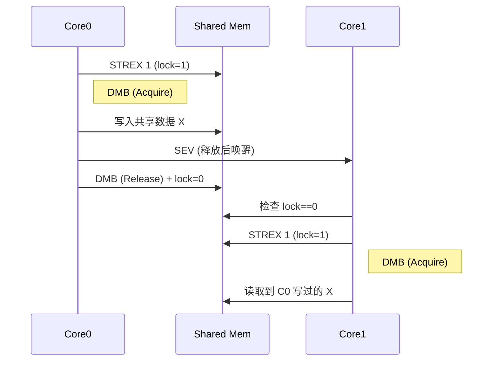

> TL;DR：自旋锁=极短临界区的多核同步原语。AUTOSAR OS 提供 `GetSpinlock/TryToGetSpinlock/ReleaseSpinlock`，底层通常用 ARM 的 `LDREX/STREX + DMB + WFE/SEV` 实现。关键是**内存序**（Acquire/Release）、**内存属性**（Shareable/Non-cacheable）、**避免在临界区做慢操作**、以及**不要在 ISR 中随意拿锁**。

## 1. 为什么在 AUTOSAR OS 中需要 Spinlock？

在多核（MCU/MPU/SoC）上，来自不同核（Core）的任务/ISR 需要对共享数据结构做原子更新。常见方案：

* 关本地中断：只能屏蔽**本核**，对**跨核并发**无效；
* 资源（Resource，带天花板优先级）：主要面向**同核调度**的优先级反转问题；
* **Spinlock**：通过**忙等**配合**原子指令**实现**跨核短临界区**的互斥。

> 适用场景：锁内仅做**极短**、**不可阻塞**的读改写（如环形队列头尾指针调整、轻量统计计数、跨核标志翻转）；不适合 IO、等待、复杂算法等慢操作。

## 2. AUTOSAR OS 的标准 API 语义

典型接口（不同版本/供应商命名细节略有差异）：

| API                                                                     | 语义                   | 返回     | 典型错误                                                      |
| ----------------------------------------------------------------------- | -------------------- | ------ | --------------------------------------------------------- |
| `StatusType GetSpinlock(SpinlockIdType id)`                             | 阻塞式获取自旋锁（忙等直到成功）     | `E_OK` | `E_OS_ID`（非法 id），`E_OS_ACCESS`（权限），`E_OS_NOFUNC`（非多核/未启用） |
| `StatusType TryToGetSpinlock(SpinlockIdType id, TryToGetType* success)` | 非阻塞尝试，`*success`=0/1 | `E_OK` | 同上                                                        |
| `StatusType ReleaseSpinlock(SpinlockIdType id)`                         | 释放自旋锁                | `E_OK` | `E_OS_STATE`（未持有即释放）                                      |

**语义要点**

* **可重入/嵌套**与**顺序约束**：标准通常要求在配置中定义可嵌套关系或锁顺序（避免死锁）。工程上建议**静态约定全局锁序**（L1→L2→…）。
* **上下文限制**：多数实现**不建议**在 ISR 内拿锁；若供应商允许 ISR2 使用，仍须保证锁内不调用会阻塞/调度的服务（例如事件等待、资源获取等）。
* **内存序**：`GetSpinlock` 提供 **Acquire** 语义，`ReleaseSpinlock` 提供 **Release** 语义（见 §4）。

## 3. 底层原理：ARM `LDREX/STREX` + 屏障 + 轻睡唤醒

在 ARMv7‑M（如 Cortex‑M7）上，自旋锁常用以下机制实现：

* **LDREX**（Load‑Exclusive）：读取地址并在本核建立“独占保留（reservation）”；
* **STREX**（Store‑Exclusive）：若保留仍有效且期间无人写过该地址，则写入成功并返回 0，否则失败（返回非 0）；
* **DMB**（Data Memory Barrier）：内存屏障，建立 Acquire/Release；
* **CLREX**：显式清保留；
* **WFE/SEV**：等待事件/发送事件，降低繁忙轮询带来的总线风暴与功耗。

> **独占保留粒度（ERG）**是实现相关的。不要把多个原子变量塞在同一小片相邻内存里；锁变量**自然对齐**，尽量与“热写数据”分离，避免伪共享。

### 3.1 伪代码

```c
static inline void spin_lock(volatile uint32_t *lock) {
    for (;;) {
        if (__LDREXW(lock) == 0) {
            if (__STREXW(1, lock) == 0) { // 0→1 成功
                __DMB();                  // Acquire：禁止临界区访问越过
                return;
            }
        }
        __CLREX();
        while (*lock) {                   // 轻睡等待
            __WFE();
        }
    }
}

static inline void spin_unlock(volatile uint32_t *lock) {
    __DMB();                              // Release：确保写入对外可见
    *lock = 0;
    __SEV();                              // 唤醒在 WFE 的竞争者
}
```

### 3.2 汇编视角（ARMv7‑M 风格）

```asm
// r0 = &lock
spin_lock:
1:  ldrex   r1, [r0]
    cmp     r1, #0
    bne     2f
    movs    r1, #1
    strex   r2, r1, [r0]
    cmp     r2, #0
    bne     1b
    dmb
    bx      lr
2:  clrex
3:  wfe
    ldr     r1, [r0]
    cmp     r1, #0
    bne     3b
    b       1b

// 解锁：r0 = &lock
spin_unlock:
    dmb
    movs    r1, #0
    str     r1, [r0]
    sev
    bx      lr
```

> 在 ARMv8‑A 上可使用 `LDAXR/STLXR` 直接带 Acquire/Release 语义；M 系列通常用 `DMB` 搭配 `LDREX/STREX`。

## 4. 内存模型：Acquire/Release 到底保证了什么？

* **Acquire（加锁后屏障）**：禁止编译器/CPU把临界区内的**读写**移动到加锁之前；
* **Release（解锁前屏障）**：确保临界区内的**写入**在清锁位前对外可见；
* **效果**：其他核在拿到锁后，必定能看到前任持有者在临界区内做过的所有写入。

> 若不加屏障，编译器/CPU 可能重排内存访问，造成“写已发生但对方看不见”的可见性问题。

## 5. AUTOSAR OS 与工程化注意事项（以 S32G M 核为例）

1. **内存属性**：多核 MCU 往往**没有硬件缓存一致性**。把 OS 内部锁与你自定义的跨核锁放在**Shareable + Non‑cacheable** 的区段，或使用供应商推荐的共享 SRAM/TCM；若必须缓存，务必配合**显式 cache 维护**（清/失效）。
2. **对齐与布局**：锁变量 4/8 字节对齐；避免与频繁写的变量同 cache line，减少伪共享导致的冲突与保留失效。
3. **中断上下文**：大多数场景**不要在 ISR 里拿自旋锁**。若确实需要（并且实现允许），要保证：

   * 锁内**不调用**会触发调度/阻塞的 OS 服务；
   * 临界区**极短**；
   * 谨慎处理与线程上下文的共享锁，避免死锁（线程持锁→ISR 再抢锁）。
4. **锁序（Lock Ordering）**：项目层面静态规定全局锁序，禁止循环依赖；必要时用静态分析脚本检查锁获取路径。
5. **退避与公平性**：在高竞争下可加入**指数退避**或改用**Ticket Lock** 提高公平性（代价是增加延迟）。
6. **API 组合**：

   * 跨核数据结构（MPSC 队列/环形缓冲）→ 用自旋锁保护索引；
   * 同核极短更新 → 有时**关本地中断**更轻；
   * 长操作/需等待 → 不要持有自旋锁，改用事件、消息、RTE 缓冲等。

## 6. Ticket Lock（公平队列锁）示例

```c
typedef struct {
    volatile uint32_t next;   // 分配票号
    volatile uint32_t owner;  // 当前服务号
} ticketlock_t;

static inline void ticket_lock(ticketlock_t *lk) {
    uint32_t my;
    for (;;) { // 原子 fetch-add
        uint32_t old = __LDREXW(&lk->next);
        my = old + 1;
        if (__STREXW(my, &lk->next) == 0) break;
    }
    while (__LDREXW(&lk->owner) != my) { // 轮到自己
        __CLREX();
        __WFE();
    }
    __CLREX();
    __DMB(); // Acquire
}

static inline void ticket_unlock(ticketlock_t *lk) {
    __DMB();   // Release
    lk->owner++;
    __SEV();
}
```

> Ticket Lock 在高竞争下更公平，适合“很多核都来抢同一把锁”的场景；在低竞争/单核下不一定更快。

## 7. AUTOSAR OS 配置面（DaVinci / EB tresos）

* **启用多核与 Spinlock**：在 OS 配置中打开 multicore 支持，并创建/声明需要的 `Spinlock` 条目；
* **上下文约束**：按供应商文档设置“可从哪些上下文调用”（Task、ISR2、Hook 等）；
* **锁序/嵌套**：若工具支持，配置锁的层级或顺序；
* **内存段属性**：将 OS 内部自旋锁与可能导出的锁控制块放入共享、可被各核访问的段；
* **代码生成**：生成后的 `Os_Spinlock.c/.h`（名称依供应商不同）包含锁表与运行时检查。

## 8. 反模式（务必避免）

* 在自旋锁内做**耗时操作**：打印、外设 IO、延时、复杂运算；
* 拿着自旋锁去**申请资源/等待事件/触发调度**；
* **未定义锁序**的嵌套获取；
* 锁变量放在**不可共享/缓存却不做维护**的内存；
* 在 ISR 与线程间**共用**同一把锁而无设计保障。

## 9. 设计清单（Check List）

* [ ] 明确跨核共享数据结构与访问路径；
* [ ] 锁粒度与临界区**尽可能小**；
* [ ] 定义**全局锁序**与使用规范（编码规约+代码审查+静态检查）；
* [ ] 配置**Shareable/Non‑cacheable** 或缓存维护策略；
* [ ] 在关键路径加入**`DMB` 屏障**（若自己实现锁）；
* [ ] 高竞争场景考虑 **WFE/SEV/退避/Ticket Lock**；
* [ ] 为异常路径（`TryToGet` 失败）设计**无锁旁路**或**降级策略**。

## 10. 可视化：拿锁/释放的因果关系



## 11. 小结

* AUTOSAR OS 的自旋锁是**跨核极短临界区**的互斥手段；
* ARM 上依赖 `LDREX/STREX` 与 `DMB` 等指令建立**原子性与内存序**；
* 工程实践中，**内存属性**、**上下文限制**、**锁序**、**退避策略**决定系统稳定性与性能；
* 不要把自旋锁当“通用互斥体”，它只适合**短、快、无阻塞**的关键路径。

---

### 附：调试与验证建议

* 用 **ETM Trace/Function Runtime** 观察临界区长度与争用；
* 用 **统计计数器**（成功/失败的 `STREX` 次数、WFE 次数）评估竞争强度；
* 人为注入轻微延迟（`nop` 或短循环）检验死锁与锁序问题；
* 在仿真/板端分别验证：不同编译优化级别、不同内存映射（cache on/off）。
