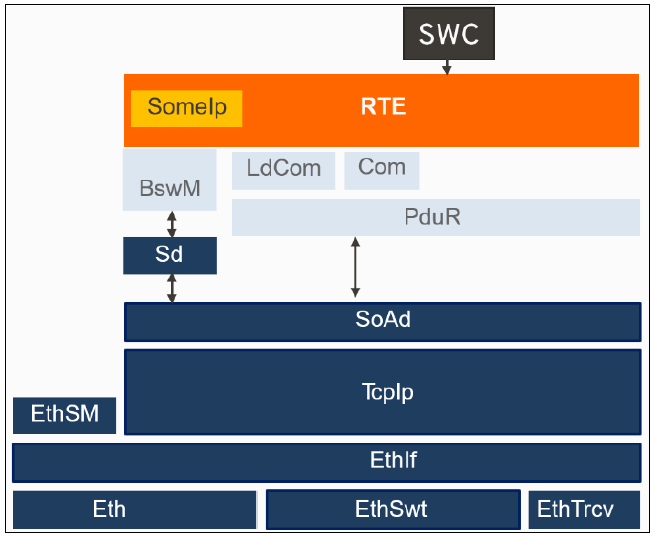
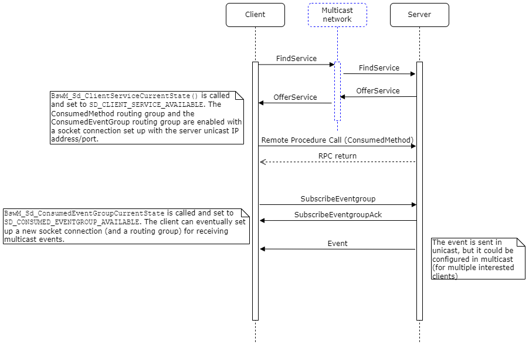

## **1. 服务发现简介**

AUTOSAR 的**服务发现**（Service Discovery，简称 SD）是 AUTOSAR SOME/IP 通信中用于在**运行时**动态发现和管理服务的机制。传统 AUTOSAR 基于**信号**的通信通常在编译时静态绑定，而服务发现使**服务端**（提供者）和**客户端**（使用者）能够在运行时相互找到对方，从而支持更加灵活的**面向服务架构**（SOA）。服务发现通过在网络上广播/组播特定报文，让各 ECU 在上线时自动发布（Offer）自身提供的服务、查找（Find）所需的服务，并动态建立通信连接。

&#x20;*AUTOSAR 服务发现在架构中的位置（Sd 模块位于左侧，邻接 BswM 和 SoAd 等基础软件模块）*

**SOME/IP-SD 协议：**AUTOSAR Service Discovery 基于**SOME/IP Service Discovery (SOME/IP-SD)**协议实现。SOME/IP-SD 使用 UDP 协议在**组播地址**（通常是 224.224.224.245）上的**固定端口**（30490）进行通信，所有 ECU 都加入该组播地址以收发 SD 消息。通过组播机制，**客户端**可以发送查找请求（FindService），**服务端**则周期性广播提供通知（OfferService）。双方还可通过该协议完成**事件组**订阅（SubscribeEventgroup）和取消，以及服务下线通知（StopOfferService）等。SOME/IP-SD 定义了一系列**消息类型**和**选项字段**，用于描述服务的标识、网络端点以及事件组等信息（后续章节详述）。这种机制确保当某个服务实例在网络中变得可用或不可用时，所有感兴趣的节点都能及时获知变化，从而动态建立或断开通信。

**服务与实例：**在 Service Discovery 中，每个服务通过**服务 ID**和**实例 ID**进行唯一标识。服务 ID 通常由系统架构师分配，是一个16位的整数；实例 ID 用于区分同一服务的不同实例（16位），如果需要广播查找所有实例，可使用保留值 0xFFFF 表示“任意实例”。此外，服务还具有**版本号**（Major/Minor Version），用于匹配客户端-服务端接口的版本兼容性。服务发现消息中会包含这些标识信息以及**生存时间 TTL**等字段，用于指示服务信息的有效期限。总之，AUTOSAR 服务发现协议提供了一种标准化方式，让 ECU 在未知拓扑的网络中能够自动发现并连接所需的服务，实现真正的**解耦合**和**动态服务配置**。

## **2. 服务及服务实例**

AUTOSAR 中的**服务**通常由应用软件组件（SWC）通过**服务接口**（Service Interface）来定义。例如，一个诊断服务、定位服务等都可以作为可提供给其他组件使用的服务接口。Service Discovery 要求每个服务在系统中拥有明确的标识，主要由**Service ID**和**Instance ID**组成：

* Service ID（服务 ID）：用于标识服务的类型或类别，是一个16位整数。在一个汽车电子系统内，每种服务接口应分配唯一的 Service ID。例如，动力系统中的某 ECU 提供发动机状态服务，可分配 Service ID = `0x1234`。Service ID 通常在全车范围内是唯一的，确保不会混淆不同服务。在 SOME/IP-SD 消息中，Service ID 字段用于指示当前报文涉及哪个服务（对于 SD 自身的控制消息，该字段固定为0xFFFF）。

* **Instance ID（实例 ID）：**用于区分同一 Service ID 下的不同服务提供者实例，也是16位整数。例如，如果车上有两个 ECU 都提供 Service ID = 0x1234 的服务，可为它们分配不同的 Instance ID（如1和2）。这样客户端可以发现特定实例或者同时发现所有实例。注意，SOME/IP-SD 支持通过在查找消息中将 Instance ID 设为 0xFFFF 来表示查找任意实例。**但在配置中，每个服务提供者必须使用一个确定的实例 ID**，不能为0xFFFF。实例 ID 在某些情况下也可用于**负载分担**或**冗余**（例如多个实例提供同类服务）。

* Major/Minor Version（主/次版本号）：用于表示服务接口版本以保证兼容性。Major Version 不同通常表示接口不兼容；Minor Version 不同一般是向后兼容的小改动。在 SD 配置中，需要为服务指定主版本和次版本。**客户端**通常固定匹配主版本，次版本可以配置为0xFFFF FFFF（或0xFFFFFFFF）表示接受任意次版本。**服务端**发布时会携带自己的主次版本，客户端只有在Major版本匹配且Minor版本满足要求时才认为服务兼容。

* 服务接口名称：Service ID/Instance ID 是机器可读的标识，而服务接口本身在人可读层面有一个名称（例如 "EngineStatusService"）。这个名称在 SWC 和接口定义中使用，但在运行时通信中不直接出现。不过一些配置工具可能会利用服务接口名称派生 Service ID 或作为参考。**标准文档**没有强制规定 Service ID 和接口名称的对应关系，这通常由项目约定或工具自动生成。

为了**在配置中引用服务**，AUTOSAR 服务发现模块要求**每个服务实例（无论服务端还是客户端）都有一个 ECU 内唯一的句柄 ID**（Handle Id）。后续配置会涉及 SdServerServiceHandleId 或 SdClientServiceHandleId，用于在 BswM 等模块中引用特定的服务实例。

综上，Service Discovery 中的服务由**Service ID + Instance ID + Version**唯一确定；配置中还需为其指定**Handle ID**以便软件引用。理解这些标识对于正确配置 SD 至关重要。在实际应用中，系统架构师需要提前分配 Service ID 范围，并确保 ECU 间一致使用相同的 ID 来表示对应的服务接口，否则服务发现将无法匹配客户端和服务端。

## **3. 软件组件 (SWC) 与服务接口**

**软件组件（SWC）**是 AUTOSAR 应用层封装功能的基本单元。SWC 通过**提供端口（Provide Port）**和**需要端口（Require Port）**来暴露或使用服务接口。当一个 SWC 提供某接口实现时，我们称之为**服务提供者**；对应地，使用该接口的 SWC 是**服务使用者**。服务发现机制主要作用于**分布式场景**：提供者和使用者可能位于不同 ECU 上，需要通过 SOME/IP 通信。

在开发阶段，软件架构上通常会定义服务接口以及 SWC 的提供/需要端口连接关系。然而，在**经典平台**中，如果提供者和使用者不在同一 ECU，则需要**RTE 动态绑定**和 SD 在运行时去完成实际的连接。这里需要澄清几个概念：

* **RTE 与服务绑定：**在生成 RTE 时，如果发现某需要端口连接到一个可能在运行时才能确定的提供者（比如不同ECU提供），RTE 会为该端口生成**代理代码**。这个代理通过 SOME/IP 或其他通信方式调用远程服务。RTE 本身并不主动进行服务发现，但 RTE 提供的代理需要等待底层通信层准备好目标地址才能正常调用服务。如果服务未发现，RTE 调用远程服务时可能会返回错误（如 `RTE_E_UNCONNECTED`）或无效值，以表示当前没有可用的服务提供者。

* **SWC 初始化与服务提供注册：**对于服务提供者 SWC，当它初始化完毕并准备好提供服务时，通常需要通知系统**服务已可用**。SWC 本身无法直接操作 SD 模块，但可以通过**Mode Switch 接口**或**RTE API**与 BswM 交互（后述）来改变服务状态。例如，SWC 可以切换一个 Mode Port，触发 BswM 将对应服务标记为AVAILABLE，从而使 SD 开始广播 OfferService。因此，SWC **不直接调用** Service Discovery 模块接口，而是通过 RTE/BswM **间接控制**服务发布。

* **服务使用者 SWC 等待服务：**使用者 SWC 在调用需要端口（比如请求远程服务或等待事件）时，需要某种机制判断服务是否已连接。AUTOSAR 提供了**客户端服务的模式状态**给 BswM，当 SD 找到服务并建立连接后，BswM 可以通知 SWC（通过 Mode Port）服务已就绪。SWC 也可以周期性调用 RTE 提供的状态检查函数（如 `Rte_Call_GetCurrentState()`）来查询服务状态。如果服务未找到就发起调用，RTE 会立即返回错误而不会阻塞等待。因此，SWC 实现应能处理服务暂不可用的情况。例如，可在收到服务可用通知前缓冲请求，或在调用返回未连接错误时采取重试/报错策略。

* **RTE 对多实例服务的支持：**如果存在同一服务接口有多个提供者实例（不同 Instance ID），RTE 层面可以配置为**显式绑定**或**隐式**（某种负载分配策略）。经典平台并没有自动负载均衡机制，通常需要在系统设计阶段决定一个需要端口连接哪个提供者（比如通过配置 Instance ID 匹配）。Service Discovery 可以同时发现多个服务实例，但 RTE 代理一般只会绑定其中一个（通常第一个出现或配置指定的）。高级用法可能需要应用层根据情况选择实例，这需要结合 BswM 模式机制或自定义逻辑实现。

总之，SWC 与服务接口是 Service Discovery 的应用源头和目标，但 SWC 本身不直接参与发现协议。**服务提供者 SWC**通过 RTE/BswM 通知 SD 模块其上线/下线；**服务使用者 SWC**通过 RTE/BswM 获知服务是否已找到，并使用 RTE 提供的通信代理与远程服务交互。理解 SWC-RTE-SD 之间的职责划分有助于避免误解（例如，误以为 SWC 需要显式调用发现功能，其实这些细节均由基础软件自动处理）。

## **4. RTE 与服务通信路径**

为了更好地理解 Service Discovery 的作用，有必要梳理**服务通信的数据路径**以及 RTE 在其中的角色。总体来说，RTE（运行时环境）在 AUTOSAR 架构中扮演**沟通软件组件和基础软件**的中介。当 SWC 调用一个需要端口（客户端调用）或发出一个事件，RTE 将此请求下传给通信栈；当基础软件收到远程服务的响应或事件通知时，RTE 再将其上报给 SWC：

* **客户端调用服务的方法：**当 SWC 调用一个远程服务的方法（Provided Interface 的某个Server Callable），RTE 捕获此调用并不会直接调用另一个本地函数，而是打包成网络消息。从实现上，RTE 可能调用**COM**或 **PDUR** 层的发送 API，将该请求作为**SOME/IP 消息**发送出去。在发送前，如果服务尚未发现，RTE 通常会返回错误码立即结束调用流程；如果服务已发现且通信套接字已建立（例如对于 TCP，需要已经连接），RTE 则将请求发送至基础软件继续处理。对于有返回值的方法，RTE 可能阻塞等待响应消息回来，再将结果返回给调用的 SWC，否则（如 fire & forget 的方法）则直接返回无返回值。

* **服务端接收并响应方法：**服务提供者 SWC 的提供接口实现被调用时，就和普通的本地函数一样。但在远程通信场景下，这个调用由**RTE 被动接收**。当远程客户端发送方法请求消息过来，经由 SoAd/PduR -> COM 等传递到 RTE，RTE 会调用对应 SWC 提供接口的实现函数，然后将返回值通过相同路径发回给客户端。如果提供者 SWC 尚未准备就绪或选择不响应，RTE 可能返回一个错误响应或空回应。**需要强调**，RTE 不决定何时提供者上线，它只是根据基础软件通知来决定能否进行远程调用。

* **事件（Event）通信：**服务接口中的**事件**通常由服务端 SWC 触发发送（类似发布/订阅模式），客户端 SWC 订阅接收。服务端 SWC 调用 RTE API（如 `Rte_Send_EventName`）发出事件后，RTE 将该事件传递给通信栈，由 SOME/IP 协议作为**通知消息**发送给所有已订阅的客户端。这个过程中，RTE 并不知道哪些客户端订阅，它只是把事件交给通信层（Com/PduR），由底层根据订阅情况发送零次、一次或多次。客户端一侧，基础软件接收到事件通知，会通过 RTE 调用相应 SWC 的接收接口（通常是一个**通知函数**或将数据写入一个 RTE 提供的缓冲区，然后触发一个 Rte\_Receive 调用）。值得注意的是，如果**没有客户端订阅**某事件，SD 模块会让通信层**禁用该事件的发送路径**，这样服务端 SWC 即使调用了事件发送，消息也不会真正上网，RTE 可能并不感知这点，只是底层丢弃了消息（或者 RTE 直接检查到未有订阅而略过发送，取决于实现）。这种机制优化了带宽，但要求 Service Discovery 准确控制事件路由的开/关。

* **服务发现消息处理：**SD 自己的通信（Find/Offer等）并不经过 RTE，而是在**SD 模块内部**形成 PDUs 通过 PduR/SoAd 发送和接收。但SD的**结果**会体现在 RTE 层对SWC的行为上，例如当服务找到时，前述 RTE 代理可正常通信，否则返回未连接错误。因此，可以认为 RTE 间接感知 SD 状态（通过基础软件提供的状态）。另外，RTE 并不会直接把 SD 发现的IP地址等告诉SWC，因为SWC通常不需要关心，只需要知道服务有没有可用。

概括来说，RTE 是 SWC 与远程通信栈之间的桥梁，它屏蔽了 SD 发现过程的细节。RTE 将 SWC 的服务调用/事件转换为网络消息，通过基础软件发送出去；同时将基础软件收到的远程消息转换为对SWC的接口调用或数据通知。**Service Discovery**模块的运行确保了当RTE试图发送一个远程消息时，底层已经准备好了正确的目标地址/端口（通过 SoAd 配置更新），以及当没有可用服务时避免浪费传输资源。理解这一数据路径有助于正确配置各模块，使得服务发现与RTE的衔接流畅无误。

## **5. Service Discovery 模块配置概览**

AUTOSAR 将服务发现作为一个独立的基础软件模块（通常简称 **Sd**）。其配置包含在 ECU 配置（ECUC）中，以容器（Container）的形式定义各项参数。理解 SD 模块配置的整体结构，有助于在后续章节中对具体配置项进行定位和设置。总体而言，Service Discovery 的配置可以分为以下几个部分：

* **Sd Instance（SD 实例）：**由于一辆车可能有多个独立的以太网网络（虚拟或物理），AUTOSAR 允许配置多个 SD 模块实例，每个实例对应一组网络接口。每个 Sd Instance 通常对应一个特定的网络 Channel，例如一个以太网子网。有些配置参数（如 TTL、套接字等）可以在实例级别设置。每个 Sd Instance 下又划分为**服务器服务**和**客户端服务**配置列表等。典型工具中，会有一个Sd实例容器包含下面介绍的各项。

* **SdServerService（服务端服务）列表：**即本 ECU 上**提供**哪些服务。每个提供的服务实例在配置中作为一个 SdServerServiceInstance 容器，内含该服务的标识、参数以及关联的事件等配置。比如，你的ECU提供了一个 DiagnosticService，则会有一个SdServerServiceInstance条目表示它。

* **SdClientService（客户端服务）列表：**即本 ECU 上**需要**哪些远程服务。每个所需服务在配置中是一个 SdClientServiceInstance 容器，包含客户端期望发现的服务标识、以及订阅事件等的配置。如果ECU需要使用某Diagnostics服务，则会有对应SdClientServiceInstance条目。

* **SdEventHandler / SdConsumedEventGroup：**这是**事件组**相关配置。对于服务端，每个服务可能有若干 EventGroup 需要发布（SdEventHandler），对于客户端，每个服务可能订阅若干 EventGroup（SdConsumedEventGroup）。这些在配置上通常作为SdServerServiceInstance或SdClientServiceInstance的子容器出现。事件组配置详细包括事件组ID、路由配置等（详见后续章节）。

* SdTimer（定时器）设置：服务发现协议涉及一系列周期定时和超时，配置上以 SdServerTimer 和 SdClientTimer 容器体现，用于定义服务端和客户端的报文发送周期、重试次数、初始延迟、TTL等时间参数。定时器配置通常可以被多个服务实例复用，所以它们在Sd配置中通常独立列出，然后通过引用（Reference）关联到各个服务。

* **网络与通信绑定：**SD 配置需要与其他通信模块配置关联，包括**SoAd**（Socket Adapter）和**PduR**（PDU Router）。具体来说，需要配置 SD 使用的**组播地址、端口**，以及各服务通信所用的**套接字连接**和**路由组**等。在Sd配置中，这体现为对 SoAd SocketConnection 或 SocketConnectionGroup 的引用，以及 RoutingGroup ID 等参数。通过这些引用，SD 模块才能知道应该通过哪个套接字发送 OfferService，以及在发现服务时如何建立通信连接。网络配置的细节将在后续章节讨论。

* BswM 集成：BswM（Basic Software Mode Manager）是模式管理模块，用于协调各模块行为。SD 配置需要告知 BswM 可控的服务和事件组状态。例如，BswM 可以调用Sd提供的API使某服务停止或开始提供。同样Sd也会在服务状态变化时通知BswM。虽然BswM的配置不直接在Sd模块下，但Sd的配置（如HandleId）会在BswM配置中被引用。本指南后续章节也会涉及如何配置BswM与SD协同工作。

总的来说，Service Discovery 模块配置牵涉**自身参数**（服务列表、事件组、定时等）以及**跨模块引用**（SoAd套接字、PduR路由、BswM句柄等）。在实践中，建议按照以下顺序规划和实施配置：先明确服务接口及其Service ID/Instance ID -> 决定哪些ECU提供/需要该服务（确定SdServerService和SdClientService条目）-> 为每个服务规划事件组和通信方式（UDP/TCP，多播/单播）-> 配置SoAd和PduR支持所需的通信路由 -> 设置Sd的定时参数以满足性能要求 -> 配置BswM逻辑控制服务的启停。下面章节将按这种逻辑顺序，详细介绍每一部分的配置项。

## **6. 服务提供者配置（SdServerService）**

**服务提供者**是指本 ECU 上提供某项服务的实体。在 SD 配置中，需要为每个服务提供者实例添加一个 **SdServerServiceInstance** 容器条目，用来描述该服务在本 ECU 上如何发布。主要配置项如下：

* SdServerServiceHandleId：服务端服务实例句柄ID，整型值，**在本 ECU 内必须唯一**。BswM 等模块通过此ID引用该服务实例，例如调用 `Sd_ServerServiceSetState(HandleId, 状态)` 控制服务提供启停。通常从0开始为各SdServerService分配。

* SdServerServiceID：服务 ID，即服务的标识符，应与服务接口设计所规定的ID一致（16位数）。例如 `0x1234`。客户端只有在其SdClientService配置了相同ServiceID时，才能匹配发现。

* SdServerServiceInstanceID：服务实例 ID，用于区分同类服务的不同实例（16位）。应确保在同一Service ID下，各服务提供者实例ID不同。典型地，如果每个ECU至多提供该服务一次，则InstanceID可固定例如`1`。**不要使用0xFFFF**作为实例ID（0xFFFF仅用于FindService广播匹配）。

* SdServerServiceMajorVersion / MinorVersion：服务主版本和次版本号。必须与提供的服务接口版本相对应（通常在服务接口ARXML定义中会注明版本）。MajorVersion 不匹配则客户端不会认作同一服务；MinorVersion 则视客户端配置而定是否严格匹配或接受任意。在配置中填入具体的版本号整数。

* **SdServerServiceAutoAvailable：**布尔值，表示服务是否**自动可用**。若为 `true`，则在系统初始化时SD模块会立即将该服务状态设为 AVAILABLE 并开始发布 OfferService；若为 `false`，则服务初始状态为 DOWN，只有当 BswM 或其他管理机制调用 `Sd_ServerServiceSetState(..., AVAILABLE)` 后才开始发布。AutoAvailable通常用于决定服务**上电后**是立即广播可用，还是等应用准备好后再手动开启。

* SdServerServiceTimerRef：引用一个 **SdServerTimer** 定时器容器，定义该服务发布 OfferService 周期和TTL等参数。多个服务可以引用同一个 SdServerTimer 配置，表示它们采用相同的定时策略。如果需要特别的广播频率或初始延迟，可为该服务单独创建一个 SdServerTimer 条目。TimerRef **是必填**，没有它服务无法正常调度广播。

* SdServerServiceUdpRef / TcpRef：**引用一个**SoAd SocketConnection (Group)配置，用于指定服务通信所使用的传输层资源。根据服务通信需求，可配置 UDP 或 TCP：

  * 如果服务通过 **UDP** 提供（常用于广播性质的事件或无连接通信），则设置 SdServerServiceUdpRef，引用对应 SoAd 的 UDP SocketConnectionGroup。这个 SoAd 配置里定义了本地端口（服务数据通信端口）等参数。SD 会在 OfferService 消息的**选项字段**中包含该 UDP端口的信息，让客户端知道如何与服务通信。
  * 如果服务通过 **TCP** 提供（常用于需要可靠传输的方法调用），则设置 SdServerServiceTcpRef，引用 SoAd 的 TCP SocketConnectionGroup（服务端socket监听配置）。SD 在 OfferService 中提供该TCP服务端的IP和端口。客户端收到后即可尝试建立TCP连接。
  * **可以同时配置 UDP 和 TCP**：某些服务可能既含有需可靠传输的方法（TCP）又含有周期广播事件（UDP）。在此情况下，可同时填写两个引用。SD OfferService 消息将带有两个选项，分别告知客户端 TCP和UDP的端口信息，客户端可据此选择通信方式或两者并用。

* **SdServerServiceCapabilityRecords：**（可选）服务能力记录，用于携带键值对形式的附加服务信息。配置上可以列出若干 `SdServerServiceCapabilityRecord` 子项，每项包含一个 Key 和 Value 字符串。在 OfferService 消息中，这些记录将作为配置选项发送，客户端收到后可用作附加信息（例如某服务的某些功能标志）。如果不需要附加数据，此容器可以留空。

一个简单的服务提供者配置示例如下：

```xml
<SdServerServiceInstance>
  <ShortName>MyService_Server</ShortName>
  <SdServerServiceHandleId>0</SdServerServiceHandleId>
  <SdServerServiceID>0x1234</SdServerServiceID>
  <SdServerServiceInstanceID>1</SdServerServiceInstanceID>
  <SdServerServiceMajorVersion>1</SdServerServiceMajorVersion>
  <SdServerServiceMinorVersion>0</SdServerServiceMinorVersion>
  <SdServerServiceAutoAvailable>true</SdServerServiceAutoAvailable>
  <SdServerServiceTimerRef dest="SdServerTimer">/Sd/SdConfig/SdServerTimer_20ms</SdServerServiceTimerRef>
  <SdServerServiceUdpRef dest="SoAdSocketConnectionGroup">/Eth/SoAd/SocketConnectionGroup_Svc1234_UDP</SdServerServiceUdpRef>
  <SdServerServiceTcpRef dest="SoAdSocketConnectionGroup">/Eth/SoAd/SocketConnectionGroup_Svc1234_TCP</SdServerServiceTcpRef>
  ...
</SdServerServiceInstance>
```

上述示例定义了一个提供 Service ID `0x1234` 的服务，Instance ID 为1，版本1.0，上电自动提供。它引用了一个名为 “SdServerTimer\_20ms” 的定时器配置，以及两个 SoAd SocketConnectionGroup（分别用于 UDP 和 TCP）。省略号处还会包含事件组（SdEventHandler）等子配置，如果该服务有事件，需要在此容器下继续配置，具体在后续章节介绍。

配置服务提供者时需要确保：

1. Service ID/Instance ID 与系统中客户端配置相符；
2. HandleId 全局唯一；
3. TimerRef 指向有效的SdServerTimer；
4. 至少一种传输方式引用有效（UDP/TCP）；
5. 如果服务包含事件，正确添加 SdEventHandler 子容器配置事件组，否则不会发布事件。

完成 SdServerServiceInstance 配置后，该服务提供者在 ECU 初始化时即可由 SD 模块管理：根据 AutoAvailable 决定是否立即发送 OfferService 报文，并在后续周期性广播其存在。在运行过程中，还可以通过 BswM 控制该服务的提供状态（如在某些条件下暂停服务提供）。

## **7. 服务消费者配置（SdClientService）**

**服务消费者**是在本 ECU 上需要使用远程服务的配置。在 SD 中，每个想要发现并使用某服务的情况，都需要添加一个 **SdClientServiceInstance** 容器。它描述本 ECU 期望查找的服务标识以及相应的行为参数。主要配置项包括：

* SdClientServiceHandleId：客户端服务实例句柄ID，整型值，在本 ECU 内唯一。BswM 使用此ID来引用该客户端服务实例，例如调用 `Sd_ClientServiceSetState(HandleId, 状态)` 请求或释放服务。同样地，SD 在服务找到或丢失时也会用此 ID 通知 BswM 当前状态（AVAILABLE/RELEASED）。

* SdClientServiceID：期望查找的服务ID，应与服务提供端的 Service ID 匹配。例如，要使用前述 Service ID 0x1234 的服务，这里也配置 `0x1234`。

* **SdClientServiceInstanceID：**期望的服务实例ID。如果明确知道需要特定实例（比如某ECU的服务），可填入对应ID；如果**不关心实例号或希望连接任意可用实例**，可填写0xFFFF，表示匹配任何实例。典型场景下，一个客户端可能只需任意一个提供者即可满足需求，此时可用0xFFFF通配。但是需要注意，**Classic Platform**中RTE对一个需要端口通常只关联到一个服务提供者，因此即使发现多个实例也通常只会使用其中一个。

* **SdClientServiceMajorVersion / MinorVersion：**期望的服务接口版本。MajorVersion 通常应与服务端的主版本一致（不一致则发现的服务会被忽略）。MinorVersion 则可以视情况而定：若配置为具体值，则要求服务端次版本必须相等才能接受；若配置为0xFFFFFFFF（或0xFFFF FFFF），表示**接受任意次版本**。实践中常用的策略是客户端指定Major版本具体值，Minor版本使用通配，这样可以兼容服务端的次版本升级。

* **SdClientServiceAutoRequired：**布尔值，表示客户端服务是否**自动请求**。如果为 `true`，则在系统初始化时SD模块会将该客户端服务状态设为 REQUESTED，并立即开始发送 FindService 报文寻找服务；如果为 `false`，则初始状态为 RELEASED，需要 BswM 或应用通过接口调用 `Sd_ClientServiceSetState(..., REQUESTED)` 后才会进行查找。AutoRequired通常用于决定**上电后**客户端是否默认立即寻找服务。例如，有些诊断功能可能并非每次上电都需要，可设为false，仅在需要时才查找。

* SdClientServiceTimerRef：引用一个 **SdClientTimer** 定时器容器，定义该客户端查找服务的定时参数，包括发送 FindService 周期、初始重试次数、TTL 等。和服务端类似，多个客户端服务可以共用同一个 SdClientTimer 配置。如果某服务查找需要不同的频率或超时，可单独创建 Timer 条目。TimerRef 必填，否则 SD 无法执行查找调度。

* SdClientServiceUdpRef / TcpRef：引用 SoAd 定义的 SocketConnection(Group)，用于客户端与服务端建立数据通信的资源。根据服务可能的通信方式，需要配置以下内容：

  * 如果期望**使用 TCP**连接服务（通常服务端配置了 SdServerServiceTcpRef），则 SdClientServiceTcpRef 应指向一个 SoAd SocketConnectionGroup 配置，用于客户端主动建立 TCP 连接。SoAd 该配置会包含**本地TCP端口、远程IP**等信息模板。客户端在收到服务Offer（其中包含服务端TCP端点）后，会利用SdClientServiceTcpRef找到对应SoAd配置并**建立与服务端的TCP连接**。之后，通过该连接进行RPC通信。
  * 如果期望**使用 UDP**与服务通信（服务端提供UDP），则 SdClientServiceUdpRef 指向 SoAd SocketConnectionGroup 配置，用于UDP通信。UDP属于无连接，但该引用仍需提供必要的本地端口配置。客户端收到Offer（包含服务端UDP端口）后，会通过SdClientServiceUdpRef找到SoAd配置，将服务端的IP和端口更新进对应的 Socket Connection 条目，从而准备好后续的数据报发送/接收。
  * 实际使用中，如果服务端同时提供了TCP和UDP选项，客户端可以同时配置两者引用。SD模块会根据Offer中提供的选项分别处理：对TCPRef，尝试建立连接；对UDPRef，更新目标地址用于发送UDP。**只有在服务被标记为REQUESTED状态**且网络就绪时，这些连接行为才发生，否则客户端即使收到Offer也不会建立连接（例如SdClientServiceAutoRequired=false且未请求）。

* **SdConsumedMethods（已消费方法）：**（可选）如果服务接口包含**方法调用**，SdClientService下可以有 SdConsumedMethod 的子配置项。这通常用于配合一些特殊路由配置（ConsumedMethodActivationRef 等）来使客户端能够进行 RPC。多数情况下，这部分可以由工具默认处理，无需手工配置。但如果需要精细控制，比如对某些方法流量单独路由，可能涉及此配置。

* **SdClientServiceCapabilityRecords：**（可选）客户端也可以配置Capability期望，用于**过滤**服务。一般不常用——服务端发送Capability后，客户端通常接受所有值或基于需要在应用层处理，Sd模块本身并不会根据Capability值筛选服务。因此SdClientServiceCapabilityRecord更多是用于当客户端需要在Offer中读取某些key-value信息，这部分不需要在Sd配置中过多配置，只需确保与服务端的Capability Key匹配即可。

配置一个服务消费者示例如下：

```xml
<SdClientServiceInstance>
  <ShortName>MyService_Client</ShortName>
  <SdClientServiceHandleId>0</SdClientServiceHandleId>
  <SdClientServiceID>0x1234</SdClientServiceID>
  <SdClientServiceInstanceID>0xFFFF</SdClientServiceInstanceID>  <!-- 接受任意实例 -->
  <SdClientServiceMajorVersion>1</SdClientServiceMajorVersion>
  <SdClientServiceMinorVersion>0xFFFFFFFF</SdClientServiceMinorVersion> <!-- 接受任意次版本 -->
  <SdClientServiceAutoRequired>false</SdClientServiceAutoRequired>
  <SdClientServiceTimerRef dest="SdClientTimer">/Sd/SdConfig/SdClientTimer_Default</SdClientServiceTimerRef>
  <SdClientServiceUdpRef dest="SoAdSocketConnectionGroup">/Eth/SoAd/SocketConnectionGroup_Svc1234_UDP_Client</SdClientServiceUdpRef>
  <SdClientServiceTcpRef dest="SoAdSocketConnectionGroup">/Eth/SoAd/SocketConnectionGroup_Svc1234_TCP_Client</SdClientServiceTcpRef>
  ...
</SdClientServiceInstance>
```

这个示例表示客户端想要查找 Service ID 0x1234 的服务，不限定实例（InstanceID=0xFFFF），需要接口主版本1，次版本不限。初始不自动查找（AutoRequired=false）。它引用了一个默认的 SdClientTimer 来控制查找节奏，并提供了UDP和TCP的 SocketConnectionGroup 引用以备后续连接使用。省略号部分后续会包含事件组订阅等子配置。**请注意：**InstanceID=0xFFFF 通配多个实例的场景下，如果车上真的存在多个服务提供者，同一客户端需要有机制选择其中之一使用（AUTOSAR经典平台默认不支持同时绑定多个实例到一个端口）。常见做法是**第一个收到的 OfferService**就被接受，除非失效才切换。必要时，也可通过 BswM 或应用逻辑进行挑选。

配置服务消费者时的要点：

1. Service ID/版本需与目标服务匹配；InstanceID 可用0xFFFF灵活匹配。
2. HandleId 唯一，用于后续控制和状态监控。
3. TimerRef 合理设置以避免过于频繁地Find或错过Offer。
4. 根据服务端通信方式正确填写 UdpRef/TcpRef，并确保 SoAd 已配置相应 Socket。
5. 如果AutoRequired=false，别忘了在合适时机通过BswM/代码调用使能服务查找，否则服务将一直不被查找。

完成 SdClientServiceInstance 配置后，当系统运行并且该客户端服务被请求 (Requested) 时，SD 模块会依据配置发送 FindService 报文寻找服务，并处理接收 OfferService 等。如果找到匹配服务，SD 将建立所需的传输连接 (TCP/UDP)，并通知 BswM 切换客户端服务状态为 AVAILABLE，RTE 代理此时即可正常调用远程服务。反之当服务丢失或停止，SD 将相应释放连接并通知状态变为 RELEASED。

## **8. 事件组发布配置（SdEventHandler）**

在很多服务中，除了请求/响应的方法之外，还存在**事件（Event）**，即由服务端主动发布的通知（典型如定时状态信息、异步报警等）。为了有效控制事件的发布与订阅，Service Discovery 引入了事件组（EventGroup）的概念：服务可以将一个或多个事件信号归类为一个事件组，对外作为一个整体进行订阅控制。这样做可以降低网络上不必要的通信负载——客户端按需订阅感兴趣的事件组，而服务端仅针对有订阅的组发送事件。

在配置上，每个服务端服务（SdServerServiceInstance）下可以包含若干 **SdEventHandler** 子容器，每个对应一个事件组。SdEventHandler 的主要配置项有：

* SdEventHandlerEventGroupId：事件组ID（16位），在该服务内必须唯一，用于标识一个事件组。这个ID将在 SubscribeEventgroup 和 Event 消息中用于标记事件组。通常在定义服务接口时会为事件指定事件组ID，配置时需确保一致。

* SdEventHandlerHandleId：事件组句柄ID，在本 ECU 内唯一。BswM 可通过此ID识别事件组。例如 BswM 可以查询当前有没有客户端订阅（SD\_EVENT\_HANDLER\_REQUESTED/RELEASED）。尽管服务端事件组状态通常随服务状态自动变化（如服务DOWN则事件肯定不发），仍建议配置唯一句柄以满足配置规范要求。

* **SdEventHandlerTimerRef：**引用一个 SdServerTimer 定时器容器，作为该事件组的**定时参数**配置。一般事件组会使用所属服务相同的定时参数，也可以引用不同的SdServerTimer以在**事件订阅确认**和**初始发送**上应用特殊的延迟/频率策略。例如，可以为频繁事件组分配更短的TTL或更少的重发。**务必填写**此引用。

* **SdEventHandlerMulticastThreshold：**多播阈值（整数）。这是一个优化参数：当订阅此事件组的客户端数量达到该阈值时，服务端将**切换到使用多播**方式发送事件；低于阈值则使用单播。典型用法：

  * 如果设为 `0`：表示**始终使用单播**（因为订阅数≥0就触发多播，诡异但根据规则0意味着阈值已满足，所以其实实现为对0取特别含义：所有情况下都用单播）。
  * 如果设为 `1`：表示当至少有1个客户端订阅时即启用多播（即有订阅就多播），=1其实意味着**总是使用多播**发送事件。
  * 如果设为 `>1`：则当订阅客户端数量少于该值时采用单播分别发送给每个客户端，当达到该数量时改用单一多播发送。例如阈值=3：1或2个订阅者时单播发送各自，3个及以上时改为群发多播。

  MulticastThreshold 允许服务在少量订阅时节省带宽（不群发无关节点），在大量订阅时提高效率（一次多播覆盖所有）。若服务事件不支持单播或希望统一采用多播，可将此值设为1。

* 事件传输子配置：每个 SdEventHandler 下根据需要可以配置以下三个子容器，分别对应不同传输渠道：

  * **SdEventHandlerMulticast：**配置事件组**多播发送**的信息。如果希望事件能以多播方式发布（通常与MulticastThreshold配合使用），需要配置此容器。主要包含：

    * SdMulticastEventSoConRef：引用一个 SoAd SocketConnection（注意是单个Connection而非Group），用于事件多播的网络连接。通常这个SoAd Connection会指定一个多播IP地址（可能与服务发现组播相同网段或不一样）和一个UDP端口。服务端将利用它向该组播地址发送事件。客户端订阅时也会加入该组播组。
    * **SdEventActivationRef：**路由激活引用（Routing Group ID）。它是一个数值，引用 PduR/SoAd 配置中的某个**RoutingGroup**（路由组）。Service Discovery 模块会根据订阅情况调用 SoAd\_EnableRouting/DisableRouting 来打开或关闭该 RoutingGroup，从而控制事件的发送。当没有客户端订阅时，SD会禁用路由，事件消息即使产生也不会真正发出；有订阅时启用路由，事件可发送。
    * （无 SdEventTriggeringRef，因为多播一般不针对单一目标，不需要trigger? 实际实现中可能隐含触发与激活用同一ID）
  * **SdEventHandlerUdp：**配置事件组**单播 UDP**发送的信息。如果期望在单播UDP方式传输事件，则配置该容器。主要包含：

    * **SdEventActivationRef：**路由激活ID，用于控制**单播发送**的路由开关。含义类似于上面的激活Ref，但针对单播场景。每有一个客户端订阅，SD可能会针对每个目标设置路由，但为了简化，通常采用一个RoutingGroup ID管理所有单播传输开关（或者一个客户端对应一个ID）。
    * **SdEventTriggeringRef：**路由触发ID，用于**触发事件发送**。当服务端SWC发布事件时，这个TriggeringRef对应的路由会被触发，实际地将事件PDU发送给订阅的客户端。简单理解：ActivationRef控制通道开闭，TriggeringRef用于实际传输数据。
    * （SdEventHandlerUdp 一般不需要SoConRef，因为服务端对于每个订阅者的IP地址由SD模块管理，可通过先前SdClientServiceUdpRef提供的信息获取。服务端使用自身已有的UDP套接字向不同IP发送报文。）
  * **SdEventHandlerTcp：**配置事件组**TCP传输**的信息。如果事件也希望使用点对点的TCP推送（较少见，一般事件用UDP更合理），则配置该容器。包含：

    * SdEventActivationRef：路由激活ID，用于控制TCP发送的路由。通常当至少一个客户端订阅且已建立TCP连接时，该路由开启。
    * SdEventTriggeringRef：路由触发ID，用于实际发送事件数据，通过SoAd触发发送。如果没有ActivationRef，则TriggeringRef本身也用于激活（具体见SWS描述）。
    * （TCP场景下，由于每个客户端都有独立的TCP连接，所以事件发送其实会多次—对每个连接各发送一次。但SdEventHandlerTcp配置主要用于可能触发握手或者初始化，这里不展开。）

实际使用中，大多数汽车ECU上的事件以**UDP多播**方式发布，因为这可以让多个订阅者高效接收；对于点对点少量订阅，也可以通过UDP单播。TCP发送事件并不常见，只在需要可靠、有序事件且少量订阅者的特殊场合使用。

在配置 **SdEventHandler** 时，需要同时在**应用设计**上做好对应规划：服务接口中的每个事件信号要指定它属于哪个 EventGroup（通常 AUTOSAR 接口定义可为每个Event指定EventGroupID）。客户端想订阅某事件，就会订阅其所在的事件组。因此服务端可以有一个或多个事件组，每组包含若干相关事件。

一个服务端事件组配置片段例如：

```xml
<SdEventHandler>
  <ShortName>StatusEventGroup</ShortName>
  <SdEventHandlerHandleId>0</SdEventHandlerHandleId>
  <SdEventHandlerEventGroupId>42</SdEventHandlerEventGroupId>
  <SdEventHandlerTimerRef dest="SdServerTimer">/Sd/SdConfig/SdServerTimer_20ms</SdEventHandlerTimerRef>
  <SdEventHandlerMulticastThreshold>2</SdEventHandlerMulticastThreshold>
  <SdEventHandlerMulticast>
    <SdMulticastEventSoConRef dest="SoAdSocketConnection">/Eth/SoAd/SocketConnection_MyServiceEvents_Mcast</SdMulticastEventSoConRef>
    <SdEventActivationRef>100</SdEventActivationRef>
  </SdEventHandlerMulticast>
  <SdEventHandlerUdp>
    <SdEventActivationRef>101</SdEventActivationRef>
    <SdEventTriggeringRef>102</SdEventTriggeringRef>
  </SdEventHandlerUdp>
</SdEventHandler>
```

上述配置定义了EventGroup ID为42的事件组（StatusEventGroup）。HandleId=0标识它，TimerRef使用和服务相同的定时配置，MulticastThreshold=2表示当订阅者少于2时单播发送，达到2则切换多播发送。Multicast子配置引用了一个SoAd SocketConnection（应配置为多播地址，比如224.0.0.1:48000之类）用于群发事件，并指定Activation路由ID=100来控制启停。Udp子配置设置了当单播发送时使用Activation=101和Triggering=102的路由组。这样，当有订阅者时，SD模块会按照订阅人数决定启用哪套路由：

* 若只有1个客户端订阅：启用RoutingGroup 101（单播），禁用100（多播）。事件发送调用RoutingGroup 102对该客户端单独发送。
* 若有2个或以上客户端订阅：启用RoutingGroup 100（多播），禁用101。事件通过组播SoCon发送一次即可被所有订阅者接收。

当**没有任何客户端订阅**该事件组时，SD会禁用RoutingGroup 100和101，这样服务端SWC发布的事件将不会通过SoAd发送（相当于被丢弃或压制），从而节省带宽。

需要注意，SdEventHandler 的配置必须与 **SdConsumedEventGroup**（客户端事件订阅配置）相对应，否则客户端可能无法正确订阅或接收事件。例如，服务端事件组ID为42，则客户端也需配置订阅ID 42的事件组；服务端采用多播发送，则客户端也需要加入同样的多播组才能接收。

总之，通过 SdEventHandler 的配置，AUTOSAR 实现了**事件发布的按需控制**：无订阅不发送，有订阅才发送，多订阅切换最优传输方式。正确配置事件组有助于优化网络流量并满足实时性要求。

## **9. 事件组订阅配置（SdConsumedEventGroup）**

对于**服务使用者**而言，需要在 SD 中配置它感兴趣的事件组，即 **SdConsumedEventGroup**。这些配置项位于 SdClientServiceInstance 容器下，用于描述客户端希望订阅哪些事件组，以及订阅行为。主要配置项如下：

* SdConsumedEventGroupID：要订阅的事件组ID（16位）。这个ID必须与服务端对应服务提供的 EventGroup ID 匹配，才能正确订阅。如前例服务端发布了 EventGroup 42，这里客户端若想接收，就配置42。

* SdConsumedEventGroupHandleId：已消费事件组句柄ID，在本 ECU 内唯一。BswM 可以通过此ID引用客户端对某事件组的订阅状态。例如 BswM 可以调用 `Sd_ConsumedEventGroupSetState(HandleId, REQUESTED)` 触发订阅，或通过 `BswM_Sd_ConsumedEventGroupCurrentState()` 得知当前订阅状态。HandleId 类似于服务HandleId，是配置要求的唯一标识。

* **SdConsumedEventGroupAutoRequired：**布尔值，表示事件组是否**自动订阅**。如果为 `true`，当所属的 SdClientService 进入 REQUESTED 状态且服务找到后，SD 模块会**自动发送订阅请求**（SubscribeEventgroup）来订阅此事件组。如果为 `false`，则即使服务已找到，默认也不订阅该事件组，需要应用或BswM通过 `Sd_ConsumedEventGroupSetState(..., REQUESTED)` 来手动订阅。AutoRequired 通常对每个事件组单独决定：有些事件可能客户端并不总需要，可以延后或按需订阅，则设为false；关键事件则可上电自动订阅。

* **SdConsumedEventGroupMulticastGroupRef：**引用一个 SoAd SocketConnection(Group) 或网络配置项，用于**加入多播组**。当服务端事件通过多播发布时，客户端需要加入相应的多播地址才能收到事件。这个引用提供了多播的参数，通常指向一个 SoAd SocketConnectionGroup 配置（或者在某些实现中，一个 EthIf 的MulticastGroup配置）。配置该引用后，当 SD 订阅该事件组时，会调用底层驱动加入多播组。**务必确保**该引用的IP组址和端口与服务端 SdEventHandlerMulticast 所用的SoCon配置相同，否则客户端将收不到多播事件。

* SdConsumedEventGroup...ActivationRef：路由激活引用ID，根据不同传输类型可能有多个：

  * **SdConsumedEventGroupMulticastActivationRef：**当事件通过多播接收时，需要启用的 RoutingGroup ID。SD 在订阅成功后，会调用 SoAd\_EnableSpecificRouting(该ID) 使能接收路由，使得PduR将对应多播消息交付给应用。当取消订阅或服务丢失时，会Disable该路由。简言之，它控制**接收多播事件**的路径开闭。
  * SdConsumedEventGroupUdpActivationRef：当事件通过单播 UDP 接收时，需要启用的 RoutingGroup ID。由于单播事件通常直接发送到客户端的已建立SoAd连接上，可能不需要显式启用，但有时仍用RoutingGroup控制接收（例如暂时不处理事件以节省CPU，可以停用）。配置上最好还是提供，以符合SD期望流程。
  * SdConsumedEventGroupTcpActivationRef：若事件通过TCP发送，则订阅后需要打开的RoutingGroup ID。这通常对应客户端TCP连接上专门分配的接收路由。

  以上这些 ActivationRef 可能不是同时都有，需要根据服务端事件的传输形式选配。典型地，如果服务端配置了SdEventHandlerMulticast和Udp两种，我们就配置 MulticastActivationRef 和 UdpActivationRef。**RoutingGroup ID**数值应与PduR/SoAd中的配置一致（通常配置工具自动生成），确保SD调用Enable时能正确控制。

* SdConsumedEventGroupTimeout / TTL 等：有的实现允许配置订阅超时时间或TTL，但 AUTOSAR标准将订阅TTL统一用SdClientTimerTTL控制。所以SdConsumedEventGroup本身一般不直接配置TTL，客户端发出的 SubscribeEventgroup 报文会带上SdClientTimerTTL值作为订阅期限。服务端Ack中也会携带TTL表示订阅有效期。因此客户端不需要独立配置TTL，只需确保SdClientTimerTTL合理。

一个客户端事件组订阅配置示例如下：

```xml
<SdConsumedEventGroup>
  <ShortName>StatusEventGroup</ShortName>
  <SdConsumedEventGroupHandleId>0</SdConsumedEventGroupHandleId>
  <SdConsumedEventGroupID>42</SdConsumedEventGroupID>
  <SdConsumedEventGroupAutoRequired>true</SdConsumedEventGroupAutoRequired>
  <SdConsumedEventGroupMulticastGroupRef dest="SoAdSocketConnectionGroup">/Eth/SoAd/SocketConnectionGroup_MyServiceEvents_Mcast</SdConsumedEventGroupMulticastGroupRef>
  <SdConsumedEventGroupMulticastActivationRef>200</SdConsumedEventGroupMulticastActivationRef>
  <SdConsumedEventGroupUdpActivationRef>201</SdConsumedEventGroupUdpActivationRef>
</SdConsumedEventGroup>
```

该配置表明客户端希望订阅事件组42（StatusEventGroup），HandleId=0标识它，上电后自动订阅（AutoRequired=true，一旦服务找到就订阅）。MulticastGroupRef 指向预先配置的组播组 SocketConnectionGroup（应与服务端一致，如224.0.0.1:48000），并设置了接收多播RoutingGroup ID=200用于控制该组播消息的路由。UdpActivationRef=201用于可能的单播事件接收路由。由于服务端可能依据订阅数选择单播或多播发送，客户端需要准备好两种方式的接收路径。

这样，当服务发现并建立通信后：

* SD模块会发送 SubscribeEventgroup 请求订阅42号事件组。
* 服务端应答SubscribeEventgroupAck后，SD在客户端调用 SoAd\_EnableRouting(200) 开启多播接收；同时也可能Enable 201开启单播接收，具体视实现而定（有的实现或工具可能根据服务端配置判断只启用对应一种，以免重复）。
* 若服务端之后通过多播发送事件，客户ECU通过加入的224.0.0.1组播和开启的路由即可收到；如果服务端采用点对点单播发送事件，客户由于已经有SoAd连接和开启的路由，同样能收到。
* 当取消订阅（StopSubscribeEventgroup）或服务断开时，SD会Disable相应路由，退出多播组。

配置 SdConsumedEventGroup 时的注意事项：

1. EventGroupID 必须正确匹配服务端，否则订阅无效。
2. MulticastGroupRef 要对应服务端的组播设置。通常一个服务的事件组都共享同一组播地址（或按组划分不同地址），需与服务端一致。
3. ActivationRef ID 要和 PduR/SoAd 中的 RoutingGroup 定义匹配，否则 SD 调用不会生效。建议在配置工具中统一管理 RoutingGroup Id 分配，或者使用Symbolic Name方式减少出错。
4. AutoRequired按需设置，避免无用的订阅占用带宽。
5. HandleId 为将来可能的BswM或调试提供识别手段，应确保唯一且和SdClientService的HandleId不冲突（通常分开编号段管理）。

完成SdConsumedEventGroup配置后，客户端对事件的订阅过程就完全由SD模块管理——当服务找到并准备好通信时，SD根据AutoRequired决定是否自动订阅；当应用需要动态控制时，也可通过BswM API进行订阅/退订。所有Subscribe和Ack消息的打包、发送、重试均由SD按照定时参数自动处理，应用层只需关注事件数据的接收。

## **10. 服务发现定时器配置（SdServerTimer & SdClientTimer）**

Service Discovery 通信频繁涉及**周期性报文**和**超时控制**。为提高配置复用性和灵活性，AUTOSAR将这些时间参数集中在**SdServerTimer**和**SdClientTimer**容器中。服务端和客户端可分别引用这些定时器配置，以决定Find/Offer等报文的发送时序。下面分别说明关键的定时参数：

### 服务端定时参数（SdServerTimer）

SdServerTimer 包含服务端广播 OfferService 和响应订阅的相关计时设置。主要参数包括：

* **InitialOfferDelayMin / Max（初始等待最小/最大延迟）**：在服务初始上线时，为避免网络上多个ECU同时广播造成冲突，SD模块会等待一个**随机延迟**后再发送第一个 OfferService 报文。这个延迟在 Min 和 Max 范围内均匀随机。配置上这两个参数单位为秒，可以是浮点数（例如0.5表示500ms）。**建议**将Min设为0，Max根据网络规模和上电情况设为若干毫秒到1秒，值越大同时上线的服务广播越分散，但也导致发现初始延迟增加。InitialOfferDelay属于一次性的，上线后不再使用。

* **InitialOfferRepetitionBaseDelay**：初始重复广播的**基准间隔**（秒）。服务端在发送完第一次 OfferService 后，通常会快速重复发送几次以确保客户端收到。这些重复发送的间隔按指数回退，例如 BaseDelay=0.05s，重复3次则间隔0.05s、0.1s、0.2s。BaseDelay即初次重复的间隔单位时间。配置一个较小值有助于客户端更快捕获服务，但过小会加重总线负载。

* **InitialOfferRepetitionsMax**：初始重复广播的**次数**。决定了服务在刚上线时快速广播 OfferService 的次数。例如配置为3，则除初始报文外再重复3次。配置0表示不做快速重复，仅发送一次就直接进入主周期。典型设置是2\~3次，配合BaseDelay形成几十到几百毫秒内的多次广播，增加消息送达成功率。

* **OfferCyclicDelay**：**主循环周期**发送间隔（秒）。在完成初始若干次快速广播后，服务进入正常阶段，以固定周期重复发送 OfferService 报文。OfferCyclicDelay设置决定了服务广播频率。例如设为5秒，则服务每5秒发送一次OfferService，持续宣告其存在。设置为0则表示**不进行周期广播**（即只初始广播，之后停止发送Offer），这通常不符合需求，因为客户端可能后上线，需要持续广播。因此OfferCyclicDelay一般设定为几秒到几十秒不等，以平衡“服务状态及时性”和“网络负载”。建议值通常 2\~10秒范围。

* **TTL（Time To Live）**：OfferService 广播的**生存时间**（秒）。TTL是服务告诉客户端“此服务信息在多久内有效”，客户端需要在TTL时间内收到刷新，否则认为服务下线。SD模块会将此TTL值填入OfferService报文的TTL字段。应满足 TTL 大于 OfferCyclicDelay，这样客户端在TTL过期前会接到新的Offer刷新。过短的TTL可能导致频繁的假阳性下线，上下波动；过长的TTL则服务下线时客户端延迟察觉。常见设定是 3倍左右于广播周期，例如广播周期5s，TTL设置15s。

* **RequestResponseDelayMin / Max（请求响应延迟范围）**：这是针对**订阅/查找请求的响应**添加的随机延迟。服务端在收到客户端的 SubscribeEventgroup 请求后，发送确认(ACK)前可等待一个 介于Min和Max之间的随机时间。用途是在多个客户端同时订阅时，错开发送ACK以避免碰撞。大多数情况下可设为较小值如0\~0.1s。类似的，当服务端收到FindService请求，也可随机延迟OfferService响应以避免多个服务同时回应冲突。**SdServerTimerRequestResponseMinDelay/MaxDelay**提供了这种抖动控制。

以上参数通过 SdServerTimer 进行配置，然后在 SdServerServiceInstance 中通过 TimerRef 引用。一个SdServerTimer可被多个服务实例共享，如果它们的时序要求一致。

举例，一个SdServerTimer配置片段：

```xml
<SdServerTimer>
  <ShortName>SdServerTimer_Default</ShortName>
  <SdServerTimerInitialOfferDelayMin>0.0</SdServerTimerInitialOfferDelayMin>
  <SdServerTimerInitialOfferDelayMax>0.2</SdServerTimerInitialOfferDelayMax>
  <SdServerTimerInitialOfferRepetitionBaseDelay>0.05</SdServerTimerInitialOfferRepetitionBaseDelay>
  <SdServerTimerInitialOfferRepetitionsMax>2</SdServerTimerInitialOfferRepetitionsMax>
  <SdServerTimerOfferCyclicDelay>5.0</SdServerTimerOfferCyclicDelay>
  <SdServerTimerTTL>15</SdServerTimerTTL>
  <SdServerTimerRequestResponseMinDelay>0.0</SdServerTimerRequestResponseMinDelay>
  <SdServerTimerRequestResponseMaxDelay>0.2</SdServerTimerRequestResponseMaxDelay>
</SdServerTimer>
```

该配置设定：首次Offer无延迟或最多0.2秒随机延迟，随后快速重复2次，间隔0.05s,0.1s，然后进入5秒周期广播。TTL设为15秒，响应延迟0\~0.2秒随机。这样确保服务上线时在约0.2秒内广播3次Offer，之后每5秒维持广播；客户端如5秒内未收到Offer就会在15秒TTL到时认定下线（一般不会发生因为期间应该有3次Offer）；多个客户端同时订阅时服务端ACK有微小随机避免碰撞。

### 客户端定时参数（SdClientTimer）

SdClientTimer 则包含客户端发送 FindService 请求和订阅请求的时序配置，与服务端类似但对应客户端行为。主要参数有：

* InitialFindDelayMin / Max：客户端在启动后或某服务被请求时，初始发送FindService前等待的随机时间窗口。作用与服务端初始OfferDelay类似，防止多个客户端同时查找同一服务造成冲突。典型设为0\~0.1秒这样的小随机延迟，因为查找冲突的代价相对可接受，而且大多数情况下同时请求的客户端不多。

* InitialFindRepetitionBaseDelay / RepetitionsMax：客户端初始FindService请求的快速重试间隔和次数。比如BaseDelay=0.1s, RepetitionsMax=2，则在第一次Find后再0.1s和0.2s后各发一次，总共3次请求。这样提高找到服务的概率（尤其在服务端可能刚上线或网络有丢包时）。过多重复会增加总线流量，可视需要配置，一般2\~3次足矣。

* FindCyclicDelay：客户端持续查找周期。如果服务在一定时间内未发现，客户端会以此周期继续发送FindService请求。例如设置10秒，则每隔10秒重新广播FindService一次，直到服务找到或客户端不再需要服务。设置为0表示不持续查找，只发初始几次就停止。这在大多数动态场景下不合适，因为服务可能稍后才上线，需要持续查找。所以建议设置一个合理周期，比如5\~30秒视服务重要程度。周期太短浪费带宽，太长则发现延迟增加。

* TTL：FindService 和 SubscribeEventgroup 消息使用的TTL。SdClientTimerTTL 配置告知客户端发送的查找请求或订阅请求在服务端保留多久有效。例如TTL=3秒，表示服务端在收到FindService时，会认为客户端3秒内都在寻找该服务，OfferService有变动时可能特别处理（实际上OfferService始终发，TTL更多用于服务端内部记录）。对Subscribe，同理TTL表示希望订阅持续的时间，服务端在TTL后需要客户端续订，否则认为客户端不再需要事件。配置上 TTL 应该 >= 服务端Offer周期或事件发送间隔，以免错过更新。通常设置几秒到几十秒不等，取决于应用需求。比如服务很关键希望快速检测失去，则TTL可以小一些配合周期性Find/Subscribe；否则可大一些减少流量。

* **RequestResponseDelayMin / Max：**客户端在需要回应服务端某些消息时的延迟范围。例如，当服务端停止提供（StopOffer）或发出NACK等，客户端可能也需要回应。实际上SOME/IP-SD协议中**客户端需要回应的只有SubscribeEventgroupAck/Nack**，即当服务端主动NACK一个订阅或服务端StopOffer，客户端通常**不需要回ACK**。因此SdClientTimer的RequestResponse延迟主要用于客户端**发送SubscribeEventgroup请求**时引入的随机延迟：当多个客户端同时发现服务并订阅事件时，大家不应同时发送订阅请求，以免造成瞬间拥塞。通过配置Min/Max，SD模块可以在发现服务后等待一随机时间再发送Subscribe请求。这个值一般很小，例如0\~0.05秒，视情况可调。SdClientTimerRequestResponseMinDelay/MaxDelay 提供这样的抖动。

客户端定时参数配置通常与服务端类似，但可能周期略长以降低总线负载，因为往往服务端固定周期广播Offer已经够及时。FindCyclicDelay 和 TTL 应配合服务端OfferCyclicDelay和TTL来设定。例如服务端5秒广播一次Offer，TTL15秒，则客户端可以每10秒Find一次，TTL也设15秒。这意味着客户端10秒收不到Offer就会再Find，同时服务端15秒不见客户端也认为它不需要服务（不过服务端一般不追踪Find TTL，只管Offer）。

SdClientTimer 通过 TimerRef 关联到 SdClientServiceInstance。多个客户端服务实例可共用同一个SdClientTimer，如果它们的查找策略一致。

举例SdClientTimer配置：

```xml
<SdClientTimer>
  <ShortName>SdClientTimer_Default</ShortName>
  <SdClientTimerInitialFindDelayMin>0.0</SdClientTimerInitialFindDelayMin>
  <SdClientTimerInitialFindDelayMax>0.1</SdClientTimerInitialFindDelayMax>
  <SdClientTimerInitialFindRepetitionBaseDelay>0.1</SdClientTimerInitialFindRepetitionBaseDelay>
  <SdClientTimerInitialFindRepetitionsMax>2</SdClientTimerInitialFindRepetitionsMax>
  <SdClientTimerFindCyclicDelay>10.0</SdClientTimerFindCyclicDelay>
  <SdClientTimerTTL>15</SdClientTimerTTL>
  <SdClientTimerRequestResponseMinDelay>0.0</SdClientTimerRequestResponseMinDelay>
  <SdClientTimerRequestResponseMaxDelay>0.1</SdClientTimerRequestResponseMaxDelay>
</SdClientTimer>
```

这个配置含义：初始Find无延迟或最多0.1s，快速重发2次（0.1s,0.2s），之后每10秒找一次。TTL=15秒，对应服务端TTL匹配，Find和Subscribe请求有效期15s。请求响应延迟最多0.1s，用于错开发送订阅请求。

在实际项目中，定时参数需要综合考虑**网络拓扑**（ECU数量、同类请求的可能并发）、**服务重要性**（允许的发现延迟）、**网络负载**等因素调优。一般通过测试监测**发现时间**和**消息流量**来调整。例如，如果发现速度不够快，可减少InitialDelay或增加重复次数；如果网络负载过高，可适当延长CyclicDelay或TTL降低频度。

定时参数看似琐碎，但非常关键，因为不合理的配置可能导致：

* 服务发现延迟过大（用户功能启动慢）或不稳定（消息碰撞丢失导致时有时无）；
* 网络风暴（过多ECU频繁广播Find/Offer）；
* 误判下线（TTL设置太短导致服务仍在却暂时收不到广播就被判离线）；
* 资源浪费（TTL太长服务早下线客户端迟迟不知等）。

因此，务必根据AUTOSAR标准建议并结合实际项目要求来配置这些定时器，并在试验中验证调整。

## **11. 网络通信与 RoutingGroup 配置**

Service Discovery 模块虽然负责协议逻辑，但实际消息的发送和接收需要依赖AUTOSAR的通信服务模块，例如 SoAd（Socket Adapter）, PduR（PDU Router）和 EthIf（以太网接口）等。正确配置这些模块对于 SD 报文**能够在总线上发送/接收**和**服务数据的传输**至关重要。本节我们讨论SD相关的通信配置要点，包括**套接字**、**PDU**和**Routing Group**等概念。

### SD 控制报文套接字配置

SOME/IP-SD 所有控制消息（FindService/OfferService/SubscribeEventgroup 等）均通过**UDP/30490端口**在**组播地址224.224.224.245**进行传输（AUTOSAR默认）。为此，SoAd模块需要配置相应的**Socket连接**，使得SD模块能够利用它来收发消息。通常需要配置：

* 一个**UDP多播接收** Socket：绑定本 ECU 在30490端口，并加入多播组224.224.224.245，用于接收来自其他ECU的SD多播消息。
* 一个**UDP单播接收** Socket：绑定30490端口，但用于接收直接发给本ECU IP的SD消息（如SubscribeEventgroup可能以单播形式从客户端发至服务端）。很多实现会用同一个Socket同时处理组播和本地30490端口单播，因此也可以视作一个套接字加入多播组即可兼顾两种，但配置上可能分开表示。
* 一个**UDP发送** Socket：用于发送SD消息（Find/Offer等）。实际上UDP是无连接的，可以直接用绑定30490的Socket发送到组播地址即可，因此不一定要单独的发送Socket。但在PduR配置中，会有一个Tx Pdu ID对应发送，需要SoAd提供发送能力。配置工具经常用三个PDU（组播Rx, 单播Rx, Tx）来明确标识。

例如SoAd可能有这样的配置片段：

```xml
<SoAdSocketConnectionGroup Protocol="UDP" Port="30490">
  <SoAdSocketConnection Ref="EthIfChannel_0"/> <!-- 指定绑定的以太网接口 -->
  <SoAdSocketConnectionRole>SERVER</SoAdSocketConnectionRole>
  <SoAdLocalIpAddress>0.0.0.0</SoAdLocalIpAddress> <!-- 本地任意地址监听 -->
  <SoAdRemoteIpAddress>224.224.224.245</SoAdRemoteIpAddress> <!-- 加入的组播地址 -->
  <SoAdEnableReceive>true</SoAdEnableReceive>
  <SoAdEnableTransmit>true</SoAdEnableTransmit>
  ...
</SoAdSocketConnectionGroup>
```

上例表示建立一个UDP套接字，在30490端口，加入224.224.224.245组播组，可收发。实际配置语法视具体AUTOSAR版本和工具而不同，但理念一致。SD模块需要知道这些Socket的**Pdu ID**以便发送接收绑定：这通常通过配置Sd Instance里的 PduRef 来完成。

AUTOSAR System Template 定义了 SdInstance容器下可以有：

* **SdInstanceMulticastRxPduRef**：引用用于SD组播接收的Pdu（对应组播Socket）。
* **SdInstanceUnicastRxPduRef**：引用用于SD单播接收的Pdu。
* **SdInstanceTxPduRef**：引用用于SD发送的Pdu。

我们假设配置工具已根据SoAd自动填充这些引用。**确保SdInstance配置了正确的PDU引用**非常重要，否则SD模块无法与SoAd绑定套接字。

### 服务通信套接字配置

除了SD自身的控制套接字，真正**服务数据**的传输（RPC调用和事件）也需要SoAd/PduR配置。这通常包含：

* 为服务提供者配置**TCP监听**或**UDP侦听** Socket：

  * 若服务使用TCP：SoAd需配置一个SocketConnectionGroup角色=Server，指定监听端口。例如服务ID0x1234，我们约定它用TCP 5000端口通信，则SoAd在该ECU配置TCP/5000监听（以及对应PduR路由）。
  * 若服务使用UDP：SoAd需配置一个SocketConnectionGroup角色=Server/Static，指定本地UDP端口。如分配UDP 5000端口给该服务。
  * 有时多个服务可以共用一个UDP端口，通过区分消息ID，但不推荐，会增加解析复杂度。通常一项服务接口分配一个专用端口号。
* 为服务使用者配置**客户端连接**：

  * 若TCP：SoAd在客户端配置SocketConnectionGroup角色=Client，指定将来要连接的服务端IP和端口可能会由SD填充，但本地可指定0（由SD控制什么时候connect）。
  * 若UDP：SoAd在客户端配置SocketConnectionGroup角色=Client或类似，通过SD提供的服务端IP:端口来与远端通信（UDP无连接，不需connect，但SoAd需要知道对方地址以构造PDU目的地）。

服务通信的SoAd配置较复杂，但核心是**SdServerServiceUdpRef/TcpRef**和**SdClientServiceUdpRef/TcpRef**已经指向这些SoAd配置项。只要这些引用正确，SD模块在服务发现时就会：

* 服务端：通过SdServerServiceRefs获取SoAd Socket info，在OfferService的**Option**里填上服务端的IP地址和端口。SOME/IP-SD Option中，一般Type=0x04的IPv4 Endpoint Option用于携带**单播**端点（IP+端口)，Type=0x14用于携带**多播**端点。SD根据配置自动添加，例如如果服务有UDP和TCP选项，会附带两个Option分别给出UDP端口和TCP端口。
* 客户端：收到OfferService后，解析Option获取服务端地址端口，然后调用SoAd API去**更新本地 SocketConnection**。如前述SoAd配置里，客户端Socket可能起初没有对端地址，SD会将Offer中的IP\:Port填入相应SoAd Connection，并**打开连接**（对于TCP则执行connect，UDP则保存目的地）。这对应SdClientServiceTcpRef/UdpRef配置的SoConGroup。
* 此外，对于**事件多播**，服务端SdEventHandlerMulticast引用一个SoAd SocketConnection，提供了多播地址。服务端发送事件就是通过这个SoCon发往多播组。客户端SdConsumedEventGroupMulticastGroupRef对应加入该多播组，以接收事件。
* 对于**单播事件**，服务端SD会维护每个订阅客户端的地址（因为SubscribeEventgroup请求是单播来的，所以服务端知道对方IP），然后发送事件时针对每个订阅者执行发送。具体实现上，要么通过已有SoAd UDP连接按不同dest发送多次，要么SoAd为每个订阅者动态创建Connection。细节取决于Stack实现。AUTOSAR提到SdEventHandlerUdp配置下，需要Sd模块去调用SoAd找对应Socket发送。我们无需深究，只要保证**RoutingGroup配置**正确即可（下节讨论）。

### RoutingGroup（路由组）配置及作用

RoutingGroup 是在 SoAd/PduR 中用于**分组管理若干PDU路由**的标签。每个RoutingGroup给定一个ID，可以被上层调用 SoAd\_EnableSpecificRouting(RoutingGroupId) 或 SoAd\_DisableSpecificRouting(RoutingGroupId) 来**批量启停**该组内所有路由。SD 模块充分利用了这个机制来按需控制通信。例如：

* SD 启动时，默认**禁用**所有事件消息路由（因为未订阅，不需发送事件）。
* 当有客户端订阅某事件组时，SD **启用**服务端对应的事件RoutingGroup，使得后续SWC发送事件能够通过PduR->SoAd发送出去。
* 同样，当客户端取消订阅或断线，SD **禁用**事件RoutingGroup，防止空发。
* 对客户端而言，当服务找到，SD **启用**相应RoutingGroup以允许接收事件/方法；服务失去则禁用。
* 另外，SD 有自己的控制报文路径可能不希望被随意关闭，因此通常**SD控制消息**应该分配独立的RoutingGroup且始终保持Enable。某些系统将SD消息的PDU置于一个特殊组，不受普通通信开关影响。

在配置时，需要在PduR和SoAd的交互里定义各个消息或PDU属于哪个 RoutingGroup。例如：

* OfferService, FindService 等 SD控制PDU -> RoutingGroup SD\_Control (比如ID=0)。
* 某服务的方法请求/响应 PDU -> RoutingGroup e.g. Service1234\_MethodRG。
* 某服务事件PDU -> RoutingGroup Service1234\_Event42\_Activation / Service1234\_Event42\_Trigger 等。

RoutingGroup 的ID通常由工具自动分配或可配置为符号常量。确保Sd配置中引用的ActivationRef/TriggerRef数值与这些ID对应是**最容易出错**的地方之一。例如，在SdEventHandlerMulticast里填的100，必须是在SoAd/PduR里存在ID=100的路由组（并且包含该事件PDU）。典型配置:

```xml
<PduRRoutingGroupList>
   <PduRRoutingGroup Id="100" ShortName="RG_MyService_Event42_Activation"/>
   <PduRRoutingGroup Id="101" ShortName="RG_MyService_Event42_UdpActivation"/>
   <PduRRoutingGroup Id="102" ShortName="RG_MyService_Event42_Trigger"/>
   ...
</PduRRoutingGroupList>
```

并在对应PduR路由或SoAd SocketConnection里标注所属组。

良好的实践：

* 为 SD 控制通道设定单独 RoutingGroup，例如 "SD\_Control\_Group"，并**在BswM中确保一直Enable**（或者根本不受BswM管控）。这样不会因为误操作关闭SD消息收发。
* 为每个服务的数据通道设定RoutingGroup：可以细分为**方法**和**事件**，甚至每个事件组两个组（Activation/Trigger），方便SD细粒控制。也可以粗一点，比如所有事件一个组。
* ComM（通信管理）在切换网络模式（如LIN/CAN的通讯模式）时也会调用 PduR\_Enable/DisableRoutingGroup。以太网SOMEIP通常不受ComM直接管理，但如果有需求，比如**休眠时停止事件传输**，可以在BswM规则中结合ComM和SD情况调用RoutingGroup控制。RoutingGroup的灵活性提供了这样的扩展空间。

简而言之，RoutingGroup 是 SD 与通信层的“握手接口”：SD 通过使能/禁用RoutingGroup实现对消息通路的控制。正确配置 RoutingGroup 可以确保：

* **无客户端时不发事件**：节省带宽；
* **有客户端后及时打开通路**：保证业务正常；
* **服务断线时立刻关闭路径**：避免旧数据误传。

### 通信路径总结

将上述要素贯通起来，可以总结服务发现下服务通信的全路径：

1. **服务提供者上线**：BswM通知 SD 服务AVAILABLE -> SD等待InitialDelay后，通过**SD控制Socket**（UDP 30490组播）发送 OfferService。
2. **服务使用者收到Offer**：通过SD控制Socket收到组播Offer -> SD解析服务ID匹配SdClientService -> SD更新SoAd连接（TCP connect或记录UDP目标） -> SD标记服务AVAILABLE并通知BswM。
3. **客户端调用服务方法**：SWC经RTE调用 -> RTE通过**服务数据Socket** (TCP/UDP端口，如5000)发送RPC请求 -> 远端ECU SoAd接收，交PduR->RTE->SWC服务实现 -> 返回结果同路径回来。
4. **服务端发送事件**：SWC发布事件 -> RTE将事件打包为PDU -> PduR查找路由：若RoutingGroup已Enable（有订阅），则递交SoAd发送；若未Enable，则丢弃不发送。发送方式取决于SD配置：多播Socket群发或SoAd迭代单播给每个客户端。
5. **客户端订阅事件**：BswM或AutoRequired触发 SD发送 SubscribeEventgroup -> 通过SD控制Socket，**可能**直接单播给服务提供者（通常Subscribe针对特定服务实例，SD可以用单播发送）-> 服务端SD收到订阅请求，通过SdEventHandler配置确认并**Ack** -> Ack消息可能单播回客户端 SD控制Socket。
6. **服务端事件路由启停**：当订阅数从0变到1，服务端SD调用EnableRouting(ActivationRef)打开事件路由；变回0则Disable。客户端同理，当服务刚找到且AutoRequired事件组时，本地SD调用EnableRouting(MulticastActivationRef等)打开接收路由。
7. **服务下线**：服务提供者SWC准备下线或失效 -> BswM通知 SD 将服务状态置DOWN -> SD发送 StopOfferService 消息（Offer类型TTL=0）通知客户端服务不可用 -> 客户端SD收到后标记服务RELEASED，关闭相关RoutingGroup（如关闭方法RPC和事件接收路由），通知BswM服务不可用。若服务端突然断电无机会发StopOffer，则客户端TTL一过会发现没收到刷新，自然判定下线。

&#x20;*服务发现典型交互流程：客户端发送FindService，服务端OfferService，双方建立通信和事件订阅。实线箭头表示控制报文，虚线箭头表示RPC调用返回。*

通过以上分析，可以看出服务发现涉及**控制面**（SD自身报文）和**数据面**（服务数据通信）两部分配置。控制面主要是SdInstance与SoAd/PduR绑定，数据面则是服务具体的SoAd/PduR配置以及Sd模块对它们的控制（RoutingGroup）。确保这两部分配置正确且协同工作，是实现稳定动态服务通信的基础。在实际工程中，建议联合查看SD配置和SoAd/PduR配置，验证如下细节：

* 所有Sd…Ref引用都能在对应模块找到目标；
* RoutingGroup ID 一一对应；
* 每个需要的端口、IP、多播组都有配置；
* PduR路由完整（包括Rx和Tx路径映射正确的上层模块，如SD或COM）。

一个有效的方法是通过CANoe或Wireshark捕获30490端口SD报文，核对Offer/Find消息里的Service ID/Instance ID/Option地址等是否与预期一致。如有偏差，往往是配置对应错导致的，应及时修正。

## **12. BswM 模式管理与服务发现**

AUTOSAR 的 BswM（Basic Software Mode Manager）模块用于协调不同基础软件模块的模式/状态转变。Service Discovery 模块通过 BswM 提供接口让上层控制和监视服务和事件组状态。合理配置 BswM 策略，可以实现很多动态行为，例如**按需启动服务**、**网络休眠时停止提供服务**、**在特定条件下订阅事件**等等。

BswM 与 SD 的交互主要通过以下机制：

* 请求服务/事件状态 API：SD 模块提供了一组函数接口，允许其他模块（通常是 BswM）来请求改变服务或事件组的状态：

  * `Sd_ServerServiceSetState(SdServerServiceHandleId, state)`：请求改变服务提供者状态。`state` 可以是 `SD_SERVER_SERVICE_AVAILABLE` 或 `SD_SERVER_SERVICE_DOWN`。BswM调用此函数来开启或关闭某服务的提供。比如，当某SWC初始化完成且网络就绪，BswM调用 SetState(AVAILABLE) 开启广播；在车辆进入休眠准备断网时，调用 SetState(DOWN) 提前停止广播服务。
  * `Sd_ClientServiceSetState(SdClientServiceHandleId, state)`：请求改变服务使用者状态。`state`为 `SD_CLIENT_SERVICE_REQUESTED` 或 `SD_CLIENT_SERVICE_RELEASED`。BswM用它来启动或停止查找某服务。例如，只有当某功能激活时才需要该服务，则激活时SetState(REQUESTED)，停用时SetState(RELEASED)。
  * `Sd_ConsumedEventGroupSetState(SdConsumedEventGroupHandleId, state)`：请求改变客户端事件组状态。`state`为 `SD_CONSUMED_EVENTGROUP_REQUESTED` 或 `SD_CONSUMED_EVENTGROUP_RELEASED`。用于按需订阅或退订某事件组。例如，应用某条件下才需要事件数据，可由BswM决策后调用订阅/退订。

  通过以上接口，BswM 可以基于系统条件（IGN开关、诊断会话、故障情况等）灵活控制服务和事件通信的启停。

* 通知当前状态 API：SD 模块在服务/事件状态变化时，会调用 BswM 提供的回调函数，通知其当前状态，用于模式同步：

  * `BswM_Sd_ClientServiceCurrentState(SdClientServiceHandleId, state)`：通知客户端服务实例当前状态。`state`可能是 AVAILABLE 或 DOWN，对应 SD\_CLIENT\_SERVICE\_AVAILABLE 和 SD\_CLIENT\_SERVICE\_DOWN。当客户端成功找到服务并建立通信后，SD调用此函数通知BswM状态变为AVAILABLE，若服务丢失则通知DOWN。BswM据此可以触发相应动作，例如切换某Mode Port告诉SWC "服务可用"。
  * `BswM_Sd_EventHandlerCurrentState(SdEventHandlerHandleId, state)`：通知服务端事件组当前订阅状态。`state`可能是 SD\_EVENT\_HANDLER\_REQUESTED 或 RELEASED，表示是否至少有一个客户端订阅该事件组。由于服务端事件组状态实际上由服务状态派生（服务AVAILABLE则事件组可能REQUESTED/RELEASED取决有无订阅），此接口相对少用。但可以用来监控有无客户端订阅某关键事件，如果没有则降低某些任务频率等策略。
  * `BswM_Sd_ConsumedEventGroupCurrentState(SdConsumedEventGroupHandleId, state)`：通知客户端事件组当前订阅状态。`state`为 SD\_CONSUMED\_EVENTGROUP\_AVAILABLE 或 DOWN。当事件组成功订阅且服务端确认后，SD通知AVAILABLE；若未订阅或失效则通知DOWN（RELEASED）。BswM可据此告知SWC相应Mode，表明事件数据流已开始或停止。

  通过这些通知，BswM 能获取SD内部状态，从而将其映射到系统模式管理。例如：

  * BswM 可以定义一个**规则**：当Sd\_ClientServiceCurrentState变为AVAILABLE且是某ServiceHandleId时，将某Mode置为 On，RTE 连接到SWC的Mode Port上，这样SWC得知服务已连接，可以开始通信。
  * 类似地，当Sd\_EventHandlerCurrentState变为REQUESTED（表示有至少一个客户端订阅），BswM可以触发提高某周期任务频率（因为有人在听事件了）。
  * 或当Sd\_ConsumedEventGroupCurrentState变为AVAILABLE，BswM通知应用 “数据流已建立”。

BswM 配置方法：BswM 的配置需要将上述接口和状态纳入。典型配置有：

* 在 BswM 模块配置中，有**Service Discovery**一章，允许列出SdServerService、SdClientService、SdConsumedEventGroup等，填入对应HandleId，并将其映射为BswM内部的一个**模式状态**。例如 BswM可以声明一个`BswM_SdClientServiceMode`枚举，值包含 SD\_CLIENT\_SERVICE\_DOWN/AVAILABLE，对应不同模式值。
* BswM 再定义**规则**（Rules），当该模式变化时执行相应动作（Action）。动作可以是通知SWC模式端口、或者调用ComM允许网络通讯等等。
* 另外BswM还有**初始化值**的配置，例如SdServerService初始Down时，不让它提供直到某条件满足。

一个伪配置例如：

```arxml
<BswMSdServerService>
  <BswMSdServerServiceHandleIdRef dest="SdServerServiceInstance">/Sd/SdConfig/Services/MyService_Server</BswMSdServerServiceHandleIdRef>
  <BswMSdServerServiceInitialMode>SD_SERVER_SERVICE_DOWN</BswMSdServerServiceInitialMode>
</BswMSdServerService>
<BswMSdServerServiceControl>
  <BswMSdServerServiceRequestedMode>SD_SERVER_SERVICE_AVAILABLE</BswMSdServerServiceRequestedMode>
  <BswMSdServerServiceRef dest="BswMSdServerService">/BswM/ServiceDiscovery/MyService_Server</BswMSdServerServiceRef>
  <BswMTriggeringEventRef dest="...">/BswM/SomeEventThatIndicatesReady</BswMTriggeringEventRef>
</BswMSdServerServiceControl>
```

上例大意：配置了一个SdServerService，对应Sd服务 "MyService\_Server"，初始模式为Down；然后配置一个控制项，触发条件SomeEvent（比如“通信就绪”）时，将该服务RequestedMode设为Available。这实际上会使BswM执行Sd\_ServerServiceSetState把服务打开。

BswM的配置语法较复杂，这里不展开，但**思路**是：

1. **初始状态**：对于AutoAvailable=false的服务，BswM应在init时确保它Down（默认就是Down），之后等待触发；AutoRequired=false的客户端服务/事件组类似。
2. **触发条件**：可以是ComM网络模式（NetworkMode INDICATION）、EcuM状态（RUNNING）、SWC请求模式（通过Rte通知BswM）等。将这些作为Event，在满足时调用Sd…SetState切换状态。
3. **反馈模式**：BswM接收Sd通知，将状态更新到Mode表，然后可能转发给SWC Mode Port或记录日志。

**典型使用场景：**

* **延迟服务提供**：有些服务只有SWC完成自检后才提供，则AutoAvailable设false，SWC初始化完向BswM发信号，BswM据此调用SetState AVAILABLE。
* **网络休眠管理**：当网络要休眠时，通过ComM或NM信号，BswM将所有SdServerService置Down、SdClientService置Released，避免休眠期间继续发送Find/Offer。等唤醒后再置回Requested/Available重新发起发现。
* **事件订阅按需**：AutoRequired设false的事件组，由SWC逻辑决定何时需要数据。SWC通过Rte提供的Mode或DirectCall通知BswM，此时BswM调用Sd\_ConsumedEventGroupSetState REQUESTED发起订阅；使用完毕再Release。这样应用对数据的订阅生杀予夺都在自己控制中。

通过BswM的精细化控制，可减少不必要的通信。例如车辆启动流程中，某些服务可能延后启动以降低总线拥塞；有些诊断服务仅在维保模式下才Advertise；有些大量数据的事件只有在仪表盘需要时才订阅等等。这些都可以通过BswM+SD实现。

最后，需要注意**BswM与SD之间的配置一致性**：

* BswM引用的HandleId必须和Sd配置一致；
* 各种模式初始值要和AutoAvailable/AutoRequired的配置相吻合，否则可能冲突。例如服务AutoAvailable=false但BswM初始就置Available，会导致一上电就Broadcast（其实AutoAvailable=false不会自动播，幸好BswM也不能直接改初始，只能通过事件）。
* BswM的通知Mode值也应正确使用SD\_CURRENT\_STATE值，不要和SetState值弄混。
* 建议充分利用标准提供的Symbolic name。大多数配置工具会为Sd HandleId生成符号常量，比如 `SdServerServiceHandle_MyService` 等，然后BswM配置用这些名字，这样若ID变更也不会漏掉。

通过恰当的BswM配置，AUTOSAR Service Discovery 能与系统状态机无缝结合，实现**更智能的服务管理**。SWC 开发者也应与BswM策略配合，例如等待Mode指示、在服务不可用时降级处理等。这样整个系统在服务的发布/发现上将既高效又有序。

## **13. SOME/IP 服务发现协议概览**

SOME/IP Service Discovery (SOME/IP-SD) 协议定义了服务发现所用消息的格式和语义。了解这些协议细节有助于理解配置如何映射到实际通信内容。本章概览 SOME/IP-SD 消息的结构和主要类型。

**SD 报文总体结构：**每个SD消息由**SOME/IP头**和**SD负载**组成。SOME/IP头部长度固定16字节，其中一些字段在SD中被特定设置：

* Service ID = 0xFFFF，表示这是SOME/IP-SD协议的消息，而非普通服务消息。
* Method/Event ID = 0x8100 (or 0x8001 depending on msg type, but 0x8100 is commonly cited)。SD使用该特殊ID来区分控制消息。
* Client ID 通常 = 0x0000，因为SD不区分会话的客户端（或者在新版本中Session ID拆分了Client ID但仍然0）。
* Session ID：SD 为每个**对每个目的地**维护一个会话计数器。第一条发往某目的地址的SD消息使用Session ID=0x0001，然后递增。多播地址也单独有Session ID。这个在协调重启检测等方面有用。一般开发者无需配置此，它由SD模块运行时维护。
* Interface Version = 0x01，Protocol Version = 0x01，表示SOME/IP-SD的版本号，目前标准固定为1.1。
* Message Type = 0x02 表示Notification（通知）类型，因为SD消息不要求应用层应答（除订阅Ack外那也是另一个SD消息实现的应答，不通过SOMEIP Generic means）。
* Return Code = 0x00，无错误。

SOME/IP头之后紧跟**SD负载**。SD负载开头4字节是**Entry数组长度**（不含长度字段本身）。然后是若干**Entry**（条目）和**Option**（选项）的数组。Entries Array可以理解为一系列指令，每个指令描述一种服务的发现动作（Offer/Find等）或事件组订阅动作。

Entry格式：SOME/IP-SD定义了两类Entry：

* **Type 1 Entry**：用于**Service公告**，即 FindService, OfferService, StopOfferService 类型。长度固定16字节。
* **Type 2 Entry**：用于**Eventgroup**（事件组）消息，即 SubscribeEventgroup, StopSubscribeEventgroup, SubscribeEventgroupAck, SubscribeEventgroupNack 类型。长度固定某长度（24字节? 具体看标准）。

每个Entry内部字段：

* **Type**：1字节，指示条目类型及动作。如0x00=FindService，0x01=OfferService/StopOfferService；0x06=SubscribeEventgroup/StopSubscribeEventgroup，0x07=SubscribeEventgroupAck/Nack。
* **Index First Option Run** / **Index Second Option Run**：各1字节，指向本Entry关联的选项在Option数组中的起始索引。SD可以在一个Entry后跟两段Option集合，用于不同目的。例如OfferService可以有第一组Option描述单播端点，第二组Option描述多播端点。因此它需要两个索引分别指向Option数组相应位置。
* **Number of Option1 / Option2**：各1字节，表示第一和第二组Option包含多少个选项。配合上面的索引可确定Option数组中哪些属于本Entry。
* **Service ID**：2字节，对于Type1条目表示要Find/Offer的服务。Type2条目一般没有Service ID字段（或复用为别用途，标准规定Type2的服务ID字段必须全0或0xFFFF因为事件条目以Service/Instance=Any? 在R20-11 PRS中Type2的ServiceId=Eventgroup Service Id；不过SWS说Type2不用any。这里不深究）。
* **Instance ID**：2字节，Type1中为服务实例ID，0xFFFF表示通配。Type2中为Eventgroup ID（特殊用法），或有特殊编码。实际上Type2格式用Instance ID字段来携带Eventgroup ID（在Option0x06/0x07中ServiceId+InstanceId字段都是Eventgroup相关）。
* **Major Version**：1字节，只有Type1条目有，表示服务主版本。Type2条目此字节往往无意义或另作它用（Adaptive某版本用了它标识TTL高位bit? Classic好像不用）。
* **TTL**：3字节，表示此条目信息的生存时间（秒）。是24位数，所以最大约16,777,215秒≈194天。Stop类条目的TTL字段必须=0。FindService条目 TTL 通常表示客户端期望服务提供端在TTL内回应，否则Find超时（但实际上服务端无感知Find TTL，只是供冗余数据）。OfferService TTL 则告知客户端服务至少保持提供至TTL时间，客户端据此判断超时。
* **Minor Version**：2字节（Type1），表示服务次版本。客户端FindService若Minor=0xFFFF表示接受任意版本。服务端Offer则填自己的版本。

综合起来，一个OfferService Entry示例：

```
Type=0x01 (OfferService), Index1=0, Index2=1, NumOpt1=1, NumOpt2=1,
ServiceID=0x1234, InstanceID=0x0001,
MajorVer=0x01, TTL=0x00000E10 (3600秒=1小时), MinorVer=0x0002
```

这表示提供服务0x1234实例1版本1.2，公告有效期1小时，带两组Option各1个（比如第一个Option组提供UDP端点，第二个提供TCP端点）。

Option格式：Option数组紧跟Entry数组之后。Option是可变长度 TLV（Type-Length-Value）结构，一般分为若干类型：

* **配置选项 (Configuration Option)**：主要包含**IPv4或IPv6 Endpoint**信息，用于告诉对方IP地址和端口。Type=0x04表示IPv4 Endpoint Option，包含4字节IP和2字节端口等；Type=0x06 IPv6 Endpoint etc。还有0x14 IPv4 Multicast、0x16 IPv6 Multicast表示多播地址。
* **载荷选项 (Load Balancing Option)**：Type=0x01,0x02等，提供负载信息如队列长度，AUTOSAR服务通常不用，可忽略。
* **服务配置选项 (Service Configuration Option)**：Type=0x17等，用于Capability Records。比如0x17表示一个Key-Value对长度以及内容。服务端CapabilityRecords就以此形式发送。
* **其它**：比如0x03为Timing Option (TCP仅), 0x05 Some IP-Security Option (SecOC),一般用不到。

这些Option的出现顺序和归属由Entry里的Option Run索引指示。例如服务端OfferService常见两个Option：

1. IPv4 Endpoint (Type 0x04)：提供服务端**单播**地址和端口。
2. IPv4 Multicast (Type 0x14)：如果服务事件使用多播发布，则提供**多播组地址**和**端口**（往往端口=服务UDP端口，地址另选224.x.x.x）。

客户端FindService消息通常不需要附加Option，可以为空；SubscribeEventgroup 请求则需附带一个**Option**提供客户端接收事件的**UDP端口**（即ConsumedEventGroup MulticastGroupRef配置在消息中体现）或者TCP的连接指示。这由Type=0x04或0x14 Option实现Subscribe里包含subscribe者的信息。

Stop和Ack消息：StopOfferService 和 StopSubscribeEventgroup 基本与Offer/Subscribe结构相同，只是Type不同且TTL=0。SubscribeEventgroupAck/Nack 则是服务端回应订阅请求：

* SubscribeEventgroupAck条目 Type=0x07，ServiceID/InstanceID与请求者一致，表示确认，可能附带选项比如多播地址（假如客户端请求subscribe没提供多播地址，服务端也许要告知？不过Classic上subscribe请求往往也附地址了，所以ACK一般不需要option，只是通知成功）。
* SubscribeEventgroupNack 类似，只表明拒绝（可能因服务端满负载或无此组）。

从配置角度看：

* 我们在SdServerService/SdEventHandler配置的ServiceID、InstanceID、版本和SdServerTimerTTL直接对应**OfferService Entry**中的各字段。
* SdClientService配置的ServiceID、InstanceID（0xFFFF时FindService Entry里Instance=0xFFFF）、版本和SdClientTimerTTL对应**FindService Entry**字段。
* SdEventHandlerEventGroupId对应SubscribeEventgroup Entry中的Eventgroup标识（在Type2 Entry中ServiceID字段携带Eventgroup service id, InstanceID携带Eventgroup ID，根据PRS standard R20-11 definitions）。
* SdConsumedEventGroupMulticastGroupRef等会转换成Option里的组播地址。
* SdServerServiceUdpRef/TcpRef -> OfferService Option 0x04/0x14 (server endpoints)。
* SdClientServiceUdpRef/TcpRef -> SubscribeEventgroup Option (client endpoints) or none,因服务端Ack知道client来源IP\:port，也许Adaptive上subscribe得带。

**Reboot标志：**SD header有个Flags字节，其中 bit0 Reboot Flag, bit1 Unicast Flag 等。Reboot Flag 为1表示ECU刚重启，SD模块会在会话ID循环后清0。Unicast Flag=1表示本SD模块**支持接收单播SD消息**。AUTOSAR要求Sd配置里应该开启支持单播（大多默认支持），这样服务端Offer的Flag会置1让客户端知道可以直接单播Subscribe给服务，不用走组播。这个无需人工配置，但值得了解。Explicit Initial Data Flag (bit2)用于Adaptive场景控制Initial Data获取，Classic可以忽略。

**示例**：客户端上电 -> 发送FindService(service=0x1234, instance=0xFFFF, TTL=3s)。服务端收到了 -> 等InitialDelay后回OfferService(service=0x1234, instance=1, TTL=15s, Option包含serverIP:5000/TCP, serverIP:5000/UDP)。客户端Offer -> SD启连 -> 若AutoRequired事件，则发SubscribeEventgroup(eventgroup=42, TTL=15s, Option: clientIP:6000/UDP用于收事件)。服务端 -> 回复SubscribeEventgroupAck(eventgroup=42 TTL=15s)。之后服务端按配置发送事件（通过6000/UDP单播或多播224.x.x.x）。

了解协议结构有助于诊断问题。例如，用Wireshark捕获30490流量：

* 若看不到OfferService条目，可能服务端Sd没广播，检查SdServerService状态/BswM；
* Offer里Service或Instance不对，查配置 ServiceID/InstanceID；
* Offer Option缺TCP信息，看看SdServerServiceTcpRef是否配置正确；
* 客户端Find TTL太短，Offer可能不回应超时，调大SdClientTimerTTL；
* SubscribeAck未见，可能服务端没收到Subscribe（检查组播/单播Flag配置）或服务端未配置SdEventHandlerTimerRef导致不Ack（Ack也受RequestResponseDelay影响，可抓包看延迟）。

总的来说，SOME/IP-SD 协议虽然复杂，但配置工具已帮我们填充大部分字段。我们配置Sd各项，其背后就是确定这些消息字段的值。掌握协议让我们在调试时能更快定位配置漏洞，确保服务发现通信的可靠性。

## **14. 服务发现运行时流程示例**

结合之前章节的配置和协议细节，我们通过一个完整的示例场景来说明 Service Discovery 在系统运行时的交互流程。假设场景：

* ECU\_A 提供 Service ID 0x1234（Instance 1，版本1.0），含一个事件组ID 42。AutoAvailable=false（需要应用通知提供），事件组AutoRequire由客户端决定。
* ECU\_B 需要 Service 0x1234（Instance任意，版本1.x均可）。AutoRequired=true（上电即查找），事件组42 AutoRequired=true（自动订阅）。
* 两ECU网络初始化完成，ECU\_A 的SWC服务上线且通知BswM，ECU\_B 开始寻找服务。

典型消息与动作顺序如下：

1. 客户端发送 FindService：ECU\_B 上电后，其 SdClientService (0x1234) AutoRequired=true，SD模块立即构造 FindService 报文，通过组播地址发送。FindService Entry包含 Service=0x1234, Instance=0xFFFF (表示任意实例) 等信息，TTL=例如3秒。此FindService通过UDP 30490组播发出，网络上所有SD节点都能收到。

2. **服务端收到查找并回复 OfferService：**ECU\_A 的SD实例监听在30490端口，收到ECU\_B的 FindService（Service 0x1234匹配本地提供的SdServerService）。由于ECU\_A的服务AutoAvailable=false，我们假设SWC此时已准备好并通过BswM触发 `Sd_ServerServiceSetState(AVAILABLE)`，所以SD知道可以回应查询。SD模块等待一个InitialOfferDelay随机时间后，发送 OfferService。OfferService 是**单播**发给请求的客户端还是组播发给所有？按照协议，当服务端接收到特定FindService请求，可以**回复一个定向Offer**给请求者。大多数实现中OfferService仍旧用组播发送，区别不大，因为FindService触发的Offer其他节点收到也没关系。但按照标准建议，为减少无关流量，OfferService一般也是组播（这样即使没Find也能探测服务存在）。这里不纠结实现差异。

   OfferService Entry中 Service=0x1234, Instance=0x0001, TTL=比如15秒，Major/Minor版本填1.0。并携带**选项**：server的单播IP地址和端口（假设TCP 5000和UDP 5000）。ECU\_A 通过SdServerServiceTcpRef/UdpRef知道自己监听5000端口，于是Option里填5000。

3. 客户端处理 Offer，建立通信：ECU\_B SD收到 OfferService（通过30490端口）。发现Service 0x1234匹配所需，状态变为AVAILABLE。SD模块读取Offer包含的服务端IP（ECU\_A地址）和端口（5000），据此：

   * 调用 SoAd 打开一个TCP连接到ECU\_A:5000（如果TcpRef存在）。SoAd建立连接成功后，ECU\_B和ECU\_A的TCP通道打通。此时BswM\_Sd\_ClientServiceCurrentState被通知AVAILABLE，BswM可能通知SWC服务连接已就绪。
   * 配置 UDP通信目标：对于UDP，SD将ECU\_A的IP:5000存入本地UDP Socket连接（UdpRef对应的Socket）。无需真正连接，但后续发送UDP数据时会默认以5000为目标端口。
   * 同时，SD启用 RoutingGroups：Offer中没有指示事件订阅，因为客户端AutoRequired事件组=真，所以SD假定要订阅。

4. 客户端远程过程调用 (RPC)：现在ECU\_B的SWC可以调用Service 0x1234的方法。通过RTE，调用被封装成SOME/IP请求，经SoAd的TCP连接发送到ECU\_A 5000端口。ECU\_A的SoAd/TCP监听接受连接并收到请求，通过PduR->RTE将调用交给SWC实现。SWC处理后RTE返回结果，ECU\_A通过同一TCP发SOME/IP响应，ECU\_B RTE收到传给SWC。这一RPC通信并不直接涉及SD模块（SD的任务是在之前已建立好通信参数），因此不展开细节。值得注意的是，如果这时服务端SWC尚未准备完毕但由于服务AutoAvailable设true已提前Offer，可能会收到请求而无法正确处理。因此一般AutoAvailable会等SWC真正Ready再置Available，否则可能要处理请求失败情况。

5. **客户端订阅事件组：**由于SdConsumedEventGroup AutoRequired=true，且服务现在AVAILABLE，ECU\_B SD会自动发起**SubscribeEventgroup**请求。SubscribeEventgroup Entry Type=0x06，包括ServiceID=0x1234, Instance=0x0001（Offer里知道实例1，因此针对该实例订阅）以及EventGroup=42的信息。EventGroup ID实际上放在Entry里的Instance字段中（Type2格式)，有点晦涩，但服务端SD能解读。TTL也取SdClientTimerTTL，比如15秒。Subscribe请求通常**直接单播**发送给服务提供者的IP（ECU\_A）而非组播，因为不需要其他ECU知道。ECU\_B SD使用前面建立的Socket（30490单播）发出订阅请求到ECU\_A的30490端口（服务端SD监听30490）。

   SubscribeEventgroup 请求携带一个 Option，说明客户端接收事件的方式：

   * 若服务事件是多播：客户端请求里可以包含一个Multicast Join Option或者干脆不需要提供，因为服务端已有定义，只需服务端Ack里告诉它组播地址即可。通常Classic里客户端Subscribe不带多播地址，由服务端Ack告知。我记得Adaptive要求subscribe提供要用的地址，但Classic服务端通常默认就用其EventHandlerMulticast配置，多播地址客户端其实早知道（通过配置也知道，或者Offer? Actually Offer也可能提供多播地址）。此处模糊，但假设服务端Event通过单播发送吧。
   * 若事件用单播UDP：客户端需要告诉服务端**我监听哪个端口**收事件。SdConsumedEventGroupMulticastGroupRef如果填的是组播，则subscribe不用提供单播。反之若事件不是组播发送，那客户端需要在subscribe里附上Type=0x04 IPv4 Endpoint Option，把自己的IP和期望收事件的UDP端口告知服务端。ECU\_B可能在SdConsumedEventGroup配置里有个参数（工具可自动取SdClientServiceUdpRef配置的本地端口）来用于此Option，比如ECU\_B开放UDP 6000端口收事件。

   在我们示例中，假设服务端配置支持**单播事件**发送，那么ECU\_B subscribe附带Option: IPv4 Endpoint (client IP, port=6000)。

6. 服务端确认订阅：ECU\_A SD收到 SubscribeEventgroup请求（30490端口）。查ServiceID/Instance匹配本地服务0x1234实例1，EventGroup=42有配置SdEventHandler。SD模块于是：

   * 更新**订阅者列表**：记录ECU\_B订阅了事件组42，包括其IP和端口(6000)。
   * 启用**事件发送路由**：通过SdEventHandlerUdp里的ActivationRef=101等，调用 SoAd\_EnableRouting(101) 开放单播事件的发送通道。因为原先No subscriber时应该是关闭的。这步确保后续SWC发事件能出去。
   * 构造 **SubscribeEventgroupAck** 响应。Ack条目Type=0x07，包含ServiceID, Instance, EventGroup与请求相同，TTL也=请求TTL（或服务端SdServerTimerTTL? SWS要求Ack TTL用和请求相同的TTL）。Ack可能无Options，或如果事件组是多播模式，这里服务端会附带Option告诉客户端事件多播地址和端口（因为客户端subscribe可能不知道服务端用哪个组播组发送）。在我们假设单播场景，Ack无需Option，只表示成功。Ack消息通过30490端口**单播**发回给ECU\_B SD。

   同时，服务端SD将**通知BswM**：SdEventHandlerCurrentState变为 REQUESTED（至少一个订阅者），SdConsumedEventGroupCurrentState对于服务端无意义，它只给客户端用。因此服务端SWC如果有逻辑要知道有人订阅，可以通过BswM模式得知 EventGroup 42有人在听，以决定是否推送初始值等。

7. 客户端完成订阅准备接收事件：ECU\_B SD收到 SubscribeEventgroupAck。确认订阅成功后：

   * SD会调用 `BswM_Sd_ConsumedEventGroupCurrentState` 通知事件组42状态 AVAILABLE。SWC如果通过Mode Port等待事件通道建立，可以据此开始处理事件数据。
   * 如果服务端事件通过多播，这时SD会加入多播组224.x.x.x并通过SdConsumedEventGroupMulticastActivationRef=200调用SoAd\_EnableRouting(200) 开启接收路由。在单播场景，可能前面RoutingGroup201已经在Offer处理时Enable了，也可能在订阅确认时Enable，取决于实现。在任何情况下，现在客户端已经准备好从6000端口收到来自服务端IP的事件UDP报文。
   * 此时SdConsumedEventGroupHandleId=0的状态也在SD内部标记为REQUESTED/AVAILABLE。

8. 服务端发送事件：现在假设服务端SWC开始触发事件组42下的某事件，比如每秒发布一次状态。

   * 每当SWC调用Rte\_Send\_EventX时，RTE将事件打包为SOME/IP消息 (ServiceID=0x1234, EventID=对应ID)。通过COM/PduR查找路由，由于SdEventHandlerUdp ActivationRef=101已Enable，PduR允许消息通过SoAd发送。SoAd根据订阅者列表，将该事件PDU发往ECU\_B的IP和端口6000。若有多个订阅者且未达到多播阈值，SoAd会多次发送（每订阅者一次）。这个发送可以通过前述SdEventHandlerUdp TriggeringRef=102标识的路由组，SD可能在subscribe时没有特别动作对102，因为发送触发由PduR处理——当SWC写事件，PduR就触发102前往SoAd。102这个ID在SoAd/PduR配置时应覆盖所有订阅者目标或广义处理。
   * 如果订阅者很多超过阈值，我们的例子阈值=2，假设ECU\_C也订阅了，则SdEventHandlerMulticastThreshold触发 SD切换到多播模式：

     * SD将Disable RoutingGroup101 (单播) 并Enable RoutingGroup100 (多播)，SoAd会将事件PDU改为发送到配置的多播组224.x.x.x而不是分别单播。
     * 客户端ECU\_B,ECU\_C由于subscribeAck里应该被告知了多播参数（或者配置预知），SD会加入该组并启用RoutingGroup200，确保组播消息上来的路由通畅。
     * SWC后续事件发送将通过SoAd的多播Socket发出，全体订阅者一次收齐。
     * 这种动态切换在Classic实现中较复杂，一般静态配置好用单播还是多播，不太在运行中改，但标准提供此可能性。
   * 事件PDU到达ECU\_B 6000端口，SoAd交给PduR->RTE，最终调用ECU\_B SWC对应事件通知接口，将数据递给应用。
   * 由于AutoRequired已经在一开始就订阅，所以SWC拿到事件数据无需额外步骤。如果AutoRequired=false，则SWC或BswM需要某时刻再发起subscribe，流程类似但稍后发生。

9. 服务或事件停止：若ECU\_A SWC决定停用服务（例如ECU关机或故障），会通过BswM通知 SD Down：

   * SD发送 StopOfferService (Type=0x01, TTL=0) 多播公告服务下线。
   * ECU\_B SD收到StopOffer，将服务标记RELEASED，关闭SdClientServiceActivationRef (RPC通道)和SdConsumedEventGroupActivationRef (事件接收)，通知SWC服务不可用。RTE后续对该服务的调用将返回未连接。
   * 同时ECU\_A SD对所有订阅者发送 StopSubscribeEventgroup (Type=0x06, TTL=0) 或服务StopOffer本身已暗示事件停用。ECU\_B SD据此也可立即标记事件组Released，不必等TTL超时。
   * TCP连接若有，SoAd或应用关闭。

   如果ECU\_B SWC先不再需要服务：

   * BswM调用 Sd\_ClientServiceSetState(RELEASED) -> SD发送止查找StopFindService（FindService没有Stop类型，用TTL=0方式通知？其实Find没有通知别人，客户端停止找只是自己行为，不发消息）。
   * SD关闭已建立的连接（SoAd可以关闭TCP），并通知SWC。
   * 对事件组也Send StopSubscribeEventgroup或直接不发消息仅本地处理? 协议上没有客户端StopSubscribe消息定义，一般客户端取消订阅只是在自己ECU停止接收，并不通知服务端。服务端如果长久收不到订阅续约TTL超时，会自行认为客户端不再订阅。
   * 所以Sd\_ConsumedEventGroupSetState(RELEASED)纯本地，服务端TTL到了就移除订阅者。除非是Ack机制Adaptive才有显式StopSubscribe消息，在Classic SD acksubscribe TTL过期就是stop。

   当然，如果ECU\_B关机或者断网，ECU\_A长时间（超过TTL）收不到续订subscribe或Offer no ack，它会把那个订阅者移除，无需explicit消息。

以上流程涵盖了服务发现主要动态过程。从中可以看到：

* **Offer-Find**确保服务和客户端彼此相识；
* **RoutingGroup**和SoAd连接确保通信管道建立/关闭；
* **Subscribe-Ack**确保事件仅在需要时传输；
* BswM发挥调度作用决定何时干什么；
* 协议的TTL机制充当保底超时处理。

对开发者而言，有几条实践建议：

* 利用测试工具模拟各种时序（如客户端先起、服务先起、网络抖动）验证流程，确保配置足够健壮。特别关注**边界情况**：比如服务重启后RebootFlag使客户端清旧的服务记录、多个客户端同时争抢subscribe等。
* 实时监控BswM和SD状态：通过RTE或调试日志跟踪 Sd…CurrentState变化，可以知道服务何时找到、丢失，这对调试很重要。
* 网络抓包分析：抓取30490和服务端口数据，可以直观验证SD交互和实际RPC/事件有没有漏发错发。
* TTL和周期调整：根据实际延迟、丢包率优化，如发现偶尔客户端误判服务掉线，可以稍增TTL或缩短Offer间隔。

总之，SOME/IP-SD 作为复杂但强大的协议，为车载系统提供了**动态服务管理**能力。通过上一章协议分析和本章流程示例，相信读者对配置的每个字段如何影响运行有了更深入的理解，这将有助于在工程实践中**快速定位问题**、**优化性能**以及**制定合理的服务发布/订阅策略**。

## **15. Service Discovery 配置示例与最佳实践**

在本章，我们将提供一个完整的 Service Discovery 配置案例，并总结一些配置时的最佳实践和注意事项，以帮助工程师在项目中落地实现。

配置示例场景：假设一辆车有两个ECU：ECU\_A 和 ECU\_B。

* ECU\_A 提供一个“环境数据服务”（Service ID 0xABCD，Interface版本1.0），包括温度和湿度两个事件（放在同一EventGroup ID 10），以及一个获取传感器状态的方法。
* ECU\_B 需要使用环境数据服务（温湿度显示），并对事件感兴趣以定时更新显示，但只在空调打开时才需要数据（否则不必占用带宽）。

根据以上要求，示例配置关键点：

* ECU\_A：SdServerService for 0xABCD，包含SdEventHandler(EventGroup=10)；AutoAvailable 由空调模块决定（假设空调模块SWC准备就绪才提供数据）；方法调用支持TCP，事件用UDP多播发送（比如组播地址239.0.0.100:4000）。
* ECU\_B：SdClientService for 0xABCD，AutoRequired在空调开启时才true（通过BswM控制）；订阅EventGroup 10，但AutoRequired=false（即启动时不订阅，空调开时BswM触发订阅）；需要支持接收多播239.0.0.100:4000。

**ECU\_A 配置**（摘录）：

```xml
<SdServerServiceInstance>
  <ShortName>EnvDataService</ShortName>
  <SdServerServiceHandleId>1</SdServerServiceHandleId>
  <SdServerServiceID>0xABCD</SdServerServiceID>
  <SdServerServiceInstanceID>1</SdServerServiceInstanceID>
  <SdServerServiceMajorVersion>1</SdServerServiceMajorVersion>
  <SdServerServiceMinorVersion>0</SdServerServiceMinorVersion>
  <SdServerServiceAutoAvailable>false</SdServerServiceAutoAvailable>
  <SdServerServiceTimerRef dest="SdServerTimer">/Sd/SdConfig/ServerTimer_Fast</SdServerServiceTimerRef>
  <SdServerServiceTcpRef dest="SoAdSocketConnectionGroup">/SoAd/EnvData_TCP</SdServerServiceTcpRef>
  <SdServerServiceUdpRef dest="SoAdSocketConnectionGroup">/SoAd/EnvData_UDP</SdServerServiceUdpRef>
  <SdEventHandler>
    <ShortName>EnvDataEventGroup</ShortName>
    <SdEventHandlerHandleId>5</SdEventHandlerHandleId>
    <SdEventHandlerEventGroupId>10</SdEventHandlerEventGroupId>
    <SdEventHandlerTimerRef dest="SdServerTimer">/Sd/SdConfig/ServerTimer_Fast</SdEventHandlerTimerRef>
    <SdEventHandlerMulticastThreshold>1</SdEventHandlerMulticastThreshold>
    <SdEventHandlerMulticast>
      <SdMulticastEventSoConRef dest="SoAdSocketConnection">/SoAd/EnvDataEvent_Mcast</SdMulticastEventSoConRef>
      <SdEventActivationRef>150</SdEventActivationRef>
    </SdEventHandlerMulticast>
    <!-- 单播UDP不配置，为简化全部走组播 -->
  </SdEventHandler>
</SdServerServiceInstance>

<!-- SdServerTimer "ServerTimer_Fast" 定义，例如初始重发2次, 周期2s, TTL6s, 确保客户端最多6秒无新Offer会过期 -->
```

**要点解释：**

* 服务0xABCD实例1，AutoAvailable=false意味着ECU\_A上电不会立即Offer，需等待BswM指示。我们假设BswM配置：空调模块初始化并Open A/C时调用Sd\_ServerServiceSetState(1, AVAILABLE)。
* 提供TCP和UDP端口（SoAd/EnvData\_TCP 可能配置为server listen port=4500；SoAd/EnvData\_UDP server port=4500）。客户端可以用TCP RPC获取状态，也可以订阅事件走UDP。
* EventGroup 10配置MulticastThreshold=1，即有订阅者就用多播——这里值1其实意味着**始终用多播**（一有人订阅立刻切多播发送）。我们采用多播发送温湿度周期数据。
* Multicast SoConRef指向EnvDataEvent\_Mcast（SoAd配置为239.0.0.100:4000的UDP，多播发送用）。ActivationRef=150，假定PduR配置ID=150的RoutingGroup包含该事件Pdu。单播UDP不打算用，所以未配置SdEventHandlerUdp子项。
* SdServerTimerRef引用了一个快速广播定时器（假设初始Offer快速3次0.1s间隔，周期2s，TTL=6s），这样客户端每隔2秒会收到Offer刷新，6秒超时。

**ECU\_B 配置**（摘录）：

```xml
<SdClientServiceInstance>
  <ShortName>EnvDataServiceClient</ShortName>
  <SdClientServiceHandleId>2</SdClientServiceHandleId>
  <SdClientServiceID>0xABCD</SdClientServiceID>
  <SdClientServiceInstanceID>0xFFFF</SdClientServiceInstanceID>
  <SdClientServiceMajorVersion>1</SdClientServiceMajorVersion>
  <SdClientServiceMinorVersion>0xFFFFFFFF</SdClientServiceMinorVersion>
  <SdClientServiceAutoRequired>false</SdClientServiceAutoRequired>
  <SdClientServiceTimerRef dest="SdClientTimer">/Sd/SdConfig/ClientTimer_Normal</SdClientServiceTimerRef>
  <SdClientServiceTcpRef dest="SoAdSocketConnectionGroup">/SoAd/EnvData_TCP_Client</SdClientServiceTcpRef>
  <SdClientServiceUdpRef dest="SoAdSocketConnectionGroup">/SoAd/EnvData_UDP_Client</SdClientServiceUdpRef>
  <SdConsumedEventGroup>
    <ShortName>EnvDataEventGroup</ShortName>
    <SdConsumedEventGroupHandleId>10</SdConsumedEventGroupHandleId>
    <SdConsumedEventGroupID>10</SdConsumedEventGroupID>
    <SdConsumedEventGroupAutoRequired>false</SdConsumedEventGroupAutoRequired>
    <SdConsumedEventGroupMulticastGroupRef dest="SoAdSocketConnectionGroup">/SoAd/EnvDataEvent_Mcast_Client</SdConsumedEventGroupMulticastGroupRef>
    <SdConsumedEventGroupMulticastActivationRef>250</SdConsumedEventGroupMulticastActivationRef>
  </SdConsumedEventGroup>
</SdClientServiceInstance>

<!-- SdClientTimer "ClientTimer_Normal" 例如初始Find 3次0.2s, 周期5s, TTL=6s，与服务端TTL匹配 -->
```

**要点解释：**

* 客户端0xABCD AutoRequired=false，表示上电不马上找。BswM配置：当空调打开时（某信号）触发Sd\_ClientServiceSetState(2, REQUESTED)开始查找。当A/C关闭时SetState(RELEASED)停止找/断开。
* InstanceID=0xFFFF, MinorVersion=任意0xFFFFFFFF，接受任何实例和次版本。
* 引用了TCP\_Client和UDP\_Client的SoAd配置。这些SoAd SocketConnectionGroup对应：TCP\_Client role=Client（本地会在需要时connect到ECU\_A:4500）；UDP\_Client role=Client（本地端口动态或配置，假设工具会用0即内核分配，也可指定一个，比如5001用于发送UDP请求订阅之类）。
* 事件组10 AutoRequired=false，即默认不订阅。BswM配置：也在空调打开时调用Sd\_ConsumedEventGroupSetState(10, REQUESTED)订阅；空调关则RELEASED退订。可以和服务请求同时，也可独立控制（例如服务先找但不订阅事件直到需要）。
* MulticastGroupRef指向EnvDataEvent\_Mcast\_Client SoAd配置：应该设置加入239.0.0.100:4000组播以及本地端口4000接收（或本地任意端口? 一般接收组播端口=发送端口）。这里配置要匹配ECU\_A事件组的组播参数。
* MulticastActivationRef=250，对应PduR/SoAd RoutingGroup ID 250包括该组播接收Pdu。Sd将用此ID开启/关闭事件接收路由。

**BswM 策略**：

* 定义模式 `A_C_ON` 来表示空调打开事件（可由一个IO或SWC模式触发）。

* 规则：If A\_C\_ON is TRUE -> Set EnvDataServiceClient (HandleId2) to REQUESTED; else (A/C off) -> RELEASED.

* 规则：If A\_C\_ON is TRUE -> Set EnvDataEventGroup (HandleId10) to REQUESTED; else -> RELEASED.

* 规则：If EnvDataService (HandleId1 on ECU\_A) Ready & CarWakeup Done -> AVAILABLE (start service). *ECU\_A BswM*

* 规则：If Sd\_ClientServiceCurrentState(2) becomes AVAILABLE -> notify SWC (maybe via mode "ServiceAvailable") so that display logic knows data ready.

* 规则：If Sd\_ConsumedEventGroupCurrentState(10) becomes AVAILABLE -> trigger UI update start (like start a periodic read).

通过此配置，实现的效果：

* 车辆上电但空调关：ECU\_B不会产生FindService，ECU\_A也不会Offer（AutoAvailable=false且未被触发），两边都安静无流量。
* 当用户打开空调：ECU\_B BswM触发Sd\_ClientService请求-> SD开始Find (5s周期重试)；ECU\_A BswM几乎同步触发Sd\_ServerService可用-> SD开始Offer。很快ECU\_B收到Offer建立连接。BswM同时触发订阅事件组-> SD发Subscribe, ECU\_A Ack -> 事件通路打开。
* 空调持续开：ECU\_A每2秒广播Offer更新，ECU\_B每5秒Find（多半Find可以关闭，因为已找到服务，不过AutoRequired仍真就会周期Find么？Actually SD spec: client once service is found might stop sending find if at least one Offer received within TTL. Implementation优化可能不重复Find了直到服务失效，这取决于实现。但配置上我们给了周期5s，如果实现没优化就会白发Find但是因为服务端Offer TTL=6s，也许client看Offer在有效期内可以不Find。Anyway不深入）。
* ECU\_A每秒发送温湿度事件通过组播，ECU\_B接收处理显示。
* 当用户关闭空调：ECU\_B BswM设ClientService RELEASED-> SD停止Find (可能发无, find stop just stops local), 并关闭TCP连接；SD也Set EventGroup RELEASED->发送StopSubscribeEventgroup或直接标记，ECU\_A TTL6s后发现没续订将移除ECU\_B订阅者。ECU\_A BswM或空调模块也会Set ServerService DOWN-> SD发StopOfferService通知客户端服务停止。ECU\_B收到StopOffer立即也认定服务不可用（冗余但双保险），Display模块停更新。网络上不再有流量。
* 这样系统仅在需要空调数据时产生通信，占用带宽有限且相对高效。

**最佳实践和注意事项：**

1. 逐项验证配置一致性：对于每个 Service/EventGroup，在提供端和使用端配置中逐一核对：ServiceID, InstanceID, EventGroupID, 传输方式, 多播地址/端口。任何一处不一致都会导致发现失败或数据收发问题。
2. 充分利用 SymbolicName：大部分工具允许使用Symbolic名代替纯数字ID（ServiceID除外需要固定值）。利用SymbolicName可以避免手工填数字出错，并且修改ID时自动同步更新。
3. 优化定时参数：根据网络规模调整InitialDelay随机范围，减少同时广播碰撞；根据可靠性需要调整重复次数。一般能用默认值，但若网络报文丢失多，可以稍增重复次数或缩短周期。切忌TTL比周期短太多，否则会经常误判掉线；TTL也别过长，以致真掉线需要等很久。
4. 分组RoutingGroup ID段：建议保留一段ID给SD使用。如0-99给SD控制\&RPC, 100-199给事件发送, 200-299给事件接收等。这纯管理技巧，防止与ComM等共用RoutingGroup冲突。
5. **正确设置AutoAvailable/AutoRequired：**AutoAvailable一般建议**关键服务**设true尽快提供，不重要服务可false等待触发，减少不必要广播。AutoRequired则看客户端需求，大多数底盘/动力等关键服务客户端会Auto找，娱乐类可延后找。AutoRequired事件组更应谨慎，除非确定一直需要，否则false由应用掌控以节省带宽。
6. 处理SWC并发启动：如果SWC晚于SD初始化完成才准备好，则AutoAvailable不能满足，需要通过BswM在SWC init完成后置Available。这种情况下确保SWC未准备时如果来了请求，RTE要能拒绝，不然可能出错。可以在SWC未Ready时不要调用Sd\_ServerServiceSetState(AVAILABLE)。
7. **多实例服务：**如果系统中确有多个相同Service ID实例（例如双ECU冗余），客户端若0xFFFF通配，会随机连哪个？通常SD实现会接受第一个Offer，后面Offer若不同实例会被忽略（因为SdClientServiceInstanceID=0xFFFF但一旦绑定会锁定那个实例ID）。如果需要**切换**，比如主ECU故障、备ECU提供，也要确保TTL/Offer节奏能检测到主掉线然后备Offer被接受。这种情况下，Offer周期和TTL要短，以迅速切换。还可利用CapabilityRecords让主/备优先级不同，不过Classic上没明确定义这一策略，可能需要BswM人工干预。
8. 安全和诊断：Service Discovery本身没有鉴权，如有安全需求，可以结合SecOC/诊断策略。如对重要服务Offer不广播，只有认证后才提供——这需要应用层配合，在SetState AVAILABLE前完成认证。同样，可利用BswM规则在故障时StopOffer某些服务，或者在诊断模式下StopSubscribe暂时禁止事件，避免干扰分析。
9. 调试辅助：配置trace日志：很多SD实现提供调试日志开关，打印Find/Offer/Subscribe事件，这在测试阶段极为有用，建议打开观察顺序是否符合预期。上线前再关闭或降级。
10. 遵循AUTOSAR标准更新：AUTOSAR会在新Release中改进SOMEIP-SD协议，如R21-11引入“Networking confirmation”之类。及时参考最新标准附录，看看配置项是否有变化，如增加了对StopFind（Adaptive有explicit StopFind消息）等，以调整配置。

通过一个完善的配置示例，我们体会到各个部分必须严丝合缝才能让服务发现运行良好。遵循最佳实践能避免常见陷阱——如漏配置SoAd导致收不到消息，TTL设置不当导致频繁抖动等等。在工程实践中，建议在实验室环境模拟各种场景（先发后发、丢包、并发订阅等），不断**迭代优化**配置参数，使系统达到稳健状态。Service Discovery 强大的灵活性需要细心打磨才能充分发挥。掌握了这些方法，工程师就能自信地在AUTOSAR系统中部署面向服务架构，实现可靠的动态服务发现。

## **16. 结论**

通过以上章节的重构和整合，我们系统地介绍了AUTOSAR SOME/IP Service Discovery从原理到配置的方方面面。从服务和事件组的基本概念，到SWC与RTE的交互关系；从具体的配置参数讲解，到协议细节和运行流程，再到实际配置案例和经验技巧。

总结几点关键收获：

* 动态架构优势：Service Discovery 为汽车系统引入SOA的灵活性，使功能可以在运行中按需联接。这为车载软件的扩展和动态更新提供了可能，但也要求更周密的设计和配置，以确保实时性和可靠性。

* 配置协调重要性：SD相关配置牵涉多个模块（Sd自身、SoAd、PduR、BswM、RTE等），任何一处不匹配都会导致功能异常。因此务必要全局考虑，理清模块边界，并借助配置工具的检查功能。对每个Service至少进行一次完整的“配置走查”（configuration review），确保参数一致。

* 标准文档价值：AUTOSAR官方文档 (如《AUTOSAR\_SWS\_ServiceDiscovery》) 虽然晦涩，但在处理疑难问题时是最终依据。本指南很多细节基于4.2.1规范提炼，在实际项目中如遇特殊情况，应回溯查阅对应版本标准，以获取准确要求（例如不同版本对MinorVersion匹配0xFFFF的处理稍有差异）。

* 调试与演进：服务发现配置完成后，不意味着一劳永逸。随着系统集成，可能出现未预料的竞争情形或性能问题，需要返回调整配置参数（如延迟、周期）。保持监控抓包和日志分析的习惯，可以及时发现问题根源。未来车辆架构中，Service Discovery 可能与网络管理、安全等更紧密结合，需要我们持续学习新规范并更新配置策略。

最后，服务发现体现了AUTOSAR架构由**静态设计**走向**动态协同**的一大步。
