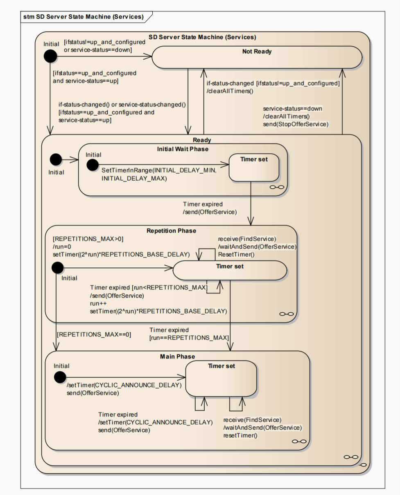
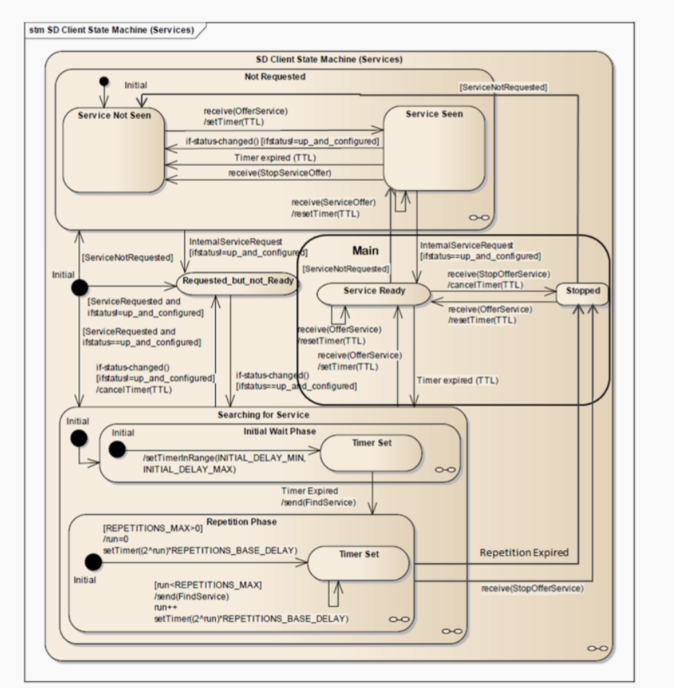

## 一、什么是 SOME/IP SD？

**SOME/IP SD (Service Discovery)** 是 AUTOSAR 定义的一种基于 IP 网络的服务发现协议，是 **SOME/IP** 协议族的重要组成部分。

它的目标是：

> 让软件组件 SWC 在不预知对方 IP/端口的情况下，能够在运行时动态发现服务并实现通信绑定。
---
### 📦 SD 解决了什么？

* 动态获取服务的地址和端口
* 接收服务状态改变通知（提供中 / 未提供）
* 支持 Client 主动搜索服务 (FindService)
* 支持 Provider 先行广播服务 (OfferService)
* 支持事件组订阅与 TTL 保活机制

### 🔗 应用场景

* ECU 动态上线 / 下线切换
* 多 Client 相互竞争服务实例
* 路由 / 软件控制器 / ADAS 实时组织
* TTL 控制通信生命周期

### 🧠 核心特性

| 功能     | 说明                         |
| ------ | -------------------------- |
| 服务发现   | FindService / OfferService |
| 订阅组织   | SubscribeEventGroup / ACK  |
| 基于 UDP | 使用组播和点播                    |
| ECU 通用 | IP + 服务性架构                 |
| RTE 系接 | RTE 调用自动调用 SD              |

### 🗺 工作流程简图

```text
Provider: OfferService  → 广播服务
Client  : FindService   → 搜索服务
Provider: OfferService  → 响应
Client  : Subscribe     → 订阅事件
Provider: ACK + Data    → 确认 + 常规推送
```

### 💬 一句话总结

> “SOME/IP SD 是软件服务分布和动态绑定的基础，使 Client 无需预置 IP 也能自动联系服务。”

---

## 二、协议格式 & 组成

SOME/IP SD 使用 UDP 30490 端口，消息结构：

```text
+--------------------+
| SOME/IP Header     |
| Protocol ID = 0xFFFF
+--------------------+
| SD Header          |
| Entries[]          |
| Options[]          |
+--------------------+
```

* **Entry**：表达动作意图 (Offer, Find, Subscribe)
* **Option**：配置结构 (IP, Port, TTL, Config)

---

## 三、正常通信流程

```text
[Provider]
  → OfferService (multi-cast)
[Client]
  → FindService (multi-cast)
[Provider]
  → OfferService (response)
[Client]
  → SubscribeEventGroup (uni-cast)
[Provider]
  → ACK + push event periodically
```

### ⏱ Provider 与 Client 的交互时序图（文字示意）

```
Provider           Client
   |                 |
   |---OfferService->|   (多播)
   |                 |
   |<--FindService---|   (多播)
   |---OfferService->|   (回应)
   |<--Subscribe------|   (点播订阅)
   |---ACK----------->|   (确认)
   |=== 事件推送周期性发送 ===>
```

---

## 四、Provider 与 Consumer 状态机模型

### ✅ Provider 状态机结构图



该图展示了 Provider 所经历的 4 个典型状态：

* Not Ready
* Initial Wait Phase
* Repetition Phase
* Main Phase（AVAILABLE）

每个状态通过定时器或接收报文事件进行转换，OfferService 报文会在不同阶段以不同频率发送。

### ✅ Consumer（Client）状态机结构图



Client 状态机结构较复杂，包含服务未见、搜索中、已见、订阅中、已订阅、停止等状态，核心转换基于：

* 是否收到 OfferService
* TTL 是否过期
* 是否完成订阅/取消订阅行为

这些状态图清晰呈现了 AUTOSAR SOME/IP SD 协议在实际运行中的时序机制与控制逻辑。

### ✅ Provider 状态机

| 状态            | 描述                |
| ------------- | ----------------- |
| DOWN          | 服务未初始化或未就绪        |
| INITIAL\_WAIT | 等待广播窗口开始          |
| REPETITION    | 重复广播 OfferService |
| AVAILABLE     | 开始接受订阅请求，定期推送事件   |

### ✅ Consumer（Client）状态机

| 状态               | 描述                   |
| ---------------- | -------------------- |
| INIT             | 启动后准备寻找服务            |
| WAIT\_FOR\_OFFER | 已发送 FindService，等待回应 |
| SUBSCRIBED       | 成功订阅事件组，处于活跃状态       |
| REFRESH          | 正在续订以保持 TTL 不失效      |

> 工具如 Wireshark 抓包可见每次状态跳转时对应的 SD 报文（Entry 类型 + Option 地址）

---

## 五、实际 SubscribeEventGroup 抽象

| 字段            | 示例                 | 含义      |
| ------------- | ------------------ | ------- |
| Service ID    | 0x1234             | 服务唯一标识  |
| Instance ID   | 0x0001             | 服务实例 ID |
| EventGroup ID | 0x8001             | 要订阅的事件组 |
| TTL           | 5s                 | 订阅有效期   |
| Endpoint      | 192.168.0.10:30500 | 接收推送的地址 |

---

## 六、协议细节 & 行为解析

### 📑 SD 报文类型概览（AUTOSAR 官方定义）

根据 AUTOSAR SD 规范文档中的 Table 5.2，Entry 的语义由 `EntryType` 字段和 `TTL` 字段共同决定。下表是官方支持的报文类型组合：

| EntryType | 十六进制 | TTL > 0 （正常行为）         | TTL = 0 （终止行为）          |
| --------- | ---- | ---------------------- | ----------------------- |
| 0         | 0x00 | FindService            | ✖️（不支持 TTL=0）           |
| 1         | 0x01 | OfferService           | StopOfferService        |
| 2         | 0x02 | SubscribeEventGroup    | StopSubscribeEventGroup |
| 3         | 0x03 | SubscribeEventGroupAck | SubscribeEventGroupNack |

> 📌 注：TTL = 0 仅在 EntryType ≠ 0x00 的情况下有效，用于表示“释放”或“拒绝”类行为。FindService 是 Client 主动查找服务的行为，其 TTL 字段始终无效。

该表定义了 SD 报文在实际通信中支持的行为类型，是理解服务提供/发现/订阅/释放等动作的根本依据。

SOME/IP SD 报文中的行为由 EntryType 和 TTL 联合决定，标准定义如下：

| TTL 条件  | EntryType (十六进制) | 报文类型                    | 描述              |
| ------- | ---------------- | ----------------------- | --------------- |
| TTL > 0 | 0x00             | FindService             | Client 查找服务     |
| TTL > 0 | 0x01             | OfferService            | Provider 提供服务   |
| TTL > 0 | 0x02             | SubscribeEventGroup     | Client 请求订阅事件组  |
| TTL > 0 | 0x03             | SubscribeEventGroupAck  | Provider 确认接受订阅 |
| TTL = 0 | 0x01             | StopOfferService        | Provider 停止提供服务 |
| TTL = 0 | 0x02             | StopSubscribeEventGroup | Client 取消事件组订阅  |
| TTL = 0 | 0x03             | SubscribeEventGroupNack | Provider 拒绝订阅请求 |

📌 注意：EntryType 为 0x00（FindService）报文在 TTL = 0 时无效，FindService 本身无 TTL 字段。

### 🧹 服务释放机制（Unsubscribe / Stop Offer）

SOME/IP SD 协议通过以下两种方式完成服务释放或断开订阅：

#### ✅ 1. Provider 停止提供服务

* Provider 可以通过发送 `StopOfferService` Entry（即将 TTL 设置为 0 的 Offer）告知所有 Client 服务下线；
* 之后，Provider 进入 `DOWN` 状态，不再接受订阅，也不再发送事件。

#### ✅ 2. Client 主动取消订阅

* Client 可以发送一个带 TTL = 0 的 `SubscribeEventGroup` 报文，表示取消订阅；
* Provider 接收后应停止向该 Client 推送事件。

📌 这两个机制可用于系统下电、网络退出或软件模块重启时的服务注销，保持网络资源清洁。

### 🔁 OfferService 报文的发送时机

即使 Client 已完成订阅，**Provider 仍会继续发送 OfferService 报文**，但发送频率随状态机阶段变化：

* 在 REPETITION 状态：Provider 会在启动阶段**快速多次发送 Offer**，用于确保所有潜在 Client 能收到服务信息；
* 在 AVAILABLE 状态：Provider 以**较长周期（通常每 5 秒或更长）继续广播 OfferService**，用于支持**新加入网络的 Client**完成绑定；
* Provider 并不会因为某个 Client 已订阅而停止 Offer，它是“面向所有潜在 Client”的广播机制。

### 🔍 Client 的 FindService 触发时机

* Client 启动后进入 `INIT` 状态，会**立即发送 FindService 报文**，主动寻找目标服务；
* 若在一定时间内未收到 Provider 的 Offer（即超时），Client 会**周期性重发 FindService**，直到收到有效 Offer；
* 一旦 Client 完成了订阅并进入 SUBSCRIBED 状态，按照标准规范，**它将不再发送 FindService 报文**，而是通过定期重新 Subscribe 来维持服务绑定。

📌 所以：**FindService 是 Client 在发现阶段使用的唯一探测方式，完成订阅后其功能由订阅续期机制替代。**

---

* TTL 表示订阅有效时长 (sec)
* Client 必须在 TTL 到期前重新 Subscribe
* Provider 如未收到续订，则退出推送

---

## 七、实战故障排查

| 环节           | 问题                        |
| ------------ | ------------------------- |
| Subscribe 失败 | TTL = 0 ／ Option 配置错误     |
| 未收接事件        | Provider 未处于 Main Phase（未启用周期推送）或未正确触发事件发送逻辑 |
| ACK 遗失       | 端口错误 ／ IP 错误              |
| Wireshark 抓包 | `udp.port == 30490` 筛选    |

---

## 八、与 AUTOSAR RTE 组成

通常配置于 .arxml 中，并由 RTE 生成 API：

```text
Application SWC
  ↓ RTE
SOME/IP Adapter
  ↓
SOME/IP + SD Stack (UDP/IP)
```
---

## 九、结论

| 组件       | 角色                        |
| -------- | ------------------------- |
| SD 协议    | 服务发现 / 绑定机制               |
| Entry    | 操作意图（Offer / Find / Sub…） |
| Option   | 网络参数 (IP / TTL / Port)    |
| TTL 机制   | 维持订阅有效性                   |
| Provider | 提供服务，推送事件                 |
| Client   | 订阅服务，解析回复                 |

---
