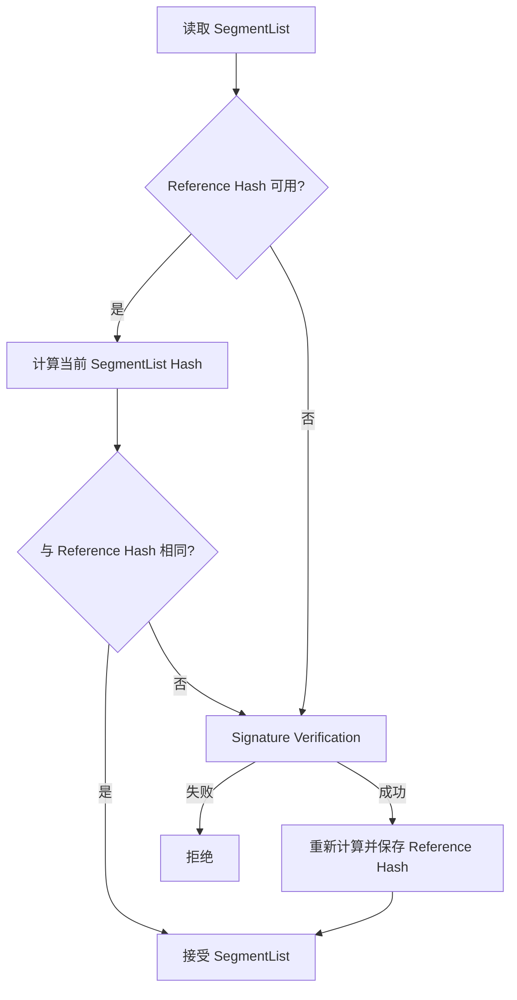
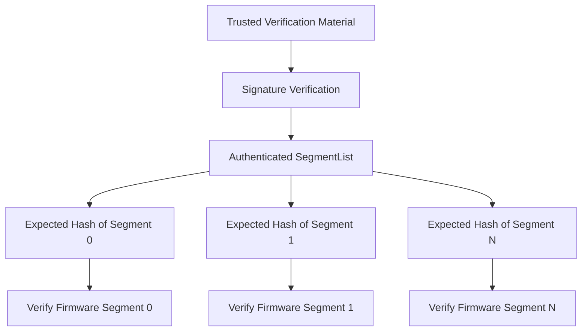
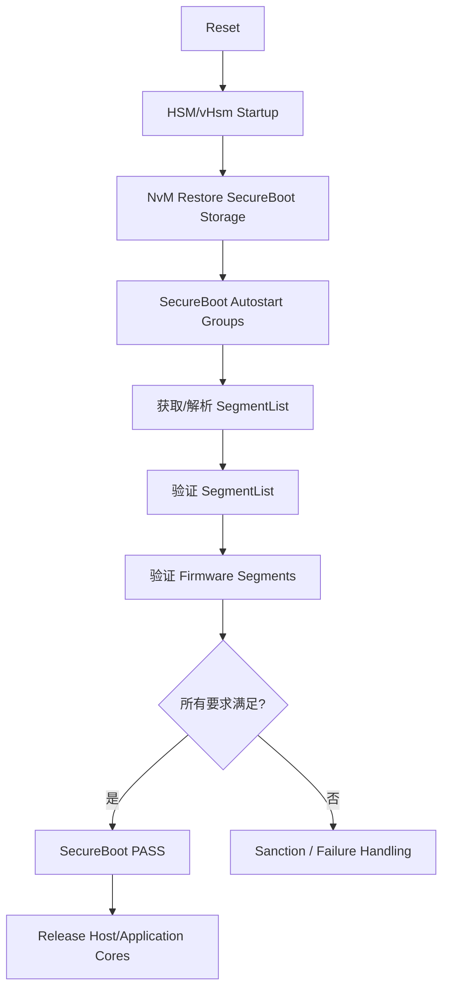
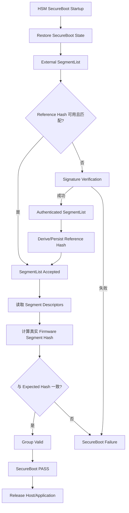

SecureBoot 经常被概括成一句话：**设备启动之前先验证固件，验证通过才允许执行。**

这句话没有错，但真正进入一个量产 ECU 工程后，很快会遇到一连串更具体的问题：谁先启动？谁负责验证？验证对象是整个镜像，还是一张描述镜像的清单？数字签名验证和 Hash 比较为什么会同时存在？为什么系统还要把一份 Reference Hash 存进 NvM？Reference Hash 第一次又是谁建立的？如果它丢失了，系统应该重新认证，还是直接“学习”当前内容？

这些问题如果没有放到完整启动链里理解，很容易在阅读 SecureBoot 代码时陷入局部：看到 `HashAvailable`，却不知道它为什么存在；看到 `SignatureVerify`，却不知道它在整条信任链中的位置；看到一个“让 ECU 恢复启动”的补丁，也很难判断它只是修复了状态机，还是同时改变了信任建立规则。

本文基于一套实际的 AURIX TC3xx + Vector vHsm 工程源码进行梳理。为了便于公开讨论，文中隐藏了项目名、需求编号、精确 Flash 地址、Group ID、内部目录和具体密钥数据，并将部分内部函数名抽象成更容易理解的伪名称。本文只描述当前代码和配置能够支持的事实；ROM Boot、芯片级保护、UCB/HSM lifecycle 等没有在当前源码中闭环的内容，会明确标记证据边界。

全文先从零建立 SecureBoot 的心智模型，再讨论一次真实修改为什么值得警惕。

---

## 一、先建立整体地图：谁在保护谁？

在当前工程中，可以先把系统粗略分成两侧：

- **Host/Application 侧**：运行 Bootloader、Application 等业务软件；
- **HSM 侧**：运行 vHsm 及其 SecureBoot、Crypto、NvM 等安全相关逻辑。

从仓库中的启动调用顺序可以确认：SecureBoot 的 Autostart Group 验证发生在 HSM 侧启动流程中，而“释放 Application Core”的 callout 位于这段验证流程之后。

因此，从当前软件可见范围建立的启动模型是：

```text
Reset
  ↓
芯片 ROM / HSM 启动前置阶段
  ↓
HSM 侧 vHsm 初始化
  ↓
恢复 SecureBoot 持久化状态
  ↓
SecureBoot Autostart Groups
  ↓
验证 Bootloader / Application 相关内容
  ↓
执行 PASS / FAIL 对应动作
  ↓
释放 Host/Application Core
```

这里需要特别限定一句：芯片 ROM 在 Reset 后到底怎样建立更底层的启动信任、HSM 固件自身如何被认证，并不在本文审计源码范围内。因此，本文讨论的是 **vHsm 软件可见的 SecureBoot verification chain**，而不是完整芯片级 Root of Trust 的全部实现。

如果只记住一个概念，可以先记住：

> **当前工程里的 SecureBoot 不是 Application 自己检查自己，而是在 Host 被正式放行前，由 HSM 侧先完成一轮受控验证。**

---

## 二、SecureBoot Group：先把“要验证的软件”分组

实际系统通常不只有一个需要验证的镜像。

当前配置中，不同软件区域被组织成 SecureBoot Group，不同 Group 可以使用不同的验证方式。例如审计样本里可以看到两类典型策略：

1. 某一类 Group 使用内部 Tag/CMAC 方式；
2. Application 类 Group 使用 **External SegmentList**。

本文重点讨论第二种，因为它完整体现了数字签名、Reference Hash 和真正 Firmware Segment 验证之间的关系。

可以把一个 External SegmentList Group 理解成：

```text
SecureBoot Group
        │
        └── External SegmentList
                ├── Segment 0 描述
                ├── Segment 1 描述
                ├── Segment 2 描述
                ├── ...
                └── Signature
```

Group 负责回答“这一组软件怎么验证”，SegmentList 则回答“这一组软件具体由哪些 Flash 区域组成，以及每一块内容应该是什么样”。

---

## 三、SegmentList 到底是什么？

External SegmentList 可以理解成一份 **受保护的固件清单**。

从当前解析代码可以还原出它至少包含以下信息：

```text
SegmentList
├── Header / Magic Pattern
├── Revision
├── Group Identifier
├── Segment Count
├── Segment[0]
│   ├── Address
│   ├── Length
│   ├── Mode
│   └── Expected Hash
├── Segment[1]
│   └── ...
├── ...
├── Signature Length
└── Signature
```

每个 Segment 描述一块连续的 Firmware 区域：

```text
Segment
├── 起始地址
├── 长度
├── 处理模式
└── 该区域内容对应的期望 Hash
```

于是 SecureBoot 实际上形成了两层验证对象：

### 第一层：验证 SegmentList 自己

首先必须确认：

> “这张清单本身可信不可信？”

如果攻击者可以任意改 Segment 地址、长度或者 Expected Hash，那么后续再认真验证 Firmware 也没有意义。

### 第二层：验证 SegmentList 指向的 Firmware

SegmentList 被接受后，SecureBoot 再根据其中记录的地址、长度和 Expected Hash，对实际 Flash 内容计算 Hash 并进行比较。

因此它并不是简单的：

```text
Signature → Firmware
```

而更像：

```text
可信验证材料
    ↓
Signature Verification
    ↓
可信 SegmentList
    ↓
SegmentList 中的 Expected Hash
    ↓
实际 Firmware Segment
```

这张清单正好把“认证元数据”和“真正被保护的 Firmware 内容”连接起来。

---

## 四、CSM、CryIf、Crypto Driver 分别在做什么？

从 SecureBoot 源码向下追踪数字签名和 Hash Job，会经过典型 AUTOSAR Crypto 栈：

```text
SecureBoot Logic
      ↓
CSM
      ↓
CryIf
      ↓
Crypto Driver
      ↓
实际密码学计算
```

### CSM：面向上层的 Crypto Service 调度入口

SecureBoot 不需要自己实现 SHA 或数字签名算法，而是通过 CSM Job 发起操作，例如：

```text
Hash
SignatureVerify
```

### CryIf：统一 Crypto Driver 接口

CSM 再通过 CryIf 把 Job 路由到实际的 Crypto Driver 和 Key。

### Crypto Driver：真正执行密码学 primitive

当前工程可以追到一个配置好的 Signature Verification Job 和对应 public verification key material；也能追到 Hash Job。

这里必须注意一个术语边界：

> **Signature Verification 本身不是 Trust Anchor。**

它是一种认证机制。真正让验证结果值得相信的，是背后的 trusted verification material，以及更底层对这些材料的保护。

当前源码能够证明的是“某个签名验证 Job 使用配置好的 public verification key material”；至于它在整个量产设备上最终由什么硬件机制保护、是否进一步锚定到 OTP/UCB/HSM lifecycle，则超出了本文源码证据范围。

因此本文后面统一使用下面这个层次：

```text
Trusted Verification Material
        ↓
Signature Verification
        ↓
Authenticated SegmentList
```

而不是把 `SignatureVerify()` 本身称为 Root of Trust。

---

## 五、为什么既要数字签名，又要 Reference Hash？

这是理解当前实现最关键的一步。

如果每次启动都直接对 External SegmentList 做完整数字签名验证，当然可以完成认证。但当前代码并不是每次都这么做，而是先检查一份持久化的 **Reference Hash**。

典型流程如下：



从控制流看，它非常像一个 **fast path + authentication fallback**：

- Reference Hash 命中：快速接受；
- Reference Hash 不存在或不匹配：回退到数字签名认证；
- 签名认证通过：重新派生 Reference Hash，并持久化供以后使用。

是否“为了性能”是最初设计者的明确动机，源码本身没有留下设计说明，因此不能把这个动机写成确定事实。但从程序结构可以确定，它确实实现了 fast path / fallback path。

更重要的是，Reference Hash 为什么能用于后续直接接受？

答案不是：

> “因为 Hash 很安全。”

而是：

> **因为这份 Reference Hash 的可信来源，原本是一次成功的更高层认证。**

也就是：

```text
Signature Verification Success
        ↓
Authenticated SegmentList
        ↓
Calculate Hash
        ↓
Persist Reference Hash
        ↓
Next Boot Hash Match
```

所以 Reference Hash 更准确的角色是：

> **由已认证状态派生出来的 trusted measurement / verification cache。**

它可以成为“本次直接接受的依据”，但它为什么值得相信，取决于它最初是怎样建立出来的。

这就是 **Direct Acceptance Basis** 和 **Trust Provenance** 的区别：

| 问题 | 答案 |
|---|---|
| 本次为什么接受？ | 当前 Hash 与 Reference Hash 相等 |
| Reference Hash 为什么可信？ | 它应当来自之前已经完成的可信认证 |

如果把这两层混在一起，就很容易错误地认为“Reference Hash 本身就是 Trust Anchor”。

---

## 六、Reference Hash 如何跨掉电保存？

当前实现还维护了一块 SecureBoot Storage。

它在 RAM 中有运行时镜像，并通过 NvM 映射到非易失介质。对 External SegmentList Group 而言，其中包含了：

```text
SecureBoot Storage
├── Group 状态
├── HashAvailable
└── Reference Hash
```

启动期间，NvM ReadAll 会尝试恢复这块状态。

### 恢复成功

CRC 检查通过后，之前保存的 Reference Hash 和 availability 状态被恢复：

```text
NvM
 ↓
Restore
 ↓
HashAvailable = TRUE
Reference Hash = previous value
```

随后 SecureBoot 可以直接尝试 Hash fast path。

### 恢复失败

在当前代码层可以看到，当 SecureBoot Storage 的 CRC 检查不通过时，会进入 Group 初始化路径：

```text
HashAvailable = FALSE
Reference Hash = 0
```

因此“全 0 Reference Hash”在当前实现里的直接来源，不需要猜测 Flash 的物理擦除值，而是软件显式初始化行为。

这点非常重要。

很多分析会把：

```text
storedHash == 00 00 00 ...
```

直接解释成：

> “Flash 擦除后就是全 0。”

但在当前工程中，我们真正能够证明的是：

> **NvM 恢复失败后，SecureBoot 的初始化逻辑会把 Reference Hash 软件清零。**

至于底层 Flash 擦除态究竟是什么值，是另一个问题。

---

## 七、CRC 在这里提供什么，不提供什么？

当前 NvM Block 配置可以看到 CRC-32 数据完整性检查。

它主要回答：

> “从非易失介质读回来的数据有没有发生错误？”

CRC 对随机 bit flip、存储损坏等错误检测非常有用，但它不能等价于密码学认证。

因此更准确的说法是：

> **在本文审计到的软件路径中，能明确看到的是 CRC 错误检测；没有在这一层观察到针对 SecureBoot Storage 的 MAC 或数字签名认证。**

这并不等价于：

> “整个芯片的 Data Flash 完全没有任何安全保护。”

后者还取决于 Flash protection、HSM protection、debug/programming authorization、UCB 配置、生命周期状态等硬件和系统级条件，而这些不是当前这段 NvM 软件代码能够单独证明的。

---

## 八、SegmentList 通过之后，真正的 Firmware 还要再验一遍

到这里容易产生一个误解：

> “SegmentList 的签名通过了，是不是整个 Application 就已经验证结束？”

不是。

SegmentList 是清单，它本身被认证后，只说明：

> “这张清单里的 Segment 地址、长度和 Expected Hash 是可信的。”

接下来 SecureBoot 还要读取每个 Segment 对应的实际 Flash 内容，并执行类似：

```text
Firmware Segment
      ↓
Hash()
      ↓
Calculated Segment Hash
      ↓
compare
      ↓
Expected Hash from SegmentList
```

因此完整链路可以画成：



这是一种很重要的“元数据认证 → 内容完整性验证”结构。

Signature 不需要覆盖每个 Firmware byte 的独立签名对象；它可以先认证一张包含各 Segment measurement 的清单，再由 measurement 去约束真实 Firmware。

---

## 九、从上电到放行 Application：完整流程串起来

现在把前面所有局部合起来。



在当前工程的 callout 实现中，SecureBoot 失败时可以进入 sanction 处理，并在 SecureBoot Enable 条件满足时触发 software reset。

因此“SecureBoot 失败”并不只是返回一个 `E_NOT_OK` 给某个普通函数，它可能直接改变整个 ECU 的启动结局。

也正因为如此，SecureBoot 代码里的一个状态判断，即使只有几行，也必须放到整条 boot decision chain 中判断。

---

## 十、一次真实修改：系统从“重新认证”变成了“直接学习”

理解完整结构以后，再看那次启动问题对应的修改，就很清楚了。

原始逻辑可以抽象成：

```text
if ReferenceHashAvailable:
    if Hash(CurrentSegmentList) == ReferenceHash:
        SegmentList = VALID
    else:
        SignatureVerify()
else:
    SignatureVerify()
```

也就是说：

```text
Reference Hash 可用且匹配
        → Fast Path

Reference Hash 不存在 / 不匹配
        → Signature Authentication
```

后来代码新增了一条特殊路径：

```text
Reference Hash 不可用
AND
Stored Hash == Default / All Zero
        ↓
计算当前 SegmentList Hash
        ↓
直接保存为新的 Reference Hash
        ↓
HashAvailable = TRUE
        ↓
SegmentList = VALID
```

抽象成伪代码就是：

```c
if (!hashAvailable && isDefault(storedHash)) {
    referenceHash = Hash(currentSegmentList);
    hashAvailable = true;
    segmentListValid = true;
    persist(referenceHash);
}
```

最关键的事实不是“多了一个 `else if`”，而是：

> **这一条成功路径中没有执行本次数字签名验证。**

这属于可以由 control flow 直接证明的事实。

---

## 十一、它真正改变的不是 Root of Trust，而是 Trust Establishment Path

如果简单说：

> “Root of Trust 从 Signature 转移到了 Hash。”

其实并不严谨。

系统级 Root of Trust 的真正来源还涉及芯片 Boot ROM、HSM 保护、verification key 的保护方式等，当前源码不足以完整定义它。

这次修改真正能够被精确描述的是：

> **Reference Hash 的信任建立路径发生了变化。**

### 修改前

```text
Trusted Verification Material
        ↓
Signature Verification
        ↓
Authenticated SegmentList
        ↓
Derive Reference Hash
        ↓
Persist Trusted Measurement
```

Reference Hash 的 provenance 很清楚：

> 它来自一次已经通过密码学认证的 SegmentList。

### 新增特殊路径

```text
Default / Uninitialized Reference State
        ↓
Current SegmentList
        ↓
Calculate Hash
        ↓
Persist as Reference Hash
        ↓
Mark Valid
```

这里出现了根本区别：

> **当前内容不再先由更高层 authority 认证，而是直接被用于建立以后会被信任的 Reference Hash。**

这可以称为一种 **TOFU-like self-provisioning**：类似 Trust On First Use 的“首次内容自学习”。

它不一定等价于传统网络协议中的 TOFU，但安全特征非常相似：

> 第一次被看到的内容，在缺少已有 reference 的情况下，直接成为后续信任基准。

---

## 十二、为什么这种修改能“让系统启动”，却仍然值得继续追根因？

现场现象是：烧录后裸启动异常，而连接 debugger 时启动结果不同。

新增 self-learning 分支以后，在某些初始状态下 SecureBoot 不再需要依赖本次 Signature Verification，就可以让 SegmentList 进入 valid 状态。

因此它确实能够解释一种现象：

```text
原来：必须走 Signature fallback
现在：default state 直接建立 Reference Hash
```

但这里必须保持证据边界。

当前静态源码还不能证明：

> “裸启动失败的直接根因，就是 SignatureVerify 本身失败。”

Debugger 连接可能改变 reset 类型、HSM/Host 启动时序、调试脚本行为、某些硬件状态或者初始化窗口。源码中没有发现一个简单的：

```c
if (debugger_connected) {
    bypass_secure_boot();
}
```

因此更准确的结论是：

> **该修改改变了失败场景可能经过的验证路径，并可以让特定 initial state 不再依赖本次 SignatureVerify；但 debugger 与 cold boot 行为差异的真正根因仍需要运行时实验闭环。**

这也是工程上很重要的一条经验：

> **Fixing the symptom 不等于 Root cause resolved。**

一个补丁让设备“能启动”，只能证明它改变了最终结果，不能自动证明它修复了最初导致验证链失败的原因。

---

## 十三、潜在风险应该怎样严谨表达？

看到 self-learning 分支后，很容易直接得出：

> “攻击者可以绕过 SecureBoot。”

这个结论同样过强。

代码能够直接证明的是：

> **存在一条在特定 default state 下，不执行本次 Signature Verification 就建立 Reference Hash 并接受 SegmentList 的状态迁移。**

要进一步变成真实攻击，还至少需要额外条件：

1. default/uninitialized reference state 能被重新制造；
2. 攻击者能够影响或替换待验证 SegmentList；
3. Firmware 内容也能被相应修改；
4. Flash/HSM/UCB/lifecycle/debug authorization 等保护机制没有阻止这些操作。

所以更完整的风险模型是：

```text
Software Reachable State
        +
Ability to Influence SegmentList / Firmware
        +
Insufficient Hardware / Lifecycle Protection
        ↓
Potential Exploitability
```

本文只能确认第一层软件状态机存在，而不能仅凭这一段代码确认现实攻击者具备全部后续能力。

因此合理的安全结论应该是：

> **修改扩大了 trust bootstrap 的软件接受条件，并形成一条需要进一步结合硬件保护评估的潜在风险路径。**

而不是直接宣称“SecureBoot 已被攻破”。

---

## 十四、真正需要保护的是 Reference Hash 的“来源”

这个案例最值得总结的地方，不是“全 0 Hash 不能自动学习”这么简单。

核心问题其实是：

> **谁有资格建立第一份 trusted metadata？**

Reference Hash 作为缓存没有问题。

问题在于它第一次出现时必须拥有可信 provenance。

常见且语义清晰的建立方式至少有三类：

### 方案 A：Manufacturing Provisioning

在受控生产阶段写入经过确认的 trusted metadata。

### 方案 B：First Boot 先做强认证

第一次没有 Reference Hash 时：

```text
Signature Verify
    ↓
Authenticated Content
    ↓
Derive Reference Hash
```

也就是原本 fallback 路径体现出来的模型。

### 方案 C：Lifecycle-Gated One-Time Provisioning

允许设备进行一次 provisioning，但必须由受保护 lifecycle state 控制，确保普通运行状态不能无限重新进入“首次学习”。

三种方式实现不同，但共同原则相同：

> **Reference metadata 的首次建立必须由一个已经可信的 authority 为它背书。**

Reference Hash 可以继承信任，但不应该凭空创造信任。

---

## 十五、SecureBoot Code Review 最应该问的 7 个问题

从这次分析可以提炼出一套比“有没有 SignatureVerify”更实用的审查清单。

### 1. 谁建立第一份 trusted metadata？

Reference Hash、measurement、manifest cache、certificate cache 第一次从哪里来？

### 2. Direct Acceptance Basis 和 Trust Provenance 是否被区分？

当前为什么接受是一回事，这个接受依据为什么可信是另一回事。

### 3. Cache miss 后做什么？

```text
Cache Miss
   ↓
重新认证？
```

还是：

```text
Cache Miss
   ↓
直接学习当前内容？
```

这往往就是安全边界。

### 4. Default / Uninitialized 状态能否重新进入？

如果所谓“First Boot”可以通过 NvM error、reset state 或重新刷写不断重现，它就不再是真正意义上的一次性状态。

### 5. 持久化数据只有错误检测，还是有真实性保护？

CRC、ECC、MAC、Signature 的安全语义完全不同，不能混为一谈。

### 6. Verification 函数的返回值真的是最终判据吗？

SecureBoot 常常同时维护：

```text
retVal
isValid
GroupResult
SanctionResult
```

必须继续追 caller，直到真正控制 boot decision 的那个状态。

### 7. “设备启动成功”是否真的说明验证链正常？

任何直接置 valid、skip fallback、改变 sanction 的修改，都可能让最终结果恢复，但并没有解决原始认证失败。

---

## 十六、一个零基础心智模型

最后把全文压缩成一张图。



把它换成一句话就是：

> **数字签名先证明“清单是谁认可的”，清单里的 Hash 再证明“Firmware 是否与清单一致”，Reference Hash 则缓存一次已经建立好的可信清单状态，让后续启动可以快速验证。**

而本文讨论的那次修改，正好碰到了这套模型最敏感的地方：

> **当 Reference Hash 不存在时，系统到底应该重新寻找 authority，还是直接把当前内容变成新的 authority？**

这是一个代码里只有几十行、但安全语义远大于代码规模的问题。

---

## 十七、结语

SecureBoot 最容易被误解成“启动时算个 Hash”。

真正的工程实现远比这复杂：

```text
启动控制
→ HSM
→ SecureBoot Group
→ SegmentList
→ Signature Authentication
→ Reference Hash
→ Firmware Segment Measurement
→ NvM Persistence
→ Sanction
→ Host Release
```

每一层都在回答不同的问题。

- Signature Verification 回答的是“谁为这份 metadata 背书”；
- Segment Hash 回答的是“真实 Firmware 是否符合 metadata”；
- Reference Hash 回答的是“能否复用上一次可信状态”；
- NvM 回答的是“这种状态如何跨 reset 保存”；
- sanction 和 core release 才最终决定“设备接下来还能不能运行”。

因此，分析 SecureBoot 修改时，不能只看一个 `if` 是否让 `isValid` 变成了 `TRUE`。真正应该继续追问的是：

> **这个 TRUE 的信任来源是什么？**

如果它来自已经验证过的 authority，那么它是在继承信任；如果它只是来自“当前正好是默认状态”，那就已经改变了 trust establishment policy。

最终可以把整个案例浓缩成一句工程原则：

> **Reference Hash 可以缓存信任，但不应该凭空创造信任。**

这条原则不仅适用于当前的 vHsm SecureBoot，也适用于 Bootloader、OTA manifest、Firmware measurement cache、certificate cache，以及任何“先做一次强认证、之后依赖持久化 measurement 快速判断”的系统。

当一个功能修复碰到这些状态时，最重要的问题不再只是“能不能启动”，而是：**我们到底让系统开始相信了什么，以及是谁授权它去相信。**
