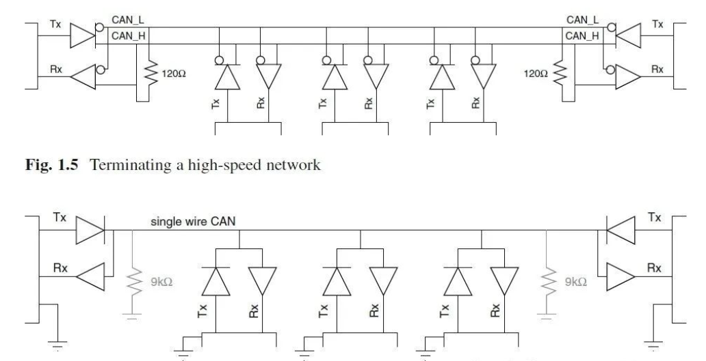
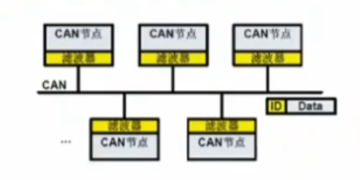
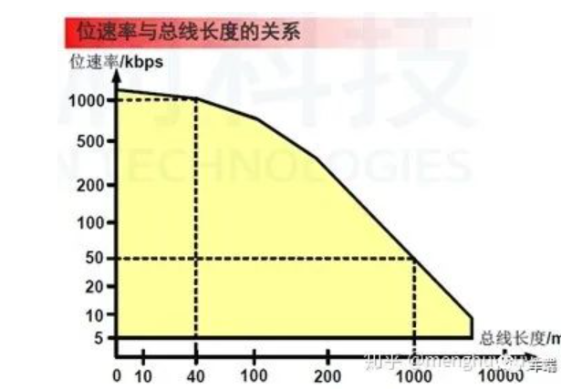
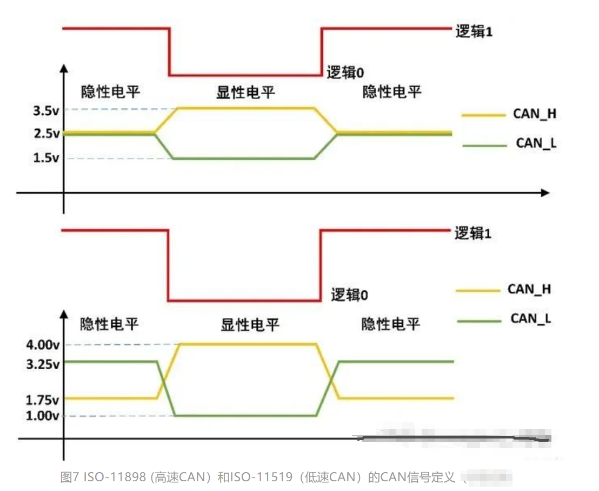
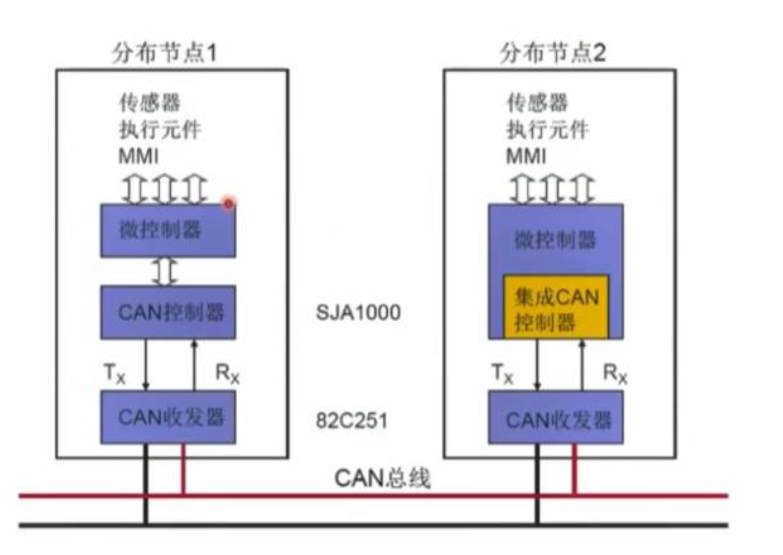
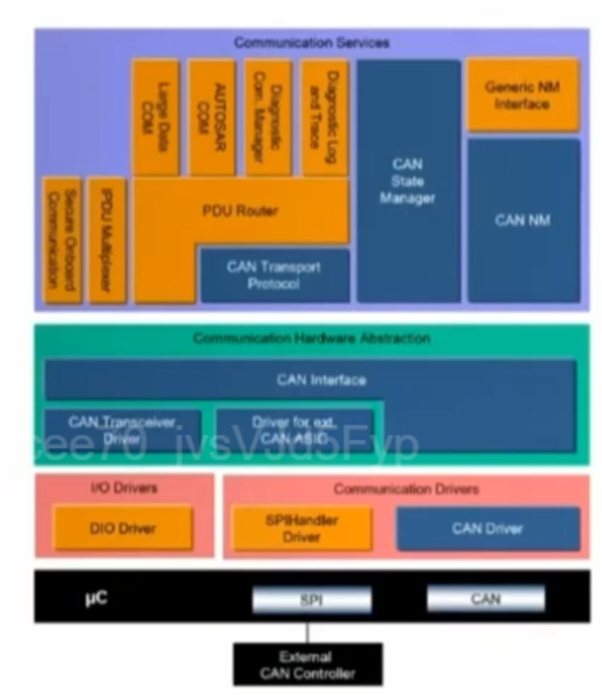
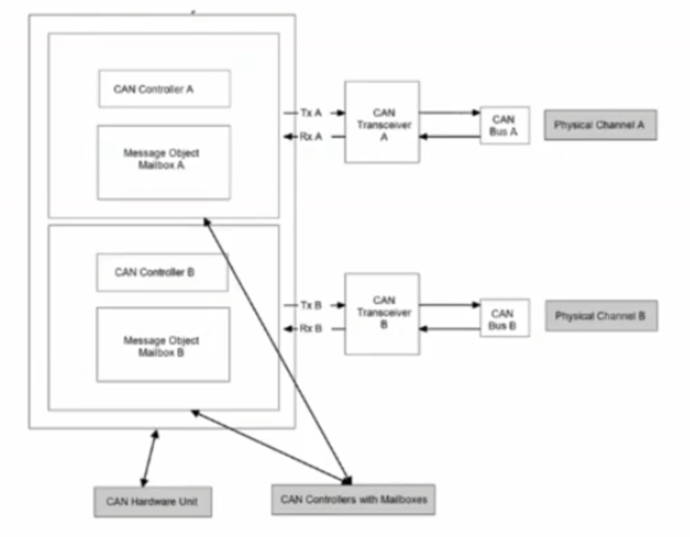
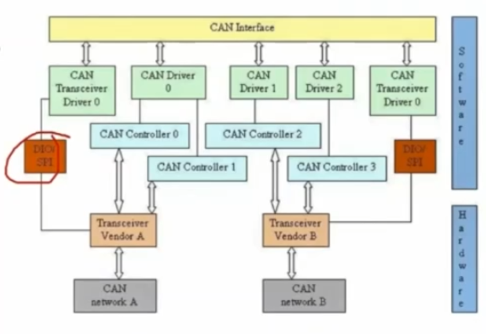
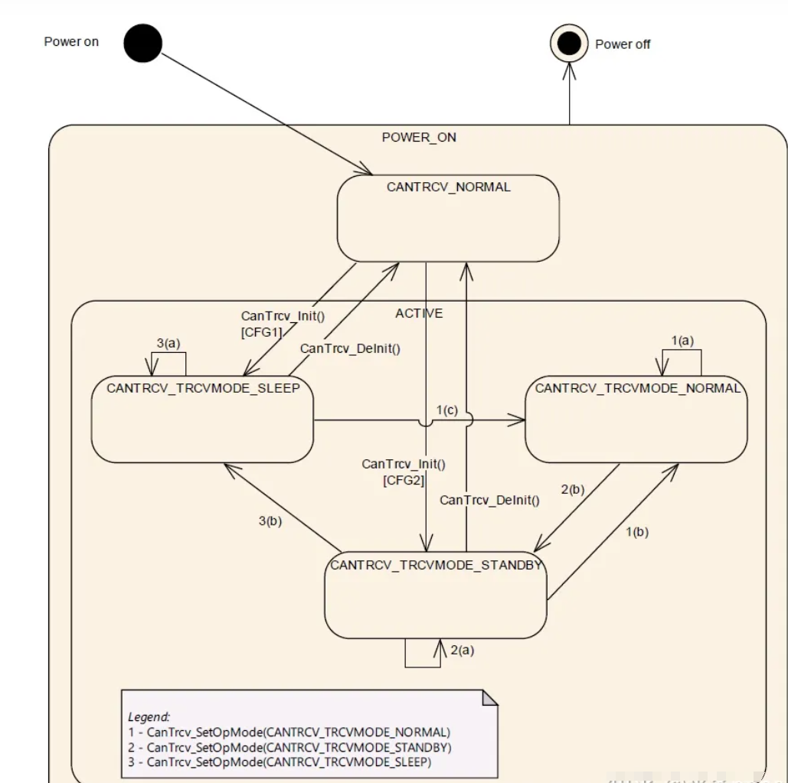

---
# 这是文章的标题
title: Autosar can协议栈
# 你可以自定义封面图片
# cover: /assets/images/cover1.jpg
# 这是页面的图标
icon: file
# 这是侧边栏的顺序
order: 1
# 设置作者
# author: Ms.Hope
# 设置写作时间
date: 2023-12-18
# 一个页面可以有多个分类
category:
  - Autosar
# 一个页面可以有多个标签
tag:
  - CAN
  - 协议
# 此页面会在文章列表置顶
# sticky: true
# 此页面会出现在文章收藏中
star: true
isOriginal: false
article: true
timeline: true
# 你可以自定义页脚
# footer: 这是测试显示的页脚
# 你可以自定义版权信息
# copyright: 无版权
---

本文主要讲解Autosar CAN 协议栈原理、集成及相关调试策略

<!-- more -->
## CAN通信基本原理

### CAN通信概述
  CAN（Controller Area Network）即控制器局域网络。由于其高性能、高可靠性、及独 特的设计，CAN越来越受到人们的重视。国外已有许多大公司的产品采用了这一技术。

  CAN最初是由德国的BOSCH公司为汽车监测、控制系统而设计的。现代汽车越来越多地采用电子装置控制，如发动机的定时、注油控制，加速、刹车控制（ASC）及复杂的抗锁定刹车系统（ABS）等。由于这些控制需检测及交换大量数据，采用硬接信号线的方式不但烦琐、昂贵，而且难以解决问题，采用CAN总线上述问题便得到很好地解决。

### CAN标准及原理图

CAN总线是一种用于在不同的ECU（电子控制单元）之间传输数据的线，CAN总线协议是一种ISO 国际标准化的串行通信协议，有 ISO-11898 和 ISO-11519两个系列。其定义有：
  ISO-11898 定义了通信速率为 125 kbps ~1Mbps 的高速 CAN 通信标准，属于闭环总线，传输速率可达1Mbps，总线长度 ≤ 40米，如下图。

  ISO11519 定义了通信速率为 10～125 kbps 的低速 CAN 通信标准，属于开环总线，传输速率为40kbps时，总线长度可达1000米，如下图。

### CAN特性

- 传输速率最高可达1Mbps，距离最远可达10km
- 通信介质选择灵活（双绞线、同轴电缆、光纤）
- 采用双线差分信号
- 协议本身对节点的数量没有限制
- 总线上节点的数量可以动态改变，组网灵活
- 短帧结构，传输时间短，受干扰概率低
- 多主站结构，各节点平等，任一节点可在任一时刻主动发送
- 非破坏性的基于优先级的总线仲裁
- 优先级通过报文的标识符（ID）区分，报文标识符在网络中是唯一的
  1. 标识符描述了数据的含义
  2. 某些特定的应用对标识符的分配进行了标准化
- 广播发送报文，报文可以被所有节点同时接收
- 根据需要可进行相关性报文过滤
  

### CAN功能特性
CAN总线上，信号表现为电压形式，通过CAN_H和CAN_L线上的电位差来表示CAN信号，分为显性电平(dominant)和隐性电平(recessive)两种类型。其中显性电平规定为逻辑0，隐性电平则为逻辑1。其具体定义可通过下图来理解。

### CAN系统构成
有两种，如下图；第三种是CAN收发器也集成到微控制器中

## AUTOSAR CAN协议栈概述

* Driver：主要包括CAN的Driver，以及根据外部的CAN的收
- HaedwareAbs：包括用于区分CAN通信的接口，接收／发送不同功能的PDU以及控制CAN收发器进行工作的Transceiver
* Services：包换CAN的状态管理以及PDU和信号的处理相关的模块

### CAN Driver

- MCU的CAN外设控制模块
- 主要数处理CAN的控制器中的功能，实现 数据在MCU CAN模块的收发

#### MCAL相关配置

- CanGeneral：配置一些API的使能函数周期等
- CanController：配置MCU的CAN外设操作功能以及CAN的Filter
- CanHaradwareObject：配置CAN的接收发送邮箱以及使用的Filter

### CANTrcv
  CAN Trcv模块主要控制CAN外部收发器的模式，MCU的CAN信号与CAN总线建立起数据交互;目标是为适用于大多数当前和未来CAN收发器设备定义接口和行为。CAN Trcv抽象了CAN收发器硬件。它为更高层提供了一个独立于硬件的接口。 它通过使用MCAL层的API来访问CAN收发器硬件，以便实现ECU布局中的抽象化。
  

#### CANTrcv 模式切换
- CANTrcv的模式转换主要通过控制Dio或者SPI来控制硬件Trcv
- 上电调用Init可以直接切换到任意一个模式
- SetMode函数用于被MainFunction或者CANIf接口调用控制
- 在支持唤醒的Trcv一定要确保下电进入Sleep，才能有唤醒功能，这个时候Trcv处于常电模式，且唤醒中断引脚连接SBC的唤醒引脚

#### MCAL配置

·General：主要配置相关API的使能以及是否支持唤醒等功能
·ConfigSet：根据外部电路配置Trcv的通道，主要分为DIO控制的和SPI控制的，DIO控制的根据使用的PIN关联到DIO通道，SPI控制的要分配SPI的Sequence

## AUTOSAR CAN协议栈集成

## AUTOSAR CAN调试策略

### 参考链接
[AUTOSAR_TR_FoundationReleaseOverview](https://www.autosar.org/fileadmin/standards/R20-11/FO/AUTOSAR_TR_FoundationReleaseOverview.pdf)
AUTOSAR中国官方培训课程

