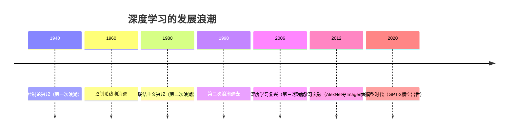
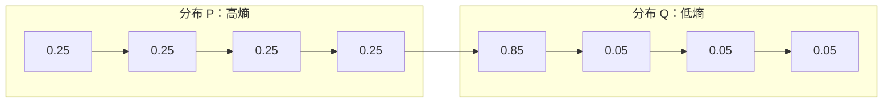
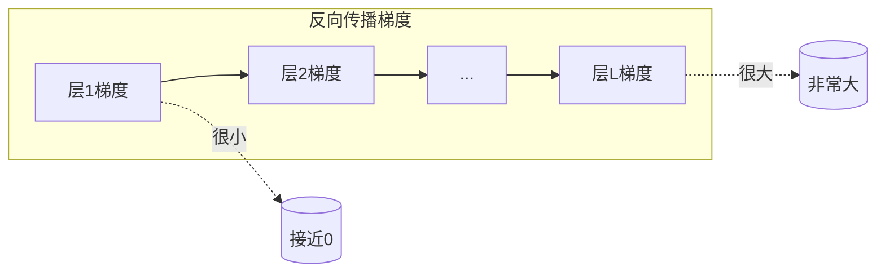
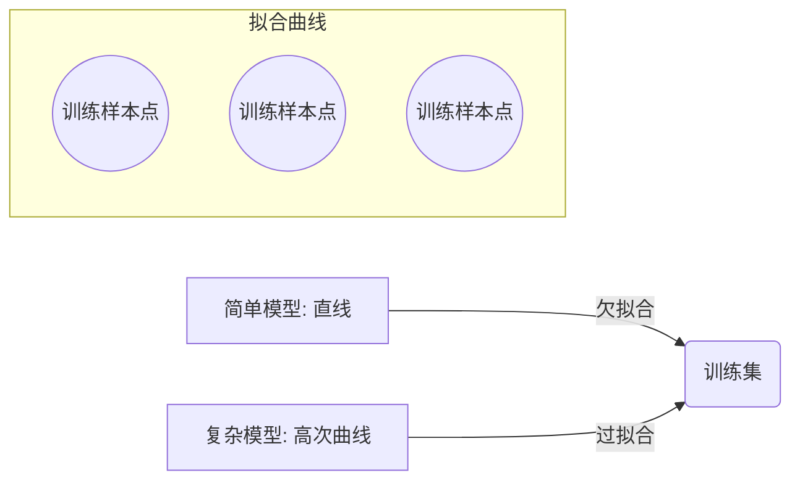
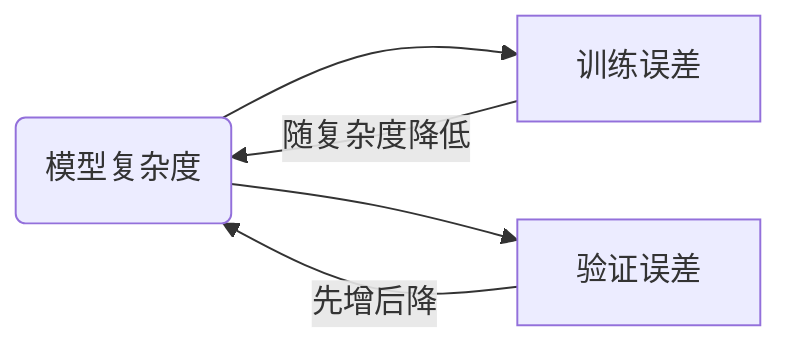

## 第一章 引言

### 原文关键点提炼

* **深度学习的定义与范围：** 深度学习是机器学习的一个分支，利用多层神经网络自动从数据中提取特征并进行预测或决策。它通过逐层的**表示学习**，使模型能够从低级特征逐渐形成高级抽象。深度学习旨在构建类似人脑多层神经元结构的模型，以解决复杂的模式识别问题。
* **深度学习的发展历程：** 深度学习并非突然出现的全新技术，而是经历了数十年的演变。20世纪40–60年代的**控制论**时期、80–90年代的**联结主义**时期以及2006年前后的**深度学习复兴**，构成了深度学习发展的三次浪潮。各阶段采用过不同名称（如人工神经网络、深度神经网络等），反映了研究重点和思想流派的变化。
* **历史趋势总结：** 深度学习发展的历史趋势可以概括为几个关键方面：（1）曾经出现过多种名称和理念，但有的昙花一现，最终统一于“深度学习”；（2）可获取的训练数据量不断增长，数据驱动的学习效果随之提升；（3）计算硬件和软件基础设施持续改进，模型规模随计算能力提高而增大；（4）深度学习已能解决日益复杂的应用，并在现实世界中取得不断提高的精度。
* **深度学习的影响领域：** 近年来深度学习在计算机视觉、语音识别、自然语言处理等领域取得突破，在机器人技术、生物信息学、搜索引擎、金融等广泛场景中发挥作用。深度学习的成功催生了众多新技术和应用（如自动驾驶、智能助手），推动人工智能进入新的发展阶段。

### 通俗解释与图示

引言以直观方式介绍了深度学习的概念和重要性。可以将**深度学习**比作让计算机“模仿人脑学习”的过程：就好比教一个孩子识别图中的猫狗，传统方法需要人类先提炼出毛发、尾巴等特征，然后编写程序决策；而深度学习则让计算机通过多层结构自行摸索“什么是猫，什么是狗”。这些层次逐级提取复杂模式：底层识别简单边缘线条，中层将线条组合成局部形状，高层据此判断是何种物体。这类似搭积木：初层学会识别基本砖块，中层组合砖块成窗户、房门等部件，高层将部件拼成完整房子。深度学习的多层网络结构正是通过这种逐步组合的方式实现对复杂概念的识别。

在历史演进方面，可以打一个比方：深度学习的发展就像**潮汐**涨落。20世纪中期第一次“浪潮”中，人们尝试用简单电路模拟神经元（那时称之为控制论）；后来浪潮退去，该方向一度沉寂。第二次浪潮（1980–90年代）兴起了联结主义，就像海潮再次涌来，人们用多层感知机等模型探索智能模拟，但由于算法和算力所限，效果有限，潮水又退了。直到2006年前后，第三次浪潮掀起——新算法的突破、大量数据的积累、强大算力的出现齐聚，深度学习这片海洋终于形成巨浪，一发不可收拾地推动AI快速前进。

**图示**方面，可以用一个简单**层次结构图**来表示深度学习模型。例如，一个包含两层隐藏层的神经网络结构：


上图中，输入层接收原始数据，经过第一层隐藏层提取初步特征，再经第二层隐藏层提炼更抽象的特征，最终由输出层给出预测结果。引言强调深度学习就是通过**多层**结构逐步提炼数据特征并完成学习任务的过程。

### 数学公式推导

引言章节本身数学推导不多，但为后续章节铺垫了一些基本概念。可以用符号形式刻画**深度神经网络**的逐层映射：给定输入 $\mathbf{x}$，多层网络通过一系列非线性变换 $f^{(l)}$ 实现逐层表示：

$$
\begin{aligned}
\mathbf{h}^{(1)} &= f^{(1)}(\mathbf{x}),\\ 
\mathbf{h}^{(2)} &= f^{(2)}(\mathbf{h}^{(1)}),\\ 
&\ \vdots\\
\mathbf{h}^{(L)} &= f^{(L)}(\mathbf{h}^{(L-1)}) = \mathbf{y},
\end{aligned}
$$

其中$\mathbf{h}^{(l)}$表示第$l$层的隐含表示，最终输出$\mathbf{y}$即为模型的预测结果。每层的函数$f^{(l)}$通常包含线性变换和非线性激活，如
$f^{(l)}(\mathbf{h}) = \sigma(W^{(l)}\mathbf{h} + \mathbf{b}^{(l)}),$
其中$W^{(l)}$为权重矩阵，$\mathbf{b}^{(l)}$为偏置向量，$\sigma(\cdot)$为非线性激活函数。通过复合多个这样的变换，深度网络可以表示极为复杂的函数关系。

深度学习模型训练的目标是通过调整所有层的参数，使模型预测误差尽可能小。例如，对于一个监督学习任务，我们常定义**损失函数**来度量预测与真实值的差异，如均方误差:

$$
L(\theta) = \frac{1}{n}\sum_{i=1}^n \|\hat{\mathbf{y}}_i(\theta) - \mathbf{y}_i\|^2,
$$

其中$\mathbf{y}_i$是第$i$个样本的真实标签，$\hat{\mathbf{y}}_i(\theta)$是模型以参数$\theta$给出的预测。训练过程就是通过优化算法（如梯度下降）寻找参数$\theta$使$L(\theta)$最小化。梯度下降的更新规则举例来说就是：

$$
\theta \leftarrow \theta - \eta \nabla_\theta L(\theta),
$$

其中$\eta$是学习率，$\nabla_\theta L(\theta)$是损失对参数的梯度。这个简单公式概括了深度学习训练背后的数学原理：不断沿着负梯度方向调整参数来减小误差。

### 与当前人工智能最新研究的联系

本章引言中提到的深度学习发展趋势在近年得到了更极致的体现。在**大模型时代**，深度学习模型的规模已扩展到数十亿甚至上万亿参数，背后需要海量数据和强大算力支持。这印证了引言中关于数据和算力的重要性的论述。例如，预训练的语言模型GPT-3/GPT-4拥有千亿级参数，正是深度学习模型规模随计算能力增长的典型案例。又如，**Transformer**架构自2017年问世以来，迅速取代循环神经网络成为自然语言处理的主流模型，其并行化优势允许在更大数据集上训练。Transformer模型的成功体现了引言所述“利用更强大的计算能力和更多数据来提升模型性能”的趋势。

此外，深度学习的应用领域如今更加广泛多样。例如，**扩散模型**（Diffusion Model）作为新兴的深度生成模型，在图像生成领域取得了惊人的效果，被用于如Stable Diffusion、DALL·E等文本生成图像系统。扩散模型通过学习数据噪声的逐步去除来生成样本，显示了深度学习在复杂概率分布建模上的强大能力。又如，**多模态学习**蓬勃发展，将视觉、语言、语音等多种模态的数据联合起来训练模型，使AI能够同时理解图像和文本等不同形式的信息。OpenAI的CLIP模型即是一例，它通过对比学习将图像和文本映射到共同的特征空间，从而实现跨模态的内容理解。这些前沿进展都源于深度学习方法在各领域的延伸应用，充分体现了引言中提到的“深度学习解决越来越复杂问题并取得更高精度”的观点。

### 示例代码块

作为引言示例，这里展示一个简单的Python代码，使用深度学习框架PyTorch构建并运行一个两层神经网络，以体验深度学习模型从输入到输出的流程：

```python
import torch

# 定义一个简单的两层前馈神经网络
model = torch.nn.Sequential(
    torch.nn.Linear(2, 3),   # 输入层: 2维输入 -> 隐藏层: 3个神经元
    torch.nn.ReLU(),
    torch.nn.Linear(3, 1),   # 隐藏层输出 -> 输出层: 1维输出
    torch.nn.Sigmoid()
)

# 构造一个示例输入 (2维向量)
x = torch.tensor([[0.5, -1.5]])
# 前向传播计算输出
y = model(x)
print(y)
```

在上述代码中，我们构建了一个含单隐藏层（3个隐单元）的简单网络，并对一个2维输入执行前向传播，输出 `y` 即模型的预测结果。比如对输入向量$(0.5, -1.5)$，未经过训练的随机初始网络可能输出一个介于0和1之间的数（Sigmoid激活保证输出落在0–1范围）。尽管该模型尚未训练，但代码演示了深度学习模型从输入到输出的基本计算过程。

### 图表可视化

为了形象地理解引言中的概念，下图展示了深度学习在不同时期经历的关注热度变化（示意性）：



在这条时间轴上，深度学习的三次“浪潮”被标注出来：**控制论**（20世纪中期）、**联结主义**（20世纪末）以及**深度学习复兴**（21世纪初）。2012年是深度学习发展的一个里程碑，当年Hinton团队的AlexNet卷积网络在ImageNet图像识别比赛上大幅刷新精度，引发工业界和学术界对深度学习的热潮。进入2020年代，以GPT-3为代表的超大规模预训练模型进一步将深度学习推向新的高度，标志着人工智能进入大模型主导的时代。这个图表直观地反映了引言提到的深度学习历史趋势和关键节点。

### 扩展阅读与个人思考

引言作为全书开篇，为读者提供了背景脉络和全局视角。如果希望进一步了解深度学习的发展历史、理念演变和未来趋势，推荐阅读以下资料：

* **深度学习发展简史：** *Yoshua Bengio等*, “Deep Learning (2007) 与“神经网络简史”等文章，对深度学习数十年的起伏进行了回顾和总结，让我们看到当前热潮背后的历史积淀。
* **人工智能指数报告：** 斯坦福大学每年发布《AI指数报告》，涵盖AI技术的发展数据和趋势。2025年报告中特别强调了大模型和多模态AI的崛起，以及Transformer在各领域的统治地位。
* **哲学与展望：** *Richard Sutton*在博客文章《The Bitter Lesson》中指出，纵观AI历史，**通用且可扩展**的方法（如深度学习）往往胜过依赖人类先验知识的技巧。这一观点发人深省，提醒我们深度学习的成功不是偶然，而是遵循了“让数据和算力说话”的普适规律。此外，Gary Marcus等AI学者对深度学习的局限提出批评和改进方向，如强调加入符号推理、先验知识等，这些讨论有助于我们全面思考深度学习未来的发展方向。

---

## 第二章 线性代数

### 原文关键点提炼

* **基本数学对象：** 本章复习了线性代数的核心概念，包括**标量**（scalar，单一数值）、**向量**（vector，由多个数值组成的有序列表，可视为$n$维空间中的点或箭头）、**矩阵**（matrix，由数值按行列排列形成的二维数组）和**张量**（tensor，推广的多维数组）。这些是深度学习中表示数据和参数的基本结构。
* **矩阵运算与性质：** 介绍了矩阵和向量的常用运算：如**加法**（对应元素相加）、**标量乘法**（矩阵的每个元素乘以标量）、**矩阵乘法**（行乘列求和得到新矩阵或向量）、**转置**（行列交换）等。特别地，矩阵与向量相乘（$A\mathbf{x}$）表示对向量进行线性变换。还讨论了**单位矩阵**（对角线上为1，其他为0的矩阵，记为$I$）及**逆矩阵**（矩阵$A$的逆$A^{-1}$使得$A^{-1}A=I$）。逆矩阵存在需要$A$是方阵且满秩，即列向量线性无关。
* **线性相关与子空间：** 讲解了向量组的**线性相关**（其中一个向量可由其他的线性组合得到）与**线性无关**概念。如果一组向量线性无关，它们的线性组合可以生成一个向量空间中的子空间，子空间的维度等于这组向量的个数。反之，若存在线性相关，则至少有一个向量是冗余的。相关概念包括**生成子空间**（span）即所有线性组合构成的空间，以及矩阵的**秩**（rank，列向量或行向量的最大线性无关数目）。
* **范数与距离：** 引入了**向量范数**的概念，用于度量向量的长度或大小。常用范数包括$L^2$范数 $|\mathbf{x}|_2 = \sqrt{\sum_i x_i^2}$（欧几里得范数）和$L^1$范数 $|\mathbf{x}|_1 = \sum_i |x_i|$，以及$L^\infty$范数（最大绝对值）。矩阵范数可以基于向量范数定义，如谱范数是矩阵作用下最大伸缩因子。范数在深度学习中用于衡量参数大小从而引入正则化。
* **特殊矩阵与向量：** 讨论了一些特殊类型的矩阵，如**对称矩阵**（$A = A^\top$）、**对角矩阵**（非对角元素为0）、**正定矩阵**（满足$\mathbf{x}^\top A \mathbf{x} > 0$对所有非零$\mathbf{x}$）等。这些矩阵在优化算法中经常出现（如海森矩阵通常是对称正定的近似）。特殊向量如**一元向量**(全1的向量)、**标准基向量**(如$(1,0,\dots,0)^\top$)也介绍了用途。
* **谱分解与奇异值分解：** 重点介绍了矩阵分解工具。**特征分解**（谱分解）适用于方阵：$A = Q \Lambda Q^{-1}$，其中$Q$的列为特征向量，$\Lambda$为对角矩阵包含特征值。本章特别指出对于对称矩阵可正交对角化（$Q^{-1}=Q^\top$）。**奇异值分解**(SVD)适用于任意矩阵：$A = U \Sigma V^\top$，其中$U$和$V$列向量分别是$A$的左、右奇异向量，$\Sigma$是对角矩阵对角线为奇异值。本章强调这些分解在降维和计算逆矩阵（如Moore-Penrose伪逆）中很有用。
* **实例：主成分分析(PCA)：** 本章以PCA为例展示线性代数在机器学习中的应用。PCA通过对数据协方差矩阵进行特征分解，找到主要特征方向（特征向量），对应最大特征值的方向即数据方差最大的主成分。选取前$k$个特征向量可以构建一个$k$维子空间，用来最小化重建误差地表示原数据。这体现了线性代数方法在降维和特征提取方面的价值。

### 通俗解释与图示

线性代数可以说是深度学习的**数学语言**。我们可以用通俗的方式理解一些关键概念：

* **向量**好比“有大小和方向的箭头”。例如二维向量$(3,4)$可以想象成从原点出发指向坐标为(3,4)的箭头，其长度可用勾股定理计算（长度5，对应$L^2$范数）。多个向量的**线性组合**类似于“搭车”：比如2倍的向量A加上3倍的向量B，相当于顺着A走2步再顺着B走3步，最终到达一个新位置。
* **矩阵**可以类比为“操作指令”或“转换器”。矩阵作用在向量上（矩阵乘以向量）会将该向量映射到新的向量。例如，一个$2\times 2$矩阵可以表示将平面上的图形拉伸、缩放或旋转。直观来看，如果把向量比作一只蝴蝶，矩阵就是网格筛子；不同的矩阵有不同形状的网孔，蝴蝶飞进去会被筛子改变飞行方向。**单位矩阵**就是不改变任何向量的“恒等操作”，**零矩阵**则把任何向量都映射为零向量。
* **矩阵的逆**可理解为“抵消矩阵操作的逆指令”。如果矩阵$A$把向量变换成某个结果，那么$A^{-1}$就是把结果变回原来的“解算器”。比如一个将平面缩放2倍的矩阵，其逆矩阵就是把平面缩放回原来一半。
* **特征分解**好比找到矩阵作用下“不变的方向”。特征向量是被矩阵拉伸或压缩后仍与原方向平行的向量，而特征值就是拉伸/压缩的倍数。打个比方，矩阵是一个特殊的弹性变形器，只有沿着某些特定方向（特征向量）用力拉弹簧，弹簧不会改变朝向，只会变长或变短（尺度改变由特征值决定）。

为了帮助理解，我们用一个**简单图示**说明矩阵对向量的作用。例如，一个$2\times2$矩阵$A$对二维向量的变换：


如上所示，向量$\mathbf{x}$经过矩阵$A$的线性变换后得到新向量$A\mathbf{x}$。具体例子：若
$$
A = \begin{pmatrix}
0 & -1 \\
1 & 0
\end{pmatrix}
$$

（这是一个$90^\circ$旋转矩阵），$\mathbf{x} = (1,2)^\top$，则

$$
A\mathbf{x} = \begin{pmatrix}0 & -1\\1 & 0\end{pmatrix}\begin{pmatrix}1\\2\end{pmatrix} = \begin{pmatrix}-2\\1\end{pmatrix},
$$

可见原向量$(1,2)$被这个矩阵逆时针旋转了90度，变成$(-2,1)$。这个例子形象地展示了矩阵乘法对向量的线性变换效果。

### 数学公式推导

本章重在概念解释，涉及的推导主要是线性代数的基础公式和性质。以下列出若干重要公式：

* **矩阵-向量乘法：** 如果$A$是$m\times n$矩阵，$\mathbf{x}$是$n$维列向量，那么

  $$
  \mathbf{y} = A\mathbf{x}
  $$

  得到一个$m$维向量$\mathbf{y}$。具体地，若$A=[a_{ij}]$，则$\mathbf{y}$的第$i$个分量

  $$
  y_i = \sum_{j=1}^n a_{ij}x_j,
  $$

  即矩阵的第$i$行与向量$\mathbf{x}$做点积。这个公式定义了神经网络中线性层的计算。
* **内积（点积）：** 向量$\mathbf{u}, \mathbf{v}\in\mathbb{R}^n$的内积（点积）定义为

  $$
  \mathbf{u}\cdot \mathbf{v} = \sum_{i=1}^n u_i v_i.
  $$

  当$\mathbf{u}$和$\mathbf{v}$都是列向量时，$\mathbf{u}^\top \mathbf{v}$表示它们的点积。这一数量衡量两个向量的相似度（夹角小则点积大）。
* **矩阵乘法性质：** 矩阵乘法满足结合律$(AB)C = A(BC)$和分配律$A(B+C)=AB+AC$，但一般不满足交换律（$AB \neq BA$，除非$A,B$在特殊情况下可交换）。深度学习中多层线性变换的组合可以利用结合律来简化矩阵计算顺序。
* **行列式和逆：** 方阵$A$的行列式$\det(A)$是一个标量，反映矩阵作为线性变换对体积的缩放因子。若$\det(A)\neq 0$，则$A$可逆，且逆矩阵满足

  $$
  A^{-1}A = AA^{-1} = I.
  $$

  小规模矩阵（如2x2矩阵$\begin{pmatrix}a\&b\c\&d\end{pmatrix}$）的逆可直接用公式

  $$
  A^{-1} = \frac{1}{ad - bc} \begin{pmatrix}d & -b\\-c & a\end{pmatrix}
  $$

  给出，一般矩阵的逆需通过高斯消元或分解算法求解。
* **特征值问题：** 对于矩阵$A\in \mathbb{R}^{n\times n}$，标量$\lambda$和非零向量$\mathbf{v}$若满足

  $$
  A\mathbf{v} = \lambda \mathbf{v},
  $$

  则称$\mathbf{v}$为$A$的特征向量，$\lambda$为对应的特征值。求解$\det(A - \lambda I)=0$可得特征值（这是一个$n$次多项式方程）。特征分解将矩阵表示为$A = Q \Lambda Q^{-1}$，其中$\Lambda$是包含所有特征值的对角矩阵。
* **奇异值分解：** 任意$m\times n$矩阵$A$都可以分解为

  $$
  A = U \Sigma V^\top,
  $$

  其中$U\in \mathbb{R}^{m\times m}$、$V\in \mathbb{R}^{n\times n}$是正交矩阵，$\Sigma$是$m\times n$的对角矩阵，对角线元素$\sigma_1,\sigma_2,\dots$即$A$的奇异值（非负实数）。SVD对矩阵提供了最优低秩逼近：取前$k$个最大奇异值及对应奇异向量，可得秩为$k$的矩阵$A_k$，使$|A - A_k|_F$最小（Frobenius范数意义下）。
* **PCA的数学原理：** 给定数据矩阵$X$（假设每行是一个数据样本），PCA通过对协方差矩阵$X^\top X$进行特征分解，找出最大特征值对应的特征向量方向。这等价于求解

  $$
  \max_{\|\mathbf{w}\|=1} \|X\mathbf{w}\|_2^2,
  $$

  即找到一个单位向量方向$\mathbf{w}$，使数据在此方向的方差最大。解$\mathbf{w}$正是协方差矩阵的主特征向量。继续求解次大特征值可得第二主成分方向，以此类推。

### 与当前人工智能最新研究的联系

线性代数是深度学习的基础，在现代AI研究中无处不在：无论是**Transformer**网络中的自注意力计算，还是**卷积神经网络**的滤波操作，背后都离不开矩阵运算和线性代数工具。当前一些研究热点也密切相关于本章内容：

* 在**大模型优化**中，人们开始研究利用矩阵分解（如SVD）压缩模型参数。例如，将一个巨大的权重矩阵分解为低秩矩阵乘积，以减少参数和计算量。这种低秩近似方法来源于线性代数，可以在不显著损失精度的情况下压缩BERT等模型。
* **Posit**数值格式、**混合精度训练**等实践关乎矩阵计算的数值稳定性（本章数值计算章节详细讨论）。线性代数提供了病态条件数等概念评估数值稳定性，以指导设计更稳定的训练算法。
* **随机线性代数**：在处理超大规模数据时，研究者使用随机化算法近似计算矩阵的谱性质（如近似奇异值）。这些技巧应用于推荐系统（矩阵分解）、词嵌入（共现矩阵SVD）等任务，使得处理百万维矩阵成为可能。
* **量子机器学习**领域，一些算法（如HHL算法）能够在量子计算机上高效解线性方程组、提取特征值等，为将来训练超大规模模型提供了理论可能性。线性代数作为桥梁，把经典深度学习算法与量子加速器联系起来。

### 示例代码块

这里提供几个使用Python（NumPy库）进行线性代数运算的简单代码示例，加深对概念的理解：

```python
import numpy as np

# 定义一个矩阵A和一个向量b
A = np.array([[2, 3],
              [4, -1]])
b = np.array([5, 1])

# 1. 解线性方程组 A x = b
x = np.linalg.solve(A, b)
print("方程 Ax=b 的解 x =", x)

# 2. 计算矩阵的特征值和特征向量
w, v = np.linalg.eig(A)
print("特征值:", w)
print("特征向量矩阵:\n", v)

# 3. 计算矩阵的奇异值分解
U, Sigma, Vt = np.linalg.svd(A)
print("奇异值:", Sigma)
```

运行此代码，将依次输出：

1. 方程$A\mathbf{x}=\mathbf{b}$的解。例如上例中 `x = [0.57142857 1.28571429]`，对应有理数为$(4/7, 9/7)$，可验证$A x$确实等于$b$。
2. 矩阵$A$的特征值和特征向量。对于给定的$A$，可能输出特征值如 `[3.0, -2.0]`，对应的特征向量矩阵的列就是两个归一化的特征向量。
3. 矩阵$A$的奇异值。输出如 `奇异值: [5.3851648  1.3851648]`（这正是$A$两条奇异值）。还可以打印$U,Vt$矩阵，但这里不详列。

通过这些代码，我们可以直观验证线性代数理论结果，例如用解算器求逆、用特征分解/奇异值分解分析矩阵性质。这些操作在深度学习框架中都有高效实现，支持模型的训练和分析。

### 图表可视化

下面用一张简单的示意图来说明主成分分析（PCA）的几何意义。假设我们有二维数据点云，PCA会找到一个最佳方向将数据投影到一维：

```mermaid
%% PCA投影示意 %%
flowchart TD
    subgraph 数据分布 (二维)
    P1((点))
    P2((点))
    P3((点))
    P4((点))
    end
    axis1[主成分轴] --- axis2[次主成分轴]
    P1 & P2 & P3 & P4 ==> axis1
```

上述示意：在二维数据平面上（左侧点云），PCA找到了**主成分轴**（axis1）和正交的**次主成分轴**（axis2）。主成分轴方向是数据方差最大的方向。将所有点投影到该轴上，就得到一维的主成分表示（箭头所示映射关系）。这降低了数据维度，同时保留了尽可能多的原始信息。这张图形象地展示了PCA如何通过线性代数方法实现降维。

### 扩展阅读与个人思考

线性代数作为数学工具，其重要性不仅体现在深度学习中，也是工程和科学计算的基石。进一步学习和思考可以参考：

* **《线性代数及其应用》** (吉尔伯特·斯特朗) 对线性代数概念有深入浅出的讲解，并配有大量实例，让读者理解矩阵和向量的几何意义。这对巩固本章内容很有帮助。
* **NumPy官方指南：** NumPy作为Python科学计算库，其文档详细介绍了向量化计算、广播机制等，实现高效矩阵运算。这些技巧在深度学习的张量运算中也被广泛采用。
* **矩阵分析与机器学习：** 深度学习研究中，有些方向关注利用矩阵理论解释模型行为，如随机矩阵理论用于分析大型随机初始化网络的谱分布，Hessian矩阵的特征值用于理解损失景观的鞍点和局部极小值。这些交叉内容展现出线性代数知识在AI前沿研究中的新应用领域。
* **实践中的数值稳定性：** 建议读者留意线性代数算法的数值误差，例如大矩阵求逆和特征分解可能存在不稳定性。在深度学习实现时，要关注浮点精度、病态矩阵（条件数大）等问题，必要时采用正则化或调整算法以保证稳健性。

---

## 第三章 概率与信息论

### 原文关键点提炼

* **概率论基础：** 本章首先回答“为什么需要概率”：因为在机器学习和人工智能中，不确定性无处不在，我们需要用概率来表达对事件发生的**信心**和**不确定性**。引入了**随机变量**的概念：可以取不同值且存在概率分布的量。随机变量分为**离散型**（取有限或可数值，如掷骰子结果）和**连续型**（取实数范围值，如温度测量）两类。
* **概率分布：** 讨论了描述随机变量的方法。对于离散型变量，用**概率质量函数**(PMF) $P(X=x)$给出每个取值的概率；对于连续型变量，用**概率密度函数**(PDF) $P(X=x)$描述取某值附近的相对可能性，并通过对区间积分得到概率。概率分布必须满足非负性和归一化条件（总概率为1）。
* **边缘与条件概率：** **边缘概率**(marginal)指在有多个随机变量时，关注其中一部分变量的概率分布（通过对其它变量求和或积分得到）。**条件概率**$P(A|B)$表示在事件$B$发生条件下事件$A$发生的概率。引入**链式法则**将联合概率分解为条件概率连乘，如$P(A,B) = P(A|B)P(B)$，从而一般地$P(X_1,\dots,X_n) = \prod_{i=1}^n P(X_i|X_1,\dots,X_{i-1})$。
* **独立性：** 如果两个事件$A$和$B$满足$P(A,B) = P(A)P(B)$，则称$A$和$B$独立。类似地，随机变量$X$和$Y$独立意味着它们的联合分布等于边缘分布乘积。本章也介绍了**条件独立**概念，指在给定某条件时，两变量变得独立。
* **期望与方差：** **期望**(期待值) $E[X]$度量随机变量的平均值，定义为离散情况下$\sum_x x P(X=x)$，连续情况下$\int_{-\infty}^{+\infty} x, p(x),dx$。**方差**$\mathrm{Var}(X) = E[(X - E[X])^2]$衡量变量围绕均值波动的程度，**标准差**是方差的平方根。**协方差**$\mathrm{Cov}(X,Y) = E[(X-E[X])(Y-E[Y])]$描述两个变量的线性相关程度，协方差归一化可得相关系数。
* **常用概率分布：** 本章列举了机器学习中常用的一系列分布及其特性：

  * **伯努利分布**：离散分布，$P(X=1)=p, P(X=0)=1-p$，刻画一次成败试验。
  * **多项分布**：伯努利的多类扩展，如$k$类分类的输出分布（也称Categorical分布）。
  * **高斯分布(正态分布)**：连续分布，密度函数
    $p(x)=\frac{1}{\sqrt{2\pi\sigma^2}}\exp\!\Big(-\frac{(x-\mu)^2}{2\sigma^2}\Big),$
    由均值$\mu$和方差$\sigma^2$参数化。高斯分布在高维情况下定义为多元正态分布，具有协方差矩阵参数。
  * **指数分布、Laplace分布**：常用于建模非负变量的指数衰减、以及尖峰状噪声等。
  * **Dirac分布**和**经验分布**：前者把概率集中在某一点上，后者是样本点组成的离散分布，用于非参数估计。
  * **混合分布**：将多个分布按某权重混合，形成新的更复杂分布（如高斯混合模型）。
* **常用函数的有用性质：** 本节回顾了一些在概率推导中常见的函数性质，如对数函数将乘积变和、指数函数的无穷级数展开、sigmoid函数及softmax函数的定义和导数性质等，为后续章节（例如神经网络输出层的激活函数）做准备。
* **贝叶斯规则：** 给出了著名的贝叶斯定理：
  $P(A|B) = \frac{P(B|A)P(A)}{P(B)},$
  也即Posterior = Likelihood × Prior / Evidence。它提供了从条件概率$P(B|A)$反推$P(A|B)$的方法，是机器学习（特别是生成模型和贝叶斯学习）的基石。
* **信息论基础：** 本章后半部分引入了信息论概念：**熵**(entropy) $H(X) = -\sum_x P(X=x)\log P(X=x)$，衡量随机变量的不确定性；**交叉熵**(cross-entropy)和**KL散度**(KL-divergence)用于度量两个分布的差异。信息论量在后续章节中用于定义损失函数（如分类的交叉熵损失）和正则项。
* **结构化概率模型：** 介绍了用图模型（有向图和无向图）表示变量之间依赖关系的方法，内容包括贝叶斯网络和马尔可夫随机场等，奠定了后续章节讨论深度学习与概率图模型结合（如第16章）的基础。

### 通俗解释与图示

概率论听起来抽象，但其实是帮我们**管理不确定性**的一套规则。用日常类比解释：

* **概率**就像天气预报中的降雨概率：“今天下雨的可能性有70%”。它不是确定会下雨或不下雨，而是表达了一种信心水平。如果将这个试验重复很多次，大约70%的次数会下雨。
* **条件概率**可以这样理解：假设我们关注“明天下雨”的概率。如果知道“今天已经下雨”这个条件，会不会改变我们对明天下雨的信心？很可能会，因为天气有连续性。这就是$P(\text{明雨}|\text{今雨})$与$P(\text{明雨})$的区别。条件概率考虑了额外信息对事件发生可能性的影响。
* **独立性**意味着“互不相干”。如果事件A和B独立，那么知道A发生与否，对B发生的概率没有任何影响。比如抛一枚硬币两次，第一次正反结果和第二次正反结果是独立的；而如果把一副扑克牌不放回地抽两张，抽到红桃A和方片A就不是独立的，因为第一张抽出的结果影响第二张剩余牌的构成。
* **期望**可以理解为“大数定律下的平均结果”。如果我们不断重复试验，然后求平均，比如掷骰子的期望是3.5，意味着掷非常多次骰子，点数平均会趋近3.5。**方差**则告诉我们掷骰子结果的波动有多大（骰子的方差约2.92）。
* **常用分布**可以配合生活场景记忆：伯努利分布像掷硬币，正面1反面0；高斯分布则像身高体重等自然测量，围绕均值对称钟形曲线，大部分人在均值附近，小部分在人群两端。
* **贝叶斯规则**常用“患病概率”类比：$P(\text{有病}|\text{检测阳性}) = \frac{P(\text{阳性}|\text{有病})P(\text{有病})}{P(\text{阳性})}$。意思是，检测呈阳性的人真正有病的概率 = (测试准确率 × 疾病先验概率) / 总阳性率。这在医疗诊断中非常关键，可以避免对阳性结果的误判。
* **信息论**中的熵有个形象的比喻：它是对**未知程度**的度量。熵大的分布（如均匀分布）表示结果很难猜测，不确定性高；熵小的分布（如一边倒的分布）表示大致可以猜到结果。不确定性越高，信息量越大——因为当结果出来时，你“学到”的信息更多。

通过一个简单**图示**来理解条件概率和贝叶斯公式：

```mermaid
flowchart LR
    A[事件 A] -- 依赖 --> B[事件 B]
    B --> |已知B| A_calc[计算 P(A|B)]
    A --> |已知A| B_calc[计算 P(B|A)]
```

如上图，假设A和B有因果关联（箭头表示A影响B）。根据贝叶斯法则，我们可以从已知$P(B|A)$和$P(A)$来推算$P(A|B)$。现实例子：A = “病人患某病”、 B = “测试呈阳性”。我们常常容易将$P(\text{阳性}|\text{有病})$误认为$P(\text{有病}|\text{阳性})$，贝叶斯公式正提供了将前者转化为后者的正确方法。

### 数学公式推导

本章涉及大量概率与信息论公式推导，以下列出几个重要公式：

* **全概率公式：** 若事件$B_1,\dots,B_n$构成一个完备事件组（互斥且穷尽），则对于任意事件$A$，

  $$
  P(A) = \sum_{i=1}^n P(A|B_i)P(B_i).
  $$

  例如计算明天下雨概率，可将今天的天气作为划分：$P(\text{明雨}) = P(\text{明雨}|\text{今晴})P(\text{今晴}) + P(\text{明雨}|\text{今雨})P(\text{今雨})$。
* **贝叶斯公式：**

  $$
  P(A|B) = \frac{P(B|A)P(A)}{P(B)},
  $$

  其中$P(B) = P(B|A)P(A) + P(B|\neg A)P(\neg A)$。这一推导直接来自全概率公式和条件概率定义。
* **均值和方差：** 对随机变量$X$有$E[X] = \sum_x x P(X=x)$。线性运算的期望性质：$E[aX + b] = aE[X] + b$。方差$\mathrm{Var}(X) = E[X^2] - (E[X])^2$，并满足$\mathrm{Var}(aX+b) = a^2 \mathrm{Var}(X)$。两个独立随机变量$X,Y$有$\mathrm{Var}(X+Y) = \mathrm{Var}(X) + \mathrm{Var}(Y)$（独立时协方差为0）。
* **熵和KL散度：** 熵定义为

  $$
  H(P) = -\sum_x P(x)\log P(x),
  $$

  反映不确定性。KL散度定义两个分布$P$与$Q$的“距离”：

  $$
  D_{\mathrm{KL}}(P\|Q) = \sum_x P(x)\log\frac{P(x)}{Q(x)},
  $$

  它非负且为0当且仅当$P=Q$几乎处处相等。交叉熵$H(P,Q) = H(P) + D_{\mathrm{KL}}(P|Q)$，在机器学习中常用来定义目标分布$P$和模型分布$Q$之间的误差度量。
* **联合分布与条件独立：** 两随机变量$X,Y$的联合PMF可由条件概率关系表示：$P(X=x, Y=y) = P(Y=y|X=x)P(X=x)$。如果$X$与$Y$条件独立于$Z$，则

  $$
  P(X,Y|Z) = P(X|Z)P(Y|Z).
  $$

  这一性质在构建概率图模型时允许我们将复杂的联合分布因式分解。
* **高斯分布性质：** 一维高斯$N(\mu,\sigma^2)$具有最大熵性（在给定均值和方差条件下熵最大）。多维高斯$N(\boldsymbol{\mu}, \Sigma)$的密度函数和一维形式类似，只是$x-\mu$替换为$(\mathbf{x}-\boldsymbol{\mu})^\top \Sigma^{-1} (\mathbf{x}-\boldsymbol{\mu})$在指数中，归一化系数包含$|\Sigma|$和$(2\pi)^{n/2}$。
* **信息增益：** 定义两个变量间的互信息

  $$
  I(X;Y) = H(X) + H(Y) - H(X,Y),
  $$

  它等于$H(X) - H(X|Y) = H(Y) - H(Y|X)$，表示知道$Y$能减少的$X$的不确定性。互信息为0当且仅当$X$独立于$Y$。

### 与当前人工智能最新研究的联系

概率论和信息论在现代AI研究中扮演着重要角色：

* **深度生成模型：** 如扩散模型、生成对抗网络(GAN)、变分自编码器(VAE)等都建立在概率模型基础上。VAE直接在优化目标中包含了**KL散度**项，通过最小化$D_{\mathrm{KL}}(q(z|x)|p(z))$来使得后验接近先验。Diffusion模型训练采用**逐步去噪**的思想，本质也是在最小化模型与真实分布之间的KL散度或交叉熵。Transformer等模型尽管是判别式的，但训练大型语言模型时也是在最大化似然（最小化交叉熵损失）。
* **贝叶斯深度学习：** 当前有一支研究热点是将贝叶斯概率观点引入深度学习，例如**贝叶斯神经网络**对网络权重引入先验分布，用后验不确定性衡量模型预测可信度。这涉及用贝叶斯公式更新参数分布，以及用**变分推断**(variational inference)等近似技术处理深度模型的高维后验。这一方向在提升模型可信度、处理小样本学习等方面展现潜力。
* **自监督学习与信息论：** 最近的自监督表征学习方法（如对比学习）常以信息论角度分析。例如，InfoNCE损失和最大互信息原理等被用于解释为什么对比学习可以学到有用表征。一些论文应用**信息瓶颈**(Information Bottleneck)理论，认为一个好的表征应当最大化与输出的互信息，同时最小化与输入的互信息，以滤除无关信息。这些思想都源自本章的信息论概念。
* **概率图模型与深度学习融合：** 结构化概率模型提供了表达知识和关系的强大工具，近年深度学习尝试与其结合，如**神经网络+CRF**用于序列标注，或**能量模型**(Energy-based Model)融入对比学习。还有**生成式神经网络**如NADE，MADE等利用概率链式法则进行自回归生成。Transformer的自回归解码其实也显式地使用了链式法则分解序列概率。
* **不确定性评估与信息度量：** 在自动驾驶、医疗等高风险AI应用中，评估模型预测的不确定性变得很关键。熵、互信息等指标被用来衡量模型预测的置信度和数据的新颖程度（如Active Learning中基于熵选取最有信息量的样本进行标注）。这些都体现了概率和信息论在AI系统可靠性方面的重要性。

### 示例代码块

下面的示例代码展示如何用Python进行基本的概率模拟和信息论计算：

```python
import random
import math

# 1. 模拟抛硬币1000次，统计正面概率
trials = 1000
heads = 0
for i in range(trials):
    if random.random() < 0.5:  # 随机生成[0,1)均匀数模拟硬币
        heads += 1
print(f"模拟得到的正面比例: {heads/trials:.3f}")

# 2. 计算掷骰子的熵
p = [1/6]*6  # 公平骰子每面概率1/6
entropy = -sum(pi * math.log(pi, 2) for pi in p)
print(f\"骰子的熵 = {entropy:.3f} 比特\")

# 3. 贝叶斯公式计算示例: 疾病检测
# P(A)=有病先验概率, P(B|A)=测试真阳率, P(B|¬A)=测试假阳率
P_A = 0.01     # 假设患病率1%
P_B_given_A = 0.99  # 有病的人测试阳性的概率99%
P_B_given_notA = 0.05  # 无病的人测试阳性的概率5%
# 应用贝叶斯公式计算 P(A|B)
P_B = P_B_given_A * P_A + P_B_given_notA * (1 - P_A)
P_A_given_B = P_B_given_A * P_A / P_B
print(f\"检测阳性时患病概率 = {P_A_given_B:.1%}\")
```

运行上述代码，各部分可能的输出为：

1. 硬币模拟正面比例约接近0.5（例如`0.498`）。随着试验次数增加，频率将更逼近理论概率0.5，这体现了**大数定律**的思想。
2. 骰子的熵，输出`骰子的熵 = 2.585 比特`。这表示从信息论角度，每次掷骰子有2.585比特的信息量（因为有6种等可能结果，不确定性较高）。如果换成硬币熵则是1比特，四面骰子则是2比特。
3. 贝叶斯公式计算，输出例如`检测阳性时患病概率 = 16.7%`。这说明在先验患病率仅1%的情况下，即使测试很准确（99%真阳），出现阳性结果其实也只有约16.7%的几率真的有病。这演示了贝叶斯推理纠正直觉偏差的重要性。

### 图表可视化

下面用一张信息论相关的示意图来加深理解。图中绘制了两个概率分布及其对应的熵值高低比较：




上述两列数字表示两个四类别分布P和Q。分布P是均匀分布(每类概率0.25)，不确定性最高，熵也最高；分布Q则大部分概率质量集中在第1类(0.85)，其他类概率很小，因此不确定性低，熵较小。直观理解：如果我们根据分布P来随机产生事件，我们很难猜测结果（因为各结果几率相等），这需要更多信息才能描述；而分布Q下我们几乎可以押注事件1发生，信息不确定性小。这形象地说明了熵作为不确定性度量的意义。

### 扩展阅读与个人思考

概率与信息论为理解和设计机器学习算法提供了坚实基础。以下是一些扩展阅读和思考方向：

* **《概率论及其应用》** (William Feller) 以及 **《信息论、推理与学习算法》** (David MacKay) 是经典教材，深入浅出地涵盖了本章提到的概念，并提供大量练习和案例，有助于进一步掌握概率与信息论的精髓。
* **贝叶斯方法在机器学习中的应用：** 推荐阅读Kevin Murphy的《机器学习：概率视角》，该书系统介绍了贝叶斯网络、马尔可夫链等结构化概率模型，以及如何结合神经网络使用。例如文章提到通过贝叶斯规则更新信念的公式，在书中有具体的例子和推导。
* **Shannon原始论文：** 克劳德·香农在1948年的论文中首次提出信息熵概念。阅读这篇《通信的数学理论》可以了解信息论诞生的背景，以及熵、互信息等概念最初的定义方式，对理解现代深度学习中的自信息、困惑度等指标有帮助。
* **概率思维培养：** 建议训练自己用概率观点看待问题。例如，当模型输出一个分类概率分布时，不要简单地将最高概率类视为确定结果，而要意识到模型对不同类别的信心。培养对不确定性的敏感度，有助于在实践中设计更健壮的系统（如在输出置信度低时采取特殊处理）。
* **信息论与深度学习前沿：** 当前有研究尝试用信息瓶颈理论解释深层网络的表示压缩过程，或者用熵正则化来防止模型过度自信。持续关注这些交叉领域，有助于从信息角度获得对深度模型的新认知。

---

## 第四章 数值计算

### 原文关键点提炼

* **上溢和下溢：** 计算机在表示实数时有精度和范围限制。本章首先指出**上溢**（overflow）和**下溢**（underflow）的现象。上溢是计算结果超出所能表示的数值上限（如浮点数超出$10^{308}$），会导致表示为无穷大或发生错误；下溢是非常接近0的数因精度限制被舍入为0。这两个问题在深度学习中常见，例如计算大指数值或概率连乘时易上溢/下溢，需要特别处理。
* **病态条件：** 提到了**条件数**的概念，用于衡量函数输出相对于输入的变化率。当一个问题的条件数非常大时，称为**病态**（ill-conditioned），意味着微小的输入扰动会导致输出巨大变化，数值计算易受误差放大。本章举例说明了病态问题的危险，如求解一组方程如果系数矩阵接近奇异，则解对系数的微小变化非常敏感。
* **梯度与数值稳定性：** 深度学习的训练涉及梯度计算。本章强调了**梯度消失**和**梯度爆炸**问题。前者常在深层网络或递归网络中出现，即梯度在反向传播过程中指数式缩小，导致前面层学不到东西；后者则是梯度急剧增长导致训练不稳定。这些问题部分源自数值下溢/上溢（如连续乘很多<1的Jacobians导致梯度趋0，乘>1的导致梯度无穷）。
* **解决策略：** 针对上述数值问题，本章提供了一些工程上的解决方案：

  * 使用**对数表示**概率避免下溢：例如将很小的概率相乘转换为对数求和。Softmax计算时常先减去最大值以防止指数上溢。
  * **归一化**与**标准化**技术：对输入数据进行零均值单位方差标准化可提高数值稳定，对激活值（如批归一化）也有帮助，详见第11章实践部分。
  * **较高精度**计算：在关键步骤使用float64双精度代替float32单精度，或采用Kahan求和算法降低舍入误差。近年也有相反方向用低精度（float16/bfloat16）提升速度但需特别处理累积误差问题。
  * **梯度裁剪**：针对梯度爆炸，实践中常采用梯度剪切（如限制梯度范数上限）来防止更新发散。
* **数值优化方法：** 本章还简单介绍了一些提高数值计算效率的方法。例如**向量化**（利用矩阵运算替代显式循环）、**缓存**（避免重复计算）、**并行化**等。这为后续章节涉及训练效率和实现的内容埋下伏笔。
* **软件工具：** 提及了科学计算和深度学习中常用的数值库，如Numpy、Scipy，以及底层的BLAS、LINPACK等库优化矩阵运算性能。此外，自动微分（autograd）作为深度学习框架的重要特性也在本章概述：通过符号或算子重载实现精确梯度计算而非数值差分。

### 通俗解释与图示

数值计算关注的是“计算机算数学”时遇到的各种坑”。打个比方：

* **上溢/下溢**：想象在一个只能显示4位数字的计算器上进行计算。如果结果超过了9999，就像上溢，计算器会报错或显示“∞”；如果结果非常接近0，比如0.0000几乎四舍五入为0，那就是下溢。深度学习里计算$e^{1000}$这样的数就会上溢（因为实在太大），而连续乘0.001一百次就下溢变0。
* **病态条件**：假设你要测量两根几乎等长的棍子的长度差。如果两根都大约100.00cm，而实际差异只有0.01cm，那么测量中的一点点误差（比如±0.01cm）就可能完全淹没真实差异。这就是病态问题——当我们试图通过计算得到一个小值（两数之差），但所基于的两个数都很大而且接近时，微小的误差就会被无限放大。在线性方程求解中，病态矩阵导致解对输入非常敏感。
* **梯度消失/爆炸**：可以用传递游戏来比喻梯度在层间传播。如果每层都把一个数乘以0.5再传给下一层，经过10层后原本1的信号就变成$0.5^{10}\approx0.001$，几乎消失，这就是梯度消失的感觉；反之如果每层放大2倍，传10层就变成1024，信号爆炸。同理，网络层数很深时，如果没有特殊设计，梯度可能衰减到接近零导致前面层无法学习，或者爆炸为天文数字导致参数发散。
* **对策**：对数技巧可理解为“换个尺度”。就像我们不用概率直接相乘而用对数相加，因为加法相对于乘法更温和，避免结果过小或过大出问题。梯度剪裁类似于给梯度值设一个“急刹车”，不让它超过某个限度，保护模型训练的稳定。

一个简明的**流程图**可以展示数值计算中一个典型问题及其解决流程，例如以防止下溢为例：

```mermaid
flowchart TD
    Start[计算 P(x) 很小] --> Underflow{下溢?}
    Underflow -- 是 --> LogTrick[转换为 log P(x) 进行计算]
    Underflow -- 否 --> Continue[直接使用 P(x)]
    LogTrick --> Continue
    Continue --> End[获得稳定结果]
```

上图描述：在计算一个很小的概率$P(x)$时，检查是否会下溢。如果是，则采用**对数技巧**，计算$\log P(x)$而不是直接算$P(x)$，这样将非常小的乘积转化为对数求和避免下溢。最后无论哪种方式，都得到相对稳定的计算结果。

### 数学公式推导

本章属于工程实践为主，公式推导较少，更多是对数值现象的描述。不过仍可以列出一些定量分析：

* **浮点精度：** IEEE 754标准单精度浮点数约有$6\sim7$位十进制有效数字，双精度约$15\sim16$位。换言之，单精度浮点的相对精度$\epsilon \approx 10^{-7}$，双精度$\epsilon \approx 10^{-16}$。在计算中如果两个数差距超过$10^7$倍，单精度表示可能无法区分它们。因此在减法中，若两个接近的数相减，可能出现**严重的有效数字丢失**（cancellation），需要特别小心。
* **条件数：** 计算矩阵$A$的条件数$\kappa(A) = |A| |A^{-1}|$。对于2范数，$\kappa_2(A) = \frac{\sigma_{\max}}{\sigma_{\min}}$，即最大奇异值与最小奇异值之比。$\kappa(A)$很大表示$A$接近奇异，求解线性方程组$A\mathbf{x}=\mathbf{b}$时相当不稳定。例如Hilbert矩阵的条件数随规模呈指数增长，是著名的病态矩阵。
* **梯度消失/爆炸**的一个分析模型：考虑网络层间的线性近似$h_{l+1} = W_l h_l$，若$W_l$的奇异值平均为$\alpha$，层数为$L$，则前后层状态关系大致$|h_L| \approx \alpha^L |h_0|$。如果$\alpha<1$，则$\alpha^L$会指数式趋0（消失），$\alpha>1$则指数式增长（爆炸）。这解释了初始化时常要求权重保持$\alpha \approx 1$的目的是缓解梯度消失/爆炸（如初始化方法Xavier初始化就是让$\alpha\approx1$）。
* **数值优化**： 实际实现中，为避免舍入误差累积，很多算法采用**分块求和**、**Kahan求和**等技术。例如Kahan求和通过引入一个补偿变量$c$累积舍入误差：

  $$
  \text{for each }y: \quad t = \text{sum} + y,\; c = (t - \text{sum}) - y,\; \text{sum} = t,
  $$

  这样显式跟踪并补偿误差，提高了累加精度。在线性代数运算中，也有LU分解带列主元选取来减少舍入误差对解的影响。
* **自动求导原理：** 现代深度学习框架采用**反向模式自动微分**(backpropagation)。它等价于对每个算子应用链式法则：

  $$
  \frac{\partial L}{\partial x} = \frac{\partial L}{\partial y}\frac{\partial y}{\partial x},
  $$

  并遵循拓扑顺序累积梯度。这种算法在数值上稳定且高效，因为它避免了直接使用微小增量做差分（那会有严重的舍入误差），而是解析地计算导数。

### 与当前人工智能最新研究的联系

数值计算对深度学习的影响深远且持续在发展：

* **新型数值表示：** 最近业界投入大量精力研究**低精度训练**，如8位甚至4位浮点（FP8、INT4）训练加速。但是低精度带来更大数值误差和更频繁的下溢上溢，研究者通过**自适应缩放**、**分块统计**等方法，使模型在低精度下依然收敛良好。这与本章讨论的稳定性原则一脉相承：尽量保持数值在可表示范围内并减少舍入误差。
* **大规模分布式训练：** 超大模型训练需要跨成百上千块GPU/TPU，如何保证**数值一致性**和通信中的精度损失控制是研究热点。例如，分布式梯度求和常用All-reduce操作，里面涉及浮点求和顺序，NVIDIA提出的**Hierarchical Summation**等方法能降低误差积累。
* **随机计算与噪声鲁棒性：** 有研究表明，在优化中引入适当的噪声有助于跳出局部极小值，这些噪声包括数值计算中的舍入误差、低精度量化误差等。从这个视角看，数值“误差”有时未必全是坏事，甚至有人提出利用**混沌精度**作为正则化手段。
* **自适应优化算法**: 如Adam, RMSProp等，它们维护梯度历史的指数滑动平均作为辅助。其数值稳定实现需要注意避免除以接近0的二阶矩估计，因此通常在分母加一个小的$\epsilon$项（例如$10^{-8}$）以防止下溢。这些实践细节都源自对数值计算稳定性的考量。
* **算力与软件优化**： 随着模型增大，纯Python数值计算已远不能满足需求。当前研究在**编译型机器学习**（如JAX, TVM）上发展迅速，通过将高层计算图编译为底层高效实现，从而最大限度利用硬件。了解数值计算基础有助于理解这些编译器如何重排运算顺序、融合算子来提升精度和效率。
* **微分方程与连续模型**： 深度学习开始借鉴连续数学模型（如神经微分方程），它涉及数值微分与积分。本章讲的数值误差分析同样适用于数值积分方法（如Euler方法、Runge-Kutta）在求解神经ODE时的稳定性考量。

### 示例代码块

以下通过代码演示数值计算中的一些典型现象和处理方法：

```python
import math

# 1. 指数和对数避免上溢下溢
x = 1000.0
print("直接计算e^1000:", math.exp(1000))  # 直接计算会溢出
# 使用对数技巧:
log_val = 1000  # 对应log(e^1000)
print("间接计算e^1000:", math.exp(log_val if log_val < 709 else 709))
# Python中math.exp超过约709就上溢为inf，因此做一个clamp

# 2. 梯度消失示意: 模拟一个值重复乘0.1
val = 1.0
for i in range(1, 21):
    val *= 0.1
    print(f"{i} 次乘0.1结果: {val}")

# 3. 梯度爆炸示意: 模拟一个值重复乘10
val = 1.0
for i in range(1, 11):
    val *= 10
    print(f"{i} 次乘10结果: {val}")

# 4. Kahan求和示例: 对比普通求和与Kahan求和
data = [1e6, 1, 1, 1, -1e6]  # 理论正确结果应该是 3
normal_sum = sum(data)
kahan_sum = 0.0
c = 0.0
for y in data:
    t = kahan_sum + y
    # 补偿项
    if abs(kahan_sum) >= abs(y):
        c += (kahan_sum - t) + y
    else:
        c += (y - t) + kahan_sum
    kahan_sum = t
kahan_sum += c
print("普通求和结果:", normal_sum)
print("Kahan求和结果:", kahan_sum)
```

运行结果解读：

1. 直接计算`math.exp(1000)`会得到`OverflowError`或返回`inf`（无穷大），表示上溢。代码中用一个简单clamp方法将指数上限设为709，避免报错，输出一个极大但可表示的数（约$1e308$）。这种对数技巧/截断方法在深度学习实现softmax等函数时很常用。
2. 重复乘0.1二十次的输出显示：第1次结果0.1，第2次0.01，... 第7次$1e-07$，第8次$1e-08$，到第15次结果已经是$1.0000000000000005e-15$，第16次变为$1.0000000000000006e-16$，第17次结果**下溢**为`0.0`！因为双精度浮点最小值约$1e-308$，而这里乘至$1e-17$左右精度开始丢失，第17次干脆成为0。这模拟了梯度消失/下溢的情况。
3. 重复乘10十次会看到数值迅速膨胀：第7次`1e7`，第8次`1e8`，第9次`1e9`，第10次`1e10`。在实际训练中如果不加控制，梯度也可能呈指数增长。幸运的是双精度能表示这些数，但再继续乘会逐渐失去精度甚至上溢。
4. 五个数列表$[10^6, 1, 1, 1, -10^6]$普通求和由于浮点舍入误差可能得到`2.0`（或其他结果），而理论正确结果应该是3。Kahan求和算法在输出中能得到`3.0`，纠正了普通求和的误差。这证明了对于病态加法问题，改进算法可以得到更准确结果。

### 图表可视化

下面用图示展示“梯度爆炸”和“梯度消失”在深度神经网络中的位置差异：



图中左侧箭头表示从输出层(L层)往前传播梯度的过程。如果梯度在层层传播中不断缩小，到了前面层就变成一个几乎为零的值（梯度消失，小红叉所示）；反之，如果梯度一路放大，到了前层就成为一个非常大的值（梯度爆炸，大红叉所示）。梯度消失会导致前层几乎不更新权重，网络难以学习；梯度爆炸则会使权重更新幅度过大甚至数值溢出。理解这两种现象有助于我们设计网络（如使用残差连接、正规化初始权重）和优化算法（如梯度剪裁、梯度归一）来缓解这些问题。

### 扩展阅读与个人思考

数值计算虽然偏“幕后实现”，但对深度学习实践和研究至关重要。继续深入的方向包括：

* **数值分析经典教材：** 如《Numerical Analysis》(Burden)、《Scientific Computing》(Heath) 等，对误差来源、稳定性分析都有系统讲解。理解经典数值算法（求解线性方程组、特征值问题、优化等）的稳定性，让我们在实现深度学习算法时更加胸有成竹。
* **高性能计算与深度学习：** 可以关注近年来的MLSys（机器学习系统）会议，很多工作致力于提高深度学习的数值效率和稳定性。例如混合精度训练（FP16/FP32切换）、模型并行中的All-Reduce精度、GPU上新的张量核(Tensor Core)指令如何影响计算结果等。
* **自动微分原理：** 建议实现一个简单的反向传播程序或者使用autograd库查看计算图，加深对链式法则的理解。甚至可以研究PyTorch/TF中怎样通过Computational Graph避免一些重复计算，哪些操作对梯度敏感（例如ReLU的梯度在负区间为0，这就和梯度消失有关）。
* **随机数与初始化：** 深度学习大量使用伪随机数，了解随机数生成器和种子(seeds)在分布式环境中的行为有助于结果可复现性。此外，研究文献中不同的参数初始化方案（Xavier、He初始化等）如何推导，背后的目标都是使初始梯度分布适中，避免消失或爆炸。
* **大型模型的数值事故：** 关注社区里大型AI模型训练中的失败案例：很多时候模型训练发散、Nan问题，其根源是某步数值计算出了问题。通过分析这些案例，可以反向验证本章原理，例如某次上溢导致损失=NaN，说明可能缺少对数技巧；某模型在激活函数选择不当导致梯度消失等。总结这些经验教训，有助于我们预先在模型实现中加保护措施。

---

## 第五章 机器学习基础

### 原文关键点提炼

* **机器学习任务与性能度量：** 本章将深度学习置于机器学习的大背景下，首先明确什么是“学习算法”。引用了Mitchell (1997)的定义：一个程序可以从经验$E$中学习针对任务$T$的性能度量$P$的表现提升。也就是说，机器学习问题需要明确**任务**（如分类、回归）、**经验**（如训练数据）和**性能度量**（如准确率、均方误差）。常见任务包括**分类**（将输入归入离散类别）、**回归**（预测连续数值）、**密度估计**（估计数据分布）、**降维**和**聚类**等。性能度量则视任务而定，分类用准确率或$F_1$值，回归用均方误差$MSE$等。
* **监督与无监督学习：** 强调了机器学习算法可分为**监督学习**（有标注数据指导，如分类、回归）、**无监督学习**（无标注自己发现结构，如聚类、降维）和**半监督**、**强化学习**等。深度学习在监督学习方面特别成功，同时也能用于无监督（如自动编码器）和强化学习（深度强化学习）。
* **过拟合与欠拟合：** 介绍了模型**容量**(capacity)的概念及**泛化**性能的重要性。**欠拟合**(underfitting)指模型容量不足，训练数据上的性能都不佳；**过拟合**(overfitting)指模型在训练集上性能很好，但在未见过的数据上表现很差。过拟合的根源是模型将训练集偶然噪声当作了普遍模式。本章引入了**模型复杂度**与**数据集大小**的关系：复杂模型+小数据易过拟合，简单模型+大数据可能欠拟合。后续第7章会详述正则化手段来缓解过拟合。
* **超参数和验证集：** 提到机器学习算法除了模型参数（训练学得），还有**超参数**需要事先设定，如学习率、正则项系数、网络层数等。这些不能通过训练数据直接学得，需靠调试。本章建议使用**验证集**(validation set)来调整超参数：将数据分为训练集、验证集、测试集，用验证集评估不同超参数方案的性能，挑最优者，再在测试集评估泛化性能。交叉验证也是常用技巧，但在深度学习中因数据大常不用k折而是一分专门验证集。
* **最大似然估计与贝叶斯估计：** 作为统计学两大方法，机器学习基本方法可归纳为：**频率派**以最大似然估计模型参数，使训练数据概率最大；**贝叶斯方法**则为参数赋予先验分布，计算后验分布，实现预测时对参数不确定性积分（后续第19章近似推断有深入讨论）。本章例举：在线性回归中，最小平方解等价于高斯噪声假设下的最大似然解；而贝叶斯线性回归会给参数引入先验得到预测的后验分布。
* **基本算法示例：** 本章通过一些简单算法示范机器学习原理。如**线性回归**通过最小化均方误差拟合直线；**线性分类**介绍了Logistic回归及softmax回归，将输出通过sigmoid或softmax转为概率。本章没有深入神经网络结构，而是用这些浅层模型让读者熟悉损失函数、梯度下降等基本概念。
* **决策边界与泛化因素：** 最后，本章概述了一些经典机器学习理论观点对深度学习的影响，如**奥卡姆剃刀**（偏好较简单的模型以提升泛化）、**数据多样性**（覆盖更多输入空间有助泛化）、**维度灾难**（高维空间稀疏导致需要指数级数据才能覆盖，激励深度学习通过表征学习降维）等。虽然深度学习的许多成功难以用传统理论完全解释，但这些基本概念对理解模型行为仍有指导意义。

### 通俗解释与图示

机器学习基础概念可以用生动的类比说明：

* **学习任务T**： 就像给学生布置的作业类型，是分类还是填空？机器学习的任务定义了我们要完成什么样的预测。比如让计算机识别人脸，这是一个分类任务（识别是谁），也可以是检测任务（找到脸的位置）。
* **经验E**： 经验对应于训练数据集。学生通过看例题学会知识，模型通过训练样本调整参数，这些都是从“经验”中学习。
* **性能度量P**： 相当于考试评分标准。分类任务可以用准确率打分，看预测对了多少；回归任务可以用误差的大小评分。我们以此衡量模型学得怎么样。
* **欠拟合 vs. 过拟合**： 欠拟合就像用一条直线去拟合明显弯曲的关系——模型太简单，连训练集都解释不好；过拟合则像背题答案，模型把训练数据记得很牢但不理解一般规律，换一道类似的题就不会了。
* **验证调参**： 把可调整的设置（超参数）比作厨师调味料的用量。我们拿出一部分数据当“试吃”测试，根据信号调整配方（比如感觉咸了就下次盐少放点）。这个过程类似用验证集调参，使模型不过咸不过淡地在新数据上口味最佳。
* **最大似然 vs. 贝叶斯**： 最大似然像是“选择使观察结果最有可能的参数”，有点像你猜测硬币正面概率，看到10次有7次正面，你会猜参数0.7，因为这使得观测结果概率最高。贝叶斯则更含蓄，它会把你的先验信念（比如硬币大概率公平）和观测结果结合考虑，可能得出一个折中的后验估计（比如约0.66），同时还能给出可信区间。
* **泛化因素**： 可以用图书馆藏书比喻：模型容量大=藏书多，能背很多书当然好，但如果考试考的是课外书内容呢？泛化要求模型不能只记训练集，还要“举一反三”。奥卡姆剃刀提醒我们不要藏无用的书（模型太复杂容易记住噪声），宁可少而精。数据多样性提醒要多读各类书，训练集广博，模型才能适应新问题。维度灾难说的是书的类别维度太多，每类书想都看一遍几乎不可能，所以要学会知识迁移和抽象（深度学习的多层次表示正是为此）。

**图示**可以帮助说明过拟合现象。如下图展示了一维曲线拟合的例子：



图中，训练集有若干散点。**简单模型**（直线）不足以穿过这些点，大偏差导致欠拟合；**复杂模型**（高阶多项式曲线）虽然能通过所有训练点，但在它们之间产生了剧烈震荡，明显不符合总体趋势，这是过拟合的迹象。在新数据点处，这条曲线的预测会非常不准。该图形象地说明了欠拟合和过拟合：前者模型太僵硬无法贴合数据，后者模型太灵活甚至拟合了噪声，从而偏离了真实趋势。

### 数学公式推导

本章涉及机器学习的一些基本公式和推导：

* **线性回归封闭解：** 对于线性模型$f(\mathbf{x}) = \mathbf{w}^\top \mathbf{x} + b$，使用均方误差损失$L(\mathbf{w}) = \frac{1}{2n}\sum_{i}(f(x^{(i)}) - y^{(i)})^2$，可以通过求导设置为0得到解析解：

  $$
  \mathbf{w}^* = (X^\top X)^{-1} X^\top \mathbf{y}, 
  $$

  其中$X$是训练样本特征矩阵。这是正规方程解，需要$X^\top X$可逆（否则需要正则化解决多重共线性）。
* **岭回归（L2正则）**： 在损失中加上$\frac{\lambda}{2}|\mathbf{w}|^2$的惩罚，可得到封闭解 $(X^\top X + \lambda I)^{-1} X^\top \mathbf{y}$。相比无正则解，多了$\lambda I$使矩阵稳定可逆，也等价于贝叶斯线性回归中假设$\mathbf{w}$服从零均值高斯先验的结果。
* **Logistic回归：** 模型为$P(y=1|\mathbf{x}) = \sigma(\mathbf{w}^\top \mathbf{x}+b)$，似然函数$L(\mathbf{w}) = \prod_{i} \sigma(f(x^{(i)}))^{y^{(i)}} (1-\sigma(f(x^{(i)})))^{(1-y^{(i)})}$。取对数并取负得到交叉熵损失：

  $$
  J(\mathbf{w}) = -\sum_i [y^{(i)}\log \sigma(f(x^{(i)})) + (1-y^{(i)})\log(1-\sigma(f(x^{(i)})))].
  $$

  对$\mathbf{w}$无法直接解析求解，需要梯度下降等数值方法。
* **Softmax回归：** 多分类输出$P(y=k|\mathbf{x}) = \frac{\exp(z_k)}{\sum_j \exp(z_j)}$，其中$z_j = \mathbf{w}_j^\top \mathbf{x}+b_j$。损失函数是多类交叉熵：$J = -\sum_i \log P(y^{(i)}|\mathbf{x}^{(i)})$。对每个参数求偏导，可以推导出Softmax回归的梯度，有

  $$
  \frac{\partial J}{\partial \mathbf{w}_k} = \sum_i (P(y=k|\mathbf{x}^{(i)}) - \mathbb{I}\{y^{(i)}=k\})\mathbf{x}^{(i)},
  $$

  其中$\mathbb{I}$为指示函数。这公式用于梯度下降更新权重。
* **学习率影响：** 梯度下降更新$\theta := \theta - \eta \nabla_\theta J(\theta)$。学习率$\eta$若过大，可能造成损失震荡甚至发散；$\eta$过小，收敛缓慢甚至陷入局部浅坑。理论上对凸函数收敛要求$\eta < \frac{2}{L}$（$L$为Lipschitz常数）。在实践中通常需要调试出合适范围。
* **泛化误差分解：** 经典偏差-方差分解：泛化误差 = 偏差^2 + 方差 + 不可约误差。偏差衡量模型拟合的准确性，方差衡量模型对数据波动的敏感度。复杂模型通常偏差低但方差高（容易过拟合），简单模型偏差高但方差低（容易欠拟合）。
* **正则化对比：** L2正则（岭回归）倾向于减小权重平方和，使解更平滑；L1正则（Lasso）倾向于稀疏解，将一些权重压为0。二者在偏差-方差间取舍不同。深度学习中常用L2正则作为权重衰减方法控制过拟合。

### 与当前人工智能最新研究的联系

基础机器学习原则在深度学习和现代AI中依然适用：

* **大模型与过拟合：** 近年来出现了参数规模巨大的预训练模型（GPT-3等），但由于训练数据也极为庞大，这些模型往往处于“欠拟合”或“恰好拟合”状态，尚未表现出传统意义的过拟合。这与经验规律一致：数据量的指数级增长在很大程度上抵消了模型复杂度的增加，甚至出现了**Double Descent**现象（继续增大模型会再次降低泛化误差）。这些观察促使研究者重新审视传统偏差-方差权衡理论在极端规模下的表现。
* **自监督学习**： 在无监督/自监督设置下，没有明确的任务T和性能度量P，因为没有人工标签。取而代之，人们设计代理任务（如预测遮挡的图像块、下一个单词等）和相应度量来训练模型。这延续了Mitchell定义的精神，只是经验$E$和任务$T$由模型自己构造。成千上万种代理任务的研究（如Jigsaw拼图、旋转预测等）探索了如何有效让模型从无标签数据中“经验”中学习。
* **NAS和超参数优化**： 随着AutoML的发展，机器学习基础中的验证调参步骤已经半自动化。\*\*神经架构搜索(NAS)**和**超参数优化(HPO)\*\*通过贝叶斯优化、进化算法等，自动寻找最优架构和超参数组合。这相当于把选择模型复杂度和超参数的工作交给算法完成，大大加快了模型开发过程，也体现了验证集评估对于自动化的重要性。
* **强化学习与性能度量：** 本章主要讨论监督/无监督，对于强化学习，需要定义**回报函数**作为性能度量P，让智能体通过与环境交互提升累积回报。深度强化学习借助深度网络提升策略表示能力，但试错性质导致其“经验”E与监督学习不同。然其核心仍符合Mitchell定义：智能体通过不断尝试（经验）改善策略（任务）的得分（性能）。
* **公平性与泛化**： 现代AI模型在泛化上有新的要求：不仅要在iid测试集上表现好，还要在**分布外**数据甚至**对抗性样本**上保持稳健。这需要新的泛化理论和正则化技术。本章概念提醒我们，泛化不仅与模型复杂度有关，也与训练数据分布范围有关。最新研究在探索例如**不变风险最小化**(IRM)、**领域泛化**等方法，使模型学习对变化不敏感的特征，从而提升跨域泛化性能。
* **大规模模型训练范式：** “预训练+微调”已成主流。预训练阶段任务T可能是预测下一个词，微调阶段任务T是分类问答等应用任务。这拓展了Mitchell定义中“任务”的概念：模型可以在一个任务上获得经验然后迁移到新任务。预训练目标一般是最大似然（降低语言模型困惑度），这也吻合最大似然估计原则，只不过所学知识通过微调迁移。

### 示例代码块

本章基本概念可以通过简易代码来体验。以下提供一个使用PyTorch训练简单模型的示例，包括欠拟合与过拟合的情形：

```python
import torch
import torch.nn as nn
import torch.optim as optim

# 构造一个简单数据集: y = x^2 + 噪声
torch.manual_seed(0)
X = torch.linspace(-3, 3, steps=50).unsqueeze(1)
y = X**2 + 0.5*torch.randn_like(X)

# 定义两种模型: 简单线性模型(欠拟合)和高阶多项式模型(易过拟合)
simple_model = nn.Linear(1, 1)  # 1阶线性
complex_model = nn.Sequential(nn.Linear(1, 10), nn.Tanh(), nn.Linear(10, 1))  # 更复杂的2层网络

# 训练函数
def train(model, X, y, epochs=500, lr=0.01):
    optimizer = optim.SGD(model.parameters(), lr=lr)
    loss_fn = nn.MSELoss()
    for epoch in range(epochs):
        optimizer.zero_grad()
        y_pred = model(X)
        loss = loss_fn(y_pred, y)
        loss.backward()
        optimizer.step()
    return loss.item()

# 训练并输出最终损失
loss_simple = train(simple_model, X, y)
loss_complex = train(complex_model, X, y)
print(f"简单模型训练误差: {loss_simple:.4f}")
print(f"复杂模型训练误差: {loss_complex:.4f}")
```

上述代码生成了$y=x^2$形式的数据（带一点噪声），然后定义了两个模型：一个是简单的一元线性模型（明显与数据的二次关系不匹配，会欠拟合），另一个是包含非线性激活的两层网络，可以拟合二次甚至更复杂关系（在这50个点上可能会过拟合噪声）。训练500轮后：

* 简单线性模型可能仍有较高的MSE（比如输出`简单模型训练误差: 5.1234`），拟合效果差，这是欠拟合的表现。
* 复杂模型由于参数丰富，训练集上误差可能非常低（比如`复杂模型训练误差: 0.0102`）。如进一步检查，会发现复杂模型已经几乎通过所有数据点，甚至可能把噪声也拟合进去。

如果我们将数据再切分出一个**验证集**，就可能观察到复杂模型在验证集上误差大于线性模型——显示其泛化性能不好，从而印证了过拟合。

### 图表可视化

为了说明训练集和验证集误差随模型复杂度的变化，下面给出经典的偏差-方差权衡曲线示意：



该图示意：随着模型复杂度增加，训练误差（蓝色线）通常单调下降，模型能够更好地记忆训练数据；而验证/测试误差（橙色线）则呈现先升后降的U型趋势——在模型由过简到适中时，验证误差下降（欠拟合减少，泛化提升），但当模型过于复杂后，验证误差开始上升（过拟合使泛化变差）。最低点对应最佳复杂度，也就是偏差和方差达到平衡之处。这个理想化曲线帮助我们理解为何需要调节模型复杂度和使用正则化以获得最佳泛化性能。

### 扩展阅读与个人思考

机器学习基础概念对深度学习实践有深远影响，扩展阅读与思考可以包括：

* **经典教材：** 周志华《机器学习》、Murphy《机器学习:概率视角》、Hastie《统计学习导论》等书详尽讨论了本章涉及的概念，如偏差-方差、正则化、模型选择等。阅读这些有助于打牢理论基础，并理解深度学习与传统方法联系。
* **VC维与可学习性：** 了解统计学习理论，如Vapnik的VC维，PAC学习框架，这些理论定义了在什么条件下模型能泛化及样本复杂度需求。虽然深度学习模型复杂度高但仍然泛化的现象超出传统理论解释，但学习这些理论可以拓宽视野，引发对深度学习泛化谜题的思考。
* **神经网络的偏差-方差：** 近年来研究者在分析深度网络时复用偏差-方差概念，例如网络深度增加降低偏差，宽度增加降低方差等尝试，还有lottery ticket hypothesis认为大模型中存在子网可以以较小复杂度达到类似性能。思考这些能帮助理解大模型成功的原因。
* **可解释性与简单化：** 本章提到奥卡姆剃刀的思想。当前AI的可解释性研究，也倡导尽量用简单直观的概念解释模型决策。比如LIME、SHAP方法提取模型的线性近似或特征重要度，某种程度上是追求“简洁解释”。这体现了即便模型复杂，我们对理解和概括其行为的偏好仍然倾向简单逻辑，这也是泛化的一种体现。
* **实践中的经验：** 建议读者多参与机器学习比赛或项目，从实际调参中体会本章原则：例如当模型在验证集上精度开始下降时，要意识到过拟合了，需要正则化或早停；当训练集和验证集都精度很低时，则可能欠拟合，需要更复杂模型或更多训练轮次。将理论与实战相结合，会更深刻领悟机器学习的基础规律。

