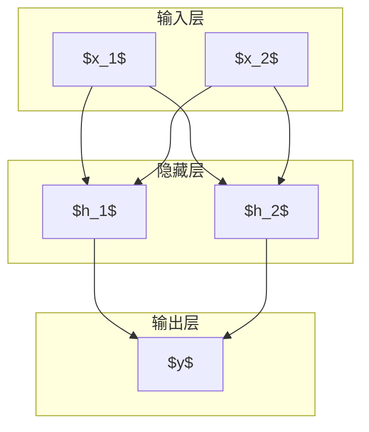

## 第六章 深度前馈网络

### 原文关键点

* **深度前馈网络（Deep Feedforward Network）**：也称为前馈神经网络或多层感知机（MLP），其目标是近似某个目标函数 $f^*$。模型定义映射 $y = f(x; \theta)$ 并通过学习参数 $\theta$ 来使 $f(x; \theta)$ 尽可能逼近 $f^*$。前馈网络没有反馈连接，信息从输入经隐藏层一路向前传播到输出（因此称“前馈”），与第十章介绍的**循环神经网络**相区别。
* **隐藏层与深度**：前馈网络由多层函数复合构成，例如 $f(x) = f^{(3)}(f^{(2)}(f^{(1)}(x)))$。除了输入层和输出层，中间的层称为隐藏层，因为训练数据并未直接给出它们的期望输出。网络的**深度**指层的数量，**宽度**指每层隐向量的维度。更深的网络通过逐层抽象可表达更复杂的函数，但也更难训练。
* **线性模型的局限与非线性激活**：仅有线性层的网络不管多深，都等价于线性模型，无法表达非线性关系。例如经典的 XOR 问题：线性模型无法学习异或函数（如 $f([0,1])=1, f([1,0])=1, f([1,1])=0, f([0,0])=0$），这是感知机模型的著名缺陷。为克服此局限，隐藏层需使用**非线性激活函数**（如Sigmoid、Tanh或ReLU）赋予网络逼近任意非线性函数的能力。
* **XOR 问题实例**：使用具有至少一层隐藏层的前馈网络可以学习实现 XOR。比如一个含2个隐藏单元的两层网络可拟合 XOR（参见图6.1、6.2）。梯度下降等算法能够找到XOR网络的全局最优解，并收敛于合适的参数，只是结果依赖于初始值。XOR实例说明了**表示学习**的威力：通过学习隐藏层表示，可以将原本线性不可分的数据映射到线性可分空间，再由线性输出层分类。
* **基于梯度的学习**：前馈网络通常通过**反向传播算法**和梯度下降训练。定义适当的**代价函数** $J(\theta)$，例如均方误差或交叉熵，对于给定训练数据计算梯度 $\nabla\_\theta J$，再用梯度下降更新参数 $\theta := \theta - \eta \nabla\_\theta J$（$\eta$为学习率）。反向传播利用链式法则高效地计算出每层参数的梯度。基于梯度的优化在深度学习中取得巨大成功，同时需要注意局部极值、梯度消失等问题（后续章节讨论）。
* **架构设计**：设计前馈网络需要决定隐藏层数、每层单元数、激活函数类型等。**万能近似定理**表明，具有足够隐藏单元的单隐层网络即可逼近任意连续函数，但深层网络能够更高效地表示复杂函数（用较少参数逼近复杂关系）。实践中，层数和规模常需通过验证集调试选择。激活函数的选择很重要：历史上Sigmoid/Tanh常用，但容易引起梯度消失；ReLU及其变种如今更流行，因为它们缓解了梯度消失并训练更快速。
* **历史笔记**：现代前馈网络的核心思想自80年代以来基本未变：仍然使用反向传播算法和梯度下降来训练。1986年Rumelhart等人在“并行分布处理”一书中首次成功应用反向传播训练多层网络，引发了研究热潮。之后神经网络热度在90年代初达到高峰，又在2000年代初一度低迷。2006年Hinton等引入逐层预训练引发深度学习复兴，计算能力和数据增长则是性能提升主因。1980s以来的重要改进包括：使用交叉熵损失替代均方误差解决饱和问题，使用ReLU等分段线性激活替代Sigmoid加速收敛和提高效果。

### 通俗解释

深度前馈网络就是我们常说的“多层神经网络”。可以将它想象成一个“函数工厂”：给定输入数据，前馈网络通过一层一层的计算，不断提炼出更高级的特征，最终产生输出结果。每一层的**神经元**可以理解为许多“小判别器”，它们各自对输入的某个方面做出响应。比如在图像识别中，第一层可能检测简单的边缘或颜色模式，第二层组合这些模式识别出局部形状，越往后层学到的特征越复杂（例如物体部件），直到最后输出整个物体的类别。

前馈网络被称为“前馈”，意思是信息总是单向向前流动：从输入到隐藏层再到输出，中途没有反馈回去的环路。这有点像流水线作业：原料（输入）经过一系列工序（隐藏层变换）最终产出成品（输出）。这样的设计与人脑的信号流动并不完全相同，但足够实用且易于分析训练。

**为什么需要多层？** 一个层数足够多、宽度足够大的神经网络理论上可以模拟任何复杂的数学函数关系。这意味着无论多么复杂的输入到输出映射（比如从一张图片到它属于的物体类别），都存在某个足够大的神经网络可以近似实现。这是深度学习强大表达能力的来源。当然，我们并不是真的无限制地增加层数和单元，因为那会带来训练效率和过拟合风险的问题。实践中，网络“深”到何种程度合适，需要结合任务难度和数据量来权衡。

**非线性激活的作用**：如果没有非线性（比如激活函数都用恒等映射），无论多少层串联都等价于一层，网络就退化成线性模型了，表现力非常有限。所以我们引入诸如Sigmoid、Tanh或ReLU激活函数，给予网络刻画非线性关系的能力。可以把激活函数想象成每个“小判别器”的决策规则，它不会对输入做线性响应，而是可以“弯曲”输出，使整个网络能够拟合弯弯曲曲的复杂曲面，而不仅是平面。

**XOR例子**：XOR（异或）是一个经典的小例子，揭示了非线性的必要性。XOR函数输出真仅当两个输入中有且只有一个为真，用表格看就是(0,1)->1, (1,0)->1, 其他->0。这函数用一条直线无法将输出为1的点和输出为0的点分开，因此任何纯线性的模型（感知机）都学不到它。但如果我们增加一个隐藏层，网络就能自行学习出一种**特征变换**：例如，学出一个隐藏单元表示“输入是否不同”，这样输出层只需对该特征做线性判断即可。这相当于网络自己发明了一个“隐变量”使问题线性可分。XOR例子虽然简单，却说明了隐藏层的价值——网络可以通过中间表示把复杂问题转化为简单问题来解决。

总的来说，深度前馈网络提供了一种**端到端**的机器学习方法：我们给它提供原始输入和期望输出，网络会自动调整内部参数来“记住”映射关系。与以往人工设计特征再做预测的方法不同，深度学习让特征提取这一关节也由机器自动完成，这就是所谓**表示学习**。当然，这种强大能力的另一面是网络有成千上万甚至上亿个参数，需要大量数据和计算才能训练好。不过随着数据集规模和计算力的增长（以及更好的算法和训练技巧的发明），前馈网络已成功应用在诸多领域，为后续章节介绍的各种深度学习模型奠定了基础。

### 数学推导

**1. 多层网络的函数表示**：一个 $L$ 层的前馈神经网络可以形式化为嵌套的函数复合。设第 $l$ 层的激活函数为 $g^{(l)}$，权重矩阵和偏置为 $W^{(l)}, b^{(l)}$，则对于输入 $x$，网络的计算过程为：

* **第1层（隐藏层1）**：$h^{(1)} = g^{(1)}( W^{(1)} x + b^{(1)} )$，
* **第2层（隐藏层2）**：$h^{(2)} = g^{(2)}( W^{(2)} h^{(1)} + b^{(2)} )$，
* $,\dots$
* **第L层（输出层）**：$y = h^{(L)} = g^{(L)}( W^{(L)} h^{(L-1)} + b^{(L)} )$。

其中$h^{(l)}$是第$l$层的输出向量（对隐藏层称为隐藏单元激活）。通常隐藏层采用如$\sigma(\cdot)$（Sigmoid）或$\tanh(\cdot)$或$\text{ReLU}(\cdot)=\max{0,\cdot}$等非线性激活函数，而输出层根据任务不同可以是线性或特殊的非线性（如分类任务常用softmax将输出映射为概率分布）。

上面的复合关系可简写为 $y = f(x; \theta)$，其中 $\theta = {W^{(l)},b^{(l)} \mid l=1,\dots,L}$ 表示全部参数集合。

**2. 代价函数与学习目标**：在监督学习中，我们为网络定义一个**代价函数**（损失函数）来度量预测 $f(x;\theta)$ 与目标 $y$ 之间的差异。常用的代价函数包括：

* **均方误差**：$J(\theta) = \frac{1}{N}\sum\_{i=1}^N | f(x^{(i)};\theta) - y^{(i)} |^2$（用于回归任务）；
* **交叉熵损失**：$J(\theta) = -\frac{1}{N}\sum\_{i=1}^N \sum\_{k} y\_k^{(i)} \log f\_k(x^{(i)};\theta)$（用于分类任务，将预测输出视为各类概率，$y\_k$为第$i$样本真实类别的独热向量）。交叉熵是最大似然准则下的对数损失函数，被广泛证明对分类网络更有效，避免了均方误差在Sigmoid输出饱和时导致的梯度变小问题。

深度学习的训练目标通常是**经验风险最小化**，即最小化训练集上的平均损失 $J(\theta)$。然而，我们更关心的是模型对真实数据分布的泛化风险。因此，除了降低训练损失，我们还会采用正则化等方法（第七章）避免过拟合，并使用验证集监控泛化性能。

**3. 反向传播算法**：为训练网络，我们需要计算代价函数对每个参数的梯度。由于网络的复合结构，可以用**链式法则**高效实现这个计算过程。以简单的3层网络 $y = f^{(3)}(f^{(2)}(f^{(1)}(x)))$ 为例，设损失函数为 $L = \ell(y,, y\_{\text{true}})$，则应用链式法则，可逐层得到梯度：

$$
\frac{\partial L}{\partial W^{(3)}} = \frac{\partial L}{\partial y} \frac{\partial y}{\partial W^{(3)}} , \qquad 
\frac{\partial L}{\partial W^{(2)}} = \frac{\partial L}{\partial h^{(2)}} \frac{\partial h^{(2)}}{\partial W^{(2)}} , \qquad 
\frac{\partial L}{\partial W^{(1)}} = \frac{\partial L}{\partial h^{(1)}} \frac{\partial h^{(1)}}{\partial W^{(1)}} ,
$$

其中 $\frac{\partial L}{\partial h^{(2)}} = \frac{\partial L}{\partial y}\frac{\partial y}{\partial h^{(2)}}$，而 $\frac{\partial L}{\partial h^{(1)}} = \frac{\partial L}{\partial h^{(2)}}\frac{\partial h^{(2)}}{\partial h^{(1)}}$。可见梯度计算从输出层开始，逐层应用链式法则传递到前一层，这正是\*\*反向传播（Backpropagation）\*\*的原理。利用矩阵形式和动态规划思想，反向传播能在每次前向计算后以类似时间完成所有梯度的求解，而不必重复计算子表达式。

值得注意的是，非线性激活函数的梯度在反向传播中很重要。例如Sigmoid函数 $\sigma(z)$ 的导数为 $\sigma'(z)=\sigma(z)(1-\sigma(z))$，当$\sigma(z)$接近0或1时导数趋近0，这解释了深层网络中梯度消失的问题——早期层由于连续乘上很小的$\sigma'$，梯度会越来越小。ReLU等激活由于梯度要么是1要么是0（输入<0时），在正向通过时避免了饱和区域，缓解了梯度消失。因此选用什么激活函数对深层网络能否成功学习影响很大。

**4. XOR网络实例解析**：一个解决XOR的两层网络示例如下：

* 输入层：两个输入 $x\_1, x\_2$；
* 隐藏层：2个隐藏单元，激活用Sigmoid，权重矩阵 $W^{(1)}$ 大小 $2\times 2$，偏置 $b^{(1)}$ 大小 $2\times 1$；
* 输出层：1个输出单元，激活用Sigmoid，权重 $W^{(2)}$ 大小 $1\times 2$，偏置 $b^{(2)}$ 标量。

手动设置适当的参数即可实现 XOR，例如文献给出一种解为：

$$
W^{(1)} = \begin{pmatrix} 1 & 1 \\ 1 & 1 \end{pmatrix}, \quad b^{(1)} = \begin{pmatrix} -0.5 \\ -1.5 \end{pmatrix}, \\
W^{(2)} = \begin{pmatrix} 1 & -2 \end{pmatrix}, \quad b^{(2)} = 0.5~,
$$

通过计算可以验证在这组参数下，网络输出正好符合 XOR 真值表。虽然实际训练时不太可能初始化即为这组完美参数，但梯度下降法可以不断调整参数逼近全局最优。对于简单问题如XOR，损失函数存在唯一的全局极小值且容易找到。但对于更复杂的深度网络，损失表面可能有多个局部极小值、鞍点等，这使优化变得困难（详见第八章）。

下图用两种风格示意了该 XOR 网络的结构：



*图6.2：XOR前馈网络结构示意图。* 左图风格展示每个神经元节点及全连接情况；右图用矢量节点表示整层激活，更紧凑。该网络有两个输入单元、一层含两个隐藏单元和一个输出单元（Sigmoid激活）。隐藏层提取了输入的中间特征，使得输出层可以线性分类完成XOR功能。

### 相关前沿研究

深度前馈网络作为深度学习的基础框架，许多现代前沿成果都是在这一框架上发展而来：

* **网络规模与性能提升**：过去十年中，深度前馈网络（特别是在图像和文本任务上）的层数和参数规模不断攀升，带来了显著性能提升。例如，2012年的AlexNet有约6000万参数，在ImageNet图像分类Top-1准确率约63.3%。2015年的ResNet-152层网络参数增加到6000万以上，Top-1准确率提升到约77.8%。2020年，Google的EfficientNet-L2通过更大规模的网络和教师学生训练策略，将ImageNet准确率推进到近90%。下图展示了ImageNet分类准确率的跨年提升：

::: echarts ImageNet 图像分类 Top-1 准确率提升

```json
{
  "title": {
    "text": "ImageNet图像分类Top-1准确率提升（2012-2020）",
    "left": "center"
  },
  "tooltip": {},
  "xAxis": {
    "type": "category",
    "name": "模型（年份）",
    "data": ["AlexNet (2012)", "ResNet-152 (2015)", "EfficientNet-L2 (2020)"]
  },
  "yAxis": {
    "type": "value",
    "name": "Top-1 准确率(%)",
    "max": 100
  },
  "series": [
    {
      "type": "bar",
      "data": [63.3, 77.8, 90.0]
    }
  ]
}

```
:::

*图6.3：ImageNet图像分类准确率随着网络发展而提升。* 2012年AlexNet是第一个深度卷积网络，取得约63%的Top-1准确率；2015年ResNet通过152层深度达到约77.8%；2020年EfficientNet结合高效结构搜索和大规模弱监督数据，将准确率推至90%左右。这反映了更深更大的前馈网络在大数据下能获得更优表现。

* **残差网络（ResNet）及极深网络**：2015年的ResNet引入“跳跃连接”（残差连接），成功训练了百层以上的前馈网络。跳跃连接缓解了梯度消失和网络退化问题，使得“极深”网络成为可能。ResNet系列网络在许多任务上长时间保持领先，是深度架构设计的重要里程碑。残差思想也被应用到各种模型中，成为现代神经网络的基本组件之一。

* **自适应激活与归一化**：前馈网络中的激活函数和归一化技巧仍是研究热点。例如，Swish、Mish等新激活函数被提出以提供更平滑的非线性，相对ReLU在一些任务上有微小提升。**批归一化（Batch Normalization）** 发明于2015年，被证明可以加速训练和稳固深层网络收敛。它通过标准化每一批次的中间层激活缓解了协变量偏移问题。这一技术几乎成为现代前馈网络的标配，也启发了LayerNorm、InstanceNorm等变体在不同场景应用。

* **网络架构搜索（NAS）**：如何手工设计网络层数、每层宽度等超参数是个复杂问题，近年来出现了**神经架构搜索**，通过自动算法（强化学习、进化算法等）寻优网络结构。例如Google的AutoML和Facebook的NAS研究，相继产出了像NASNet、MnasNet、EfficientNet等自动设计的卷积网络，在移动设备等受限环境下表现突出。NAS本质上还是在前馈网络框架上进行，只是把人的设计决策交给了算法。

* **纯MLP的新活力**：有趣的是，2021年出现了一类纯前馈（仅全连接层）但能在视觉任务上竞争卷积网络的架构，如Google提出的MLP-Mixer。MLP-Mixer以MLP替代卷积和注意力，在超大数据预训练下取得接近卷积网络的性能。这表明前馈网络加足够数据也能提取视觉模式。这些研究重新激发了对纯前馈结构的兴趣，促使人们审视卷积和注意力以外的可能性。

* **Transformer的崛起**：Transformer模型虽然引入了自注意力机制，但从结构上看本质仍是前馈网络（注意力层+前馈层堆叠）。特别是在自然语言处理领域，Transformer已经取代循环网络成为主流。Transformer去除了序列依赖，实现了更高的并行度和更深层的前馈计算，使得GPT-3等超大模型成为可能。Vision Transformer (ViT) 则将Transformer应用于图像，将图像切块后喂入前馈Transformer架构，2020年首次在图像分类上达到与卷积网络可比甚至更优的水平。Transformer的成功亦可被视为前馈网络的一次拓展，它证明通过适当的模块（注意力）和足够数据，前馈结构可以在不同领域取得卓越表现。

* **大规模预训练模型**：当今最前沿的AI成果大多基于大规模前馈架构预训练然后微调。例如OpenAI的GPT系列（GPT-3有1750亿参数）就是解码器Transformer的巨型前馈网络，经在海量文本上训练后，具有惊人的生成和理解能力。与传统监督学习不同，预训练模型可以迁移到下游任务，展现了强大的Few-Shot甚至Zero-Shot学习能力。这一趋势显示，深度前馈网络在规模和数据上突破后，能够涌现出新的智能行为。

总之，深度前馈网络是现代深度学习的基石。无论是计算机视觉的卷积网络、自然语言处理的Transformer，还是新兴的多模态模型，其核心都可以看作某种前馈架构加以专门化和改进而来。随着研究的推进，我们持续在这一简单而强大的范式中发掘潜力：更深的层次、更宽的维度、更有效的训练技巧，都在不断拓展前馈网络能够达成的边界。

### 示例代码

下面以一个简单示例演示如何使用PyTorch构建和训练一个前馈网络来学习XOR函数。我们使用2个隐藏单元的MLP，通过梯度下降在四个可能输入上训练：

```python
import torch
import torch.nn as nn
import torch.optim as optim

# 构建数据集：4个可能的二元输入及XOR输出
X = torch.tensor([[0.0,0.0],
                  [0.0,1.0],
                  [1.0,0.0],
                  [1.0,1.0]])
Y = torch.tensor([[0.0],[1.0],[1.0],[0.0]])  # 异或输出

# 定义两层前馈网络
class XORNet(nn.Module):
    def __init__(self):
        super(XORNet, self).__init__()
        self.hidden = nn.Linear(2, 2)   # 隐藏层2单元
        self.output = nn.Linear(2, 1)  # 输出层1单元
        self.activation = nn.Sigmoid()
    def forward(self, x):
        h = self.activation(self.hidden(x))
        y = self.activation(self.output(h))
        return y

model = XORNet()
criterion = nn.BCELoss()  # 二分类交叉熵损失
optimizer = optim.SGD(model.parameters(), lr=0.1)

# 训练网络
for epoch in range(10000):
    optimizer.zero_grad()
    y_pred = model(X)
    loss = criterion(y_pred, Y)
    loss.backward()
    optimizer.step()

# 测试模型输出
with torch.no_grad():
    print(model(X))
```

运行上述代码，经过足够轮数的训练后，模型输出将非常接近 `[0, 1, 1, 0]^T`。可以看到，构建这样一个小型前馈网络仅需定义线性层和激活函数，PyTorch的自动求导机制会帮我们完成梯度计算和参数更新，实现了上文描述的反向传播训练过程。在实际场景中，我们会用更复杂的网络和更大的数据集，但核心流程是类似的：**定义模型**，**定义损失和优化器**，然后在训练循环中反复执行前向传播、计算损失、反向传播、更新参数。通过这样的训练，前馈网络能够逐步调整自身参数，把训练数据的输入映射到正确的输出。

## 第七章 深度学习中的正则化

### 原文关键点

* **正则化的定义**：正则化（Regularization）是指我们对学习算法做出某种修改，以降低其**泛化误差**而非单纯降低训练误差。换言之，正则化技术旨在防止模型在训练数据上学得太“好”（即过拟合），从而提高模型对新数据的性能。在机器学习中，正则化与优化同等重要。
* **过拟合与欠拟合**：正则化讨论的背景是偏差-方差权衡。模型过于复杂、参数过多时容易**过拟合**（记住训练集细节，导致验证/测试误差增大）；模型过于简单、容量不足时则会**欠拟合**（训练误差和验证误差都居高不下）。正则化提供工具来降低过拟合的风险，使模型更简单或对输入扰动更鲁棒，从而减少泛化误差。
* **参数范数惩罚**：最常用的正则化策略是在目标函数中加入参数的范数惩罚项。典型如**权重衰减（L2正则化）**：在损失后加上 $\frac{\lambda}{2}|w|\_2^2$ 项，鼓励权重取较小值。例如，对于线性回归，优化目标变为最小化 $J(w)=\frac{1}{N}\sum\_i (y\_i-\hat{y}\_i)^2 + \frac{\lambda}{2}|w|\_2^2$。这样的模型倾向于用较小的权重幅度来解释数据，避免个别参数过大导致过拟合。另一个是**L1正则化**（Lasso），惩罚 $|w|\_1$，会产生稀疏权重解。L2惩罚使解更平滑；L1惩罚则可实现特征选择（许多权重被压零）。
* **约束形式的正则化**：范数惩罚等价于对参数施加软约束。另一种等价观点是直接**约束参数空间**：如强制权重范数不超过某个阈值，而非在损失加惩罚。两者在Lagrange乘子理论下是等价的，只是实现方式不同。无论罚项还是约束，其效果都是限制模型复杂度。
* **正则化与欠定问题**：在参数多于样本的欠定情况下，纯经验风险最小化会有无穷多解且容易过拟合。正则化相当于引入先验偏好，选择其中较“简单”的解。例如对线性回归使用微小的L2惩罚，相当于求解最小范数解（Moore-Penrose伪逆），得到光滑的拟合。因此正则化对在小样本下训出的模型尤为重要，可显著降低方差。
* **数据增广（augmentation）**：这是提高泛化性能的强力方法，不直接修改模型而是扩充训练数据。通过对训练样本施加不改变其语义的随机变换（如图像的旋转、平移、缩放、翻转，或音频的时频掩蔽等），模型被迫学到对这些变换不变的特征，从而更具鲁棒性。数据增广本质上提供了一种“内在正则化”，在不引入额外正则项的情况下降低过拟合倾向。对于数据较少的任务（如医学图像），设计良好的增广策略能大幅提高模型表现。
* **噪声鲁棒性**：与数据增广类似，在模型训练过程显式加入噪声也是正则化手段之一。例如对输入加入小高斯噪声，等价于对模型学习到的函数施加平滑约束，使其不要对输入的小变化过于敏感。另一个常用的是**梯度噪声**（在梯度下降更新时加噪），或直接对隐藏单元激活加噪。其效果相当于让模型学习“忽略”细微扰动，更关注全局趋势，从而增强泛化。
* **半监督学习**：当标注数据很少时，可以利用大量未标注数据进行正则化。典型做法是**自训练**或**伪标签**：用当前模型去预测未标数据的标签，再把高置信度的预测当作额外训练数据。还有**一致性正则**方法，如对同一未标样本施加不同噪声，两次前向输出应保持一致（Π模型等）。这些策略将无标签数据的信息融入训练，在不增加显式惩罚的情况下约束模型在真实数据分布上的行为。
* **多任务学习**：让模型同时学习多个相关任务，可以起到正则化作用。因为模型必须在不同任务间共享部分表示，某任务的噪声或特异模式不会完全主导内部表示，从而降低过拟合风险。多任务学习常通过共享部分层来实现，相当于对参数施加软约束（不同任务的梯度在共享参数上共同作用）。实践中，多任务学习不但提升泛化，也能提高训练数据的利用效率，在每个任务上表现可能优于独立训练。
* **提前终止（Early Stopping）**：一种简单而有效的正则化策略。它利用验证集监控模型泛化性能，当验证损失不再降低甚至回升时，就提前停止训练。此时尽管训练误差还在下降，但模型已开始过拟合验证集，所以提早停止可避免过拟合。提前终止相当于给训练过程加了一个正则项：限制迭代次数，使最终模型不是训练误差的全局极小，而是在某个非极小点上停止。这通常能取得较优的泛化表现。
* **参数共享/绑定**：在第九章卷积网络中会看到，通过让不同模型部位共享相同参数，也是一种正则化形式。例如卷积层中一个卷积核在各位置复用，这极大减少了参数数量，相应降低了过拟合风险。同样在循环网络中，各时间步间共享权重，使模型更受结构约束。参数共享等价于对参数施加**等同性约束**，从而有效减小模型自由度。
* **稀疏表示**：鼓励隐藏层的激活大部分为0，也是一种正则化思想。这可通过对隐藏单元输出施加L1范数惩罚或KL散度惩罚来实现（如稀疏自编码器）。稀疏约束使模型倾向于每次只激活少数单元，取得类似特征选择的效果，有助于提高泛化并解释模型内部机理。
* **Bagging和集成方法**：Bagging（自助聚袋）通过对训练集自助采样训练多个模型并平均结果，减少模型预测的方差。深度学习中，训练多个独立神经网络再集成尽管有效，但成本高。Dropout（稍后介绍）可以被视为对指数多个子网络进行Bagging的近似。除此之外，也有用不同初始化或不同超参训练多个模型做集成的方法。集成方法通常能提升稳定性和泛化，但因为需要多个模型，部署时代价较大。
* **Dropout**：深度学习中特有且极其有效的正则化技术。在每次训练前向过程中，随机“丢弃”一部分隐藏单元（将其激活置零）。这意味着每个小批量训练时网络结构都在变化，相当于同时训练了 $2^n$ 种不同结构的子网络（这里 $n$ 是丢弃的单元数），而这些子网络共享参数。Dropout迫使网络不能过度依赖某些局部特征，因而提高了鲁棒性。推理时，则不丢弃单元，而是将训练时丢弃概率$p$乘到输出上（或等效地在训练时以$\frac{1}{p}$放大激活）。Dropout显著减少过拟合，在图像识别、语音识别等任务中成为标配的正则化手段之一。
* **对抗训练**：通过利用**对抗样本**增强模型鲁棒性的新型正则化。对抗样本指对输入加上人类不可察觉的小扰动却能令模型误分类的样本。例如针对图像分类网络，可以计算输入图像梯度的符号并乘以很小的$\epsilon$作为扰动 $\delta = \epsilon ,\mathrm{sign}(\nabla\_x J(\theta,x,y))$，生成对抗样本 $x' = x + \delta$。模型在训练时一并对正常样本和对抗样本拟合，使得决策边界对输入微扰更稳定。这实质是在损失函数中加入了一种复杂的正则项：**最大化**输入扰动后的损失的约束。实践表明，对抗训练能极大提升模型抵抗恶意扰动的能力，也被用作提高模型鲁棒性的标准方法之一（但也使训练过程更慢更难）。有趣的是，对抗样本还可用于半监督：将模型对无标签数据产生的对抗扰动保持输出不变作为额外训练目标（虚拟对抗训练）。
* **流形正切、契约自编码等**：本章最后介绍了一些基于流形平滑的高级正则化方法，例如**契约性（Contractive）正则化**通过惩罚隐藏表示对输入的Jacobian范数，鼓励模型在数据流形切面上不变；**流形正切分类器**类似地利用数据流形的切线方向添加惩罚。这些方法在特定情况下有效，但实现和调试较复杂，在日常应用中不如前述通用策略常见。

### 通俗解释

在机器学习里，“正则化”可以理解成给模型“降降妖、收收神”的过程。深度神经网络参数众多，威力无比，如果不加约束地训练，它可能会**过拟合**训练数据：也就是把训练样本的噪声和偶然性也当成了规律记下来，导致在新样本上表现不佳。正则化就是要防止模型学得“太过头”，确保它学到的是一般性的模式而非特例。

一个通俗的比喻：假设你在训练一个学生（模型）做数学题（预测）。如果死命让他练习题库里的题（训练集），他也许会把题目的答案全背下来（过拟合），但遇到新题就束手无策。作为老师，你会怎么做？你可能会：

* 不鼓励他死记硬背细节，而是记住方法（这像**权重衰减**，惩罚大权重，迫使模型用更平滑的方式拟合数据）。
* 给他多变换一下题目的问法或条件，让他学会举一反三（这像**数据增广**，通过变换数据让模型学会对变化不敏感）。
* 让他多兼顾几门相似的学科，不要在一道题上抠太细（这像**多任务学习**，不同任务共享表示，使模型更一般化）。
* 看到他学得有点过头，就赶紧喊停，别学偏了（这就是**提前停止**，验证集性能变差时停止训练）。
* 教他遇事不要只看一个点，要多方面考虑（这像**Dropout**，随机屏蔽部分隐单元，逼迫模型从多角度学习）。
* 还可以故意出一些迷惑人的题考他，训练他对抗陷阱（这类似**对抗训练**，让模型面对有意设计的干扰也能正确）。

这些策略都是为了让模型“别太贪心”，在训练数据上留一点余地，从而在新数据上表现更稳健。

具体来说：

* **参数范数惩罚**（如L2、L1）：是直接告诉模型“你的参数不能太大或者太多有效”。比如L2就像让每个权重上绑个皮筋，权重一变大皮筋就拉回来一点。这让模型更偏好较小权重，即不要对某个特征过度敏感。
* **数据增广**：从人的直觉看，如果一张猫的照片翻转一下还是猫，那么一个在正常照片上训练的模型也应该在翻转照片上认出猫。通过对训练图像随机翻转、裁剪、改变亮度颜色等等，模型见过了各种情形，自然就不会被某个固定角度或背景所迷惑。这类似于让学生做同一道题的不同变化版本，如果每次都答对，他是真的懂了而不是只记住数字。
* **Dropout**：可以想象每次训练都随机“关闭”一部分神经元，好比让一部分“记忆”暂时失效。于是模型不能完全依赖某条特定路径来传递信息，它不得不冗余地利用多条路径才能完成任务。这就像团队作战时，让小队队员随机休息，剩下的人还得把任务完成，于是大家都会尽可能掌握全局。最终模型学到的是更健壮的组合特征，不会因为某个单元输入略有变化就整体失灵。
* **提前停止**：这是实用中非常常用的招数。我们在训练时隔一段时间就拿出一份不参与训练的数据（验证集）测试模型。如果发现模型对验证集的误差开始上升了，就说明模型开始记训练集“偏题”了，于是当机立断停止训练，使用此时的模型参数。这样模型不会走得太远而过拟合。它相当于把迭代次数这个超参数通过验证集自动调节到了最佳。
* **多任务学习**：让一个模型一心多用，效果往往比各自训练还好。这有点像让一位学生同时学数学和物理，因为物理里的数学方法也通用，所以学物理的过程巩固了数学技能。这在模型上表现为不同任务共享了一些中间神经元，这些神经元不会偏向某单一任务的数据分布，因此更普适。
* **对抗训练**：有点像武侠小说里的魔鬼训练——让模型面对自己最薄弱环节被放大的情况。例如，对于图像模型，我们找出能让它误判的最小像素扰动，并把这样的“陷阱图像”也用于训练。虽然过程残酷，但模型由此学会在微小扰动下也保持判断不变。这大幅提升了模型的鲁棒性，避免被恶意攻击（如对抗样本）所迷惑。

总的来说，正则化是在模型复杂度和训练效果之间寻求平衡的一组方法。它试图回答：“怎样的模型既能很好地解释训练数据，又不过度契合偶然因素？” 深度学习中，正则化尤其重要，因为深度网络非常灵活，稍不加约束就会记住一切。所以我们通过上述各种招式，让模型变得“笨拙”一点——比如限制参数大小、增加数据多样性、随机丢弃信息等——反而能使模型更聪明地掌握事物的本质。而找到正则化力度的“甜蜜点”，需要经验和实验：正则太弱，模型可能过拟合；正则太强，又可能欠拟合。好的正则化让模型泛化能力显著提升，是打造可靠AI的关键之一。

### 数学推导

**1. L2和L1正则化**：对于线性模型 $f(x) = w^T x + b$，加入L2正则化（权重衰减）的目标函数为：
$J(w) = \frac{1}{N}\sum_{i=1}^N \mathcal{L}(f(x^{(i)}), y^{(i)}) + \frac{\lambda}{2}\|w\|_2^2,$
其中$\mathcal{L}$是原始损失（如均方误差或交叉熵），第二项是正则项。对于二次损失的情况（如均方误差），我们可以直接解析求解L2正则化的最优值。这实际上等同于在求解正规方程时，多加了 $\lambda I$ 项（岭回归）。L2惩罚的梯度很简单：$\nabla\_w \frac{\lambda}{2}|w|^2 = \lambda w$，所以在每次参数更新时，相当于让 $w$ 乘以 $(1 - \eta \lambda)$（对于SGD一步）——这可以视为对参数的指数衰减。

L1正则化对应正则项 $\lambda |w|\_1 = \lambda\sum\_j |w\_j|$。它的梯度在$w\_j \neq 0$时为 $\lambda \operatorname{sign}(w\_j)$，在$w\_j=0$处不可导（可取一个子梯度）。L1的一个效果是可以产生稀疏解，因为当$\lambda$足够大时，一些梯度更新会使$w\_j$直接降为0并停留在0。实际优化L1常用坐标下降或近端梯度等方法，因为普通梯度法在0点的处理需要特殊对待。

**2. Dropout的数学期望**：Dropout训练时，对于某一层的每个激活 $h\_i$ 引入独立Bernoulli掩码 $m\_i \sim \text{Bernoulli}(p)$（keep概率$p$）。训练前向过程中计算 $\tilde{h}\_i = m\_i h\_i$，意味着该单元以概率$(1-p)$归零。由于 $\mathbb{E}[m\_i]=p$，可以证明Dropout相当于对激活加了一个以0为均值的噪声，使输出的期望保持不变。如果训练时不调整，测试时需要将输出按$p$缩放，即 $h\_i^{\text{test}} = p, h\_i^{\text{train (no dropout)}}$。另一种实现等价但更方便：**反向缩放**，即在训练阶段激活被置零时用 $\frac{1}{p}$放大幸存的激活，从而保证每个激活的期望与未dropout时相同。这样测试时就不需要额外缩放。Dropout的效果可以从集成角度理解：它训练了一个指数级数量的子网络，并在测试时对它们的输出取平均，这平均过程降低了模型的方差。由于难以显式求出所有子网络，Dropout提供了一个随机近似方式实现这种集成。

**3. 提前停止判据**：在实践中，提前停止需要精确定义“验证性能不再提升”的判据。通常我们会设置一个耐心值（patience）：如果验证集指标在若干epoch内未见改进，就终止训练并回滚到指标最优时的参数。形式化地，令 $J\_{\text{val}}(t)$ 表示第$t$个epoch结束时模型在验证集上的损失，我们监控 $J\_{\text{val}}(t)$ 的变化。当存在某个 $t\_0$ 使对于所有 $t > t\_0, \ J\_{\text{val}}(t) > J\_{\text{val}}(t\_0)$ 且持续$d$轮，我们判定过拟合开始，并将最优参数 $\theta(t\_0)$ 作为最终模型。这等价于在训练目标中加入一项特殊的正则化，限制训练迭代次数不超过 $t\_0$。从优化角度看，训练在 $t\_0$ 时并未达到训练损失的极小值点，但从泛化角度这是最佳停止点。提前停止因其实现简便且效果显著，被广泛应用于各种模型训练流程。

**4. 对抗扰动与损失梯度**：对抗样本利用了模型决策边界的脆弱性，形式上可表述为一个优化问题：给定输入$x$和真实标签$y$，找到一个小扰动$\delta$使得模型损失最大化：
$ \delta^* = \arg\max_{\|\delta\| < \epsilon} \mathcal{L}(f(x+\delta;\theta), y).$
对于可微模型，最大损失方向通常在损失对输入的梯度方向上。因此Fast Gradient Sign Method（FGSM）取 $\delta = \epsilon, \mathrm{sign}\big(\nabla\_x \mathcal{L}(f(x;\theta), y)\big)$作为近似最优扰动。这让每个像素（或每个输入维度）朝让损失增加最快的方向改变一个微小步长$\epsilon$。对抗训练中，我们将损失函数修改为同时包含原始样本和对抗样本的损失，例如：
$J(\theta) = \mathcal{L}(f(x;\theta),y) + \mathcal{L}(f(x+\delta^*;\theta),y),$
并对这个目标求梯度下降。在实现时，通常每个mini-batch先计算当前模型下针对每个样本的FGSM扰动，然后将扰动样本加入batch，再进行正常的前向反传。对抗训练等价于一种特殊的正则化：它在函数空间上约束模型的局部平滑性，要求模型对沿损失梯度方向的小扰动保持不变。注意对抗训练会显著增加计算量，因为每步更新都需要额外一次甚至多次前向+反向来找到对抗扰动。但其收益是模型在应对输入分布变化和恶意攻击时鲁棒性大大增强。

**5. 半监督一致性正则**：假设我们有无标签样本$x$，模型当前预测为$\hat{y}=f(x;\theta)$。半监督一致性正则方法会对$x$施加某种变换或扰动得到$x'$，要求模型对两者输出一致，即增加惩罚$|!f(x';\theta)-f(x;\theta)!|^2$。这种方法期望模型的决策函数在数据流形周围是平滑的。特别地，**虚拟对抗训练**将$x'$选为能最大增加KL散度的对抗扰动版本$x+\delta\_{\text{virt}}$。然后施加正则项$D\_{\text{KL}}(f(x;\theta)| f(x+\delta\_{\text{virt}};\theta))$来鼓励模型输出分布在扰动前后保持一致。这样，无标签数据通过约束模型在数据支撑区域附近的行为，起到了类似有标签数据的作用。实验证明这种方法在半监督学习中效果显著，因为它充分利用了无标签样本蕴含的流形信息进行正则化。

### 相关前沿研究

正则化作为防止过拟合的核心手段，在深度学习时代也不断发展出新的技术和思想：

* **大模型的正则化需求**：随着模型参数数量爆炸式增长（如GPT-3有上百亿参数），正则化比以往任何时候都重要。巨大的模型有记忆海量数据的能力，若无足够约束，很容易过拟合训练集甚至训练步骤（例如在语言模型中，模型可能直接记住训练语料中的句子）。因此诸如**Dropout**、权重衰减依然在训练大模型中扮演关键角色。此外，大模型通常配合**预训练-微调**范式：先在海量多样数据上预训练，再在下游小数据上微调。预训练本身可视为一种正则化，它为模型注入了广谱的先验知识，使微调时不易过拟合小数据，提高了泛化能力。这也是为何预训练模型在低资源任务上表现远胜从零训练的小模型。

* **Batch Normalization的正则效应**：批归一化主要目的是加速训练、稳定梯度，但副产物是它也起到一定正则化作用。因为BN在训练时对每个batch计算均值方差，引入了一些随机噪声，使模型不会过度依赖某一层的绝对尺度。此外，BN使大网络在不损失表现的情况下可以使用较大学习率和减少Dropout强度，这某种意义上帮助模型学习到更平滑的解。尽管严格说BN不属于正则化方法，但其使用往往减少了对其他强正则化（如高Dropout率）的需求。

* **新型正则化策略**：研究者持续探索新的正则化方式。例如**Label Smoothing**（标签平滑），在训练分类模型时将one-hot标签分布稍微平滑（如把90%的质量给真实类，10%均匀分给其他类），避免模型过度自信地输出某一类。这在图像分类中是标配技巧，被证明可以提高Top-1准确率并改善模型对不确定样本的校准。再如**Mixup**数据增强，将两张图像按某比例如线性混合，同时标签也按比例混合去训练模型，使模型输出对输入线性变化，更加线性可预期。这种方法对很多任务都有效，相当于对模型的输入-输出映射施加了线性约束（也属正则化一类）。

* **模型压缩与蒸馏**：模型压缩技术如**网络剪枝**和**量化**也可以视为一种正则化思想的延伸。剪枝通过移除不重要的连接或神经元来简化模型结构，相当于对参数引入了“可以为0”的先验（很多剪枝算法本质就是L1正则或L0正则近似）。量化把高精度参数降低到低比特表示，等价于对参数施加一种离散约束。这些技术除了实现模型加速外，也能提高模型泛化（因为简化了模型）。**知识蒸馏**则通过一个大模型（教师）指导小模型（学生）学习，目标是让小模型的预测分布接近教师模型。这使得学生模型在训练时获得额外的平滑目标，比直接学习one-hot标签更具有信息量（如教师分布中包含类间相似度），也是一种隐式正则化。因此蒸馏后的小模型常常表现比直接训练更好。蒸馏已被广泛用于在保证性能的前提下压缩模型，是工业界部署大模型的关键技术之一。

* **对抗鲁棒性与正则化**：2017年前后，Szegedy和Goodfellow等发现了对抗样本现象，引发模型鲁棒性研究热潮。对抗训练被视为提升鲁棒性的金标准，但代价高昂。有些研究致力于寻找更高效的鲁棒正则化，如**随机平滑**（对输入加噪声取平均预测，可证明提升$\ell\_2$扰动下鲁棒性）等。不过这些技术往往权衡了标准精度。另一个进展是**对抗蒸馏**，通过将对抗训练融入知识蒸馏流程，让学生模型在蒸馏时同时增强鲁棒性，试图以较低成本获得稳健模型。总之，在安全关键应用中，提高模型抵御输入扰动和分布偏移的能力已成为重要课题，与正则化密切相关。

* **隐式正则化**：值得一提的是，深度学习中存在一些“隐式正则化”效应。例如，小批量梯度下降自带的噪声对模型有正则化作用，使其倾向于陷入平坦的广阔谷底而非陡峭极值，因而泛化更好。又如网络结构本身带来的归纳偏置也是正则化的一种形式（比如卷积的平移不变性、Transformer的序列建模偏置等）。当前有研究试图解释，为什么极度过参数化的深度网络在训练集上可以零误差，但仍然在测试集上表现不错——这暗示着优化过程和网络结构本身起到了选择简单解的作用，就像有某种隐含的正则化在发挥作用一样。这方面的理论研究（比如神经切线核NTK、流形PAC-Bayes等）正在深入，旨在揭示深度模型泛化的原理。

* **AutoML中的正则化**：自动机器学习（AutoML）系统在搜索模型和超参数时，也往往要考虑正则化因素。现代AutoML会自动调整如L2惩罚系数、Dropout比例、数据增强策略等，以找到最佳泛化性能的组合。例如AdaTune等方法可以在训练中动态调整正则化强度。当模型临近过拟合，自动加强正则；反之则降低。这些智能系统体现了正则化的重要性——甚至交由算法来控制正则化。

总之，随着深度学习在越来越复杂的数据和任务上应用，我们需要更精细和强大的正则化手段来保证模型可靠泛化。从经典的权重惩罚到新颖的对抗训练，正则化技术不断演进，确保深度模型不偏离“学习一般规律”的轨道。未来，我们可能看到针对不同领域、不同模型量身定制的正则化策略涌现，使AI模型既有高表现力，又具备高可靠性和稳健性。

### 示例代码

这里演示如何在PyTorch中利用正则化技术构建和训练模型。我们以一个简单的全连接网络为例，并应用L2权重衰减和Dropout：

```python
import torch
import torch.nn as nn
import torch.optim as optim

# 一个简单的两层前馈网络用于示例
class SimpleNet(nn.Module):
    def __init__(self, input_dim, hidden_dim, output_dim):
        super(SimpleNet, self).__init__()
        self.fc1 = nn.Linear(input_dim, hidden_dim)
        self.dropout = nn.Dropout(p=0.5)       # 以50%概率丢弃
        self.fc2 = nn.Linear(hidden_dim, output_dim)
    def forward(self, x):
        x = torch.relu(self.fc1(x))
        x = self.dropout(x)    # 训练时将部分激活置零
        y = self.fc2(x)
        return y

model = SimpleNet(input_dim=100, hidden_dim=50, output_dim=10)

# 定义损失函数和优化器，使用L2正则（即weight_decay参数）
criterion = nn.CrossEntropyLoss()
optimizer = optim.SGD(model.parameters(), lr=0.1, weight_decay=1e-4)
```

在上面的代码中，我们定义了一个包含一个隐藏层的简单网络，并在隐藏层后添加了`nn.Dropout(p=0.5)`。优化器使用SGD，指定`weight_decay=1e-4`即为L2正则项的系数λ（PyTorch的实现会将所有权重参数的梯度加上$1e!-!4 \times w$）。训练过程与常规训练相同，不需要因为正则化而做特别修改：

```python
for epoch in range(num_epochs):
    for inputs, labels in train_loader:
        optimizer.zero_grad()
        outputs = model(inputs)
        loss = criterion(outputs, labels)
        loss.backward()
        optimizer.step()
    # 每个epoch结束，可计算验证集损失监控提前停止
    val_loss = evaluate(model, val_loader)
    if val_loss < best_val_loss:
        best_val_loss = val_loss
        patience_counter = 0
    else:
        patience_counter += 1
        if patience_counter >= patience:
            print("验证损失无改进，提前停止训练")
            break
```

如上，我们使用验证集损失来实现**提前停止**（patience为容忍轮数）。综合这些正则化措施，这个模型在训练过程中会：L2正则限制权重大小、Dropout随机丢弃特征来防止过拟合、提前停止根据验证性能决定训练轮数。它们相互配合，提高模型泛化能力。

需要注意，在预测或评估阶段，应调用`model.eval()`将Dropout层设置为不丢弃模式。例如：

```python
model.eval()  # 切换到评估模式
with torch.no_grad():
    total_correct = 0
    for inputs, labels in test_loader:
        outputs = model(inputs)
        preds = outputs.argmax(dim=1)
        total_correct += (preds == labels).sum().item()
    print(f"测试集准确率: {total_correct/len(test_dataset):.2%}")
```

这样，模型在测试时不会进行随机丢弃，确保使用全部神经元的能力来预测结果。通过上述代码示例，可以体会在PyTorch中使用正则化非常方便：L2正则只需在优化器中设置参数，Dropout在训练和测试时PyTorch会自动切换行为。正则化往往是深度学习实践中的必要一环，良好的正则化可以让模型训练更加稳定，最终表现更优。

## 第八章 深度模型中的优化

### 原文关键点

* **学习和纯优化的区别**：深度模型训练的优化过程与传统数学优化有所不同。在机器学习中，我们关心的是提高模型在**未见测试数据**上的性能度量$P$，往往不能直接优化$P$，而是借由最小化训练集上的某个损失函数$J(\theta)$来间接达到目标。纯优化则相反，直接最小化给定目标$J$本身。因此，机器学习优化常常不是将$J(\theta)$推到极致（那可能过拟合），而是在适当时刻停止或引入正则项以确保模型泛化。一个显著不同是，训练算法通常**不会**收敛到$J$的临界点；例如我们用提前停止在验证集性能最佳时就停止训练，而那时训练集梯度可能并未为零。
* **神经网络优化的挑战**：训练深度神经网络是一个高度非凸的优化问题，存在诸多困难。传统优化喜欢处理凸函数，因为任一局部极小都是全局最小。但深度网络的损失充满**局部极小值**、**鞍点**和**平坦高原**等复杂地形。幸运的是，研究发现局部极小值本身可能并非主要问题，因为许多局部极小值的代价与全局解接近，不会显著影响泛化。反而**鞍点**和**平坦区域**更令人头疼：梯度在鞍点处为零但不是最优，平坦高原区域梯度接近零导致学习停滞。深度网络的优化常被比喻为“在多峰多盆的迷雾山谷中寻找最低点”，并且这个“地形”会随批量随机梯度而抖动改变。
* **Ill-conditioning（病态）**：这是深度优化的另一大挑战。病态指问题的Hessian矩阵条件数很高，导致某些方向上梯度变化剧烈。直观来说，损失谷底非常扁的方向梯度很小，而陡峭方向梯度大，如果使用统一学习率，沿陡峭方向必须选小步长避免发散，但这又令扁方向几乎不前进。结果就是梯度下降可能“卡”在某些区域，移动极其缓慢。病态在深度网络中相当常见，比如sigmoid网络在饱和区梯度很小、ReLU网络中不同激活模式切换也造成Hessian谱不良。为缓解病态，一般策略包括：合理初始化让初始梯度均衡（详见参数初始化）、使用自适应学习率算法调节不同方向步长、或者引入二阶信息的方法。不过由于深度网络的非凸性，经典牛顿法等需要大幅调整才能应用。
* **基本优化算法**：深度学习中最重要的优化算法是\*\*随机梯度下降（SGD）\*\*及其变种。SGD并非直接使用全训练集梯度，而是每次用一个小批量（mini-batch）的样本估计梯度并更新参数。这极大提高了计算效率，也带来了梯度噪声，使优化具有跳出局部坑的能力。标准SGD更新规则：$\theta := \theta - \eta \nabla\_\theta J(\theta; B)$，其中$B$为当前批数据。相比全批量梯度下降，SGD在逼近极小值时不会停滞，而是围绕极值附近随机波动，有一定隐式正则化效果。
* **动量法（Momentum）**：为加速SGD收敛，引入了**动量**思想。动量算法给参数附加一个速度变量$v$，更新时积累梯度冲量：$v := \mu v + \nabla\_\theta J(\theta)$，$\theta := \theta - \eta v$。其中$\mu$是动量因子（常取0.9）。直观上，动量就像在损失地形上推一个小球，梯度是受力，小球会积累惯性朝谷底滚动。这样遇到长期同向梯度时速度越来越快（加速下坡），遇到损失平缓或噪声震荡时，惯性可帮助减小抖动、稳定前进。**Nesterov加速梯度**是动量的改进版本，它先用当前速度预估一下前进位置，再计算该位置的梯度用于校正，加快收敛同时更精确。实践中，带Nesterov的动量SGD是深度网络训练常用配置。
* **参数初始化策略**：良好的初始化对于深层网络的成功训练至关重要。若初始权重过大，进入激活函数饱和区，梯度接近0；过小又导致信号逐层衰减、同样梯度消失。常用原则是让每层线性变换不改变输入输出的方差级别。Glorot等提出的**Xavier初始化**针对Sigmoid/Tanh网络，将权重初始化为均值0、方差$\frac{2}{n\_{\text{in}}+n\_{\text{out}}}$（基本思想是让前向后向的信号方差一致）。He等提出的**Kaiming初始化**针对ReLU激活，将方差调为$\frac{2}{n\_{\text{in}}}$，保证ReLU输出方差平衡。现代网络通常采用上述初始化（框架默认实现），这能极大缓解深度网络训练初期的梯度消失或爆炸问题。还有Orthogonal初始化、LSUV等高级方法，但不如Xavier/He普及。
* **自适应学习率方法**：SGD需要手工设置学习率，对不同问题可能差异巨大。**AdaGrad**是早期自适应优化器，它根据每个参数过往梯度的平方和调整步长：$ \Delta \theta\_j = -\frac{\eta}{\sqrt{G\_j + \epsilon}} g\_j$，其中$G\_j = \sum\_{t=1}^T g\_{j,t}^2$累积历史平方梯度。它使得经常更新的参数学习率降低，不常更新的参数学习率相对升高。这对处理稀疏特征很有用（重要特征更新多步幅小，不常见特征步幅大）。但AdaGrad的累积项$G\_j$只增不减，长训练后学习率会趋零。**RMSProp**对此进行指数滑动平均：$E[g^2]*t = 0.9 E[g^2]*{t-1} + 0.1 g\_t^2$，然后 $\Delta\theta = -\frac{\eta}{\sqrt{E[g^2]*t+\epsilon}} g\_t$。这避免了学习率单调衰减。**Adam**进一步融合了Momentum和RMSProp的思想：它维护一阶矩估计$m\_t = \beta\_1 m*{t-1} + (1-\beta\_1)g\_t$和二阶矩$v\_t = \beta\_2 v\_{t-1} + (1-\beta\_2)g\_t^2$，并做偏差校正，然后用$m\_t/(\sqrt{v\_t}+\epsilon)$来更新参数。Adam在很多任务上表现优秀，几乎成为默认优化器。但研究也指出Adam可能在某些情况下泛化性能稍逊SGD，需要配合**AdamW**（修正权重衰减）等技巧使用。
* **二阶优化方法**：经典优化依赖梯度的一阶信息，二阶方法则利用Hessian（二阶导数矩阵）来寻找更优更新方向，例如**牛顿法**：$\Delta \theta = -H^{-1} \nabla J$。二阶方法在小问题上收敛飞快，但在深度学习中遇到难题：Hessian维度巨大（上亿参数）、计算和存储$H^{-1}$不可行。有人提出**Hessian-Free优化**，用共轭梯度在仅能计算Hessian与向量积的条件下逼近牛顿更新，并用于训练深层自编码等。但总体而言二阶法在深度学习中尚未大规模流行，因为近似Hessian也很困难，且深度模型常常Hessian奇异不定。反倒是一阶方法配合一些技巧足以达成很好结果。近期也有研究利用曲率信息动态调度学习率或梯度噪声，但未成主流。
* **优化策略和元算法**：除了基本更新规则，一些训练策略也极大影响优化效率和效果：

  * **学习率调度**：在训练过程中动态调整学习率往往比固定学习率效果好。常用调度包括：Step Decay（每隔固定周期将lr乘以$\gamma<1$）、Exponential Decay（按公式连续衰减）、**余弦退火**（cosine annealing，从初始lr缓缓降至接近0再重启，如SGDR）、**一周期策略**（One-cycle，先升高再降低lr到初值以下）。学习率调度可被视为某种优化中的时间正则化，使模型在收敛前探索更多解。很多大型模型训练采用预热+余弦退火策略，即开始几个epoch线性增加lr到最大，再逐步余弦下降到很小。
  * **梯度裁剪**：在循环神经网络等梯度可能爆炸的情形，经常对梯度范数做截断，如限制$|\nabla|\leq \tau$。这防止偶尔一次异常梯度破坏模型，使训练更稳定。
  * **Batch Size的影响**：小批量的梯度噪声有助于跳出浅局部极值，但批量太小计算效率低并引入过大随机性；批量太大则近似全局梯度，可能陷入鞍点且泛化稍弱。近年由于硬件加速，使用非常大batch训练成为趋势，相应地需要按**线性学习率缩放原则**增大学习率来保持步长。OpenAI曾用8192的batch训练GPT-2，通过调整学习率和梯度积累确保效果。**刷(epoch)数**和**batch大小**常结合考虑，在计算budget固定下，两者乘积(Epoch数 \* m)基本决定了总更新步数。理论和实践表明，在总计算固定时，用大batch少迭代和小batch多迭代可以达到类似效果，但大batch训练更依赖学习率调度防止泛化变差。
  * **分布式训练**：为加速训练，常采用数据并行在多卡/多机上同步SGD。这要求在每步更新后聚合梯度并平均，实质上等价增大了batch大小。大量文献研究分布式优化的收敛性质和泛化：全局同步SGD保证与单机一致的更新轨迹，但通信成为瓶颈；异步更新或局部梯度累积则可能导致收敛偏差。现在一般使用NCCL等高效通信库和**混合精度训练**（FP16）以减小开销。另外像LARS、LAMB等自适应调大batch的优化器被提出，用于数千batch的训练场景，确保在更大批量下仍能有效下降。

### 通俗解释

优化就是让模型的训练过程“收敛”到一个好结果的艺术和技术。训练深度学习模型有点像带着眼罩在群山中找最低谷：我们看不到全局地形，只能根据当前斜度（梯度）摸索前进。因此我们需要一些“登山策略”。

**梯度下降**是最基本策略：沿着当前下坡方向走一小步，不停重复。对深度学习来说，我们其实用的是**小批量梯度下降**：每次看几张训练样本估计一下斜度，然后走一步。这有好处：计算快，而且每次看不同子集，方向有抖动，可以帮助逃离一些次优盆地。想象我们在山谷里，如果总严格沿最陡下坡走，可能陷入局部盆地；但如果路径有点随机扰动，也许能越过小坑爬出来。

**动量**就像给我们一个惯性：当我们持续朝一个方向走时，索性越走越快；遇到上坡或转弯也不会立刻停。这模拟了物理里的惯性，能帮我们冲过一些上升的小坡。比如地形里有个浅浅沟壑，普通梯度下降走进去可能就困住了，但有了动量的“冲劲”，可以冲过沟壑继续下降。

**学习率**决定我们每步走多远。步子太小，如同蜗牛爬山，需要很久才能接近谷底；步子太大，则可能在山谷两侧来回横跳甚至蹦出有用区域。选对学习率是关键的技巧，通常我们会先尝试较大值，如果观察到训练损失不下降甚至发散，就赶紧减小学习率；如果损失下降很慢又没有过拟合迹象，则可以尝试增大学习率来加速。训练中逐步降低学习率相当于爬山开始先大步流星快速前进，越接近目标越放慢脚步仔细寻找低点。

**自适应优化器**（如Adam）为我们免去了调节每个参数步长的烦恼。它会根据过去的梯度信息动态调整不同参数的步幅。比如某个参数在过去更新中变化很频繁，Adam就降低它的学习率让它稳定些；另一个参数变化少，Adam就相对提高它的学习率。这有点像一个有经验的登山助手，帮你根据不同方向的地形陡缓自动调节步伐。实际使用中，Adam往往能以较少调参达到不错效果，所以受到大家欢迎。不过SGD也并未过时，在某些领域（例如大型视觉模型）人们发现SGD配合良好的调度仍然表现更佳——可能因为带噪声的SGD解更“平滑”泛化更好。

**二阶方法**可以想象成我们爬山时还能感觉地形曲率，知道前方坡度会怎么变化，然后聪明地选方向和步长，一步就能跳到谷底。但是实现它太难了，因为深度学习的“山”有上百万维，曲率信息太庞大几乎算不过来。所以虽然概念上牛顿法一步见效，但我们几乎用不上，只能退而求其次专注于一阶方法。

**参数初始化**就像确定起点。选一个好起点可能离谷底近一些，还能保证一开始坡度适中不会让你一下摔下去或根本走不动。实践经验提供了一些简单但有效的初始化公式，帮助信号和梯度在开始时就分布合理。当前主流框架的默认初始化基本都是根据这些公式实现的，所以一般不需要自己特别调。

**训练策略**方面，还有很多“诀窍”：

* **学习率调度**：让学习率随时间变化。比如一开始设个预热期逐渐增加学习率，防止网络刚开始乱跳。中期可以保持高一点加快收敛，后期逐渐降低学习率细致收敛。一种形象的调度是“余弦退火”，学习率像余弦曲线一样缓缓降至0，然后如果需要再重置升高。还有最近流行的“一周期策略”：先升后降，一共一个周期就训完。升的时候鼓励跳出一些鞍点，降的时候精调模型参数。这些调度都有人在各种任务上试验出效果，因此在深度学习训练中经常使用，比固定学习率更省心。
* **梯度裁剪**：这是为防止梯度爆炸的安全网。如果某次计算出梯度特别大，我们就简单粗暴地缩放梯度到预设的阈值。比如对RNN，经常发现梯度会越积越大导致参数发散，通过在反向传播时检查梯度大小，将超过阈值的部分截掉，可以保证更新幅度不会离谱。这有点像给车子加了刹车，哪怕下坡速度很快，一旦超过安全速度就自动踩刹减速。
* **批大小**：每次用多少样本计算梯度也是个门道。小批量（例如32）的梯度噪声大，但可能找到更好的泛化解，不过每一步计算便宜可以多迭代；大批量（如512甚至更多）梯度估计准，收敛步数少但每步算的多，如果太大还可能泛化变差。随着硬件强，大家喜欢用较大batch以充分并行计算，同时配合缩放学习率。一般经验是，如果把batch扩大$\times k$，也把学习率提高$\times k$，那么每个epoch走的“路径”差不多，模型结果也相近。不过batch太大还是会影响泛化，因为等于降低了梯度噪声（噪声有助于逃离鞍点）。所以在可承受范围内，我们常调节batch试图提高训练速度但不牺牲效果。

**分布式训练**是指用多块GPU甚至多台服务器协同训练，一个常用方式是数据并行：每个设备处理不同数据子集算梯度，然后聚合平均更新参数。这和增大batch有类似之处，所以学习率等要相应调整。多机通信往往是瓶颈，所以也有“延迟更新”或者隔几步再同步的异步方案，但要小心这种异步可能引入额外不稳定。随着软件和网络的发展，现在用成百上千GPU一起训练一个模型是可能的了，这让训练像GPT-3这样规模的模型成为现实。当然，需要非常精细地安排学习率和其他超参数才能既充分利用算力又保证模型收敛良好。

综上所述，优化一门看似朴素（无非计算梯度下降）却包含诸多技巧的学问。深度学习的优化，比以往机器学习更复杂，因为高维非凸、小插曲小细节都会影响结果。但也因为这些挑战，我们有了很多有趣的算法改进和实践手段。作为从业者，需要对各种优化算法特点有所了解，并通过可视化loss曲线、gradient norm等手段来诊断训练过程，然后对症下药调整方法。当优化得当时，深度模型才能发挥其威力达到低损失和高准确率。第十一章也会进一步探讨调试和选参的方法，与优化息息相关。

### 数学推导

**1. SGD期望下降**：设损失函数 $J(\theta) = \mathbb{E}*{z\sim \mathcal{D}}[ \ell(\theta; z) ]$ 是训练集上损失的期望，其中$z=(x,y)$。SGD在第$t$步从训练集中抽样一个小批$B\_t$（或单样本）计算梯度 $g\_t = \nabla*\theta \frac{1}{|B\_t|}\sum\_{z\in B\_t} \ell(\theta\_t; z)$。那么$\mathbb{E}[g\_t] = \nabla\_\theta J(\theta\_t)$，即无偏估计。SGD更新 $\theta\_{t+1} = \theta\_t - \eta g\_t$。考虑$J(\theta)$满足Lipschitz平滑条件，可以推导SGD的期望行为：$\mathbb{E}[J(\theta\_{t+1})] \approx J(\theta\_t) - \eta |\nabla J(\theta\_t)|^2 + \frac{\eta^2 L}{2}\mathbb{E}[|g\_t - \nabla J(\theta\_t)|^2]$。其中第二项表示下降，第三项来自梯度噪声的影响（$L$为Lipschitz常数）。当学习率足够小时，SGD期望单步下降$J$，但最终噪声项会与梯度项达到平衡，损失不再显著下降。这就是SGD收敛到邻近解的原因。相比之下，全批量GD则在极小值处梯度为0才能停。

**2. 动量梯度下降**：经典动量方法公式：

$$
v_{t+1} = \mu v_t + \nabla_\theta J(\theta_t), \qquad \theta_{t+1} = \theta_t - \eta v_{t+1}.
$$

展开递推可以看到，$v\_t$相当于累积了一个指数衰减的梯度和弦：

$$
v_t = \sum_{i=0}^{t-1} \mu^{\,i}\nabla_\theta J(\theta_{t-i})~,
$$

即最近的梯度权重最高，越久远贡献越小（因乘$\mu^i$）。当损失面在某方向梯度长期同号，这些梯度累加在$v$里会放大更新步长，相当于有效学习率增加了$(1/(1-\mu))$倍；而当梯度来回震荡抵消，$v$会部分抵消上下振荡，更新趋于平滑。Nesterov动量则做了一个巧妙调整：实际更新用的是 $\theta\_{t+1} = \theta\_t - \eta (\mu v\_t + (1-\mu)\nabla J(\theta\_t))$，可以视为在原点$n$处计算梯度时用$\theta\_t + \mu v\_t$作为近似，从而提前应用动量。Nesterov Momentum可证明有更优的收敛上界，对convex情形达到了$O(1/t^2)$的最优速率，对深度网络的效果也常略好于标准动量。

**3. Adam算法**：Adam维护动量估计$m\_t$和均方估计$v\_t$：

$$
m_t = \beta_1 m_{t-1} + (1-\beta_1) g_t, \quad
v_t = \beta_2 v_{t-1} + (1-\beta_2) g_t^2,
$$

其中$g\_t$是t时刻全梯度或小批梯度。然后对它们做偏差校正：

$$
\hat{m}_t = \frac{m_t}{1-\beta_1^t}, \qquad 
\hat{v}_t = \frac{v_t}{1-\beta_2^t}.
$$

最后更新：

$$
\theta_{t+1} = \theta_t - \eta \frac{\hat{m}_t}{\sqrt{\hat{v}_t} + \epsilon}.
$$

这里$\beta\_1,\beta\_2$通常取0.9和0.999。可以看出，当$\beta\_1,\beta\_2$取0时，Adam退化为普通SGD。如果$\beta\_1$取0，相当于没有一阶动量，仅用均方系数调节步长，与RMSProp类似。通过偏差校正，$\hat{m}\_t$和$\hat{v}\_t$是$m\_t,v\_t$的无偏估计，使初期$t$小的时候不会因为初始零偏而低估梯度或二阶量。Adam结合了Momentum加速和自适应学习率，因而对不同任务都表现稳健。

**4. 学习率调度函数**：以**余弦退火**为例，其公式常表示为：

$$
\eta(t) = \eta_{\min} + \frac{1}{2}(\eta_{\max} - \eta_{\min})\Big(1 + \cos(\frac{T_{\text{cur}}}{T_{\text{max}}}\pi)\Big),
$$

其中 $T\_{\text{cur}}$ 是当前已训练的epoch数（或iteration数），$T\_{\text{max}}$是调度周期。$\eta\_{\max}$和$\eta\_{\min}$分别是最大最小学习率。这个公式确保在$t=0$时$\eta(0)=\eta\_{\max}$，在$t=T\_{\text{max}}$时$\eta$降到$\eta\_{\min}$。曲线是一个半个cosine，从1缓缓降至-1+偏移=0。通常$\eta\_{\min}$取接近0的值。通过如此平滑下降lr，网络在末期能更稳地逼近局部极小。**一周期策略**则是先cosine升再降，例如先用半个周期将lr从某基础值提升至最大，然后再用半个周期降下来。其思想是短暂的高lr或许能跳出浅盆，随后低lr细调可以获得更好谷底。这些策略虽没有严格理论保证，却在实践中被证明有效，大幅减少了手工调lr的麻烦。

**5. 分布式同步SGD**：设有$N$块GPU，每块持有模型副本，处理数据集一部分。每一步第$i$卡计算梯度$g^{(i)}*t$，同步SGD聚合所有$g\_t = \frac{1}{N}\sum*{i=1}^N g^{(i)}\_t$，然后每卡使用$g\_t$更新参数。可以证明，同步SGD等价于用更大batch（批量大小$N$倍扩张）在单机上SGD的轨迹。因此，对于convex问题，同步SGD在足够轮数下收敛到与单机相同的解。但在非凸深度模型中，极大的batch可能导致“泛化差距”——也就是同样训练误差下，大batch模型的测试误差略高。有人归因于大batch导致网络驻留在更尖锐的最小值而非平坦谷地（flat minima vs sharp minima），这样解对微扰更敏感泛化较差。不过通过相应调节训练轮数和正则化，大batch也能得到与小batch相当的结果。**线性学习率缩放**原则指出，如果batch乘以$k$增大，学习率也乘$k$，可以在1/$k$的epoch内达到与原相当的下降速度（直观理解：大batch提供$k$倍多的信息，每次更新可走更大步）。Facebook等甚至提出**暖后学习率**（LARS, LAMB）用于1万以上batch训练BERT等模型，使其有效收敛。总之，分布式训练要确保各并行worker之间的梯度合理缩放和通信频率，才能在拓展算力的同时保持优化路径近似不变。

### 相关前沿研究

优化问题贯穿整个深度学习流程，如何更快更好地训练深度模型是研究重点之一。在近几年，针对深度学习优化的前沿进展包括：

* **超大规模训练**：随着模型参数量级进入百亿甚至万亿级（如GPT-3、GPT-4推测参数量在万亿级别），训练一次模型可能需要数万甚至数十万GPU小时。这推动了诸如Google的**分布式优化框架**（TensorFlow's DistBelief, GPipe等）和OpenAI/Facebook的**混合并行**策略的发展。混合并行即同时使用数据并行（按样本划分）和模型并行（按网络层切分），最大化利用计算资源。优化算法上，也出现了**分布式自适应算法**（如LAMB，用于大batch BERT预训练），允许在Batch=65536这样的规模下仍快速收敛。同时，针对大模型训练中的内存瓶颈，Google开发的**Shampoo**优化器提出使用分块近似Hessian求逆来实现更快收敛，虽然代价较大但在某些Vision Transformer训练中展示了性能提升。这些努力指向一点：为了驾驭超大模型，改进优化算法的收敛效率和稳定性变得更加关键。

* **新优化算法**：在经典Adam等基础上，最近有一些有趣的新优化器涌现。例如**AdaBelief**（ICLR 2021）对Adam进行修改以更准确捕捉梯度趋势，报告在一些任务上略优。**RAdam**（2019）解决了Adam在前期不稳定的问题，通过引入“Rectified”项让二阶矩估计足够大时才执行Adam更新。2023年有**Lion**优化器（Google Brain提出）一反常态地用梯度符号而非梯度值更新（类似SignSGD的思想），在一些大模型上据称优于Adam。这显示即使Adam已经很成熟，社区仍在探索能否找到更简洁或更高效的优化方法。不过在得到更广泛验证前，Adam和SGD仍然占据主流。

* **学习率策略的自动化**：确定合适的初始学习率和调度一直是繁琐的人工任务。最近一些AutoML方法尝试**自动调节学习率**。例如Facebook的**LR Range Test**（Learning Rate Finder）方法：先以线性增加lr方式跑短暂训练，看哪段lr范围损失下降最快，由此确定初始lr。还有Cyclical Learning Rate的设计者Leslie Smith提出通过观察损失/精度曲线的曲率自动判定降lr或停止时机。这些自动化策略解放了人力，并能根据当前模型状态动态调整优化参数。今后训练过程或许大部分超参数调度都可由算法自适应决定，让深度学习使用更为便捷可靠。

* **优化理论进展**：深度学习优化过去更多靠经验，近年理论上也有新理解。例如对**梯度流/梯度下降的微分方程**分析，发现宽网络下梯度流等价于某核方法（NTK理论），说明足够宽的网络优化行为接近凸。还有研究局部分析Hessian谱，发现很多零特征值对应对称权重交换导致的平坦方向，真正影响性能的是少数尖锐模式（验证了局部极小值并不糟）。对鞍点逃逸的理论亦有进展：SGD的噪声可以让参数以一定概率离开鞍点，小的学习率却可能在鞍点附近徘徊，这为选取学习率大小提供了理论依据。另外，**凸简化模型**（如线性模型、双层凸非凸等）被用来分析动量和Adam的收敛属性，为这些算法的可靠性提供保证。虽然深度网络整体的优化理论仍很难，但是这些片段性的理论成果正逐步拼出蓝图，让我们更清楚为何某些策略有效、哪些因素影响收敛，未来可能指导设计更好的优化方案。

* **训练稳定性和可重复**：大规模分布式训练常遇到数值稳定和结果可重复的问题。近期NVIDIA等研究了**混合精度**对优化的影响，提出了Loss Scaling等技巧来避免浮点下溢。框架层面也改进了随机数种子的传播，使得即使多卡训练也能得到确定性结果（必要时）。此外，有工作专门讨论如何检测和应对训练过程中的异常：如loss突然爆炸、梯度为NaN等等。这些通常归因于学习率过高、正则不当等，通过降低lr或重启优化可以挽救。总之，围绕优化稳定性的实践经验越来越系统化，出现了比如DeepMind提出的**Checklist for ML Training**，罗列了训练中若干监控指标（loss, grad norm, LR等）及异常应对措施。这有助于新手减少踩坑，也推动优化从“黑箱手艺”向更工程化规范迈进。

* **二阶信息的再利用**：虽然完全的二阶方法难以落地，但一些混合方案在尝试。如Google的**K-FAC**对卷积层的Fisher信息矩阵进行分解近似，实现了在中等规模网络上比SGD快的收敛。还有研究将**Hessian谱分解**用于判断最优学习率范围或者梯度裁剪阈值的设定。这些方向希望充分利用损失景观的曲率特征，绕过直接计算Hessian的代价，从而改进优化路径。目前来看，它们在特定情况下有效，但尚未通用。随着硬件性能提升和算法改进，也许有朝一日二阶优化会在深度学习标准流程中占一席之地。

总的来说，优化是深度学习的“幕后英雄”，它决定了我们能以多快速度、多稳步调训练出高性能模型。不断出现的新算法和新策略，正是为了驾驭日益复杂庞大的模型和数据。对于从业者，跟踪这些进展并理解其适用场景，能帮助我们在实践中更高效地训练模型、调优参数。而从研究角度，深度学习优化还藏着许多谜题等待解答，对应着提升AI能力的巨大潜力。

### 示例代码

本节我们通过一个简单训练循环代码片段，展示常见优化器和学习率调度的用法。假设我们有`model`和`train_loader`，以及定义好的`loss_fn`：

```python
import torch.optim as optim

# 设置优化器：AdamW 优化器（Adam的改进版，适合Transformer等）
optimizer = optim.AdamW(model.parameters(), lr=1e-3, betas=(0.9, 0.999), weight_decay=1e-2)
# 设置学习率调度：CosineAnnealingLR，T_max=50表示50个epoch后降至最低点
scheduler = optim.lr_scheduler.CosineAnnealingLR(optimizer, T_max=50, eta_min=1e-5)

num_epochs = 100
for epoch in range(num_epochs):
    model.train()
    running_loss = 0.0
    for inputs, targets in train_loader:
        optimizer.zero_grad()
        outputs = model(inputs)
        loss = loss_fn(outputs, targets)
        loss.backward()
        optimizer.step()
        running_loss += loss.item() * inputs.size(0)
    # 每轮结束更新学习率
    scheduler.step()
    avg_loss = running_loss / len(train_dataset)
    print(f"Epoch {epoch+1}, Loss: {avg_loss:.4f}, LR: {optimizer.param_groups[0]['lr']:.6f}")
```

在上面的代码中，我们使用**AdamW优化器**，它是Adam的变体，解决了Adam中L2正则实现不当的问题，已成为Transformer等模型的标准选择。我们将初始学习率设为1e-3，并使用**CosineAnnealingLR**调度器让学习率在50 epoch内余弦退火到1e-5。每个epoch结束时调用`scheduler.step()`，PyTorch会自动调整优化器内的学习率。在打印中我们显示了当前学习率，可以看到它如何逐步下降。

这个训练循环也演示了**混合精度训练**通常会出现的步骤之一：`optimizer.step()`之前，典型代码会有一个`scaler.scale(loss).backward()`和之后的`scaler.step(optimizer)`、`scaler.update()`（这里为了简洁省略）。在PyTorch中，通过`torch.cuda.amp.GradScaler`可以实现自动混合精度，将大部分张量运算置于FP16，提高速度并减少显存占用，同时通过动态loss放大避免数值下溢。混合精度已成为优化过程不可或缺的一部分，在GPU/TPU上训练中广泛采用。

值得一提的是，上述调度策略只是众多中的一种。如果我们想实现**提前停止**，可以增加验证集监控逻辑，如：

```python
best_val_loss = float('inf')
patience = 5
wait = 0
for epoch in range(num_epochs):
    # ... 训练 ...
    val_loss = evaluate(model, val_loader)
    if val_loss < best_val_loss:
        best_val_loss = val_loss
        wait = 0
        best_weights = copy.deepcopy(model.state_dict())
    else:
        wait += 1
        if wait >= patience:
            print("提前停止触发")
            model.load_state_dict(best_weights)
            break
```

以上逻辑将保存验证损失最小时的模型参数，并在验证损失不降低达5个epoch时终止训练。

通过这些代码片段，我们可以体会到：PyTorch等框架已经提供了丰富的优化工具，从多种优化算法，到学习率调度器，再到辅助的混合精度与提前停止实现，使我们能够方便地组合出适合自己任务的训练方案。优化的艺术在于选择正确的算法和参数，让模型既收敛快速又泛化良好。这需要结合理论理解和实验观察不断微调，而这些工具让实验过程变得相对高效和可控。

## 第九章 卷积网络

### 原文关键点

* **卷积运算**：卷积神经网络（CNN）的核心操作是卷积。卷积层包含若干**卷积核（滤波器）**，每个卷积核是一个小尺寸的权重矩阵（例如$3\times 3$），在输入上滑动施加点积运算，提取局部模式。对于二维图像输入$I$和卷积核$K$，一次卷积计算可表示为：

$$
S(i,j) = \sum_{u=0}^{k-1} \sum_{v=0}^{k-1} K(u,v)\, I(i+u,\; j+v) + b,
$$

其中$k$是核大小，$(i,j)$遍历输出位置，$b$是偏置。通过在不同空间位置共享同一核权重，卷积层实现**参数共享**和**平移不变性**：特征模式无论出现于何处都会被相同卷积核检测到。这与全连接层形成对比：全连接对输入的不同位置采用独立权重，没有这种内置不变性。

* **卷积层的特点**：卷积层对输入具有**局部连接**、**权重共享**和**稀疏交互**三大特性。局部连接指每个输出单元仅与输入局部区域相连，降低参数量；权重共享指同一卷积核用于整个输入，极大减少独立参数数目；稀疏交互指每个输出仅与输入一小片有关，使得计算高效。这些特性赋予卷积网络在处理图像、语音等网格数据时相比全连接网络的巨大优势。
* **卷积层的多通道输入输出**：实际卷积层通常输入由多通道（如RGB图像3通道）组成，输出也包含多个特征图。卷积核因此扩展为4维：形状$(k, k, C\_{\text{in}}, C\_{\text{out}})$，$C\_{\text{in}}$是输入通道数，$C\_{\text{out}}$是输出特征图数。每个输出特征图由对应卷积核与所有输入通道卷积的结果相加得到。换言之，卷积层能学习到$C\_{\text{out}}$种不同的滤波器，每种滤波器跨越输入的全部通道来综合提取特征。
* **激活与池化**：卷积层后通常接非线性激活（如ReLU），引入非线性能力。随后往往插入**池化（Pooling）**层，对特征图进行下采样。常见池化有**最大池化**和**平均池化**。以$2\times 2$最大池化为例，扫描不重叠$2\times2$区域，输出区域内最大值。池化提供**不变性**：略微平移或扭曲输入导致的特征图变动经池化会被平滑，起到过滤杂讯、缩小表示尺寸的作用。卷积+激活+池化通常组成卷积网络的基本模块层堆叠，从而逐步提取更高级抽象特征并降低空间分辨率。
* **卷积与池化的先验**：卷积网络之所以能高效学习，与其内置的**先验假设**有关。平移不变性假设目标检测与位置无关；局部连接假设有意义的特征是局部的（比如图像邻域像素相关性强）；池化进一步假设精确位置不重要，模式的粗略位置即可。虽然这些先验并非放之四海皆准，但对自然图像、语音等有良好适用性，使得CNN较无结构的全连接网络更易学习和泛化。
* **卷积变体**：卷积有多种变体和改进：

  * **步幅卷积**：卷积窗口每次滑动多格，即输出尺寸缩小，达到下采样效果（Stride > 1的卷积相当于带下采样，无需独立池化）。
  * **转置卷积**：也称反卷积，用于上采样，从小特征图恢复大图（如生成模型中）。通过转置卷积核权重可以实现将特征图放大生成高分辨率输出。
  * **填充（Padding）**：为保持卷积输出与输入尺寸关系，可在输入边界填充0（或其他值）。常用“same”填充令输出与输入大小相近，避免卷积每层减小尺寸过快。
  * **1x1卷积**：卷积核尺寸为1，相当于逐像素线性投影，用于降维或融合通道信息。Inception网络大量使用1x1卷积降低计算量。
  * **深度可分离卷积**：将普通卷积分解为**Depthwise**卷积（每个输入通道用一个卷积核，输出同样通道数）和**Pointwise**卷积（1x1卷积分别将每个像素的多通道值线性组合）。这极大减少参数和计算，MobileNet等轻量模型采用此策略获得接近性能。
  * **空洞卷积（Atrous）**：卷积核元素之间插入空洞，在不增加参数的情况下扩大小感受野。用于保持分辨率同时获取更大上下文（如语义分割DeepLab系列）。
* **结构化输出**：卷积网络不仅可用于分类等标量输出，还能产生结构化输出如图像、序列等。例如\*\*完全卷积网络（FCN）\*\*将卷积和上采样结合，实现任意尺寸图像到像素级标签的变换，用于语义分割。**目标检测**模型在卷积特征图上滑动窗口回归边界框。卷积的空间对应关系使其非常适合处理这些需要保留空间信息的任务。
* **数据类型**：CNN最初用于2D图像，但卷积思想可推广：1D卷积用于时间序列/文本信号处理（如语音识别的时域卷积、文本CNN提取n-gram特征），3D卷积用于视频或医学3D图像分析（处理体素数据），以及图像生成中的卷积核维度转换等。不同数据结构下，卷积核的形状和步幅会改变，但核心思想一致。
* **高效卷积算法**：由于卷积分解可使用FFT算法卷积定理优化，大尺寸卷积可用FFT加速。但深度学习多用小核，FFT未必划算。另一类优化是**Winograd算法**，对小卷积（如3x3）在一定条件下减少乘加数，被集成在部分深度学习库中。硬件上，卷积操作具有高并行性，GPU、TPU等对此专门优化。移动端则出现专用卷积加速指令和算子。此外，网络剪枝、稀疏卷积等技术降低冗余计算，也提高了卷积网络执行效率。
* **随机/无监督特征**：卷积核权重并非一定要学，早期也有研究随机权重卷积+学分类器即可得到不错表现，说明卷积结构本身蕴含有效先验。无监督学习如**卷积自编码器**、**生成对抗网络**等可以在没有标注的情况下学出卷积滤波器用于下游任务。这拓宽了卷积特征获取的途径。但总体上，端到端有监督训练CNN仍是主流，因其简单有效。
* **神经科学基础**：CNN的灵感部分来自生物视觉系统。Hubel和Wiesel在猫视皮层的实验发现，存在对局部边缘方向敏感的简单细胞，以及对位置变化有一定不变性的复杂细胞。这与卷积层和池化层的功能类比：卷积核像简单细胞检测局部模式，池化类似复杂细胞整合邻域信息。1980年福岛的Neocognitron模型首次采用分层卷积和池化，被视为CNN原型。现代CNN虽然在实现上和生物神经元不同，但层级感知野、共享权重等概念与生物视觉有相似之处。
* **卷积网络的历史**：LeCun等在90年代提出LeNet，用卷积网络成功识别手写字符（如邮编数字）。由于当时数据和算力所限，CNN一度未大规模推广。2012年AlexNet在ImageNet竞赛上一鸣惊人，将Top-5错误率从26%降到15%，靠的是更深的网络、ReLU激活、大数据和GPU训练。此后卷积网络飞速发展：2014年的VGG网络用13层卷积堆叠取得高精度；2014年GoogLeNet引入Inception模块大幅减少参数；2015年ResNet达152层，引入残差连接解决深层退化问题。这些里程碑奠定了CNN在视觉领域的霸主地位。卷积网络也被应用到语音、自然语言（文本CNN）等任务，成为深度学习的代名词之一。

### 通俗解释

卷积网络是为处理图像这样**有网格结构的数据**而设计的一种特殊神经网络。想象我们要让计算机识别照片里的物体，用传统全连接网络，每个像素和每个输出都连接，会有海量参数，而且忽视了图像像素间的邻近关系。卷积网络则聪明地利用图像的两个特性：“局部相关”和“平移不变”。

**局部相关**意味着图像中有用的信息经常是局部小区域构成的，例如边缘、角点这些局部模式。卷积核就像一个小窗口，只看局部几像素，通过加权求和来检测某种模式的强度。**平移不变**意味着如果卷积核检测到某模式，比如垂直边缘，那么无论这个垂直边缘在图像的左上角还是右下角，卷积核输出都会强。这就是权重共享带来的好处：我们只需学一个“垂直边缘检测器”，整个图就可以扫，把所有垂直边缘找出来。相比之下，全连接网络如果要具备位置不变性，必须学会不同位置分别检测边缘，参数量巨大又重复。

可以把卷积看成**滤镜**。就像摄影软件里的滤镜一样，卷积核滑过图像，把每个局部应用同样的操作。某个卷积滤波器可能学会检测“眼睛”这样的形状，不管眼睛出现在图像何处，它都会输出高值。这种机制让CNN对位置、姿态的变化较为鲁棒。

**池化**好比**降采样**或者**模糊**操作。最大池化取邻域内最大值，相当于强调“是否有某特征”而忽略精确位置。例如在特征图上做2x2最大池化，每4个像素缩成1个，它只关心那块区域有没有亮点（有就保留下来）而不在乎亮点原来在角落还是中心。这样网络下层捕获某个特征后，上层不用关心它具体在哪，只需要知道它存在即可。这大大减少了后续需要关心的位置细节，同时缩小数据尺寸，加快计算。

**卷积网络为何有效？** 因为它**内置了一些对自然数据的合理猜测**。比如图像的统计性质确实在不同位置类似（物体可能出现在任何地方），重要特征往往是局部图案组成的，全局结构可以逐级组合构成。所以CNN用重复的卷积模块逐渐把局部特征“拼装”成全局概念：边缘 -> 线条组合 -> 简单图形（如圆形、十字）-> 复杂部件（如眼睛、轮子）-> 完整物体。每一层学的卷积核负责识别对应层级的模式。这样的逐层构建不仅使训练参数大大减少，还增强了模型对位置、形变等的适应性。

**类比**：可以把卷积神经网络想像成一个**积木搭建者**。最初的卷积核学的是砖块（边缘等简单形状），然后堆叠成小结构，再堆成更大结构...最后输出层有一个“设计图”，告诉我们搭建出的是什么物体。池化相当于在某阶段**粗略看**积木结构形状而忽略些细节，比如隔几个砖块看一下，这样可以更快判断整体轮廓。这帮助网络更快更准地识别出大体结构，不会纠结于微小变化（比如一只猫轻微换了姿势，池化让这种细变化不影响“猫形”大框架的判断）。

值得注意的是，虽然CNN对平移有内在不变性，但对旋转、缩放并不直接不变（旋转后的模式与原来卷积核不匹配）。所以在特殊应用中，可能会用旋转数据增强，或设计旋转等变卷积。但平移不变已经解决了很多问题了，比如物体在画面中的位置变化。

**卷积的一些特例**：1x1卷积听起来奇怪，因为1x1卷积对空间没有感知野（只看一个像素）。但1x1卷积对**通道**做线性组合，用处很大。比如把高维特征压缩到低维，既减少参数又整合信息。深度可分离卷积虽然名字复杂，本质思想是尽量减少乘法次数：先分别处理各输入通道，再用1x1整合，相比直接多通道卷积简化了运算。可以想象如果一个模式主要由单通道的局部模式构成，这种拆解不会损失信息却省了参数，所以用于轻量网络很有效。

**CNN的成功历史**：从LeNet读手写数字开始，到2012年AlexNet在ImageNet大赛上击败传统方法一大截，卷积网络点燃了深度学习热潮。AlexNet后，大家拼深度、拼结构创意：VGG把卷积核都换成3x3、堆很多层，简单但有效；GoogleNet引入Inception模块，在每层里面并行多种尺寸卷积再组合，既兼顾细节又看大局；ResNet通过“捷径连接”解决深度带来的梯度消失，训练百层以上网络成为可能。这些迭代每次都刷新图像识别性能，让机器视觉逐渐接近甚至超越人类。

在其他领域，CNN也广有用武之地。语音识别里，短时傅里叶变换后的时频图像可用2D卷积处理，或一维卷积直接在波形上滑窗提取局部特征（如音素）；自然语言处理曾用TextCNN在句子字/词序列上做一维卷积，抽取n-gram特征用于分类（在Transformer问世前有不错表现）；医学中的3D CT、MRI图像，体积数据可以用3D卷积来提取空间结构特征用于肿瘤检测等。

但卷积也不是万能的：它的先验对所有问题未必完全适用。例如，对于全局依赖很强的问题（如需跨整张图计算关系），CNN可能需要非常深才能“看全局”。Transformer提供了一种不同思路，用自注意力机制直接捕获任意距离的关联，在某些任务上已经取代或融合了卷积。Vision Transformer更是完全不要卷积，用固定分块+全局自注意力，也能达到甚至超过CNN性能。这并不意味着卷积过时了，而是说**不同归纳偏置**各有所长。卷积在数据较少时、更需强先验时仍占优，而在数据极多、计算力雄厚时，人为先验的优势减弱，全局学习的Transformer可以后来居上。

总的来说，卷积网络是深度学习史上的里程碑发明，为机器赋予了读取视觉世界的能力。它充分利用了人类对图像的认知先验，巧妙地将之编码进网络结构中，使学习变得高效且效果卓著。尽管新架构不断涌现，卷积仍然是很多应用的基本组件和启发来源。当我们用手机刷脸解锁、看自动标注的照片相册分类、在医学影像中用AI辅助诊断，这背后大多都有卷积网络在默默工作。

### 数学推导

**1. 卷积输出尺寸计算**：对于输入大小为$(H\_{\text{in}}, W\_{\text{in}})$，卷积核大小$K$（假设方形核$K \times K$），填充$P$（每边补$P$像素），步幅$S$，则输出大小$(H\_{\text{out}}, W\_{\text{out}})$为：

$$
H_{\text{out}} = \Big\lfloor \frac{H_{\text{in}} - K + 2P}{S} \Big\rfloor + 1, \quad
W_{\text{out}} = \Big\lfloor \frac{W_{\text{in}} - K + 2P}{S} \Big\rfloor + 1 ~.
$$

例如输入28x28，卷积核5x5，填充2，步幅1，则输出仍是28x28（因为$\frac{28-5+4}{1}+1 = 28$），这就是所谓“same”卷积。若步幅2则输出14x14减半。这个公式在设计网络结构、确保层间尺寸兼容时非常有用。

**2. 卷积的矩阵形式**：卷积操作可以转换为矩阵乘法的形式，这称为**im2col**操作。对输入每个卷积窗口展开为一列向量，所有窗口排列成一个大的矩阵$X\_{\text{col}}$（维度$K^2 C\_{\text{in}} \times N$，$N$是输出像素数），卷积核权重展开为行向量$w\_{\text{row}}$（维度$1 \times K^2 C\_{\text{in}}$），则输出$Y$的展开向量$y$满足：

$$
y = w_{\text{row}} \cdot X_{\text{col}} ~.
$$

对于$C\_{\text{out}}$个卷积核，可以把所有核展开堆成$C\_{\text{out}} \times (K^2 C\_{\text{in}})$的矩阵$W\_{\text{col}}$，那么$Y\_{\text{col}} = W\_{\text{col}} X\_{\text{col}}$，再reshape回输出$C\_{\text{out}}\times H\_{\text{out}} \times W\_{\text{out}}$张量。这个观点解释了卷积的线性性质：卷积操作本质上是一个稀疏矩阵与输入向量相乘，其中稀疏矩阵的非零模式体现了局部连接和权重共享结构。

**3. 反向传播计算**：卷积层的梯度计算可以用卷积的“转置”来简化理解。对于卷积层：

$$
Y = X * K + b,
$$

其中$\*$表示卷积，$K$为卷积核张量，$b$为偏置（每个输出通道一个）。给定输出梯度$\frac{\partial L}{\partial Y}$（尺寸$C\_{\text{out}}\times H\_{\text{out}}\times W\_{\text{out}}$），我们有：

* **对卷积核的梯度**：$\frac{\partial L}{\partial K} = X ,*\_{\text{corr}}, \frac{\partial L}{\partial Y}$，其中$*\_{\text{corr}}$是卷积的互相关形式（即不翻转核直接滑动计算）。实质上，这是在原输入$X$上，用输出梯度反卷积得到对核的梯度。或者更直接：将$\frac{\partial L}{\partial Y}$ zero-padding与输入同大小，然后计算相对于核的卷积。
* **对输入的梯度**：$\frac{\partial L}{\partial X} = \frac{\partial L}{\partial Y} **{\text{full}} K*{\text{rot}}$。这里$K\_{\text{rot}}$表示将卷积核旋转180°（翻转180°才能实现卷积的逆运算），$*\_{\text{full}}$表示full卷积（padding使输出恢复到输入大小）。这一公式推导出在反向传播中，我们可以用核旋转180°与输出梯度卷积来得到输入梯度。
* **对偏置的梯度**：$\frac{\partial L}{\partial b\_c} = \sum\_{i,j} \frac{\partial L}{\partial Y\_{c,i,j}}$，即对每个输出通道的偏置梯度等于该通道输出梯度之和（因为偏置加到该通道的每个元素，梯度累加）。

这些公式可以通过分析卷积操作的求导来得到，也可验证与im2col矩阵化方法一致。在深度学习实现中，通常并不手写卷积梯度，而是调用与前向卷积对应的高效算法库完成反卷积运算。

**4. 1x1卷积的等价性**：1x1卷积作用在每个像素位置独立，相当于对输入通道做线性组合。假设输入大小$C\_{\text{in}}\times H\times W$，1x1卷积核$W$维度$C\_{\text{out}}\times C\_{\text{in}}$，则输出像素$(i,j)$为：

$$
Y_{:,i,j} = W \, X_{:,i,j} + b,
$$

也就是对$(i,j)$处的$C\_{\text{in}}$维向量乘以$W$矩阵得$C\_{\text{out}}$维输出。这个与全连接层无异，只是这种操作对每个像素位置都做一次，而且**参数在所有位置共享**。所以1x1卷积常用来**降维**（当$C\_{\text{out}} < C\_{\text{in}}$）或**升维**（$C\_{\text{out}} > C\_{\text{in}}$）以及融合通道。这对于Inception等模块非常重要，它们使用1x1卷积先降低通道维度再做复杂卷积以减少计算。

**5. 计算复杂度**：卷积层主要计算量来自卷积乘加。对一个卷积层：

* 输入大小 $C\_{\text{in}} \times H\_{\text{in}} \times W\_{\text{in}}$，
* 卷积核大小 $K\times K$，
* 输出大小 $C\_{\text{out}} \times H\_{\text{out}} \times W\_{\text{out}}$，
  理论乘加次数约为：$C\_{\text{out}} \times C\_{\text{in}} \times K^2 \times H\_{\text{out}} \times W\_{\text{out}}$。以典型情况$H\_{\text{out}} \approx H\_{\text{in}}/S$, $W\_{\text{out}} \approx W\_{\text{in}}/S$，步幅$S$不大，近似为$C\_{\text{out}}C\_{\text{in}}K^2HW/S^2$。对比全连接层（输入维$N$, 输出维$M$计算$MN$次乘加），卷积的$K^2$通常远小于$H W$，加上$S>1$时有下采样作用，所以卷积网络的计算复杂度远低于同等层数的全连接网络，而能力却更强。比如对$224\times224$彩色图像，一个卷积核$5\times5$感受野，相当于只用25个参数看局部，而全连接一层直接看整图需要$224*224*3\approx150$k参数。难怪卷积层参数量和计算都更省，又更能泛化。

### 相关前沿研究

卷积神经网络作为视觉领域的中流砥柱，近年来在效率、结构和应用方向都有新的发展和挑战：

* **视觉Transformer的兴起**：2020年，论文“An Image is Worth 16x16 Words”提出了Vision Transformer (ViT)，在大规模预训练下无需卷积也能在图像分类上达到SOTA。ViT将图像切成块，像处理词序列一样处理像素块序列，用全局自注意力学习关系。自注意力没有卷积的局部限制，模型可以直接建模任意距离的像素关联。虽然ViT需要极大数据才能训好，但其成功表明：卷积的先验在数据非常充足时不再必要，模型可以自己学位置不变性等。之后的Swin Transformer结合了卷积思想（将自注意力限制在局部窗口，类似卷积感受野）和Transformer优势，在检测、分割等任务上超越CNN。目前视觉Transformer和CNN并存甚至融合：如ConvNeXt网络证明了纯卷积在采用Transformer的训练策略（大数据、深层归一化等）后也能达到Transformer性能，而Swin等则融合卷积概念改良Transformer。可以预见，未来的视觉模型会吸收两者优点，卷积模块或许不会消失，但在模型中所占比例可能降低。

* **轻量化卷积网络**：随着模型部署在移动端和嵌入式的需求，如何让卷积网络既强大又高效成为一大课题。MobileNet系列引入了深度可分离卷积，大幅减少参数和计算同时保持精度。ShuffleNet通过通道分组卷积和随机交叉通道实现高效算子。还有NasNet/MNASNet/EfficientNet等使用神经架构搜索寻找在给定算力约束下最优的网络结构。这些模型普遍采用卷积结构，只是通过分组卷积、1x1瓶颈、SE注意力等模块达到更高的性价比。在边缘设备上，卷积算子仍比自注意力等更友好，因为前者易于并行且数据访问连续。目前，大部分手机实时AI，如相机滤镜、人脸识别、手势识别，都用的还是优化过的CNN。

* **自监督学习与卷积**：在无监督或自监督表征学习方面，CNN也有大量工作。比如SimCLR、MoCo等以ResNet为骨干，通过对比学习获取图像特征，不需要标签也能学到高质量卷积特征。生成模型如GAN和VAE大量用卷积层：DCGAN证明了卷积网络可以稳定生成真实感图像；扩散模型里U-Net骨干也是卷积结构。Transformers也在自监督中展露优势，例如Vision Transformer在DINO框架下可以生成有意义的注意力区域。但卷积在这些领域仍然强势：Segment Anything模型的图像编码器用了一个巨型ConvNeXt，证明在丰富数据下卷积网络依然能捕获很广泛的视觉概念。可见，自监督范式不局限于模型类型，只要架构有足够表达力即可。卷积网络在训练稳定性和小数据下仍占优势，因此很多自监督方案以CNN起步，未来可能渐进融合Transformer。

* **三维和多模态**：卷积思想不仅在2D图像，在3D点云、Mesh等也拓展出了**点卷积**、**图卷积**等变体。图神经网络里的Graph Convolution本质上就是利用局部邻域聚合信息，和卷积非常相似，只是定义在非欧几里得结构上。随着AR/VR、自动驾驶等对3D感知需求上升，3D卷积网络、点云CNN等迎来更多关注。另一方面，多模态任务（图文、视听结合）也可以看到卷积的身影，例如CLIP模型虽然文本用Transformer，但图像编码用的是ResNet50或ViT，两条路径融合前各自发挥所长。而在端到端多模态Transformer流行之前，有不少架构采用卷积提取图像特征，和RNN或Transformer提取文本特征，然后在中间做融合。未来卷积是否会在多模态模型中被完全替代仍不确定，但目前它在视觉侧仍贡献优势。

* **卷积的可解释性**：与全连接层相比，卷积层更易解释一些。可视化卷积核能看出网络学到了类似边缘、纹理甚至物体部件的模板；可视化特征图也能观察模型在关注输入的哪些区域。很多可视化算法（如CAM, Grad-CAM）基于卷积特征图生成热力图，帮助理解模型决策依据。这在Transformer出现前是CNN的一大卖点：因为其局部性和层次性，很符合人类直觉。Transformer注意力虽然也能一定程度解释，但远没有卷积特征直观。近期一些工作将CNN与生物视觉神经元响应做比对，发现高层卷积单元与大脑IT区细胞的反应有相关性。这不仅令人们惊叹于CNN提取特征的合理性，也为设计更仿生的网络提供了线索。可解释AI需求日益增长的背景下，卷积网络的可解释性优势可能会让它在一些安全关键应用中更受青睐。

* **硬件和卷积**：在硬件适配上，卷积有很大优势。GPU/TPU等对卷积计算优化深入，CNN推理可以非常快。反观Transformer，自注意力O($n^2$)复杂度在高分辨率图像上会很慢，很多视觉Transformer需要额外处理比如降低分辨率、分块处理等，这等于在某种程度上又引入了卷积的思想（局部性）。此外，CNN权重稀疏和剪枝量化已有成熟技术，而Transformer很多运算（如softmax）难以近似、结构难以压缩。近期Facebook发布的**ConvNeXt**证明了只要训练足够用心调整，纯CNN可以达到和Transformer同水平的性能。这被一些人视为“卷土重来”的信号：也许Transformer并不一定是一刀切的最佳方案，在算力受限场景或需要更高能效比时，卷积架构可能是更现实的选择。

总的来说，卷积神经网络依然在深度学习的舞台上扮演重要角色。虽然Transformer等新秀抢去了不少风头，但卷积经过多年发展，已经渗透在各种模型的模块之中，并且在高效性上难以替代。未来的神经网络架构很可能是卷积与注意力等机制的融合，取卷积之长补Transformer之短，反之亦然。无论如何，作为深度学习革命的起点，卷积网络的思想（局部计算+参数共享）仍将影响深远。在可以预见的将来，我们的计算机视觉系统很大概率还会保留某种形式的“卷积眼睛”，为AI感知这个图像斑斓的世界服务。

### 示例代码

我们通过一个典型卷积网络结构示例，展示如何用PyTorch构建模型。以下代码定义了一个用于CIFAR-10图像分类的简单卷积神经网络（带两个卷积层和两层全连接层）：

```python
import torch
import torch.nn as nn
import torch.nn.functional as F

class SimpleCNN(nn.Module):
    def __init__(self):
        super(SimpleCNN, self).__init__()
        # 输入通道3（RGB），输出通道16，卷积核3x3
        self.conv1 = nn.Conv2d(in_channels=3, out_channels=16, kernel_size=3, padding=1)
        # 输出通道16，输出通道32，卷积核3x3
        self.conv2 = nn.Conv2d(in_channels=16, out_channels=32, kernel_size=3, padding=1)
        # 2x2最大池化层
        self.pool = nn.MaxPool2d(kernel_size=2, stride=2)
        # 全连接层：输入32*8*8（图像32x32经过两次pool变8x8），输出64
        self.fc1 = nn.Linear(32 * 8 * 8, 64)
        # 全连接层：输入64，输出10（CIFAR-10有10类）
        self.fc2 = nn.Linear(64, 10)
    
    def forward(self, x):
        # 第一卷积 + ReLU + 池化
        x = self.pool(F.relu(self.conv1(x)))
        # 第二卷积 + ReLU + 池化
        x = self.pool(F.relu(self.conv2(x)))
        # 展平特征图为向量
        x = torch.flatten(x, 1)   # 从第1维开始展平(batch维度不展平)
        # 全连接 + ReLU
        x = F.relu(self.fc1(x))
        # 输出层
        x = self.fc2(x)
        return x

model = SimpleCNN()
print(model)
```

输出的模型结构应类似于：

```
SimpleCNN(
  (conv1): Conv2d(3, 16, kernel_size=3, padding=1)
  (conv2): Conv2d(16, 32, kernel_size=3, padding=1)
  (pool): MaxPool2d(kernel_size=2, stride=2, padding=0)
  (fc1): Linear(in_features=2048, out_features=64, bias=True)
  (fc2): Linear(in_features=64, out_features=10, bias=True)
)
```

可以看到，`conv1`和`conv2`后接了MaxPool将图像尺寸每次减半（32->16->8），同时通道数从3增加到16再到32。这样网络在保持一定计算量的情况下逐步扩大感受野。当执行forward时，数据流过卷积层，我们用了PyTorch的函数式接口`F.relu`和`F.max_pool2d`来简化操作（等价于先定义nn.ReLU()和nn.MaxPool2d()模块）。`torch.flatten(x, 1)`将除batch之外的维度展平成一维，为接入全连接层做准备（也可用`x.view`方法）。

此模型约有几十万参数，在CIFAR-10上应该能达到较好精度。虽然这是个小网络，但已经体现CNN的一般组成：**卷积层 + 非线性 + 池化**，最后**flatten + 全连接**输出。现代大型CNN（如ResNet）不过是在这个基础上加深加宽并引入一些新层而已。

训练这个模型和训练前馈网络流程一样，只是数据loader要将图像转换为张量。一个简单训练循环示例：

```python
import torch.optim as optim

# 假设已经有 train_loader, test_loader 提供 (image, label) 的batch
criterion = nn.CrossEntropyLoss()
optimizer = optim.Adam(model.parameters(), lr=1e-3)

for epoch in range(10):
    model.train()
    for images, labels in train_loader:
        optimizer.zero_grad()
        outputs = model(images)
        loss = criterion(outputs, labels)
        loss.backward()
        optimizer.step()
    # 每个epoch后测试一下
    model.eval()
    correct = 0
    total = 0
    with torch.no_grad():
        for images, labels in test_loader:
            outputs = model(images)
            _, predicted = torch.max(outputs, 1)
            total += labels.size(0)
            correct += (predicted == labels).sum().item()
    print(f"Epoch {epoch+1}, Accuracy: {100 * correct/total:.2f}%")
```

在GPU上，这个模型每轮几个epoch后应该能达到不错的准确率（比如60-70%以上），当然若调参或用更深网络还能更高。

这个例子展示了卷积网络的端到端实现。从中我们感受到：

* PyTorch的`nn.Conv2d`已经帮我们处理了权重初始化、padding、stride等细节，我们只要给出通道数和核大小即可。
* 池化层也封装好了一般操作。
* 全连接层`nn.Linear`和前面章节一样使用。
* 在forward中任意使用Python控制流构建复杂结构都可以，使我们能够方便地拼装卷积模块（例如ResNet的分支结构就可以用if/加法写出来）。

卷积网络的代码相对直观，对应概念清晰（卷积->特征图->池化->缩小尺寸->展开->分类器）。这一优雅结构使得卷积神经网络成为计算机视觉任务的首选模型，训练和调试也已有丰富工具支持。随着框架的发展，我们还可以很容易地替换激活函数（比如试试Swish）、加入正则层（如Dropout在fc层前）、或插入SE注意力模块提升性能，而这一切改动PyTorch几行代码即可实现。这种便利加速了卷积网络的研究迭代，使卷积模型在几十年里不断进化并保持强大。正如本章所述，卷积网络将继续与其他新技术融合，共同推动深度学习在感知领域的前行。

## 第十章 序列建模：循环和递归网络

### 原文关键点

* **展开的计算图**：循环神经网络（RNN）是一类用于处理序列数据的网络，可看作在时间维度上共享参数的前馈网络。给定长度为$T$的输入序列 $x\_1, x\_2, \dots, x\_T$，RNN通过**时间展开**可以映射为一个包含$T$步的计算图。每个时间步$t$，网络接收当前输入$x\_t$和前一时刻的隐藏状态$h\_{t-1}$，计算出新的隐藏状态$h\_t$和可能的输出$y\_t$：

$$
h_t = f_W(h_{t-1},\, x_t), \qquad y_t = g_V(h_t)
$$

其中$f\_W$是带参数$W$的隐藏状态更新函数，$g\_V$是输出函数参数$V$。通过将$h\_{t-1}$连接到$h\_t$，RNN形成一个有向循环，展开后每一时刻的计算依赖前一时刻结果，相当于一个深度为$T$的网络（层与层间共享权重）。

* **循环神经网络**：最简单的RNN是**Elman网络**，更新公式：

$$
h_t = \tanh(W_{hh} h_{t-1} + W_{xh} x_t + b_h), \qquad
y_t = W_{hy} h_t + b_y ~.
$$

这里$W\_{hh}$是隐藏到隐藏的循环权重，$W\_{xh}$是输入到隐藏的权重，$W\_{hy}$是隐藏到输出的权重。通过迭代这个等式，RNN能够将先前所有输入的“记忆”存储在隐藏状态中，并用于后续输出。相比前馈网络只能固定大小输入，RNN能处理任意长度序列，因为它像一个状态机随着输入动态演化。

* **双向 RNN**：有些序列任务（如语音识别、填空）需要利用双向上下文，可采用**双向RNN**。它由两个独立RNN分别沿正向和反向遍历序列，然后将两个方向的隐藏状态拼接或综合。双向RNN的输出$y\_t$同时考虑了$t$之前和之后的信息，因此在整体序列可得的情况下性能更佳。然而这不适用于实时在线应用（无法等待将来元素）。
* **编码-解码序列到序列**：**Encoder-Decoder**架构用于可变长度输入映射到可变长度输出（如机器翻译）。Encoder RNN读入整个源序列，将信息压缩到最后的隐藏状态$h\_T$（或某个聚合）中，即“上下文向量”。Decoder RNN以该向量作为初始隐藏状态，随后逐步生成目标序列，每一步输出并将预测反馈作为下步输入（或使用强制教学 feeding ground truth）。这种框架解除了输入输出必须对齐的限制，实现序列到序列任意映射。其不足是将整个源信息压缩成固定维向量，长序列时易丢失细节。
* **深度循环网络**：RNN本身可以堆叠多层，形成**多层RNN**。这类似前馈网络加深，只是每层在时间上都有循环连接。底层RNN处理原始序列，输出作为上层RNN输入，以此叠加。多层RNN通过分层抽象可能学到更高级序列模式，且每层可有不同时间尺度。训练多层RNN较单层更难，因为梯度更容易消失/爆炸，但适当设计（如Residual连接、正则）可以缓解。
* **递归网络**：递归神经网络将循环思想拓展到树形结构数据上。如处理句子解析树，可用递归网络将子节点向量合并成父节点向量，一直递归到根。递归网络与RNN共享参数，通过树结构的应用实现对结构化输入的建模。经典例子包括Tree-LSTM等，在句法树上计算短语表示。但训练递归网需要结构标注或约束，应用不如RNN广泛。
* **长期依赖问题**：RNN在理论上可存储无限长信息，但实践中**梯度消失和爆炸**使它难以捕捉长期依赖。当序列较长时，误差反传经过许多时间步，梯度会呈指数级衰减或增长，导致前面时刻的参数更新微乎其微或发散。90年代Hochreiter发现标准RNN难以学会跨越>10步的依赖。梯度爆炸可通过截断克服，而梯度消失需改变网络结构。
* **长短期记忆（LSTM）**：LSTM是一种特殊RNN，引入了**门控机制**来缓解长期依赖难题。LSTM维护一个“细胞状态”$c\_t$，设计三个门：遗忘门$f\_t$、输入门$i\_t$、输出门$o\_t$，控制信息流：

  $$
  f_t = \sigma(W_f [h_{t-1}, x_t]),\quad i_t = \sigma(W_i [h_{t-1}, x_t]),\quad o_t = \sigma(W_o [h_{t-1}, x_t]),
  $$

  $$
  \tilde{c}_t = \tanh(W_c [h_{t-1}, x_t]),\quad c_t = f_t \odot c_{t-1} + i_t \odot \tilde{c}_t, \quad h_t = o_t \odot \tanh(c_t)~.
  $$

  遗忘门控制保留多少旧状态，输入门控制新信息写入量，输出门控制输出多少内部状态。LSTM通过几乎线性的$c\_t$使梯度可在时间上不减（只要$f\_t \approx 1$），因此克服梯度消失，大幅提升了RNN记忆长程依赖的能力。LSTM成为后来序列任务的主力模型。
* **门控循环单元（GRU）**：GRU是LSTM的简化版本，只有两个门（更新门和重置门），合并了细胞状态和隐藏状态。公式：

  $$
  z_t = \sigma(W_z [h_{t-1}, x_t]),\quad r_t = \sigma(W_r [h_{t-1}, x_t]),
  $$

  $$
  \tilde{h}_t = \tanh(W [r_t \odot h_{t-1}, x_t]),\quad h_t = z_t \odot h_{t-1} + (1-z_t) \odot \tilde{h}_t~.
  $$

  GRU性能与LSTM相近，但参数更少，没有单独输出门。实践中二者各有应用，有时GRU在小数据集更容易训练，因为结构简单。
* **Echo State Network和Reservoir Computing**：这是另一类RNN思路：固定随机的循环层（称为reservoir）提供丰富动态，然后仅训练输出层权重。Echo State Network要求随机权重满足“回声状态”性质，使reservoir映射输入到高维动态空间，再线性回归输出。Reservoir方法训练快（无反传，只调输出），但难以调控reservoir参数，很少超越门控RNN。
* **多时间尺度处理**：为捕获不同速率的依赖，RNN的变种包括：在架构上并行慢/快链路，或人为分块处理。如**分层RNN**：下层每步都更新，上层每$n$步更新一次，实现时间抽样。**带泄漏单元的RNN**：引入自连接权重<1，让部分状态渐遗忘更慢，等价于不同频率滤波。LSTM事实上也可以看成多时间尺度，因为遗忘门可以调节记忆保留长短。还有Clockwork RNN等以预定义节奏更新隐藏块。这些手段一定程度上缓解RNN需同时兼顾短期和长期的冲突，让网络分工处理不同跨度依赖。
* **优化长期依赖**：长序列训练RNN往往需要**截断BPTT**，即将序列分段长度$T\_b$计算梯度，而不是一次从1传到$T$。截断使梯度传播限制在最近$T\_b$步内，防止梯度太长段衰减或爆炸，同时降低计算负担。虽然这限制了捕捉跨段依赖，但结合门控RNN已够用许多场景。如果需要非常长的依赖，一种可行方法是**序列预训练**或**交替顺序训练**，让网络先掌握局部，再渐增范围，或者引入辅助损失鼓励记忆保留。此外，二阶优化如Newton或HF有尝试用于RNN，但复杂度太高未普及。
* **外部记忆网络**：为了让RNN有更强的长期存储，研究者提出结合可微分外部存储器的架构，如**Neural Turing Machine (NTM)**和**Memory Networks**。NTM在LSTM基础上增设一个可寻址内存矩阵，网络通过注意力平滑地读写这块记忆，这样信息可保存很久且容量大。Memory Networks（Facebook提出）则将记忆看作一组向量，用注意力（键-值）机制查询，适合QA等任务。这些模型赋予网络类似计算机读写的能力，但训练较困难需要精心设计。后来的Transformer其实也带有内容寻址记忆的性质，所以一定程度替代了这种显式记忆网络思路。
* **RNN与Transformer**：2017年Transformer网络兴起，以自注意力机制完全取代了RNN的循环，极大提高并行度和捕获长依赖的效果。Transformer在NLP中全面超越RNN/LSTM，成为新标准（如机器翻译从Seq2seq LSTM换成Transformer）。Vision领域RNN不多，但Transformer也替代了一些CNN模块。不过RNN并未彻底淘汰：在低资源和超长序列（如实时信号处理、千万长度序列）上，RNN可能仍有用武之地，因为注意力$O(n^2)$计算在超长序列时不现实。近期研究如**Long Short-term Memory Projection (LSRP)**、**Linear Transformer**、**State Space Model (S4)**，尝试结合RNN和Transformer优点，或设计线性复杂度的长序列模型。还有如H3、RWKV等试图构造能媲美Transformer性能的RNN变种。这些探索说明，在特定场景RNN仍具吸引力。
* **递归网络应用**：递归网络在自然语言处理中曾用于句法树建模和情感分析（基于Parse Tree的Tree-RNN、Tree-LSTM等），也用于图结构（Graph Neural Network的前身Graph RecNN）。虽然序列Transformer强势，但对于有显式结构约束的数据（如数学表达式、程序解析树），递归网络仍是自然的解决方案之一。尤其是结合Transformer作为结构感知组件（例如Syntax-Tree LSTM和Transformer融合），可能发挥各自所长。递归网络也为解决符号推理等任务提供启发。

### 通俗解释

序列数据是无处不在的：文本是一串词语，语音是一连串声音片段，股票价格是一系列时间点值……要处理这种数据，我们需要模型能“记住过去”并“展望未来”。循环神经网络（RNN）就是为此而生的。

**RNN简而言之**：它像一个会“记忆”的网络，有个内部状态$h$，每来一个输入，就更新状态并产生输出。你可以把$h$想成**大脑的短期记忆**，不断根据新信息调整，又不会完全丢掉旧信息。普通前馈网络处理的是**独立样本**，而RNN处理的是**相关序列**，它把序列的上下文融入每一步的输出中。

比如，我们用RNN读一句话，理论上RNN可以把前面所有读过的词通过隐藏状态$h$编码起来，当读到句尾时，这个$h$就包含了整个句子的“大意”。然后我们可以用这个$h$去预测句子的情感或翻译成另一种语言。这就是**Encoder**的作用。然后**Decoder**可以用这个编码产生目标序列，比如翻译句，一次输出一个词，每输出上一个词又用它来帮助输出下一个词。这样Encoder-Decoder组合就实现了“看到整个输入再输出整个结果”。

**为什么需要门控RNN（LSTM/GRU）？** 想像一个基本RNN读长篇小说，开始可能还记得前几页情节，但读到后面，大脑负荷太重，把前面的细节忘光了。这就是梯度消失类比。LSTM加了“笔记本”和“三个门”来缓解：遗忘门说“这些不重要细节删掉吧”，输入门说“这个新信息要记下来”，输出门说“要不要用记忆内容来影响当前输出”。这样LSTM的\*\*记忆单元$c$\*\*就像笔记本上一条不断累积修改的笔记，可以携带很久的信息，因为只要遗忘门不把它清空，它就会留存。LSTM因此能记得更长期的依赖。举例，在翻译句子时，LSTM能更好应对主谓分离、上下文长距离依赖，因为它的记忆不会轻易丢失远处主语的信息。

**双向RNN**是让模型**向前看**也**向后看**。比如我们要解析一句话每个词的词性，有时候需要看后面的词才能决定前面词的词性。双向RNN正是通过一份“从左到右读”和一份“从右到左读”的隐藏状态结合，来综合两边上下文。但这要求整句话都在才能运行，所以不适合实时逐词输出的任务，只适合整体判断任务。

**深层RNN**类似深层CNN之于浅层CNN，多层RNN可以让每层学不同级别的动态模式。比如第一层可能学简单短期依赖（如相邻词搭配），第二层在更抽象空间看更长期逻辑（如话题转换）。直观地，多层RNN可以被看作“纵向叠加”的网络，时间展开后就成了一张纵深$L$层、横跨$T$时刻的深网。训练多层RNN更困难，但如果搞定了，通常比单层RNN更有表达能力。

**梯度爆炸/消失**在RNN里尤为严重，因为时间步往往很多。想像多层前馈网容易梯度消失，多步RNN也一样。梯度在时间上像连乘$W\_{hh}$矩阵，长乘之后很容易趋近0或无穷。我们缓解它的办法：

* 梯度爆炸 -> **裁剪梯度**：如把单个tensor的范数限制在阈值，超过就缩放。实践中如PyTorch的`torch.nn.utils.clip_grad_norm_`。
* 梯度消失 -> **门控**：LSTM/GRU就是显式解决方法，通过内部**近似线性**的路径传梯度（遗忘门$f\approx1$则$c$几乎恒等传递），使梯度不完全衰减。再者，我们也可以尽量使用合理初始化和归一化技术，让$W\_{hh}$的谱半径不要太小。
* **短梯度截断**：既是一种训练近似，也是一种物理意义：当我们设置截断长度为20，就假设相隔超过20步的信息对当前预测影响可以忽略。这当然不严格，但对很多任务足够了，还能加速训练。

**外存储器**像是在RNN旁边加了个白板或数据库，RNN可以读写这个大内存。Neural Turing Machine的出现很酷：模型学会了像图灵机一样往特定地址写东西，再从某处读出来。当年看NTM的例子，能复制序列、排序序列，说明RNN+Memory具备了算法执行的潜力。Facebook的Memory Network是另一种：他们把QA问题的每个背景句存入记忆，模型通过注意力找到相关句子，推理出答案。Memory Networks其实引出了**注意力机制**的概念：给每段记忆一个权重，看哪个重要。这和Transformer自注意力一脉相承。可以说，Transformer是把RNN极简化成只有注意力和前馈，从而大幅提高并行度的一种特例网络。

**Transformer为什么替代了RNN？** 主要因为两点：一是**并行效率**。RNN必须一步接一步，Transformer则可以所有位置一起计算注意力，不依赖顺序迭代，所以更好利用GPU。二是**长程依赖**：RNN即便有LSTM，隔太远还是难记忆，Transformer则直接任何两个词之间一跳相连（通过注意力），理论上没有最大依赖长度。不过Transformer也有弱点：长序列算力/显存需求二次增长，所以非常长的输入依旧有困难。而且RNN对于**流式数据**天然适用，Transformer如果用于实时需要一些窗滑或特殊处理。

**RNN的近代进展**：虽然主流NLP转向Transformer，但有些研究者不死心。例如华人学者提出RWKV，一个RNN融合Transformer思想，号称在一些语言建模上接近Transformer效果，但计算更省，还有Github开源实现引起讨论。谷歌提Hyena等试图用卷积/长滤波器取代注意力，也可以看做类似RNN思路（固定位置交互）。还有像S4这种用线性状态空间模型模拟RNN以达到长程建模能力。RNN在工业上一些场景还在用，比如低功耗设备上的语音关键词检测，小RNN模型就足够，没必要上Transformer。这说明RNN不会完全消亡，在模型zoo里它依然有其用武之地。

**递归网络**与RNN有联系但不同。RNN的“循环”是在时间轴上按顺序展开，而递归网络的“循环”是沿树结构。比如解析句子，你可以先算子树embedding再算父节点embedding。递归网络擅长处理有明确结构的输入，比如语法树、数学表达式树等。Stanford的树形神经网络在情感分析上曾取得好结果。不过递归网络需要结构信息，一般需要先用parser获得树，所以不如端到端的RNN灵活。Graph Neural Network可以看成递归网络在图上的泛化，通过迭代消息传递求每个节点embedding。时下流行的GNN其实跟最初的Graph RecNN概念相似，也是多步迭代直到稳态。

总结来说，循环和递归网络为深度学习处理顺序和结构数据提供了强大工具。从早期简单RNN，到LSTM/GRU，再到配合注意力的seq2seq、变体层出不穷。这些模型在NLP等序列任务上曾大放异彩，只是后来被Transformer一统江湖。但RNN没完全退场，在特定任务和资源受限环境下仍发挥作用。而且Transformer大潮也借鉴了RNN的许多成果（比如位置编码就可看成给Transformer补上序列顺序信息，相当于RNN的隐状态递推中蕴含的位置意义）。可以说，RNN/递归网络思想深入影响了序列建模，即使具体模型改变，其核心思路（信息递沿结构传播）依然是各种方法的基础。将来，或许RNN与Transformer会进一步融合，出现兼具两者优势的新架构。

### 数学推导

**1. RNN反向传播**：RNN展开$T$步后，损失$L = \sum\_{t=1}^T L\_t(y\_t, \text{target}\_t)$。梯度通过时间反向传播（BPTT）类似于展开的深层网络。以隐状态$h\_t$为例，损失对$h\_t$的总梯度包括来自当前输出的直接梯度和来自后续时刻通过递归链路传来的梯度：

$$
\frac{\partial L}{\partial h_t} = \frac{\partial L_t}{\partial h_t} + \sum_{k=t+1}^T \frac{\partial L}{\partial h_k}\frac{\partial h_k}{\partial h_t}~.
$$

而$\frac{\partial h\_k}{\partial h\_t}$对于$k>t$展开可以写为连乘项，比如$k=t+1$时 $\frac{\partial h\_{t+1}}{\partial h\_t} = \frac{\partial h\_{t+1}}{\partial h\_t} = W\_{hh}^T \diag( f'\_t )$ 如果$f$是逐元素激活。一般地：

$$
\frac{\partial L}{\partial h_t} = \frac{\partial L_t}{\partial h_t} + (W_{hh}^T \diag(f'(h_t))) \frac{\partial L}{\partial h_{t+1}}
$$

这是标准RNN的梯度递推公式，从$t=T$向$t=1$迭代计算。这显示$W\_{hh}$的反复乘积影响梯度大小。梯度爆炸当$|W\_{hh}|>1$，则乘积可能指数增长。梯度消失当$|W\_{hh}|<1$或$f'$经常很小，则乘积衰减。LSTM等通过在计算图中引入线性成分来避免连乘衰减。

**2. LSTM内部梯度**：LSTM有$c\_t$穿越时间的线性链：

$$
c_t = f_t \odot c_{t-1} + i_t \odot \tilde{c}_t~.
$$

对$c\_{t-1}$的偏导：

$$
\frac{\partial L}{\partial c_{t-1}} = \frac{\partial L}{\partial c_t} \odot \frac{\partial c_t}{\partial c_{t-1}} = \frac{\partial L}{\partial c_t} \odot f_t~.
$$

如果遗忘门$f\_t$经常接近1，那么$\partial c\_t/\partial c\_{t-1} \approx 1$，梯度基本能不减地传递。这是LSTM抗梯度消失的关键。并且$\frac{\partial L}{\partial c\_t}$还会通过输出门$o\_t$影响$h\_t$：

$$
\frac{\partial L}{\partial h_t} = \frac{\partial L}{\partial y_t}\frac{\partial y_t}{\partial h_t} + \frac{\partial L}{\partial h_{t+1}}\frac{\partial h_{t+1}}{\partial h_t} = \frac{\partial L}{\partial y_t} W_{hy} + \frac{\partial L}{\partial h_{t+1}} W_{hh}^{(h)} + \frac{\partial L}{\partial c_{t+1}} W_{hh}^{(c)}~,
$$

有部分经由$c$的那条线$W\_{hh}^{(c)}$路径传。总之，LSTM的梯度公式较复杂，但本质上$c$梯度项减少了连乘衰减。

**3. BPTT截断**：通常实现时，我们选截断长度$T\_b$，例如只保留反传$T\_b$步。可以通过每隔$T\_b$步将隐藏状态从计算图“截断”为常数来实现（即不继续链式求导更早时刻）。这样的话，对于时刻$t$梯度只考虑$t+T\_b$范围内的贡献，不考虑$t$前超过$T\_b$步的依赖。虽然会损失长程梯度，但可以视为一种正则近似。理论上，可证明截断BPTT仍然是原问题梯度的一种近似，在截断长度渐增时收敛于全长BPTT。截断也使时间复杂度降为$O(T\_b)$而非$T$，常在训练长序列（如语言模型）时使用，典型值$T\_b=20\sim50$。

**4. Seq2Seq概率**：Encoder-Decoder模型通常在训练中用Teacher Forcing，即每一步Decoder输入真实前一步target。当作为条件语言模型，其联合概率：

$$
P(y_1,\dots,y_{T'} | x_1,\dots,x_T) = \prod_{t=1}^{T'} P(y_t | h_t, y_{<t}, c)~,
$$

其中$c$是Encoder输出的上下文向量。训练时最大化这概率等价最小化交叉熵损失。由于RNN串联，通常采用**Teacher Forcing**策略：在解码器的$t$步，将真实$y\_{t-1}$输入而非自己前一步预测，这样整个序列概率分解独立的条件概率可以并行训练，不受前一时刻误差影响。然而推理时没有真实$y$可用，只能用模型自己预测反馈，这会导致误差累积（exposure bias）。因此推理质量常低于训练表现。为减缓，可在训练后期部分使用模型预测作为下一步输入（Scheduled Sampling），或使用Beam Search等增广推理策略提高序列输出质量。

**5. Transformer vs RNN时间复杂度**：RNN每步$O(n)$计算，总共$O(n)$（常数是每步隐层大小平方）；Transformer自注意力每层$O(n^2 d)$（$d$为单token表示维度）。当$n$较大时，自注意力开销远超RNN，但Transformer可并行计算每层所以通常速度不慢。然而，当$n$非常大（如文本长度上万甚至百万），$n^2$成为瓶颈。如GPT-3 context仅2048长度；AlphaFold2中MSA注意力长1e4，引入稀疏/分块注意力降复杂度。不少长序列Transformer（Linformer, Performer等）尝试将复杂度降到$O(n)$或$O(n \log n)$，本质都是对注意力矩阵做低秩或稀疏近似，使其更像卷积/RNN的局部结构。但完全$O(n)$且效果好的方案仍在研究，RNN因先天$O(n)$对非常长输入仍有潜在优势。

**6. 长短期容量**：Gate RNN的记忆容量与门值设置有关。一个理想LSTM，如果$f\_t=1, i\_t=0$持续，$c\_t$就等于初始$c\_0$一直保留不变，理论上记忆无限长。但训练中LSTM会自动学合理值，通常遗忘门学到略小于1的值（如0.9），仍会有较慢的指数衰减记忆。相比之下基本RNN相当于$f\_t$固定=0（完全忘）或$W\_{hh}$谱半径<1所以快速忘记。所以LSTM能记几十步甚至上百步依赖，基本RNN也许10步左右。GRU因为没有显式$c$，其记忆通过$z\_t$门决定，对长依赖效果略逊但比RNN强。Memory Networks/Transformer通过直接访问embedding而非RNN逐步折损，理论可捕获任意距离关系，受限于参数容量和训练。

**7. 解析递归网络**：递归网络在树结构的反向传播按照树的逆拓扑进行。以二叉树为例，叶节点loss梯度直接传给叶embedding，每个父节点loss梯度拆分给左右子节点embedding梯度，加上该节点通过合成函数的Jacobian。当树深度$D$较大，递归网络也面临深层梯度消失问题，不过树结构通常不如时间序列长而链状，所以影响相对小。此外，可通过在树节点使用Gate或Residual等结构缓解深度效应。

### 相关前沿研究

* **Transformer一统NLP**：目前在自然语言处理中，Transformer几乎完全取代了RNN。无论是机器翻译、语言模型（GPT系列）、阅读理解问答（BERT系列）、摘要生成还是对话，多采用Transformer架构。大规模预训练+Transformer+微调的范式（如BERT、T5、GPT-3）取得了前所未有的成果。例如GPT-3无需微调，通过上下文few-shot就能编写代码、写文章，这在RNN时代无法想象。这股Transformer潮也波及CV和语音领域，统一序列建模框架的趋势明显。Google等甚至在研究**通用Transformer**模型（One Model to Learn them all），用一个Transformer处理多模态（语言、图像、声音）数据，可见其灵活性。RNN在NLP的角色几乎仅剩一些需要增量处理的场景，如在线字幕生成、实时翻译里，小延迟RNN尚有应用。

* **RNN在低资源设备**：虽然主流迁移到Transformer，但RNN在资源受限或特殊场景依然受青睐。例如嵌入式的关键词检测任务，经常用小型GRU/Conv混合模型（如Google的语音唤醒Hey Siri模型用一层LSTM）。原因是RNN参数少、计算按时间步可摊分，实时性强且能在MCU这类低算力芯片上运行。Transformer由于需要更大矩阵乘法，不易在这类设备上部署。目前有些研究探索将Transformer压缩或结构改造（如Linformer）用于边缘端，但RNN短期内仍是低功耗任务的重要模型。

* **高效Transformer**：针对长序列或设备受限，众多**高效Transformer**变体出现。有基于稀疏注意力：如Sparse Transformer、Longformer，将注意力矩阵稀疏化为局部+全局几项；基于低秩分解：如Linformer假设注意力矩阵低秩，对$QK^T$近似降维；基于Kernel方法：如Performer，用随机特征方法将softmax注意力近似线性计算；基于滑窗卷积/门控：如Star-Transformer，将全局连接通过引入中枢节点或分区简化。这些方法大多试图将复杂度从$O(n^2)$降至$O(n)$或$O(n \log n)$，使Transformer处理长序列能力提升。虽然它们不是RNN，但很多灵感类似卷积/RNN（如滑窗和门控），说明RNN的局部思想仍在发挥作用。有些场景干脆直接把RNN接入Transformer，如Transformer-XL在segments间引入记忆，也算结合二者长处，让模型跨segment记忆上下文。

* **混合模型**：一些研究者没有放弃RNN，尝试与Transformer融合设计出新模型。例如 Google Brain 2023年提出**RetNet**（Recurrent equilibrium network），结构上是Transformer的多头注意力，但通过设计可以将推理复杂度降低并带来递归性质。还有**Universal Transformer**尝试循环地应用Transformer层，从而让深度不再固定；**Set Transformer**等设计让模型有顺序不变性。另一方面，在CV领域，Swim Transformer模块引入shifted windows机制，看似自注意力，但固定窗口处理像极了卷积操作。又比如ConvBERT在Self-Attention前引入卷积token mixer。所以Transformer也在借鉴卷积/RNN的局部稀疏连接来改进效率。未来也许会出现一个统一架构，内部有局部感受野模块（卷积/RNN风格）和全局交互模块（注意力风格），共同实现对长序列的高效建模。

* **序列学习理论**：深度序列模型的理论理解仍在发展。以前RNN缺乏理论指导，现在Transformer研究者也关心其能力边界。比如**Attention Turing 完备性**、**注意力能模拟渐进平滑的性质**等话题被探讨。RNN方面，理论工作研究了简单RNN对正弦信号、语言统计的表达能力，以及门控RNN为何有效（如证明LSTM可避免某些渐近问题）。还有人研究RNN的“流形混沌”现象，解释RNN训练困难的原因。理论上，最近有**线性状态空间模型**在证明上可记忆超长依赖（S4模型通过解析连续系统的脉冲响应实现log-linear时间复杂度且理论稳定），这是把RNN看成连续系统离散化的新视角，S4在长序列任务如DNA序列建模上超越了Transformer。这是极具前景的方向：用系统控制论和傅里叶分析来设计新型RNN，让其兼具Transformer长记忆力和RNN速度。S4和随后改进如S5等模型正快速涌现，表明RNN理论研究正带来可实际应用的成果。

* **大模型与Memory**：随着GPT-4等超大模型出现，一个趋势是把知识存进参数里，但也有人思考**外部知识库**和模型结合的问题。这又回到Memory Network/可微存储器的话题。OpenAI有Paper提出**Retro**模型：先Transformer encode文档embedding，再RNN样地序贯生成时检索相似文档片段拼接输入。这类似Memory Network + Transformer的结合，能在较小参数下利用超大量知识。但其复杂度和存储开销较大。另有**RAG**等方法在对话中实时检索信息。这些系统也算延续了RNN+Memory理念，只是用更强的embedding和检索算法。未来AGI系统可能既需要大参数模型，也需要检索式外部记忆，这两者协同才能高效又准确。RNN式的循环交互或许是调度Memory的有效方式之一。

总的来说，序列建模领域正被Transformer主导，但探索并未停止。RNN/递归网络作为前代主力，在Transformer风潮下找到了自己新的定位：要么在边缘设备上坚守实用阵地，要么在理论层面被重新发掘改良，再度挑战Transformer。在可以预见的未来，一些特定任务可能见证RNN与Transformer各展所长甚至融合，而无论架构如何演进，“让模型拥有记忆”的中心目标始终是序列建模的核心。这也是本章涵盖的循环、递归模型对深度学习的重要贡献：赋予模型时序和结构的记忆理解能力，这一点将会一以贯之，贯穿未来AI模型的发展。
