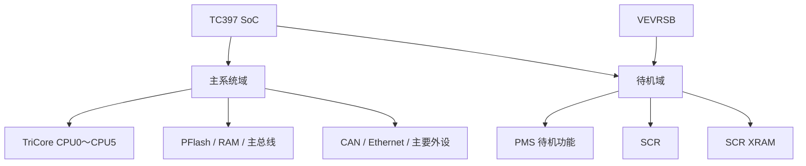
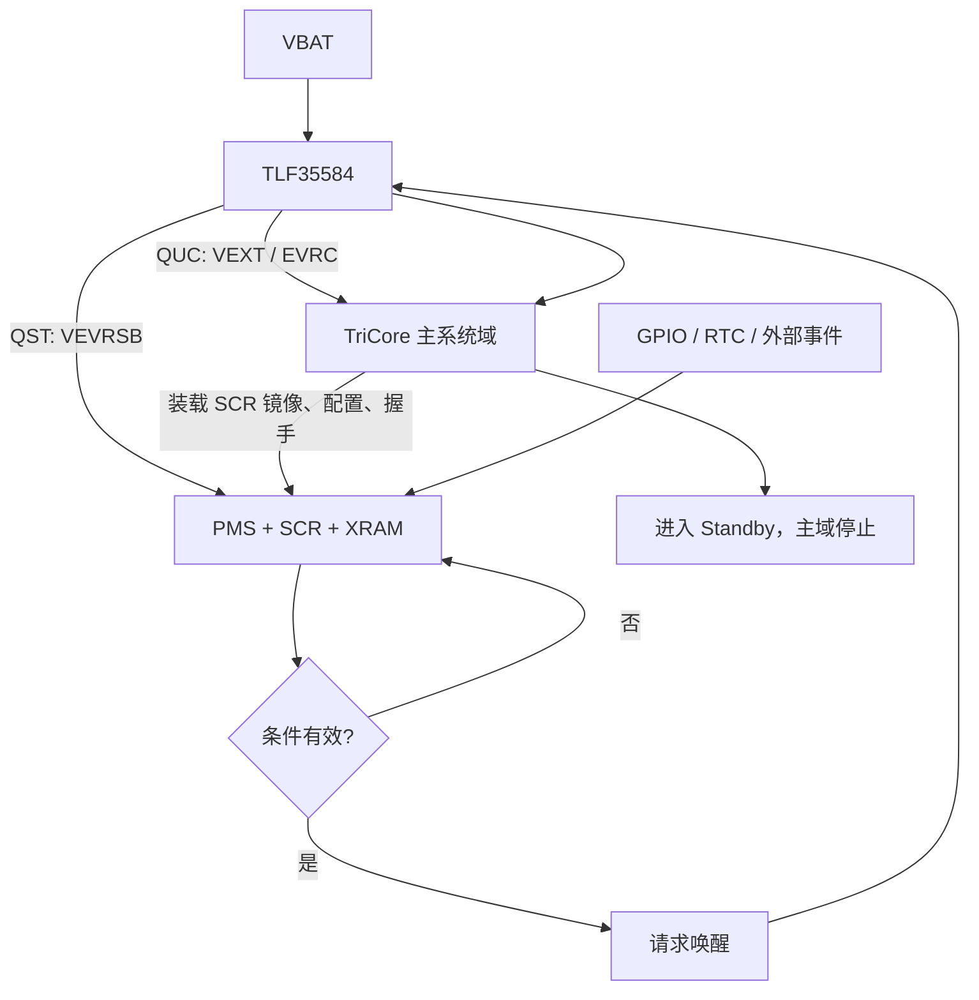

在 AURIX TC397 项目中看到 SCR、PMS、`VEVRSB`、TLF35584 和 Standby 等概念时，很容易产生两个误解：一是认为芯片既然集成了 SCR，项目就必须使用；二是认为 SCR 与 TLF35584 都涉及待机和唤醒，因此两者功能重复。

实际上，SCR 是 TC397 内部可选的低功耗可编程控制器，TLF35584 是外部电源管理与安全监控芯片。两者确实在“待机、唤醒、定时、监控”这些应用目标上存在交集，但承担的是不同层次的职责：

> TLF35584 决定电源如何提供、关闭、恢复并监督系统供电安全；SCR 决定主系统停止运行期间还要执行什么逻辑，以及什么时候值得唤醒主系统。

只有当主 TriCore 域进入真正的 Standby 后仍然需要执行软件任务时，SCR 才形成明确的工程价值。如果只是简单关机、单一硬件唤醒和重新启动，TLF35584、PMS 与外部收发器通常已经足够。

## 一、先理解“主 SoC 进入 Standby”

SoC 是 System on Chip，即片上系统。在本文场景中，整颗 TC397 可以称为 SoC；英飞凌文档中的“main SoC”更具体地指 TC397 的主系统域，包括 TriCore CPU、主要存储器、总线和大部分外设。

TC397 并不是一个只能整体通电或整体断电的黑盒。它包含不同电源域：



因此，“主 SoC 进入 Standby 后 SCR 继续运行”并不等于整颗 TC397 完全断电。准确含义是：主系统域停止工作，而 `VEVRSB` 仍为待机域供电，SCR 可以继续执行程序。

## 二、英飞凌如何定义 SCR

英飞凌将 SCR 定义为 Standby Controller：一个基于 XC800 内核、兼容标准 8051 指令体系的 8 位微控制器，可以在系统正常运行模式和低功耗 Standby 模式下执行代码。官方功能说明列出的主要资源包括：

- 最高 20 MHz 的 XC800 内核；
- 2 KB Boot ROM、256 B RAM 和 64 B Monitor RAM；
- 用于程序与数据的 XRAM；
- Idle 与外设时钟门控；
- 带窗口功能的看门狗；
- 与 TriCore P33/P34 共享引脚的 SCR P00/P01；
- Timer 0、Timer 1、Timer 2 与 T2CCU；
- RTC；
- UART、SSC；
- ADCOMP 模拟比较功能；
- SCR 与 TriCore 之间的双向中断；
- 通过 SPD/DAP 提供的片上调试支持。

这些功能意味着 SCR 适合处理低频、低复杂度但需要持续运行的任务，例如定时、引脚监控、信号去抖、简单采样、低速串行通信和唤醒条件判断；它并不适合承载完整 AUTOSAR 应用、复杂网络协议栈或高算力任务。[Infineon：AURIX TC3xx Standby Controller](https://documentation.infineon.com/aurixtc3xx/docs/luk1713080514892)

SCR 的全称是 Standby Controller，不是 Safety Core，也不等同于 SCU、SMU 或 HSM。它可以参与低功耗和唤醒策略，但不能仅凭名称或内部看门狗，就被当作外部安全监督器使用。

### TC397 的 XRAM 容量口径

英飞凌 TC3xx SCR 概览页的简介与功能列表存在 32 KB 和 8 KB 两种表述。面向具体代际的官方知识库进一步明确：A2G 的 XRAM 为 8 KB，A3G 为 32 KB；TC397 属于 A2G，因此本文按 8 KB 处理。

在 TC397 上，TriCore 侧从 `0xF0240000` 访问该 XRAM，SCR 侧从 `0x0000` 访问。系统初始化期间由 TriCore 将 SCR 程序写入 XRAM，SCR 再从中执行程序并使用其中的数据区。[Infineon：SCR 与 TriCore 通过 XRAM 交换数据](https://community.infineon.com/t5/Knowledge-Base-Articles/Data-exchange-between-SCR-and-TriCore-via-XRAM/ta-p/1232925)

## 三、SCR 是芯片能力，不是项目必选项

TC397 芯片内部客观存在 SCR，但一个项目可以完全不开发、不装载也不启动它。是否使用 SCR 应由系统需求决定，而不是由器件功能列表决定。

可以把项目分为三种层级：

| 使用层级 | SCR 状态 | 典型方案 |
|---|---|---|
| 不使用 | 不构建、不装载、不启动 | TLF35584/PMS/收发器直接完成关机与唤醒 |
| 基础使用 | 运行最小 SCR 固件 | 监控 GPIO、RTC，记录唤醒原因并唤醒主域 |
| 深度使用 | 执行完整待机状态机 | 周期采样、通信、组合条件判断、无效唤醒过滤 |

下面这些需求通常不需要 SCR：

- 点火信号出现后直接启动 ECU；
- CAN/LIN 收发器输出 Wake 后直接恢复主电源；
- 单一 GPIO 唤醒；
- 现有 PMIC/PMS 已覆盖的简单定时唤醒；
- 待机期间没有任何必须执行的软件逻辑；
- ECU 可以直接关机，并在下次事件发生时重新冷启动。

下面这些需求才会让 SCR 的价值明显上升：

- 需要把多个唤醒条件组合判断；
- 需要对毛刺、短脉冲和无效总线活动进行软件过滤；
- 待机期间需要周期性读取简单传感器；
- 需要通过 RTC 和定时器维护多个低频任务；
- 需要保留并上报详细唤醒原因；
- 需要执行少量 UART、LIN 相关或 SSC 通信；
- 无效唤醒会频繁拉起主系统，造成明显能耗；
- 外部 PMIC 的固定状态机无法表达业务规则。

## 四、SCR 与 TLF35584：有功能交集，但不能相互替代

TLF35584 是面向安全相关应用的多路系统电源与安全 PMIC。英飞凌列出的能力包括 MCU 主电源、参考/ADC 电源、待机电源、收发器与传感器供电、欠压/过压监控、窗口看门狗、功能看门狗、错误监控、安全状态控制和 BIST。[Infineon：TLF35584 产品说明](https://www.infineon.com/part/TLF35584QKVS2)

两者的职责边界如下：

| 维度 | SCR | TLF35584 |
|---|---|---|
| 位置 | TC397 内部待机域 | ECU 板上的外部 PMIC |
| 本质 | 可编程的 8 位微控制器 | 电源管理与外部安全监控芯片 |
| 能量关系 | 消耗 `VEVRSB` 电源 | 可以通过 QST 为 `VEVRSB` 供电 |
| 主域电源 | 不能产生主电源 | QUC 等电源输出支持 `VEXT/EVRC` |
| 待机职责 | 主域停止后继续执行逻辑 | 切换电源状态并维持必要电源域 |
| 唤醒职责 | 检测、过滤、组合条件并发出请求 | 接受硬件请求并恢复供电状态 |
| 看门狗 | 主要监督 SCR 自身程序 | 对 MCU 提供外部 Window/FWD 监督 |
| 监控 | 软件定义的 GPIO、定时和比较判断 | 电压、温度、看门狗、错误与安全状态 |
| 可编程性 | 可以编写任意受资源约束的状态机 | 通过 SPI 配置硬件状态机和安全机制 |

TLF35584 的 QUC 用于主系统供电，QST 可以为独立的 `VEVRSB` 待机域供电；SPI 用于启动后的电源配置和模式切换。其 PORST、WDI/FWD、ERR/SMUFSP 和 INT/ESR1 等接口承担电源与安全管理职责。[Infineon AP32402：TC3xx 与 TLF35584/TLF35585 电源集成](https://documentation.infineon.com/aurixtc3xx/docs/jbn1710259777764)

### 为什么看起来会重叠

两者都可能涉及待机、唤醒、定时和看门狗，但实现层次不同：

- TLF35584 的唤醒与状态转换属于外部硬件电源管理；SCR 的唤醒逻辑可以包含软件判断。
- TLF35584 的外部看门狗具有独立监督价值；SCR 内部看门狗不能替代它。
- TLF35584 可以关闭或恢复主电源；SCR 只能在待机电源存在的条件下运行。
- SCR 可以过滤一次唤醒是否值得拉起整个 ECU；TLF35584 负责真正执行供电状态切换。

所以两者不是“选一个”的关系。可以不用 SCR，但不能因为使用 SCR 就把外部电源与安全监管职责交给它。

## 五、三种典型应用策略

### 策略一：TLF35584 管理关机与直接唤醒


适用条件：

- 唤醒源简单明确；
- 不需要在待机期间执行任务；
- 不需要过滤无效唤醒；
- 冷启动时间满足需求；
- 希望保持最小的软件和验证复杂度。

这是工程设计的合理基线。只要需求已经满足，就没有必要为“使用了芯片全部功能”而加入 SCR。

### 策略二：TLF35584 与 SCR 协同实现智能待机



适用条件：

- 主系统必须真正关闭以降低功耗；
- 主域关闭期间仍有少量任务；
- 需要通过软件识别和过滤唤醒；
- 被过滤的无效唤醒足以抵消 SCR 及待机外围的持续能耗；
- 项目可以承担独立固件、构建、通信和验证成本。

英飞凌 AP32537 展示的正是这种协同方案：关闭 `VEXT`，只保留 `VEVRSB`，使能 SCR 响应外部信号，并让 TLF35584 工作在 Standby 模式。这说明官方将 SCR 与 TLF35584 视为协作组件，而不是替代品。[Infineon AP32537：TC3xx Standby 与 TLF35584/SCR](https://documentation.infineon.com/aurixtc3xx/docs/vso1717132280270)

### 策略三：不进入深度 Standby

如果待机任务需要完整 CAN/Ethernet 协议栈、大量计算、复杂 AUTOSAR 服务，或者系统不能接受主域恢复和重新启动时间，那么 SCR 可能不是合适方案。此时应考虑较浅的低功耗模式、保留部分主域运行，或者使用具有更多资源的外部低功耗控制器。

SCR 可以减少不必要的主系统启动，但不能消除主域恢复时延，也不能把 8 位待机控制器变成第二套高性能 ECU。

## 六、是否值得引入 SCR：用需求和能量收支判断

生产项目中，至少需要同时满足两个前提：

1. 主 TriCore 域确实要进入 Standby 或关闭；
2. 主域停止期间确实需要运行可编程逻辑。

可以用一个简化模型评估能量收益：

```text
平均节能收益
≈ 无效唤醒频率 × 主系统单次启动及运行能量
  - SCR 与待机外围的持续功耗
```

如果没有无效唤醒、待机任务或量化功耗目标，SCR 带来的构建、调试和验证复杂度很可能大于收益。

还应从以下维度进行系统决策：

| 评估项 | 倾向不使用 SCR | 倾向使用 SCR |
|---|---|---|
| 唤醒逻辑 | 单一硬件条件 | 多源、去抖、组合和状态相关 |
| 待机任务 | 无 | 定时、采样、低速通信 |
| 无效唤醒 | 很少 | 频繁且启动能耗明显 |
| 恢复方式 | 冷启动可接受 | 需要保留更多唤醒上下文 |
| 软件复杂度 | 优先最小化 | 可以维护独立 SCR 固件 |
| 安全监督 | TLF35584 已覆盖 | 仍由 TLF35584 覆盖，SCR 只增加逻辑 |

## 七、TC397 上如何开发和集成 SCR

SCR 集成不是修改一个 MCAL 开关。它至少横跨硬件、电源、独立固件、镜像装载、跨域通信、AUTOSAR 模式管理与整机验证。

### 1. 先定义系统需求和电源状态

在写代码前明确：

- 主域是否真正关闭；
- Standby 期间哪些电源轨继续存在；
- 哪些器件仍需要供电；
- 唤醒源、有效条件、优先级与去抖时间；
- 最大待机电流和最长唤醒时间；
- SCR 失效时系统如何降级；
- 哪些关键唤醒源必须保留不依赖 SCR 的硬件路径。

### 2. 验证板级硬件链路

至少确认：

- TLF35584 QST 与 TC397 `VEVRSB` 的实际连接；
- Standby 状态下 QST、主电源轨及外设电源的真实行为；
- PORST、SPI、ERR/SMUFSP、INT/ESR1 与 Wake 信号连接；
- SCR 使用的 P33/P34 共享引脚及所有权切换；
- CAN/LIN 收发器的 Wake 输出最终连接到 TLF35584、PMS 还是 SCR；
- SCR 发出的唤醒请求如何到达 PMS/TLF35584。

仅有软件配置名称不能证明这些硬件链路已经成立，必须结合原理图和实测电源时序。

### 3. 建立独立 SCR 固件工程

SCR 使用 XC800/8051 体系，不是普通 TriCore 编译目标。固件通常包含：

- 启动代码和中断向量；
- XRAM 链接布局；
- GPIO、RTC、Timer、UART/SSC、ADCOMP 等驱动；
- 待机状态机；
- 看门狗与异常处理；
- TriCore/SCR 共享数据和握手协议；
- 唤醒原因记录。

AURIX Development Studio 可以使用 SDCC 构建 SCR 源码。英飞凌同时指出，SDCC 生成的 8 位 ELF 调试信息需要调试器适配，ADS 当前的 SCR 源码级调试能力存在限制；如果需要完整符号调试，应提前确认编译器、ELF 与调试器组合。[Infineon：ADS 的 SCR 源码调试说明](https://community.infineon.com/t5/Knowledge-Base-Articles/Does-AURIX-Development-Studio-ADS-allow-the-debugging-of-a-Standby-Controller/ta-p/1125532)

### 4. 设计 XRAM 布局和镜像装载

TC397 的 8 KB XRAM 同时承载 SCR 程序、静态数据、栈以及共享数据。应由链接脚本和生成符号约束布局，避免手工固定地址与程序区发生重叠。

典型构建链为：

```text
SCR 源码
  → SDCC/兼容工具链
  → IHX/HEX/BIN 与符号头文件
  → 嵌入 TriCore PFlash 镜像
  → TriCore 启动时复制到 0xF0240000
  → 校验长度/版本/CRC
  → 配置并启动 SCR
```

SCR XRAM 不是独立非易失 Flash，因此冷启动后必须重新装载固件。只在工程目录里放置一个 SCR HEX 文件，而没有 TriCore 装载链，并不能让 SCR 运行。

### 5. 定义 TriCore/SCR 通信协议

英飞凌给出两类跨域通信方式：共享 XRAM，以及 PMS/SCR 中断交换寄存器。XRAM 在 `VEVRSB` 供电期间保持，适合交换较大的命令和状态；`SCRINTEXCHG`、`TCINTEXCHG` 与 `PMSWCR2` 适合传递少量数据并触发中断。[Infineon：Main CPU 与 SCR 的数据交换](https://community.infineon.com/t5/Knowledge-Base-Articles/How-to-Exchange-Data-Between-Main-CPU-and-SCR-AURIX-MCU/ta-p/449479)

共享区至少应定义：

```c
typedef struct
{
    uint32_t magic;
    uint16_t protocolVersion;
    uint16_t scrState;
    uint32_t command;
    uint32_t wakeReason;
    uint32_t heartbeat;
    uint32_t imageCrc;
} ScrSharedData;
```

同时明确每个字段的写入方、更新顺序、初始化时机、版本兼容、超时、CRC 和并发访问规则。尤其要避免 TriCore 在 SCR 启动代码完成全局变量初始化前写入随后会被清零的数据区。

### 6. 建立完整的进入与退出时序

推荐的控制顺序是：

```text
TriCore 初始化 TLF35584 与 PMS
  → 装载并校验 SCR 镜像
  → 配置 SCR 时钟、复位、引脚和唤醒源
  → 启动 SCR 并等待 ready
  → 停止主域业务与通信
  → 保存共享状态并移交引脚所有权
  → 配置 TLF35584/PMS Standby
  → 主域进入 Standby
  → SCR 监控并判断事件
  → SCR 请求唤醒
  → TLF35584 恢复主电源
  → TriCore 启动并读取 wakeReason
```

AUTOSAR 工程中还需要把 EcuM、Mcu、BswM、SBC 驱动以及应用电源管理状态机串成一条可达路径。配置项生成出来不等于运行时路径已经存在。

### 7. 验证异常路径

除了正常进入和唤醒，还应验证：

- 冷启动后 SCR 镜像是否每次重新装载；
- 镜像 CRC、版本或长度错误；
- SCR ready 超时；
- SCR 看门狗复位；
- `VEVRSB` 丢失或跌落；
- 主电源未按预期关闭或恢复；
- 每一种唤醒源、毛刺和无效事件；
- 多次连续 Standby/Wake 循环；
- SCR 失效时关键硬件唤醒是否仍可用；
- 实际待机电流和唤醒时延是否达到需求。

## 八、当前工程采用了哪种策略

对当前 TC397 工程的源码、配置与构建产物进行静态取证后，可以确认：

- 没有独立 SCR 源码工程；
- 没有 SCR ELF、HEX、BIN 或随 TriCore 固件携带的镜像；
- 没有向 SCR XRAM 装载程序的代码；
- 没有 SCR 启动、复位、ready 握手和跨域通信；
- 没有 SCR 独立构建目标或调试配置；
- `McuStdbyModeWakeupFromSCR=false`；
- `SCR_CLOCK_SEL0` 只出现在 ARXML/生成配置中，没有形成运行时 SCR 访问链；
- `ECUM_SLEEPMODELIST=STD_OFF`，没有发现可达的 EcuM/MCAL Standby 入口；
- 当前实际关机路径进入 `Sbc_30_Tlf35584_SetMode(STANDBY)`、随后请求 `SLEEP`，并保留 `Mcu_PerformReset()` 回退；
- 工程中存在 TLF35584 驱动与板级 CAN 收发器唤醒相关配置。

因此，当前工程采用的是：

> 由 TLF35584 管理电源状态的关机/重新启动策略，而不是“TC397 主域进入 Standby、SCR 驻留运行”的策略。

这不是功能缺失，也不代表配置错误。它说明现有需求尚未选择 SCR 方案。`McuStdbyModeWakeupFromSCR=false` 是这一架构状态的表现之一，而不是判断 SCR 是否集成的唯一证据；同样，出现 `SCR_CLOCK_SEL0` 也只能证明配置模型具备该枚举，不能证明 SCR 已经运行。

### 当前仍需通过硬件资料或实测确认的事项

- 板上 TLF35584 QST 是否连接并持续供给 TC397 `VEVRSB`；
- Standby/Sleep 请求后各电源轨的实际时序；
- 外部唤醒信号到 TLF35584、PMS 与 SCR 引脚的真实连接；
- 当前关机路径最终属于何种整机电源状态；
- 待机电流、唤醒时延和无效唤醒频率。

这些信息不会改变“当前没有集成 SCR”的软件结论，但会决定未来是否具备直接加入 SCR 的硬件基础。

## 九、以学习为目标的最小 SCR 实验

如果目标是通过实际应用理解 SCR，不建议第一步就改造正式 AUTOSAR 关机链。更合适的路径是建立一个独立最小闭环：

1. 创建最小 SCR 工程并生成镜像；
2. 由 TriCore 将镜像复制到 XRAM；
3. 启动 SCR，并由 SCR 写入 `ready` 标志；
4. SCR 使用 RTC 周期更新计数器；
5. SCR 监控一个 GPIO，并做简单去抖；
6. 有效事件发生后写入 `wakeReason`；
7. SCR 请求唤醒主域；
8. TriCore 启动后读取并输出唤醒原因；
9. 最后再加入 TLF35584 的 `VEXT/VEVRSB` 电源切换。

这个实验覆盖了 SCR 最核心的工程链路：

```text
独立构建
→ XRAM 装载
→ SCR 启动
→ TriCore/SCR 握手
→ 待机运行
→ 事件判断
→ 唤醒主域
→ 状态交接
```

完成这个闭环后，再根据量化需求决定是否把 SCR 接入正式 EcuM、Mcu、BswM 和 TLF35584 状态机，能够显著降低一次性改造的复杂度。

## 十、结论

SCR 的核心价值不是“又多了一个小核”，而是提供一个由 `VEVRSB` 维持、在主 TriCore 域停止后仍可执行程序的低功耗控制平面。

TLF35584 负责供电、复位、外部看门狗、电压监控与安全状态；SCR 负责待机期间的软件任务和智能唤醒。两者在应用目标上有交集，在硬件职责上并不重复。

生产项目是否需要 SCR，可以归结为一句话：

> 如果主域关闭期间不需要运行软件，就优先使用 TLF35584/PMS 的简单方案；只有当待机期间确实需要可编程判断、采样、通信或唤醒过滤，并且收益能够覆盖集成成本时，才引入 SCR。

对于当前工程，继续保留 TLF35584 关机策略是合理基线。学习 SCR 的最佳下一步，是先完成一个可观测、可重复的最小实验，再决定是否演进为正式的 TLF35584 + SCR 智能待机架构。

## 参考资料

1. [Infineon：AURIX TC3xx Standby Controller](https://documentation.infineon.com/aurixtc3xx/docs/luk1713080514892)
2. [Infineon：SCR 与 TriCore 通过 XRAM 交换数据](https://community.infineon.com/t5/Knowledge-Base-Articles/Data-exchange-between-SCR-and-TriCore-via-XRAM/ta-p/1232925)
3. [Infineon：Main CPU 与 SCR 的数据交换](https://community.infineon.com/t5/Knowledge-Base-Articles/How-to-Exchange-Data-Between-Main-CPU-and-SCR-AURIX-MCU/ta-p/449479)
4. [Infineon：ADS 的 SCR 源码调试说明](https://community.infineon.com/t5/Knowledge-Base-Articles/Does-AURIX-Development-Studio-ADS-allow-the-debugging-of-a-Standby-Controller/ta-p/1125532)
5. [Infineon：TLF35584 产品说明](https://www.infineon.com/part/TLF35584QKVS2)
6. [Infineon AP32402：TC3xx 与 TLF35584/TLF35585 电源集成](https://documentation.infineon.com/aurixtc3xx/docs/jbn1710259777764)
7. [Infineon AP32537：TC3xx Standby 与 TLF35584/SCR](https://documentation.infineon.com/aurixtc3xx/docs/vso1717132280270)
