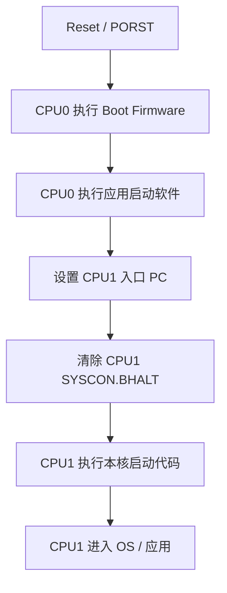
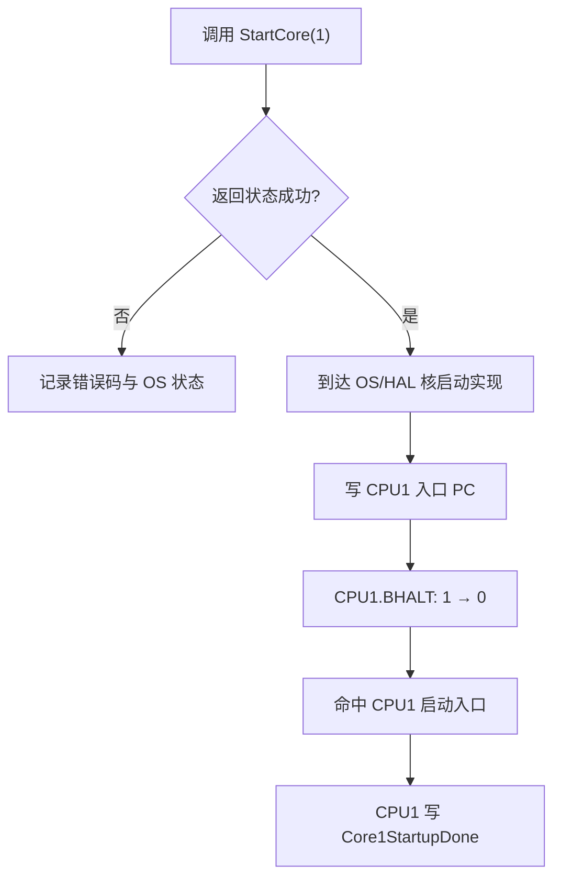
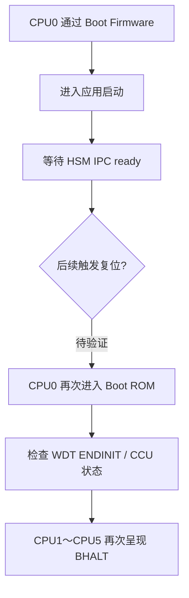

一次多核启动异常最容易被“当前停在哪里”带偏。

调试器第一次停下时，CPU0 位于 HSM IPC 的 ready-wait；CPU1～CPU5 的 PC 都显示为 `0xAFFFC000`，`SYSCON.BHALT=1`。继续 Reset、Run 和单步后，CPU0 又进入 `0xAFFFBxxx` 的 Boot ROM 区域；Run 之后还会重新落回 `0xAFFFB296`。表面上看，现场似乎同时指向 HSM、从核启动、Boot ROM、看门狗和时钟初始化五个方向。

最后，板子在一次 Reset 后恢复了正常运行，却没有留下一个可以复现的“修复动作”。

这类结果最危险的地方，不是问题没有马上解决，而是很容易把“现象暂时消失”写成“根因已定位”。本文复盘一次 AURIX TC3xx 六核工程的真实调试过程，重点回答四个问题：

1. `0xAFFFC000 + BHALT=1` 到底说明了什么，不能说明什么；
2. CPU0 曾经停在 HSM ready-wait，为什么后来又出现在 Boot ROM；
3. `D15=0xFFFC000F`、`A2=0xF003624C` 和 `jz.t` 指令如何推翻“卡死在 bit0 循环”的判断；
4. 当一次 Reset 让系统恢复正常时，怎样保留证据并把偶发故障真正闭环。

::: important 结论先行
本次排查**没有闭环到唯一根因**，因此它是一篇调试复盘，不是故障修复报告。

已经证实的是：CPU0 曾进入 HSM ready-wait；从核快照呈现 Boot Halt 状态；CPU0 后来位于 Boot ROM 的 ENDINIT/时钟相关检查路径；`0xAFFFB296` 附近的 bit0 分支在现场值下应当通过。尚未证实的是：哪一种复位让 CPU0 重新进入 Boot ROM、`StartCore(1)` 是否真正走到硬件放行、HSM ready flag 的写入方是否按预期执行，以及当时加载镜像与目标 Flash 是否完全一致。
:::

为避免公开项目细节，本文将工程入口、共享变量和测试组名称做了抽象；芯片寄存器地址、调试器读数和公开厂商符号语义予以保留。文中的“事实”“解释”“假设”会分开书写。

## 一、先建立正确的启动心智模型

### 1. CPU0 与从核不是同时自然进入应用

Infineon 的 TC3xx 启动说明给出了一个很重要的默认行为：复位后由 CPU0 执行 Boot Firmware，其他 CPU 先保持在 Halt 状态，直到软件显式启动。应用启动软件通常需要先为目标核准备入口 PC，再通过该核 `SYSCON` 中的 `BHALT` 位把它从 Boot Halt 放行。

官方 iLLD 中的 `IfxCpu_startCore()` 也体现了同样的顺序，可以抽象成：

```c
set_target_pc(cpu, entry);

if (cpu->SYSCON.BHALT == 1U) {
    cpu->SYSCON.BHALT = 0U;
}
```

因此，多核应用的预期启动链不是“六个核一起跑”，而更接近下面的过程：



这直接带来第一条判断原则：

> 从核 `BHALT=1` 在“尚未被软件启动”时可以是正常状态；只有当系统设计要求它已经被启动，且启动调用确实执行完成后仍保持 `BHALT=1`，它才成为故障证据。

### 2. Boot Halt、Debug Halt 与 Idle 不是同一种状态

调试器界面都可能使用“halt”一词，但至少要区分三类状态：

| 状态 | 典型观察点 | 含义 |
|---|---|---|
| Boot Halt | `CPUx.SYSCON.BHALT` | 从核尚未被启动软件放行 |
| Debug Halt | `CPUx.DBGSR.HALT`、调试器 Stop Reason | 核因断点、外部 suspend 或调试请求停止 |
| Idle | `PMCSRx` 等电源管理状态 | 核已启动，但进入低功耗/空闲状态 |

一个核完全可能表现为 `SYSCON.BHALT=1`，而 `DBGSR` 并不表示调试暂停。前者是启动状态，后者是调试控制状态。若只看 GUI 上的“Stopped/Halted”，就容易把二者混为一谈。

### 3. PC 是状态采样，不是根因标签

PC 只回答“采样瞬间正在执行哪条指令”。它不能单独回答：

- 为什么来到这里；
- 这是第一次进入还是复位后再次进入；
- 当前循环是永久卡死，还是等待一个稍后会变化的硬件条件；
- 当前地址属于应用、启动代码、Boot ROM、Trap 还是调试器注入代码；
- 调试器显示的地址是否需要做 cached/non-cached alias 归一化。

所以看到一个可疑 PC 后，正确动作不是立即命名根因，而是同时收集“地址归属、寄存器条件、调用来源、复位原因和时间顺序”。

## 二、第一阶段：CPU0 看起来卡在 HSM Ready 等待

最早的一组现场中，CPU0 栈顶为：

```text
0xA0085322
```

将调试器显示的非缓存别名归一化到工程 MAP 所使用的地址后，对应：

```text
0x80085322
```

该地址被解析到一个 vHSM IPC ready-wait 函数内部，偏移约为 `+0x2E`。其逻辑可以脱敏为：

```c
ready_offset = ipc_layout.ready_flag_offset;

while (read_shared_u32(partition, ready_offset) != READY_MAGIC) {
    check_optional_timeout();
}
```

现场材料中的等待魔数是：

```text
READY_MAGIC = 0xDEADBEEF
```

配置记录还给出了 `readyFlagOffset=0x28`，并曾把目标位置推导为 `0xB0000028`。但这一目标地址和写入方调用链没有在调试器中完成最终验证，因此只能作为待验证线索，不能写成既定事实。

### 1. `0xDEADBEEF` 在这里不是“内存坏了”

`0xDEADBEEF` 经常被用作调试填充值、哨兵值或握手魔数。同一个工程里甚至可能在多个无关模块出现它。仅搜索常量会得到多个命中，例如：

- HSM 与主核之间的某个桥接握手；
- vHSM IPC 分区 ready flag；
- Flash 校验或测试值。

因此必须把三个信息绑定起来：

```text
读取者函数 + 实际读取地址 + 预期写入者
```

只有三者闭环，才能说“HSM 没有置 ready”。如果只看 `while (... != 0xDEADBEEF)`，最多能证明 CPU0 在等待，不能证明 HSM 为什么没有满足条件。

### 2. 这个现场能证明什么

它能证明：

- CPU0 至少有一次进入了应用侧的 HSM IPC 等待路径；
- 采样时，ready 条件尚未满足，或者调试器停在条件被重新读取的位置；
- CPU0 此时还没有继续执行后续应用初始化。

它不能证明：

- HSM 固件没有启动；
- ready flag 的写入代码从未执行；
- 共享内存地址推导一定正确；
- 这是唯一阻塞点；
- 后面观察到的 Boot ROM PC 仍属于同一次不间断执行。

这一区分在后续非常关键，因为 CPU0 后来已经不在这个应用函数中，而是重新出现在 `0xAFFFxxxx` 的 Boot ROM 区域。

## 三、第二阶段：把问题切换到真正的 Core1 启动链

工程里的启动测试逻辑可以抽象为两条互相等待的路径。

### 1. CPU0 路径

```c
run_startup_test_group_for_core0();
Core0StartupDone = 1U;

status = StartCore(1U);

while (Core1StartupDone == 0U) {
    /* 原实现为等待 */
}

StartupDone = 1U;
```

### 2. CPU1 路径

```c
while (Core0StartupDone == 0U) {
}

run_startup_test_group_for_core1();
Core1StartupDone = 1U;

while (StartupDone == 0U) {
}
```

从 CPU0 视角看，停在 `while (Core1StartupDone == 0U)` 只是最后暴露出的症状。真正需要逐层验证的是：



排查材料确认了 `StartCore` 和 OS API 符号确实链接进镜像，也找到了对应 MAP 地址；但没有留下以下闭环结果：

- `StartCore(1)` 的实际返回状态；
- 是否进入 `Os_Api_StartCore` 之后的硬件相关实现；
- CPU1 入口 PC 是否被正确写入；
- `SYSCON.BHALT` 是否发生 `1 → 0`；
- CPU1 是否命中本核启动入口；
- CPU1 是否真正写出 `Core1StartupDone=1`。

因此，不能只凭 CPU1 快照停在 `0xAFFFC000` 就断言“StartCore 失败”，也不能只凭源码存在 `StartCore(1)` 就断言“CPU1 已经被放行”。

## 四、第三阶段：六核快照应该怎样读

一组关键快照记录为：

| 核 | PC | `SYSCON.BHALT` | 当时可得出的最小结论 |
|---|---:|---:|---|
| CPU0 | `0xAFFFB1F6` | `0` | CPU0 正在 Boot ROM/早期启动相关地址区域执行 |
| CPU1 | `0xAFFFC000` | `1` | CPU1 仍处于 Boot Halt，没有被放行 |
| CPU2 | `0xAFFFC000` | `1` | 同上；是否异常取决于工程是否启用 CPU2 |
| CPU3 | `0xAFFFC000` | `1` | 同上 |
| CPU4 | `0xAFFFC000` | `1` | 同上 |
| CPU5 | `0xAFFFC000` | `1` | 同上 |

CPU0 的两个调用者地址还显示为：

```text
0xAFFFAF58
0xAFFFAC3E
```

这组 `0xAFFFxxxx` 地址没有在应用 ELF/MAP 中解析到文本符号。这个结果本身并不奇怪：Boot ROM 由芯片厂商固化，不属于本次应用 ELF 的链接内容。真正重要的是，它与此前 `0xA0085322` 已解析到应用函数的现场不同。

这说明调试时间线上至少存在两种状态：

1. CPU0 已经进入应用，并在等待 HSM ready；
2. CPU0 后来又位于 Boot ROM/早期启动路径，从核重新呈现 Boot Halt。

最自然的待验证解释是“中间发生过复位或重新启动”，但由于当时没有在状态被清除前保存 `SCU_RSTSTAT`，这一解释仍然是推断，而不是闭环事实。

### 为什么 `0xAFFFC000` 不能单独定罪

Infineon 的启动说明明确指出，TC3xx 默认只启动 CPU0，其他 CPU 在软件显式激活前保持 HALT。官方社区公开的 TC397 调试现场中也出现过相同组合：从核 PC 为 `0xAFFFC000`，`SYSCON.BHALT` 表示 Boot Halt，而 `DBGSR` 仍可表现为运行状态。

因此，`0xAFFFC000` 更像一个“从核尚未放行”的状态标记。判断它是否异常，必须先回答两个问题：

1. 这个核按配置是否应该被启动；
2. 负责启动它的代码是否已经执行到清 `BHALT` 之后。

CPU2～CPU5 若本来未在当前 OS 配置中使用，保持这一状态完全可能是设计结果。CPU1 若被 CPU0 明确要求启动，却在成功返回之后仍保持 `BHALT=1`，才是需要继续追查的矛盾。

## 五、第四阶段：`0xAFFFB296` 的单步证据改变了判断

CPU0 在 Boot ROM 中单步时，相邻反汇编包含下面的逻辑：

```asm
ld.w   d15, [a2]
jz.t   d15, 0, 0xAFFFB28C
```

在 PC 到达 `0xAFFFB296` 附近时，现场寄存器为：

```text
D15 = 0xFFFC000F
A2  = 0xF003624C
```

### 1. 先识别地址，再解释 bit

Infineon 官方 TC39xB iLLD 的 SFR 定义给出：

```text
0xF003624C = SCU_WDTCPU0_CON0
```

它是 CPU0 Watchdog Control Register 0，不是 CPU1 的核启动寄存器。字段定义为：

| 位 | 字段 | 含义 |
|---:|---|---|
| 0 | `ENDINIT` | End-of-Initialization 保护状态 |
| 1 | `LCK` | WDT CON0 访问锁状态 |
| 15:2 | `PW` | 密码字段 |
| 31:16 | `REL` | Watchdog Reload/Time Check 值 |

对 `0xFFFC000F` 只看本次分支所需的低两位：

```text
bit0 = 1  → ENDINIT 已置位
bit1 = 1  → LCK 已置位
```

`ENDINIT=1` 的含义不是“CPU 可以运行”，也不是“CPU1 已启动”。它表示 EndInit 保护处于开启状态，受保护 SFR 不应被普通写操作随意修改。需要修改这类寄存器时，软件必须按 Watchdog 密码访问协议暂时清除 ENDINIT，完成写入后再重新置位并读回确认。

### 2. `jz.t` 的实际判断

TriCore 的：

```asm
jz.t d15, 0, target
```

表示检查 `D15` 的 bit0；该位为 0 时跳转。

现场 `D15.bit0=1`，所以这条分支**不应**跳回 `0xAFFFB28C`。后续单步到 `0xAFFFB29C` 也确认执行已经通过 bit0 检查，并继续检查 bit1；而 `D15.bit1` 同样为 1。

这一点推翻了一个很有诱惑力、但不正确的说法：

> “CPU0 一直卡在 `0xAFFFB296` 的 bit0 轮询，因此 ENDINIT 没有置位。”

现场值与单步结果都不支持这个结论。

### 3. 为什么 Run 后又看到 `0xAFFFB296`

既然当次执行已经通过 bit0 分支，Run 后又停在相同地址，至少存在三种机制：

- CPU0 后续发生复位，再次从 Boot Firmware 走到相同检查点；
- 调试器执行了新的 Reset/Reset-and-Halt 序列；
- 还有更外层的 Boot ROM 流程会重新调用或回到这一段。

结合 CPU0 多次出现在 Boot ROM、从核重新处于 BHALT，第一种或第二种机制比“同一条 `jz.t` 自旋不退出”更符合现有证据。但当时没有同步保存 Reset Cause，所以不能在三者中做最终选择。

### 4. 不要在调试器里直接翻转 ENDINIT

看到 bit0 后，最危险的尝试是直接把寄存器低位改成 0 或 1。WDT CON0 的修改需要：

1. 读取并处理密码字段；
2. 按规定组合 `ENDINIT`、`LCK`、`PW` 和 `REL`；
3. 执行密码访问序列；
4. 修改受保护寄存器；
5. 重新设置 ENDINIT；
6. 强制读回确认更新。

官方 `Ifx_Ssw_clearCpuEndinitInline()` 与 `Ifx_Ssw_setCpuEndinitInline()` 正是按这一协议实现。绕过序列直接写 bit，可能触发 Watchdog Access Error，甚至制造新的复位，使原始现场更加混乱。

## 六、`0xF0036030` 又说明了什么

后续还检查了另一个地址：

```text
0xF0036030 = SCU_CCUCON0
```

这是 CCU Clock Control Register 0。以 TC39xB 的公开 SFR 定义为例，它包含：

- STM、GTM、SRI、SPB、BBB、FSI 等时钟分频字段；
- `CLKSEL` 时钟源选择；
- `UP` 更新请求；
- `LCK` 更新锁状态。

这再次说明 `0xAFFFBxxx` 附近看到的访问更接近 Boot Firmware/早期时钟与保护控制路径，而不是 CPU1 的 `StartCore` 实现。

遗憾的是，原对话中这张内存窗口截图的完整数值没有形成独立文本记录，因此本文不能继续判断当时 `CCUCON0.LCK`、`UP`、`CLKSEL` 或各 divider 的具体状态。地址归属已经闭环，字段值没有闭环；二者不能混写。

## 七、把 HSM 等待与 Boot ROM 现场串成一条可能的时间线

两组现场并不一定矛盾。一个可以解释全部观察、但仍需验证的时间线是：



这个模型解释了：

- 为什么最早的 CPU0 PC 能解析到应用 HSM 等待函数；
- 为什么稍后 CPU0 的 PC 和调用者都落在 `0xAFFFxxxx`；
- 为什么从核又全部显示 Boot Halt；
- 为什么 Run 后能再次命中 Boot ROM 中相同的寄存器检查点。

但它仍缺少最关键的一环：复位证据。没有 `SCU_RSTSTAT`、Watchdog Status、SMU Alarm、调试器 Reset 日志或电源时序记录，就不能回答复位来自：

- CPU Watchdog / Safety Watchdog；
- SMU 反应；
- HSM 或启动握手超时后的故障处理；
- 调试器自身的 Reset-and-Halt；
- 外部 PORST/ESR；
- 应用或系统软件主动请求。

因此本文把它称为“候选时间线”，不把它写成根因。

## 八、为什么最后一次 Reset 后系统又正常了

“Reset 后正常”至少说明静态程序并非在每次启动都必然停在同一位置，但它不能自动证明：

- 代码已经被修复；
- Flash 原来损坏、后来自动恢复；
- HSM 一定没有问题；
- 多核启动逻辑一定正确；
- 调试器只是显示错误。

更合理的解释集合包括：

### 1. 调试过程改变了时序

早期启动包含 Watchdog 密码窗口、ENDINIT 序列、时钟切换、硬件锁等待、HSM 握手和多核同步。单步一个核时，其他核、HSM 和外设是否继续运行，取决于调试器的 suspend 策略。一次耗时数秒的人为单步，可能让原本微秒级的握手进入完全不同的状态。

### 2. Reset 类型不同

Power-on Reset、System Reset、Application Reset、CPU Kernel Reset 以及调试器的 Reset-and-Halt，不一定执行完全相同的初始化路径。某些 RAM、时钟、HSM 或外设状态在不同 Reset 类型下会保留或重建。只说“我点了 Reset”不足以描述实验条件。

### 3. 调试器会话状态被刷新

断点实现、核组同步、自动运行脚本、镜像下载、Flash 编程算法和 Reset 后停点设置，都可能随着一次完整 Reset 重新初始化。若后续使用了不同的 Reset 命令或连接模式，结果也可能不同。

### 4. 真正的问题具有偶发性

HSM ready、从核同步、共享 RAM 初始化、缓存可见性、电源或外部时钟条件都可能产生偶发现象。一次成功启动只能降低“必现静态缺陷”的可能性，不能排除竞态或硬件时序问题。

所以本次调试的正确收尾不是“问题已解决”，而是：

> 故障暂时消失；当前证据足以排除 bit0 分支永久卡死，但不足以确认复位来源和最初触发条件。

## 九、下一次复现时，如何一次性把证据抓全

### 1. 在任何 Reset 前先保存快照

至少记录：

| 类别 | 建议记录项 |
|---|---|
| 每个核 | PC、PSW、PCXI、SP、当前核状态、Stop Reason |
| 核启动 | `SYSCON.BHALT`、目标核入口 PC、`DBGSR.HALT`、`PMCSRx` |
| 复位 | `SCU_RSTSTAT`、相关 `RSTCON`、CPU Kernel Reset Status |
| 看门狗 | CPU/Safety WDT CON0、CON1、SR 中的 Access/Overflow 状态 |
| 安全 | SMU Alarm Group/Status 与配置的故障反应 |
| 时钟 | `SCU_CCUCON0` 及相关 PLL/clock status |
| HSM IPC | ready flag 实际地址、值、分区索引、HSM 运行状态 |
| 软件阶段 | 启动阶段编号、`StartCore` 返回值、Core1 done flag |

`SCU_RSTSTAT` 要在启动软件清除它之前抓取。若只能在应用中记录，可把首次读取值保存到 `.noinit`/retention RAM 或一个不会被后续初始化覆盖的诊断区。

### 2. 使用断点链，而不是只盯一个 while

建议按下面顺序布点，并为每个命中保存时间戳和核号：

1. Boot Firmware 跳转到用户入口之后的第一处可控地址；
2. 应用启动入口；
3. HSM ready-wait 的进入与退出；
4. 启动测试调用 `StartCore(1)` 之前；
5. `StartCore`/OS API 的返回点，读取实际状态；
6. 最接近硬件的“设置 CPU1 PC”与“清 CPU1 BHALT”位置；
7. CPU1 本核启动入口；
8. CPU1 写 `Core1StartupDone` 的位置；
9. 所有 Reset/Trap/Fatal Error 入口。

如果只命中第 3 点后又回到第 1 点，就能非常直接地证明中间发生了重新启动；如果第 5 点返回成功但第 6 点未执行，则问题位于 OS 调用链；如果第 6 点执行后 `BHALT` 不变，则应转向 ENDINIT/访问权限/硬件状态；如果 CPU1 已命中第 7 点却没有写 done flag，则问题已经从“核没启动”转成“CPU1 启动代码未走完”。

### 3. 给无限等待增加诊断超时

生产策略是否允许超时复位需要单独设计，但调试版本不应只保留无信息的永久循环。可以在超时后保存一个最小诊断结构：

```c
typedef struct {
    uint32 magic;
    uint32 startupStage;
    uint32 resetStatus;
    uint32 startCoreStatus;
    uint32 hsmReadyValue;
    uint32 cpu1Syscon;
    uint32 cpu1Pc;
} StartupDiagSnapshot;
```

关键不在于字段越多越好，而在于一次快照能够回答：“停在哪个阶段、上一步是否成功、硬件实际状态是什么、是否经历了复位”。

### 4. 做 Reset/调试模式矩阵

至少比较以下实验：

| 实验 | 调试器状态 | Reset 方式 | 需要观察的差异 |
|---|---|---|---|
| A | 不连接 | 重新上电 | 最接近真实量产启动 |
| B | 先上电后 Attach | 不主动 Reset | Attach 是否改变现象 |
| C | 已连接 | Reset and Run | 正常连续启动路径 |
| D | 已连接 | Reset and Halt | Boot Firmware 停点与从核状态 |
| E | 已连接 | 单步早期启动 | Watchdog/HSM/时钟是否受调试侵入影响 |

如果只有 E 失败，而 A～D 稳定成功，首先应审查调试侵入和 suspend 策略；如果 A 失败但 C 成功，则调试器的初始化、Flash 下载或 Reset 时序可能掩盖真实问题；如果所有模式都在同一阶段失败，才更像稳定的软件或硬件缺陷。

### 5. 验证镜像身份，而不是只看“Loaded application”

当 PC 无法被当前 ELF 解析时，需要同时验证：

- 当前 ELF 的哈希、构建时间和 MAP 是否属于同一构建；
- 调试器为每个核关联了正确的符号文件；
- 关键应用地址的目标内存内容与 ELF/HEX 一致；
- Boot Mode Header 与用户入口地址是否正确；
- 实际编程的 PFlash bank/segment 是否覆盖当前镜像；
- 下载动作是否只加载符号，还是同时执行了 Flash 编程。

本次材料中没有保存足以证明“目标 Flash Segment 8 已正确编程”或“当时 ELF 与运行镜像完全一致”的最终校验结果。后来同一板子 Reset 后正常运行，使永久性镜像错误的可能性下降，但仍不能替代内容比对证据。

## 十、本次排查中最值得保留的判断规则

### 规则一：先判断执行域，再解释函数

```text
应用 PFlash / RAM → 用 ELF、MAP、调用栈解释
Boot ROM           → 用芯片启动文档、SFR 和复位状态解释
Trap / Debug       → 用 TIN、DBGSR、Stop Reason 解释
```

不要用应用 MAP 强行解释 Boot ROM 地址，也不要把上一次应用调用栈套到复位后的 PC 上。

### 规则二：从核 PC 与 BHALT 必须成对读取

只有 PC 没有核状态，无法区分“尚未启动”“调试暂停”“Idle”或“已经跑飞”。`0xAFFFC000` 与 `BHALT=1` 共同说明从核仍在 Boot Halt；但是否异常仍取决于启动阶段与配置。

### 规则三：看到 bit 分支，必须代入现场值

本次最关键的反证就是：

```text
jz.t 检查 bit0
D15 = 0xFFFC000F
bit0 = 1
```

所以当次执行不应回跳。若 Run 后再次落在相同 PC，应先问“是否重入/复位”，而不是继续把它当作同一个静态死循环。

### 规则四：硬件寄存器地址比变量名更可靠

`A2=0xF003624C` 一旦被官方 SFR 定义识别为 `WDTCPU0_CON0`，bit0 的含义就从猜测变成了 ENDINIT。类似地，`0xF0036030` 被识别为 `CCUCON0` 后，就不能再按 CPU1 启动控制寄存器解释。

### 规则五：恢复正常不是根因闭环

一个完整根因至少要包含：

```text
触发条件
→ 直接故障机制
→ 可观测证据
→ 修复动作
→ 修复前后可重复对照
```

本次只有“可观测证据的一部分”和“后来恢复”，缺少触发条件、直接故障机制与可重复修复动作，所以最终状态应标记为 `OPEN / NOT REPRODUCED`，而不是 `FIXED`。

## 十一、事实、推断与未闭环项总表

| 项目 | 状态 | 说明 |
|---|---|---|
| CPU0 曾位于 HSM IPC ready-wait | 已证实 | 地址归一化后由 MAP 解析到对应函数 |
| 等待条件使用 `0xDEADBEEF` | 已证实 | 源码/反汇编上下文可见 |
| ready flag 最终物理位置一定为 `0xB0000028` | 未闭环 | 有 offset 推导，缺少运行时指针与写入方验证 |
| CPU1～CPU5 快照为 `PC=0xAFFFC000`、`BHALT=1` | 已证实 | 多核状态窗口记录 |
| CPU1 按当前配置应被启动 | 已证实 | CPU0 启动测试逻辑调用 `StartCore(1)` |
| `StartCore(1)` 实际成功返回 | 未闭环 | 未保存返回状态 |
| CPU1 的 BHALT 被实际清除 | 未闭环 | 未捕获 `1 → 0` 转换 |
| CPU0 后来位于 `0xAFFFBxxx` Boot ROM 路径 | 已证实 | PC 与调用者均在该区域，应用 MAP 无符号 |
| `0xF003624C` 是 `SCU_WDTCPU0_CON0` | 已证实 | Infineon 官方 iLLD SFR 定义 |
| `D15=0xFFFC000F` 时 ENDINIT/LCK 都为 1 | 已证实 | 位定义与现场值直接计算 |
| `jz.t` 因 bit0 为 0 而永久回跳 | 已排除 | bit0 实际为 1，单步也已继续前进 |
| `0xF0036030` 是 `SCU_CCUCON0` | 已证实 | Infineon 官方 iLLD SFR 定义 |
| Run 后重回 `0xAFFFB296` 是由某个特定 Reset Source 导致 | 未闭环 | 缺失 `RSTSTAT`/WDT/SMU/调试器日志 |
| PFlash Segment 8 与 ELF 一致 | 未闭环 | 未保存 target-vs-image 比对结果 |
| 最后一次 Reset 后程序正常 | 已证实 | 现象记录 |
| 故障已经修复 | 不成立 | 没有修复动作和可重复对照 |

## 十二、结语

这次排查真正有价值的结果，并不是给一个偶发问题强行取了名字，而是逐步缩小了错误解释的空间：

- CPU0 的 HSM wait 是一个真实现场，但不能自动延伸为“HSM 根因”；
- 从核 `0xAFFFC000 + BHALT=1` 描述的是“尚未被放行”，不能脱离启动阶段判错；
- Boot ROM 中 `0xF003624C` 对应 CPU0 Watchdog ENDINIT，而不是 CPU1 启动控制；
- `D15.bit0=1` 与单步结果证明 `jz.t` 当次已经通过，Run 后重回同一地址更应怀疑复位或流程重入；
- 一次 Reset 后正常只能把问题转为“暂未复现”，不能把调查状态改成“已修复”。

对于多核启动故障，最稳健的方法始终是把一条长链拆成可证伪的状态转换：Boot Firmware 是否退出、HSM ready 是否满足、`StartCore` 是否成功、目标 PC 是否写入、`BHALT` 是否清除、从核入口是否命中、共享完成标志是否写出，以及中间是否发生复位。

只要每一步都留下寄存器、返回值和时间顺序，下一次即使系统又“莫名其妙恢复”，现场也不会随 Reset 一起消失。

## 参考资料

1. [Infineon AP32381：AURIX™ TC3xx startup and initialisation](https://documentation.infineon.com/aurixtc3xx/docs/nyb1710229964455)
2. [Infineon AURIX™ TC3xx Family User's Manual Part 1](https://www.infineon.com/cms/dgdl/Infineon-AURIX_TC3xx_Part1-UserManual-v02_00-EN.pdf?fileId=5546d462712ef9b701717d3605221d96)
3. [Infineon 官方 iLLD TC3x：TC39xB SCU 寄存器地址定义](https://github.com/Infineon/illd_release_tc3x/blob/ac8fb805633894b89819b953516b4e94387056fd/src/BaseSw/Infra/Sfr/TC39xB/IfxScu_reg.h)
4. [Infineon 官方 iLLD TC3x：TC39xB SCU 寄存器字段定义](https://github.com/Infineon/illd_release_tc3x/blob/ac8fb805633894b89819b953516b4e94387056fd/src/BaseSw/Infra/Sfr/TC39xB/IfxScu_regdef.h)
5. [Infineon 官方 iLLD TC3x：IfxCpu_startCore 实现](https://github.com/Infineon/illd_release_tc3x/blob/ac8fb805633894b89819b953516b4e94387056fd/src/BaseSw/iLLD/TC3xx/Tricore/Cpu/Std/IfxCpu.c)
6. [Infineon 官方 iLLD TC3x：ENDINIT 密码访问序列](https://github.com/Infineon/illd_release_tc3x/blob/ac8fb805633894b89819b953516b4e94387056fd/src/BaseSw/Infra/Ssw/TC3xx/Tricore/Ifx_Ssw_Infra.h)
7. [Infineon Developer Community：TriCore `jz.t` 位测试语法说明](https://community.infineon.com/t5/AURIX/Assembly-Language-Syntax-Confusion/td-p/348528)

