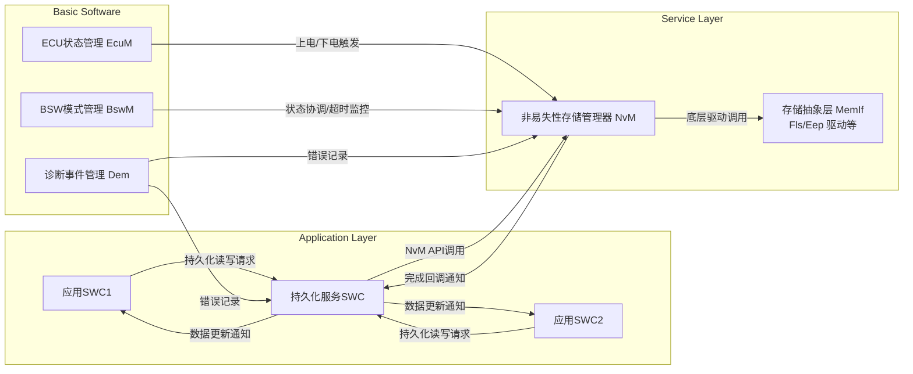
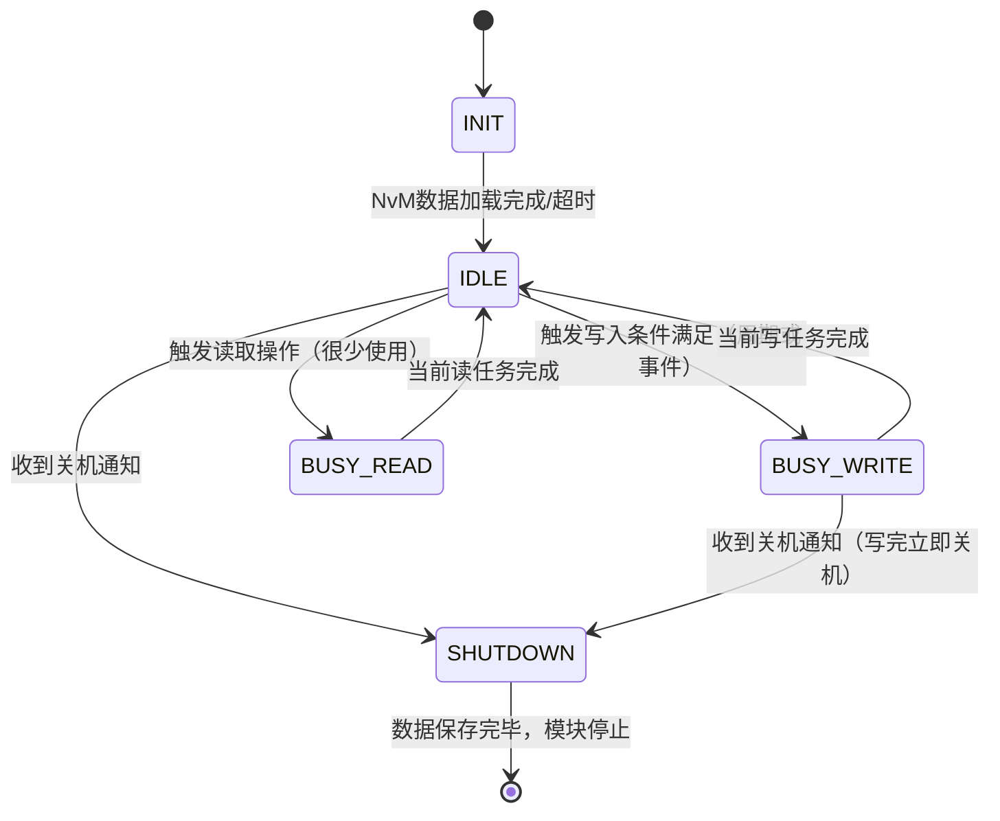

## 引言与背景

在AUTOSAR经典平台（Classic Platform，CP）的软件架构中，非易失性内存管理器（NvM，Non-Volatile Memory Manager）是基础软件服务层中的关键模块。NvM模块提供统一的接口供应用软件组件（SWC）和其他基础软件模块访问永久存储数据（例如读取和写入服务），负责管理EEPROM、闪存等非易失性存储介质上的数据。按照AUTOSAR标准，只有通过NvM模块才能访问NV存储，以确保数据一致性和底层存储的抽象。

随着汽车电子功能的复杂化和持久化数据需求的增长，应用SWC需要频繁保存各类配置参数、故障码、计数器和标定数据等以保证**断电不丢失**。但直接令每个SWC调用NvM服务，可能会引入如下问题：

- **接口复杂性：** NvM API涉及块ID、同步方式、默认值、作业状态回调等，应用SWC直接使用将增加开发难度，且SWC需要关心过多存储细节。
- **数据一致性：** 多个SWC可能同时访问持久化数据，若缺乏统一管理，可能导致竞争条件或数据不同步的问题。举例来说，一个SWC可能在NV写入尚未完成时就修改了数据，造成NvM写入的数据不是最新值。
- **写入策略优化：** NV存储介质（如闪存、EEPROM）具有写入次数有限和写入时间长的特性，需要全局策略（如合并写入、写入节流）以延长介质寿命并保证性能。单个SWC难以自行实现全局优化。
- **电源事件处理：** 上电初始化需要统一加载默认值或上次存储值，下电关机需要统一触发保存。如果每个SWC各自处理，流程复杂且容易遗漏。
- **错误处理与降级：** NV存储写失败、数据校验失败（如CRC错误）等情况需要统一策略（如重试、降级模式、恢复默认），分散在SWC中难以维护。

为了解决上述问题，我们在AUTOSAR CP架构下设计了一个**持久化服务中间件模块**（也称“NvM Proxy”持久化代理）。这个模块作为SWC与NvM之间的中间层，面向应用SWC提供简化且可靠的持久化数据服务。其总体目标包括：

- **抽象NvM复杂性：** 向上提供易于使用的RTE接口，SWC通过该服务读写持久化数据，而无需直接调用NvM原生API。模块内部完成Block ID映射、参数配置和NvM调用，使SWC与底层存储解耦。
- **数据同步与一致性：** 管理SWC端数据缓存与NV存储之间的同步。提供机制确保在NvM写入过程中SWC数据的一致性，不发生并发修改冲突，并保证SWC始终读取到最新的持久化数据。
- **集中写入策略：** 统一实现持久化数据的写入策略，例如变更检测、延迟合并写入、频率节流以及紧急数据即时写入等，平衡数据及时性与存储寿命。
- **生命周期管理：** 与ECU生命周期管理模块（EcuM）和模式管理模块（BswM）配合，在系统上电初始化时自动加载持久化数据，在系统关机时确保数据安全落盘。处理异常掉电场景，增强系统在断电/复位情况下的数据可靠性。
- **故障处理与容错：** 集中处理NvM读写失败、数据校验错误等情况，提供统一的错误恢复（例如使用冗余副本或默认值）、重试机制和功能降级策略，提高系统稳健性。
- **多核与多软件集群支持：** 可扩展至多核环境，或应用于包含应用软件簇和主机簇的场景（NvM High Proxy/Low Proxy架构），确保在跨核调用或跨分区部署时持久化服务的一致行为。
- **可测试性与可维护性：** 通过明确的接口和内部模块化设计，支持单元测试、集成测试。模块内部提供可插桩点和接口注入机制，方便模拟NvM行为、注入故障以验证容错逻辑，并能度量代码覆盖率，方便团队持续维护和改进。

本设计文档将详细阐述该NvM中间件模块（持久化服务）的架构设计与软件详细设计。内容涵盖模块的目的与作用、与应用SWC及底层NvM的接口设计、内部数据结构和状态机、写入策略、配置支持场景（CRC、冗余、数据集、Immediate块等）、上电初始化与下电流程、故障处理策略、多核兼容以及测试可行性设计等。文档将采用VuePress风格的技术博客形式组织章节，包含代码示例、Mermaid流程图和状态图，以工程化的语言清晰呈现方案细节。目标读者为系统架构师和软件开发人员，希望该蓝本能够为团队落地开发持久化服务模块提供参考价值，并作为培训和文档复用的基础。

## 模块概述与架构角色

### 模块的目的与作用

**持久化服务（Persistency Service/NvM Proxy）模块**在系统中的定位是：作为应用层SWC与AUTOSAR NvM服务之间的**桥梁**。它以**软件组件（SWC）**形式实现，运行在RTE之上，但本质上承担基础服务职责。在架构上，该模块具有如下角色和作用：

- **NvM接口代理：** 代替应用SWC直接调用NvM。AUTOSAR规范规定NvM模块提供对NV存储的统一访问，应用需通过NvM读写非易失数据。持久化服务模块实现NvM的代理，将NvM底层接口封装为更上层友好的接口，如提供读/写操作、数据有效性检查和完成通知等。对于应用SWC而言，它就像NvM的一个高层抽象代理（Proxy）。
- **持久化数据管理：** 维护应用需要持久化的数据的生命周期。从系统启动初始化这些数据（从NV存储加载，或使用默认值），在运行过程中跟踪数据变更，并在适当时机将变更保存回NV存储。它对每个持久化数据对象（NvM Block）进行统一管理，包括其RAM缓冲、副本、默认值和状态。
- **接口划分与解耦：** 模块通过RTE提供明确定义的**端口接口**（Port Interface）供SWC访问持久化数据，并通过调用NvM的接口完成实际存储访问。这样将上层应用逻辑与底层存储机制隔离开，上层SWC只需通过RTE端口与该服务交互，不直接依赖NvM，实现松耦合和可替换性。如果将来更换存储介质或策略，只需修改服务模块内部而不影响SWC代码。
- **策略与优化集中：** 将分散于各SWC的持久化处理逻辑收拢在一处，实现**统一的策略控制**。例如，可在模块内统一处理**写入节流**（防止频繁写闪存）、**写入合并**（短时间多次更新只保存最后值）、**崩溃情况下的立即保存**等策略，而SWC无需关心这些细节。集中管理也便于根据全局需求优化性能和资源占用。
- **可靠性增强：** 模块可在检测到NvM操作失败或数据损坏时，执行统一的错误恢复措施。如：如果读取NV数据CRC校验失败，模块自动加载默认值并通知上层；如果写入失败，记录失败状态等待稍后重试等。统一处理确保系统不同部分对存储故障的响应一致，并避免单个SWC遗漏错误处理导致的不一致行为。
- **配置和扩展方便：** 通过模块的配置表，可以集中定义所有需要持久化的数据及其属性（块ID、长度、是否校验、冗余、副本数等），新增或修改持久化项变得直观。同时模块设计可扩展支持多种配置场景（例如是否支持多数据集DataSet），甚至可以扩展支持Adaptive平台或跨ECU的数据持久化需求（可选的多核/多分区代理模式）。

综上，持久化服务模块的作用相当于为应用层提供了一个**“持久化数据库”接口**，应用可以像读写普通变量一样通过服务存取持久化数据，而模块在幕后负责所有存储管理工作。这大幅降低了应用开发复杂度，同时提高了系统持久化功能的健壮性和可控性。

### 总体架构关系

为更好地理解该模块在系统架构中的关系，下面通过一个高层视图描述其与SWC、RTE、NvM以及相关基础软件模块的交互：




如上图所示，持久化服务模块本身作为一个特殊的SWC存在于应用层。应用SWC（例如SWC1、SWC2）通过RTE与该服务交互，提出读写请求或接收数据更新通知（后续章节详述接口类型）。**持久化服务SWC**对下通过NvM的标准API访问实际存储，并在NvM完成操作时得到回调通知。

基础软件中，ECU状态管理模块（EcuM）在系统启动和关机阶段与NvM交互（例如调用NvM_ReadAll()在初始化时读取所有块数据，或NvM_WriteAll()在关机时写出所有数据）。模式管理模块（BswM）可能用于协调多块写入的时序或监控NvM操作完成。同样地，诊断事件管理（Dem）用于记录如存储读写失败等错误。持久化服务可根据NvM返回结果调用Dem报告持久化故障，以便后续诊断。

需要强调的是，在更复杂的部署场景下（如**多核**或**多软件集群**架构），可能存在**NvM高位代理**（NvM High Proxy）和**NvM低位代理**（NvM Low Proxy）的划分：高位代理在应用集群中替代NvM，低位代理在主机集群中连接实际NvM。我们的设计可扩展支持这种场景，但在单ECU经典平台下，可以将持久化服务看作单一实例SWC直接与NvM交互。后续内容主要聚焦单集群内的设计，并在附录中讨论多核扩展策略。

## 与应用SWC的接口设计

持久化服务模块作为SWC，通过AUTOSAR RTE与其他应用SWC交互。本章节详细说明该模块对上提供的接口、数据同步机制和触发控制策略。

### RTE端口接口概览

为了方便应用SWC使用，我们为持久化服务设计了**双向通信接口**：既允许SWC向服务发送新的数据，也允许服务将已存储或更新的数据提供给SWC。这通常通过**Sender/Receiver（发送/接收）端口对**来实现，或结合必要的Client/Server接口以触发保存动作。

设计要点如下：

- **NV数据端口（NvData Ports）：** 每类持久化数据在服务和SWC之间建立一组NvData端口，包含一个提供端口（P-Port）和一个需要端口（R-Port）。按照Vector DaVinci工具的NV Block SWC建模，这类似于Sender/Receiver通信。具体而言，对于某个持久化数据项：
  - **提供端口（P-Port）：** 由持久化服务SWC提供数据，应用SWC通过该端口获取数据值。服务在上电初始化完成NvM读取后，通过该端口发送初始值给应用；以及在后续检测到数据更新（如别的源更新了共享数据）时，推送新值。
  - **需要端口（R-Port）：** 由持久化服务SWC需要数据，应用SWC通过该端口将更新后的数据发送给服务。也就是应用作为Sender，服务作为Receiver。当应用运行中改变某配置参数并希望持久化时，通过写入R-Port将新值通知服务。

  通过这一对端口，实现**RAM块的双向访问**：服务模块内部维护的RAM数据既可以接收来自SWC的新值写入，也可以将自身的值发送出去供SWC读取。多个SWC可共同连接到同一持久化数据端口（一对多通信），服务模块会聚合这些来源。例如多个SWC共享某配置参数的情况。

- **操作触发接口：** 除数据端口外，某些场景下需要显式的操作指令，例如请求立即保存或读取。这可通过**Client/Server接口**实现。设计上，持久化服务SWC提供相应的Server端口，定义操作如：
  - `PersistencyService.WriteNow(BlockID)`：供SWC请求立即将指定的数据块写入NV存储。例如在某用户操作后，需要立刻保存设置，不想等待批量策略。
  - `PersistencyService.Read(BlockID)`：请求服务从NV存储重新读取指定块（通常很少用，因为服务会上电时已读取，除非需要重装默认）。
  - `PersistencyService.SetDataIndex(BlockID, index)`：针对数据集（Dataset）类的块，应用可调用此接口切换当前使用的数据集索引，以便随后读写不同的数据集元素。
  
  这些Server接口通过RTE调用NvM服务，服务实现相应逻辑：WriteNow可能直接触发NvM_WriteBlock；SetDataIndex封装NvM_SetDataIndex调用；Read则封装NvM_ReadBlock等。当这些操作完成后，服务模块可通过RTE的返回值或回调告知SWC执行结果。

- **作业完成通知接口：** 为使应用SWC知道持久化操作的完成与否，可选用**通知机制**。两种方案：
  1. **Explicit回调**：SWC实现特定回调接口，RTE绑定NvM的Job Finished通知。当对应块写入完成或失败时，NvM通过服务模块调用SWC提供的回调函数（或发送完成信号）。这种方式要求SWC实现接口，稍增加复杂度。
  2. **状态查询**：SWC在下一周期通过状态接口查询某块的最新状态（Idle/Success/Failed等）。服务模块维护每块最近一次操作状态，可通过一个Client/Server接口 (`GetStatus(BlockID)`) 提供。SWC定期查询即可，无需异步回调。

在我们的设计中，更倾向第二种方式以减少上层复杂度。不过对于关键数据的即时反馈，第一种方式也可配置支持。如果使用Vector NV Block SWC模型，RTE可自动生成JobFinished通知端口，服务SWC在NvM任务结束时触发通知。我们在配置上将其作为可选项，使架构灵活适配不同需求。

### 数据同步机制

**数据同步**是指保持应用SWC的数据和持久化服务模块内部RAM缓存及NV存储之间的一致性。这里涉及两个关键场景：

1. **上电初始化数据同步：** 当ECU启动时，持久化服务需要从NV存储加载数据到RAM，并提供给应用SWC使用。
2. **运行时数据更新同步：** 当应用修改某持久化参数时，服务模块需要及时获知并保存，同时在必要时将更新后的值反馈给其他组件或影子存储。

为了实现上述同步，我们采用**显式同步**策略来确保一致性。所谓显式同步，即服务模块在NvM操作过程中使用单独的RAM镜像缓冲区来交换数据，避免SWC直接操作NvM内部缓冲。这与NvM隐式同步（应用直接写NvM的RAM Block）的方式相对。

具体方案：

- **RAM Buffer与镜像：** 持久化服务模块为每个NvM数据块在内部定义一个**RAM缓冲区**（对应Permanent RAM Block）。应用SWC的RTE发送端口可直接指向该缓冲区或者服务对其封装写接口。平时SWC读取/写入的都是这个RAM拷贝。NvM在执行读写操作时，服务模块会将RAM缓冲的数据复制到NvM要求的镜像区域再执行存储写入，或从镜像复制回RAM缓冲，从而**隔离应用对数据的直接修改**。这种“双缓冲”设计保证当NvM正在写入时，SWC仍可安全地读写自己的缓冲而不会干扰进行中的NV写操作。

- **临界区保护：** 为防止数据不同步，服务模块在**调用NvM写入API (NvM_WriteBlock)**前后，对相关RAM缓冲实施锁定或标记：在触发写入后到写操作完成之前，不允许SWC再次修改该缓冲，或即使修改也不会被接受。这相当于**SetRamBlockStatus**的运用——NvM提供NvM_SetRamBlockStatus(TRUE)可标记块数据已改变，从而NvM_WriteAll时知道要写入。我们的服务模块会在SWC每次更新数据后，将相应块标记为“待写入”（Dirty）。当实际写入进行时，则标记为“写进行中”，在此期间拦截新的更新写入请求，以免出现NvM尚未写完又收到二次变化的不一致情况。一旦NvM完成写入，服务模块清除标记，允许后续更新。

- **数据推送与获取：** 利用前述双向端口，保证SWC和服务之间的数据同步：
  - 当服务模块在**上电时**从NvM加载了某块数据后，即刻通过提供端口将该数据发送给应用SWC，确保SWC获取初始值。如果NvM加载失败而使用了默认值，服务也同样推送默认值并可能标记该数据“来自默认”以便SWC知悉（可通过状态接口或Dem事件）。
  - 当**运行过程中SWC更新**了数据（通过R-Port发出），服务模块收到新值后，首先更新自己的RAM缓冲，然后标记该块Dirty。在下一次写策略执行时再决定何时写入NV。在此过程中，如果该数据也提供给其他SWC，服务会通过P-Port将更新值广播给它们，实现全局同步（例如多SWC共享配置的情况）。
  - 如果**多个SWC同时更新同一数据**，RTE的最后写入者会覆盖RAM缓冲。但服务模块可以通过RTE的Queued Communication或锁保护避免竞争。通常设计上应尽量避免一块数据由多个并发写入源，这需要架构层面协调。

- **显示/隐藏复杂性：** 对应用SWC来说，这种同步过程是透明的。SWC只需进行普通的变量赋值并通过RTE端口写出数据，或订阅端口以获取数据，无需关心底层什么时候真正写闪存。服务模块内部通过上述机制保证最终一致性。正如AUTOSAR规范对NvM同步的总结：显式同步模式下应用调用NvM_WriteRamBlockToNvM等接口完成数据交换，然后即可继续修改RAM数据，无须等待NV写完。我们借鉴这一思想，将复杂性藏于模块内部。

### 触发控制设计

**触发控制**涉及决定**何时**进行NvM读写操作。在设计中，我们结合系统生命周期和应用需求，采用多种触发方式相结合的策略：

- **上电读取触发：** ECU上电初始化阶段，由EcuM或BswM触发持久化数据的装载。典型情况下，EcuM配置在启动时调用NvM_ReadAll()以一次性读取所有配置的数据块。我们的服务模块在初始化过程中，会等待NvM_ReadAll完成的通知，然后将各数据块加载到RAM缓冲，并通过RTE提供端口分发给相关SWC。如果未使用NvM_ReadAll，我们也可以在服务Init函数中按配置表顺序调用NvM_ReadBlock逐个读取关键块。无论哪种方式，上电时的读取由**系统初始化触发**，应用SWC无需调用任何接口即可得到初始数据。

- **周期性触发保存：** 为平衡数据及时持久化与频繁写入的冲突，我们支持**周期性保存**机制。服务模块配置一个周期性Runnable（通过Timing Event，例如每100ms或1s调用一次）检查是否有需要写入的块。如果发现Dirty标记并且满足写入条件（如超过最小延迟），则调用NvM_WriteBlock执行保存。这个**轮询触发**机制类似守护进程，确保即使应用未显式请求，数据也能定期flush到NV。例如，每隔1分钟保存一次所有改变的数据，以防长期未关机导致数据长时间未落盘。

- **事件驱动触发：** 某些关键数据需要在事件发生时立即保存，例如：
  - **数据变更立即触发：** 可以配置当特定数据块经R-Port收到新值时，立即触发NvM_WriteBlock操作，而不等待周期任务。这在Vector的NvBlock SWC模型中称为“On Data Reception”触发。我们在配置中允许为某些块开启该选项，使其一有更新就立刻持久化（通常用于重要标志或计数器，确保一更新就保存）。
  - **显式请求触发：** 如上文提到SWC可以通过Client/Server接口请求立即保存。服务接收到如`WriteNow`调用后，会立即为对应块执行写操作。这种触发方式典型用于用户按下“保存”按钮等情景，由应用逻辑直接指示。
  - **模式切换触发：** 结合AUTOSAR模式管理，服务模块可以订阅EcuM或BswM的模式通知。例如在IGNITION OFF（点火关闭）模式进入时，触发一次NvM_WriteAll保存所有数据；在特定运行模式退出时保存当前参数集等。Vector工具支持配置“On Mode Exit/Entry”触发，我们的设计同样允许基于系统模式进行持久化操作控制。

- **关机触发保存：** ECU关机（如整车下电）时的持久化保存至关重要。通常EcuM会在关机序列中调用NvM_WriteAll()将所有标准块写入NV存储。服务模块配合这一流程：在接收到关机事件时（通过BswM通知或EcuM钩子），若有剩余未保存的数据，会立即调用NvM_WriteAll或逐块写入，确保在电源断开前完成保存。关机触发通常与**电源保持**机制相关，即车辆断电后ECU保持供电几百毫秒执行保存操作，因此需要尽量减少写入量以在窗口内完成。我们的策略是在平时运行中已保存绝大部分数据，仅留极少必要数据到关机时写，从而缩短关机保存时间。

通过以上多层次的触发控制，持久化服务模块能够兼顾**数据实时性**和**存储寿命**。对于一般配置数据，采用周期保存或关机统一保存即可；对于关键安全数据（Crash Data等），采用数据变更立即触发和高优先级立即队列（后述）保证及时落盘。灵活的触发机制让系统架构师根据需求调整持久化行为，实现性能与可靠性的平衡。

## 与NvM模块的接口与映射

持久化服务模块对下通过调用AUTOSAR NvM模块的API来实现实际的非易失性存储读写。本章节讨论服务模块如何映射应用数据到NvM配置的Block，以及与NvM交互的细节，包括Block ID分配、全局读写控制和状态映射等。

### NvM Block与ID映射

AUTOSAR NvM管理的数据单元称为**NVRAM Block**（NV块），每个块在配置中有唯一的**Block ID**。NvM通过Block ID标识读写的数据对象，并在内部维护**块描述表**来关联ID与实际存储区域、长度、CRC配置等。持久化服务模块需要为所管理的每个持久化数据项分配一个NvM Block，并确保ID不冲突。

**Block ID分配策略：**

- **集中编号：** 我们在持久化服务的配置中维护**Block映射表**（详见后文示例），列出每个数据项对应的Block ID。ID范围可以根据项目规划，例如1-100预留给持久化服务模块使用，101以上留给其他模块使用，避免冲突。也可以由NvM配置工具全局管理ID唯一性。
- **含义编码：** 可选地，ID可以有分类含义。例如1-10用于关键标定参数，11-50用于用户个性化设置，51-80用于诊断记录等。这样方便维护和排查。但无论何种编码，ID必须与NvM配置保持一致。
- **配置ID块：** AUTOSAR NvM规范建议Block ID 1通常保留作**配置ID块**，用于存储NvM配置校验码。我们的设计遵循此约定，在ID 1上不会映射普通应用数据，以免与NvM配置ID冲突。
- **Symbolic Names：** 为方便代码可读性，每个Block ID会定义符号常量，如`NVM_ID_ODOMETER=10`等。持久化服务内部和SWC调用NvM接口时都使用符号名。NvM High Proxy（如有）会提供这些符号常量供应用集群使用。

**NvM接口映射：** 持久化服务模块内部对每个Block知道：
- 数据长度、
- 存储介质类型（由NvM Device ID决定，0表示FEE/Flash，1表示EA/EEPROM等）、
- 默认值位置、
- RAM缓冲地址等。

当需要读写时，服务模块会调用NvM的API，如：
- `NvM_ReadBlock(BlockID, RamBufferPtr)`：读取Block数据到提供的RAM缓冲。如果我们使用Permanent RAM Block配置，此调用的指针可以NULL，NvM会自行使用内部已知地址；若Temporary RAM Block则传显式地址。
- `NvM_WriteBlock(BlockID, RamBufferPtr)`：写入Block数据到NV。如果配了Permanent RAM Block且调用NvM_WriteBlock时指针为NULL，则NvM使用之前注册的NvmRamBlockDataAddress处的数据。在服务模块设计中，我们通常使用Permanent模式，提前将RamBuffer地址告诉NvM配置，这样调用NvM_WriteBlock时可简化参数且确保一致性。
- `NvM_SetRamBlockStatus(BlockID, TRUE/FALSE)`：标记RAM块状态为已修改或未修改。服务模块在SWC更新数据后调用TRUE，告知NvM该块需要保存；在我们自行管理Dirty的情形下，可以不依赖NvM此接口，而通过NvM_WriteAll时的自动机制（NvM_WriteAll会写入所有ValidChanged状态的块），不过如果NvM_WriteAll调用前某块未被标记，将不会写。为了安全，服务模块可能在shutdown触发NvM_WriteAll前，对所有Dirty块先SetRamBlockStatus(TRUE)确保写入。
- 其他接口如`NvM_CancelJobs()`、`NvM_GetErrorStatus()`等，根据需要调用。一般Cancel在紧急情况下中止队列、GetErrorStatus可查询最近一次操作结果，用于我们状态映射。

### ReadAll/WriteAll 管控

**NvM_ReadAll()** 和 **NvM_WriteAll()** 是NvM提供的多块操作接口，用于一次性读/写全部配置的NVRAM块。我们需决定何时以及如何使用它们：

- **上电读取 (ReadAll)：** 正如前述，在ECU上电初始化时，通常由EcuM调用NvM_ReadAll()。此调用将触发NvM按照配置依次读取所有NvM块的数据到RAM，并对每块执行CRC校验、ID校验等。如果某块读取失败（如CRC错误），NvM会自动加载默认值到RAM，若配置了冗余还会尝试冗余块，然后再不行用默认值。当ReadAll完成后，NvM会通知EcuM/BswM，服务模块此时应当获取各块的RAM数据。通常来说，如果服务模块采用Permanent RAM模式，那么这些RAM数据已经在我们的缓冲区地址上了，我们只需知道ReadAll结束即可使用。如果使用Temporary模式，则需要在ReadAll后调用NvM_ReadBlock一个个获取。有两种实现策略：
  1. **依赖NvM自动加载：** 配置每个Block的NvmRamBlockDataAddress指向服务模块的缓冲区，并启用随ReadAll加载。如果如此，那么NvM_ReadAll结束时，服务模块缓冲已填充数据。我们可以通过NvM提供的SingleBlockCallback或Dem通知来确认各块状态，然后分发数据。
  2. **手动逐块读取：** 如果项目需要精细控制顺序，也可以不调用NvM_ReadAll，而是在服务模块Init阶段按顺序调用NvM_ReadBlock。每次调用后等待完成再处理下一块。这给了我们在两次读取间处理错误的机会。不过大多数情况下使用NvM_ReadAll即可满足需求且速度更快（因为驱动层可能优化连续读取）。

  我们的设计默认采用**NvM_ReadAll自动加载**方式，以简化流程和确保与EcuM的集成。如果EcuM未配置自动ReadAll，我们会在PersistencyService_Init中主动调用NvM_ReadAll，并等待其完成（可以通过轮询NvM_GetErrorStatus或注册NvM回调函数获取完成通知）。

- **下电写出 (WriteAll)**： ECU关机时调用NvM_WriteAll()是保存所有Standard类型NvM块的常用做法。WriteAll会检查每个块的RAM状态，仅对标记为ValidChanged的块执行写入。使用WriteAll的优点是NvM内部可能对Flash擦写顺序等进行优化，并将多个写操作放在一个服务周期中完成。然而，WriteAll的缺点是**耗时不可知**——如果块很多或Flash写入缓慢，可能超过关机允许时间。因此我们在策略上：
  - **平时分散写，关机尽量无任务：** 通过运行中周期性写和及时写，把大部分块提前写好，使关机时Dirty块尽量少。NvM_WriteAll只处理零星未保存的修改，从而加快关机速度。如果系统严格要求关机时间，我们甚至可以在BswM监控到IGN_OFF时，立即在后台触发WriteAll，然后在实际断电前完成。
  - **确认WriteAll完成：** EcuM通常会等待NvM_WriteAll完成或超时后再切断电源。因此服务模块可以选择不直接调用NvM_WriteAll，而是信任EcuM流程。但作为保险，我们可以在EcuM通知关机的钩子中，再调用NvM_WriteAll确保万无一失（前提是避免与EcuM重复调用冲突）。
  - **选择性WriteAll：** NvM配置可选择哪些块参与WriteAll。如果有些块不需要每次都写，比如某些统计计数可以偶尔写，那可以配置成Immediate类型不参与WriteAll，或者完全排除在NvM配置之外。在服务模块中，我们通过配置表的标志来决定是否让块在WriteAll中写出（NvM配置参数NvMWriteAll对每块可配置）。

总的来说，我们确保**ReadAll在启动时被调用**且成功完成，使服务模块拿到可靠的初始数据；**WriteAll在关机时被调用**确保所有改动保存。服务模块在这两者周边执行必要的操作（如在ReadAll前做好准备，在WriteAll后记录状态）。尤其注意NvM_ReadAll/WriteAll是异步的，要正确处理其完成信号以避免竞态。

### NvM状态与错误码映射

NvM模块运行中会产生一些状态和返回码，持久化服务需要将其转换（mapping）为对上接口可理解的状态表示，或用于内部决策：

- **NvM Job结果码：** 每次NvM读/写操作完成后，可通过NvM_GetErrorStatus(BlockID)得到结果，比如`NVM_REQ_OK`（成功），`NVM_REQ_NOT_OK`（失败），`NVM_REQ_PENDING`（进行中），`NVM_REQ_CANCELLED`（被取消）等。服务模块会在回调或轮询中获取这些状态，将其存储在内部的状态变量中。对上提供状态查询接口时，将这些状态翻译：
  - 成功 -> “成功/有效”状态。
  - 失败 -> “失败”状态，并可能细分原因（如超时、CRC错等，如果NvM提供的话）。
  - Pending则通常不对上暴露，因对上来说调用是异步的，只需过会儿再查即可。

- **RAM块有效性状态：** NvM对每块维护行政状态，如Valid/Invalid和Changed/Unchanged组合：
  - **Valid Unchanged：** RAM数据和NV一致且未修改。
  - **Valid Changed：** RAM数据有效但已修改（尚未写回NV）。
  - **Invalid Unchanged：** RAM数据无效（通常刚初始化或读失败时），未修改。
  
  服务模块可读取这些信息（NvM内部Admin block存着状态），或者自行判断（例如我们有Dirty标志可以类比Valid Changed）。对上层SWC，我们可以不直接暴露这些专业术语，而是用简单标志：
  - DataAvailable (数据可用且最新)，
  - DataDefaulted (当前数据为默认值，意味着NV无有效数据)，
  - DataDirty (数据已更改尚未保存) 等。

  例如，上电如果某块Invalid Unchanged且NvM加载了默认，则我们标记DataDefaulted = TRUE用于应用决定是否提示用户恢复默认。

- **错误分类映射：** NvM可能报告各种错误，例如：
  - NVM_E_NOT_OK 一般性失败，
  - NVM_E_BLOCK_SKIPPED（WriteAll时块未写因为未改或者保护），
  - NVM_E_WRONG_BLOCK_ID（静态ID校验失败），
  - NVM_E_NV_CRC_FAILED（CRC校验失败），
  - NVM_E_TIMEOUT 等等。
  
  服务模块可以通过Dem或者日志输出来记录这些错误，并在必要时转换为对上通知。例如CRC失败我们可能在SWC中设一个故障码或状态提示“数据损坏，已恢复默认”。又或者WrongBlockID这种严重配置不匹配错误，我们可以触发安全反应（比如停用某功能）。这些策略属于**降级处理**范畴，在后文故障处理部分详述。

- **驱动层错误：** 一些错误来自下层存储驱动，如EEPROM擦写失败等，NvM会将其包装成NVM_REQ_NOT_OK并通过Dem错误码报告。服务模块无需关心具体驱动错误，只需处理NvM提供的结果。但在调试阶段，可通过NvM的扩展接口获取更细信息。

**Dem事件集成：** 强烈建议在NvM配置中使能错误报告，将NvM重要的错误情况映射到Dem事件（例如NvM_E_WRITE_FAILED，NvM_E_LOSS_OF_REDUNDANCY等）。服务模块也可以在检测到反复的写失败或数据恢复默认时，主动报告Dem事件（如“持久化存储故障”）。这样整车诊断能够捕捉这些信息，提高可维护性。

## 内部设计与数据结构

持久化服务模块的内部设计遵循**模块化、状态机驱动**原则，包括用于描述持久化数据的配置表、跟踪运行状态的状态机和负责执行写入策略的控制逻辑。本章详细描述模块的关键数据结构和运行机制。

### 持久化块配置表

模块内部使用一个**持久化块配置表**（Block Management Table）来描述所有受管的NvM块及其属性。这个表通常在编译期根据配置生成，形式可以是C语言结构数组或配置容器的映射。其每个元素（即每个NvM块）包含如下信息：

```c
/** 持久化块配置结构体 **/
typedef struct {
    uint16    NvBlockID;            // NvM Block的ID
    uint16    DataLength;           // 数据长度（字节）
    uint8     DeviceID;             // 存储介质ID (0=FEE/Flash, 1=EA/EEPROM, ...)
    uint8     ManagementType;       // 块管理类型: 0=Native, 1=Redundant, 2=Dataset
    uint8     DatasetCount;         // 数据集个数（若为Dataset类型）
    boolean   UseCrc;               // 是否使用CRC校验
    boolean   UseImmediate;         // 是否Immediate块（TRUE=立即写类型，FALSE=标准类型）
    boolean   WriteOnlyOnce;        // 是否Write-Once只写一次（如里程表防回滚）
    uint8     Priority;             // 块优先级（0=普通, >0=高优先级，决定Immediate队列顺序）
    void*     RamAddr;              // RAM缓冲区地址（持久化服务中的存储地址）
    const void* RomAddr;            // 默认值存放ROM地址（若有）
    // ... 其他配置，如Block校验模式、冗余块ID等
} NvMProxy_BlockConfigType;

/** 所有块配置表（由配置工具生成并链接） **/
extern const NvMProxy_BlockConfigType NvMProxy_BlockConfigs[];
extern const uint16 NvMProxy_BlockCount;
```

以上结构仅举例，具体字段视实现细节而定。需要强调的配置意义：

- **ManagementType（块类型）：** 标识块是Native、Redundant还是Dataset。Native类型最常见，对应1个NV块+1个RAM块；Redundant类型有两个NV块+1个RAM块用于冗余；Dataset类型对应多个NV块索引+1个RAM块。服务模块利用此字段来调整处理逻辑：如冗余块在出错时尝试读第二块，Dataset块切换索引时调用NvM_SetDataIndex等。
- **UseCrc：** 标明NvM是否为该块配置CRC校验。如果TRUE，NvM读写时会计算校验值并存储/验证；服务模块在读取后若发现NvM返回CRC错误（通过NvM_GetErrorStatus），将知道数据取自默认值，需要相应处理（比如报告数据损坏事件）。
- **UseImmediate：** 标记该块是否配置为Immediate类型（即时块）。Immediate块一旦通过NvM_WriteBlock请求，就不会延迟，而是直接进入NvM的“立即队列”处理。我们在模块中看到UseImmediate=TRUE的块，应在应用更新后**尽快调用NvM_WriteBlock**而非等待周期批量，也可利用NvM的优先机制使其尽快写入（NvM有独立立即写队列）。UseImmediate=FALSE的块则归入标准队列，由NvM_MainFunction调度或WriteAll统一处理。
- **WriteOnlyOnce：** 针对某些数据（如里程计）只允许写入一次递增，不允许回退，NvM提供NvMWriteBlockOnce等配置。服务模块可参考此标志拒绝多次写入。
- **Priority：** 块优先级，用于区分**Crash数据**等高优先级场景。如配置为高优先级且Immediate，则NvM会将其放入**立即写队列**并抢占普通写队列执行。我们的配置表Priority字段可从NvM配置直接读取（NvM配置有JobPriority参数），模块本身不直接更改NvM调度，但可根据Priority决定是否采用特殊处理（如重要数据出错时多试几次等）。
- **RamAddr 和 RomAddr：** 内存地址用于数据存储和默认值。这些地址通常由链接配置：RamAddr指向模块内定义的静态缓冲区，长度为DataLength；RomAddr指向常量的默认数据（如果有）。当NvM读失败需要默认值时，它会使用RomAddr数据写入RamAddr。服务模块初始化时也可以直接拷贝RomAddr内容到Ram以备NvM无数据情形。

上述配置表在代码生成后将被编译为常量存储，服务模块通过遍历或索引访问。这样新增持久化项只需修改配置，不影响模块逻辑。后文**配置模板与示例**将给出实际配置片段示例。

### 内部状态机

持久化服务模块运行过程中需要跟踪自身及各数据块所处的状态。我们设计了两层状态机：

**1. 模块全局状态机：** 描述持久化服务整体的工作阶段和模式：

- **INIT（初始化）：** 模块刚启动，等待NvM初始化和数据加载完成。在此状态模块会阻止应用写操作（或者先缓存起来）直到读取完毕。INIT阶段结束的条件是NvM_ReadAll完成或所有关键块已读入RAM。
- **IDLE（空闲待命）：** 正常运行状态，没有正在进行的NvM操作，模块在等待触发条件（定时或事件）来执行写操作。大部分时间模块处于IDLE，可响应SWC的读写请求，将新的数据标记Dirty等。
- **BUSY_WRITE（写进行中）：** 模块当前正在执行NvM_WriteBlock/WriteAll操作。进入该状态通常因为定时触发或立即触发写。模块可进一步细分BUSY子状态如 “BUSY_SINGLE” vs “BUSY_ALL” 以区别单块写还是WriteAll。处于BUSY时，可能限制新的写请求加入（或者加入队列但不会立即执行）。
- **BUSY_READ（读进行中）：** 较少见，一般上电ReadAll完成即进入IDLE。不过如果运行中需要调用NvM_ReadBlock重新加载某块（比如恢复默认操作），可以进入BUSY_READ状态，在读完成后回到IDLE。
- **SHUTDOWN（关机同步）：** ECU关机流程中，模块等待所有数据写完。这个状态通常由BswM通知触发，当进入关机模式时，模块切换到SHUTDOWN，立即或尽快保存剩余数据，并与EcuM协调完成后允许关机。成功完成后模块自身可能停止调度。

状态转换关系可以用状态图表示：



这套状态机确保模块按部就班地执行任务。例如，在INIT时如果某关键块迟迟未能读出（可能因为NvM驱动故障），模块可在超时后继续进入IDLE并使用默认数据，同时上报错误，避免卡死在初始化。再如，SHUTDOWN状态会等待BUSY_WRITE完成再切换，以免中途终止写操作。

**2. 每个Block的状态跟踪：** 我们也为每个数据块维护简化的状态标志，主要包括：

- **Dirty 标志：** 表示RAM数据是否修改未保存，相当于NvM的ValidChanged状态。初始从NvM加载后Dirty=FALSE；SWC更新后置TRUE；写入NV成功后重置FALSE。
- **NV可靠性标志：** 表示NV存储中的数据是否可信。有些情况如CRC错误导致加载默认值，我们将此标志设为FALSE，以提示后续需要采取行动（比如写回默认）。正常加载则为TRUE。冗余块如果单一路径坏掉，只要有一个成功也视为TRUE，但可增加一个“降级”子状态（说明冗余容错用了一份）。
- **WriteAttempt计数：** 记录该块写尝试次数，供失败重试策略使用。可以每次成功写入清零，每次失败++，超过阈值则不再重试并标记永久故障。
- **LastResult：** 保存上一次NvM操作结果码，例如NVM_REQ_OK或错误码，用于调试和决定是否报告诊断。

这些状态通常存储在模块的RAM中，可以在Block配置结构体扩展字段，或使用平行的状态数组通过Block索引访问。实际上，NvM自身也有Administrative Block保存类似信息。为了避免重复，我们的小型状态跟踪可以与NvM的状态同步更新：例如NvM回调告诉我们写成功，我们就将Dirty清零等。对Dirty的判断我们也可直接用NvM提供的API NvM_GetErrorStatus或NvM_GetErrorStatusList，如果可用的话。

### 写入策略与调度

写入策略是持久化服务的核心控制逻辑，决定何时、如何将Dirty数据写入NV存储。综合前面的触发机制和配置参数，这里的策略包括：

- **合并写（Merged Write）：** 当某块数据被频繁更新时，避免每次更新都写入NV，仅保存最后一次的结果。例如，一个计数值在1分钟内变化多次，但我们只需在最后保存最终值。服务模块实现上，可以在接到SWC更新后**不立即写**，而是标记Dirty并启动一个延迟计时器（比如延迟500ms或更长，根据需要）。如果在延迟期间又收到新的更新，则重启计时器。只有当更新间隔超过阈值，才触发真正写入。这保证在频繁变化期间仅最后一次值会写入NV。对于不太频繁变化的数据，此延迟几乎不影响及时性。我们会针对不同块允许配置不同的**合并窗口**时间长度，以适配数据特性（例如用户滑动调节一个设定值时，最后停下时再保存）。

- **节流（Throttling）：** 控制一定时间内的写入次数上限，以保护存储介质和避免阻塞总线。例如规定每个块**至少**间隔N秒才能写一次。如果某块上次写入刚发生不久，则即便有新修改也延迟到间隔满足后再写。这个策略可以叠加在合并写上：先合并短时间内的变化，然后仍确保长周期内写入频率有限。节流参数N可以根据Flash耐久度和使用场景来定，如典型Flash每块寿命100k次擦写，假设产品10年寿命，则平均每天最多写几十次，因此N可设几秒到几十秒来平衡。这一参数在配置表中可添加字段指定，或全局设定一个默认节流间隔。

- **优先级与立即写（Priority & Immediate）：** 某些关键数据不应用上述延迟策略，而应该**立即写**。例如Crash数据（碰撞记录），务必要第一时间保存，否则一旦断电丢失就无法还原。我们通过配置Priority和UseImmediate标志来识别这些数据。服务模块对它们采用**特殊通道**处理：
  - 当Crash类数据Dirty时，立刻暂停普通队列，将该写操作发送到NvM的Immediate队列处理。在NvM配置中已将这些块标记JobPriority=true启用立即写队列。NvM会优先执行这类写请求。
  - 我们在软件上也可通过**中断当前延迟**的方式处理：即如果某块Priority高，则不考虑节流和合并，直接调用NvM_WriteBlock。必要时还可调用NvM_CancelWriteAll取消当前批量操作以腾出资源（极端情况下）。
  - 另外，对于**Write-Once**类型的数据，若它本身也是重要数据，则我们的服务可能在第一次写入NV后，将SWC侧接口锁定防止再次修改，以确保写入一次后不可更改（NvM也有保护，但应用层再加一道保险）。

- **崩溃保存（Crash Write）：** 这里特指**在系统崩溃或异常状况**下的数据存储策略。两种情境：
  1. **软件检测到致命错误**：例如操作系统监测到看门狗超时即将复位，或者关键任务异常，我们可以在最后的瞬间触发持久化服务保存重要数据。由于正常调度可能停止，我们需要一个轻量级接口，比如直接调用NvM_WriteBlock保存几个关键块（如故障快照、当前运行模式）。这可以通过定义一个**崩溃处理回调**（比如WDGM的错误Hook里调用服务模块提供的EmergencySave函数）完成。需要注意此时环境可能有限制，如不能调度复杂任务，只能同步写。当然Flash写需要时间，如果电源不稳可能写不完，因此通常只保存极少量特别重要的数据。
  2. **电压下降掉电**：一些ECU硬件有**早断电信号**或**电容维持时间**。可以将此视为崩溃场景的一种，BswM或EcuM会捕获电源掉电通知，在电压完全消失前触发NvM_WriteAll或服务的EmergencySave。我们的服务模块应该提供接口给BSW调用，在这种场景将所有重要Immediate块和Dirty块尽可能写出。如果时间非常有限，也许只能写出提前选定的Crash Data块而非全部。

  总之，Crash Write是非常规的策略，目的是在非正常关机时尽量保存关键数据，其实现要考虑在中断或异常环境中调用NvM的可行性。通常NvM本身并无特殊Crash Write API，只能使用Immediate块机制+系统设计保证有足够时间完成几次写入。我们在文档中将这种场景单列强调，以指导开发时做好对应设计（例如确保关键数据配置为Immediate并保守估计写入时延）。

- **关机批量写**：先前已讨论，此处补充实现要点：关机时服务模块可能选择**调用NvM_WriteAll**或**遍历Dirty块调用NvM_WriteBlock**。从设计简洁性和NvM内部一致性来说，NvM_WriteAll更好（NvM内部会跳过未修改块，写发生更快）。实现上，我们在接到关机通知时：
  - 如果此前没有其他写在进行，则直接调用NvM_WriteAll，然后等待完成信号（可以设定最大等待时间，通过BswM监控）。
  - 如果此时正有BUSY_WRITE在进行，则视情况：若是单个块写，可等待它完成再调用WriteAll；若已经在执行WriteAll，那重复调用没有意义，只需等待其完成。
  - 为安全起见，可设定一个全局flag表示“ShutdownOngoing”，后续就不再接受新的写请求，防止关机过程中又收到SWC新修改导致数据不一致。SWC此时的修改要么被忽略，要么标记为下次开机时Dirty（可商榷，看数据性质）。

写入策略的执行通常由**定时主函数（MainFunction）**和**事件回调**共同完成：Timer触发时检查Dirty列表并应用合并/节流规则决定写哪些块；事件如SWC请求立即写或Crash事件则立即调用写函数。内部可以实现一个**简易调度队列**：

- 有序队列1：普通块等待写（FIFO顺序，但可合并：队列中已有的相同块更新则丢弃旧条目）。
- 有序队列2：高优先级立即块等待写（按照Priority排序）。

MainFunction运行时，若非Shutdown模式，处理高优先级队列直到为空，然后视时间片处理一个普通队列请求。如果Crash发生或者SWC调用了WriteNow，则将对应块插入高优先级队列或直接触发写流程。这类似于NvM内部的双队列机制，只是我们在服务层再管控一层，以便灵活调整。

综上，写入策略通过**合并**减少重复写，**节流**控制频率，**优先队列**保障关键数据及时性，**特殊场景预案**（崩溃、关机）确保即使意外也尽可能保存。这样的多管齐下，使持久化服务既高效又稳健。

## 配置场景支持

AUTOSAR NvM模块支持多种配置场景以满足不同应用需求，包括CRC校验、冗余块、数据集、立即块等配置选项。持久化服务模块在设计时充分考虑了这些场景，以确保无论NvM如何配置，本模块都能正确工作。下面分别讨论：

### CRC 校验支持

**CRC校验**（循环冗余校验）通常用于检测NV数据的完整性。NvM可按块配置是否附加CRC以及CRC位宽（8/16/32位）。当启用CRC时，NvM在写入该块时计算CRC并存储，读取时重新计算比对，以判断数据是否损坏。

服务模块对CRC支持的设计要点：

- 配置表中的UseCrc标志指示块启用了CRC。对于UseCrc=TRUE的块，服务模块**无需自行计算CRC**，这一切由NvM完成。但是需要处理NvM报告的结果。例如NvM_ReadAll或NvM_ReadBlock返回错误码指示CRC失败，则NvM会将默认值提供给RAM。服务模块应识别这种情况，可能通过NvM_GetErrorStatus检测NVM_E_NV_CRC_FAILED，然后：
  - 将**NV可靠性标志**设为FALSE，表示当前数据并非来源于有效NV存储而是默认。
  - 记录诊断事件，例如Dem报告NvM的CRC错误事件（NvM也可能自动报，具体看配置）。
  - 如果业务有要求，可通知SWC层某数据恢复了默认（比如设置一个“恢复默认”标志，使应用界面上提示用户）。
  - 后续可以决定**是否尝试覆盖写**：有的策略是，如果CRC坏了，启动时用了默认值，则在合适时机重新写一次默认值到NV，让CRC重新匹配，避免下次仍报告错误。服务模块可以在Idle时检测到某块NV可靠性FALSE且Dirty=FALSE（应用未改过），那么调用NvM_WriteBlock写入默认，以修复存储。这种行为可配置启用。

- 在写操作方面，如果UseCrc=TRUE，NvM在NvM_WriteBlock时会计算CRC，不需要服务模块关心。但**写时间**会略长，因为算CRC增加开销。服务模块若有性能考量，可以在写入策略上对有CRC的块稍微降低频率或打组处理，不过一般不用特别区分。

- 如果项目要求应用层**自定义CRC校验**（比如做双层校验或者特殊算法），可以利用NvM提供的Callout机制（NvM_CalcCrcCallout），但那属于NvM配置范围。服务模块对此不直接涉及，只需确保在配置表中正确标记UseCrc并在错误处理中涵盖CRC失败情形即可。

总的来说，CRC配置对服务模块的影响主要体现在**错误处理**环节。我们的设计已经将CRC失败归类为NV不可靠的一种，会在故障处理中统一处理（详见下一章节）。

### 冗余块支持

**冗余块**（Redundant Block）是NvM提供的一种提高可靠性的机制。冗余块实际在NV存储中保留两个物理副本，NvM写入时会同时更新两个，当读取时若发现主副本有错误，则自动读取备用副本。对于关键数据（如防盗密码、里程等），冗余块能提供一定程度的数据冗余防护。

服务模块对冗余块的支持：

- 配置表ManagementType会标记冗余类型块。对于这些块，DataLength一般指单个副本的数据长度，NvMBlockCount=2表示有两个NV块但只需一个RAM缓冲。我们会在配置中指定两个NV存储地址（例如通过MemIf配置BlockBaseNumber顺延表示第二个块）。但对于服务模块逻辑，我们视其为单一数据。
- NvM处理冗余的细节大部分透明给上层。NvM_ReadBlock会自己决定读哪个副本或比较CRC；NvM_WriteBlock会写俩。服务模块要做的是：
  - 在读取阶段，如果主副本坏了、用副本成功，那么NvM可能仍返回OK状态（因为提供了有效数据），只是内部做了容错。这种情况下服务模块不必做额外动作，但**可以**通过NvM_GetErrorStatus看是否有特定标志表明使用了冗余（Autosar规范在Dem可能会报告NVM_E_REDUNDANT_BLOCK_FAILED之类事件标记主副本坏）。如果能获取到，我们可以记录一个降级状态但继续用数据，因为数据是有效的。
  - 如果两个副本都坏了，NvM将返回失败并加载默认。这与非冗余CRC失败情况一样，服务模块按CRC失败路径处理。
  - 写入时，如一个副本写失败，NvM应报告失败。一般NvM会让整个WriteBlock返回NVM_REQ_NOT_OK。服务模块收到失败可以选择重试。若反复失败，可能表示介质有问题，需要Dem上报。当然NvM内部可能也会标记那个副本坏，这更复杂层面就不用管了。

- 因此，服务模块将冗余块与普通块在**错误处理**逻辑稍作区分：
  - 若读失败但能读出冗余，则依然标记为成功读取（DataAvailable=true），但可以记录一个告警（例如降低该块可信度或通知系统冗余生效）。
  - 若写失败，服务模块可以尝试再次写（NvM或许已处理，比如第一次写主失败可能仍返回失败而副本写成功，这情况存在吗？可能NvM策略是先写副本后主，或反之，不确定。但我们只能看到成败，不知道部分成功）。
  - 提供一个**接口或参数**供配置：是否需要监控冗余情况。如果需要，模块可以定期调用NvM_ReadBlock验证两个副本一致性。但通常NvM自己保证，只在每次启动CRC校验。

总之，冗余块在服务模块中**被当做单一逻辑数据**处理，只是在异常时注意NvM行为略不同。我们的模块无需自己实现“两份存储”的逻辑。

### Dataset数据集支持

**数据集块**（Dataset Block）允许一个NvM Block ID对应**多个数据集**元素，例如保留多套配置参数（配置字）供切换。NvM通过一个“Data Index”来区分当前使用的数据集。应用可调用NvM_SetDataIndex切换索引，将影响随后的读写操作针对不同的数据集存储区。

持久化服务模块对Dataset的支持体现在：

- **配置识别：** 配置表ManagementType标记为Dataset的块，我们还会有DatasetCount指明有多少个数据集。此外，需要决定**初始索引**是什么。NvM默认初始索引通常为0或1（取决实现），我们可以在配置中增加一个DefaultDataIndex字段或者在NvM配置里设置。服务模块上电初始化时，应调用NvM_SetDataIndex把索引设为默认（如果NvM不自动设的话）。不过NvM通常要求应用自行管理索引，多个数据集不会在ReadAll时全部读，只读当前索引那个。
- **对上接口：** 服务模块提供`SetDataIndex(BlockID, index)`接口以供SWC切换数据集。例如某SWC管理多个配置集，可通过此服务接口切换当前活动的配置编号。实现上，就是调用NvM_SetDataIndex(BlockID, index)。NvM会把内部的当前索引更新。通常需要在**切换后**立即调用NvM_ReadBlock来加载新索引的数据到RAM，否则RAM还是旧数据。我们服务模块可组合这两步为一个操作，即SetDataIndex后自动触发一次ReadBlock，然后将新数据通知SWC。
- **数据保存：** 当当前索引数据Dirty时，服务模块写入只影响当前索引那个NV存储。若需要保存所有索引数据（比如用户修改了第1套配置，然后切换到第2套，还没保存第1套就走了），我们要确保在切换之前保存当前索引的数据，避免丢失。可以在SetDataIndex接口中加逻辑：切换前若当前数据Dirty，则先WriteBlock保存当前索引，再切换索引读新的。这种策略保证每套配置独立存储不混杂。
- **多索引管理：** 服务模块或应用可能需要遍历所有数据集。例如出厂初始化时要写入多套缺省配置。可以通过循环SetDataIndex+WriteBlock完成。我们的模块接口可扩展提供`WriteAllDataSets(BlockID)`之类函数，一次性保存该Block所有索引的当前RAM值。不过这个需求少见，通常每次只处理当前集。

Dataset块增大了复杂性，但应用场景也较特殊。我们的模块通过**封装索引切换和读写**，对应用提供一个更加透明的接口。例如SWC甚至可以不感知NvM的索引机制，只调用服务接口“激活配置A/配置B”，服务模块内部完成索引切换和数据加载、保存。

### Immediate块支持

**Immediate Block（立即块）**指NvM配置为即时写入的块。与标准块不同，Immediate块的NvM_WriteBlock在调用后不会等到NvM_MainFunction调度或关机，而是尽快执行写操作。NvM内部通过“立即队列”实现此机制。当设置NvM Block属性JobPriority为TRUE时（在ETAS/Vector配置中），表示启用优先队列，也即Immediate属性。

持久化服务模块对Immediate块的处理：

- **识别与分类：** 配置表UseImmediate标志为TRUE的块，都应被特殊对待。我们可以在初始化时将所有Immediate块各自调度到**高优先级队列**中处理。换言之，我们内部维护Dirty列表时，可分开normalDirtyList和immDirtyList。当有Immediate块Dirty时，我们不会等下一个周期，而是**立即调用NvM_WriteBlock**。
- **调用NvM方式：** 对Immediate块，我们可以直接调用NvM_WriteBlock，也可以选择调用NvM_WriteBlockAsync（如果NvM提供异步API区分的话，没有的话就用普通也是异步）。NvM会尽快开始操作。不过要注意**并发**：NvM典型实现中，同时只能处理一个写请求，所以如果当前正进行普通块写，Immediate请求也要排队。但NvM内部会根据优先级让Immediate排在前。作为服务模块，简单做法就是直接NvM_WriteBlock提交请求，NvM自行调度。
- **错误重试策略：** Immediate块往往是关键数据，服务模块可以更积极的重试。例如一个普通块写失败可能等下次再说，但Immediate块写失败可能需要立刻再尝试一次（假定失败原因可能是瞬时的）。不过频繁失败还是要避免死循环，所以结合前述WriteAttempt计数，在Immediate块上可以允许更多的retry次数，然后报告失败。
- **例外场景：** 由于Immediate块跳过了标准节流机制，需要防止其被滥用而频繁写。如一块标记Immediate的配置，在运行中不断变化将狂写Flash。架构上应只把**很关键且不常改**的数据设为Immediate。服务模块可以在文档中提示配置者注意。技术上也可对Immediate块仍加一个节流阈值比如100ms，防止短时间内连续两次写同一块（NvM内部应该也防不了这种back-to-back情况）。我们在实现中可加入对Immediate块上一次写时间的记录，如10ms内重复的写请求直接忽略或延后。

### 其他配置场景

除上述主要配置外，NvM还有一些配置选项对服务模块略有影响：

- **写保护 (Write Protection):** NvM可配置某些块WriteProt使能，运行中可通过NvM_SetBlockProtection切换保护状态。若某块WriteProt=True，则NvM_WriteBlock会拒绝修改。服务模块需知晓哪些块有保护要求。例如里程数可能设计为只增不减，不允许随便写。所以应用层可能在特定模式下才解保护写入一次。服务模块接口可以提供`SetBlockProtection(BlockID, bool)`给上层，比如Diagnostic SWC调用。我们内部会调用NvM_SetBlockProtection映射。默认情况下大部分块WriteProt关，所以服务模块平时不考虑，特殊需求时在设计中纳入。
- **静态块ID检查 (Static Block ID):** NvM可以在写入NV时存一个静态ID在块头，读取时校验是否读错块。一般不会错，除非存储单元错乱。若NvM报告了NVM_E_WRONG_BLOCK_ID，那说明严重的不一致，我们服务模块只能当作读失败，加载默认并上报诊断。这种错误极罕见，可以在错误处理中归类为“存储配置错误”。
- **读重试次数:** NvM配置可以设NVM_MAX_NUM_OF_READ_RETRIES，在CRC错误时重读NV多少次。服务模块并不直接使用这个配置，但要知道NvM可能已经重试过多次才放弃，所以我们无需再次调用NvM_ReadBlock重试（NvM已经尽力）。写入也有WriteVerification配置，即写完立刻读出比对。这些都是NvM内部增强可靠性的功能，服务模块无需干预，只是在时间上注意写操作可能因此耗时稍长。

总而言之，持久化服务模块设计充分考虑了NvM各种特性，做到**配置无关**：无论块是否用CRC、冗余，或属于Immediate/Dataset，只要NvM配置好了，我们的模块通过读取配置标志和NvM反馈，就能做出正确反应，保证应用对持久化数据的使用体验保持一致。

## 上电初始化与下电流程

持久化服务模块必须与ECU的上电/下电流程良好协同，才能确保数据正确加载和保存。下面详细描述模块在**上电初始化**和**下电关闭**过程中的行为，以及与EcuM、BswM等模块的交互。

### 上电初始化流程

ECU复位上电后，软件启动流程一般如下：首先初始化基础软件（包括NvM模块），然后读取非易失性数据，再启动RTE和应用SWC。具体时序根据系统配置可能有细微差别，但典型情况下EcuM会在启动序列中调用NvM_ReadAll，然后再允许应用运行。持久化服务模块的初始化需要插入此流程中：

1. **NvM初始化**: 在OS启动后，NvM模块作为服务层BSW会执行NvM_Init()，准备好内部数据结构，但此时数据尚未加载。
2. **读取非易失数据**: 如果配置了`EcuM.CommonConfiguration -> EcuMNvramReadAll`为TRUE，EcuM将调用NvM_ReadAll()。NvM开始按照配置把所有NVRAM块读到RAM。此过程通常是在**Startup II或III**阶段，RTE尚未完全启动应用任务。NvM_ReadAll是异步的，会由NvM_MainFunction多次循环直到完成，EcuM可能等待或通过Callback得知完成。
3. **Persistency服务SWC初始化**: RTE会在其启动后调用我们服务SWC的Init函数（假设定义了一个初始化Runnable）。**理想时序**下，这个调用应在NvM_ReadAll完成**之后**，以便服务模块可以直接获取数据。但现实中很可能RTE会并行调度各SWC init，而NvM_ReadAll还在进行。因此，我们必须在模块Init里考虑这两种情况：
   - 如果NvM_ReadAll已经完成（例如EcuM使用的是同步等待方式完成后才启动RTE），那么服务模块Init直接可以读取NvM数据。
   - 如果NvM_ReadAll未完成，服务模块需要等待。可以采取**两种策略**：
     1. **主动轮询等待**：模块Init启动一个短循环，使用NvM_GetErrorStatus或检查某关键块是否已变为Valid状态，等待一段时间。或者调用NvM_GetErrorStatusList获取全部状态。若超过阈值未完成，则记录警告继续；否则等到完成。
     2. **异步初始化**：模块Init只做基本设置，然后返回。将真正的数据获取放在模块的MainFunction定时任务中，反复检查NvM是否完成加载。当检测到完成时，再执行后续初始分发。这需要应用SWC在此之前如果访问数据，要么被阻塞要么拿到默认值。考虑实现难度，我们更倾向第一种简单轮询等待在Init中完成基本同步，因为通常ReadAll很快（几十ms内）完成。

4. **数据加载/分发**: 一旦确定NvM_ReadAll完成，服务模块读取各配置块的RAM数据：
   - 如果我们采用Permanent RAM配置，那么NvM已经把数据放入我们的RamAddr，我们只需检查每个块的状态。如果某块状态是Invalid（说明读失败，用的是默认），我们按前述记录状态和Dem错误。
   - 如果Temporary模式，我们在此顺序调用NvM_ReadBlock逐块拿数据（等同于没用ReadAll，这种情况一般不会用Temporary因为效率低）。
   - 然后，通过RTE提供端口，将每个块的数据发送给相应应用SWC初始化端口。如果应用SWC在Init阶段还未准备好接收数据，也可以在其Start runnable中再获取。但通常RTE的发送会缓存最后一个值直到接收方准备好。所以在SWC Activate后，它调用Rte_IRead获取端口数据就能拿到刚才服务发出的值。
   - 某些关键数据也许需要特殊处理，比如安全相关数据可能要校验。此可在服务模块内部做，比如验证读到的参数范围是否有效，不合法就强制默认等。

5. **Init完成**: 服务模块初始化函数返回，表示初始加载完毕。模块进入IDLE运行态，开始响应SWC请求。

6. **应用SWC初始化**: 在RTE调度顺序中，应用SWC一般在随后启动。它们通过Rte_Read或其他方式获取配置数据。例如在SwcInit里Rte_Read端口拿配置参数，得到的应该就是服务刚分发的值。如果服务模块init早于应用init，这可以无缝进行。如果应用init更早，那么应用在init获取可能拿不到（因为服务还没分发）。这个顺序要在系统集成时调整，通常确保服务先init。或者应用SWC本身也可以等一个mode或者 event再取值。

7. **正常运行**: 系统进入运行态，服务模块已经完成初始加载，随后的操作按前文机制进行。

如果由于某种原因**NvM_ReadAll无法使用**（例如开发中暂未配置），我们的模块设计也允许**手工管理**：
- 在服务模块Init中，自己调用NvM_ReadBlock系列读取重要数据。
- 或者更简单，调用NvM_ReadAll()自己启动读取，然后等待完成。
- EcuM就不要重复调用，以免冲突。

这种情况需要仔细确保时序，否则NvM可能没Init或者被EcuM双重调用导致NVM_REQ_BLOCK_SKIPPED等异常。建议还是依赖标准EcuM流程，服务模块尽量跟随。

### 下电关闭流程

ECU关机（例如驾驶员关闭点火开关）时，系统将执行一套关机序列保存数据然后断电。持久化服务模块在此时的表现：

1. **关机通知**: EcuM会在接收到关机请求后进入Preparation阶段，典型操作是：
   - 通过BswM或直接调用NvM_WriteAll()尝试写回所有数据。
   - 关闭RTE调度新的Runnable，但可能让已经触发的周期任务继续一段时间。
   - 通知各SWC进行关机前处理（Mode切换，Event发送等）。

   服务模块通常会**收到一个模式切换通知**（若配置Mode Switch，如EcuM模式从RUN切到 POST_RUN或者 SHUTDOWN）。或者在BswM有个Rule检测NvM_WriteAll完成。我们的设计可以通过**Mode Switch port**与EcuM对接：订阅`EcuM_Shutdown`模式，当模式激活时执行相应操作。

2. **暂停常规操作**: 一旦关机模式触发，服务模块切换到SHUTDOWN状态。此时我们会：
   - 停止处理新的SWC请求（可以直接设置一个flag拒绝R-Port写入，比如Rte接口返回E_NOT_OK让SWC知道不能改了）。
   - 停止周期保存计时器，以免干扰接下来的一次性保存。

3. **保存剩余数据**: 然后服务模块检查仍然Dirty的块：
   - 对每个Dirty块调用NvM_SetRamBlockStatus(TRUE)（如果需要）以确保NvM_WriteAll认它们需要写。
   - 如果系统**未**自动调用NvM_WriteAll（比如EcuM没有配置），我们此时显式调用NvM_WriteAll()。这会触发NvM写所有ValidChanged块。
   - 如果系统**已经调用NvM_WriteAll**，我们不重复，但要确保等待它完成。可以利用NvM的MultiBlockCallback或者BswM规则。很多配置下NvM_WriteAll完成会通知BswM，BswM再通知EcuM可以关机。我们服务模块可以订阅NvM的JobFinished通知端口，判断IsWriteAllComplete。
   - 对Immediate块，理论上它们平时就该写完，不会剩下Dirty。但万一有，也一样处理；NvM_WriteAll也会处理Immediate块吗？通常Immediate块不会参与WriteAll（因早写过），但我们还是包含检查。
   - 在实践中，如果Dirty数据很多且WriteAll时间长，我们应考虑**超时**：EcuM往往有全局关机超时时间，比如200ms。如果WriteAll未完成超过这个时间，系统可能强制断电。服务模块应该配置一个小于EcuM超时的内部超时时间，若到时仍未完成，就停止等待直接继续，让EcuM决策（一般EcuM看到没完成也会断电）。此种情况下可能有数据丢失，不过那也是无奈的情况，只能下次启动Dem报错提示。

4. **完成关机**: NvM_WriteAll完成后，服务模块可以选择再调用NvM_CancelJobs()确保无挂起操作（避免极端情况NvM队列没清完）。然后设置自己的状态为SHUTDOWN_DONE（或直接停止任务调度）。ECU随后断电复位。

值得注意的是**下电过程中的电源管理**：有的系统在WriteAll时启用保持继电器一段时间供电。服务模块并不直接控制硬件电源，但通过配合EcuM在规定时间内完成存储，可以确保这些保持策略有效。

#### 与EcuM/BswM的配合

- EcuM的配置应考虑NvMWriteAll：建议开启，除非我们明确要手动控制。若开启，则我们的模块可以不用手动调用WriteAll，只需等待完成信号即可。
- BswM可以配置NvM的Job回调。例如当NvMWriteAll完成时，BswM切换模式或释放关机锁。我们的模块可以通过BswM’s Event（若有接口）或直接通过NvM callback端口获知完成。实现上，可以在NvM配置中指定一个回调函数在WriteAll结束时调用，我们的模块实现这个函数，在里面将状态标志WriteAllDone设TRUE，或者通过RTE ModeSwitch通知自身Runnable继续往下。
- 如果使用Dem，可以在Dem配置NvM_WriteAll失败或超时的错误，当下次上电时工程师可读到发生过关机保存失败。

**特殊情况**：意外断电没有经过上述流程，例如电池被突然断开。这种情况软件层面无法执行WriteAll。我们前面Crash Write策略已经讨论一些对策，比如平时就频繁写关键数据减小损失。另外NvM冗余和CRC在下次上电可以发现不完整写的块（大概率CRC不匹配），然后恢复默认或使用冗余副本。服务模块在下次上电会检测上次是否非正常关机（也许通过EcuM或NV标志判断），可将那些块标记需要特别关注，比如如果某非冗余块CRC坏用了默认，我们可以提醒“上次断电导致配置恢复默认”。

总之，上电/下电流程需要系统各部分紧密协作。持久化服务模块通过在**上电等待加载完成**、**下电及时触发写出并等待完成**，保证将NvM的后台存储行为与应用前台需求连接起来，使整个ECU的持久化过程平滑可靠。

## 故障处理与降级策略

无论设计多完善，都必须考虑实际运行中可能出现的各种故障情况，以及系统应如何优雅地降级运作。持久化存储涉及软硬件多层次，一些典型故障包括：存储介质故障导致写入失败、数据掉电丢失或损坏、超出写耐久度、以及软件逻辑错误等等。本节讨论服务模块针对这些问题的处理策略。

### 掉电数据恢复

**掉电**（无论正常关机还是意外断电）后再上电，如果NV数据未能正确保存或完整写入，表现为：NvM读取时CRC错误或ID不符，或者根本没有数据。这时候NvM会用默认值初始化RAM。服务模块应对策略：

- **区分正常默认 vs 异常默认**: 有些块一开始就没有出厂值（第一次上电理应默认），有些是发生错误才用默认。如何区分？NvM可以通过其状态或Dem事件指示。如果NvM_GetErrorStatus返回特定错误码，我们能判断。否则，我们可采取**简易经验法**：如果系统非首次上电（可通过NvM维护的一个counter block或NvM配置的ConfigID验证），且某关键块突然出现默认值，则大概率是异常。也可以配置一个位于上次关机时置位的flag block（存在NV里的“数据完整标志”），每次正常关机前清零/置一以反映完整写入。如果上电检测该标志异常，则说明上次关机未完整写，所有数据可靠性打折。这有点复杂，不过有的项目会这么做。
- **默认值恢复通知**: 当服务模块检测到某块使用了默认值（Invalid Unchanged -> Valid Changed with default data），应：
  - 将其NV可靠性标志设FALSE。
  - 将Dirty标志**是否**设TRUE？这里取决于策略：如果我们认为默认值需要存回NV，那么Dirty=TRUE以便稍后写入保存它，避免下次还报错。如果我们想等应用确认，也可以不立刻写。
  - 通知上层SWC：可以在提供端口传递默认值并额外通过状态接口指示。例如一个附加的RTE signal或Dem event：“数据XYZ恢复默认”。SWC若需要，可以提示用户或记录日志。
  - Dem上报事件：NvM应该已经报过NVM_E_DEM_DEFAULT_IN_RAM类似的事件（如果配置Dem，很多NvM错误都会报DEM）。我们可辅助在服务模块层再报一个应用层事件，比如“PersistentDataRecovery”以供整车诊断。
- **自动补救**: 对于掉电导致的数据丢失，我们往往要在**稍后重写**默认值进NV保存起来，这样下一次上电就不会再报错。一种做法：模块在Idle空闲状态检查有没有NV可靠性FALSE的块，若有且它们Dirty=FALSE（表示应用没修改只是默认），则等待比如30秒后（上电稳定后）调用NvM_WriteBlock把默认值写进NV。这样就完成恢复。然而，要小心如果介质真的坏掉写不进去，重复尝试意义不大，所以失败几次就停止。或者索性等到关机WriteAll一起写默认值。
- **冗余情况**: 若是冗余块，可能主副本坏但用了副本，此时NV可靠性我们可设个“降级”状态但不必恢复默认（因为已有有效数据）。我们可以安排在后台**重写**两份数据确保恢复双副本完整。例如检测到冗余容错发生，则在Idle时调用NvM_InvalidateNvBlock将坏的副本无效再NvM_WriteBlock写一次，使两份同步。具体需要了解NvM对冗余的操作接口。通常NvM没有直接让我们指定写哪个副本，所以这个可能NvM自动已做（比如每次写都写两份，即便一份坏下次写也会写它）。

### 写入失败重试

写入NV存储可能失败的原因有：Flash擦写错误、电压波动致使写中断、存储介质坏块等等。NvM若检测到写失败，会返回NVM_REQ_NOT_OK并可能记录Dem。服务模块要保证数据最终写入或降级处理：

- **及时重试**: 对象重要性的不同决定不同策略：
  - 关键Immediate块，如果失败，服务模块可以**立即重试**一次。例如在得到失败回调时，若WriteAttempt < N（配置的最大重试次数），就再调用NvM_WriteBlock。中间可延迟一点（比如10ms）等硬件状态稳定再试。如果再次失败，可再试...尝试N次后若仍失败则放弃。N的值根据需求可能2-3次即可，因为多半重试也救不回硬件问题，但考虑瞬时因素比如刚好电压抖动可以靠重试成功。
  - 普通块，如果失败，可选择**延迟重试**。如过1分钟再尝试写一次，避免瞬时问题持续。服务模块可以不立即重写Dirty保持，留待下一次周期任务再碰到Dirty依然在则写。如果多次（比如3次）周期写都失败，则认定无法写入，进入降级。
- **限制重试次数**: 通过每块WriteAttempt计数，不无限循环。将超过阈值的块标记为“不再尝试”。对于这些块，可以：
  - 将其从Dirty列表移除以免反复尝试（但这样NV就永久不一致了）。或者
  - 依然留Dirty但增加状态标记“已失败”。这样关机WriteAll还会再试一次（万一后来环境好了）。这里倾向留Dirty让系统每次关机都尝试保存，说不定哪次成功了。
- **通知系统**: 当判定某块存储无法写入时，服务模块应报告故障：
  - Dem记录持久化故障，严重等级看数据用途。如果是安全相关数据不能保存可能要置安全状态。大多情况下只是储存故障，告知用户维修即可。
  - 如果这个数据很关键（比如防盗密码），写不进意味着系统可能无法继续正常功能，则服务模块可以触发一个系统故障处理，比如告诉SWC进入只读模式或报警。
- **存储坏块管理**: 有些NvM底层（Fee模块）可能支持**坏块管理**，如写失败会标记逻辑坏块，换备用区继续写而上层不知。这种情况NvM会返回OK因为用了别的区域。我们服务模块在软件上察觉不到，不需要管。但如果存储彻底坏（如EEPROM寿命到），则无解，只能降级：可能进入只读模式并依赖维修更换ECU。

### 默认值恢复策略

默认值的使用前面说了检测和写回。这里着重讲**何时使用默认值**以及**如何定义默认值**：

- **初始未配置情况**: 有些块初次上车没有值，比如用户未设置过的选项。这种可以直接用默认值，不算故障。所以服务模块在上电时判断Invalid且上次也是新ECU，可正常处理，不报错也不特别标记（DataAvailable=true，因为默认也是有效数据，只是标记一个“初始”状态供应用显示默认标志即可）。
- **配置错误情况**: 若NvM发现块长度或ID对不上，用默认。这通常是软件版本变更导致NV数据格式不兼容。在这种情况下，也会表现为CRC或ID错。服务模块处理就像故障处理，只不过如果是升级导致，则需要**版本迁移逻辑**：这超出NvM模块责任范围，要项目另写迁移程序。我们可在服务模块增加钩子，在检测到比如“版本变更”(NvM配置ID块不同)时，调用迁移函数。否则就只能用默认。
- **主动恢复默认**: 有时应用提供“恢复出厂设置”功能。SWC可调用服务模块的接口`RestoreDefault(BlockID)`。实现上，服务模块会用RomAddr的值覆盖RAM，然后Dirty标记=TRUE，稍后写入NV。如果NvM支持NvM_RestoreBlockDefaults API也可调用（它会把ROM复制到RAM并标记状态）。恢复默认相当于一次特殊的SWC更新。
- **默认值存储**: 默认值一般烧录在ROM/Flash常量区，由ECU软件携带。服务模块在配置中有RomAddr指向它。NvM读取失败会自动使用它。因此服务模块通常不需要手动去拿默认值。只有一种情况：**无默认值**（RomAddr=null），NvM也允许配置无默认值块（NvMUseDefaultData=false）。如果这样的块读不到值且又没默认，NvM也许就会返回错误并不修改RAM。那RAM此时内容不确定，我们服务模块可能需要定义一个临时默认（比如全0）以保证SWC有东西可用。此种块应该少，用于比如日志区，没默认无所谓。我们要文档说明：尽量每块都有默认，哪怕是0值。

### 降级模式与故障告警

当持久化系统发生严重问题时，整车可能需要进入某种**降级模式**（Degraded Mode）运行，避免更严重后果。例如：

- **存储不可用**: 如果整个NvM的存储介质故障（例如Flash驱动初始化失败或EEPROM芯片失效），NvM_Init可能返回失败或者后续所有读写都报错。这种情况下，相当于**持久化功能完全瘫痪**。服务模块应在Init时发现（如NvM_ReadAll全失败）：
  - 立即报告一个**全局错误**，“NV存储不可用”。
  - 将模块切换到只读默认模式：即所有读操作都提供默认值，所有写请求直接拒绝或不执行（因为没地方存）。可以通过接口返回错误码提示SWC。
  - 通知系统进入降级模式：有的架构可能要求触发安全状态，比如若重要标定无法保存，某些功能限制使用。这个因项目而异，但服务模块应至少发出信号。
  - 之后可能尝试周期性重新初始化NvM看能否恢复（比如EEPROM接触不良下次也许好），但大多数情况需要维修。

- **单块反复错误**: 某关键块老是写失败或读出错，可能仅那部分存储坏。系统其余功能ok，但那个功能受限。例如导航的目的地存储坏了，那导航还能用但记不住目的地。对于这类情况，服务模块的做法：
  - 停止对该块的进一步写尝试，以免无谓消耗资源。
  - 每次上电都强制默认（因为存的已坏），或者干脆不让用户设置该项（应用层通过状态得知写不会成功，可以禁用相关UI）。
  - Dem记录并可能触发维修提示（如某配置存储失败请服务）。
  - 系统总体不必降级，只是该功能降级。
  - 如果该块有关法规要求（比如OBD里程需要可靠），那整车也许需要进入受限模式。则服务模块需与诊断SWC配合，比如里程无法更新则触发故障灯。

- **多次掉电**: 若电源系统故障频繁掉电导致配置多次恢复默认，这从某种意义上也是降级——说明车辆供电有问题。服务模块可以统计**掉电计数**：比如有个NvM块存上次正常关机标志，如连续N次未正常关机，则报告电源不稳。这是衍生功能，不一定需要本模块管，但可以配合EcuM实现。

总之，“降级策略”涉及面较广，很多已超出NvM本身，是系统架构问题。我们的模块主要通过**可靠的错误检测和上报**，将问题传递出去，并在力所能及范围内**确保系统带着缺陷继续跑**。例如没有持久化，系统就用默认值每次启动，用牺牲用户体验来保证基本功能，还提示去维修。

## 多核与多软件集群兼容性

> 注：本节为可选内容，讨论在多核或多分区架构下持久化服务的扩展策略，单核情况下可忽略。

当ECU采用多核处理器，或使用AUTOSAR的**Software Cluster**概念将应用和BSW分离在不同Partition时，持久化服务模块需要应对跨核/跨分区的通信与同步问题。AUTOSAR R24版引入了**NvM Proxy（高位/低位）**的概念来解决这类情形。我们的模块设计可做如下调整以兼容：

- **单实例集中管理**: 理想情况下，即使多核，我们也保持持久化服务模块只有一个实例（或运行于一个核心），统一处理NvM操作。其他核上的SWC通过RTE的通信机制与之交互，RTE会负责跨核消息传递。这需要将服务SWC分配到某一特定核心运行，比如核心0专管IO和NvM操作。这样避免并发调用NvM。应用SWC在其他核调用持久化服务的Client/Server接口，RTE会序列化请求到服务所在核执行。
- **数据一致性**: 跨核通信带来时延，所以应用SWC写数据到服务再写NV，会稍慢一点。但在毫秒级可接受。需要注意的是多个核可能同时要求存不同块，不会有问题（NvM内部排队）；但如果同时改同一块，通过同一服务实例排队处理自然串行，保证一致性。如果有各核独立的持久化数据（互不相干），甚至可以考虑每核一套服务子模块，各自调用NvM。不过NvM模块本身通常不是多实例，不能并行两边写，所以还是串行好。
- **同步机制**: 在多核环境中使用**显式同步**模式更有优势。显式同步无需让应用核知道NvM RAM地址，通过接口传递数据，避免共享内存的问题。AUTOSAR提到NvM High Proxy/Low Proxy间使用explicit sync以不需知道对方RAM地址。如果我们的服务模块在Application Cluster，而实际NvM在Host Cluster，则需要实现NvM High Proxy（服务SWC）和NvM Low Proxy（BSW代理）配合。高位Proxy提供NvM.h接口及各API桩，低位Proxy转发到真NvM。这虽然超出常规项目需求，但架构允许的话我们模块代码可以作为NvM High Proxy的基础，只是在不同Partition编译不同stub。
- **互斥与并发**: 若服务模块本身采用多线程（Task）模型，也要防止并发访问内部资源。使用**自旋锁**或**互斥量**保护配置表和状态。尤其在多核，多线程中，可能一个高优先任务在写NV，另一个任务也想改Dirty标记，要同步。我们可利用AUTOSAR OS提供的Spinlock在进入关键区（比如检查/修改Dirty列表）时锁定。由于大部分操作在任务上下文，可简单关闭全局中断或锁操作系统的schedule也可以。不过基于效率考虑，尽量设计单任务处理所有NvM操作来避免锁。
- **内存分布**: 配置表和RAM缓冲需要放在**全局共享内存**区域，如果服务和调用SWC在不同核，需要能访问这些数据。通常RTE消息会做拷贝，所以SWC写来的数据副本交给服务，再由服务拷到自己的RAM，所以无需跨核共享同一内存（explicit sync本质就是copy模式）。
- **Vector工具支持**: Vector的DaVinci Developer已经支持NvM Proxy模式配置，将NvM服务分离在不同Partition。如果项目采用，可遵循其生成流程。本模块蓝本与其思想一致，适配时只要确保接口统一即可。

总结来说，多核环境下本服务模块**仍然可行**，只是务必注意**不要并行调用NvM**。无论通过架构（单实例）或通过内部锁，都要串行化对NvM的访问。另外用好AUTOSAR提供的Proxy机制可以省去手工处理跨Partition通信的大量工作（因为RTE和SOME/IP等会封装）。

## 可测试性设计

在设计软件模块时考虑其**可测试性**，可以显著提升开发效率和软件质量。持久化服务模块在这方面做了特别的设计，以支持单元测试、集成测试以及回归测试等。

### 模块解耦与接口注入

首先，模块内部通过清晰的接口层次解耦，支持替换真实依赖为测试桩（Stub）或模拟对象：

- **NvM调用接口封装**: 尽管服务模块最终调用NvM的库函数，但我们在实现中可以对NvM API做一层封装，如将`NvM_WriteBlock`等封装成模块内部函数指针。例如：
  ```c
  // 定义函数指针类型
  typedef Std_ReturnType (*NvM_WriteBlock_Func)(uint16, const void*);
  // 模块内使用的指针，默认指向NvM_WriteBlock
  static NvM_WriteBlock_Func fnNvM_WriteBlock = NvM_WriteBlock;
  ```
  这样在测试环境中，我们可以替换`fnNvM_WriteBlock`为指向一个模拟函数，而不调用真实NvM。类似地封装NvM_ReadBlock, NvM_SetRamBlockStatus等。通过这种**依赖注入**（Dependency Injection），我们可以在**单元测试**时，注入一个模拟的NvM层，来自行控制返回各种情况（读成功/失败、写延迟等），验证服务模块的逻辑处理是否正确。

- **定时器与调度模拟**: 服务模块或许依赖OS定时器触发（Periodic 1s事件等）。为了测试，我们不依赖真实OS定时，而是在模块设计上将定时触发封装为一个可以调用的Runnable函数。例如`PersistencyService_MainFunction()`就是周期调度函数。在测试中，我们可以手动调用它驱动状态机前进，而无需真的等待时间流逝。这样在测试中可以快速执行多个周期，观察模块行为。

- **RTE接口模拟**: 在单元测试环境通常没有RTE，我们可以直接调用模块对外的API函数（若设计为Client/Server接口，则实现为C函数；S/R接口则通过模块内部函数对接）。由于我们将NvM依赖替换掉，RTE调用变本地调用，就能测试。例如：
  - 调用服务模块的模拟`PersistencyService_Init()`,
  - 设定一些模拟NvM内存，然后调用`PersistencyService_MainFunction()`若干次，
  - 再调用`PersistencyService_GetStatus(blockX)`查看状态是否如预期。

  这些无需实际SWC存在，测试代码直接扮演SWC的角色即可。

### 可插桩监控

**插桩**（Instrumentation）指在代码中加入额外钩子或日志，用于测试时监控内部行为：

- **日志输出**: 模块可以在关键路径输出调试日志（在正式版中可通过开关关闭）。例如：上电加载每个块时打印“Block ID X loaded from NV (default used: yes/no)”, 写入完成时打印“Block X write OK”或错误码等。在测试环境下捕获这些日志，可以帮助定位问题。甚至可以编写自动化测试断言某些日志出现，验证逻辑路径。例如强制某错误场景是否打印了预期警告。
- **事件计数**: 模块内可以维护一些计数器用于测试，例如Dirty块的数量、NvM调用次数等。对外提供只读接口（仅测试使用，不开放给应用）来读取。这些数据可在测试后断言，如测试合并写是否真的只调用了一次NvM_WriteBlock而不是多次。
- **覆盖点**: 分析模块代码的分支，可以人为设置“覆盖点ID”。比如一个if分支代表CRC失败处理，就标记为CoverPoint#CRC_FAIL。我们可以在测试中通过模拟让这个if走到，然后在日志中记录“CoverPoint CRC_FAIL executed”。持续集成测试可收集所有CoverPoint出现次数，确保所有逻辑分支都被触发测试至少一次。
- **条件编译测试模式**: 模块可提供一个编译开关，如`PERSISTENCY_TEST_MODE`。开启时：
  - 绕过一些耗时操作（例如实际的NvM_WriteAll可模拟立刻完成）,
  - 或使用假小存储（比如用内存数组模拟Flash）,
  - 允许访问内部结构（暴露一些内部函数或变量给测试用）。
  这样不会影响正常版本，但测试版本更可控易观察。例如，可以设置一个内存数组代替真实EEPROM，每次“写”就是改数组值，验证掉电重启（模拟重新运行Init）是否拿到数组上次值等。

### 故障注入测试

**故障注入**指在测试时人为制造异常情况，以验证模块的容错处理。服务模块可通过几种方式实现：

- **模拟NvM错误返回**: 利用前述NvM接口桩，我们可以让它按照测试用例需要返回特定错误。例如：
  - 第一次写Block X返回Timeout错误，之后重试返回OK。看模块是否如期重试了。
  - 连续三次读Block Y返回CRC_FAIL，然后第四次才返回OK。看模块是否在前三次都用了默认并最终如何。
  我们可以写一套模拟NvM层，使其可以预置不同Block的行为序列。
- **电源故障模拟**: 通过调用服务模块的Shutdown逻辑但不执行实际WriteAll，可以模拟突然断电不保存。然后重启模块，看它是否检测恢复默认。这种需要配合测试环境，例如一次测试用两个模拟“运行”，第一次不让写入，第二次检查默认情况。
- **并发情形**: 可以在测试中开多线程同时调用服务接口，或者在一个线程调用途中切换另一个行为，以模拟竞态。检查模块的互斥保护是否有效，例如Dirty标志不会被同时修改两次导致错乱。
- **性能和资源**: 虽然主要是逻辑测试，但我们也可以注入“慢速存储”模拟。例如让NvM_WriteBlock函数sleep一段时间再返回，以测试模块等待行为，如超时是否能处理。也可以模拟内存耗尽场景，但持久化模块内存固定分配，一般不会有动态分配问题。

通过这些故障注入测试，我们能确保模块在各种极端情况下的设计策略真正奏效。例如多次掉电仍能工作、存储满了也不崩溃等。

### 自动化测试方案

为了持续保证质量，应建立**自动化测试**流程。持久化服务模块可以编写一系列**单元测试**用例涵盖：

- 正常流程：上电初始化加载值，应用更新，定时保存，关机保存，验证NV存储区的数据确实改变等。
- 配置场景：CRC开启场景下故意篡改NV数据看CRCFail处理；冗余双区一坏看是否还能读等；Dataset切换验证不同索引独立性。
- 错误处理：模拟各种NvM错误，看服务对外状态和Dem报告是否正确。
- 性能：模拟大量块配置，看初始化和保存耗时，必要时优化。

使用CI环境，每次改动都跑这些测试，用覆盖率工具统计确保新增代码有测试覆盖。因为我们的模块逻辑较多分支，持续的自动测试非常有价值。

此外，还可以考虑**集成测试**：在一个仿真的AUTOSAR环境中（例如使用OSEK模拟器或Vector VT系统），跑服务模块加真实NvM库以及一个虚拟的Flash驱动（在RAM实现）来测试完全流程。这比单元测试复杂，但更接近真实，能发现单元测试无法发现的问题（比如NvM调度时序配合上）。

通过以上可测试性设计，我们有信心模块能以高质量交付，并在后续需求变化或移植新环境时，通过完善的测试保障不引入回归问题。

## 接口定义与配置示例

本节将提供持久化服务模块的主要接口定义（端口接口和数据结构）、配置模板及示例，以更直观地展示模块如何在代码和配置中实现。

### 接口定义（端口与操作）

根据前述设计，模块提供双向的Sender/Receiver端口及必要的Client/Server操作接口。以下给出接口的抽象定义和部分示例代码：

1. **NvM数据端口接口** – 定义持久化数据的发送/接收端口接口。在AUTOSAR中，可为每种数据类型定义一个专用的接口。例如，对于一个`uint32`类型的持久化参数，定义接口`PersistedData_UInt32`：
   ```arxml
   <SenderReceiverInterface Name="PersistedData_UInt32">
       <DataElement Name="Value" TypeRef="/DataTypes/uint32"/>
   </SenderReceiverInterface>
   ```
   应用SWC如果有一个`uint32 ParamX`需要持久化，则会有一个对应端口，类型为上述接口：
   - 在SWC上，**Required端口**（R-Port）名如`ParamX_Out`，表示SWC把值发送出去。
   - 在服务SWC上，**Provided端口**（P-Port）名如`ParamX_In`，连接上述SWC的R-Port。
   同理，服务SWC上还有一个提供此数据的发送端口`ParamX_Out`，SWC侧有相应的R-Port`ParamX_In`接收初始值和更新值。

   在C代码层面，RTE会生成访问函数，例如：
   ```c
   // SWC写新值:
   Rte_Write_ParamX_Out_Value(newValue);
   // 服务SWC读取应用值:
   Rte_Read_ParamX_In_Value(&buffer);
   // 服务SWC写出值:
   Rte_Write_ParamX_Out_Value(buffer);
   // SWC读取服务值:
   Rte_Read_ParamX_In_Value(&currentValue);
   ```
   以上Name根据具体配置而定，但模式如此。

2. **持久化服务操作接口** – 这是服务SWC提供的一组Client/Server接口，供应用请求操作和查询：
   ```arxml
   <ClientServerInterface Name="PersistencyServiceInterface">
       <Operation Name="WriteNow">
           <Argument Direction="in" Name="BlockId" Type="/DataTypes/NvM_BlockIdType"/>
           <Error Name="E_NOT_OK"/>
       </Operation>
       <Operation Name="ReadBlock">
           <Argument Direction="in" Name="BlockId" Type="/DataTypes/NvM_BlockIdType"/>
           <Error Name="E_NOT_OK"/>
       </Operation>
       <Operation Name="SetDataIndex">
           <Argument Direction="in" Name="BlockId" Type="/DataTypes/NvM_BlockIdType"/>
           <Argument Direction="in" Name="Index" Type="/DataTypes/uint8"/>
           <Error Name="E_NOT_OK"/>
       </Operation>
       <Operation Name="GetStatus">
           <Argument Direction="in" Name="BlockId" Type="/DataTypes/NvM_BlockIdType"/>
           <Argument Direction="out" Name="Status" Type="/DataTypes/PersistStatusType"/>
           <Error Name="E_NOT_OK"/>
       </Operation>
       <!-- 可以继续添加需要的操作 -->
   </ClientServerInterface>
   ```
   应用SWC可以有一个Required C/S端口引用此接口，比如叫`PersistSrvClient`, 服务SWC有对应Provided端口实现。这样应用SWC中就能:
   ```c
   if (Rte_Call_PersistSrvClient_WriteNow(NVM_ID_PARAMX) != RTE_E_OK) { /* handle error */ }
   ```
   服务SWC实现上述Operation，如WriteNow内部就是调用NvM_WriteBlock或标记立即写。

3. **通知接口** – 若使用回调通知SWC持久化完成，则定义一个类似：
   ```arxml
   <ClientServerInterface Name="PersistencyNotifyInterface">
       <Operation Name="JobFinished">
           <Argument Direction="in" Name="BlockId" Type="/DataTypes/NvM_BlockIdType"/>
           <Argument Direction="in" Name="Result" Type="/DataTypes/PersistResultType"/>
       </Operation>
   </ClientServerInterface>
   ```
   服务SWC有Required端口调用SWC的Notify接口。SWC提供实现，该Operation无返回（异步通知）。

   Vector工具提供的NvMNotifyJobFinished就是类似机制。我们设计上把它可选，接口如上所示。

**数据类型定义**: 上述接口用到的一些数据类型：
- `NvM_BlockIdType` (通常 `uint16`),
- `PersistStatusType` 可以是枚举，列出状态值：IDLE, PENDING, SUCCESS, FAILED, DEFAULTED等。
- `PersistResultType` 针对完成通知，可能与NvM错误码类似或我们自定义，比如 OK, NOT_OK, CANCELLED 等枚举。

### 模块内部主要函数原型

服务SWC作为代码实现，会有内部函数对应各Runnable和辅助逻辑。例如：

```c
/** 初始化 Runnable **/
void PersistencyService_Init(void)
{
    // 初始化内部状态、获取NvM数据等
}

/** 周期运行 Runnable **/
void PersistencyService_MainFunction(void)
{
    // 周期检查Dirty列表，决策写入操作
    // 处理NvM完成回调标志，更新状态
}

/** Client/Server接口实现 **/
// 立即写当前RAM数据到NV
Std_ReturnType PersistencyService_WriteNow(uint16 BlockId)
{
    // 查找Block配置，调用 NvM_WriteBlock 或标记立即写请求
    // 返回 E_NOT_OK 或 E_OK
}
// 读当前NV数据到RAM并应用
Std_ReturnType PersistencyService_ReadBlock(uint16 BlockId)
{
    // 可以调用 NvM_ReadBlock (异步) 或 直接返回已在RAM的数据
}
// 设置数据集索引
Std_ReturnType PersistencyService_SetDataIndex(uint16 BlockId, uint8 Index)
{
    // 调用 NvM_SetDataIndex，然后 NvM_ReadBlock 读取新集数据
}
// 查询状态
Std_ReturnType PersistencyService_GetStatus(uint16 BlockId, PersistStatusType* Status)
{
    // 查询内部状态表填入Status
}
```

这些函数最终通过RTE与应用连接，RTE会包装成Rte_Call或Rte_Result调用，但理解上就是这样。

### 配置模板

持久化服务模块的配置既包括NvM模块的配置（在ECU配置描述中），也包括我们服务本身的配置。如果我们的服务当作SWC，相当于一部分配置体现在Swc内部的Constant参数或配置结构初始化上。本模板示例集中展示NvM相关配置项以及Block映射表的定义。

**NvM模块ARXML配置**（节选）：以下展示与我们设计息息相关的NvM配置容器。不同AUTOSAR作者工具格式略有差异，这里以通用形式描绘：

```xml
<EcucModuleCfg name="NvM">
  <NvMNvBlockDescriptor>
    <!-- Block 1: Configuration ID (reserved) -->
    <NvMBlockId>1</NvMBlockId>
    <NvMNvBlockLength>4</NvMNvBlockLength>  <!-- e.g., 4 bytes for config ID -->
    <NvMDeviceId>0</NvMDeviceId>           <!-- stored in FEE (Flash) -->
    <NvMBlockManagementType>NATIVE</NvMBlockManagementType>
    <NvMBlockCrcType>CRC32</NvMBlockCrcType>
    <NvMBlockUseCrc>true</NvMBlockUseCrc>
    <NvMBlockJobPriority>false</NvMBlockJobPriority> <!-- not immediate -->
    <NvMWriteVerification>true</NvMWriteVerification> <!-- verify write -->
    ...
    <NvMNvBlockBaseNumber>1</NvMNvBlockBaseNumber> <!-- FEE block number base -->
    <NvMRomBlockDataAddress>...</NvMRomBlockDataAddress> <!-- configID default if any -->
  </NvMNvBlockDescriptor>

    <!-- Block 2: Example Odometer (redundant, immediate) -->
  <NvMNvBlockDescriptor>
    <NvMBlockId>2</NvMBlockId>
    <NvMNvBlockLength>8</NvMNvBlockLength>  <!-- 8 bytes odometer -->
    <NvMDeviceId>0</NvMDeviceId> 
    <NvMBlockManagementType>REDUNDANT</NvMBlockManagementType>
    <NvMBlockCrcType>CRC16</NvMBlockCrcType>
    <NvMBlockUseCrc>true</NvMBlockUseCrc>
    <NvMBlockJobPriority>true</NvMBlockJobPriority> <!-- immediate -->
    <NvMBlockWriteProt>true</NvMBlockWriteProt>    <!-- maybe write-once -->
    <NvMNvBlockNum>2</NvMNvBlockNum> <!-- number of NV copies -->
    <NvMNvBlockBaseNumber>10</NvMNvBlockBaseNumber> <!-- e.g., use FEE block 10 & 11 -->
    <NvMRomBlockDataAddress>OdometerDefault</NvMRomBlockDataAddress> <!-- default in ROM -->
    <NvMRamBlockDataAddress>OdometerRam</NvMRamBlockDataAddress> <!-- pointer to service RAM -->
    <NvMInitBlockCallback>InitOdometer</NvMInitBlockCallback> <!-- optional callout -->
    <NvMSingleBlockCallback>OdometerJobEnd</NvMSingleBlockCallback>
  </NvMNvBlockDescriptor>

    <!-- Block 3: Example UserSetting (dataset) -->
  <NvMNvBlockDescriptor>
    <NvMBlockId>3</NvMBlockId>
    <NvMNvBlockLength>2</NvMNvBlockLength> <!-- 2 bytes setting -->
    <NvMDeviceId>1</NvMDeviceId> <!-- stored in EEPROM (EA) -->
    <NvMBlockManagementType>DATASET</NvMBlockManagementType>
    <NvMBlockDatasetNumber>3</NvMBlockDatasetNumber> <!-- 3 sets -->
    <NvMNvBlockNum>3</NvMNvBlockNum> <!-- 3 NV blocks (assuming 3 sets each one NV) -->
    <NvMBlockUseCrc>false</NvMBlockUseCrc>
    <NvMBlockJobPriority>false</NvMBlockJobPriority>
    <NvMNvBlockBaseNumber>5</NvMNvBlockBaseNumber> <!-- base for 3 blocks 5,6,7 in EA -->
    <NvMRomBlockNum>3</NvMRomBlockNum> <!-- default values for each dataset -->
    <NvMRomBlockDataAddress>SettingDefaultSet1</NvMRomBlockDataAddress>
    <NvMRomBlockDataAddress2>SettingDefaultSet2</NvMRomBlockDataAddress2>
    <NvMRomBlockDataAddress3>SettingDefaultSet3</NvMRomBlockDataAddress3>
    <NvMRamBlockDataAddress>UserSettingRam</NvMRamBlockDataAddress>
  </NvMNvBlockDescriptor>

  ... (其他Block配置) ...
</EcucModuleCfg>
```

以上只是概念性展示：
- Block 2 “Odometer”配置为冗余和CRC校验，Immediate队列，因为JobPriority=true。WriteProt=true表示启用写保护机制，只能写一次，后续需调用NvM_SetBlockProtection(false)才能再写。还指定了RamBlock和RomBlock地址，表示Permanent RAM模式，此块NvM_WriteBlock可传NULL使用配置地址。
- Block 3 “UserSetting”配置为3个Dataset，不用CRC，每个数据集有自己的默认值。RamBlock地址共享，NvM切换DataIndex来决定操作哪个NV存储块。BlockBaseNumber=5表示NV存储用5,6,7三个物理块编号。
- Block 1 ConfigID AUTOSAR标准要求存配置ID，用于检测NvM配置变化。一般CRC32保护。NvM模块会自动维护它，我们服务模块不用改它，只读取即可。

**服务模块配置表**：可以用C文件定义，将ARXML里的重要信息提取出来：

```c
#define NVM_ID_CONFIG_ID     1
#define NVM_ID_ODOMETER      2
#define NVM_ID_USER_SETTING  3
...
const NvMProxy_BlockConfigType NvMProxy_BlockConfigs[] = {
    { // BlockID 1: ConfigID (reserved, not used by app)
      .NvBlockID = 1,
      .DataLength = 4,
      .DeviceID = 0,
      .ManagementType = NVM_BLOCK_NATIVE,
      .DatasetCount = 1,
      .UseCrc = TRUE,
      .UseImmediate = FALSE,
      .WriteOnlyOnce = FALSE,
      .Priority = 0,
      .RamAddr = NULL,  // not stored in our RAM
      .RomAddr = &NvM_ConfigID_Default // if any
    },
    { // BlockID 2: Odometer
      .NvBlockID = 2,
      .DataLength = 8,
      .DeviceID = 0,
      .ManagementType = NVM_BLOCK_REDUNDANT,
      .DatasetCount = 1,
      .UseCrc = TRUE,
      .UseImmediate = TRUE,
      .WriteOnlyOnce = TRUE,
      .Priority = 1,   // high priority
      .RamAddr = OdometerRamBuf, // pointer to 8-byte RAM buffer
      .RomAddr = &OdometerDefault // pointer to default 8-byte value
    },
    { // BlockID 3: UserSetting (Dataset)
      .NvBlockID = 3,
      .DataLength = 2,
      .DeviceID = 1,
      .ManagementType = NVM_BLOCK_DATASET,
      .DatasetCount = 3,
      .UseCrc = FALSE,
      .UseImmediate = FALSE,
      .WriteOnlyOnce = FALSE,
      .Priority = 0,
      .RamAddr = UserSettingRamBuf, // pointer to 2-byte RAM buffer
      .RomAddr = &UserSettingDefaultSet1 // pointer to first default (others stored contiguously or via mapping)
    },
    // ... other blocks ...
};
const uint16 NvMProxy_BlockCount = sizeof(NvMProxy_BlockConfigs)/sizeof(NvMProxy_BlockConfigType);
```

此结构与前述NvM ARXML要一致，否则NvM调用会错位。通常用配置代码生成脚本从ARXML导出此C配置。**Vector DaVinci**在NvBlockSWC生成时，会自动产出这种映射。

### 示例Block映射表

以下给出一个**示例持久化块清单**，展示实际项目中各块配置：

| 持久化数据名称        | NvM块ID | 大小(字节) | 块类型    | Immediate? | CRC?  | 冗余? | 数据集数 | 默认值来源         | 描述                |
|-------------------|---------|---------|---------|-----------|------|------|--------|-----------------|-------------------|
| ConfigID (NvM内部) | 1       | 4       | Native  | 否        | CRC32 | 否   | 1      | 工具自动生成      | NvM配置版本标识      |
| 里程计 Odometer     | 2       | 8       | Redundant | 是        | CRC16 | 是   | 1      | ROM默认0x0000... | 累积行驶里程，只增不减 |
| 用户设定 UserSetting | 3       | 2       | Dataset | 否        | 无   | 否   | 3      | 3组ROM默认值     | 用户配置集，3套可切换  |
| 钥匙配对码 KeyCode   | 4       | 16      | Native  | 否        | CRC32 | 否   | 1      | 无默认 (首次需学习) | 车钥匙认证码，首次空白 |
| 碰撞记录 CrashLog    | 5       | 32      | Native  | 是        | 无   | 否   | 1      | 无默认 (空日志)   | Crash事件发生时写入日志 |
| ECU故障计数 FaultCount | 6       | 1       | Native  | 否        | 无   | 否   | 1      | ROM默认0         | 记录断电等故障次数    |
| 标定参数 CalibParamA | 10      | 4       | Native  | 否        | CRC16 | 否   | 1      | ROM出厂标定     | 某标定参数A         |
| 标定参数 CalibParamB | 11      | 4       | Native  | 否        | CRC16 | 否   | 1      | ROM出厂标定     | 某标定参数B         |
| (... 其他 ...)    | ...     | ...     | ...     | ...       | ...  | ...  | ...    | ...             | ...               |

说明：
- Odometer (ID 2): 冗余、CRC保护、Immediate，高优先级写。每次点火循环结束都会即刻写入，不等关机。WriteOnce属性保证正常情况下不会回拨。
- UserSetting (ID 3): 3套设置，可通过服务接口SetDataIndex切换在ID3的3个NV区域之间。CRC不使能因不太关键。
- KeyCode (ID 4): 没默认，意味着新车首次上电没有钥匙码，需要由诊断或者用户对码写入。一旦写入要保存。因为无默认，NvM读不到时不会改RAM，我们服务模块上电时会将其RAM清零并标记未配置状态。
- CrashLog (ID 5): Immediate块，但无CRC（因为日志数据或许自带校验），无默认（空白即可）。碰撞传感器一旦触发事故，该SWC调用WriteNow写本块。
- FaultCount (ID 6): 例如记录上次非正常关机次数，每次上电发现非正常关机则++后保存，这帮助售后分析。普通块，因频繁变化不Immediate但每次关机WriteAll都会更新它。
- CalibParamA/B (ID 10,11): 这类标定参数上电用标定值（ROM），运行中工程师可能通过诊断修改并要求保存，下次上电用新值。CRC16保护以防出错。

通过此表，团队对**数据的持久化配置一目了然**。添加新数据时就在表中加行，并相应更新NvM配置和服务配置表。**文档复用价值**也在此：日后需求变更时，开发者可参照此蓝本增改配置。

### 与Vector DaVinci平台的适配指导

Vector的DaVinci工具链对AUTOSAR Classic提供了方便的配置支持，我们的持久化服务模块可无缝融入其中：

- **使用Nv Block SWC类型**: 在DaVinci Developer中，可以新建Atomic SWC时选择类型为“Non-Volatile Memory Block”。这个特殊SWC类型已经内置我们设计的大部分模式。它会自动：
  - 创建所需的 NV Data 接口（Sender/Receiver接口）。
  - 为每个NvM块生成对应的端口（P/R对），并可设置“双面映射”——SWC的R-Port连接应用SWC，P-Port回送应用SWC。
  - 生成与NvM服务的Client/Server接口端口，比如NvMService (用于调用NvM API)，NvMJobFinished (用于接收完成通知) 等。
  - 允许配置写入触发方式，如Periodic或On Data Reception等。实际操作是在NvBlockSWC的Internal Behavior里配置Runnable触发源。

  我们建议充分利用工具自动生成的框架，然后再依据项目特定需求进行自定义。比如对于Timer周期多少、是否启用InitBlockCallback等，可在DaVinci的NvM Proxy配置中调整。

- **NvM配置**: DaVinci Configurator工具用于NvM模块参数配置。需确保：
  - 每个NvM Block正确设置RamBlockDataAddress和RomBlockDataAddress，特别Ram地址要指向NvBlockSWC生成的缓冲区符号。Vector通常在生成的 SWC代码里定义了这些缓冲，如 an array or struct representing RAM blocks。
  - 如果使用NvM High/Low Proxy（即多分区）：在DaVinci中，要把NvM模块拆分，各Application Partition配置NvM High Proxy，Host Partition配置NvM Low Proxy。DaVinci Autosar还有Software Cluster配置界面，对NvM Proxy要设置SwCluCProxyGenerationNvM=HIGH_PROXY等。工具会相应生成High Proxy SWC和Low Proxy BSW。通常你只需在Project设置里声明哪些模块作为Proxy，它自动完成很多配置，包括BlockID转换等。这部分相当复杂，建议严格参考Vector提供的文档/范例。
  - 校验NvM配置的一致性：DaVinci有验证功能，确保比如Block length <= MemIf block length等，这些需为每个Block调整MemIf配置。

- **代码集成**: Vector生成NvBlockSWC后，会有C代码提供类似函数`NvMBlock_WriteBlock(id)`这样已实现。我司设计若自行编码，则可能不需要这些生成件。但在大型项目中，建议**不重复造轮子**，使用工具产物，然后在此基础上**定制**：
  - 例如，在生成的NvBlockSWC代码里插入我们想要的日志、或者对某接口的特殊处理。这可以通过用户 code section或局部修改实现，但要注意regeneration会覆盖，要么用稳定的扩展点，要么锁定生成文件不覆盖。
  - 也可以完全不用工具的NvBlockSWC代码，由我们开发的服务模块代码取而代之。但要在DaVinci中仍然配置SWC接口以生成RTE glue code，然后在RTE绑定时选择我们的实现函数。这需要对生成配置非常熟悉，否则不建议。

- **调试**: DaVinci调试环境（如使用 Vector CANoe）可以观测NvM Block状态。Vector提供Memory Service Component监控NvM状态的窗口。如果用了NvM Proxy SWC，也可在RTE Event Tracing里看到应用SWC->Proxy->NvM的调用链。这有助于验证我们的设计执行是否如期，比如Dirty标志切换、WriteAll调用时序等。建议在初期配置完成后，在仿真或台架上多观察这些细节。

- **培训与交接**: 如果团队成员熟悉DaVinci，那么遵循工具流程减少出错。如果不熟，则本蓝本提供的细节可帮助理解背后机制。有了理解，再对应到工具配置，就知道每个选项对系统行为的影响。例如看到NvM配置项“JobPriority”，就能联想到这控制Immediate队列；看到“NvMWriteAll”选项，就想到关机写策略等。

总而言之，在Vector平台上实现我们的持久化服务，**大部分配置工作**可以借助DaVinci完成，使繁琐的接口连接、缓冲区管理自动化，同时**本设计的理念**——如分层解耦、集中策略——依然适用。开发者应在工具生成基础上根据本文思路检查和调整配置，确保符合项目特殊要求。如此将兼顾开发效率和满足定制需求。

## 总结

通过上述章节的详细阐述，我们完成了AUTOSAR CP架构下持久化中间件模块（NvM Proxy/Persistency Service）的全面设计。

**设计核心要点回顾：**

- **架构解耦：** 模块作为SWC代理NvM接口，简化了应用对非易失存储的使用，提升了可移植性和模块化水平。
- **接口完善：** 采用双向端口传输数据，配以操作接口实现触发控制，既保证数据同步一致，又提供灵活的读写触发机制。
- **内部高可靠：** 利用显式同步、状态机和集中策略，模块保证了数据在RAM与NV间的一致性，避免并发问题，并通过合并写、节流、优先队列等优化写入过程。
- **全流程覆盖：** 模块无缝融入ECU启动和关闭流程，在上电自动加载数据，在下电妥善保存数据，并处理异常断电情况，确保尽可能不丢失关键信息。
- **容错与降级：** 针对存储故障设计了周全的检测和降级策略，从单块错误的自动恢复到整体存储失效的安全降级，增强系统鲁棒性。
- **扩展兼容：** 模块能扩展支持多核和多集群部署，遵循AUTOSAR Proxy规范，为未来复杂系统架构预留了空间。
- **测试驱动：** 通过接口注入和插桩，模块易于进行单元和集成测试，保证各分支逻辑正确，实现放心交付和持续维护。

