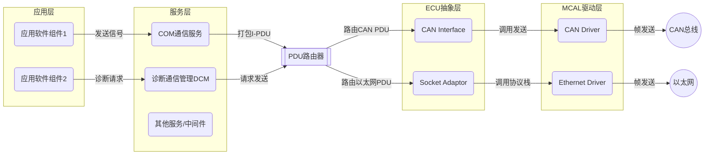
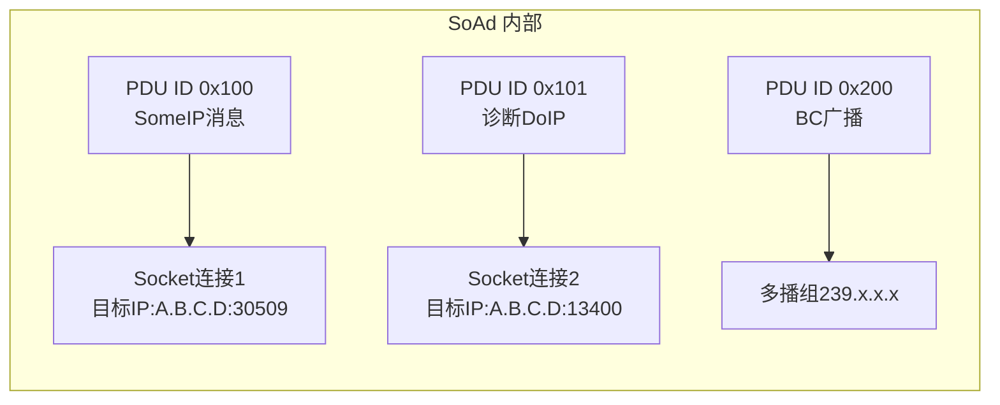
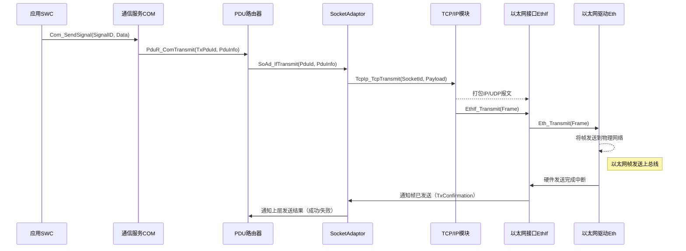
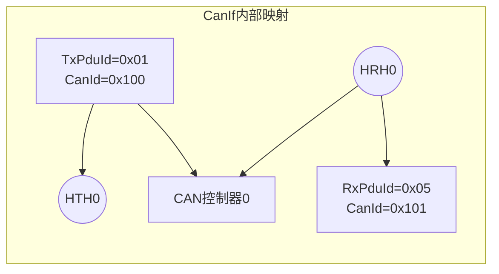
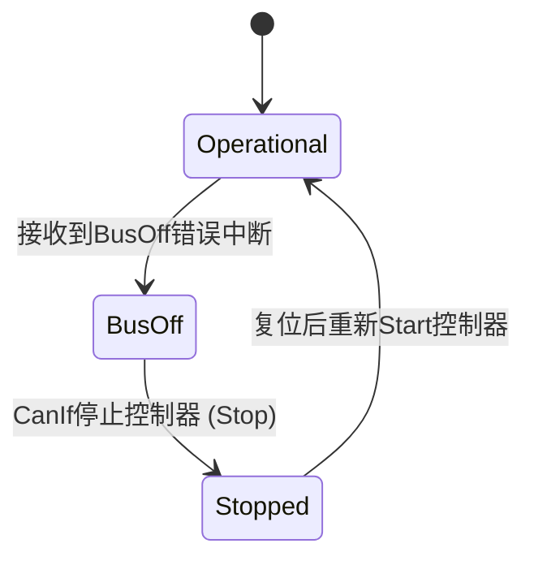
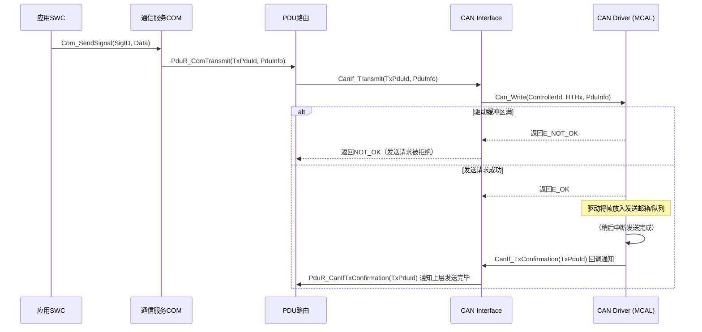
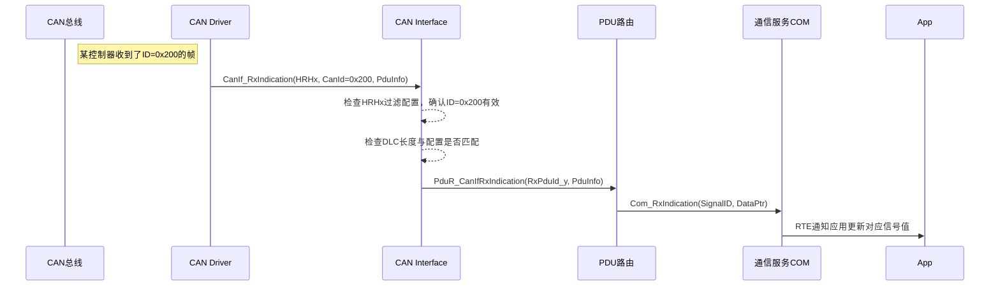
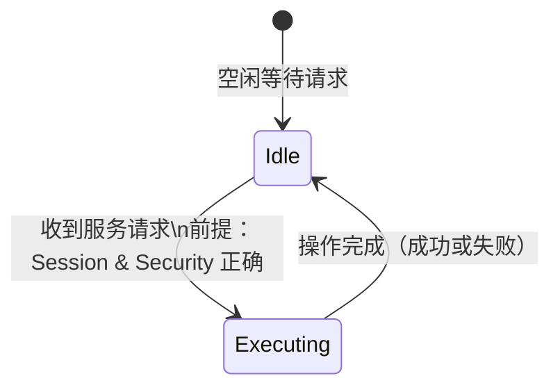
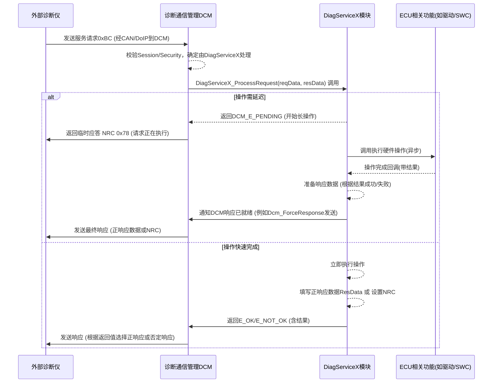

## 简介

嵌入式汽车软件正变得日益复杂，ECU（电子控制单元）内部通常集成了数十个软件模块，每个模块承担不同功能。对于嵌入式开发人员、架构设计人员以及功能安全和ASPICE实施人员来说，编写**模块架构设计文档**是确保软件质量和满足行业标准的关键一步。良好的模块设计文档有助于澄清模块的职责边界、接口、行为和资源需求，使团队在开发和集成过程中有据可循。此外，清晰完善的设计文档也是通过Automotive SPICE审核和功能安全评估的必要支撑。本指南将介绍如何撰写模块架构设计文档，涵盖通用ECU软件功能模块的架构说明、ASPICE SWE.2 软件架构设计要求，以及一个完整的模块设计文档模板。最后，我们将通过几个典型模块（如SoAd、CanIf和诊断服务模块）的示例章节点缀说明，以图表和代码片段演示如何运用文档模板撰写实际内容。

## ECU软件模块与架构设计概述

**什么是软件模块？** 在汽车ECU中，软件模块通常指具有特定职责的一组代码单元，可以是**基础软件（BSW）模块**（例如AUTOSAR通讯栈中的Com、PduR、CanIf等），**应用软件组件（SWC）**，或者**中间件/服务**（如诊断通信管理DCM、安全服务等）以及**功能插件**（附加的功能模块，如自定义诊断服务处理模块）。模块是软件架构的基本构件，每个模块封装特定功能并通过定义明确的接口与其他模块交互，实现**高内聚、低耦合**的设计。这种模块化设计有助于提高软件的可维护性和可复用性，同时在一定程度上隔离故障影响，实现功能安全要求。例如，在AUTOSAR分层架构中，应用层SWC经由RTE与服务层模块交互，服务层通过接口与ECU抽象层和MCAL驱动层通信，各模块各司其职，形成清晰的层次结构。

为帮助理解典型ECU软件的模块分层，下面给出一个AUTOSAR经典平台的通信相关模块架构示意图：



*上图：AUTOSAR ECU软件的层次结构示意。应用层SWC通过RTE与服务层通信服务（如COM）和诊断服务（DCM）交互；COM将应用信号打包成PDU经由PDU路由器（PduR）发送至总线接口层；例如发送到CAN总线的PDU由PduR路由至CAN Interface模块（CanIf），再经CAN驱动发送上总线；发送到以太网的PDU由PduR路由至Socket适配器模块（SoAd），SoAd通过TCP/IP协议栈和Ethernet驱动发送帧。各模块通过清晰接口衔接，形成分层架构。*

在架构设计阶段，应明确每个模块的角色和与其他模块的关系，以构建**架构视图**来展示系统如何工作。在复杂项目中，往往需要多个视角的架构图而不仅仅是静态的方框图。例如，可以包括**动态视图**（模块交互的时序图）、**特定功能视图**（针对某项功能的数据或控制流）、**状态转换图**（模块内部状态机）以及**接口依赖图**等。这些不同视图相辅相成，从不同角度描述模块架构，有助于全面理解系统行为并保证设计的一致性。

## ASPICE SWE.2 与模块架构设计

在汽车软件开发流程中，**Automotive SPICE (ASPICE)** 对软件架构设计提出了明确要求。SWE.2（Software Architectural Design）过程关注软件需求如何映射到软件架构要素，以及架构设计如何满足一系列质量准则。根据ASPICE v3.1的要求，软件架构设计应**识别软件要素并分配需求**，并包括以下内容：

- **架构分解**：完整定义软件架构设计，识别出组成软件的各个**软件要素**（模块/组件）。架构分解通常是分层次的，直到最低层级的要素（通常对应详细设计中的软件组件或代码单元）。
- **需求分配**：将**每条软件需求**分配到架构中的相应软件要素上。这建立了需求到模块的映射关系，确保每个需求都有实现责任模块。
- **接口定义**：为**每个软件要素定义其接口**。接口应描述模块对外提供和使用的服务，包括参数、数据类型和通信机制等。ASPICE强调接口文档需包含详细信息，例如**名称、类型、单位、精度、取值范围和默认值**等，否则集成测试时将难以验证接口是否正确。
- **动态行为**：描述软件要素之间的**时序关系和动态交互**。也就是说，要评估并记录模块在各种运行模式（如启动、关断、正常、标定、诊断等）下的行为，以及任务/进程间的通信、调度时序、中断处理等动态特性。通过时序图或流程图可以清晰呈现模块交互的先后顺序和并发关系。
- **资源消耗目标**：定义各软件要素的**资源使用预算或目标**。包括内存用量（ROM、RAM、NVM等）、CPU负载等关键资源的预估。这有助于在设计阶段评估性能是否满足要求，并为后续优化提供依据。
- **一致性和可追溯性**：确保软件需求与架构要素之间建立**双向可追溯**，并保持一致性。通过需求–架构映射，可以检查架构对需求的覆盖度、分析变更影响，并在评审时验证架构实现了需求意图。
- **架构沟通**：最终，软件架构设计需要与所有相关方评审确认并充分沟通。这意味着设计文档应清晰易读，便于利益相关者理解，并可用于指导后续详细设计和实现。

> **提示：** ASPICE对软件架构设计的评审通常关注架构是否遵循了一定的质量准则，如模块化、可维护性、可扩展性、可靠性和安全等。在设计模块划分时，需要考虑这些质量属性。例如，是否实现了关键功能的隔离（支持功能安全）、模块间耦合是否最小化以及接口定义是否清晰完整等。架构设计阶段也应对不同方案进行评估比较，根据既定标准选择最优方案并给出合理性说明。

简而言之，符合ASPICE SWE.2要求的架构设计文档应当详细展现**“软件需求 -> 架构模块 -> 接口/行为/资源”**的映射关系。这既是通过过程评估的要求，也是指导团队正确实现和集成各模块的基础。在实际项目中，软件架构文档往往包括多种视图和附加说明，如前文提到的动态视图、状态图以及接口详细描述等，以满足ASPICE对于“**适当视图**”的期望。接下来，我们将提供一个编写模块架构设计文档的通用模板，并详细解释各部分内容。

## 模块架构设计文档模板

一个完整的**模块架构设计文档**通常包含以下主要章节和要素。以下提供的模板既可用于撰写单个模块的设计说明书，也可扩展用于整体软件架构文档中针对各模块的分章节描述。在实际书写时，应根据具体模块的性质和项目需求进行裁剪和补充。

1. **模块概述（Module Overview）**：简要说明模块的背景和目标。概述模块需要实现的功能、设计动机，以及模块在系统中的位置和作用。例如，可包含模块的设计初衷、满足的主要需求或用例，以及与其他模块的关系概览。

2. **模块职责边界（Responsibilities & Scope）**：详细描述模块的职责范围以及边界限制。明确模块**应该做什么**以及**不应该做什么**，防止职责重叠或遗漏。可以从功能角度列出模块需要完成的任务，以及留给其他模块处理的事项。此部分也可包含模块的输入输出描述——模块接收哪些输入、产生哪些输出，以及这些输入/输出从何而来/发送到何处。

3. **接口定义（Interface Definition）**：列出模块对外提供的接口和所依赖的外部接口。对于每一个接口，提供详细的说明，包括：
   - 接口名称、类型（API调用、数据结构、消息、信号等）。
   - 参数或数据的含义、单位、取值范围、精度和默认值等。
   - 接口的方向（提供者或使用者）以及访问频率或时序要求（例如周期调用还是事件触发）。
   - 错误返回值或异常情况说明（如果适用）。
   
   可以使用表格来组织接口信息。例如，一个函数调用接口的描述表格，列出函数原型、功能描述、参数列表和返回值意义等。对于通信接口，可能需要说明消息ID或PDU ID、数据长度和信号映射等配置。**详细的接口描述**对于集成测试和模块互联至关重要。确保这一部分足够详细，使他人在无需查阅源码的情况下就能理解如何正确使用该模块接口。

4. **内部结构设计（Internal Structure）**（可选）：如果模块内部包含子模块、层次结构或复杂算法，可以在此描述模块的内部架构。例如，列出模块内部的主要组件、数据结构或类图。在AUTOSAR经典平台中，大多数基础软件模块已经是较小粒度，无须再细分子组件；但在自研功能模块或复杂应用SWC中，可能需要细化内部结构。可使用UML类图或组件图表示模块内部组成部分及其关系。

5. **状态机和模式（State Machine/Modes）**：描述模块的内部状态机（如果存在）或模块在不同运行模式下的行为差异。包括可能的状态列表、状态转移条件以及各状态下模块的行为。在功能复杂或具备内部状态管理的模块中，提供状态图可以极大帮助理解模块行为。例如，诊断服务模块可能具有“默认会话”、“扩展会话”、“编程会话”等状态；再如通信驱动模块可能有“未初始化”、“正常运行”、“错误故障”状态等。使用Mermaid的状态图语法或伪码描述状态转移逻辑，能够清晰呈现模块响应事件的方式。

6. **时序流程（Timing Sequence）**：以时序图或流程图的形式描述模块在关键场景下的动态交互过程。这部分聚焦于模块与其他模块/系统元素之间的交互顺序和时间关系。比如：
   - **初始化流程**：模块启动时执行的初始化步骤，初始化顺序以及与其他模块的依赖关系（谁先初始化，配置数据何时加载等）。
   - **典型使用场景**：例如通信模块发送/接收数据的完整调用链，或者诊断模块处理一次诊断请求的全过程等。
   - **定时要求**：若模块有周期性行为（如周期任务、超时监控），解释其时间参数（周期，超时时间）和时序要求。
   
   这部分通常以时序图（sequence diagram）形式呈现，将涉及的实体（本模块、自身子模块、其他模块、外设、任务等）作为生命线，画出消息/函数调用随时间推进的流程。时序图能够帮助读者直观理解模块交互。例如，下文SoAd模块的示例将给出报文发送的时序流程图。对于复杂流程，也可以拆分多个子场景分别绘制。

7. **资源预算（Resource Budget）**：列出模块对系统资源的占用和预算考量。包括：
   - **内存**：ROM/Flash代码空间、RAM数据空间的预估大小。如果模块允许配置，说明不同配置情形下内存占用的变化（如缓存大小、对象数量）。
   - **持久存储**：如果模块使用EEPROM/NVM等非易失存储，列出所需容量以及读写频率，对寿命的影响等。
   - **CPU负荷**：模块运行对CPU时间的占用。可通过WCET（Worst-Case Execution Time，最长执行时间）或周期负载来描述。如果模块在中断上下文执行，也需要注明中断处理耗时。
   - **其他硬件资源**：如DMA通道占用、定时器/定时中断使用情况、通讯总线带宽占用等。
   
   资源预算部分有助于在架构层面验证性能是否达标。例如，是否在有限的CPU和内存条件下模块都能按时完成任务。这些目标在ASPICE中属于动态行为和资源目标的一部分。通常在设计文档中给出估算值，并在实现后通过测量加以验证。

8. **配置项（Configuration Items）**：说明模块有哪些可配置参数及其意义，包括编译时配置和运行时配置。对于AUTOSAR BSW模块，这部分通常对应ARXML配置项；对于自研模块，也可能通过宏定义、配置结构或配置文件实现。内容包括：
   - 配置参数名称、取值范围、默认值，以及对模块行为的影响。
   - 各配置项之间的关联和约束（例如必须成组配置的参数或互斥的配置选项）。
   - 配置工具或文件说明：如果模块支持通过特定工具（如Vector Davinci、EB Tresos）生成配置代码，说明对应的配置节名称；如果使用手工配置文件，提供文件格式说明或示例。
   
   还可以包含一段**配置示例**代码或ARXML片段来演示配置方式。例如，SoAd模块的配置包含Socket连接和路由组，可用简短的ARXML例子展示如何定义一个Socket连接。

9. **异常和错误处理（Error Handling）**：描述模块针对异常情形的处理策略。包括：
   - 模块如何检测错误（依赖监控机制、返回码检查等）。
   - 错误发生后的行为（例如重试、上报、进入安全状态等）。
   - 提供给上层或其他模块的错误指示接口（如错误码、回调通知）。
   - 与系统整体的故障管理机制的交互（例如若集成了DEM - 诊断事件管理，模块如何报告DTC）。
   
   错误处理部分可以列举主要的错误场景及对应处理策略表格。例如通信超时、数据校验失败、硬件驱动调用失败等情况。在功能安全相关模块中，还应说明如何满足安全要求，比如检测失败后进入哪个安全状态。清晰的错误处理设计有助于提高系统鲁棒性，避免出现未定义行为。

10. **运行环境与限制（Context and Constraints）**：指出模块使用和集成时的前提条件、假设和限制条件，包括：
    - **运行环境**：模块所需的操作系统环境（如任务优先级、栈大小要求、中断上下文可否调用等）。如果模块需要在特定任务或调度策略下运行，应予以声明。
    - **并发与同步**：模块是否是**可重入**的，是否需要外部同步（如锁/禁用中断）才能保证线程安全。在多核环境下，模块是否被限定在某个核执行。
    - **依赖条件**：模块对硬件或其他软件服务的依赖假设。例如，存储模块假设底层NVM驱动已初始化，网络模块假设通讯总线已上电等。
    - **适用范围**：模块设计适用于哪些环境或配置范围，是否有不支持的用例。例如某模块可能仅支持单通道CAN、不支持多实例。
    - **性能及负载假设**：对实时性有要求的模块，可声明其假设的任务周期或执行时限，以便验证在假设范围内系统能够满足要求。
    
    这一部分将模块的使用**前提**讲清楚，能避免集成时的误用。例如，“本模块的某API不得在中断级别调用”或“模块需在操作系统任务环境中运行”都是需要强调的重要限制。

11. **模块之间的依赖与集成说明（Dependencies & Integration）**：综合说明模块与其他模块或系统组件的接口关系和集成方式。包括：
    - 列出模块直接依赖的其他模块/服务，以及模块被哪些上层所依赖。这通常可以配合一张模块上下文图或依赖图来表示模块周边关系。
    - **初始化和关闭顺序**：说明模块的初始化步骤和所需顺序（例如必须在某模块初始化之后才能初始化），以及系统关闭时的反向关闭顺序。如AUTOSAR系统中各BSW模块都有严格初始化次序，这需要在设计时明确。
    - **集成步骤**：对于将模块集成到ECU的软件中的指导。例如需要在调度表中添加模块的周期任务调用，链接某配置文件，在编译时启用某宏开关等。
    - **版本兼容性**：如果模块有特定的版本要求（例如依赖某标准版本的接口），注明兼容性考虑，以免与其他版本模块集成出现问题。
    - **示例代码**：必要时提供一些集成示例代码片段来演示。例如在主函数中如何调用模块初始化，在任务中如何定期调用其MainFunction等。这能帮助读者快速上手实际集成工作。
    
    通过这一章节，读者应能了解如何**将模块正确地嵌入**整个系统。例如某通讯模块需要和通信管理模块（ComM）配合，或者诊断模块需要和故障管理模块（DEM）链接，这些都应在依赖与集成中加以说明。

12. **附录或其他**：根据具体需要，模块文档最后可附加一些内容，例如：
    - **需求跟踪矩阵**：列出本模块覆盖的软件需求ID列表，实现了哪些需求。这支持ASPICE的可追溯性要求，但有时放在项目的追溯矩阵文档中，此处可选。
    - **术语表**：列出文档中涉及的缩略语（如DCM、DID、PDU等）的全称和含义，便于读者查阅。
    - **参考资料**：如果模块设计引用了特定标准或协议（如ISO 14229诊断协议），可在此列出参考文献或标准章节。
    - **变更记录**：在维护阶段跟踪文档的修改历史和版本。

以上模板涵盖了模块架构设计文档的主要部分。在实际撰写时，可根据模块特性进行增减。例如，如果模块没有内部状态机，则可省略状态机章节；如果模块不涉及复杂动态行为，时序流程图也可简单带过。但总体而言，**接口、职责、动态行为、资源和依赖**等核心内容应当完整呈现。以下，我们将针对几个具体的模块，演示如何套用上述模板撰写设计文档片段，并附加关键的图表和代码示例。

## 示例模块1：SoAd – Socket Adaptor模块架构设计

**模块概述：** Socket Adaptor（简称**SoAd**）模块是AUTOSAR经典平台以太网通信栈中的基础软件模块，主要作用是在AUTOSAR PDU（Protocol Data Unit）与底层**Socket接口**之间提供适配。简单来说，SoAd桥接了AUTOSAR通信服务和标准IP协议栈的socket机制：上层模块（如PduR或某些服务）将网络报文发送给SoAd，SoAd根据配置将其映射到相应的Socket连接，调用TCP/IP模块发送数据；接收时，SoAd从TCP/IP模块获得socket数据后，还原为PDU并上报给上层（COM或SomeIP等）。SoAd模块的目标是屏蔽应用和服务层对底层TCP/IP套接字细节的关注，提供统一的PDU发送/接收服务，并实现对多种传输层协议（TCP/UDP）的支持和管理。

**职责边界：** SoAd的职责包括： 
- **建立和管理Socket连接**：根据配置初始化所需的TCP/UDP Socket，设置本地IP地址和端口，侦听来自对端的连接请求（对于TCP Server）或准备向特定IP发送数据（UDP/TCP Client）。
- **PDU路由**：接收上层（通常是PDU路由器PduR或SOME/IP协议层）传来的I-PDU，并依据配置将不同的PDU路由到对应的Socket连接上发送。每个PDU通常通过配置关联到SoAd的一个Socket或路由组。
- **收发数据**：调用TcpIp模块提供的接口发送和接收数据。发送时封装上层PDU为TCP/UDP数据包，通过以太网接口发送出去；接收时从TCP/IP层获取数据，识别属于哪个PDU并通知上层。
- **多播/单播支持**：管理多播组加入/离开，以及区分单播和多播通信，对数据做相应处理（例如只将多播数据路由给订阅了该组的上层）。
- **错误处理**：监控Socket通信错误，如连接中断、发送失败等，并进行重试或状态通知。对于关键错误，可上报给通信状态管理（EthSM）或诊断模块。
- **性能管理**：管理发送缓冲和队列，避免单一socket数据过载影响系统。可能实现基础的流量控制（例如当下层缓冲满时拒绝新数据以避免阻塞）。

SoAd**不负责**具体TCP/IP协议的实现（由独立的TcpIp模块承担），也不直接处理更高层协议的内容（如SomeIP或DoIP数据的具体解析，这些由各自模块处理）。它的边界是：**向上**提供PDU级别的发送接收接口，**向下**调用标准IP层接口，确保数据正确地进出以太网驱动。

**接口定义：** SoAd对上层和下层均提供接口。主要接口包括：
- **上层接口**：提供给PduR或其它通信服务模块用于发送PDU的函数，例如`SoAd_IfTransmit(PduId, *PduInfo)`。当上层有一帧要通过以太网发送时，调用此接口。参数包括PDU的标识和数据指针。SoAd根据PduId查找对应的Socket连接，将数据发送出去。如果发送请求成功，SoAd会调用上层的确认接口（如`PduR_SoAdTxConfirmation`）通知发送完成；若发送失败或排队，可能返回错误码（如`E_NOT_OK`）。
- **下层接口（回调）**：TcpIp模块向SoAd通知数据到达的接口，例如`SoAd_RxIndication(SocketId, *SocketData)`。当某Socket收到新数据时，TcpIp解析IP/UDP头后调用此接口，SoAd据此将数据与配置的PDU对应并上报给上层（例如调用`PduR_SoAdRxIndication(PduId, *PduInfo)`）。
- **配置接口**：在初始化时，SoAd会调用TcpIp的配置API创建所需的Socket，例如`TcpIp_Open()`绑定IP地址和端口。SoAd本身可能提供配置数据（由生成的SoAd_Cfg.c）给TcpIp。
- **错误通知接口**：SoAd可能实现一些调试或诊断接口，比如当通信中断时调用某上层错误通知函数。AUTOSAR标准中未定义专门的SoAd错误回调，但项目可扩展，例如通过Det报告开发错误或DEM报告通信故障码。

接口详细描述示例：

| 接口名称                | 接口类型   | 描述                           | 参数/返回                              |
|-------------------------|------------|--------------------------------|----------------------------------------|
| `SoAd_IfTransmit`       | 函数API    | 发送PDU数据至指定Socket连接。   | 输入：PduId，PduInfo指针；返回：Std_ReturnType（OK或NOT_OK） |
| `SoAd_RxIndication`     | 回调函数   | 通知上层收到以太网PDU。         | 输入：对应PduId，PduInfo指针（含数据缓冲及长度） |
| `SoAd_Init`             | 函数API    | 模块初始化函数，打开所有配置的Socket。 | 输入：配置结构指针；返回：无 |
| `SoAd_MainFunction`     | 周期函数   | 模块主循环，可选，用于超时管理等。 | 无参数，每周期调用                     |

*说明：* **Name**列给出了接口名称，**类型**包括是否为API或回调，**描述**简述接口功能，**参数/返回**列出关键参数及返回值含义。对于具体参数（例如PduInfo内的数据长度、缓冲指针），在正式文档中应进一步给出单位、范围等信息。SoAd的大多数接口遵循AUTOSAR接口规范，其详细语义可参考AUTOSAR Rte和Com模块对接口的要求。

**内部结构设计：** SoAd内部可以视为包含以下逻辑子模块：
- **Socket连接表**：根据配置初始化的Socket集合，包括每个Socket的本地/远端IP和端口、协议类型（TCP/UDP）、当前连接状态等。
- **路由规则**：一套路由配置，将**Pdu ID**映射到特定的Socket或Socket组以及传输模式（例如广播、多播的处理）。SoAd根据此规则执行`IfTransmit`时的路由选择。
- **发送缓冲**：SoAd可能包含发送缓冲区或队列，用于缓存待发送的PDU数据（尤其在TCP连接尚未建立或链路繁忙时）。也可能直接利用TcpIp提供的缓冲机制。
- **接收重组**：对于UDP，无需重组，因为报文天然不分片；对于TCP，TcpIp模块已经保证数据流按顺序提供，但应用上可能需要根据协议判断消息边界。SoAd需要缓存并检测消息完整性（比如SomeIP消息长度）。
- **管理定时器**：SoAd会跟踪一些定时事件，例如TCP重连超时、发送重试计时等。通常通过一个MainFunction周期性检查超时并处理。
- **错误日志**：内部维护错误状态，如某Socket连接断开则记录标志，供上层查询或重新连接。

这些逻辑通常由SoAd模块的实现维护，但在设计文档中可用文字或示意图描述其关系。例如下图显示SoAd内部如何将PDU路由到不同的Socket连接：



*上图：SoAd模块根据配置将不同PDU路由到不同的Socket连接或多播组。例如ID为0x100的PDU映射到Socket1（假设为某服务的SOME/IP通信，目的端口30509），ID 0x101的PDU映射到Socket2（诊断overIP，目的端口13400），ID 0x200的PDU被映射到一个多播地址。*

**状态机和模式：** SoAd自身状态相对简单，主要有“未初始化”和“工作中”两种状态。模块上电后调用`SoAd_Init`进入工作状态。在工作状态下，SoAd的每个Socket连接可能各自具有状态：
- **TCP Socket状态**：对于TCP类型的连接，可能有Closed、Listening、Established等状态，由TcpIp模块管理。SoAd可以通过TcpIp的事件回调获知状态变化。如一个TCP服务器Socket，当有远端连接建立时进入Established，当连接断开回到Closed。SoAd应在设计中考虑这些状态转变对发送/接收的影响：未建立连接时缓存数据或拒绝发送，连接断开时通知上层等。
- **错误状态**：SoAd或其下层出现故障（例如连续发送失败），SoAd可能进入一个错误状态（如“通信故障”）并上报错误。在这种状态下，SoAd可以尝试重置socket或等待外部恢复。

由于SoAd大部分功能依赖TcpIp状态机，这里不再绘制详细状态图。简单而言，SoAd初始化后，各Socket根据配置（TCP服务器则进入侦听状态，TCP客户端尝试连接或等待触发连接，UDP无需状态保持）。可将Socket状态信息记录在模块内部，当状态变化或错误发生时驱动相应处理。

**时序流程：** 下面以**发送数据**为例，描述SoAd模块的时序流程。当应用通过通信服务发送一个信号，最终经由SoAd发送以太网帧时，各模块调用顺序如下：



*图：SoAd发送数据的时序图。从应用SWC调用COM发送信号开始，经由PduR路由到SoAd。SoAd查找PDU对应的Socket并通过TcpIp发送，TcpIp模块封装TCP/UDP/IP报文后交由EthIf发送帧，最终Eth驱动完成发送。发送完成后，各层逐级回调确认。* 

在**接收数据**场景中，顺序相反：以太网驱动收到帧后通知EthIf，EthIf调用TcpIp解析出IP层数据，TcpIp将有效载荷交给SoAd，SoAd识别PDU并通过PduR上报给COM模块，COM再将信号提供给应用。这确保了SoAd上下行数据路径的闭环。在实际文档中，可类似绘制一个接收时序图以完整描述。

**资源预算：** SoAd作为通信中间层，其资源占用取决于配置的Socket数量和数据量：
- **内存**：SoAd代码规模适中（几KB级别ROM），RAM主要用于Socket配置和状态管理结构体，每个Socket连接对应一套结构信息。举例来说，配置10个Socket连接可能占用约几百字节RAM。额外的发送/接收缓冲若由SoAd分配，则按最大PDU大小和队列深度预留。例如每个Socket有2个报文缓冲，每个缓冲1500字节，则10个socket约需30KB RAM。通常，实际数据缓冲在TcpIp模块或EthIf中维护，SoAd只保存指针和元数据。
- **CPU**：SoAd自身处理逻辑较简单，主要开销在于系统调用下层接口和简单的数据拷贝/封装。假设每帧报文处理耗时几十微秒量级。在满负载（例如每秒上千帧）情况下，SoAdCPU占用可能在几个百分点范围。由于SoAd部分调用发生在中断或底层线程环境中，需要考虑不应进行耗时操作。应确保SoAd运行时遵循实时性要求，如不会关闭中断过长时间，不进行阻塞等待等。
- **其他**：SoAd模块不直接使用特殊外设资源。需要注意的是，SoAd发出的网络流量终究受限于硬件以太网带宽（例如100Mbps），设计时应预算峰值帧率并与带宽核对，避免配置过多高速通信导致总线拥塞。
- **NVM**：SoAd通常不使用非易失存储。但如果支持**Socket连接动态配置**（例如IP地址可配置存储），可能会占用几个字节的NVM存储IP地址等参数。

*资源评估示例：* 假定SoAd配置8个TCP Socket和2个UDP Socket，每帧最大1500字节，无额外缓冲，则SoAd静态RAM约=10*(每Socket结构约40字节)=400字节；若每Socket2个缓冲，每缓冲1500字节，则动态缓冲共=10*2*1500=30KB（可能属于TcpIp模块管理）。CPU方面，测算SoAd在1000帧/秒流量下占用CPU<5%。这些数据应根据具体实现测量或来自供应商参考手册，此处仅作示例说明。

**配置项：** SoAd的配置主要在AUTOSAR ECU配置描述文件（*.arxml）中完成，工具会生成SoAd_Cfg.c/h等文件。关键配置项包括：
- **SoAdSocketConnection**：Socket连接配置容器，定义每个Socket的参数。如本地IP地址、端口、协议类型（TCP或UDP）、是否服务器模式、连接远端IP及端口（如果是客户端或预定义的通信对手）等。
- **SoAdSocketConnectionGroup**：Socket连接组，用于将多个Socket归类（例如某些多播/广播组，或者服务Discovery需要特殊组管理）。配置项包括组ID、包含的Socket列表、是否启用PDU头管理等。
- **Routing Table (SoAdRoutingGroup)**：定义PDU ID到Socket的映射关系。每条路由包含：PduR上层模块标识（比如来自PduR的标记）、PDU编号、映射到的Socket Connection或ConnectionGroup，以及传输模式（例如是否使用TCP握手，是否启用特定消息过滤）。
- **缓冲与队列**：可配置发送队列长度、接收缓冲大小等（AUTOSAR标准SoAd配置项中可能没有独立配置缓冲，因为TcpIp有缓冲，但有的实现会在SoAd配置特定参数如总缓冲大小等）。
- **Development Error Detection (DET)**：布尔配置，决定是否启用开发错误检测（宏`SOAD_DEV_ERROR_DETECT`），用于在参数错误时上报Det。这个在配置中通常作为General开关。

一个SoAd配置的简要ARXML片段示例如下，展示如何配置两个Socket连接和一条路由：

```xml
<SoAd>
    <!-- Socket Connection 1: TCP Server on port 30490 -->
    <SoAdSocketConnection name="SoAdSocket_Server1">
        <SoAdSocketProtocol>TCP</SoAdSocketProtocol>
        <SoAdSocketLocalIpAddress>192.168.0.10</SoAdSocketLocalIpAddress>
        <SoAdSocketLocalPort>30490</SoAdSocketLocalPort>
        <SoAdSocketTcpServer>true</SoAdSocketTcpServer>
        <SoAdSocketNoDelay>true</SoAdSocketNoDelay> <!-- Nagle算法关闭以降低延迟 -->
    </SoAdSocketConnection>
    <!-- Socket Connection 2: UDP socket to remote 192.168.0.20:5000 -->
    <SoAdSocketConnection name="SoAdSocket_Client1">
        <SoAdSocketProtocol>UDP</SoAdSocketProtocol>
        <SoAdSocketLocalPort>5000</SoAdSocketLocalPort>
        <SoAdSocketRemoteIpAddress>192.168.0.20</SoAdSocketRemoteIpAddress>
        <SoAdSocketRemotePort>5000</SoAdSocketRemotePort>
    </SoAdSocketConnection>
    <!-- PDU Routing: PduR上下来的PDU ID 0x100通过Socket_Server1发送 -->
    <SoAdRoutingGroup name="Route1">
        <SoAdRoutingGroupSocketConnectionRef dest="SoAdSocketConnection">SoAdSocket_Server1</SoAdRoutingGroupSocketConnectionRef>
        <SoAdRoutingGroupPduRef dest="Pdu">ComPdu_0x100</SoAdRoutingGroupPduRef>
    </SoAdRoutingGroup>
</SoAd>
```

*上述配置片段：* 定义了一个TCP服务器Socket在本地30490端口（典型某SomeIP服务端口），以及一个UDP通信的Socket。其中Route1将一个上层PDU（ID 0x100）映射到第一个Socket发送。真实项目中，ARXML还包括更多参数和容器，这里仅作说明。

**异常和错误处理：** SoAd异常情况主要来自通信失败：
- **发送失败**：`SoAd_IfTransmit`可能因为Socket尚未建立、缓冲满等原因返回失败。处理：SoAd可以立即返回NOT_OK，上层PduR收到后会采取相应措施（比如丢弃或重试）。如果配置了错误侦测，SoAd可以通过Det报告错误码（例如参数无效、状态不对）。
- **Socket错误**：包括TCP连接断开、网络错误等。处理：SoAd通常通过TcpIp的回调得知，如TcpIp可能提供`TcpIp_TcpEstablished`和`TcpIp_TcpClosed`之类的指示。SoAd接到连接断开指示时，会将该Socket标记为失效，并可以选择重启侦听（对于服务器）或尝试重连（对于客户端）。同时，可通知上层某些通信不可用。对于重要的Socket断线，可通知通信管理（EthSM）或DEM记录诊断错误（如果需要记录DTC）。
- **接收缓冲溢出**：如果上层处理不及时，数据连续到来可能造成缓冲溢出。SoAd设计应考虑这种情况，例如维护一个Rx缓冲队列达到上限时丢弃后续数据并计数。可以通过统计丢包事件来提醒上层调整处理节奏或增加缓冲。
- **配置错误**：初始化阶段若发现配置矛盾（例如同一端口被配置了两个Socket），SoAd可在Det中报ERROR，停止初始化并返回错误状态，不进入正常运行。
- **资源紧张**：当CPU或内存不足导致SoAd无法及时处理数据时，可能触发看门狗或性能监控。SoAd本身无法解决，但文档中应注明在资源紧张时可能的降级行为，如抛弃部分低优先级报文等（如果有实现）。

SoAd作为传输中间件，通常不直接产生可恢复的严重故障，一旦发生致命错误（如内存申请失败），一般由系统层面处理（比如安全监控复位ECU）。文档需强调的是SoAd如何**检测**这些异常（通过返回码、回调等）以及**响应策略**，确保错误不会悄无声息地导致系统状态未知。

**运行环境与限制：** 
- **任务环境**：SoAd的API如`SoAd_IfTransmit`通常在上层任务环境调用（比如应用或通讯任务）。SoAd的回调如`SoAd_RxIndication`在TcpIp触发下调用，可能发生在协议栈的任务上下文或中断上下文（依实现而定）。设计上假定SoAd所有接口都是**线程安全**的，但事实上一些实现可能要求调用者在特定上下文调用（AUTOSAR并未强制要求SoAd是可重入的）。因此在并发环境中，使用SoAd时应注意不要在不同任务并发调用同一个SoAd实例的接口。如果需要并发发送多个PDU，应由上层做好互斥保护或者采用不同Socket进行并行通信。
- **中断上下文**：一般不建议直接从中断服务例程调用SoAd接口，因为其内部可能调用TcpIp等较复杂函数，且可能引起任务切换或等待。不过SoAd内部会有中断禁用临界段以保护关键数据结构（如路由表）。文档中应注明“**不得在ISR上下文调用SoAd_IfTransmit**”等限制。
- **定时要求**：SoAd依赖定期调用`SoAd_MainFunction`（如果实现了，用于检查超时）。如果应用不调用这个周期函数，TCP连接可能无法超时检测等。假设SoAd_MainFunction需要10ms调用一次，则在OSEK调度中确保有此任务。这个要求必须在集成部分强调。
- **内存对齐**：网络报文常需要4字节对齐缓冲，SoAd提供给TcpIp的数据缓冲需要满足对齐要求。一般AUTOSAR生成的缓冲已对齐，但在自定义修改时需注意。
- **多核**：经典AUTOSAR BSW通常运行在单一核。如果项目多核，SoAd应限制在其配置的通信核上运行，并确保与TcpIp、EthIf在同一核（以免频繁跨核通讯）。多核环境下，SoAd可能需要使用Spinlock保护全局资源。
- **协议限制**：SoAd支持UDP和TCP，但不支持更高层协议的具体逻辑，比如不解析HTTP/SomeIP内容，只负责传输。用户不应期望SoAd直接提供服务发现、自动重连等高层功能——这些需要结合上层协议或ComM等模块实现。

**依赖与集成说明：** 
- **依赖的模块**：SoAd高度依赖AUTOSAR的**TcpIp模块**（实现IP堆栈）和**EthIf模块**（以太网接口）。没有这两个模块，SoAd无法运作。因此在集成时需确保先初始化EthIf和TcpIp，然后再初始化SoAd。同时，SoAd与上层**PduR**模块相互配合使用：PduR配置中应含有将某些PDU路由到SoAd。如果项目使用SOME/IP，则SoAd与SOME/IP模块也有紧密协作关系——实际上接收路径SoAd会把数据交给SomeIP模块来处理服务发现和序列化。
- **初始化顺序**：根据AUTOSAR典型流程，初始化顺序如下：EthDrv（底层驱动） -> EthIf -> TcpIp -> SoAd -> 最后上层通信服务（如SOME/IP）。SoAd初始化时，会调用TcpIp创建Socket。如果TcpIp未初始化，会导致调用失败。因此务必遵守此顺序。关机时序相反：应先停止上层通信，再关闭SoAd，再依次关闭TcpIp、EthIf等。
- **配置一致性**：集成人员需保证SoAd的ARXML配置与TcpIp配置一致。例如，TcpIp里面定义了一个名为“TcpIpSocketFirewall”的开关，如果开启必须在SoAd相应socket配置上反映；又如SoAd引用的本地IP地址，必须在TcpIp的IP配置表中存在。配置工具一般会检查这些一致性，但手工配置需特别留意。
- **周期任务集成**：若SoAd实现了MainFunction，需要在OS配置中为SoAd安排一个周期任务。通常此任务可与TcpIp共用（一些实现里SoAd MainFunction只是做TcpIp MainFunction的alias），确定周期（典型10ms）。文档应指导工程师在OSEK调度表中加入诸如`SoAd_MainFunction()`的周期调度。
- **示例代码**：以下给出一个集成SoAd初始化和发送的简短示例代码段：

```c
// 系统初始化阶段
EthIf_Init(&EthIf_Config);    // 初始化以太网接口
TcpIp_Init(&TcpIp_Config);    // 初始化TCP/IP栈
SoAd_Init(&SoAd_Config);      // 初始化SoAd模块

// ... 其他模块初始化

// 周期任务，在OS中每10ms调度
TASK(SoAd_MainTask)
{
    SoAd_MainFunction(); // 处理超时和重连等
    TerminateTask();
}

// 发送示例：上层准备发送诊断数据
PduInfoType diagPdu;
diagPdu.SduLength = len;
diagPdu.SduDataPtr = diagDataPtr;
PduR_ComTransmit(DIAG_TX_PDU_ID, &diagPdu); // PduR会内部调用SoAd_IfTransmit
```

以上代码展示了初始化顺序和周期任务配置的用法。在实际项目中，这些通常由配置生成，不需要手写。但设计文档中通过此类示例，可以检验对模块集成的理解是否正确。

- **与功能安全/S安全**：如果项目涉及ISO 26262功能安全或ISO 21434网络安全，SoAd模块本身属于通信基础模块，需要在安全概念中考虑。例如在安全分析中，SoAd被认为无特定安全机制，但如果需要防止网络攻击，也许会在上层SOME/IP或防火墙中处理。SoAd文档可简单列出：其不直接实现安全功能，如需确保传输安全需要额外的安全IP层（TLS等）或防火墙模块配合（这也解释了SoAd为何尽量简单）。

综上，SoAd模块的架构设计文档完整地描述了其目标、接口和行为。通过前述的模板和示例图表，我们能够看出SoAd如何**作为AUTOSAR以太网栈中的关键模块**发挥作用：向上屏蔽Socket通信细节，向下管理socket并利用TCP/IP协议发送接收数据。设计文档中给出的接口清单和时序图，可以帮助开发人员和架构师在实现和调试SoAd时有据可依，同时也为ASPICE架构设计过程的评审提供了充分的证据。

## 示例模块2：CanIf – CAN Interface模块架构设计

**模块概述：** **CAN Interface（CanIf）**模块是AUTOSAR经典平台中CAN通信栈的一部分，位于上层PDU路由和下层CAN驱动之间。CanIf的主要功能是向上屏蔽CAN硬件细节，提供统一的接口来管理不同CAN控制器和通道；向下则调用CAN驱动发送/接收帧，从而实现应用层信号到CAN总线帧的映射。简而言之，CanIf负责将**上层的PDU**映射到具体的**CAN硬件发送对象**（Hardware Object Handle, HOH），并在接收到CAN硬件帧时识别其属主PDU并通知上层。通过CanIf，上层模块（如PduR、CAN通信服务COM或诊断DCM）可以不关心有多少CAN控制器、每个控制器的硬件配置如何，就能统一地发送和接收CAN消息。

**职责边界：** CanIf的核心职责包括：
- **硬件抽象**：管理ECU上一个或多个CAN控制器，向上层提供抽象的“CAN通道”概念。上层通过逻辑通道号或PDU ID发送消息，CanIf负责选定对应的实际CAN控制器和硬件发送通道（MailBox）。这样，如果ECU有2个CAN控制器，上层无须针对不同控制器写不同代码，只需给CanIf传相应的PDU，CanIf就能发送到正确的总线。
- **HOH映射**：维护**硬件对象句柄（HOH）**与PDU的映射关系。HOH包括发送硬件句柄HTH和接收硬件句柄HRH。每个发送PDU分配一个HTH，CanIf通过HTH知道消息该由哪个控制器的哪个发送Mailbox发出；每个接收ID对应一个HRH，表示来自哪个控制器的哪个硬件过滤配置。CanIf根据配置在初始化时设置硬件过滤，并在接收时使用HRH快速找到该帧对应的上层PDU。
- **发送流程**：处理上层请求发送的数据包。当PduR调用`CanIf_Transmit(TxPduId, PduInfo)`时，CanIf首先确认该PDU有效且可发送，然后查找其对应的HTH和CAN控制器。接着调用底层`Can_Write(CanControllerId, HTH, PduInfo)`驱动接口请求发送。如果驱动返回成功，CanIf等待驱动通过回调（CanIf_TxConfirmation）通知实际发送完毕，再通知上层PduR完成。
- **接收过滤**：设置CAN硬件的报文过滤机制，实现**FullCAN**（硬件过滤）或**BasicCAN**（软件过滤）模式。当CAN驱动ISR收到新帧后调用`CanIf_RxIndication(CanControllerId, HRH, PduInfo)`，CanIf根据HRH确定该帧对应的接收PDU并执行数据长度校验，然后调用`PduR_CanIfRxIndication(RxPduId, PduInfo)`将数据递交上层。未通过过滤或长度检查的帧将被丢弃或报告错误。
- **状态通知**：CanIf负责将底层驱动的状态变化通知上层。例如驱动报告总线off、错误警告状态，CanIf会调用上层（如CanSM或DCM）的相应接口通知网络状态变化。反之，上层也可通过CanIf请求改变控制器模式（如启动、停止），CanIf调用驱动实现并跟踪模式状态。
- **多控制器管理**：对于有多个CAN控制器的ECU，CanIf统一管理控制器模式切换（Sleep/Wakeup），以及多通道的并发发送。上层通过逻辑通道控制多个物理控制器，CanIf内部执行逐个控制器的操作并汇总结果。

CanIf**不包含**：CAN协议链路层（如CAN等消息分段重组逻辑，由上层CanTp处理）以及诊断/网络管理策略（由DCM、CanNM等处理）。它也不直接存储或排队大量消息（通常只有很小的内部缓冲，CAN驱动一般采用发送邮箱机制）。其边界是：**向上**提供帧传输服务，**向下**依赖CAN Driver执行硬件收发。

**接口定义：** CanIf对上层主要提供发送和状态查询接口，对下层（CAN Driver）则实现回调接口：
- **发送接口**：`CanIf_Transmit(TxPduId, *PduInfo)`是CanIf最主要的API，上层通过它发送一个已配置的发送PDU。TxPduId在配置中绑定到一个具体CAN ID和硬件资源。该接口返回`E_OK`或`E_NOT_OK`表示请求是否被接受（若驱动发送缓冲满则可能返回失败）。
- **接收指示回调**：`CanIf_RxIndication(HRH, CanId, *PduInfo)`由CAN Driver在中断中调用，用于通知CanIf收到一帧。CanIf据HRH和CanId判断对应的Rx Pdu。如果识别出有效PDU，则将数据存入提供的缓冲并调用上层PduR的`PduR_CanIfRxIndication(RxPduId, *PduInfo)`。如果找不到匹配的PDU，则忽略或记录统计（配置可决定是否接收未配置的ID）。
- **发送确认回调**：`CanIf_TxConfirmation(TxPduId)`由驱动在帧成功发送后调用。CanIf接收到确认后，会通知上层（通常PduR）的TxConfirmation，标志该PDU发送完成。某些统计（如成功计数）也可在这里更新。
- **控制接口**：如`CanIf_SetControllerMode(ControllerId, Mode)`，上层网络管理模块通过它要求CanIf切换某CAN控制器的模式（如进睡眠、退出睡眠）。CanIf调用驱动的`Can_SetControllerMode`并返回执行结果。
- **状态查询接口**：如`CanIf_GetControllerMode(ControllerId)`，`CanIf_GetBusOffState()`等，用于上层查询某控制器当前状态，或查询是否发生总线关闭(BusOff)等严重错误。
- **错误通知**：CanIf可以向Det报告开发错误，例如传入非法PduId，或模式切换API在错误状态调用等。在配置了Det时，错误处理流程会停止执行并上报错误码，开发人员据此查找问题。

接口参数在文档中应清晰定义。例如，`CanIf_Transmit`的TxPduId为配置索引，PduInfoPtr中除数据外还包含长度（长度必须<=8字节或<=64字节取决CAN FD），超长则返回错误。提及了CanIf内部将PDU转为L-PDU发送，所以这里长度不能超过CAN帧容量。类似地，RxIndication提供的CanId应该已经过硬件过滤，通常不需要软件再验证ID但可验证长度（DLC）。如长度不符配置，则CanIf可能调用`Det_ReportError`或者丢弃帧。

**内部结构设计：** CanIf内部可以抽象为以下结构：
- **控制器配置表**：记录ECU上每个CAN控制器（物理硬件）的基本属性，如控制器ID、关联的CAN通道号、支持的CAN FD与否等等。
- **HOH列表**：将配置的硬件对象分为发送HOH（HTH）和接收HOH（HRH）列表。每个HOH关联到某控制器以及硬件MailBox或过滤器。发送的HTH可能对应一个特定Mailbox或Tx Buffer，接收的HRH通常对应一组过滤的ID范围。配置中会对每个HRH列出接收的CAN ID或掩码。
- **PDU映射表**：逻辑的Tx PDU ID和Rx PDU ID映射到具体的CanId及HOH。这表格是CanIf的核心，用于快速查找。当上层传TxPduId时，CanIf在此表找到对应的 {CanController, CanId, HTH}，据此调用驱动；当驱动来RxIndication(HRH, CanId)时，CanIf在表中找到匹配此HRH和CanId的Rx Pdu，得到RxPduId用于上报。即描述了这样的映射关系和处理过程。
- **队列/缓冲**：标准CanIf并不缓存发送请求，而是直接调用驱动发送，由驱动决定是否排队（大多驱动有内部硬件缓冲管理）。但是一些实现为了防止在驱动忙时上层数据丢弃，可能在CanIf加软件发送队列。如果有，该队列会在驱动空闲后由CanIfTxConfirmation触发发送下一帧。
- **状态管理**：维护每个控制器的当前模式（停止、正常、睡眠）和错误状态（是否BusOff）。当上层查询时，返回这些状态值；当驱动报告BusOff时，设置状态供上层检查。状态管理也确保不执行重复模式切换请求。
- **统计计数**：CanIf可选地记录一些统计，如Tx成功计数、Rx接收计数、遗弃帧数等，用于调试或测试覆盖。

这些结构大多在配置阶段生成（如映射表基于配置初始化为常量数组）。在设计文档中，可用示意图表达映射关系。例如：



*上图：示例映射——TxPduId 0x01配置为发送CAN ID 0x100，通过CAN控制器0的发送句柄HTH0发送；接收方面，CAN控制器0的HRH0过滤接收ID 0x101，对应上层的RxPduId 0x05。*

**状态机和模式：** CanIf本身没有复杂的状态机，但涉及**CAN控制器模式**管理：
- **控制器模式状态**：每个CAN控制器有状态：停止(Stop)、启动(Start)、睡眠(Sleep)。CanIf提供API控制这些状态转换，例如上层请求进入Sleep，则CanIf调用驱动将控制器置睡眠模式，并维护状态记录。状态转换通常由上层网络管理模块根据网络需求触发（例如车辆下电时进入Sleep）。
- **BusOff恢复**：当发生总线关闭错误（BusOff）时，CAN控制器通常需要复位后重新启动。CanIf可能实现自动BusOff恢复策略：收到BusOff中断后，等待一定时间或计数，然后调用`Can_SetControllerMode(Stop)`再`Start`重新启动总线。同时通知Dem记录DTC。此过程可被视为一种状态转换（正常->BusOff->恢复中->正常）。
- **发送状态**：对于每个Tx PDU，可以认为有一个状态“已请求/已发送/确认”。不过这通常不在架构层次描述，而是在实现中通过标志或直接通过TxConfirmation通知处理。因此设计文档一般不绘制每个PDU的状态图，但会说明发送确认机制。

总体上，CanIf与其他通信服务（如Com、CanTp）一起构成CAN通讯的行为。关键的状态变化在于**控制器模式**和**错误状态**，可用简单流程说明：例如当上层调用Stop命令时，CanIf状态从Start->Stop，不再接受Transmit；BusOff发生时，CanIf进入“BusOff处理”流程，然后返回Start等。这里简要示意BusOff自动恢复：



*图：BusOff错误处理状态示意。当控制器工作(Operational)中发生BusOff错误，CanIf先停用控制器，然后重新启动使其回到工作状态，实现自动恢复。*

**时序流程：** 以下通过**发送CAN消息**和**接收CAN消息**两个场景说明CanIf的动态行为：

- **发送场景**（应用发送信号经CAN发送）：



*图：CAN发送时序。应用通过COM发送信号，COM交由PduR路由到相应TxPdu，调用CanIf发送。CanIf查找对应HTH和控制器并调用驱动发送。如果驱动返回成功，则等待发送完成中断并在TxConfirmation中通知上层。*

- **接收场景**（CAN总线帧接收并上传应用）：



*图：CAN接收时序。CAN控制器收到报文后驱动调用CanIf_RxIndication。CanIf验证此帧ID属于配置的Rx PDU（通过HRH和ID比对），然后将数据上报给PduR。PduR据路由表找到目标（这里为COM模块），调用Com上层接口将信号传给应用。*

该时序展示了**全链路的数据流**：从总线物理帧->驱动->CanIf->PduR->COM->应用的过程，以及发送的逆过程。由此可见，CanIf确保了上层与下层的解耦，上层只面对PduR/COM接口，不需直接操作驱动，也不需关心具体的硬件消息过滤配置。

**资源预算：** 
- **内存**：CanIf属于轻量级模块，其ROM代码可能在5～15KB范围（视实现复杂度）。RAM用量主要取决于配置的PDU和HOH数量。每个Tx PDU和Rx PDU在映射表中占用一个结构（几个字节到十几字节）。如果有N个Tx PDU、M个Rx PDU，总表大小大致在O(N+M)数量级。另外，每个CAN控制器有一些状态数据（模式状态、错误计数等），每个HOH有过滤参数，合计也较小。举例：一个ECU有2个CAN控制器，每控制器配置32个Rx滤波（HRH），总Rx PDU 64个，Tx PDU 32个，则CanIf RAM约：状态开销(2*~8B) + PDU映射表(96*~6B) + HOH表(64*~4B) ≈ 小于1KB。
- **CPU**：CanIf大部分操作在**中断上下文**完成（接收中断调用RxIndication，发送完成中断调用TxConfirmation）。这些操作相对简单：查表、调用上层，耗时很短（几十条指令内）。最大CPU负载来源是大量帧涌入时，中断频率很高。比如500 Hz帧率，每帧处理可能10微秒，那CPU用时约0.5%。一般不会成为瓶颈。需要注意的是**不可在CanIf中引入长耗时逻辑**，以免延长中断关闭时间。因此CanIf实现应力求简单，一般不做复杂运算。计时逻辑（如等待TxConfirmation超时）通常由上层网络管理处理，不在CanIf。
- **硬件资源**：CanIf自身不直接使用硬件资源，但其行为影响CAN硬件负载和总线利用率。比如CanIf可能允许配置**CanId Masking**（掩码），灵活设置硬件滤波。合理配置可以减轻软件过滤负担（BasicCAN vs FullCAN切换）。资源预算上，需要确保所配置的硬件滤波条目数不超过控制器硬件能力（如某芯片每控制器支持64个滤波ID），这个在配置工具会检查。
- **NVM**：通常不涉及NVM。除非需要保存某运行时参数（很少见，如统计计数持久化），一般无NVM消耗。

**配置项：** CanIf模块配置体现在AUTOSAR ECU配置中，主要包括：
- **General配置**：包括全局开关，如`CanIfInitConfiguration`（是否存在多套配置）、`CanIfDevErrorDetection`（错误检测开关），以及`CanIfNumberOfCanRxPduIds`等计数。
- **Controller配置**：每个CAN控制器（对应MCAL CanDriver的控制器）相关参数。如控制器ID映射到一个逻辑“CanIfCtrlId”，以及参考的ComM通道，Wakeup源等。如果启用了网络管理，还包括ComM模式通知配置。
- **HOH配置**：分为Tx和Rx两类：
  - **Tx PDU配置**：列出所有发送PDU条目。每条包括：PduId（上层用的标识）、关联的CAN ID（11位或29位）、CAN ID类型（标准/扩展）、DLC、发送对应的CanIfHth引用。还可配置TxConfirmation是否需要（有的消息上层不关心发出确认）。
  - **Rx PDU（或称RxIndication）配置**：列出所有接收PDU条目。每条包括：目标上层模块（例如COM或PDUR_CANTP等，用于路由决定），PduId（上层接收标识）、CAN ID或ID范围、ID掩码（支持一对多过滤时）、对应的CanIfHrh引用等。还可以配置接收缓冲（如果需要拷贝）和是否启用跨帧接收（一般由CanTp处理长帧）。
  - **HOH定义**：将每个Hrh和Hth与某个CAN控制器绑定。例如：Controller0下有Hrh0过滤ID 0x100-0x1FF，Hth0发送普通报文；Controller1下Hrh1过滤ID 0x200 etc. 这些定义决定驱动配置的硬件过滤和发送邮箱数量。
- **附加配置**：如`CanIfTxPduCfg`和`CanIfRxPduCfg`中可能有`UserTxConfirmationUL`字段指定发送确认给哪个上层模块，`UserRxIndicationUL`指定接收给谁。如果同时使用了CanTp和直接COM消息，就需要分类。
- **模式通知**：配置CanIf如何通知上层关于控制器状态改变或错误发生。例如配置某函数指针，当BusOff发生时由CanIf调用上层提供的通知函数。
- **Buffer及动态信息**：某些实现可以配置软件缓冲长度，如CanIf自带Tx buffer大小，不过AUTOSAR标准并未提供此项配置，大多静态实现。

例示一个CAN Interface配置的片段（伪代码说明）：

```c
// 定义发送PDU配置数组
STATIC const CanIf_TxPduCfgType CanIfTxPduConfig[] = {
  { // Tx PDU 0
    .CanIfTxPduId = 0,                 // PduR模块用的标识
    .CanId = 0x123,                    // 报文ID 0x123
    .CanIdType = STANDARD_CAN,         // 标准11位ID
    .Dlc = 8,                          // 数据长度代码
    .HthRef = &CanIfHthConfig[0],      // 引用发送硬件句柄0
    .TxConfirmation = TRUE            // 需要发送确认回调
  },
  // ... 更多发送PDU配置 ...
};

// 定义接收HOH（HRH）及其过滤
STATIC const CanIf_HrhCfgType CanIfHrhConfig[] = {
  { // HRH0 on Controller0
    .CanIfCtrlIdRef = 0,               // 归属CAN控制器0
    .SoftwareFilter = FALSE,          // 硬件滤波（FullCAN模式）
    .CanIfRxPduTable = CanIfRxPduConfig_HRH0, // HRH0关联的Rx PDU列表
    .NumRxPduEntries = 5              // HRH0包含5个接收PDU
  },
  // ... 更多HRH配置 ...
};
```

上例展示了发送PDU配置和接收过滤配置的结构。在实际ARXML中，这些通过容器和子容器定义，但在文档中使用C结构伪码可以更直接表达含义。重要的是体现出**PDU-ID、CAN-ID、HOH**三者的关系和配置方法。

**异常和错误处理：** CanIf的错误处理场景主要有：
- **发送失败**：当调用`CanIf_Transmit`时，如果:
  - 提供的TxPduId未配置（开发错误）：CanIf应报告DET错误并返回E_NOT_OK。
  - 对应控制器未处于START状态：根据配置，可立即返回E_NOT_OK；某些实现如果在STOP模式也可能缓存到恢复后发送，但一般直接失败。
  - 底层`Can_Write`返回NOT_OK（硬件繁忙）：CanIf会将此视为发送失败并返回E_NOT_OK给上层。上层可能选择稍后重试。CanIf本身不重试以保持简单。
- **硬件故障**：包括BusOff、硬件锁死等。BusOff由驱动检测后通知CanIf（通过`CanIf_ControllerBusOff`回调）。CanIf接收到后：
  - 通知Dem记录DTC（若配置了Dem事件）。
  - 将对应控制器标记为“BusOff发生”状态。
  - 若配置了自动恢复，可调度恢复流程（如上状态图所示）或等待上层决定。
  - 通知上层网络管理（CanSM）模块，以便进入故障处理。
- **接收队列溢出**：一般由硬件滤波和驱动中断频率保障，不会发生丢帧。如果CPU一时处理不及，CAN硬件FIFO满了则最新帧会覆盖旧帧或丢弃，这由驱动处理，CanIf能做的不多。可以记录一个溢出计数，通过CanIf提供的统计接口给上层读取。
- **模式切换失败**：当上层请求切换控制器模式，比如停止->启动，如果驱动返回FAIL，则CanIf报告一个DET错误或者通过返回值通知上层（CanIf_SetControllerMode返回错误）。这种错误通常发生在非法状态转换或硬件故障时，处理方式取决于上层策略，CanIf本身只是把错误传达，不做额外动作。
- **开发错误**：由于CanIf是中间层，也要遵循AUTOSAR的DEV错误上报规范。例如调用Transmit时PduInfo指针为空，就调用`Det_ReportError(MODULE_ID_CANIF, API_CANIF_TRANSMIT, E_PARAMETER_POINTER)`然后不执行发送。所有此类开发错误都不会影响后续运行，只是提示配置或调用有误，需要开发人员修正。

总的来说，CanIf的错误处理遵循**“检测并上报”**的原则，自己的纠正措施有限。设计文档中应列出主要错误码及其意义。例如`CANIF_E_INVALID_TXPDUID`表示无效发送PDU ID，`CANIF_E_DATA_LENGTH_MISMATCH`表示接收到帧长度与配置不符等。对每个错误，说明CanIf采取的动作以及对上层的影响。确保上层模块（Com/PduR等）在接口返回值或回调上能据此采取进一步措施。

**运行环境与限制：** 
- **中断与任务**：CanIf的大部分操作发生在中断上下文（CANDrv ISR）。这意味着CanIf代码必须满足快速执行、不长时间关中断的要求。文档应强调：**不得在中断上下文再次调用CanIf_Transmit**（某些特殊架构可能允许嵌套，但一般避免）。通常，上层模块会在任务上下文调用发送；接收回调在中断中调用上层的PduR_RxIndication，如果上层不是线程安全的，需要注意这一点（不过COM的RxIndication处理通常很快）。
- **可重入性**：标准CAN通信栈期望**单线程**调用，即不要并发地从多个任务调用CanIf_Transmit，否则需自行确保互斥（因为可能同时操作同一硬件）。如果系统有多个上层任务可能并发发送，则建议在PduR或COM层串行化。AUTOSAR并未规定CanIf是线程安全的，文档中应写明假设：“同一时间只有一个执行绪调用CanIf的API”（除ISR异步回调外）。这一上下文假设有助于明确使用方式。
- **多核心**：通常CAN驱动及CanIf都运行在主核心的OS上。如果项目跨核，将不同CAN控制器分配给不同核驱动，会复杂得多，AUTOSAR经典并不支持跨核调用Can_Write。因此文档假定所有CAN接口相关模块在同一核。如果必须跨核，可能通过SpinLock保护全局结构，但不是典型情况。
- **资源限制**：每个CAN控制器的硬件MailBox和滤波器数量有限。CanIf配置阶段必须在这些限制内。文档可以提醒：在增加新的消息时，要确认硬件资源足够，如滤波器未耗尽。特别是BasicCAN模式下，会接收无关ID然后软件过滤，增加CPU负担，设计上应尽量使用FullCAN硬件过滤。
- **时序限制**：CAN消息的实时性要求很高，发送后要求一定时间内上总线，否则错过调度周期。所以上层请求到驱动实际发送应该尽可能快。CanIf设计确保调用驱动在微秒级别完成，不引入额外延迟。接收亦然。因此**不得**在CanIf中调用任何可能阻塞或耗时的函数（如文件IO、内存分配等）。
- **Diag处理**：CanIf对于诊断类CAN帧没有特殊机制，一视同仁。但如果使用网络管理（比如J1939），有特定需求。设计人员需知悉，CanIf只是传递，不检查帧内容。所以不要指望CanIf屏蔽掉非法诊断帧或类似功能，安全层面需要其他模块处理。
- **Wakeup/Sleep**：CanIf可以处理总线唤醒（Wakeup）事件：当休眠中的控制器检测到总线活动，会中断通知CanIf。CanIf据配置决定是否唤醒ECU。如果配置允许CanIf自行判定Wakeup有效性，则它会验证报文格式，然后通知ECU状态管理（ECUM）。这种逻辑需要在文档中交代使能与否，以及对上下文的要求（Wakeup回调在ISR中，需要快速完成）。

**依赖与集成说明：** 
- **上层依赖**：CanIf上直接连接的是PDU Router（PduR）模块，以及可选的CAN Transport Protocol（CanTp）模块。在架构上，**PduR**通过调用CanIf发送和接收，使应用信号或诊断PDU得以在CAN上传输。因此PduR必须配置与CanIf匹配的路由条目。例如应用信号PDU -> CanIf，诊断大的PDU -> 先经CanTp再CanIf。提供了COM、PduR、CanIf之间的典型调用顺序。
- **下层依赖**：CanIf完全依赖**CAN Driver**模块提供硬件收发。没有CAN驱动，CanIf无法直接操作硬件。因此集成时需确保驱动正常工作。驱动提供一系列callback函数指针由CanIf实现注册（TxConfirm, RxIndication等）。这些指针通常在CanIf_Init时通过`CanIf_InitController()`传给驱动。文档集成部分应列出这个关系，即驱动初始化后需调用CanIf提供的初始化子函数把回调绑好（通常生成代码会做）。
- **初始化顺序**：标准顺序为：先初始化CAN Driver（如Can_Init），再初始化CanIf。因为CanIf初始化需要调用`Can_SetControllerMode`将控制器切换到Start模式并设置滤波器，如果驱动没初始化，会失败。同理，关闭顺序是先停止CanIf（使能Wakeup模式或停发消息），再停止驱动。
- **OS任务**：CanIf本身没有周期任务，但**CAN Driver**可能需要后台任务处理，比如Tx消息队列溢出情况或BusOff恢复定时。如果驱动/CanIf配置需要任务，则应在OS集成，通常在MCAL层说明。因此CanIf集成主要是中断设置和上层关系。集成文档应提醒：确保CAN控制器中断已正确向驱动ISR绑定，否则收发不会触发上来。
- **与COM配置**：COM模块需要知道每个信号对应哪个PDU以及PDU发送方式是CAN。PduR则需要知道PDU用CanIf发送。因此**COM/PduR/CanIf三者配置**需要一致。通常由AUTOSAR工具保证一致性，但人工修改可能导致不匹配。文档在集成部分可以提供检查项：如确保PduR的目标模块配置为CANIF，而不是LIN或FR之类。
- **Network Management**：如果使用CAN网络管理（CanSM/NM），CanIf需要和它配合。CanIf配置中应启用相应通知，上层NM会通过CanIf_SetControllerMode控制总线模式变化。集成时要在ComM、CanSM等配置中引用正确的CanIf通道ID。文档里可提及依赖：*“本模块需与网络管理模块集成，以便睡眠唤醒控制”*。
- **诊断与CANTp**：诊断服务DCM发送长报文会通过CanTp拆分。CanTp将分片交给CanIf发送。所以CanIf配置需含CanTp的TxPdu，否则DCM长帧将无法发送。同样接收长帧时，CanIf需把分片交给CanTp。集成时务必配置好PduR将特定CAN ID路由到CanTp模块。这个高度依赖于正确的PDU配置，不在代码中体现，但在文档中应提醒这种模块交互关系。

通过以上说明，可以看出CanIf模块在架构中的地位：它连接着上层PDU路由和下层驱动，确保了CAN通信的顺畅运作。一份好的CanIf设计文档，会让读者清楚了解**每个发送/接收PDU如何配置**，**模块如何将逻辑通信映射到物理总线**，以及**出现异常时模块如何反应**。这对于系统集成和故障排查极为重要。在ASPICE审核时，此文档将证明架构设计已充分考虑接口定义、动态行为（发送接收流程）和资源使用等要素。

## 示例模块3：诊断服务插件模块架构设计

**模块概述：** 本节以一个**诊断服务插件模块**为例。所谓诊断插件，即在ECU软件中，为实现特定诊断功能而新增的**功能模块**，通常配合基础的诊断通信管理（DCM）模块一起工作。典型情形下，DCM负责诊断协议的通用处理，而插件模块实现某些**特定诊断服务**的业务逻辑，例如执行ECU复位命令、擦除内存、标定模式切换等。本示例假设的模块名为“DiagServiceX”，用于处理自定义的诊断服务（服务ID 0x3x之类），作为对DCM的扩展。

该模块的目标是：响应外部诊断仪发送的特定服务请求，调用相应的ECU内部功能完成动作，并将结果通过DCM回复诊断仪。这样可以将复杂的诊断功能与通用通信解耦，提高可维护性。目标受众是开发诊断应用逻辑的工程师，以及需要检查诊断实现符合需求（如满足UDS协议及功能安全要求）的人。

**职责边界：** DiagServiceX模块的职责主要包括：
- **诊断请求处理**：接收来自DCM模块转发的特定服务请求消息（包含服务ID及参数），解析参数并执行对应的动作。例如，如果该服务是“控制某执行器”，模块会读取请求中的控制指令值，然后驱动相应的硬件执行。
- **结果反馈**：根据执行结果，生成响应数据或确认码。成功时可能需要读回状态数据填入正响应；失败时确定适当的否定响应码（NRC）说明原因。然后将响应数据提交回DCM，由DCM统一发送给诊断测试仪。
- **系统交互**：调用系统中相应的子模块或驱动来实现实际功能。例如请求可能要求ECU复位，则DiagServiceX调用EcuM模块触发复位流程；又如请求擦除故障内存，则调用DEM或NVM模块完成操作。
- **状态管理**：某些诊断服务具有状态，需要连续交互。模块需跟踪必要状态，比如先前请求存的seed，用于后续security access校验等。如果涉及会话状态或安全等级判断，通常DCM已判定允许才转发给本模块，但模块内可能仍需要检查当前ECU状态（如车辆速度是否为0才能执行此功能）。
- **错误处理与保护**：对请求的参数进行合理性检查，防御非法参数可能引起的危险操作；并在执行动作前后实施安全机制（例如在引导模式下禁止某操作）。出现异常情况时，比如硬件无响应或操作超时，模块应返回对应的NRC（例如0x22条件不正确，0x31请求不正确等）。

模块的边界限定为：**仅处理特定诊断服务的业务逻辑**，不涉及通用诊断协议通信。通信事务（如分段重组、会话切换、安全访问）由DCM负责；模块也不直接与外部诊断仪通信，一切消息交互通过DCM传递。因此，该插件不重复实现UDS协议框架，只关注自身服务的实现细节。此外，DiagServiceX不会管理诊断会话和安全等级（由DCM DSL和DSD处理），但在需要时可以调用DCM提供的查询接口获取当前会话类型或安全状态，以决定能否执行服务。

**接口定义：** 作为一个功能插件模块，DiagServiceX一般通过与DCM的接口进行交互。主要接口包括：
- **DCM到插件的调用接口**：DCM在收到诊断仪请求后，解析服务ID。如果识别该服务由DiagServiceX处理，DCM将调用该模块提供的服务处理函数。例如，可以配置DCM调用`DiagSvcX_ProcessRequest(requestData, responseData)`。这一接口由插件模块实现，DCM在合适的时候（会话安全检查通过后）调用。参数`requestData`包含请求报文的具体数据（去除服务ID），`responseData`为插件填充响应的缓冲区指针。DCM会预先准备好该缓冲区。
- **插件完成后的返回**：插件函数返回一个状态，指示是成功、失败还是需要延迟响应。典型地，返回`E_OK`表示已产生正响应，返回错误表示请求无法处理并在responseData中设置了NRC码。若需延迟（比如执行时间较长超过P2时间），DCM可以先回复一个临时响应（NRC 0x78），稍后再调用完成函数获取最终响应。
- **插件内部使用的接口**：插件为了实现动作，可能调用其他模块API。例如，如果该服务是修改某配置，插件调用NvM写入数据；如果是复位ECU，调用EcuM请求Reset；如果需与应用SWC协作，可通过Rte调用SWC提供的Runnable等。这些接口是插件向下或向应用的，不直接出现在与DCM的交互中，但需要在设计中列出关键调用（以明确依赖关系）。
- **故障报告接口**：如模块执行过程中发现问题，希望记录DTC，则可调用DEM的`Dem_SetEventStatus`报告特定事件。例如服务执行失败次数过多可以报告一个Trouble Code供售后读取。此类接口的使用和事件ID需要在配置中约定。

下面给出接口的简化定义示例：

```c
// DCM模块在解析请求后调用的服务处理接口（由DiagServiceX模块实现）
Std_ReturnType DiagServiceX_ProcessRequest(const uint8* ReqData, uint16 ReqLen,
                                          uint8* ResData, uint16* ResLen) {
    // 解析请求数据并执行相应操作
    // 填充ResData和ResLen
    // 返回E_OK或E_NOT_OK或DCM_E_PENDING
}
```

该函数实现就是模块的核心逻辑所在。参数意义：
- `ReqData`/`ReqLen`：输入请求数据和长度，不包括服务ID字节（DCM已解析）。
- `ResData`/`ResLen`：输出缓冲和长度指针，模块把应答内容写入其中（包括肯定响应的数据，或如果失败可能根本不写数据而通过返回值指示NRC）。
- 返回值：`E_OK`表示准备好了响应（ResData已填好正响应）。`E_NOT_OK`通常表示模块决定返回否定响应，此时DCM会根据模块填的NRC代码构造否定响应报文（或者某实现也可能直接把NRC写入ResData作为简化）。`DCM_E_PENDING`表示需要延迟（比如长操作尚未完成，DCM会先回复0x78并等待稍后插件再调用finish函数）。

DCM模块配置中需要将该服务ID（如0x3F）关联到此接口。在设计文档接口列表里，应明确这一关联关系。

插件模块内部还可以有辅助接口，如:
- `Init`初始化接口：在ECU上电时调用，模块可以初始化内部状态。比如复位一些计数器或标志。
- `Reset`复位接口：如果ECU软件要在不掉电情况下重置诊断状态，可调用模块Reset清内部状态（例如退出标定模式等）。
- 插件自身调用的静态函数等，一般不在接口表中，因为它们不对外。但是可以说明存在什么辅助函数，比如`PerformEraseMemory(areaId)`之类，用于分解处理流程。

**内部结构设计：** DiagServiceX模块的内部结构依赖具体服务功能。假设我们这个模块要处理**ECU进入特定模式**的服务（例：进入标定模式），其内部可能包含：
- **状态变量**：如一个布尔值表示“标定模式已激活”。默认false，接收到服务请求后设true，ECU进入特定行为状态。
- **相关硬件接口**：如需要与特定硬件交互，模块包含对应驱动接口调用的封装。例如执行服务时通过SPI发送命令给一个校准芯片，这可以封装成内部`SendCalibCommand()`函数。
- **任务或调度**：如果服务执行需要较长时间，模块可能分阶段处理。例如先开始动作，然后返回挂起状态，让DCM延迟响应。同时模块可能注册一个周期任务监测进度，完成后通知DCM发送最终响应。这需要内部保存请求上下文，等待完成后调用DCM API，如`Dcm_CompleteDelayedResponse(serviceId)`。
- **配置数据**：有些服务参数可能通过配置决定。模块可包含一个配置结构，例如允许/禁止某子功能、设定一些阈值等。内部据此影响执行逻辑。
- **安全检查**：模块可能内部有额外的安全网。比如再检查一次当前是否在正确的诊断会话，否则不执行。虽然DSD层一般已经检查过，但双重检查可以防御配置错误导致的不符合协议行为。内部结构上，这可以是一些条件判断，不需要特别的结构体表示。

由于诊断插件逻辑紧密围绕具体服务，这里不绘制类图，而是在设计文档中用流程图表示其处理流程会更清晰：

**状态机和模式：** 对于诊断服务插件，一般没有复杂的内部状态机，但可以考虑**诊断会话**和**安全访问**状态对行为的影响：
- **支持/不支持状态**：DCM在将请求转发进来前，已经根据当前诊断会话类型和安全等级判断服务是否被允许。例如一些服务只在扩展会话并且安全解锁状态下才转发给插件，否则DCM直接回复拒绝（NRC 0x7F或0x33等）。因此插件代码通常可以假定请求的合法性前提已经满足。但为了健壮，可以在开头调用`Dcm_GetSesCtrlType()`再次获取当前会话，`Dcm_GetSecurityLevel()`获取安全等级，与预期值比较。若不符，返回错误状态让DCM再拒绝（理论上不会出现，如果配置正确）。
- **执行过程状态**：如果插件动作需要较长时间（如擦除大容量Flash），它本身可能需要一个内部状态“正在执行”。可以采用**简单两状态**：“Idle空闲”、“Busy忙碌”。当Busy时，如果又收到相同服务请求，可考虑直接回复忙（NRC 0x21“Busy Repeat Request”）或者队列处理。本模块可以设计为一次只处理一个请求，下一个相同服务请求必须等待前一个完成。因此内部维护一个flag或任务ID即可，不需要复杂状态机。
- **结果状态**：执行完成有成功或失败两种结果，用返回值或结果码表示，不用额外状态变量。
- **长时间操作**：可以看做一小段等待状态，比如通过DCM的Pend机制进行，模块自己并不需要状态变量，只要注册一个回调。当实际操作结束后，由Driver或其他模块回调通知插件，插件再通知DCM发送最终响应。

若一定要绘制状态机，可以类似下面示意插件执行的简单流程：



在Executing状态模块会向硬件发出操作并可能等待，这由实现通过延迟响应或同步调用实现。

**时序流程：** 下面举一个DiagServiceX模块处理诊断请求的交互时序，假设服务ID为0xBC，需要ECU执行某动作然后回复结果：



*图：诊断插件DiagServiceX处理流程时序。DCM从外部收到服务0xBC请求后，调用插件的处理函数。插件如果需要长时间，则通知DCM挂起并异步完成后再触发最终响应；如果立即完成则直接返回结果，DCM立刻回复测试器。*

该时序体现了诊断请求处理的关键路径，也显示了DiagServiceX与DCM、外设/应用功能的交互。值得注意的是在延迟处理中模块如何和DCM协调，这需要在设计中明确说明以避免响应超时或多次响应等问题。

**资源预算：** 诊断服务插件模块资源占用较小，但涉及全局系统资源：
- **内存**：代码规模取决于功能复杂度，一般在数KB级。RAM需要维护少量状态，例如一个状态字、若干标志和临时缓冲。若服务涉及大数据，如读取整块标定数据，可能需要分配缓冲，但通常DCM已经提供公共缓冲用于传输。插件自身的RAM开销非常有限（几十字节到上百字节）。若需要长时间操作的中间数据缓存，应尽量使用DCM提供的缓冲或栈局部变量，避免大块长期占用RAM。
- **CPU**：执行诊断服务逻辑通常发生在Dcm任务上下文（DCM可能运行在一个低优先级任务）。插件里的逻辑若很复杂（比如加密运算、校验和计算），会占用CPU时间，可能影响诊断响应延迟甚至违背UDS P2规定。需评估最坏情况下能否在P2规定时间内处理完并回应。如果不能，必须采用延迟应答方案。所以插件的实现要么确保快速，要么设计成异步让出CPU等待。总体上，该模块不会消耗大量CPU持续时间，除非进行繁重计算，在这种情况下要考虑在文档中注明需要硬件加速（比如CRC校验用专用硬件）或任务优先级调整。
- **NVM/Flash**：若服务需要读写Flash或EEPROM，如擦除内存数据，会用到NVM服务。此类操作时间长且对存储寿命有损耗。资源预算上要考虑：擦除/写操作可能阻塞其他NVM操作，需排队。如果频繁执行，可能影响存储寿命。所以限制访问频率非常重要（通常诊断服务不会频繁调用擦除）。文档中可提出建议：如相同请求间最小间隔时间等。
- **多核**：通常DCM和诊断服务都跑在主核，如果多核架构下诊断服务涉及其他核的资源，需通过Inter-OS通信（比如Client/Server RTE调度到另一核SWC）。这会增加延迟和复杂度。资源上这意味着占用一些 spinlock 之类的同步资源，但在设计时只需提示而不用详细计算。

**配置项：** 诊断服务插件模块通常需要在DCM配置中**登记服务**，并没有独立的ARXML段描述其配置（因为它不属于AUTOSAR BSW标准模块）。其配置体现在：
- **DCM服务表**：DCM有配置项`DcmDspService`列表，每个服务ID对应处理函数和属性。需将服务0xBC配置成“使用外部处理函数”，函数指针指向DiagServiceX实现的ProcessRequest。例如配置里可能这样：
  ```arxml
  <DcmDspRoutine>
    <DcmDspRoutineIdentifier>0xBC</DcmDspRoutineIdentifier>
    <DcmDspRoutineDisp>EXTENDED</DcmDspRoutineDisp> <!-- 扩展会话可用 -->
    <DcmDspRoutineSecurityLevel>LEV3</DcmDspRoutineSecurityLevel> <!-- 安全等级3可用 -->
    <DcmDspRoutineAddr ref="DiagServiceX_ProcessRequest"/>
  </DcmDspRoutine>
  ```
  *（注：以上伪ARXML仅为说明，真实AUTOSAR配置对自定义服务或例程有特定结构）*
- **DID和RID**：若诊断插件实现读数据(0x22)或控制例程(0x31)服务，则需要在DCM的DID列表或例程列表中配置相应ID，并指定其处理函数、数据长度、权限等。比如定义一个DID 0xF190，通过回调函数由DiagServiceX提供数据。
- **DEM事件**：如果插件需要上报故障码，要在DEM配置中定义相关Event（例如“Calibration Mode Activation Failed”事件ID），并允许DCM报告。然后模块调用Dem接口时用这个Event ID。这种配置超出本模块范围，但文档应写明需要配置哪个DEM事件、何种故障条件触发。
- **安全/会话配置**：确保DCM配置中该服务仅在特定会话/安全下使能。如果插件本身希望增加限制，可以在设计中补充。但配置上由DCM中的SessionControl和SecurityAccess表控制。插件开发者需参与需求定义，明确服务的可用范围并告知配置人员设置正确。
- **其他**：若服务涉及IO控制或上传下载，还可能配置一些数据记录或IO控件参数列表在DCM。不过大部分自定义服务插件只需配置服务ID挂钩即可。

除了DCM配置外，插件模块自身也可能有**内部配置**：
- 如果模块设计得通用，可通过配置开启/关闭某子功能。例如0xBC服务其实包含几个子功能（通过sub-function区分），模块可有开关决定支持哪些sub-function。可以在模块头文件用宏配置，如`#define DIAG_SVCX_SUPPORT_SUB_A  STD_ON`。
- 定义参数阈值：如当服务要求发动机转速为0才执行，阈值0rpm可作为配置项，如果未来需要允许<=100rpm，则改配置即可。小项目里这些通常直接写常量在代码。

**异常和错误处理：** 诊断服务插件的错误与DCM的交互紧密相关：
- **非法请求数据**：如果请求参数不符合格式或不在允许范围，模块应返回对应否定响应码NRC。如参数长度错误，一般DCM已检查长度不符直接返回0x13 NRC，不会调插件。但参数值超范围由插件判断，可返回NRC 0x31（Request Out of Range）。模块应在设计中列出可能的NRC反馈。例如：
  - 请求参数值超范围 -> 返回0x31；
  - ECU当前状态不允许（如发动机转速过高） -> 返回0x22（Conditions Not Correct）。
- **执行失败**：模块调用底层执行动作可能失败，例如EEPROM写入错误。应捕获底层返回，映射成诊断NRC。如擦除失败用0x33（Security Missing）不恰当，则可用0x31或0x22视情况选一个。或者直接定义某特定失败NRC。文档里需列举底层可能错误及对应NRC码，使测试人员清楚遇到不同NRC代表何种内部错误。
- **超时**：某些操作有超时时限。如果在模块内等待硬件结果超时，应中止操作，清理状态，并返回NRC 0x35（ResponseTooLong）或者让DCM处理超时（通常DCM会根据P2*超时自动发0x78后转超时终止会话）。插件可以通过返回PENDING并在后台计时，如超过阈值则调用DCM使会话中止或返回0x21（Busy Repeat）来拒绝后续请求。这个机制必须与DCM配合良好。
- **多请求冲突**：如果当前一个服务还在执行，又收到另一个相同服务请求（在不同通道上，比如车辆CAN和DoIP同时来），可能无法同时处理。可以设法串行：拒绝第二个请求返回NRC 0x21（Busy）表示ECU正忙。这样测试仪可稍后重试。
- **安全问题**：本模块涉及对车的控制类操作时，要考虑安全。在功能安全上要防止危险操作的触发，如要求IGN点火ON才能执行等。如果条件不符，则返回0x22拒绝，宁可不执行也不冒险执行。这属于需求层面的错误预防，也应在文档中作为处理策略。
- **消息序列错误**：少数服务需要多次消息交互（UDS一般每次请求单独处理）。如果需要维护某会话上下文，比如必须先发A服务再发B服务，否则B无效，插件应在接B时检测之前有没有A成功。如无，则返回NRC 0x24（Sequence Error）。这样的序列要求要在需求中清晰定义，文档里也要写明模块如何跟踪序列状态（比如用静态变量记录A是否已执行）。

错误处理的最终体现是**诊断仪收到的NRC码**。因此，插件设计文档最好列出一张NRC码对照表：列出本服务可能返回的所有否定响应代码及触发条件。这让测试工程师了解哪些情况属于预期（如请求条件不满足）哪些可能是不该发生的故障。

**运行环境与限制：** 
- **DCM任务上下文**：DCM通常运行在一个专门的诊断任务中，优先级较低但满足响应时间要求。DiagServiceX作为被DCM调用的组件，也运行在此上下文。因此模块执行时间会影响DCM任务调度。如果模块执行耗时长又不让出CPU，会阻塞其他诊断请求和可能的通信。因此建议：**若动作>数十毫秒，就应Pend**，让出任务。操作完成后再恢复流程。为此，需要配置DCM的任务优先级适当高于普通应用任务以保证及时完成延迟响应。文档应指出该模块**不得**在中断中执行（事实上DCM不会在中断里调插件），仅在任务上下文，这给了模块用阻塞等待一定自由，但仍需考虑整体超时。
- **同步/异步**：插件内部调用其他服务（如NvM写）多为异步。这些调用会立即返回，让NvM后台处理并通过NvM回调通知结果。因此，DiagServiceX需要处理这种**异步模式**。必须在接口上支持多次进入：一次Pend，稍后底层回调再进入完成。例如设计成ProcessRequest第一次返回PENDING，DCM不会销毁会话；NvM完成时，DCM再调用模块的完成函数或同一个ProcessRequest再次被调用但带上一个标志（某些实现技巧）。无论如何，模块需要保存上下文。文档要明确这种设计。例如：“本服务采用异步执行模式。模块在首次调用时启动操作并返回挂起，待操作完成后由回调触发DCM第二次调用完成响应。”
- **重入**：DCM不会并发地调用两个相同服务处理函数（因为通信按请求顺序处理）。所以DiagServiceX通常**非重入**设计即可。但如果ECU支持多个诊断通道（如CAN和以太网同时诊断），DCM在不同通道上也许会并行处理服务——不过标准UDS要求ECU同一时间只处理一个会话请求，另一个通道要么Queued要么NRC拒绝。因此，可以假设DiagServiceX一次只处理一份请求，实现上不用考虑多线程同步。然而，如果厂商实现允许并行两个会话（很少见），则需要锁保护模块全局数据。设计文档中最好注明假设：“假定同一时刻至多有一个DiagServiceX请求在处理。”
- **存储保护**：有些诊断服务会改写校准数据等，要防止频繁刷写。插件应内部设限，例如规定每分钟最多擦除Flash一次，或者当前擦除未完成拒绝新的擦除请求。这可以在模块限制中写出，让测试和校准人员知晓。归属于功能限制，不是技术环境限制，但放在此处提醒。
- **ASIL等级**：如果这个诊断功能涉及安全（例如禁用某安全机制），则需遵循ISO 26262对于ASIL的要求。意味着模块开发需满足对应ASIL的过程和验证要求。设计文档中可以简单提及模块ASIL等级以及采取的安全措施（比如参数范围检查、多余度设计等）。上下文上，可以假设模块在系统中处于QM或ASIL-B等，供安全审核使用。除非用户特别关注，这里点到即可。

**依赖与集成说明：** 
- **与DCM集成**：前面已经多次提到，DiagServiceX通过DCM模块与外界通信。集成时需要确保：
  - DCM配置了服务ID映射到正确的处理函数（函数指针正确）。
  - DCM的会话和安全配置与需求一致，否则插件可能被错误调用或不被调用。
  - DCM的缓冲区大小足够容纳插件可能返回的数据长度。比如插件要返回200字节数据，但DCM的配置默认只给该服务分配100字节缓冲，就会截断。需协调调整DCM缓冲配置。
  - 如果插件需要多次调用DCM API（如DelayedResponse通知），要遵循DCM提供的接口，如`Dcm_ProcessingDone()`或`Dcm_SendResponse()`这类函数，并正确地在配置中打开其使用权限。
- **与其他基础软件集成**：插件往往涉及其它BSW模块：
  - **EcuM**：如执行复位，要调用EcuM API。有些ECU禁止在某状态复位，需检查EcuM当前状态。EcuM接口应在DiagServiceX可见，链接时需链接EcuM库。
  - **DEM**：为记录故障，需将DEM模块集成进来。配置好Event ID后，DiagServiceX调用Dem函数之前应确保Dem已初始化并处于可接收报告的状态（通常ECU上电后Dem都正常运行）。没有特别顺序要求，只要Dem_Init在DiagServiceX用之前调用即可（Dem_Init一般在EcuM后很早调用）。
  - **NvM**：如果使用非易失存储，如写入标定数据，需要NvM。DiagServiceX集成上要确保NvM、Fls等初始化完成后才允许相应诊断服务执行。这可以通过在上层要求，常见做法是：只有在编程会话才擦写数据，而切换到编程会话前ECU通常已经准备好存储操作条件，例如关闭Drive模式等。
  - **RTE**：若DiagServiceX需要与应用SWC交互（如请求SWC提供某标定值），可通过RTE调用SWC服务。集成时需要在ARXML中建立SWC与诊断组件之间的接口连接，如SWC提供一个Runnable映射到DiagServiceX调用。典型例子：UDS的IO控制服务由SWC实现实际IO动作，则RTE提供该接口。确保RTE配置无误，接口签名匹配。
- **调度**：通常DiagServiceX不需要独立任务，运行在DCM任务中。但如果其操作很耗时且需要精细控制，有时项目组也会考虑开辟一个后台任务，让DiagServiceX把操作移到后台执行。这时集成就复杂一些：DCM Pend以后由后台任务完成操作并通知。需要创建任务、互斥等。此处假设不需要这样的架构。
- **测试**：诊断模块集成需要经过严格测试，包括正常请求和各种错误情况。设计文档集成部分可以列出一些**集成测试**场景，帮助测试团队验证：
  - 正常服务请求在允许会话下执行，ECU输出正确响应；
  - 在不允许的会话/安全下请求，ECU返回相应拒绝（由DSD或本模块提供）；
  - 模块触发的底层操作真的发生（例如执行ECU Reset服务后ECU确实复位）；
  - 错误注入场景（如故意让底层操作失败）ECU返回正确NRC，并无其他副作用。
  这些场景虽然更多在测试计划中体现，但架构设计时可以考虑并确保模块设计涵盖对这些情况的处理。

综上，诊断服务插件模块的架构设计需要结合**诊断协议**和**具体功能需求**进行。通过上述模板分析，我们把DiagServiceX这样的模块如何撰写设计文档的要点展现出来。**DCM模块**本身较复杂，这里不赘述其架构（但在我们的分析中有所引用，比如DCM将请求分派给DSP子模块或应用插件）。需要指出，本模块文档应与DCM的架构文档互相呼应：DCM文档会提到有某扩展服务由插件实现，而插件文档详述实现细节及接口契合。对于ASPICE而言，该插件模块属于软件架构的一个元素，需在总体架构图中出现，并与DCM元素有连接关系，以满足“软件要素映射和接口”要求。

最后，在Functional Safety角度，如果该诊断功能涉及安全（如错发可能危及系统），则应在文档强调设计中采取的措施，如参数校验、双人确认（如果有）等，以支持ISO 26262的分析。同样地，若涉及Cybersecurity (如服务是解锁安全入口)，模块需配合安全模块做鉴权流程，这也属于架构需声明的依赖关系。

---

通过以上三个实例模块（SoAd、CanIf、DiagServiceX）的详尽说明，我们演示了如何应用统一的文档模板来描述各种类型的ECU软件模块架构。从基础通讯模块到应用层诊断插件，虽然职责各异，但设计文档的要素是一致的：**明确的目标和边界、详细的接口定义、动态行为和状态说明、资源与错误考量，以及与全局架构的接口和依赖关系**。这些信息不仅对开发实现人员有指导意义，对架构评审、测试验证以及将来的维护移植都极为宝贵。

## 结语

撰写高质量的模块架构设计文档是一项需要投入时间和思考的工作，但它带来的收益是显著的：清晰的文档让团队在开发过程中有共同遵循的“设计蓝图”，减少误解和返工；完善的架构说明也使软件更易于扩展和维护，当需求变化或新成员加入时，可以快速理解现有设计并进行相应调整。此外，在符合**Automotive SPICE**和功能安全标准的开发流程中，设计文档是关键的过程产物，用于证明我们已经充分进行了架构设计和验证活动。正如ASPICE指南所言，软件架构文档是开发者与评审者、开发者与后继开发阶段之间的沟通桥梁。透过文档，大家能够了解设计者的方案和想法，从而减少沟通成本并提高开发效率。

