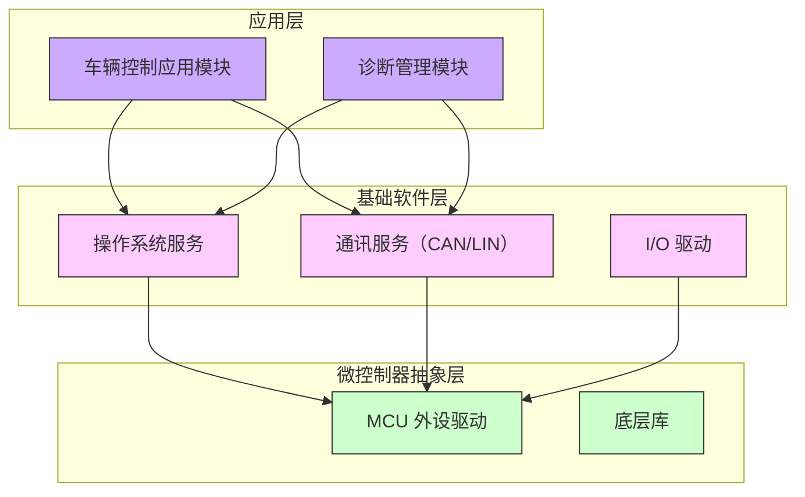

# 汽车ECU软件开发的系统架构文档撰写指南

作为一名嵌入式软件从业者，在**汽车 ECU 软件开发**中编写高质量的**软件架构文档**是确保项目成功和符合行业标准（如 ASPICE 与 ISO 26262）的关键步骤。本文将从实践操作、标准要求、方法论与最佳实践等角度，详细讲解如何在软件架构设计阶段（ASPICE SWE.2）撰写一份系统架构文档。


## 1. 实操手册：架构文档结构与编写指南

在软件架构设计阶段，产出物是一份详细的**软件架构设计文档**。该文档用于描述ECU软件的整体结构、模块组成、接口关系和动态行为等，为后续详细设计和实现提供蓝图。下面提供一个**标准的软件架构文档章节结构**以及各章节编写要点，帮助您快速上手撰写：

1. **引言（Introduction）**：说明文档的目的和范围，列出读者对象（例如开发团队、测试团队等）以及本架构文档在项目中的作用。包含术语定义、参考资料和相关文档列表，确保读者对背景有所了解。

2. **项目背景与架构驱动因素**：简要概述系统功能概貌和设计驱动因素，包括软件需求的来源、关键功能和非功能需求（性能、安全、平台约束等）。列出主要**架构约束**（例如硬件限制、标准遵循如 AUTOSAR、操作系统类型等）和假设条件，为架构设计限定边界。

3. **系统上下文与外部接口**：通过*上下文图*描述ECU软件与外部环境的关系，定义软件边界。说明ECU与外部系统、传感器/执行器、人机界面等的交互接口。上下文视图突出系统的边界和外部接口，使读者了解软件所处环境。该部分明确硬件-软件接口（HSI）等内容（注意：HSI 通常作为系统设计的一部分，由于它将软件架构与硬件设计关联，通常在系统架构阶段（SYS.3）中确定）。

4. **架构概述（Architecture Overview）**：提供软件架构的总体简介和设计思想。例如，可以说明架构所采用的**架构模式**（如层次化分层架构、AUTOSAR三层架构等），关键技术决策（如采用何种通信机制、容错机制），以及满足需求所采取的策略。通过一幅架构总体草图，展示主要的软件模块和层次关系，帮助读者快速理解架构全貌。

5. **静态结构设计（模块划分）**：详细列出软件的组成要素（软件模块/组件）及其层次关系。这一部分是架构文档的核心，通常按层次或功能对模块进行组织描述。例如按**层次**分为应用层、服务层、底层驱动层，或按**功能**分为若干子系统模块等。对于每个模块，要描述：
   - **模块职责**：模块承担的功能职责或实现的需求。
   - **子模块划分**（如果有）：模块内部进一步细分的结构。
   - **接口**：模块对外提供或使用的接口（函数调用、数据接口、消息等）。清晰列出该模块的输入和输出接口，以及与其它模块的交互关系。
   - **资源和约束**：该模块对资源的需求（例如运行在何种任务环境，CPU/内存预算等）和设计约束。
   - **安全或关键性**：如果适用，注明模块的安全关键等级（ASIL等级）或冗余/监控机制等。
   
   为了便于阅读，可以采用**表格**或清单的形式呈现模块列表。例如：

   | 模块名称        | 职责描述                       | 接口（输入/输出）                 | 备注（层级/安全）       |
   | :------------- | :--------------------------- | :------------------------------ | :------------------- |
   | SpeedController（速度控制） | 计算目标速度并控制电机输出       | 输入：踏板传感器数据；输出：电机扭矩指令 | 应用层模块，ASIL B |
   | ComManager（通信管理）    | 管理 CAN 总线收发，调度消息    | 输入：各模块发送的消息；输出：发送至 CAN 总线 | 服务层模块，QM |
   | MotorDriver（电机驱动）    | 控制电机执行器（PWM 输出）      | 输入：控制指令（来自SpeedController）；输出：电机驱动信号 | 驱动层模块，ASIL B |

   *编写建议：* 模块描述应**简洁明确**。可采用**分层次描述**（例如按层先总述各层的职责，再细化每个模块），并确保每个软件需求都能在某个模块的职责中得到体现（满足 ASPICE SWE.2 对架构分解和需求分配的要求）。模块划分要做到**高内聚、低耦合**，每个模块有清晰边界。

6. **接口设计与详细定义**：本节列出软件架构各模块间以及模块与外部的接口细节。可以针对每个接口提供如下信息：
   - 接口名称和简述（例如“加速踏板数据接口：周期性发送踏板位置给速度控制模块”）。
   - 接口类型（例如函数调用、数据结构、消息队列、事件信号等）。
   - 数据格式或参数：若是数据接口，定义数据元素的名称、类型、单位、范围等；若是服务接口，列出方法签名、输入输出参数等。
   - 时序或触发方式：接口调用/数据传输的频率、触发条件（中断触发、周期任务等）。
   - 错误处理：接口相关的错误或异常处理策略（例如通信超时的处理机制）。
   
   可以使用**IDL（接口定义语言）片段**、**示例代码**或**ARXML 片段**来精确定义接口。例如，一个 AUTOSAR 接口定义片段：

   ```xml
   <!-- 接口定义示例：发动机转速信号接口 -->
   <SENDER-RECEIVER-INTERFACE UUID="...">
       <SHORT-NAME>ISpeedSignal</SHORT-NAME>
       <SERVICE-INTERFACE-PROTOCOL>CAN</SERVICE-INTERFACE-PROTOCOL>
       <DATA-ELEMENTS>
           <DATA-ELEMENT>
               <SHORT-NAME>EngineSpeed</SHORT-NAME>
               <TYPE>UInt16</TYPE>
               <SW-DATA-DEF-PROPS>
                   <COMPU-SCALE>RPM</COMPU-SCALE>
               </SW-DATA-DEF-PROPS>
           </DATA-ELEMENT>
       </DATA-ELEMENTS>
   </SENDER-RECEIVER-INTERFACE>
   ```
   
   上例定义了一个名为“ISpeedSignal”的发送-接收接口，包含EngineSpeed数据元素（类型UInt16，单位RPM）。实际文档中，可以用更直观的方式描述接口，而将详细的机器可读定义放在附录或模型文件中。

   *编写建议：* 接口说明应确保**精确**且**无歧义**。推荐使用统一的接口定义格式，例如采用表格列出接口名称、发送者、接收者、数据格式、频率等，方便读者查阅和审查。同样重要的是，在接口定义中体现**契约设计**思想（Design by Contract），明确接口各方的责任和期望（这在后续[接口契约设计](#接口契约设计)部分有详细讨论）。

7. **动态行为描述**：为了保证架构不仅定义了模块的静态关系，还涵盖**运行时的动态交互**，文档需描述主要的动态行为场景。典型内容包括：
   - **运行模式**：列出软件可能的主要运行模式或状态（如初始化、自检、正常运行、故障降级模式等），以及模式切换条件。可以使用**状态图**或状态转换表描述。例如，系统上电后从Init态转换到Normal运行模式，发生严重错误时进入Safe状态等。
   - **时序场景**：通过**时序图（序列图）**等描述关键用例的交互过程。例如“ECU启动流程”“制动信号处理流程”“故障检测与报警流程”等。时序图展现多个模块之间消息或函数调用随时间的交互顺序，对于理解复杂交互很有帮助。
   - **并发和任务调度**：说明架构如何处理并发任务和中断等（多任务调度策略、优先级划分、关键互斥区域）。在实时系统中，描述中断处理、任务切换点、数据缓冲等有助于理解动态行为。可以列举关键中断服务例程的流程或者用泳道图表示任务间通信。
   
   下面给出一个简化的*时序图*示例，描述传感器、控制器和执行器间的数据流：

   ```mermaid
   sequenceDiagram
       participant 传感器
       participant 控制器
       participant 执行器
       传感器->>控制器: 上传踏板位置数据
       控制器-->>传感器: 请求新数据 (周期10ms)
       控制器->>执行器: 输出扭矩指令
       执行器-->>控制器: 执行反馈 (可选)
   ```
   
   在实际文档中，可以将上述交互用准确的模块名称和信号名称替换“传感器/控制器/执行器”，并增加必要的说明文字。通过动态行为描述，确保读者了解**软件组件如何协同工作**以满足系统需求。

8. **资源与性能预算**：软件架构设计还需考虑性能和资源使用方面的要求。本节应列出主要的**资源消耗目标**和设计裕量，包括但不限于：
   - **时间性能**：各主要功能或周期性任务的最坏执行时间（WCET）预算、调度周期，整体CPU利用率。列举关键任务的循环周期和占用的处理器时间百分比等。
   - **内存占用**：软件在ROM/FLASH、RAM上的静态和动态内存预算。可能按模块或模块类型给出估算，例如某模块预计占用ROM 4KB、RAM 512B等。
   - **处理器/平台**：目标处理器架构（例如 TriCore, ARM Cortex 等）及其时钟频率，对应的性能指标（DMIPS/MHz等）。
   - **I/O 和通信**：总线负载（如 CAN 总线带宽利用率）、网络通信时延要求等。
   - **存储与其他资源**：如果涉及文件系统、非易失存储、云资源等，也应在架构层给出分配方案。
   
   如有需要，可以用表格呈现关键性能指标。例如：

   | 资源/性能项       | 设计目标                       | 备注             |
   | :--------------- | :--------------------------- | :--------------- |
   | CPU 利用率        | < 50% @ 80MHz 主频           | 峰值负载模式下测算 |
   | 内存占用 (ROM/RAM)| ROM < 64KB；RAM < 16KB       | 基于当前模块估算 |
   | CAN 总线负载      | 峰值不超过30%                | 500 kbps 总线 |
   | 功耗              | 峰值电流 < 200mA             | 睡眠模式 < 5mA |

   *编写建议：* 资源与性能建模需要与系统需求中的非功能指标对应。如果某项性能需求没有在架构文档中分解落实，可能会在后续开发中被忽视。提供这些预算有助于在设计早期发现资源瓶颈，并为**架构分析**和优化提供基础。

9. **架构安全和故障机制**：针对功能安全（ISO 26262）或其他可靠性要求，软件架构文档应描述所采取的**安全机制**和**故障应对策略**。这一部分可以包括：
   - **故障隔离与冗余**：说明软件如何实现故障隔离，如模块划分上是否将不同 ASIL 等级的功能分开，以防止彼此干扰（Freedom from Interference）。例如，将安全关键模块和非安全模块隔离运行，或使用**独立的处理单元/内存**等手段来实现隔离。
   - **错误检测与处理**：列出架构层面实现的错误检测机制（比如输入数据范围检查、传感器信号冗余校验、通信错误校验），以及发现错误后的处理策略（进入安全状态、重启模块、上报错误码等）。例如：*“传感器数据采用双通道冗余设计，主通道故障时系统切换到备份通道，并记录故障码”*。
   - **安全机制概览**：如果实现了软件上的安全机制（Watchdog监控、NVRAM校验、ECC 校验、程序流监控等），概述其在架构中的布置，以及与硬件安全机制的配合。
   - **故障传播分析**：简要说明在架构级所做的依赖/失效分析。例如通过架构设计避免**单点故障**（Single Point of Failure），或者进行了**功能依赖分析**来保证没有潜在的共因失效导致多重安全功能失效。
   
   *编写建议：* 该部分侧重阐述**架构如何满足功能安全要求**。应当与项目的功能安全概念（如FTA/FMEA分析结论）保持一致。对于安全相关的内容，建议明确引用对应的安全需求或标准条款，使审核者能方便地检查一致性。

10. **架构评估与决策记录**：描述在架构设计过程中所做出的重要决策及其理由，以及架构评审的结论。这可以包括：
    - **架构方案评估**：如果曾经设计并比较过*多套备选架构方案*，应记录比较过程和评估结论。列出评估标准（如模块化、扩展性、性能、安全、复用程度等），以及最终选型的理由。例如，考虑过集中式与分布式两种架构，比较后选择了集中式架构，原因是模块间依赖简单且满足实时性能要求。
    - **关键架构决策**：对于影响全局的决策，用**架构决策记录（Architecture Decision Record, ADR）**的形式记录下来。每条记录简述决策内容、背景原因、备选方案和权衡、最终决定及其影响。比如：“ADR-001: 通信协议决策——在内部通信中选用CAN而非以太网，原因是带宽足够且已有成熟驱动，权衡了扩展性和延迟，最终选择CAN。”
    - **评审与一致性**：说明软件架构设计的**评审过程和结论**。包括谁参与了评审、发现的问题和改进、以及确认架构与上层需求和下层详细设计的一致性。这实际上响应了 ASPICE 要求的在架构完成后进行同行或跨部门评审，并确保架构被相关方理解和认可。
    - **追踪与基线**：确认架构文档与需求的双向追踪已经建立（可以在此引用需求追踪矩阵或说明其存储位置），并声明此架构设计已基线化进入后续实现阶段。
   
    *编写建议：* 在这一章节中，注重**记录决策背后的思考**，而不仅仅是结论。对架构的权衡取舍做出解释，有助于后来者理解架构意图，并在需求变化时知道哪些决策可以调整、哪些是根本约束。此外，通过记录评审意见和整改动作，体现持续改进，也为过程符合性提供证据。

以上章节构成了软件架构设计文档的主体结构。当然，不同公司可能在模板细节上有所差异，但**关键内容应大致相同**。在实际编写中，可根据项目特点增减章节或调整顺序。例如，若项目基于AUTOSAR，可以在架构概述部分突出AUTOSAR分层模型；若系统部署复杂，可加入专门的“部署视图”章节描述软件在多核、多ECU间的分配。

**撰写小贴士：**

- **语言清晰简练**：面向多角色读者撰写，尽量避免晦涩术语。必要的技术名词可在引言的术语表中定义。
- **图文并茂**：结合文本说明，使用框图、流程图、表格等辅助表达，提高可读性。VuePress 等工具支持 Mermaid 等绘图语法，可以使架构图随文档版本演进而方便维护。
- **保持一致性**：文档内的命名、术语应与需求规格、详细设计、代码中一致。例如模块名称、信号名称统一，避免混乱。
- **双向追踪**：建议在附录或存储库中维护需求到架构模块的映射表，以证明每个需求均有架构元素覆盖（满足 ASPICE SWE.2 对需求分配的要求）。
- **版本控制**：将架构文档纳入配置管理，重要变更时更新版本和变更记录。这样一方面满足 ASPICE 配置管理过程要求，另一方面可以追溯架构演化历程。

通过以上结构和建议，即使是架构设计的新手，也可以一步步编制出完整的架构文档。接下来，我们将深入解析标准（ASPICE 和 ISO 26262）对于软件架构设计阶段的要求，以确保文档内容全面合规。

<br>

<a name="标准解读：aspice-swe2-与-iso-26262-要求"></a>  
## 2. 标准解读：ASPICE SWE.2 与 ISO 26262 要求

在汽车行业的软件开发中，遵循**Automotive SPICE（ASPICE）**和**ISO 26262 功能安全标准**已成为惯例。软件架构设计作为开发过程中的关键一环，需要满足这些标准的要求以通过评估和保证安全。下面我们分别解读 ASPICE 模型中 SWE.2（软件架构设计）过程的目标和输出，以及 ISO 26262 标准对软件架构的相关要求，并提供合规建议。

### 2.1 Automotive SPICE SWE.2：软件架构设计过程要求

**Automotive SPICE（简写 ASPICE）**将软件开发过程分解为一系列过程域。其中，SWE.2 即**Software Architectural Design（软件架构设计）**过程，属于软件工程过程组，对应软件开发V模型中从软件需求到详细设计的中间步骤。

**流程目的（Process Purpose）**：建立软件架构设计，确定将哪些软件需求分配给软件的哪些要素，并依据定义的准则评估软件架构设计。简单来说，SWE.2 的目的是形成一套满足需求的**软件总体设计方案**。

根据 VDA QMC 发布的 ASPICE **4.0 版本**，SWE.2 的预期结果（Process Outcomes）包括：

- 建立了软件架构，包含**静态和动态方面**的设计。
- 根据预定的准则对软件架构进行了**分析评估**，确认其有效性。
- 在软件需求与软件架构元素之间建立了**双向追溯关系**，并保证两者内容**一致**。
- 相关方达成一致并**沟通了**软件架构，即架构设计得到认可并传达给所有受影响方。

这些结果可以细化为 ASPICE 3.x 版本中更具体的要点，例如：架构定义了必要的软件元素并分配了需求、接口已定义、动态行为和资源预算已考虑、确保了一致性和可追溯、架构获得一致认同等。可以看出，不论版本如何表述，**SWE.2 实质要求软件架构设计覆盖以下方面**：

- **静态架构**：明确的软件元素划分（模块/component）及其关系。包括对外部接口的定义，以及各元素如何连接组成整体架构。
- **动态行为**：架构对软件在各种情形下的行为有清晰描述。要考虑功能和非功能需求下组件的行为交互，包括不同模式下的互动及并发情况。
- **需求分配**：每项软件需求都被映射到一个或多个架构元素，实现**需求到架构**的覆盖。架构设计输出需要清楚体现这一分配关系。
- **资源和性能**：定义软件架构各部分对资源的需求或约束。这意味着架构层面对CPU负载、内存、时序等有预估或目标，以降低详细实现阶段出现性能问题的风险。
- **架构分析与备选方案**：对架构进行了必要的分析和评估，例如权衡不同架构方案，依据可靠性、可扩展性等标准选择最优方案。这一要求强调要有架构选择的理据和记录，而非想当然地确定单一方案。
- **一致性检查**：确认架构与更高层次设计（系统架构）和更详细设计（单元设计）保持一致，没有冲突或偏差（例如接口定义在系统设计和软件设计间需一致）。同时，架构本身内部也需要一致（例如不同部分的接口定义不矛盾）。
- **双向追溯**：建立需求到架构元素的追踪，并能够从架构追溯回相关需求。ASPICE 要求显式的双向追溯矩阵或等效证据，以证明无未覆盖需求，也无脱离需求的架构功能。
- **沟通与批准**：架构设计必须通知到所有受影响方并获得共识。这通常通过评审会议、签署审批或培训等方式实现，需有记录证明架构已为相关干系人所知悉（这也对应输出物中的“沟通记录”等）。

ASPICE v4.0 将 SWE.2 细分为**5条基本实践（Base Practices）**：

- **SWE.2.BP1** – **指定静态方面**：依据功能和非功能需求，制定并记录软件架构的静态方面，包括对外部接口定义，以及软件组件集合及其接口和关系。*(简单理解：划分模块并定义其接口关系)*。
- **SWE.2.BP2** – **指定动态方面**：依据需求，制定并记录架构的动态方面，包括软件组件在不同软件模式下的行为及它们的相互作用，并考虑并发等因素。*(简单理解：描述关键场景的时序、运行模式和并发处理方式)*。
- **SWE.2.BP3** – **分析软件架构**：从相关技术设计因素出发分析软件架构，并支持项目管理了解项目对资源、风险等的影响。换言之，要对架构做诸如性能分析、风险分析、可行性验证（必要时构建原型）等，并给出分析结果和改进行动。也包含比较备选方案并记录架构选型的 rationale（基本原理）。
- **SWE.2.BP4** – **确保一致性并建立双向追溯**：确保软件架构与软件需求之间内容一致，并建立起两者的双向可追溯关系。这要求在架构完成后，检查每个需求是否都有相应架构支持，且架构中无无依据的元素。同时，更新追踪链接，在配置库或追踪矩阵中存档。
- **SWE.2.BP5** – **沟通达成一致的软件架构**：将商定的（评审通过的）软件架构传达给所有相关方。通过正式的沟通（培训、发布说明、评审记录等）确保开发、测试、系统、硬件团队了解当前软件架构基线，并在之后的工作中据此执行。

> **注:** ASPICE 3.1版本中，SWE.2被划分为9个基本实践（BP1~BP9），具体名称和内容与上面基本对应，只是组织方式略有不同。例如，3.1中BP1~BP3涵盖架构开发和需求分配、接口定义，BP4描述动态行为，BP5资源消耗，BP6评估备选架构，BP7追溯，BP8一致性，BP9沟通。ASPICE 4.0 精简合并为上述5条，要求并未减少，只是表述更凝练、避免重复。无论使用哪个版本评估，**满足这些要求的实质是一样的**。

**主要输入和输出**：根据ASPICE模型，SWE.2的输入主要是上阶段的成果，包括已基线的**软件需求规格（来自SWE.1）**，以及系统架构设计（SYS.3）提供的约束（例如HIS接口、硬件资源约束）等。输出则是**软件架构设计**本身以及相关的工作产品，例如：

- 软件架构设计文档或模型（ASPICE信息项编号通常是04-04 Software Architecture）。
- 接口规范（如单独的接口需求或接口设计文档，17-08 Interface Requirements Specification，如果接口内容未全部包含在架构文档中）。
- 跟踪矩阵或追踪记录（13-22 Traceability Record，证明需求到架构的双向追踪）。
- 架构评审记录（13-19 Review Record，证明已对架构进行评审并一致通过）。
- 架构沟通/发布记录（13-04 Communication Record，例如架构发布邮件、培训签到等）。
- 架构分析或评估报告（15-51 Analysis Results，如果进行了性能计算、替代方案比较等，则应有记录）。

从评估角度，ASPICE 审核员将检查上述输出是否完备并符合要求。例如，他们会查看架构文档内容是否涵盖**所有必需方面**（静态、动态、接口、资源等)，需求追踪是否完整一致，评审沟通证据是否齐全等。如果发现缺失或不一致，将视为过程缺陷，影响评估等级。

**合规建议（针对 ASPICE SWE.2）**：

- 使用**模板**或检查表确保架构文档包含所有关键章节（参见前述实操手册部分列出的结构），逐项满足ASPICE期望。
- 在架构设计过程中，**及时维护追踪**关系。例如在需求管理工具中建立软件需求到架构模块的链接，输出文档中也可以附上“需求分配表”。这样在评估时可快速提供追溯证据。
- 针对**SWE.2.BP3 架构分析**要求，建议在架构确定后编写一份简单的架构分析报告：列出架构如何满足性能、安全、复用等设计准则（可以引用方法论部分的一些质量属性作为标准，如可维护性、扩展性等），并记录权衡过程。这既是证明“按准则评估”的证据，也可作为改进记录。
- **架构评审**要正式进行，并保存记录。评审应检查架构满足所有软件需求、遵守上位设计约束（比如系统/安全约束）以及内部一致性等。将评审结论和参与人员签名存档，可作为BP8（Ensure consistency）和BP5（Communicate）满足的强有力证据。
- 重视**架构基线**管理。一旦架构文档评审通过，应冻结版本，并控制后续变更（通过变更请求流程）。评估员会关注配置管理对架构文档的控制，特别是当需求变化时是否相应更新架构并再次评审。遵循SUP.8配置管理过程要求，可以使这一部分自动满足。

### 2.2 ISO 26262 标准对软件架构设计的要求

**ISO 26262**《道路车辆 功能安全》是汽车电子电气系统功能安全的国际标准。对软件开发而言，主要参考**ISO 26262-6**（功能安全管理，第6部分：产品开发：软件级别）。其中**7.软件架构设计**（ISO 26262-6:2018 第7节）对软件架构提出了专门要求。

概括来说，ISO 26262 对软件架构设计的要求关心**功能安全相关的软件架构**如何**保证安全目标的实现和没有引入新的危险**。以下列出标准中的重要要点及其含义：

- **层次化分解**：软件应按层次分解为适当的组件，直至最低层组件可在详细设计中实现（注1）。这一要求确保架构提供足够细节，例如直到定义出软件单元的边界。分层还能控制复杂度、实现模块隔离。

- **采用适当的表示法**：ISO 26262 提到应使用**合适的符号和工具**来描述软件架构（Notations for SAD）。通常建议使用标准化的建模语言（如 UML、SysML 或半形式化符号）。这在文档层面意味着应**清晰绘制架构图**或使用一致的符号，以避免歧义。

- **原则和指南**：标准提出若干**软件架构设计原则**（7.4.3，如2018版）。这些通常包括：模块高内聚低耦合、接口定义清晰、考虑可维护性和可测试性、考虑故障隔离等。架构文档应该在设计说明中体现这些原则，如说明如何通过层次化、接口封装实现低耦合等。

- **详细程度**：软件架构需达到规定的详细程度（Required level of detail）。例如，每个组件的接口和功能应明确描述到足以进行后续单元设计和实现。这一点在文档体现为对每个模块都给出了明确的说明，而不会过于抽象。

- **软件元件分类**：对于安全相关的软件，每个组件需要**分类为**：新开发、修改重用或不加修改复用。新开发或修改的必须依照ISO 26262开发；未修改重用的需要按照ISO 26262-8第12节进行资格鉴定。因此，架构文档在列出组件时，若涉及复用的已有软件（如AUTOSAR库、第三方库），应注明其来源和分类，以便后续采取相应措施（开发或验证）。

- **ASIL 分配**：将软件安全需求（ASIL要求）分配到软件架构的各个元件上。若一个组件内包含不同ASIL等级的元素，则整个组件需要按最高ASIL等级开发，或采取隔离措施证明独立性。架构阶段应针对每个安全需求，决定由哪个模块实现，并标注模块的ASIL等级。文档可在模块描述中增加“安全等级”字段。

- **软件划分和独立性**：为了防止故障在安全相关和非安全相关功能之间相互影响，标准要求**软件实现适当的分区**（Partitioning, ISO 26262-6 7.4.11）。这包括：如果一个ECU既跑安全关键又跑非安全软件，需要确保互不干扰。如通过**独立的处理单元、独立的内存空间**等实现隔离。如果无法完全隔离，就需要做**依赖故障分析 (DFA)**来证明共模/级联故障受控。因此，架构文档应体现出这方面的考虑，例如：*“将ASILD的诊断功能与ASILB的普通控制功能放在不同的微控制器内核上”*，或者*“利用操作系统内存保护机制隔离不同安全等级的内存区域”*。同时如果不能完全隔离，就需要在安全分析文档中有相应DFA结果。虽然DFA报告可能独立于架构文档，但**架构设计必须提供使DFA可行的设计决策**，如划分边界、监控机制等。

- **故障传播防范**：进一步的，标准提出要分析和避免**系统性故障**和**随机硬件故障**在软件架构中引入新的危险。比如防止由于软件设计导致单点故障未被检测就造成危险，或者多个冗余通道因软件依赖而失效（共因失效）。架构层面应该**支持实施安全机制**来应对这些情况。文档中需要描述**软件安全机制**配置（ISO 26262-6 7.4.14/15），如：
  - 输入输出数据范围检查、
  - 信号的**可信度和冗余校验**（如多传感器交叉监测）、
  - 存储器和通信错误检测（ECC、CRC 等）、
  - 外部监控（例如独立看门狗或多微控制器交叉监控），
  - 系统故障安全状态定义（出故障时软件如何确保系统转入安全状态）。

  架构文档中可以有专门的小节列举这些机制（在上一节“安全和故障机制”部分我们已有说明），并可引用到安全需求以展示满足性。

- **架构验证**：标准要求对软件架构进行验证（7.4.18 验证符合性），确保软件架构设计满足软件安全需求并遵循上述原则。通常做法是在架构设计完成后，进行**架构的功能安全确认**，包括检查：所有安全需求在架构上均有所实现，所有假定的外部措施已落实，架构没有违背安全原则（例如不使用禁止的构造，如ASIL D软件中避免不安全编程语言特性等）。这通常形成**架构符合性检查表或评审记录**。对于撰写文档的人来说，需要确保在文档中清晰呈现每一条安全需求的去向，以及架构如何满足之。如有安全部门或独立评审员审查架构，也应将结论记录归档。

**合规建议（针对 ISO 26262 软件架构）**：

- 将**安全需求融入架构**：从软件安全需求规格开始，一一核对在架构的哪个部分实现。建议在架构文档的模块说明里添加一列/段，专门列出该模块覆盖的安全要求，以及相关ASIL信息。这使文档本身即可部分满足追踪要求，且方便功能安全工程师审查。
- **明确安全关键组件**：在架构图或模块表中，用标识注明安全关键组件（如颜色、图例或特殊标记），区分开QM（非安全）和不同ASIL等级的模块。确保文档读者能一目了然地看到架构中安全相关部分，对应哪些安全功能。
- **描述独立性措施**：如果采用了软件分区、时间触发调度等方式来保障独立性，在文档中详细描述其实现原理。例如：“通过在OS配置中将任务X和任务Y分配到不同内存保护域，确保它们ASILD和ASILB的分离”。对于硬件上实现的隔离（如双核不同核跑不同ASIL的软件），在软件架构中也应提及利用了硬件的这个特性。
- **记录安全分析输入**：软件架构设计往往需要输入到安全分析，如FTA/FMEA。这方面的细节不必全写入架构文档，但**任何为了安全而特设的架构措施**都应在文档里体现（比如三重冗余投票机制、模式管理等），并可在文档中提示“将在FMEA中验证该措施有效性”。这样评审人员会意识到架构已经考虑了这些点。
- **遵循编码规范和限制**：虽然与架构文档关联不大，但在架构阶段就应考虑到后续实现需要遵守MISRA C等标准（ISO 26262要求之一），因此架构设计中避免不必要的复杂性（如不鼓励在高ASIL组件中使用动态内存分配等）。可以在架构文档的设计原则部分加一句说明，例如：“对于ASIL D的模块，其设计避免使用任何不确定时序的机制，如动态内存分配或无界循环”等。这表明架构层面已经贯彻了安全编码原则。
- **确认无新危险**：ISO 26262要求架构不引入未识别的新危险（7.4.16）。团队通常通过检查架构变化来确认这一点。如果项目已有功能安全概念，建议对照概念阶段假设，验证软件架构没有违背那些假设。如果增加了新组件或机制，是否需要更新危害分析。虽然这不是文档主要内容，但可在架构设计说明中写明：“架构设计已与系统安全工程师评审，未引入新的安全隐患”，以示已经考虑。

总的来说，ASPICE 强调**工程过程和产出完整性**，而 ISO 26262 强调**安全机制和保证**。在软件架构阶段，我们需要**融合两者**的要求：既产出形式完备的架构文档和追踪、评审记录等过程产物（满足ASPICE），又确保设计本身充分考虑了功能安全原则（满足ISO 26262）。幸运的是，这两者有很大重叠：良好的架构过程通常也支持安全。例如，ASPICE要求的“资源预算”“接口定义”“动态行为”等内容，恰恰有助于我们分析安全上的时间裕量、避免接口误用和理解故障场景；反过来，安全要求如“隔离、冗余”也会反映在架构设计和文档中，使架构更加健壮。

**实用提示**：为了同时满足ASPICE和ISO 26262，可以引入一个简单做法——**在架构文档中附上符合性检查清单**。比如附录列一张表，罗列ASPICE SWE.2 所有要点和ISO 26262-6 第7节要点，并注明文档哪个章节覆盖了该要点。这个清单既可在编写时自查缺漏，也能在评审或评估时快速向审核员展示证明，体现出高度的过程成熟度和安全意识。

<br>

<a name="方法论与最佳实践"></a>  
## 3. 方法论与最佳实践

软件架构设计既是一门工程，也是一门艺术。在满足标准要求的基础上，采用正确的方法和行业最佳实践，将显著提升架构设计的质量。下面我们针对几项关键的方法论和实践技巧展开介绍。这些内容包括如何划分模块、设计接口契约、建立架构视图、进行性能建模、绘制动态模型，以及记录架构决策等。这些实践既能帮助实现一个**清晰、健壮**的架构，又能产出**易于沟通和维护**的架构文档。

### 3.1 软件模块划分方法

**将庞大的软件需求合理地划分为模块**是架构设计的首要任务。模块划分的方法直接影响系统的可理解性、可维护性和可扩展性。以下是常用的模块划分思路和最佳实践：

- **基于功能分解**：按照软件需要实现的**功能/特性**来划分模块。这类似于从需求出发，找到功能上的自然边界。例如在汽车ECU中，可以将控制算法、信号处理、通信管理、诊断服务等功能分别归属不同的模块。功能分解法的优点是模块职责清晰（单一职责原则），与需求对应紧密，便于追溯。要确保的是功能划分后模块间交互简洁，通过清晰接口通信。

- **基于层次和抽象级别**：引入**分层架构**思想，将软件按职责不同划分为若干层。如典型的三层架构：上层是**应用层**（包含控制策略和业务逻辑模块），中间是**服务层**或**中间层**（包含操作系统适配、通信服务、诊断服务等通用服务模块），底层是**微控制器抽象层**（包含驱动、HAL 等直接与硬件交互的模块）。层次化划分可以限制模块依赖方向（通常下层不依赖上层），实现良好的解耦和隔离。层与层之间通过明确的接口协议通信，有助于未来替换底层实现或增加新服务。

- **基于数据流/控制流**：分析系统中数据的流动路径或控制的调用链，沿着这些路径划分模块。例如输入处理、决策计算、输出执行可以是三个模块链式调用。这种划分确保数据传递过程清晰，各模块各司其职。配合**管道/过滤器**架构模式，可以处理数据流经的一系列处理步骤，每步一个模块。

- **基于变更隔离**：考虑未来可能的变化，将易变的部分和相对稳定的部分分开成为不同模块。这是**面向变化的设计原则**，也可理解为高内聚低耦合的一种应用。例如某部分算法可能频繁调整，而IO驱动相对稳定，那么将算法逻辑和IO分属不同模块，通过接口隔离，使算法变化不影响IO模块。

- **结合AUTOSAR架构**：在汽车领域，若使用AUTOSAR标准架构，可以遵循AUTOSAR提供的**分层模块**模型：应用软件组件 (SWC) 定义应用功能模块，运行在RTE上；RTE下面是基础软件（BSW）分为服务层、ECU抽象层、MCAL层等。架构设计时可参考这些层次，将应用逻辑封装为SWC（软件组件）集，定义好SWC间接口（发送/接收或客户端/服务器端接口），同时把平台相关的服务(如COM、OS、NVM等)归入基础软件模块。AUTOSAR的方法给出了现成的分层思想和接口标准，可以大大提高架构的标准化程度和与其他团队协作的效率。

- **考虑安全和可靠性**：如上一章所述，功能安全要求有时会影响模块划分。例如，为了实现冗余，你可能要把同一功能的两套不同实现划为独立模块；又如为了隔离ASILD和ASILB的功能，需要将其放入不同模块甚至不同任务中。这些都是驱动划分的额外因素。在满足功能划分的同时，确保**安全关键**模块和非安全模块适当独立（内存上或调度上隔离等）。

- **模块规模适当**：模块不要过大或过小。过大的模块含混了太多职责，不利于理解和维护；过小的模块则导致模块数量庞大、接口碎片化，架构复杂度上升。一个经验是：每个模块应大致能独立实现1~3个主要需求或功能特性，代码量可以实现起来在几百至几千行规模，而不会大到不可控，也不至于小到不必要拆分。当然，这只是经验值，需要结合具体项目和团队而定。

**最佳实践提示**：

- **高内聚，低耦合**：始终检视模块划分是否满足高内聚（模块内部功能紧密相关）和低耦合（模块之间依赖尽量少且简单）。如果发现某模块功能彼此几乎无关联，可以考虑再拆分；如果发现两个模块之间大量调用彼此内部函数，则可能需要重划边界或者引入中介减少耦合。
- **明确定义模块边界**：一旦确定划分，在文档和团队沟通中反复强调模块边界（尤其在多人协作时）。明确“模块X负责哪些事，不负责哪些事”，可以在架构文档里用**“不属于本模块的功能”**来防止误用。
- **演进式划分**：初始划分并非一成不变。随着对需求理解加深，或PoC验证，可能需要调整模块划分。保持一定灵活性，但同时注意版本管理和变更记录。演进过程中，每次调整都要重新评估是否违背了原来的架构原则。
- **使用建模工具**：可考虑利用UML组件图、包图等对模块划分进行可视化。有的架构工具（比如Enterprise Architect、PlantUML等）可以方便绘制模块依赖图。直观的模块图有助于发现不合理的依赖（例如箭头“逆向”太多就表明耦合高）。
- **示例参考**：可以参考行业案例或公开框架的模块划分。例如某些典型ECU（电池管理、发动机控制等）的已知架构，在论文或白皮书中常有阐述。这些案例提供了模块划分的参考蓝本。也可以参考Arc42模板中的**Building Block视图**，看别人通常在第1、2、3层划分哪些模块。

总之，良好的模块划分使架构具备清晰的**分解结构**，为详细设计和实现打下基础。下一步，在确定模块划分后，就需要严谨地定义它们之间沟通的契约，即接口，这正是我们下面要讨论的。

### 3.2 接口契约设计

**接口**是模块间协作的桥梁。优秀的接口设计能使模块松耦合、易于理解和替换，而糟糕的接口会导致误用和连锁错误。在架构文档中，对接口的定义不仅要说明“**接口做了什么**”，更要明确“**如何使用**”以及“**各方责任**”。这引出了“接口契约（Contract）”的概念：将接口视为提供方和使用方之间的契约，规定双方的义务和权利。

实施接口契约设计的要点：

- **输入/输出前提条件**：为接口定义**前置条件**和**后置条件**。前置条件是调用方必须保证的状态，例如函数参数需在某范围内、某资源已初始化等；后置条件是被调方保证的效果，例如返回值意义、系统状态改变等。这类似于 *Design by Contract* 中的约定，在架构文档中可以文字描述这些条件。例如：“函数`CalcTorque(pedalPosition)`前置条件：pedalPosition范围0~100%；后置条件：返回计算出的扭矩值0~400Nm范围，且全局状态PowerMode必须已为ON。”

- **接口完整性**：确保接口定义包括了完成合同所需的全部信息。不遗漏重要参数，也不暴露不需要的信息。比如一个传感器数据接口，可能需要传递数值和有效标志两部分，如果只定义了数值而无有效位，调用方就不知道数据是否可信。因此接口契约中要明确**数据的语义**，必要时多传递元数据（如单位、有效性）。

- **错误和异常约定**：接口契约要处理异常情况。定义当输入不满足条件时接口如何反应（返回错误码、抛异常、忽略？），当内部发生错误时如何通知调用者。比如通讯接口可以约定：“发送消息接口SendMsg，如队列已满则返回ERR_BUFFER_FULL错误码，调用者应在100ms后重试”。将这些异常契约写入接口说明，可避免使用者误判。

- **时序契约**：对时序敏感的接口，需要定义时序要求。例如“调用顺序”“节拍约束”等。比如某初始化接口必须在调用其他接口之前调用，这就是调用顺序契约。再如软硬件握手的接口对时序有要求，也需要在契约里明确（如：“在调用接口B后必须等待至少5ms再调用接口C”）。

- **并发使用约定**：如果某接口涉及并发访问（多任务、多中断），需规定是否是**可重入的**、是否需要由调用方保证互斥等。例如：“函数`InitDriver`不可并发调用，应由调度保证在单一上下文调用一次”。或者“数据缓冲接口Thread-safe，多线程可同时读写，但写方需注意Atomicity保证”。这些都是契约的一部分，让使用者清楚线程模型。

- **接口版本和演化**：设计契约时考虑未来扩展。如果接口可能升级，需要设计**向后兼容**方案，如预留字段、使用版本号等。架构文档可在接口列表中说明接口版本，以及如果更改如何保证不影响已有调用方。对外接口尤其如此，因为ECU软件常要兼容旧的通信协议版本等。

**在架构文档中体现接口契约**的方法：

- **接口描述表**：用表格形式列出接口名称、提供者模块、使用者模块、接口功能概述、参数/数据含义、错误码、调用约束等关键元素。例如：

   | 接口名         | 提供者   | 使用者    | 功能概述                     | 参数及含义                     | 注意事项/约定                   |
   | :------------ | :------ | :------- | :------------------------- | :--------------------------- | :--------------------------- |
   | GetSpeed()    | Sensor模块 | Control模块 | 获取当前车速值               | 返回值：UInt16 车速 (km/h)   | 前置：传感器已初始化<br>后置：0<=返回值<=250；若故障则返回0并设置ErrorFlag |
   | SendCAN(msg)  | Com模块  | 所有模块  | 发送一帧CAN消息              | 输入：msg结构体（含ID、DATA） | 异常：发送队列满则返回ERR_BUSY<br>时序：调用间隔至少10ms |
   | CalcTorque(pedal) | Control模块 | Control模块（内部其他子功能） | 计算目标扭矩                | pedal：油门开度0-100 (%)    | 前置：发动机已启动<br>后置：返回Nm值范围[0,400]<br>线程安全：不可并发调用 |

   通过这样的表格，读者能清楚看到接口各方面契约。尽量在表格中用**简洁语言**描述契约条件，也可以在文档正文对复杂约定加以解释。

- **接口示例代码**：对于关键接口，可以给出伪代码或示例调用序列，演示正确使用方法。例如：
   ```c
   // 示例：正确的接口调用顺序
   EngineDriver_Init();          // 前置：硬件已上电
   Sensor_InitAll();
   Control_Init();
   ...
   speed = Sensor_GetSpeed();    // 获取速度
   torque = Control_CalcTorque(pedal);
   Motor_SetTorque(torque);      // 输出扭矩
   ...
   EngineDriver_Deinit();        // 系统关闭
   ```
   并在注释中标注这些接口的前后条件。这个示例让人直观理解接口契约的用法。

- **对外接口协议**：如果架构有对外通信接口（如诊断服务UDS、CAN信号接口），则这些契约更需清晰记录。例如UDS服务的请求/响应格式，CAN信号的发送周期和容错处理等，都应当在架构设计（或引用详细的接口规范）中体现。

**接口契约设计的最佳实践**：

- **尽早定义并评审接口**：接口定义一旦修改，往往牵涉多个模块的变更，代价高。因此在架构设计阶段尽量让接口契约**清晰且稳定**。可以组织一次专门的接口评审，由架构师和各模块负责人共同检查接口设计是否满足需求且无歧义。
- **避免过度或不足**：契约需要完整但也要恰到好处，过度设计（限制太死或考虑过多不现实场景）会增加实现复杂度；反之契约不明确将导致实现阶段各自揣测。拿捏平衡需要经验。一个建议是基于已有**标准接口**为蓝本，例如参考AUTOSAR标准接口如何定义数据和服务，行业标准往往在契约上是经过验证的。
- **文档与实现同步**：接口契约在文档中约定后，实现必须遵循。同时，如果实现中发现契约有问题（比如某前置条件无法满足或多余），要及时在架构文档中更新。保持文档和代码的一致，才能真正起到契约的作用。
- **工具支持**：使用自动化工具维护接口定义，例如采用**接口控制文档（ICD）**或API文档工具。这些工具可以从代码注释生成文档，或从建模工具导出接口说明，减少人为不一致。另外，一些静态分析工具可以检查契约（如通过注释定义函数的pre/post条件，然后检查调用处是否满足），这些都可以在开发流程中引入以强化契约的执行。
- **考虑性能**：接口设计也要考虑调用频率和性能开销。契约中如果规定了复杂的参数或数据结构，要确认其合理性。例如高频率调用的接口尽量保持轻量，否则应该在契约上限制调用频率。架构阶段应该意识到这些并在接口说明中提及（比如上例SendCAN就提示了调用间隔）。

通过良好的接口契约设计，软件模块之间的协作将更加可靠和清晰，后续开发者只要遵守契约，就能各自并行工作而较少发生集成问题。

### 3.3 架构视图建模（C4/ARC42/层次图）

软件架构本质上需要从不同角度去审视和描述。**架构视图**就是针对系统不同关注点给出的描述投影。常见的视图包括：上下文视图、逻辑视图、进程视图、部署视图、运行时视图等。采用适当的方法论（如 C4 模型、4+1 模型、Arc42 模板）可以指导我们构建这些视图并在文档中组织呈现。

以下介绍常用的架构视图建模方法：

- **C4 模型**：C4 是由 Simon Brown 提出的架构可视化模型，名称代表**Context（上下文）- Container（容器）- Component（组件）- Code（代码）**四个层次。它强调从高到低逐步细化架构：
  - **Context**：系统的语境图，描绘系统与外部参与者（用户、外部系统）的关系。例如，一个ECU系统上下文图中，ECU处于中心，周围显示与之通讯的其他ECU、传感器、执行器、云服务等，让人了解该ECU的边界和交互环境。
  - **Container**：系统内部的容器图，定义系统中**主要的子系统或运行容器**。容器可以是独立进程、线程、库、数据库等。在ECU中，可视为将软件分成几个主要执行单元，比如主控制循环、通讯栈、操作系统、驱动集合等，并展示它们之间的关系和通讯机制。
  - **Component**：进一步细化到各容器内部的组件结构图。例如在某个容器（如主控制应用程序）内，有哪些模块/类，它们如何交互。对于嵌入式系统，此层常对应代码中的模块或类关系图。
  - **Code**：代码级别的细节图，比如类图、详细的序列图等。在架构设计阶段通常不要求到代码细节，此层次有时可以省略或留给详细设计。
  
  使用C4模型能确保架构描述既有宏观又有微观视角。在文档中，可以采用分层次的图表与文字描述：先给Context图与说明，再给主要容器（或子系统）的图与说明，等等。例如：Context图交代ECU与其他ECU及传感器的接口；Container图说明ECU软件由三个主要任务进程构成：控制任务、通信任务、监控任务，每个任务内再细分组件…… 这样读者可以按层次逐步深入理解架构。

- **Arc42 模板**：Arc42 是一个著名的**架构文档编写模板**，它预定义了架构描述的章节结构和视图集合。Arc42包含的主要视图有：
  - **Context View（上下文视图）**：同C4的Context类似，描述系统与环境交互。
  - **Building Block View（构件视图）**：也称静态结构或逻辑视图，分层展现系统内部的模块构成及关系，相当于C4的Container和Component层次的组合。
  - **Runtime View（运行时视图）**：描述系统动态行为，如交互场景、序列图、状态图等。
  - **Deployment View（部署视图）**：描述系统在硬件或基础设施上的部署结构。对于单一ECU的软件来说，这视图可以是软件模块到硬件的映射（哪部分跑在主核，哪部分跑在协处理器等），或者多ECU系统中软件如何分布。
  - 此外Arc42还关注**质量场景**（如性能、安全场景的分析）、**决策日志**等。在Arc42框架下撰写文档，可以确保不遗漏重要视角，并能促进与读者的交流。

  将Arc42应用到我们的ECU架构文档上，实际就类似于我们在第1部分提出的文档结构：有上下文、有约束、有结构视图、有运行时行为、有部署/技术细节，还有决策记录和质量需求等章节。Arc42的优点是**结构完整**且**广为业界接受**，很多架构师都熟悉这个模板。因此，如果听众或评审人员了解Arc42，我们的文档组织就会显得很专业。同时Arc42网站和社区提供了丰富的示例和实践，可以借鉴。

- **4+1 视图模型**：这是一种经典的架构描述模型，将系统架构划分为5个视图：“逻辑视图、开发视图、过程视图、物理视图”，以及贯穿这些视图的“场景/用例”（第+1视图，用于验证前4个视图)。在汽车软件架构中，可以类比：
  - 逻辑视图：软件的功能模块结构（类似前述静态结构）。
  - 开发视图：代码结构、组件分配、分层等（对于嵌入式，开发视图也可表现为组件与源码文件组织）。
  - 过程视图：运行时进程/任务和线程模型，及其交互（嵌入式ECU上就是任务调度、中断机制等的视图）。
  - 物理视图：部署在硬件上的映射（ECU硬件布局、多核、网络拓扑）。
  - 场景：关键场景的时序与交互描述（比如启动、故障处理场景）。
  
  4+1视图模型强调通过具体场景来说明并验证架构设计。例如，可以选取“正常行驶工况下制动控制的工作流程”作为场景，来验证逻辑、过程视图上的各模块和任务如何协同完成该场景。如果有显著的场景无法顺利用现有架构解释，就提示架构可能有疏漏。

- **层次图（Layered Diagram）**：对于嵌入式系统，**分层模型**几乎是必不可少的视角之一。可以专门绘制一张“层次架构图”，展示系统的各软件层级及每层的模块。这种图在文档中很有价值，因为读者往往想快速知道系统采用了什么层次划分。例如：


   
   *（上述图例展示了应用层、基础软件层、MCAL层的划分，每层包含示例模块，并用箭头表示调用依赖方向。）*

   通过层次图，一方面体现高层模块只能调用低层模块（依赖方向单向），另一方面也清楚地按职责对模块做了分组。这对理解架构和指导团队分工都有帮助。层次图也可以配合Arc42的构件视图或C4的容器视图一起使用：先给出整体分层，再深入每层内部细节。

**架构视图建模最佳实践**：

- **选择合适的视图组合**：没有必要拘泥于某一种模型，可以混合使用。例如文档采用Arc42的大框架，但借用C4模型来绘图描述，从Context到Component，最终Arc42的运行时视图则用4+1模型的场景来验证。这些都是可以组合的。关键是**覆盖读者关心的方面**：既要让人了解系统边界，又要看清内部模块结构，还能看到运行动态和部署情况。
- **视图之间保持一致**：不同视图展现不同侧面，但要确保同一元素在各视图的描述不冲突（例如Context视图说ECU与雷达相连，但部署视图却漏掉了雷达这硬件）。可以在文档中对照检查，或建立一个元素清单确保每个关键元素在需要出现的视图中都出现且名称一致。
- **充分使用图例和说明**：在图中添加图例（Legend）说明符号含义，如不同形状代表模块/进程/硬件，不同颜色代表安全级别等，使图自解释性更好。旁边配合简短的说明段落解释图的要点，而非让读者自己猜测。
- **保持简洁**：每个视图图表力求**关注单一主题**且不要过于复杂。比如Context图不用细节到每根信号线，只画主要系统块；组件视图可以分层多张图而不是一张全模块大网图，否则难以阅读。实践中可以多产出几张小图胜过一张大而全但凌乱的图。
- **使用建模工具**：如果手绘图复杂，可以使用工具如PlantUML、Mermaid、Visio、Enterprise Architect等来绘制标准化的视图图。PlantUML也常用于Arc42风格文档，能够生成各种UML图。此外Structurizr是专门支持C4模型的在线工具，可以考虑。在工具选择上，没有强制标准，以团队方便为准。
- **验证视图**：将各视图拿给不同利益相关者审阅。例如，让软件开发人员看组件视图是否清晰，让系统工程师看上下文视图有没有漏掉外部接口，让测试人员看运行时场景是否覆盖典型用例。多方反馈有助于完善视图，确保架构表达准确、无重大疏漏。

总之，多视角的架构建模有助于全面、有效地传达架构设计。它让复杂系统的不同方面都被捕获在设计中，而不会顾此失彼。在软件架构文档中合理组织视图，将极大提高文档的**可阅读性和实用性**。

### 3.4 性能与资源建模

嵌入式ECU软件常常受限于计算资源和实时性能要求。因此，在架构设计阶段引入**性能与资源建模**，能及早发现潜在问题并指导设计取舍。这部分实际上对应ASPICE SWE.2 中关于**资源消耗目标**和**性能分析**的内容。下面介绍如何在架构设计中考虑和建模这些方面，以及常用的实践：

- **时间性能建模**：即对系统的实时行为进行设计和分析。架构层需要确定主要**任务的周期和优先级**，以保证满足响应时间需求。例如，为满足制动控制100ms内响应的需求，架构上可能设计一个10ms周期的高优先级任务来读取制动踏板输入并计算制动压力。可以制作一个**调度表**或时序甘特图，粗略标示各任务在时间轴上的执行。如：
  - 任务A（传感器采集）周期10ms，执行时长上限2ms，优先级高。
  - 任务B（控制算法）周期10ms，执行时长上限3ms，优先级中。
  - 任务C（诊断通讯）周期100ms，执行时长1ms，优先级低。
  
  通过这种模型，可以估算最坏情况下的CPU负荷，例如同一周期可能TaskA和TaskB背靠背执行，占用5ms CPU时间，在10ms周期内占用50% CPU，则基本安全。如果超出，则需调整任务设计或性能预算。架构文档可包含这样的**任务列表表格**及说明，证明已考虑实时性。

- **调度与响应分析**：对于硬实时系统，可以在架构阶段进行**调度可行性分析**（例如Rate Monotonic Analysis, RMA）。假定任务执行时间上限，计算任务调度的CPU利用率、调度裕度等。如果发现不满足调度理论安全范围，就要在架构上做改变（比如简化算法或增加硬件资源）。这种分析过程和结论也可记录在架构文档或支撑的分析报告中，体现设计的充分性。

- **内存和存储**：架构阶段不要求精确的内存占用，但可通过对类似项目或模块规模的经验，给出**预估**。例如：
  - 控制算法模块：预计代码4KB，数据1KB。
  - 通讯栈：协议栈代码8KB，运行时缓冲2KB。
  - 操作系统与驱动：代码16KB，数据4KB。
  
  汇总得到总计代码28KB、数据7KB，占所用MCU 64KB Flash和16KB RAM的一定比例。这样的估算可以让硬件人员确认是否需要升级芯片，或软件需要优化。文档里最好有这些数字，并注明估算依据和可能的误差范围。对于关键的资源，如NVM（非易失存储）的使用，也应有分配设计，比如“16KB EEPROM: 8KB用于故障内存DTC，4KB用于标定数据，4KB裕量”。

- **网络和带宽**：如果ECU涉及总线通讯（CAN/LIN/Ethernet），架构阶段应分配**网络带宽**预算。例如某CAN上有X个周期消息，总计占用多少带宽，是否低于总线容量的30-40%安全裕度；以太网发送频率和数据量是否满足网络QoS。可以在文档中列一张**通信矩阵**：列出每个发/收信号的大小、周期、优先级，计算出总线利用率，确认无拥塞风险。这也是性能建模的一环，尤其在网联功能越来越多的ECU中，早期考虑通信性能至关重要。

- **功耗与热**：有时也需要考虑功耗，虽然主要由硬件决定，但软件架构可影响模式切换和CPU占用，从而影响功耗。例如设计空闲任务和睡眠模式管理模块，是架构责任之一。可以在架构说明中加入对功耗模式的说明及策略，比如“在无总线活动5秒后进入节能模式，关闭部分传感器供电”等。虽然这不算典型的软件性能，但属于资源（能源）使用范畴，也值得记录。

- **工具支持的仿真**：目前也有工具可在架构阶段模拟性能，如MathWorks的System Composer、Symtavision的工具等。它们允许你建立任务和通讯模型，设置执行时间，然后仿真调度。这种模型如果用过，可以把关键结果纳入架构文档，例如性能仿真结论“最坏响应时间=8ms < 10ms需求”。没有这些工具也无妨，可以靠分析+Excel之类计算。但**确保架构文档写下了这些分析**，这样评审者看到就知道团队在架构阶段已经考虑性能，不会等集成测试才发现问题。

- **多核/多处理**：如果架构涉及多核或多处理器分布式，那么性能模型更复杂，要考虑核间通信延迟、负载均衡等。架构文档中应明确各模块部署在哪个核/处理器上，各自CPU负载如何，核间消息如何同步。这部分可结合部署视图一起说明，并附上性能指标。例如“控制算法跑在核1（高性能核，占用30%），诊断服务跑在核2（低功耗核，占用20%），二者通过共享内存通讯，延迟<1ms”。这种信息有助于理解系统设计，也确保实现团队依照此分配优化代码。

**性能/资源建模最佳实践**：

- **以需求为起点**：所有性能和资源模型都应追踪回对应的非功能需求或系统约束。例如实时性是来自系统需求的响应时间要求，内存来自硬件配置约束。确保在文档中对每个关键指标注明来源，这样也能证明这些非功能需求在架构阶段已落实（ASPICE 很强调这一点）。
- **留有裕量**：架构阶段的数字多是估计值，因此要保守，通常规划留出一定裕度（例如CPU利用率不超过50-60%，内存不超过80%芯片容量等）。文档可直接注明“预留裕量 X% 以应对实现细节开销”，表示出团队的稳健性考虑。
- **持续验证更新**：性能模型在实现过程中应被验证和更新。当代码实现有更精确的资源占用数据，回馈到模型，如果发现超出，就迭代架构设计或优化代码。虽然这是开发阶段的活动，但在架构文档的维护上也要同步（可以在后续版本中更新性能数据，或增加实际测量结果与模型比较）。
- **最坏情况分析**：强调分析**Worst-Case**而不是平均。当列举执行时间时，用上限估计（WCET），通信带宽按最繁忙情况算。这样架构才不会在极端时刻崩溃。若WCET难估，可基于经验并取更大安全系数。
- **软硬件协同**：性能模型有时会揭示需要硬件配合（例如某任务CPU预算不够可能要改用专用硬件或更快的芯片）。架构师应该与硬件工程师合作，必要时调整硬件选型或增加协处理。架构文档可以记录这类决策，如“因性能考虑，加入看门狗芯片承担独立监控”或“由外设DMA代替CPU搬运数据”之类。
- **注意安全上的资源**：功能安全也有一些资源要求，比如确保足够的看门狗时窗裕度、内存ECC异常处理占用的时间等。这些可以纳入性能分析。例如，若发生ECC错误中断，服务处理会占用多少时间，会不会影响主控制任务调度？这些问题在高安全等级系统要考虑。架构设计应该至少提及此类分析或规避方案。

综上，性能与资源建模是软件架构设计的“理工”部分，需要一些量化和分析。虽然繁琐，但它让架构更**有依据**，而非凭经验拍脑袋。把这方面工作融入架构文档，也展示了设计的专业和可靠程度。

### 3.5 时序图与状态图

正如在第1部分实操手册中提到的，使用时序图（Sequence Diagram）和状态图（State Machine Diagram）等动态模型，可以深入描绘软件架构在运行时的行为细节。这些图不仅是架构文档的有益补充，也是验证架构正确性的重要手段。这里我们讨论如何运用这些UML图和其他动态建模方法来完善架构设计。

**时序图（Sequence Diagram）**：

- **用途**：展示系统中各部件在某场景下的交互顺序，着重表现**消息传递和调用顺序**。对并发、实时系统来说，时序图能清楚表示事件先后和可能的并行。常用于说明通信协议过程、初始化流程、错误处理序列等。
- **元素**：参与者（对象或模块实例）、生命线、消息箭头（同步调用、异步消息、返回）。在嵌入式架构中，参与者通常可以是软件模块、任务线程，甚至硬件或外部系统。
- **编制方法**：选择一个架构上重要的场景。如“正常驾驶中巡航控制工作过程”“电机故障发生后的系统反应过程”“上电初始化过程”等。列出涉及的模块以及它们之间的交互。按时间顺序画出消息：
  - 例如“传感器任务定时将数据发送给控制模块 -> 控制模块处理后调用执行器驱动 -> 执行器响应 -> 控制模块更新状态 -> 循环”。
  - 如果涉及条件或并发，可在图中用分段或注释标明。
  - 确保在图上标注**时间尺度**或循环等（UML序列图支持“框”标注一个循环或条件分支）。
- **文档中的呈现**：将时序图插入相应场景的描述处，或统一放在运行时视图章节。图旁用文字解释场景背景和要点。例如：“上图展示了ECU上电后初始化各模块的顺序：Bootloader完成后，按顺序初始化OS、通讯、传感器、控制算法，最后进入正常运行循环。这样设计确保依赖关系正确，如通讯初始化在控制模块之前。”
- **检查与收益**：绘制时序图往往让设计人员发现先前可能遗漏的细节，如“哦，模块X和Y之间还需要一个同步信号”，或者“这里缺少错误情况下的超时处理”。因此，时序图既是沟通工具，也是**自我检查工具**。在文档评审时，时序图易于引发讨论，确保大家对过程有统一认识。

**状态图（State Machine Diagram）**：

- **用途**：描述系统或组件内部的状态变化和事件触发逻辑。适用于模块具有明确状态机的情况，比如通讯管理（在线/离线）、模式管理（正常/诊断/引导模式）、故障处理（故障三次重试->隔离等）、关键算法带状态的（例如变速箱换挡状态机）。
- **元素**：状态、状态间转换（带事件/条件/动作）、初始状态指示、可能还有复合状态等高级元素。对于架构设计，我们通常不用太复杂的状态嵌套，只需刻画主要状态和转换条件。
- **编制方法**：确定我们要为哪个部分画状态图——通常是整个ECU的**系统模式**或个别复杂模块的**内部状态**。然后列出这些状态以及导致状态变迁的条件。
  - 例如整个ECU可能有：PowerOff、Init、Standby、Active、Error五种模式。定义各模式动作以及模式切换（点火开关ON触发Init->Active，长时间无活动触发Active->Standby，严重故障触发Active->Error等）。
  - 再如通信管理模块：BUS_OFF、ERROR_ACTIVE、ERROR_PASSIVE 等CAN通信状态机，这可能直接引用标准定义即可，但也可以绘制出来帮助理解。
- **文档呈现**：将状态图放在相关模块的小节或附录。配合表格说明每个状态的含义和进入/退出条件更佳。比如：
  
   ```mermaid
   stateDiagram-v2
       [*] --> Init
       Init --> Active : 初始化完成
       Active --> SafeMode : 检测到致命故障
       SafeMode --> Active : 故障恢复复位
       Active --> Standby : 收到休眠指令
       Standby --> Active : 唤醒条件满足
       SafeMode --> Standby : 电源循环重置
       Standby --> [*] : 下电
   ```
   
   （上例Mermaid状态图展示了一个简化的ECU模式状态机，包括初始化、活动、备用、安全模式等状态和转换。）
   
   图配文字：“如上状态图，ECU软件定义了Init、Active、Standby、SafeMode四种主要模式。系统上电进入Init状态完成必要初始化，然后转入Active正常运行模式。在Active中如果发生需要进入故障安全状态的严重错误，则切换到SafeMode限制功能运行；SafeMode下可尝试恢复或等待下电。Active模式下接受外部休眠请求可进入Standby低功耗待机模式，等待再次唤醒。Standby模式下若IGN熄火则下电停止软件执行。”
- **检查与收益**：状态图可以揭示状态转移上的问题，如是否存在**不完整的转换**（某状态可能永远出不来，或者某事件未处理）、**竞争条件**等。如果架构定义了状态机，一定要确保每个状态和转换都有明确意义，不冗余不冲突。在文档评审时，大家可根据状态图一起检查逻辑。如需要，也可以附一张“状态转移表”列举每个状态遇各事件时的新状态，这更形式化一点。
- **与实现映射**：架构阶段的状态机设计通常会在实现中转化为具体的调度逻辑或模式管理模块。所以架构文档中状态图有助于实现人员理解需要编写何种状态管理代码。如果使用MATLAB/Stateflow等建模工具，甚至可以直接从图生成代码。在安全相关场景中，清晰的状态机设计也有助于证明系统在危险出现时会转入安全状态（这是安全标准的要求之一）。

**其他动态视图**：

除了时序图和状态图，有时架构师还会用**活动图（Activity Diagram）**或**流程图**来表示算法流程，但这些更多用于设计和实现，不是架构重点。不过如果某算法对架构有影响（比如某算法需要特定顺序调用硬件），也可以在架构文档概要性地用流程图表示一下算法的结构。

还有**数据流图**（DFD）可以表示系统的数据处理流程，若架构以数据驱动为主，可以考虑添加。但一般来说，上述时序图和状态图已足够表达大多数动态方面。

**最佳实践**：

- **针对典型和极端场景**：并非需要给每个功能都画时序图。选择能代表架构设计挑战的场景，例如并发交互复杂的、涉及多个模块协同的、或安全关键的场景来画，这些地方也是评审关注点。极端异常情况也可画出交互，如“总线通信中断后的恢复过程”等，确保架构涵盖容错流程。
- **同步更新**：当架构或接口有修改，相应的时序/状态图也要更新，保持一致。使用Mermaid或PlantUML这种文字化图表有优势，因为版本管理方便diff，更新也快捷。
- **不要过细**：动态图不用细化到每个函数调用，关注**架构级别**的互动即可。例如两个大模块之间交互就画一个消息，而不必列出模块内每一步计算。状态图也是，系统层面的状态而非软件每个变量的状态，否则会信息过载。
- **校验逻辑一致性**：用状态图和时序图检查架构逻辑往往能提前发现**设计缺陷**。团队内部可以对照这些图进行“桌面仿真”，想象如果发生某事件，根据图一步步走系统会如何。如果走不通，说明架构还需调整。
- **文档呈现友好**：确保图上文字清晰可读，不要太小；复杂图可以拆成子图或者分页呈现。对于说明状态机，可以混合图和表双重形式，因为有些人喜欢图形，有些人更喜欢表格精确定义。

动态模型为架构文档注入了“生命力”，让读者看到软件在时间和事件维度上的行为。有了它们，架构说明就不仅是静态结构图，还展示了软件**如何运转**，这对开发、测试人员理解整个系统都大有裨益。

### 3.6 架构决策记录（ADR）

在架构设计过程中，架构师和团队会面临许多重要决策：选择哪个通信协议，采用何种架构模式，使用哪种算法库，模块划分方案A还是B等等。**架构决策记录（Architecture Decision Record, ADR）**是一种轻量的方法，用简明的格式将这些决策及其背景记录下来。这样做的好处是，为当下和未来的团队成员提供了决策过程的透明度，防止过一段时间后大家遗忘为什么当初这样设计。此外，如果将来环境变化需要更改架构，回看ADR能够理解当年的权衡，从而做出更明智的新决策。

**如何编写ADR**：

通常每个ADR聚焦一个具体的架构问题，用一页左右的内容陈述。格式上经常包含以下部分：
- **标题**：决策的简短描述，例如“ADR-001: 通信协议从CAN2.0升级到CAN-FD”。
- **背景/context**：描述需要做此决策的背景，包含问题是什么，约束条件有哪些。比如：“目前系统通信带宽接近上限，2024年新需求需要增加20%数据量，CAN2.0 500kbps可能无法满足，这是做协议升级评估的背景。”
- **决策选项**：列出考虑的方案（至少两个，包括维持现状也是一种方案）。例如：“方案1: 保持CAN2.0，优化帧打包；方案2: 升级CAN-FD硬件和协议；方案3: 双路CAN分流信号”。
- **权衡分析**：讨论各方案的优劣，针对关键指标（如带宽、硬件改动、成本、风险）对比。可以是表格或几段话。
- **决策结果**：明确选定了哪个方案，简述主要理由。例如：“选择方案2 CAN-FD。因为可满足带宽需求并具有向下兼容能力，虽然需要硬件改动但评估可控，权衡利弊后认为最佳。”
- **后续事项**：列出因这决定而产生的任务或需要注意的点，如“需要更新通信矩阵、通知硬件组选型CAN-FD收发器”等。

编写ADR要尽量**简明扼要**，不是长篇大论，但信息要充分，让不了解细节的人也能读懂决策原因。

**在架构文档中的使用**：

- 可以将ADR作为架构文档的附录或独立章节列出。如果ADR数量不多（比如十来条），可以在文档末尾用列表形式包含每个ADR的摘要和链接全文（如果全文放在wiki或独立文件中）。或者直接在文档里一条条写出来。
- 在正文相关部分也可以引用ADR。例如在通信架构章节写到采用CAN-FD时，可以脚注“(参见ADR-001)”并在附录提供细节。
- ADR编号按照时间或主题排序均可，但通常用递增编号记录顺序，更体现架构演进。记录日期也有帮助。
- 若架构文档为多人协作维护，可以让每个重要决策的提出者撰写ADR，然后交由架构师审核，大家认可后收录。
- ADR可以覆盖范围很广，从技术选型（框架、协议、芯片）到设计策略（分层原则、模式等）都可记录。只要是**非显而易见**且**影响深远**的决定，都值得写ADR。

**示例**：假设我们在设计中考虑是否引入RTOS（实时操作系统）还是用裸机调度，这是个重大决策。可以有一条ADR：

```
ADR-002: 使用实时操作系统 (RTOS) 架构

背景：项目需要管理多个周期任务和中断，并确保实时调度。选择合适的并发架构是关键。选项包括直接使用裸机超级循环+中断，或者采用一个RTOS（如FreeRTOS）。

选项：
- 方案1: 裸机超级循环 + 中断调度。
- 方案2: 引入FreeRTOS内核，采用任务调度。

权衡：
方案1优点：架构简单，无需OS性能开销；缺点：调度灵活性差，维护复杂，对扩展新功能不利。
方案2优点：RTOS提供成熟的调度和同步机制，易于扩展任务，支持优先级等；缺点：需验证RTOS稳定性，开发者需要学习，RTOS本身占用一些资源。
另外考虑到本项目安全要求（ASIL B）下，使用经过认证的RTOS也有利于证明调度可靠性。

决定：**采用方案2，引入FreeRTOS**。主要基于可扩展性和维护性考虑，RTOS更有优势。性能开销在可接受范围内(几KB内存和微秒级调度延迟)。团队已有FreeRTOS使用经验降低学习成本。

后续：需要把FreeRTOS纳入软件架构设计，规划任务划分和优先级，并验证其调度满足实时需求。
```

这样的ADR在文档中让读者明白我们为何用了RTOS而非裸机。将来如果有新人质疑“为什么不直接裸奔节省性能”，可以直接参考ADR而不是重新争论。

**ADR最佳实践**：

- **及时记录**：当一个决定被拍板，就尽快写ADR，最好不依赖记忆事后补写，否则细节可能遗忘。写完也可以请决策相关人检查，确保记录准确。
- **追踪变更**：如果以后某决定被推翻或调整，原ADR不要删，可以标注状态，如“Superseded by ADR-010”或“Amended by ADR-015”，并写新ADR解释新的决策。这样形成决策链条历史。架构演进过程有据可查，对于长生命周期产品很重要。
- **轻量流程**：不要让写ADR成为繁琐的流程，不需要大会小会通过才写。哪怕初步决策，也可先记录，再在ADR里备注“需在下次概念验证后确认”。总之鼓励团队把想法写下来，而不是停留口头。
- **公开透明**：ADR可以对团队公开，甚至跨团队分享。有些公司建立内部ADR库，供新项目参考类似决策。这帮助经验传承。对功能安全项目，ADR也可当成一种设计审定记录作为证明材料。
- **避免泛滥**：虽然鼓励记录，但也不必每个小事都写ADR。判断标准：这个决定对架构或项目有**长期影响**（超过一个版本周期），以及存在明显**替代方案**需要权衡。如果只是日常小改动或者业界常识（比如选择C语言而不是其他在汽车嵌入式里就显然的），就没必要写。

采用ADR文化能够显著提高架构文档的**可维护性**。它将文档从静态变为动态记录架构背后的思考过程。当新人加入或过几年再看当前设计，这些决策记录比单看结果要宝贵得多。对于复杂的ECU软件来说，这也是走向成熟架构管理的标志。

---

通过以上方法论和最佳实践的介绍，我们为软件架构设计阶段进行了全面的分析。从**模块划分**到**接口契约**，从**多视图建模**到**性能、安全考量**，再到**决策记录**，每一方面都直接关系着架构设计的成败。结合这些方法，并参考前文的标准要求和文档实操建议，架构师和团队就能更有信心地设计出**清晰、稳健并合规**的汽车ECU软件架构。同时，一份精心撰写的架构文档也将成为团队宝贵的财富——在开发过程中指引实现，在评审中彰显专业，在维护中提供依据，使软件产品经得起时间和变化的考验。
