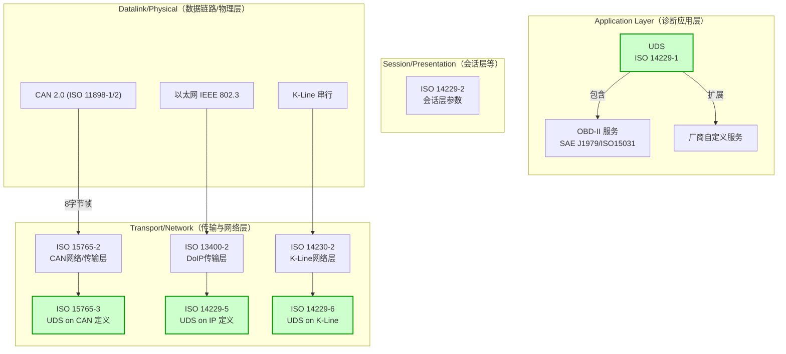
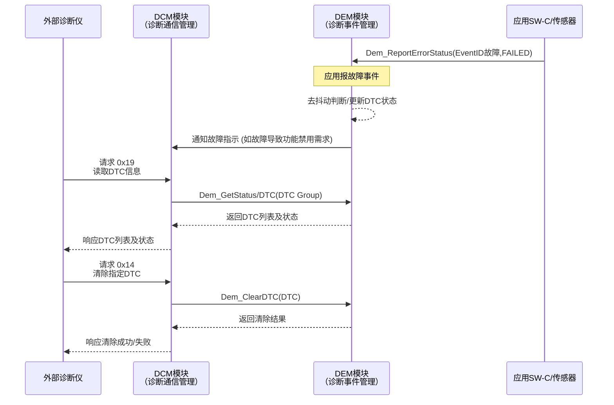
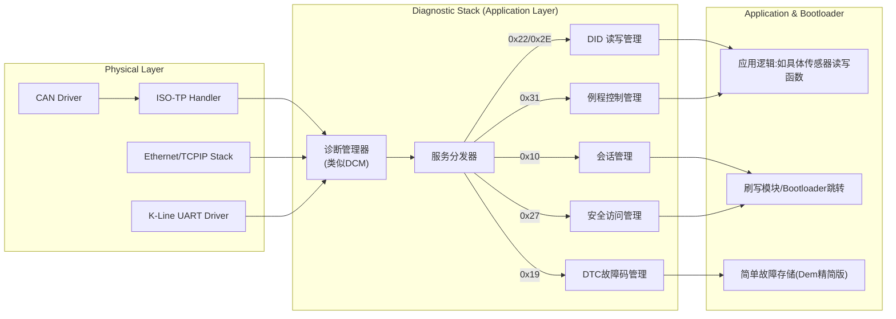
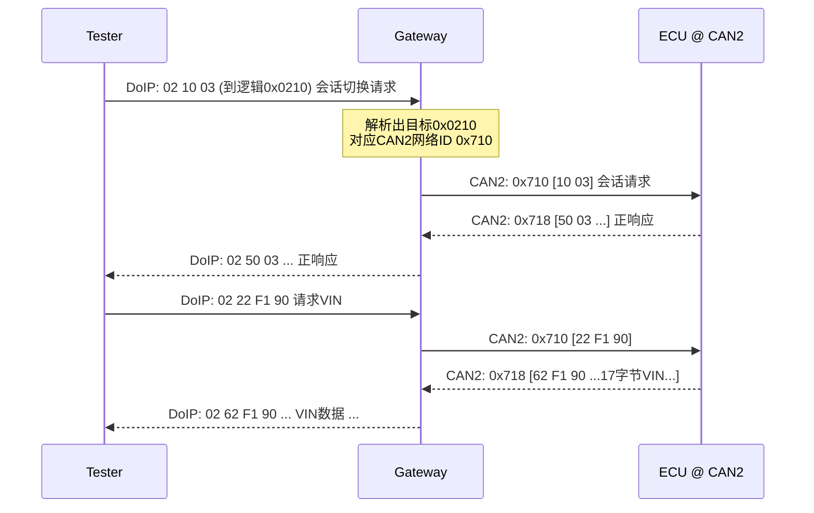

# 汽车诊断模块设计与实现全解析

## 引言

现代汽车电子系统日益复杂，车辆诊断已成为保障汽车安全性和可靠性的重要组成部分。
 
## 标准法规综述

车辆诊断技术的发展离不开一系列行业标准和法规的支撑。本节将详细介绍 **OBD-II**、**EOBD**、**中国 OBD** 以及通用诊断协议 **UDS**（ISO 14229）、相关网络层协议 **ISO 15765**（CAN 总线诊断传输）和 **ISO 13400**（DoIP，以太网诊断）的背景、结构和关键要求。

### OBD-II：车载诊断的起点

**OBD-II**（On-Board Diagnostics II）是美国于1990年代中期建立的强制汽车诊断标准体系。OBD-II 要求轻型汽车自1996年起必须配备统一的车载诊断系统，以监控车辆排放相关部件的工作状态。在物理结构上，它规定了标准化的16针诊断接口（DLC）的形状和引脚定义，以及多种通信协议。OBD-II 的核心在于**排放监控**和**故障码 (DTC) 记录**：当排放控制系统出现异常（如三元催化效率过低），系统会点亮故障指示灯（MIL）并存储故障代码，技术人员通过扫描工具读取这些 **DTC** 即可快速定位问题。

OBD-II 标准实际上是由一系列 SAE 和 ISO 规范组成：例如 SAE J1962 定义了诊断连接器形状，SAE J1979 定义了标准诊断服务（又称 **OBD 模式**，如读取数据流、读取故障码等），ISO 15031系列进一步规范了通信协议和故障码格式等。**通信协议方面**，OBD-II 允许多种底层协议并存，典型包括：

- **ISO 9141-2** 和 **ISO 14230(KWP2000)**：早期常用的串行通讯协议，通信速度低，用于部分欧洲和日系车型。
- **SAE J1850 PWM/VPW**：美国车型曾用的脉冲宽度调制/可变脉宽协议。
- **CAN bus (ISO 15765-4)**：21世纪后主流的诊断通信总线，支持高速率和多 ECUs 共网。

OBD-II 还规定了**统一的故障码格式**。DTC 为五位代码，如 “P0301” 表示一缸失火。其中首位字母表示故障类别（P=动力总成、B=车身、C=底盘、U=网络），后四位为具体故障编号。例如 P0xxx 属于通用故障码，P1xxx 则为厂商自定义码。通过标准化故障码和数据流(PID)接口，不同厂家车辆都能被通用诊断仪器读取，实现维修便利性和监管的一致性。

OBD-II 最初聚焦**排放相关**系统的监测，法规要求车辆若排放超标达到2倍标准即应产生故障码并亮灯提示。这一监管驱动力使得OBD-II成为各国排放法规的基础。然而OBD-II本身并非全球统一标准，美国 EPA 和 CARB 监管下的 OBD-II 偏重美规。随着汽车全球化，不同地区开始在OBD-II基础上发展本地版本，如欧洲的 EOBD 和中国的本土 OBD 规范。

### EOBD：欧洲车载诊断标准

**EOBD**（European OBD）是欧盟自2001年（汽油车）及2004年（柴油车）起强制实施的车载诊断标准，实质上是 **OBD-II 的欧洲版**。EOBD 完善了OBD-II，以满足欧盟更严格的排放法规（Euro III 及以上）要求。两者的主要差异包括：

- **法规适用**：EOBD 遵循欧盟法规（如 98/69/EC 指令），覆盖**所有影响排放**的部件（甚至燃油蒸发控制等）；OBD-II 则针对美国 EPA 规则，侧重发动机和排放系统。
- **触发阈值**：EOBD 对排放超标容忍度更低，例如排放超出标准1.5倍即触发故障码；而OBD-II约为2倍才触发。这意味着EOBD更敏感严格地检测潜在排放故障。
- **通信协议**：EOBD 强制**支持 CAN总线**作为诊断通信（ISO 15765-4），简化为单一协议；OBD-II 则允许多种协议并存（包括CAN、K线等），在OBD-II早期不同品牌通讯协议各异。

功能上，EOBD 与OBD-II核心一致，即**监测排放相关系统**、提供标准诊断服务（读取清除DTC、读取数据流等）以及要求在故障时点亮MIL灯。可以理解为，EOBD 是欧盟立法将OBD-II要求本地化、更严格化的结果。EOBD的实施使欧洲各车型排放故障诊断趋于统一，并为后续**全球统一OBD**（WWH-OBD，ISO 27145）打下基础。

**中国 OBD**：中国的车载诊断规范大体上参考了美国OBD-II和欧洲EOBD要求，结合本国排放法规进行制定。早期中国第三阶段排放标准（相当于Euro III）开始引入 OBD 要求，之后在国家标准GB 18352、《轻型汽车车载诊断系统管理技术规范》等文件中细化。中国OBD通常简称为 **“C-OBD”**，大致遵循EOBD技术框架，但在实施节奏和监测项目上有所调整。例如，中国第五阶段排放标准（相当Euro V）要求新车配备C-OBD，监测项目包括三元催化器、氧传感器、碳罐、电控单元存储器故障等，并规定MIL灯点亮和故障码冻结触发的具体条件。此外，中国生态环境部发布的系列标准（如HJ 437、HJ 438等）也对重型柴油车OBD提出要求，包括远程排放管理中的 OBD 数据上传等。总的来说，中国OBD在技术上与欧美标准接轨，例如采用ISO 15031/SAE J1979服务和DTC格式，但法规层面有独立的强制性国家标准加以约束，需要开发者关注对应的国标编号和具体要求，确保产品符合认证标准。

### UDS（ISO 14229）：统一诊断服务

随着车辆电子范围超越动力系统，面向**全车ECU**的统一诊断协议需求出现。这促成了 **UDS (Unified Diagnostic Services)** 标准的诞生。UDS由ISO 14229系列标准定义，其核心部分ISO 14229-1最初于2006年发布，提供了一套**通用的、面向所有ECU的诊断服务**规范。

UDS最大的特点是**通用性**和**可扩展性**。它不是某个国家法规限定的协议，而是全球通用的汽车诊断应用层协议，被几乎所有OEM及供应商采用。UDS服务统一了不同ECU间的诊断通信，使得整车各种控制器（发动机、变速箱、ABS、安全气囊、车身、电器等）都可以通过统一的会话模式被外部诊断仪访问。相比OBD-II仅关注排放系统，UDS**面向整车所有ECU**，提供丰富的服务覆盖开发、生产、维保各阶段的诊断需求。

UDS 定义了一系列**标准诊断服务**及其请求/响应格式，总服务数在ISO 14229-1中列出了**21种**，常用约15种。这些服务可分为几大类：

- **会话管理与控制类**：如诊断会话控制 (0x10)，ECU 复位 (0x11)，通信控制 (0x28)，测试者存在 (0x3E) 等，负责建立/维持诊断会话以及控制ECU的运行状态。
- **数据传输类**：如读数据标识 (Read Data by Identifier, 0x22)、写数据标识 (0x2E)、清除故障码 (Clear DTCs, 0x14)、读取故障码信息 (0x19) 等，用于访问或管理 ECU 内部的数据和故障信息。
- **功能控制类**：如例行控制 (Routine Control, 0x31) 可触发 ECU 内预定义的例程执行（如自检、自校准），输入输出控制 (Input/Output Control, 0x2F) 可控制执行器或获取传感器即时值等。
- **安全与编程类**：如安全访问 (Security Access, 0x27) 用于解锁受保护的诊断功能，控制DTC设置 (0x85) 可在刷写期间禁止故障记录，刷写相关服务例如请求下载 (Request Download, 0x34)、传输数据 (Transfer Data, 0x36)、传输退出 (Transfer Exit, 0x37) 等共同完成 ECU 重新编程升级的流程。

UDS 仅规范**应用层**诊断服务，不绑定具体物理层。因此它可在多种总线上承载实现，包括CAN、LIN、以太网、FlexRay甚至K-Line。为此，ISO 14229 也有不同子部分对应各网络，例如：

- **ISO 14229-3**：UDS 在 CAN 总线上的实现规范（也称UDSonCAN）。
- **ISO 14229-4**：UDS 在 FlexRay 上的实现。
- **ISO 14229-5**：UDS 在以太网上的实现（通过 ISO 13400 即 DoIP）。
- **ISO 14229-6**：UDS 在 K-Line (ISO 9141/14230) 上的实现。
- **ISO 14229-7**：UDS 在 LIN 总线上的实现。

> **说明**：狭义的UDS常指应用层ISO 14229-1，但实际上UDS协议族包含ISO 14229系列各子标准。因此提到“UDS协议”通常意味着14229完整体系，包括会话层要求 (ISO 14229-2) 和各网络映射部分。比如14229-2规定了诊断会话的一些时序参数（如 ECU 在不同会话的响应超时 P2/P2\* 时间）。

UDS 在整车诊断中的地位类似一个**基础框架**。它为大多数诊断场景提供了标准服务，但并不限制厂商扩展。例如厂商可以基于0x2F/0x31等服务实现私有的特殊功能诊断（Enhanced Diagnostics）。UDS 本身不是法规强制的，但很多OEM将其作为**标准诊断接口**。UDS的统一性也帮助生产线下线测试、售后维修以及车联网远程诊断，因为不再需要针对每个ECU/每家厂商开发不同诊断工具，只需遵循UDS统一协议。

下面图示给出UDS协议在OSI模型及相关标准中的位置和关系：



上图中可以看到，UDS规范定位于OSI模型的应用层，其下需要不同网络层协议来承载。例如在CAN总线上，UDS通过ISO 15765-2定义的**网络层/传输层**服务进行数据分段传输；在以太网上则使用ISO 13400 (DoIP) 的传输机制。总之，UDS提供通用诊断服务规范，各种车辆总线通过各自的网络层标准与之配合，实现端到端诊断通信。

### ISO 15765-2：CAN 总线诊断传输协议

**ISO 15765-2** 常被称为 **ISO-TP (ISO Transport Protocol)**，它规定了在CAN总线上进行**分段传输**诊断数据的网络/传输层协议。由于经典CAN帧的数据区最多只有8字节，而许多诊断报文（尤其UDS服务）可能远大于8字节，例如17字节的VIN码，甚至内存数据下载可达数百KB，因此需要一种机制将长报文切分为多个帧在CAN上发送，再在接收端重组。

ISO 15765-2 正是解决这一问题的标准：它将诊断消息拆分为**单帧 (SF)**、**首帧 (FF)**、**连续帧 (CF)** 以及**流控制帧 (FC)** 四种类型，以完成大于8字节消息的传输控制。基本流程是：当应用层数据超过一帧容量时，发送方先发送一个首帧 (FF)（包含消息总长度和首批数据）；接收方回复流控制帧 (FC) 授权发送（可以指示发送方继续发送多少帧以及流控间隔）；然后发送方依次发送连续帧 (CF) 直至数据发送完毕。对于8字节或更短的数据，则直接用单帧 (SF) 承载。通过这样的协议，ISO-TP 可以在经典CAN总线上传输最长4095字节的诊断消息。

ISO 15765 分为多部分：**ISO 15765-2**定义传输层服务，**ISO 15765-3**定义了在CAN网络上使用UDS应用层的具体要求（又称UDSonCAN），**ISO 15765-4**则与OBD排放诊断相关。ISO 15765与ISO 14229（UDS）的关系非常紧密，事实上UDS在CAN上的实现就是通过ISO 15765协议来完成数据链路传输的。可以说，ISO 15765-2 为UDS在CAN总线上提供了“拼帧和拆帧”支持，两者共同形成**CAN诊断协议栈**的完整实现。开发者在实现UDS on CAN时需要严格遵循ISO-TP规定，例如正确处理帧序号、超时、间隔时间等参数，以确保多帧消息可靠传输。ISO 15765还规定了**功能寻址**帧的特殊ID（0x7DF为功能请求，0x7E8-0x7EF为响应窗口）以支持**OBD广播查询**等场景，这也是OBD-II在CAN上的实现关键点之一。

### ISO 13400：DoIP 以太网诊断

随着车辆网络从 CAN 总线拓展到 **以太网(Ethernet)**，诊断通信也迎来了新的媒介。**ISO 13400** 系列标准定义了 **DoIP (Diagnostic Communication over IP)** 协议，它规定了在车载以太网上如何进行诊断通信。DoIP的意义在于利用高速以太网链路，显著提高诊断通信带宽，并支持远程诊断（例如通过无线网络将车辆数据发送云端）。

ISO 13400 包括多个部分，其中 **ISO 13400-2** 定义了 DoIP 的传输和网络层协议细节。在DoIP模型中，诊断消息依然遵循UDS应用层（14229-5定义了UDS在以太网上的要求），但传输上采用 **TCP/IP**（面向连接的会话，用于传输实际诊断PDUs）和 **UDP/IP**（用于发现和唤醒流程）。每个支持DoIP的节点被称为一个 **DoIP实体**，通常车上至少有一个 **诊断网关 (Gateway ECU)** 支持DoIP，它连接车内以太网与传统总线，将外部诊断仪的IP报文路由到目标ECU。

DoIP引入了**逻辑地址**的概念：每个ECU和诊断仪都有一个 2 字节逻辑地址，用于标识通信目标，类似于CAN的ID或地址。ISO 13400 对逻辑地址进行了分类规划：

- **ECU 逻辑地址**：范围通常为0x0001–0x0DFF和0x1000–0x7FFF，分配给车上各控制器。
- **外部诊断仪地址**：范围0x0E00–0x0FFF，外部测试设备使用。
- 预留的特殊地址块用于内部用途或特定设备，例如0x0D00段用于OEM内部/OBD设备，0x0E00段为授权诊断设备，当使用这些特殊地址时，车上其他通信可能受控暂停等。这一机制保证了高优先级诊断的独占性和安全性。

DoIP 的通信流程一般如下：诊断仪通过链路层发现车辆（Vehicle Announcement报文），然后发送 **路由激活请求**（包含自身逻辑地址和期望激活的目标地址）。车辆的DoIP网关收到请求后，验证身份和权限，然后建立逻辑通道，将该诊断仪的会话与指定ECU关联，之后所有诊断数据就通过这个TCP逻辑连接在诊断仪和目标ECU间传输。一条TCP连接上可以复用多组逻辑地址对，从而支持同时和多个ECU通信，但通常诊断仪按顺序与各ECU分别建立DoIP会话。

DoIP 的优势在于**带宽高**（百兆/千兆以太网 vs CAN的1Mbps）、**可支持长距离**（远程诊断）以及利用IP生态（例如可通过标准网络基础设施进行车辆诊断）。ISO 13400规定了一些超时策略，如 **初始不活动计时器**（约2秒）和 **常规不活动计时器**（约5分钟），确保万一诊断仪断开或无响应时，车载端能关闭闲置连接。对于安全，DoIP也定义了可选的认证和Alive检查过程，来防范未授权访问。

总体而言，DoIP拓展了UDS在以太网上的应用，使诊断通信从传统总线走向IP化。未来随着汽车E/E架构以太网主干的普及，DoIP将成为乘用车诊断的主流方式之一。开发人员需要掌握DoIP的协议细节，如车辆发现、路由激活、逻辑地址映射以及与网关的配合工作，以确保诊断功能在以太网环境下可靠运行。

## AUTOSAR 诊断模块设计与配置

AUTOSAR Classic 平台作为汽车电子软件架构的标准，实现了标准化的诊断模块组件。在AUTOSAR中，诊断功能主要由 **Dcm**、**Dem**、**FiM** 等基础软件模块协同提供。此外 **BswM** 等模块也与诊断有密切交互。理解这些模块的角色和相互关系，并正确配置参数，是构建符合AUTOSAR规范的诊断系统的关键。

本节将深入剖析 AUTOSAR 诊断相关模块的作用、配置要点和Vector DaVinci工具中的典型配置流程，以及在工程实践中需要注意的事项。

### DCM：诊断通信管理器

**DCM (Diagnostic Communication Manager)** 是 AUTOSAR 基本软件中提供诊断通信服务的模块。它位于服务层的通信服务部分，负责处理来自外部诊断工具的所有诊断请求，并根据需要将请求分发或执行相应操作。DCM 的主要职责可以概括为：

- **确保诊断数据流的管理**：DCM 模块保证诊断通信数据按照协议正确收发，包括处理帧的流控、顺序和完整性。在CAN总线上，DCM 通过与下层 PduR 和 CanTp 模块交互，实现对 ISO-TP 分段传输的管理；在以太网DoIP上则经SoAd/TCPIP模块传输。因此DCM是网络无关的，上层看它提供统一的诊断服务接口，下层通过 PduR 适配到具体网络。

- **诊断会话和安全状态管理**：DCM 维护 ECU 当前的诊断会话状态（如默认会话、扩展会话、编程会话）以及安全访问解锁状态。它根据当前会话/安全级别决定哪些服务可用。例如某些敏感服务（如刷写、标定）要求在编程会话且安全解锁后才执行，否则DCM应返回拒绝（Negative Response 0x7F，条件不满足）。DCM 会检查每个请求是否**被支持**以及**在当前状态下是否允许执行**。这一机制确保ECU在不恰当的会话或未授权时，不执行高权限操作，提高诊断通信安全性和可靠性。

- **请求解析与分发**：外部诊断仪发送的UDS或OBD请求首先由DCM接收并初步解析。对于绝大多数标准服务，DCM 内部就能直接处理或形成响应。例如**会话切换(0x10)**、**ECU复位(0x11)**、**读取DTC(0x19)** 等，DCM会调用相应模块接口或自身功能生成响应。而对于需要应用层配合的请求（如**读写数据(0x22/0x2E)**、**例行控制(0x31)** 等），DCM 则将请求路由到上层 SW-C 或 OS 提供的服务例程，通过 RTE 调用应用函数执行，再收集结果回复给诊断仪。因此，DCM 扮演了**诊断路由器**的角色：它是诊断请求进入ECU的统一入口，根据服务ID决定处理路径。

- **无效请求和错误处理**：DCM 对收到的诊断请求进行合法性检查，包括校验服务ID是否支持、消息格式是否正确、当前会话/security是否允许等。如果请求不被支持或条件不符，DCM生成对应的否定响应 (Negative Response) 如0x7F+服务ID+拒绝原因。例如非法的服务ID返回0x11(SubFunction Not Supported)或0x12(Service Not Supported)，条件不满足则0x22(Conditions Not Correct)等。DCM 屏蔽了底层差异，统一处理错误情况，保证 ECU 对外呈现符合协议规范的行为。

简而言之，DCM 是整个诊断协议栈的大管家。所有外部诊断通信经由 DCM 模块统一调度，不论底层是CAN、以太网还是LIN。它维护诊断**会话生命周期**（如从Default切换到Extended，再切回），维护**安全访问解锁**状态，仲裁**服务请求**并与其他模块配合完成服务。

DCM 与 **PduR/ComM** 等通信管理模块，以及**Dem**、**EcuM**、**BswM** 等紧密相关。例如，当DCM收到 **通信控制(0x28)** 服务请求要禁用某通道通信时，它需要通过调用 BswM 提出模式请求来实现通信关闭；当DCM处理 **ECU Reset(0x11)** 请求时，可能通过 BswM/EcuM 协助完成真正的复位动作。这些交互后文会详细讨论。

### DEM：诊断事件管理器

**DEM (Diagnostic Event Manager)** 是 AUTOSAR 中专门用于**故障管理**的基础软件模块。它管理 ECU 内部的**诊断事件**（Diagnostic Event）及相关数据（如 DTC，冻结帧，扩展数据），是实现OBD和UDS故障诊断功能的核心模块之一。

DEM 的主要功能与职责包括：

- **事件监控与DTC状态**：DEM 接收来自应用 SW-C 或其他 BSW 模块的故障信息上报（Event Reports）。每一个可监控的故障点在配置中定义为一个 **Event**（事件ID）。应用软件检测到某个条件满足（如传感器信号超出范围）即可调用 Dem_ReportErrorStatus(EventID, 状态) 通知DEM。DEM 根据去抖动策略判断是否真的发生故障，并据此设置对应的 **DTC**（Diagnostic Trouble Code）状态位。DEM 内部维护每个事件/DTC的状态字节（8位，包含TestFailed、TestFailedThisCycle、Pending、Confirmed等标志）来记录该故障是否当前存在、是否已确认、是否历史出现过等。这些状态位符合ISO 14229对DTC Status Mask的规范。

- **DTC 分配与存储**：每个诊断事件可以映射到一个具体的 **DTC编码**（通常3字节），DEM负责在NvM（NVRAM Manager）支持下将发生过的DTC及其相关数据存储到非易失内存（如EEPROM或闪存）中。DEM配置中定义了若干 **DTC组**，包括 DTC 的类型（比如ISO定义的排放相关DTC或非排放DTC）、严重等级、存储优先级等。当事件第一次触发且去抖通过，DEM会将对应DTC标记为**Confirmed**并存储；当故障消失后，DEM可根据策略决定何时清除或转为历史记录。通过DEM，ECU可以可靠地记录故障发生情况，即使断电也不丢失，为后续诊断提供依据。

- **故障快照和扩展数据**：DEM 可以为每次故障发生收集**冻结帧 (Freeze Frame)** 和**扩展数据**。冻结帧是捕获故障发生时的一组关键数据（如发动机转速、节气门开度、车速等），扩展数据可以是累计出现次数、运行时间计数等。这些数据通过配置 Did 列表实现。DEM在事件确认时自动保存预先设定的DID数据到冻结帧缓冲，以便在读取DTC信息 (UDS服务0x19) 时提供。例如对于排放相关故障，OBD法规要求提供至少一帧环境数据 (如故障发生时发动机负荷、冷却液温度等)。DEM模块满足这些要求，支持配置多帧冻结帧、多个扩展数据记录。

- **与DCM和FiM的接口**：DEM 向上提供API供 DCM 调用以读取或清除DTC。比如 DCM 在处理**读取DTC信息(0x19)**请求时，会调用 Dem_GetDTCOfOBD 或 Dem_GetStatusMask 等接口获取当前DTC列表及状态。清除DTC(0x14)请求则调用 Dem_ClearDTC 实现。可以说，DCM+DEM 的配合提供了UDS/OBD故障码管理的全部功能：DCM处理通信和协议格式，DEM提供数据内容支撑。当DCM需要获取某DTC的状态或快照数据，DEM 立即返回存储值。另外，DEM 也会将重要故障状态通知**FiM** 模块以实现功能抑制（后述）。

- **OBD 环境支持**：对于法规OBD要求，DEM 模块直接参与。例如它维护 **MIL指示灯** 状态：当排放相关故障确认时，通过配置DEM可设定某个 DTC 的发生自动触发 MIL 打开。DEM 还跟踪OBD计数器如距离上次清除行驶距离，Warm-Up循环计数等（这些通常在OBD应用中由OEM实现，DEM提供事件接口）。总之，通过正确配置，DEM 可以满足法规对于故障记录和指示的要求。

综上，DEM 模块以 **DTC 为核心** 构建了 ECU 的故障存储与管理体系。它将繁杂的故障记录逻辑标准化，使上层应用和外部诊断无需关心底层存储，只需通过DEM API报错和查询即可。AUTOSAR 将 Dem 视为诊断服务的一部分，与 Dcm 并称“诊断双雄”：Dcm 主攻通信服务，Dem 主攻故障服务。两者协作完整实现了车辆诊断功能：DCM对外通信，Dem对内记录。下图为 DCM 与 DEM 在诊断体系中的关系示意：



*图：DCM与DEM配合处理故障诊断服务的示例流程。其中应用SW-C通过Dem报告故障事件，DEM更新DTC状态。外部诊断仪请求读取/清除DTC时，DCM查询DEM获取数据或执行清除，然后返回给测试仪。*

通过以上流程可以看出，DEM 管理着 ECU 内部故障，而 DCM 则向外提供访问接口。**Dem的配置复杂度在AUTOSAR中是最高的**之一，需要工程师细致设置每个Event的属性、DTC映射、存储方案。常见配置要点包括：

- DTC 编码与种类：按照ISO或OEM规范，将Event分配3字节或2字节DTC编码，并标注哪些是排放相关（影响OBD）、哪些会亮MIL等。
- Debounce（去抖动）策略：配置每个Event的去抖方法，如计时型（故障状态保持一定时间）、计数型（一定次数）、瞬时型等。合理的去抖动可避免偶发波动导致误码。
- 存储循环与触发：设定每个Event在哪些情况下捕获冻结帧、更新老化计数等。特别是对排放故障，需保证第一次出现即存储相应OBD要求的数据。
- MIL策略：将需要亮故障灯的DTC映射到 MIL 指示灯，使DEM在DTC Confirmed后设置 MIL 请求（FiM或EcuM负责点亮灯）。
- NVM 存储分区：规划DTC存储占用的NVM块大小，确保有足够空间记录所需数量的故障（尤其要考虑“已记录DTC数量上限”）。
- Clear 限制：某些严重故障可能不允许常规清除，需要特殊处理（FiM可禁止清除）。

这些参数在 Vector DaVinci Configurator 等工具中都有对应配置界面，下文将结合工具对配置流程进行说明。

### FiM：功能抑制管理器

**FiM (Function Inhibition Manager)**，即**功能禁止管理模块**，是AUTOSAR诊断架构中用于实现**故障触发的功能降级/禁用**的组件。当车辆某些故障发生时，可能需要关闭或限制相关功能以保证安全（例如ABS故障时关闭巡航控制）。FiM 模块的作用就是根据 Dem 上报的事件状态，**动态控制软件功能的可用性**。

FiM 的工作机制如下：

- **功能标识 FID**：FiM 配置中定义了一系列 **Function Identifier (FID)**，每个FID代表一项可控的功能或服务（可以对应SW-C中的一个功能，比如某控制策略）。应用软件在调用某功能前，可以先查询 FiM 来获取该功能是否允许执行（FiM_GetFunctionPermission(FID)）。FiM 内部维护每个 FID 的 **许可状态**（Allowed/Not allowed）。

- **事件到功能的映射**：FiM 模块将 Dem 的 **事件状态** 与 **功能FID** 相关联。具体来说，配置项里设定：当某个 Event（故障事件）处于特定状态（如TestFailed或Confirmed）时，禁用对应的一个或多个 FID。例如配置“如果 EventID_EngineOverheat = FAILED，则禁用 FID_CruiseControl”表示当发动机过热故障产生，FiM将巡航控制功能标记为不允许。这种映射可以很灵活，一对多或多对一均可，根据系统安全需求而定。

- **运行时协调**：Dem 每当某事件状态改变时，会调用 FiM 通知对应 Event 的新状态。FiM 收到通知后，将查找配置中受该Event影响的 FID，将其状态置为 “禁止” 或 “允许”。应用层或其他BSW通过 FiM_GetFunctionPermission(FID) 随时可以获取最新状态。例如，某功能 SW-C 周期性运行前调用FiM查询其 FID，如果返回NOT_ALLOWED则跳过本周期执行，以此达到故障抑制效果。

- **简单逻辑决策**：FiM 本质上很简单，只做**条件判断**和**标志设置**。类似模式管理，但针对的是故障条件。FiM可视为一个全局表，将Event状态映射到Function的“允许/禁止”标志位。由于仅处理布尔逻辑，FiM 运行时开销很低，对实时性几乎无影响。复杂决策通常应该放在SW-C内，FiM只是提供基础的开关量判断。

FiM 的典型应用如：“变速箱出现故障，禁止启用运动模式”、“电池温度过高，限制快速充电功能”、“传感器失灵，关闭对应的自动控制”等等。通过FiM集中管理，系统对故障引发的功能降级有了统一配置处，方便维护和修改策略。

**配置要点**：

- 定义FID列表：列出所有需要控制的功能，给予唯一ID。需要与SW-C或BSW侧调用对应。
- 配置抑制规则：为每个相关的Event定义当其状态=Failed或Confirmed时影响哪些FID，设置为Inhibited (禁止)。
- 初始状态：FiM对每个FID可设定开机初始是否允许（通常默认为允许True，除非有特殊需求禁用某功能直到某事件报告通过）。
- 刷新频率：FiM作为BSW服务，可在MainFunction中定期处理延迟模式请求，但由于Event通知多为直接函数调用（Immediate）方式，FiM更新几乎是实时的。

总的来说，FiM极大简化了应用层处理故障的逻辑。应用模块不必各自检查故障标志，只需查询FiM即可得知当前是否可以运行某功能。这符合AUTOSAR **关注点分离**思想：DEM集中管故障，FiM集中管功能可用性，SW-C专注业务实现。

例如，在Vector工具配置FiM时，会有 “Function Inhibition Matrix” 矩阵，工程师可以勾选某事件发生时要禁用的功能ID，非常直观。需要注意避免配置冲突或循环（如EventA禁用功能X，但功能X禁用导致EventA本身状态改变等，这些情况要在设计上避免）。

### BswM：基础软件模式管理器

**BswM (Basic Software Mode Manager)** 是AUTOSAR系统服务层的模式管理模块，用于协调各基础软件模块和应用之间的**模式切换**和**动作执行**。虽然BswM并非专门的诊断模块，但它在诊断场景中扮演重要角色：它响应 DCM 和其他模块发出的模式请求，执行相应动作来改变ECU状态，例如网络通信模式、ECU运行模式等，从而配合诊断需求。

在诊断相关的应用中，BswM 主要涉及：

- **通信模式控制**：UDS服务0x28 “通信控制 (Communication Control)”允许测试仪要求ECU关闭或开启某些网络通信（如禁止发送非诊断报文，安静总线）。当DCM接收到0x28请求时，它并不直接停止通信，而是通过调用 BswM 提出“禁止正常通信”的模式请求。BswM 根据配置有一条规则，例如：“若DCM请求 DisableNormalCommunication on CAN0，则执行ActionList：关闭ComM对应通道通信”。于是BswM会调用 ComM_DCM_ActivateComMode 等接口将该通道转为只诊断通信模式。完成后，DCM再给测试仪响应成功。这一流程由BswM在背后完成仲裁和执行。若同时多个模块请求模式变化，BswM负责仲裁优先级。

- **ECU复位协调**：当DCM处理 UDS的 ECU Reset(0x11) 请求，特别是 “EnableRapidPowerShutdown” 或 “Reset to bootloader” 之类的子功能时，需要ECU执行真正重启。AUTOSAR中真正控制复位的是 EcuM 模块，但DCM无法直接调用EcuM进行立即复位（因为需要按照安全下电流程）。典型方案是：DCM通过 RTE 提供的接口或 Mode Switch 机制告诉 BswM 某“DCM复位模式”已请求。BswM 配置了对应规则检测到 DcmEcuReset 模式切换为 e.g. “HARD RESET”，则触发 ActionList 调用 EcuM_RequestRESET 或 EcuM_SetMode 之类服务执行系统复位。这样，复位动作在BswM中配置完成，确保在适当的点执行且按序（例如先保存NvM数据再重启）。BswM不仅响应DCM，像WdgM的复位指令、SHUTDOWN、COMM模式等，也通过统一规则机制处理。

- **诊断会话指示**：当DCM切换诊断会话（Session，例如进入编程会话）时，也可以通知BswM当前会话模式改变。BswM可以配置规则，如“若进入编程会话，禁止进入休眠、切换LED提示等”。这样整车在特殊会话下采取不同模式行为。例如可以防止ECU在编程期间被休眠管理关闭电源。AUTOSAR规定 DCM 可通过 Mode Notification 通知会话状态给 BswM，工程配置时需要将 DCM 的 mode port 连接到 BswM 的接受端口。

简单来说，**BswM是各模块间的“中央决策者”**。它收集 **Mode Request（模式请求）** 和 **Mode Indication（模式指示）**作为输入，通过预配置的**规则(Rules)**进行判断（Mode Arbitration），然后执行相应**动作列表(Action Lists)** 来调用其他模块服务改变状态。在诊断方面，DCM就是一个典型的 Mode Request 源。DCM可能请求禁止通讯模式、请求特定复位模式等。BswM将其与来自EcuM、ComM等的请求综合仲裁。例如，当车辆断电关ACC进入休眠，而此时测试仪正通过DoIP请求ECU维持唤醒，则ComM和DCM的请求冲突需仲裁。BswM根据设定优先级（通常诊断优先保证）来决定最终动作。

**配置方面**，BswM较灵活复杂，工程师需要定义：

- **Mode Request Ports**：声明哪些模块会发送请求（如DCM的CommControlRequest, EcuM的ShutdownPrep等）。
- **Mode Indication Ports**：声明接收哪些指示（如ComM当前网络模式指示，WdgM Alive指示等）。
- **Rules**：核心配置，每条Rule由条件表达式组成（可包含多个Mode值判断），结果True/False对应触发不同ActionList。
- **ActionList**：一系列具体操作，可以是调用某BSW API、触发RTE切换、或者触发另一个ActionList等。ActionList 通过配置调用例如ComM_LimitChannelToNoCom()，EcuM_GoToSleep()，Det_ReportError()等操作。

在Vector Davinci中，配置BswM涉及在 ECUC 编辑器里添加 BswM模块，创建模式请求&指示源，配置规则-动作对。例如，为支持DCM通信控制，需要：在DCM配置里启用ComM 控制，BswM里增加DCM_ComMIndication端口，设置Rules如 “DCM请求禁用通迅 if TRUE -> ActionList call ComM_LimitToNoCom (channelX)”。

需要注意BswM配置不当可能导致模式切换紊乱。例如忘记Reset规则的False情况处理，会导致复位后逻辑残留。务必完整设计每个规则的True/False动作。

### Vector DaVinci 配置流程与关键点

在实际项目中，常使用 Vector 的 DaVinci Configurator (或类似工具，如 Elektrobit Tresos) 来配置上述AUTOSAR模块。以下结合 Vector 工具，说明一个典型 ECU 诊断模块的配置流程和关键参数：

**1. 基本软件模块使能**：首先在项目中启用 DCM、DEM、FiM、BswM 等模块。确保在 ECU 配置（ECUC）里，这些模块处于激活状态，并正确配置所属层和依赖（如Dem 依赖 NvM 等）。

**2. 配置 DEM**：

- **事件与DTC列表**：在 Dem 配置下，列出所有 Diagnostic Event。例如为每个重要传感器信号超限、执行器故障、内部错误定义 Event IDs。给每个Event指定一个DTC码（如0xABC123）。设置 DTC的属性：Kind（排放相关/非排放）、Severity（严重等级）、Debounce策略等。
- **Debounce (去抖)**：典型地为每个事件选择一种Debounce算法并配置参数。如使用 “时间型去抖 (TimeBased)” 则设定时间阈值ms；计数型则设定计数上/下阈值等。这样Dem在收到报告时按此规则判定故障成立条件。
- **存储管理**：分配 Dem 内部的 Memory Entry，决定多少事件有NV存储，多少冻结帧缓冲。配置 NvM Block 关联，以便 Dem_WriteData/ReadData。
- **Mil/DTC分组**：定义 MIL 指示Lamp，映射哪些DTC会触发 MIL。当这些DTC为Confirmed且满足触发条件，则Dem点亮MIL。当DTC清除或满足熄灭条件则关闭MIL。
- **环境数据**：配置 Freeze Frame DID 列表，选择每个Event发生时记录哪些数据。如引擎转速、节气门位置DID、环境温度DID等，并设定各自的存储条件（首次Failed时/每次Failed时记录等）。配置 Extended Data如故障出现次数计数器，每次失败Dem自动+1存储。
- **清除策略**：决定在 Dem_ClearDTC 调用时，除清除NV存储和内存数据外，是否重置某些计数等。一些OEM要求，只有当故障不再现+一定循环无故障后才能自行老化清除，此种逻辑可部分由Dem老化计数实现（Dem配置老化计数阈值）。

**3. 配置 DCM**：

- **PDU ID & 地址**：设置 DCM 在各总线上的物理和功能寻址参数。例如，对于CAN，指定本ECU诊断请求ID和响应ID（如0x7E0请求/0x7E8响应），以及Functional Request ID (通常0x7DF)。对于DoIP，设定本ECU的DoIP逻辑地址（如0x1234）和所属网关（通常由SoAd配置）。
- **会话 (Session)**：定义支持的诊断会话列表，如 Default(0x01)、Extended(0x03)、Programming(0x02) 等。为每个会话配置参数：P2ServerMax、P2*Server（扩展等待时间）、S3Server（会话超时）。如编程会话常设置较长S3超时以防刷写中断。
- **安全级别 (Security)**：定义 Security Access 的等级，如 Level1、Level2 等，对应0x27服务的种子/钥匙流程。配置每级别的参数：所需解锁次数、错误次数后锁定时间、种子长度、密钥算法接口（通常通过一个Callout函数计算密钥）。还可设置 BootTime中解锁延迟等。
- **服务支持开关**：勾选启用需要的UDS服务。例如若ECU需要支持0x10、0x11、0x14、0x19、0x22、0x2E、0x27、0x28、0x31、0x3E等，就在DCM配置的服务列表中启用，并指定子功能详情。未启用的服务，DCM将对其请求统一返回 0x11 服务不支持否定响应。
- **服务处理配置**：对于每个启用的服务，需配置处理方式：由DCM内部处理还是由应用处理，或者由其他模块处理：
  - **DCM内部**：如0x10会话控制、0x11 ECU Reset、0x3E TesterPresent 这些，DCM可自行完成，不用上报应用。配置时将其 Routing 设置为 “Handled by DCM”。
  - **外部处理**：如0x22、0x2E（读写数据）、0x31（例行）、0x2F（IO控制）等涉及应用变量的服务，需要通过 RTE 调用应用SW-C服务。配置中需为这些服务建立 Dcm<->Rte 的 **Service Interfaces**。比如为0x22读数据定义一个Rte函数 `ReadDataByIdentifier(uint16 Did, uint8* buffer)`, DCM会在收到请求时调用它并传入DID。Vector Davinci通常通过导入CDD/ODX文件自动生成这些接口和Did列表。
  - **DEM接口**：如0x14 清除DTC、0x19 读取DTC信息，DCM的实现需要调用Dem。因此配置中将其绑定DEM模块。Davinci里，DCM有Dem配置部分，映射 Dem提供的 “GetDTCStatus” “ClearDTC” 接口。
  - **COMM接口**：如0x28通信控制，需要经BswM与ComM实现。配置里会使能 Dcm_ComMCCSupport，并关联到具体ComM通道。这样DCM调用ComM限制通信API或通过BswM模式请求禁用通信。
  - **特殊服务**：如0x85控制DTC设置，一般在刷写过程中需要临时禁止DEM记录故障，DCM实现该服务时可以调用Dem_SetDTCRecordingOff()之类的接口（需要Dem支持）。
- **OBD 模式**：DCM也可配置支持 OBD-II 服务（SAE J1979 “Mode01~0A”）。Vector工具中，DCM配置项下可以启用OBD，并配置监测的PID支持情况、OBD服务映射到Dem数据等。如果需要支持通用OBD扫描仪，则必须正确设置这些内容（如PID 0x0C引擎转速、0x0D车速等如何获取）。通常通过导入CANdela或ODX文件完成映射。

- **时间参数**：设定 DCM 请求响应超时时间及重试机制。例如是否启用NRC 0x78（Response Pending）定时发送的机制、定时的Task时间片等。在Davinci里，一般遵循标准默认值即可：P2=50ms，P2*=5000ms等（具体数值依ISO 14229-2建议设置）。

- **缓冲区**：配置DCM内部的缓冲区大小以容纳最大单帧和多帧消息。若ECU需要支持大块数据传输(如刷写)，应确保DCM的缓冲>=4095字节，且CanTp的FRAMESIZE配置匹配。

**4. 配置 FiM**：

- **Function ID 列表**：在FiM模块下，列举出所有应用会用到的FID。例如 FID_CruiseControl、FID_SportMode、FID_FanOverride 等，每个给定一个数值ID。
- **Event到FID的映射**：配置若干 FiM Inhibition条件。可以按事件来配置：“If Event X status = FAILED, then inhibit FID A 和 FID B”。也可按FID配置：“FID Y is inhibited by Event M or Event N”。工具通常提供矩阵界面打钩选择。
- **默认状态**：FiM的Function默认Enable或Disable。一般都Enable，除非功能需要故障自检通过后才解锁的可以初始Disable然后在某Event报告Passed时用FiM允许。
- **接口映射**：若应用SW-C需要调用FiM_GetFunctionPermission，需在RTE里提供FiM的ClientServer接口或者Include FiM的header直接用函数。当然AUTOSAR配置还需将FiM模块生成的头文件供RTE/应用引用（Davinci自动处理）。

**5. 配置 BswM**：

- **启用子功能**：在BswM模块中，启用需要用的子配置集，如 BswMComM、BswMDcm、BswMEcuM、BswMNvM 等。比如诊断相关主要有BswMDcm，用于处理DCM请求；BswMComM用于通信模式；BswMEcuM用于启动/关闭等。
- **Mode Request Source**：定义 DcmModeRequest (DCM 请求接口)。Davinci里会出现选项比如 “Mode Requestors: DCM_ComModeRequest / DCM_ResetMode / DCM_CommunicationMode”，选择需要支持的。如果希望DCM的ComM通信控制通过BswM仲裁，就启用 DCM_CommunicationModeRequest端口。
- **Rules**：创建规则，例如：
  - 规则1：当 **DCM.CommunicationRequested=DisableNormal** (DCM请求禁用普通通信) 且 通信通道=CAN0 时 -> 执行动作 切换 ComM 通道0 到 No_Com 模式。
  - 规则2：当 **DCM.EcuResetMode = HARD_RESET** 时 -> 执行动作 调用 EcuM_RequestShutdown(RESTART)。
  每条规则设置一个唯一ID，编写表达式判断Mode条件，关联对应ActionList。
- **ActionList**：实现具体操作。比如 ActionList “Disable_CAN0_NormalCom” 包含一条操作调用 ComM_LimitChannelToNoCom(CAN0, DCM)。ActionList “Do_HardReset” 则调用 EcuM_TriggerReset(HARD) 或 EcuM_KillAllRUNables后SoftwareReset。
- **Mode Indication**：如果DCM会话切换也通知BswM，则在BswM配置 DcmDiagnosticSessionIndication 端口，对不同Session值写规则。常见用法如：“若进入Programming Session，则禁止ECU休眠”，可以在BswM里当Session=Programming触发ComMPreventSleep。

配置BswM很容易出错在表达式和操作顺序上。Vector工具提供测试功能可以模拟模式变化看规则是否触发，以验证配置正确。

**6. 生成配置代码 & 集成**：完成上述配置后，进行代码生成。DaVinci会输出 Dcm_Cfg.h/c, Dem_Cfg.h/c, FiM_Cfg.h, BswM_Cfg.h 等文件，以及 RTE接口代码（如诊断服务的Rte callback 声明）。集成时要：
- 在SW-C实现诊断服务函数（如某Did读函数）。
- 在ECU初始化时调用 Dem_Init, Dcm_Init, FiM_Init, BswM_Init 等，确保模块正确启动。
- 配置任务调度：Dcm_MainFunction周期调用（通常10ms）、BswM_MainFunction、Dem_MainFunction 等需要在Os任务里调度。

**工程注意事项**：AUTOSAR诊断模块配置复杂，以下是常见注意点：

- **Dem/Diagnostics内存分区**：确保NvM块足够且掉电前Dem_NvMWriteAll被调用，否则故障记录可能丢失。
- **多核心ECU**：若诊断在某特定核上处理，要保证跨核通信或将DCM设为核心主导模块等。
- **Timings**：调整P2、P2*时间时，要考虑总线时延和ECU执行能力，否则测试仪可能误判断超时。
- **安全**：配置Security Access时不要使用默认种子/钥匙算法，实际项目中应更换为OEM提供的安全算法，并正确设置尝试次数限制，避免暴力破解。
- **OBD/UDS兼容**：OBD服务0x03读取DTC、0x04清除DTC与UDS服务0x19/0x14都有类似功能。DCM配置要注意二者互动：通常0x03/0x04也是调用Dem，与0x19/0x14共用DTC数据，只是格式不同。验证OBD扫描仪能正确读码清码。
- **整车一致性**：若多个ECU都有诊断功能，地址和服务实现要避免冲突。典型做法：所有ECU Dem配置使用统一标准（故障等级、OBD占位等），DCM配置保持一致的服务子功能行为，这样在整车测试时，不同ECU响应风格一致。

通过以上配置，AUTOSAR架构下ECU的诊断能力就构建完成了。下节将讨论如果不采用AUTOSAR，而是自研一个轻量诊断协议栈，需要考虑哪些设计。

## 自研轻量诊断协议栈实现

在一些资源受限或特殊需求场合，可能需要在无AUTOSAR的环境下**自研**一套精简的诊断协议栈。本节以 NXP S32G 处理器为例（它常用于车载网关，也可作为微控制器运行自定义诊断），介绍如何从零开始设计实现一个支持 UDS 服务的诊断模块。重点关注服务解析、DID/例程驱动设计、安全访问、Response Pending 以及刷写流程等关键技术点。

### 协议栈架构概述

首先要确定协议栈的整体架构。一个典型的轻量诊断栈可以划分为如下层次：

- **物理接口层**：负责接收和发送底层总线帧。例如在CAN上，可由CAN驱动ISR接收数据帧，在UART/K-Line上由串口中断接收字节，在以太网则由TCP/UDP套接字接收数据。物理层应能将完整的诊断PDU上传给上层（对于CAN需结合传输层）。
- **传输层 (Transport Layer)**：实现多帧消息的重组与分段发送。比如CAN需要实现 ISO-TP 协议，将首帧/连续帧组装成完整消息。以太网上若使用TCP则由TCP协议栈保证顺序完整，可直接把数据流转交应用层。如果自行实现UDP-based的DoIP，需要在此层处理DoIP的封装和拆包。
- **诊断应用层**：核心部分，负责**解析诊断请求**并生成相应响应。这一层可以视为**自研的DCM**：它要解析服务ID、分派服务处理函数、跟踪会话和安全状态，并调用底层或应用逻辑来完成具体服务操作。

下面展示一个自研诊断协议栈的模块分层：



*图：自研诊断协议栈架构示意。左侧物理/传输层将消息交给诊断管理器，后者解析服务ID并调度给相应处理模块 (Session, Security, DID等)，这些模块再调用具体应用逻辑或Bootloader功能完成服务。*

从上图可见，自研栈中**诊断管理器 (DiagManager)** 类似简化的DCM，主要功能包括：维护当前诊断会话状态、监控安全访问解锁状态、处理请求队列和超时、以及统一发送响应。其内部通过**服务分发器**将不同服务ID路由到对应的处理函数模块（可以使用**表驱动**实现，见下节）。处理模块则负责具体服务逻辑，例如读取某个数据的值、执行某项例程、进行安全验证等。应用逻辑模块提供底层数据和操作接口，例如返回传感器当前值、执行复位跳转等供诊断服务调用。

轻量诊断协议栈通常运行在**主循环**或**独立任务**中。一般模式是在主循环中检查是否收到新诊断请求（由物理层驱动在缓冲区），如果有则调用处理函数，产生响应后通过发送函数发出。为了防止阻塞，可以设计为一个**简单状态机**：例如Idle状态等待请求，Processing状态处理复杂服务（可分步），Pending状态等待内部操作完成等等。

### 服务解析与表驱动设计

高效地解析诊断服务并调用相应处理函数，是诊断栈实现的核心之一。一般来说，可以采用**“查表驱动 (Lookup Table Driven)”** 的设计思想：为所有支持的服务建立一个**服务处理表**，根据收到的服务ID快速查找对应的处理函数指针和配置信息。

例如，可以定义如下C结构体：

```c
typedef Std_ReturnType (*ServiceHandler)(const RequestMsgType* req, ResponseMsgType* res);

typedef struct {
    uint8  serviceId;
    uint8  subfuncMask;    // 子功能掩码，如是否要求SubFunction处理
    bool   suppressable;   // 是否支持抑制正响应位（bit7=1情况）
    ServiceHandler handler; // 服务处理函数
    uint8  sessionMask;    // 哪些会话下允许此服务(位掩码)
    uint8  securityLevel;  // 要求的安全级别 (0=无要求)
} ServiceEntry;
```

然后定义一个静态的服务表，例如：

```c
const ServiceEntry gServiceTable[] = {
    { 0x10, 0xFF, false, Service_DiagnosticSessionControl, SES_ALL, SEC_LVL0 },
    { 0x11, 0xFF, false, Service_EcuReset, SES_DEFAULT|SES_EXTENDED|SES_PROGRAM, SEC_LVL0 },
    { 0x27, 0xFF, false, Service_SecurityAccess, SES_ALL, SEC_LVL0 },
    { 0x22, 0xFF, false, Service_ReadDataByID, SES_ALL, SEC_LVL0 },
    { 0x2E, 0xFF, false, Service_WriteDataByID, SES_EXTENDED|SES_PROGRAM, SEC_LVL1 }, 
    { 0x31, 0xFF, false, Service_RoutineControl, SES_EXTENDED|SES_PROGRAM, SEC_LVL1 },
    { 0x19, 0xFF, false, Service_ReadDTCInfo, SES_ALL, SEC_LVL0 },
    { 0x14, 0xFF, false, Service_ClearDTC, SES_EXTENDED|SES_PROGRAM, SEC_LVL0 },
    { 0x28, 0xFF, false, Service_CommunicationControl, SES_ALL, SEC_LVL0 },
    // ...其他服务
};
const uint8 gServiceCount = sizeof(gServiceTable)/sizeof(ServiceEntry);
```

上述表定义了每个服务的ID、对应处理函数、允许的会话和安全等级等。当诊断管理器收到请求后，可进行如下流程：

1. **服务查找**：遍历 `gServiceTable` 找到 `entry.serviceId == req.serviceId` 的表项。如果找不到，则返回否定响应 NRC=0x11 (Service Not Supported)。
2. **会话/安全检查**：取出表项，检查当前ECU会话是否在entry.sessionMask中，如果不允许则返回 NRC=0x7F 0x10 0x7E (条件不满足)。检查当前安全解锁级别是否>=entry.securityLevel，否则返回 NRC=0x33 (Security Access Denied)。
3. **参数提取**：根据服务定义，从接收的请求报文中提取参数。如0x22服务要提取2字节的DID，0x2E提取数据值等。注意请求报文字节长度校验，不符则返回 NRC=0x13 (Incorrect Length)。
4. **调用处理函数**：构造响应消息缓冲区调用 `entry.handler(request, response)`。处理函数完成具体业务逻辑并填充响应数据，并返回一个状态码（比如E_OK表示需发送Positive Response，E_NOT_OK表示需要发送否定响应，其原因码可能在全局或response中标注）。
5. **发送响应**：根据handler返回和response内容，如果是Positive Response则发送（服务ID+0x40或其他格式加数据），如果是NRC则发送否定响应帧（0x7F + 原服务ID + NRC代码）。

通过表驱动，增加或修改服务只需调整表项，而不必修改解析主程序逻辑，使代码更模块化、易维护。另外可利用C语言数组的**快速索引**代替遍历，例如将服务ID直接作为数组下标（服务ID范围0x00-0x3E可分配一个40长数组）。也可采用**二分查找**或**hash**提高查找效率。但考虑服务项不多（UDS常用约20个），线性遍历足以满足实时性。

**子功能处理**：某些UDS服务带子功能(SubFunction)，如0x10的子功能有进入默认/编程/扩展会话等码。实现时有两种方式：一种是在 Service_DiagnosticSessionControl 内解析子功能并执行不同动作；另一种是在服务表扩展，将0x10按子功能分多条。例如0x10 sub0x01 default session, sub0x02 programming session等，各有不同handler。权衡上，如果子功能行为差异较大且需要不同限制条件，可拆分成多表项处理，否则用单处理函数switch子功能也可以。

**Suppress PosRspBit**：很多服务子功能的bit7为1可表示客户端要求不返回肯定响应（Suppress Positive Response）。实现时要检测这一位，如检测到且服务成功，就不发送响应帧。这可以在框架统一处理，也可在各handler内处理。上述表中 `suppressable` 字段用来标记该服务是否支持这个位，如果支持且请求中此位=1且结果为成功，则主程序可不发回复直接结束会话。

**多线程与重入**：若诊断处理在中断上下文调用或多任务并行，需要考虑串行化。通常诊断服务应在单一任务处理，避免并发。可以用互斥锁保护全局资源如当前会话状态等。

### DID 与 Routine 的表驱动设计

UDS 中 **DID（Data Identifier）** 和 **例行服务 (Routine)** 是扩展诊断的重要机制。通过表驱动实现 DID 和 Routine，可以让协议栈更易配置和扩展。

**DID (0x22/0x2E服务)**：

DID是一个 2 字节标识的数据项，可读（0x22）或写（0x2E）。我们可以定义一个 DID 列表：

```c
typedef Std_ReturnType (*DidReadFnc)(uint8* buf, uint16* len);
typedef Std_ReturnType (*DidWriteFnc)(const uint8* buf, uint16 len);

typedef struct {
    uint16 did;           // 数据标识
    uint8  size;          // 数据长度（字节数）或可变长度标记
    uint8  secureLevel;   // 所需安全级别
    uint8  sessionMask;   // 允许的会话
    DidReadFnc readFnc;
    DidWriteFnc writeFnc;
} DidEntry;
```

定义静态 DID 表，比如：

```c
const DidEntry gDidTable[] = {
    { 0xF190, 17, 0, SES_ALL, Read_VIN, NULL },                // VIN号码 17字节, 只读
    { 0xF186, 1, 0, SES_ALL, Read_MILStatus, NULL },           // MIL状态, 1字节
    { 0x1234, 2, 1, SES_EXTENDED, Read_CustomVal, Write_CustomVal }, // 自定义数据, 2字节, 安全等级1要求
    // ...其他DID
};
const uint16 gDidCount = sizeof(gDidTable)/sizeof(DidEntry);
```

这样，在 Service_ReadDataByID 的实现中，可以解析请求的 DID：

```c
uint16 didReq = (req->data[1]<<8) | req->data[2];
const DidEntry* didEntry = FindDidEntry(didReq);
if(didEntry == NULL) {
   return NRC(0x31); // Request out of range
}
if( (didEntry->sessionMask & currentSession) == 0 ) {
   return NRC(0x7E); // Conditions not correct - session not allowed
}
if( currentSecurityLevel < didEntry->secureLevel ) {
   return NRC(0x33); // Security access denied
}
if(didEntry->readFnc == NULL) {
   return NRC(0x11); // Service not supported (no read function defined)
}
// 调用读函数
uint16 outLen = 0;
Std_ReturnType ret = didEntry->readFnc(responseBuffer+1, &outLen);
if(ret != E_OK) {
   return NRC(0x22); // Conditional request sequence error or others
}
// 正常，构造响应
responseBuffer[0] = 0x62; // Positive response SID (0x22+0x40)
responseLength = outLen + 1;
```

写数据 (0x2E) 同理，不同的是要检查 `didEntry->writeFnc` 不为 NULL，且提取请求中的新数据值传给writeFnc。如果writeFnc返回成功则回复0x6E，否则相应NRC（如拒绝写）。

采用DID表，可以非常方便地增删数据项而不需要修改主逻辑，只需实现相应读写函数，并配置权限。读写函数典型是访问内部变量或寄存器。例如：

```c
Std_ReturnType Read_VIN(uint8* buf, uint16* len) {
    memcpy(buf, VehicleInfo.VIN, 17);
    *len = 17;
    return E_OK;
}
Std_ReturnType Read_MILStatus(uint8* buf, uint16* len) {
    *buf = (VehicleInfo.MIL_on ? 0x01 : 0x00);
    *len = 1;
    return E_OK;
}
Std_ReturnType Read_CustomVal(uint8* buf, uint16* len) {
    uint16 val = SomeGlobalVar;
    buf[0] = (val >> 8) & 0xFF;
    buf[1] = val & 0xFF;
    *len = 2;
    return E_OK;
}
Std_ReturnType Write_CustomVal(const uint8* buf, uint16 len) {
    if(len != 2) return E_NOT_OK;
    uint16 val = (buf[0]<<8) | buf[1];
    // 可能加一些数值范围校验
    SomeGlobalVar = val;
    return E_OK;
}
```

通过这些函数，DID服务的实现就较为直观了。

**Routine (0x31服务)**：

Routine控制类似，只是Routine ID为2字节且带一个“SubFunction (Start/Stop/Result)”。我们可设计Routine表：

```c
typedef Std_ReturnType (*RoutineStartFnc)(const uint8* reqData, uint16 reqLen);
typedef Std_ReturnType (*RoutineStopFnc)(void);
typedef Std_ReturnType (*RoutineResultFnc)(uint8* resData, uint16* resLen);

typedef struct {
    uint16 rid;
    uint8 sessionMask;
    uint8 secureLevel;
    RoutineStartFnc startFnc;
    RoutineStopFnc stopFnc;
    RoutineResultFnc resultFnc;
} RoutineEntry;
```

Routine执行往往比较复杂，有时候需要异步运行。例如ECU Selftest可能要几秒才有结果。因此Routine的Start可以触发一个后台过程，然后ResponsePending，等完成后Tester再发送“请求结果”子功能查询结果。对于简易实现，也可选择Start函数直接执行完毕然后返回结果。

Routine表查找同理，根据RID找到entry，检查权限，然后根据SubFunction (00=Start, 01=Stop, 02=Result)调用不同函数指针。如果某Routine不支持Stop或Result，可以返回 NRC 0x12 (Subfunction not supported)。

举例：实现一个例程 **0x0102：擦除故障内存**，子功能01=start，02=result。

- Start函数开始擦除（可能启动一个异步擦Flash过程），立即返回E_OK表示开始接受，或者返回E_BUSY表示拒绝开始。
- Result函数检查擦除是否完成，若完成则返回E_OK并附带成功码，如果未完成则返回E_BUSY促使Tester稍后再询问，或直接让Protocol发送0x78等待。

Routine控制逻辑比DID复杂，因为要处理状态机。简单方案：使用全局变量记录Routine执行状态。在Start里设置状态=BUSY并启动操作，在主循环完成后设置状态=OK，再有Result查询时判断状态给予响应。

**安全注意**：实现Routine/DID时，一定要考虑边界条件。包括数组长度检查（防止缓冲溢出）、非法值拒绝、以及确保在高安全级别下才进行危险操作（如擦写Flash）。NegRespCodes的选择也应符合标准，不随意使用未定义码。

### 安全访问控制设计 (UDS 0x27)

**安全访问 (Security Access)** 是UDS协议中保护敏感操作的机制。通常实现为一个“挑战-应答 (Challenge-Response)”流程：ECU持有某密码，诊断仪必须发送正确的密钥才能解锁受保护服务。

0x27服务通常有多个安全等级(Level)。标准规定奇数SID请求Seed，偶数SID发送Key。典型例如：

- 0x27 01：请求 Level1 的种子，ECU回复 0x67 01 xx xx xx xx (4字节种子)。
- 0x27 02：发送 Level1 的密钥，如果匹配ECU预期，则解锁成功，否则失败计数。

自研实现需要考虑：

**1. 安全等级设计**：根据需求定义几个等级。Level0通常是无安全，Level1可能保护写配置类操作，Level2可能保护刷写模式等。每级可定义种子/密钥长度（通常2~8字节）和算法不同。还需定义**失败策略**：如连续3次密钥错误则锁定X分钟或Ignition循环。

**2. 存储安全状态**：维护一个变量 `unlockedLevel`，初始化0（无解锁）。当正确密钥验证通过，则设置unlockedLevel >= levelX，并开始一个**定时器**（如解锁仅在本点火循环有效，或超时N分钟后降级）。

**3. 算法实现**：关键是 `GenerateSeed(level)` 和 `VerifyKey(level, seed, key)` 算法函数。出于安全考虑，这部分应尽量复杂/安全。常见方法：
- 简单XOR/加减/位变换（安全性低，只防止误操作）。
- 使用滚码或时间相关值（稍提高破解难度）。
- 真正安全的做法是使用MAC/HMAC或对称加密。某些ECU使用预共享密钥+随机种子计算HMAC作为key校验。
- 有的会依赖硬件安全模块提供加解密服务。

在这里可以实现一个示例简单算法（**切勿在实际中用简单算法，这里只是示意**）：如 seed 和 一个秘密常量 做某种组合。

例如：

```c
uint32 gSecuritySecret = 0xA5B6C7D8; // 32-bit secret
uint32 GenerateSeed_Level1(void) {
    // 返回一个简单种子，比如系统uptime XOR secret
    uint32 val = (uint32)(GetSysTimeMs() & 0xFFFFFFFF);
    return val ^ gSecuritySecret;
}
bool VerifyKey_Level1(uint32 seed, uint32 key) {
    // 要求key等于 seed与secret相加再取反
    uint32 expectedKey = ~(seed + gSecuritySecret);
    return (key == expectedKey);
}
```

这个算法安全性很弱，但演示流程：ECU生成seed=当前时间异或密钥；Tester获seed猜测算法，若它知道secret，则计算 ~(seed+secret) 发送。如果匹配则解锁。

**4. 实现流程**：在 Service_SecurityAccess handler 中：
- 如果subFunc奇数（请求种子），检查是否已解锁更高或等同级别，若已解锁则可直接回应NRC 0x24 (依标准规定：请求种子在已解锁情况下可返回请求序不对)或重新给种子。通常实现为：如果尚未解锁或解锁已失效，则生成新seed并记录; 返回0x67+subFunc+seed。
- 如果subFunc偶数（发送密钥），检查ECU之前是否发过对应级别的seed且当前处于“等待密钥状态”。如果没有则NRC 0x24（顺序错误）。如果有则验证key：
  - 正确：回复0x67+subFunc，无附加数据表示成功，然后设置unlockedLevel达到该级别，同时重置失败计数。
  - 错误：失败计数++，若未到最大尝试则返回NRC 0x35 (Invalid Key)，若超过最大则NRC 0x36 (Exceed Attempts)并锁定安全访问一定时间。
- 防重放：可为每次生成的seed标记已用，不接受相同seed重复的key请求。通常一次seed只接受一次key尝试，下一次请求必须新种子。

**5. 锁定机制**：为了防爆破，一般设置 <=3次错误则锁定。锁定可以用计时器或直到点火循环重置。实现上，可以记录 `failedAttempts`，当达到上限就把`securityLockTimer`设为当前时间+X分钟，在此期间直接对任何0x27请求都返回NRC 0x36 (Required Time Delay Not Expired)。

**6. 影响服务访问**： unlockedLevel 的值将用于前述ServiceTable检查。设计时某些服务entry.securityLevel设为1，则只有unlockedLevel>=1时才会通过检查。安全访问解锁后，务必以正确方式降低权限：通常掉电即锁回Level0，可在上电初始化时做。也可设置超时时间锁回（如无操作20min自动锁）。

**7. 记录审计**：可选地，每次安全访问操作可以在RAM中记录（比如解锁发生的时间、ID等），以备诊断或者提高安全性（如异常频繁的访问触发防御）。

### 响应等待 (Response Pending, NRC 0x78) 机制

**响应等待 (Response Pending)** 是UDS中的一个关键机制，用于处理那些需要较长时间才能完成的诊断服务。协议要求ECU在接收到请求后必须在**P2server时间**内回应，否则测试仪会超时。但某些操作（如擦写Flash、执行自检、复杂运算）可能耗时长于P2。为解决此矛盾，UDS规定ECU可以在需要延时处理时，先返回一个否定响应 0x7F with NRC=0x78（表示“请求已接收，正在处理中”），这样测试仪会重置超时计时等待更长时间。

自研诊断栈实现Response Pending，主要考虑：

- **何时发送0x78**：当某服务handler执行时间预计会超过标准P2（一般50ms），就应该及时发出0x78响应。可以在服务处理函数内部判断：例如擦写Flash每擦一个扇区要50ms，总共10扇区500ms，则在开始擦除前先发送0x7F78，然后每擦完一个扇区可以再发送一次0x7F78 keep-alive，直到最后完成发送最终响应。ISO 14229-2 建议ECU应在首次0x78后，每隔不大于 P2\* 的间隔发送后续0x78，直到完成。

- **实现方式**：由于0x78响应必须遵循正常报文发送流程，典型实现是**分阶段**处理：
  1. 主处理函数检测需要长时间，构造一个0x7F78帧，通过发送函数发给测试仪。同时内部记录当前请求标识以及开始时间。
  2. 将当前处理移入后台，例如设置一个状态标志 `pending = true`，并保存请求信息。如果有协处理任务，则交由协处理执行耗时操作。
  3. 在主循环中继续监视操作进度。如果达到下一个超时时点且操作未完成，发送另一个0x7F78。这个超时时点可以取 P2\*Server 时间（5s左右）的一半或固定比如每秒发一次，都可，只要不超过标准。
  4. 当操作完成后，构造最终响应帧发送给测试仪。发送完毕将 `pending=false`，释放资源。

- **单报文0x78还是多报文**：可以简化为只发送一次0x78然后最终响应。但严格说如果操作超过P2\*（比如20秒），应该多次0x78保持Tester等待。我们的自研实现可以视项目需要确定频率，一般1~2秒一发比较保险。

- **接收端处理**：所幸这个机制对ECU端简单，Tester端更复杂，需要解析0x7F78不当成错误而是等待。但作为ECU，不需要管理Tester计时，只需按照规约发0x78即可。测试仪若不支持0x78就会超时，这不是ECU能解决的（好在标准测试仪都支持）。

示例：**擦写Flash服务** 可能用Routine 0xFF00实现：
```c
Std_ReturnType Routine_EraseFlashStart(const uint8* reqData, uint16 reqLen) {
    StartEraseFlash(); // 开始异步擦除
    eraseProgress = 0;
    lastPendingTime = GetTime();
    pending = true;
    return E_OK; // 启动成功
}
```
主循环：
```c
if(pending) {
   if(IsEraseFlashDone()) {
       // 完成
       pending = false;
       // 准备正响应数据
       response[0] = 0x71; response[1]=0xFF; response[2]=0x00; 
       response[3] = 0x00; // result ok
       SendResponse(response,4);
   } else {
       if(GetTime() - lastPendingTime > PENDING_INTERVAL) {
           uint8 pendingMsg[3] = {0x7F, currentService, 0x78};
           SendResponse(pendingMsg,3);
           lastPendingTime = GetTime();
       }
   }
}
```
这样确保每隔 `PENDING_INTERVAL`（设置为例如1000ms）发送一个0x78直到完成。

需要注意，在pending状态下，ECU一般不会接受新的诊断请求，因为有一个请求在处理中。可以设置当pending=true时，忽略或拒绝其它请求（返回NRC=0x21 BusyRepeatRequest）。这可以通过协议栈设计为单请求模式实现，不并行处理多请求。

### UDS 刷写流程与 Bootloader 设计

UDS 提供了一套标准化的 ECU 重新编程（刷写）服务，包括 **请求下载 (0x34)**、**传输数据 (0x36)**、**传输退出 (0x37)** 以及 **例行控制**或**ECU复位**等服务的配合。我们这里结合自研协议栈，介绍如何实现一个安全可靠的刷写流程，以及 Bootloader 切换的机制。

**1. 刷写激活条件**：刷写通常在**编程会话**下进行，并且需要**安全解锁**。因此，当 Tester 打算刷写时，一般会发送 0x10 02 (进入编程会话)，ECU切换后许多常规功能停用，然后 Tester 发送 0x27 密钥解锁获取编程权限。我们的诊断栈需要处理：0x10会话切换到编程模式时，可能需要做一些准备动作，如：
   - 提升报文超时：编程模式下 S3(无通信超时)常设较长（例如 5000ms），我们应调整定时器。
   - 暂停某些正常应用任务：防止干扰刷写（如关闭看门狗或临时喂狗，暂停非必要中断等）。
   - 允许Memory写操作：比如解除对Flash的写保护（有的系统平时上锁Flash防误改）。

AUTOSAR Dcm 进入编程会话会通知 BswM 来进行这些处理。自研栈则可以在SessionHandler里完成，比如SessionHandler检测 session=Programming 则调用 `PrepareForProgramming()` 函数做以上动作。

**2. 请求下载 (0x34)**：Tester发送0x34后附带目标**内存地址**和**待下载数据总长度**等信息。ECU应该验证这些参数是否合法：
   - **地址范围校验**：确认地址在允许刷写范围（如仅允许APP区域，不准覆盖Bootloader或校验区等）。
   - **长度校验**：总长度是否超过分区大小，有无对齐要求等。
   - **目前状态**：如ECU当前是否已经在编程会话且未处于另一下载过程。

如果验证通过，ECU要回应 **最大接收块大小** (MaxNumberOfBlockLength)。这告诉Tester一次发送数据块的最大长度。我们可以基于内部缓冲大小或算法能力决定，例如我们有一个512字节缓冲，则回复512。

实现上：Service_RequestDownload 解析地址和长度，可调用 Bootloader模块或 Flash驱动接口准备擦除（有的实现会在此就开始擦Flash）。确定MaxBlock后发送正响应：0x74 + 压缩方法(00) + 加密方法(00) + MaxBlockLen(3字节）。

**3. 传输数据 (0x36)**：Tester随后会发送多个0x36请求，每个包含一段数据块。需要实现：
   - **顺序检查**：0x36有一个字节BlockSequenceCounter，ECU应期望从1开始计数，每收到一个正确后+1，若收到的序号不符则返回NRC 0x24（或0x73）。
   - **写入Flash**：可以两种策略：
     1. **缓存后统一写**：把收到的数据块先缓存，等到一整个大块凑齐或收到Transfer Exit时再一次性写入Flash。适合RAM足够大的情况。
     2. **边收边写**：每收一块就写一块Flash（要注意Flash按扇区擦写，需要在download前擦除全部扇区，或当地址跨扇区时擦）。这种方法RAM占用小，但必须保证Flash擦除完毕，不然写会失败。另外这样一旦有错误重发，需要管理Flash写的重复或回退。
   - **错误处理**：如果收到意外的块，或者写Flash失败，应该返回相应NRC（如0x72 General Programming Failure）。

实践中常采用**边收边写**。可设计：
   - 在RequestDownload时，根据传输长度计算要擦除哪些Flash扇区，调用驱动执行擦除（这步可能比较耗时，可考虑用0x78机制告诉Tester“正在擦除”）。
   - 准备一个RAM缓冲例如大小等于Flash最小写大小，比如256 bytes。
   - 每次Receive Data时，将数据拷入缓冲。如果达到Flash写入单位（如256B）或结束信号，就执行Flash编程函数，将缓冲写入Flash当前地址，然后更新地址和清空缓冲。
   - 同时跟踪已接收字节数，与总长度比对。如果超出总长度则返回NRC(0x24)。

**4. 传输退出 (0x37)**：Tester发送0x37表示数据发送完毕。这时ECU需做：
   - 如果先前缓冲里还有未写的数据（长度不是对齐边界），要把剩余写入Flash。
   - 校验完整性：可以计算接收到的数据长度是否等于目标长度，或者做CRC校验。如果有CRC需求，Tester一般会在最后一个块包含CRC，我们可在TransferExit收到时验证。若CRC不符，应返回NRC 0x31 (Request out of range) 或 0x72 (programming failure)。
   - 如果一切成功，回复0x77正响应（可以附加信息，如校验结果OK码等，根据协议允许）。
   - 如果出错，如长度不对或Flash写有问题，则返回NRC，刷写过程终止。

**5. 应用切换**：刷写完成后，需要让新的程序运行。这里涉及 Bootloader 的架构：
   - **单段Bootloader**：ECU上同时存在 Bootloader 和 Application，通过某种启动判据切换。例如上电先运行Bootloader，检查某Flag决定是否跳转应用。或者应用内含刷写服务，完成后通过复位进入新应用。这种场景，我们可以在刷写完成后执行 `ECU Reset` (0x11服务) 让MCU复位，Bootloader检测闪存校验通过就跳转新程序。ECU Reset服务可以作为刷写结束由Tester触发。
   - **双段Bootloader**：比如初级Boot负责加载安全二级Boot，再刷应用。这比较复杂不展开。重点是Protocol角度，完成TransferExit通常Tester会再发送一个 0x11 Reset命令要求ECU重启。我们需要确保Reset服务允许在Programming Session执行，且执行Reset前做好收尾工作（如告诉Bootloader区写了新代码、清标志位等）。

在自研实现中，可以在 TransferExit Handler 内部直接调用 `PerformReset()` 实现立即软复位（如果能够安全复位），也可以等待Tester发送0x11来reset。

**6. Bootloader 通信**：要注意，有的刷写流程需要 Bootloader 本身也实现诊断服务（特别是如果Bootloader和应用是分离的两个程序段）。通常 Bootloader 至少要支持 0x10, 0x27, 0x34, 0x36, 0x37, 0x31, 0x11 等服务，以便在 Bootloader模式下接受数据写入Flash。设计上：
   - 如果应用程序包含上述服务实现并在Programming Session进行真正刷写，那么 Bootloader只需要实现基本Reset等待即可。
   - 如果应用程序只是把数据转给Bootloader处理，那么需要在Reset进入Bootloader后，Bootloader继续通过UDS完成download余下部分，这样协议就很复杂，需要状态跨重启保持。常见方法是在Reset前将尚未完成的任务信息存NvM，然后Bootloader读取后知道要进入编程模式继续接受数据。这远超简单协议栈范围。

在很多资源较大的MCU（如S32G）上，可以让**应用程序本身就实现完整刷写逻辑**（称为常驻Bootloader），刷完后复位启动到新程序起效。这样无需一个独立Bootloader程序，除非考虑OTA安全，需要双分区备份等才会复杂化。

**7. 刷写可靠性**：工程上需要考虑掉电/中断风险。比如数据没传完车辆断电，下次开机ECU应能检测到Flash内容不完整，可能需要拒绝启动旧程序并等待重新刷写。这涉及Bootloader的fallback设计。简单协议栈实现可以：
   - 在刷写开始时就设置一个NvM标志 “ProgrammingActive”，每次开机Bootloader检查它决定不跳应用而等待诊断。
   - 刷写完成（TransferExit成功）且CRC校验通过后，清除该标志，并可能设置“NewAppValid”标志。然后Reset让Bootloader判断启动新应用。
   - 如果刷写中断，Bootloader发现ProgrammingActive=1但timeout过去很久，也可以允许回退上次有效版本或继续等待。
   - 确保在刷写阶段关闭看门狗或适当喂狗，避免超时复位打断流程。

**8. 性能优化**：大块数据传输时，ISO-TP会分多帧。调优传输性能可以：
   - 增大每块长度 (MaxBlockLen)，只要总线支持（CAN一般默认7字节数据段，多帧连发窗大小可用FlowControl调整如BS=8一次发8帧）。
   - 减少FlowControl等待：Tester可以在第一帧FlowControl指示BlockSize= FF(无限)，这样ECU不断发CF帧，效率最高。但ECU和Tester都需支持。
   - 在我们的接收实现上，可以采用DMA或双缓冲加快写Flash速度，尽量缩短发送间隔。

完成以上，实现一个自研的UDS刷写流程需要相当严谨测试。虽为轻量实现，但涉及Flash操作必须小心调试，建议在仿真或评估板充分验证每个错误场景：如错误密钥、错误CRC、中途掉电等等，确保不会将ECU刷成砖头（brick）。

## 整车诊断架构

单个ECU的诊断是基础，但在实际车辆上，**诊断通常是整车分布式**的：多个ECU通过网络互联，外部测试仪往往只通过一个通信接口（如OBD-II接口）接入，却需要诊断全车所有模块。本节讨论**整车级**的诊断架构设计，包括地址规划、诊断网关、功能/物理寻址、以及以太网DoIP环境下的地址分配等内容。

### 多 ECU 分布式诊断

在现代汽车中，一辆车可能包含数十上百个ECU，每个都实现了UDS/OBD诊断服务。当连接诊断仪时，希望能够访问每一个ECU的故障信息、参数数据等。这就提出几个挑战：

1. **总线拓扑**：ECU分散在不同网络中，例如动力总成CAN、车身CAN、ADAS以太网等。诊断仪可能只能连接到其中一个总线（如传统通过车载OBD插座连动力总成CAN，或通过以太网连到车载以太网主干）。那么如何让仪器跨网络访问别的总线ECU？需要**网关转发**机制。

2. **地址冲突**：每个ECU都需要一个唯一的**诊断地址**。在CAN上体现为CAN ID，在DoIP上体现为逻辑地址。因此全车必须规划一个地址表，保证无冲突且诊断仪能正确寻址。

3. **诊断协调**：有些诊断服务涉及多个ECU协同。例如全车OBD故障码扫描（功能寻址请求所有ECU返回），车身统一编码等。整车架构需要能处理**并发的多ECU响应**，以及**优先级**（例如关键ECU先响应）。

### UDS 地址规划

**UDS地址规划**通常指在 CAN 标识符或网络地址上的分配。在CAN网络中，诊断通信使用**物理寻址**和**功能寻址**两种：

- **物理寻址**：对单个ECU通信。通常分配每个ECU一个接收ID（测试仪发出的请求ID）和对应的响应ID。典型的OBD-II约定是在11位CAN上，功能请求为0x7DF（广播），然后有0x7E0-0x7E7作为8个ECU的物理请求ID，各自响应用0x7E8-0x7EF。例如：
  - 发动机ECU：请求ID 0x7E0，响应ID 0x7E8
  - 变速箱ECU：请求ID 0x7E1，响应ID 0x7E9
  - 其他ECU：0x7E2->0x7EA，… 以此类推。

  这个方案来源于 SAE J1979 对OBD的约定（最多8个ECU响应0x7DF广播）。当然，实际车型通常ECU多于8个，超出的可以用别的ID范围。很多OEM会自定地址，比如大众采用 0x6xx 范围给非排放ECU等。规划关键是**不能冲突**且**网关知道**每ID对应哪个ECU。

- **扩展帧ID**：在29位CAN ID系统里，可采用前11位为常规地址+扩展字节标识区分功能/物理。设计空间更大。某些商用车J1939（BAM诊断）也有不同地址方案，不在此详述。

- **功能寻址**：用于广播请求多个ECU。例如OBD模式1广播0x7DF时，车上**所有支持OBD的ECU**都会各自在各自响应ID上回应。功能寻址地址可以有多个：
  - 0x7DF 通常意为“所有排放相关ECU”，一般发动机、变速箱等会响应。
  - OEM也可定义其他功能地址，比如“所有车身ECU”的请求ID，所有车身域ECU监听该ID。这样可以群发指令。只是UDS应用中除了OBD外功能寻址并不常用，但仍有可能用在比如全车ECU同步进入某模式等场景。

**寻址规划步骤**：
- 列出所有ECU，考虑每总线内的ECU数量。对每个总线单独规划一批ID，避免跨总线冲突（因为网关可以允许不同总线用相同ID，但为避免混乱一般还是全局唯一）。
- 预留特殊地址：0x7DF广播必须预留。0x7E0-0x7EF按OBD标准一般给发动机等排放模块用。非排放模块可以选别的，比如一些OEM用0x700-0x70F给车身ECU，0x710-0x71F给底盘ECU等等。
- 响应ID通常=请求ID+8在上例，其实ISO-TP标准允许任意映射，但大多遵循+0x8关系。确保+8后也不冲突重要，否则两个ECU的响应ID可能一样，那总线上就冲突了。
- 记录成一个**地址映射表**并在诊断网关中配置，这样网关才能基于目标地址正确转发（下一节讨论网关设计）。

**DoIP逻辑地址规划**：
如前所述，每个ECU有一个 **Logical Address** (2 bytes)。ISO 13400建议0x0001起连续分配即可，因为其范围很大避免冲突容易。可以按功能分段：
  - 0x0001-0x00FF: 动力系统域
  - 0x0100-0x01FF: 底盘域
  - 0x0200-0x02FF: 车身域
  - 0x0300-0x03FF: ADAS域
  - …类推
  这样看地址就知道哪个域控制器。主网关 (GW) 常被给一个特殊地址，如 0x0E00? 但0x0E00-0x0FFF是Tester地址范围。实际上一些实现把中央网关逻辑地址设为 0x1000 或0x0E00，这取决于实现者。可参考标准中Reserved addresses部分。通常：
  - **诊断网关**：有时占一个全局地址，如 0x0E00 用作functional all (有说法这个范围 a/b 副本给OBD设备), 也有方案：0xFE00等。需要看ISO 13400-2详细定义。
  - 既然Tester用0x0E00-0x0FFF，一些例子里 central gateway 用0x0E00作为DoIP entity address，因为它其实也是个DoIP节点，会回应Vehicle Announcement。另一些把0x0000保留给整车或网关。

**映射**：诊断仪通过DoIP发送时，会在DoIP消息头中包含目标逻辑地址 (Target Address)。网关收到后，需查表知道这个逻辑地址对应哪个总线的哪个ECU CAN ID，然后进行转发。因此逻辑地址也需在网关配置路由表。

### 诊断网关设计与路由

**诊断网关**是一个特殊的ECU（通常就是整车网关），它连接多个不同网络（CAN, LIN, Ethernet等），负责**转发**诊断消息，使得外部工具能够访问所有ECU。其工作机制类似OSI中的**网络层路由**或者**应用层网关**：

- **CAN网关**：如果诊断仪接入CAN1总线，要访问CAN2上的ECU，则网关需要将来自CAN1 Tester的请求帧转发到CAN2上目标ECU，并将响应帧转回CAN1给Tester。这种转发表面看像bridge，但由于诊断有特殊要求（特别是功能寻址的处理、多响应的汇聚），通常实现为应用层网关（即通过CPU收帧然后重发）而非纯硬件网桥。

- **DoIP网关**：通常指外部通过以太网/DoIP连接网关，网关作为DoIP服务器将请求分发到车内各CAN/LIN总线ECU。这是目前较常见的设计。网关ECU支持以太网栈、DoIP协议，以及CAN等通讯。它维护一张 **路由表**：
  - **目标地址 -> 网络接口**：如逻辑地址0x0020属于动力CAN节点ID=0x720。
  - **功能请求处理**：如果目标地址是Functional All (比如0xFE00等，或DoIP定义的Functional), 则网关需要将请求广播到相应多个总线，并收集多个响应。
  - **多响应收集**：当功能请求发送后，多个ECU会各自响应。网关应将每个响应封装成一条DoIP消息发给Tester。如果在CAN上，本就有多个帧，对应就多次发送DoIP PDUs。**但要注意**：OBD规范的功能请求，Tester预期可能多个响应，所以能处理。而某些UDS功能请求可能并不常用。
  - **单响应转发**：物理寻址情况下，网关通常将来自Tester的DoIP PDU拆包，拿到里面的ISO 15765数据帧（如11bit ID帧），然后根据逻辑地址查找对应CAN ID，打包成CAN帧发出。ECU回应CAN帧后，网关封装进DoIP PDU加上源逻辑地址（自己的或ECU的? 一般DoIP协议里源地址设为ECU逻辑地址），再通过TCP发送给Tester。

- **时序与缓冲**：网关转发会引入**延迟**。ISO 15765 P2时间起始按ECU收到请求算，但Tester并不知道中间延迟。因此DoIP有更长的默认P2* (e.g 5s)，以弥补网络跳。网关本身需要有足够的**缓冲**来暂存转发数据。特别在**多帧**情况下，网关要完整收到Tester传输的长消息再发出，或对ECU响应的多帧整体转发。通常实现为**双Transport**：一边运行DoIP的Transport，另一边运行CAN的Transport，各自重组后在应用层转交。

- **NRC处理**：有时目标ECU不在线（比如该控制器无电或故障），则网关应返回什么？DoIP定义了**General Reject**等，或者网关可以返回个通用错误。一般网关不擅自产生UDS NRC，而是依靠ECU回复或超时无回复。若超时，Tester超时管理会处理。

一个**诊断网关转发示意**：



*图：诊断网关将Tester经以太网发送给逻辑地址0x0210的UDS请求转发到CAN2上的ID 0x710 (ECU2)，再将其响应传回Tester。网关需要维护地址0x0210<->CAN2:0x710的映射关系。*

设计要考虑**性能**：网关应能同时处理多个ECU诊断通信，比如Tester可能并行查询不同ECU的数据（一些高级诊断工具支持同时开启多个会话）。这对网关的多通道管理提出要求。通常网关实现允许**多个并发会话**，每个使用不同逻辑地址在TCP连接上识别。DoIP协议定义了**Concurrent Diagnostic Sessions**和**Logical Connection**概念。实现上，可用会话ID或本地表区分不同逻辑连接，把不同ECU通信用不同缓冲和定时器处理。

### 功能寻址 vs 物理寻址

**物理寻址**和**功能寻址**是诊断请求的两种寻址模式，各有适用场景：

- **物理寻址 (Physical Addressing)**：指明具体目标ECU，仅该ECU处理请求。绝大多数UDS服务都应使用物理寻址，以避免干扰他人。例如读配置、刷写、编程控制等。如果错误地使用物理寻址对广播ID，会造成总线冲突或无响应。

- **功能寻址 (Functional Addressing)**：针对一组ECU的广播查询。主要用于**OBD服务**，比如要求所有排放相关ECU报告监测结果（OBD模式1）或故障码（模式3），Tester会发送功能请求0x7DF，车上所有排放ECU各自响应。这种模式减少了Tester逐个ECU询问的麻烦，也可以同步获取多模块信息。然而它的实现复杂在于**仲裁响应**：
  - 在CAN上，多个ECU同时发送响应帧可能发生仲裁，所幸CAN能根据ID自然仲裁优先级，但也要避免超过8个响应（OBD标准规定最多8个ECU响应0x7DF）。
  - 在以太网DoIP上，多响应则变成网关发多个DoIP TCP包给Tester。Tester需要知道何时收齐，这通常通过**计数**或超时决定。OBD规范说最多ECU数或固定等待时间。
  - 为防止碰撞，OBD要求每个ECU对功能请求0x7DF的响应采用一定时间**随机延迟**（如0-200ms随机）发送，避免同时竞争0x7E8 ID。

- **规划**：通常**只有排放相关诊断**大量用到功能寻址（OBD模式1、模式9等）。UDS一般不鼓励功能寻址，除了一些全局信息获取（如读取所有ECU的 PartNumber列表，这可定义功能ID实现）。因实现复杂且测试困难，多数UDS应用都逐个ECU物理访问。**功能寻址**更多在OEM装车测试或产线下线检查场景使用（如一次请求获取整车故障码列表，每个ECU回应自己的，有助于快速判断整车是否无故障），所以仍有价值。

- **诊断仪支持**：对功能请求，Tester端一般会等待一段时间收集多个响应，然后各自显示。比如发送0x7DF后，读到多个0x7E8-7EF响应帧，每个代表一个ECU。仪器通常内置映射0x7E8=ECU1,0x7E9=ECU2等在界面区分。DoIP下则通过源逻辑地址区分来源ECU。

**实践建议**：
- 在架构上**尽量使用物理寻址**做诊断交互，除非必须（排放OBD）才用功能寻址。
- 如果要定义自有功能寻址服务，要慎重协调响应时序，例如规定不同ECU延迟不同毫秒数以避免报文同时发送。
- 功能请求不应该引起状态改变（因为是广播，若要改变状态容易多ECU不一致），通常限定为读类服务；写类/控制类服务应仅用于物理寻址确保执行唯一性。

### DoIP 中的地址分配与协作

在DoIP架构下，因为使用IP网络，有一些特定的设计要点：

- **IP地址分配**：车载以太网通常使用**Link-Local地址(169.254.x.x)** 或 DHCP。DoIP标准倾向于Link-Local以保证不用DHCP服务器也能工作。无论如何，**每个DoIP节点都需要有IP**且彼此可达。网关典型固定IP如169.254.0.1，其他ECU可169.254.0.X。测试仪本身（外部）也会有Link-Local IP。这些需确保不冲突。常见调试中遇到的问题是PC未获取Link-Local导致无法通信，因此整车规划时也可以考虑DHCP服务器由网关提供给诊断仪获取一个IP。最新DoIP版本支持 IPv6 也提供更大地址池。

- **DoIP节点发现**：当诊断仪连上网络，需要先发现车上有哪些DoIP节点。ISO 13400 定义Tester可广播一个 Vehicle Announcement Request，DoIP节点收到应答（包含自己的逻辑地址列表等）。网关通常代理或至少会回应包含全车信息。开发者在实现DoIP时要确保每节点按照标准做这个声明，否则Tester软件列表里看不到它们。尤其网关需要列出“通过我可以访问的ECU逻辑地址范围”。

- **路由激活**：仪器与网关的第一个交互是发送**路由激活请求**（RAR），包含一个4字节编码表示诊断类型（默认0x0000为无认证，一些OEM设有认证类型）。网关根据诊断仪逻辑地址和请求类型决定是否允许，如允许则回一个成功，建立起一条逻辑连接。否则拒绝。可以将其类比为在网关上“打开一个诊断通道”，网关因此知道这条TCP连接上后续消息都来自某个Tester并应该转发。一旦激活，Tester会发送UDS请求。**实现**：开发人员在网关上需要写DoIP服务器软件处理RAR消息，根据配置（如是否需要密码认证等）决定回应。目前很多乘用车设置都不需要认证直接通过。

- **逻辑地址映射**：如前述，需要在网关配置映射表。对每个ECU：
  - 逻辑地址
  - 网络类型 & 通道（CAN/LIN编号等）
  - 物理寻址地址（CAN ID等）
  有了这表，网关收到DoIP Diagnostic message时，根据携带的target addr找出转发目的地。

- **同时会话管理**：DoIP可以同一Tester开多连接，也可以多个Tester并行请求。这种情况可能发生在制造厂测试台，但一般维修场景只有一个Tester。网关应该支持至少1个并发。对于**多个Tester同时**，标准建议网关可以拒绝第二个连接（用Alive check检测已有连接）。设计要权衡：允许多个可能有安全风险（两个Tester互相干扰ECU状态）。

- **功能寻址处理** (DoIP)：DoIP定义了Functional Type messages。如果Tester发送target addr = 0xEFFF (functional all on DoIP), 网关应把该请求转发到**所有下挂网络**上的**所有ECU**（或特定类型ECU）。这个实现起来要注意，不同总线的ECU同时响应的数据量。幸好DoIP over Ethernet带宽高，不怕碰撞，但会有很多响应要发送。可以分批次，比如先转发到CAN1，收集响应，再转CAN2。或者同时发各CAN，让各自回应，然后收集。但如果一起发，很可能各CAN同时来数据，网关需要能并行处理多个总线输入，否则缓存可能溢出。可以策略性顺序查询各总线对functional请求。在实践中，OBD要求只对动力总成ECU做广播，所以网关会只在Powertrain CAN广播0x7DF而非所有网络，以免无关ECU响应。

- **混合情况**：有的架构里，OBD插座同时接CAN和以太网（汽车支持CAN物理连接诊断或以太网诊断两种）。这要求无论Tester连哪种都能诊断。通常不会同时用，只是提供两种手段。但设计上要考虑双路不能互相影响。比如如果以太网诊断正在刷写，不希望技师同时插个CAN工具干扰。同理在网关软件上，检测出一个通道活动，可锁另一通道，或同时支持当分别针对不同ECU访问（复杂，不建议）。

**示例**：以太网网关路由OBD场景：
- Tester发送OBD Mode01 (功能寻址)到逻辑地址0x0E00 (假设定义为“所有排放ECU功能地址”)。网关接收后，在Powertrain CAN广播ID 0x7DF请求。发动机ECU(0x7E0)、变速箱ECU(0x7E1)回报0x7E8/PIDs和0x7E9/PIDs。网关封装两份0xE8/0xE9 DoIP消息给Tester。
- Tester发送UDS读DID到空调ECU逻辑地址0x0520。网关识别0x0520在Comfort CAN, ID=0x726。它将请求发到Comfort CAN ID0x726，空调ECU响应0x72E帧。网关将此打包发回Tester。

可以看到，诊断网关需要对各种寻址和服务兼容且及时转发。测试阶段需要大量Case验证，比如在很高总线负载下的诊断可靠性、电源切换时网关行为等。

## 工具链与测试方法

诊断功能开发完成后，必须经过充分测试验证以确保其可靠性和符合标准规范。本节介绍常用的 **工具链** 和 **测试策略**，包括 Vector CANoe 的诊断功能配置、自动化测试脚本编写、刷写流程的验证，以及诊断协议/功能的一致性测试等。

### CANoe 诊断与UDS会话配置

**Vector CANoe** 是汽车网络开发和测试的权威工具。其中 CANoe 提供了强大的**诊断测试**能力，允许仿真诊断仪或ECU来验证诊断通信。使用CANoe进行UDS测试的关键要点：

- **诊断描述文件**：CANoe支持导入**CDD/CANdela** 或 **ODX** 格式的诊断数据库，这些文件描述了ECU支持的服务、DID、DTC等。如果我们有这些文件（通常由标定人员提供或工具生成），可在CANoe中加载，使CANoe“认识”ECU的诊断接口。这有助于自动化测试。若无描述文件，也可手动配置服务用例。
  
- **Diagnostics Console**：CANoe有一个图形化的诊断控制台，可在运行时选择某个ECU（网络节点），然后执行诊断服务操作。例如发送0x10会话切换、0x22读取某DID等，实时查看响应。这类似一个内置诊断仪界面。我们可以用它做交互式测试，方便地验证每个服务的基本功能和响应。

- **UDS 会话配置**：在CANoe的诊断设置中，可以配置**会话**和**安全访问**参数。例如设定默认会话的S3超时时间、编程会话的具体ID，安全访问需要几步等。确保这些参数与ECU实现匹配，否则CANoe可能在测试脚本中等待时间不符。特别S3 timeout（诊断空闲超时）若ECU使用了不同值，需要调整CANoe中的设置以免过早/过晚结束会话。

- **CAPL 脚本**：CANoe允许使用 CAPL 脚本发送和接收诊断消息。可以编写 CAPL 脚本通过 `DiagRequest()` 函数发送UDS请求并使用 `on diagResponse` 事件处理响应。例如：
  ```capl
  variables {
    MSTP.Message req;
  }
  on start {
    req.pciType = 0x01; // 0x01=UDS on CAN
    req.target = 0x7E0; // 物理地址
    req.length = 2;
    req.data[0] = 0x10; req.data[1] = 0x03;
    DiagRequest(req);
  }
  on diagResponse 0x7E8 { // 来自7E8的响应
    write("Received response: ", this);
  }
  ```
  通过这样的脚本，可以**自动化发送一系列诊断命令**。CAPL也可与CANoe Test Feature Set结合编写测试模块，更结构化地定义用例和结果判断。

- **CANoe.DiVa**：这是CANoe的 **诊断自动验证** 插件。它可基于诊断描述自动生成测试用例并执行。使用DiVa需要输入ODX/CANdela等文件，然后配置测试深度，DiVa会生成很多CAPL脚本，覆盖各种正/负面场景。这些测试包括：协议测试（如错误的长度、错误的session请求是否正确NRC）、功能测试（如确保每个DID返回合理值）以及刷写流程测试。DiVa执行后会生成报告列出通过/失败项。对于时间紧或覆盖度高要求的项目，DiVa非常有用。

总之，CANoe为诊断测试提供了**交互**（手动Console操作）和**自动**（CAPL脚本/DiVa）两种手段。开发者可以先用Console快速验证几个服务，然后编写脚本批量测试所有服务和边界情况。

**会话切换**、**安全验证**等也可在CANoe里配置自动流程。例如设置开启诊断后，CANoe自动发送0x10进入扩展会话，再执行后续服务。这样测试脚本不用关心先进入哪个会话，CANoe内部保证正确的session上下文。

### 诊断脚本开发与自动化测试

**自动化测试**对于诊断功能尤为重要，因为服务种类多、组合复杂，手工测效率低且易遗漏。常见的自动化策略：

- **基于测试框架**：可使用 Vector VT System+CANoe、dSPACE HIL 等，或开源工具。重要的是创建**可重复**的测试场景。例如Python脚本（使用peak PCAN或SocketCAN等接口）也能发送CAN报文自动验证结果。还有专门的UDS测试框架如**PyUDS**、**automotive-test-library**等。
  
- **测试用例设计**：遵循 V字模型概念，需要编写针对每个诊断需求的用例。常见分类：
  - **正向用例**：验证所有正常服务流程。例如进入每个会话->发请求->收到正确响应。读DID返回期望值（可与标定值对比），清故障后DTC列表为空等。
  - **逆向用例**：也就是负测试，故障注入类。验证ECU对异常请求能正确拒绝，包括：不支持的服务ID -> 返回0x11；支持服务但条件不符 -> 返回0x7F某码；错误长度 -> 0x13；乱序安全访问 -> 0x24 等等。这些NRC行为在标准中有明确要求，必须测试覆盖。
  - **时序用例**：测试超时和重复发送。例如ECU在P2时间内无响应，Tester应收到超时（这个更多测试仪行为，但也能模拟ECU延迟看Tester是否再发）。或者发送TesterPresent确保S3不会超时等。
  - **并发/负载**：尝试在总线高负载甚至报文风暴下发送诊断，ECU是否依然响应。或连续快速发送诊断请求，看ECU是否丢帧。极端情况下，诊断协议栈应排队或NRC 0x21忙。
  
- **刷写测试**：刷写流程需要特别测试，包括：
  - 正常刷写一遍流程，从session->security->download->transfer->reset，ECU重启后确认版本改变（可读DID验证）。
  - 错误情况，例如发送错误的checksum，看ECU拒绝；中途断电（实际断电较难自动化，可模拟ECU断开再上电Tester应能重新连接Bootloader继续）。
  - 边界：最小/最大镜像长度下载、分包边界对齐等。
  
- **诊断脚本**：如果使用CANoe，CAPL或TestModule可实现自动化报告。若用Python，可用 `python-can` 库对CAN接口发送数据，再通过 `unittest` 框架断言响应正确。Some open-source like **Cantools** can encode/decode UDS frames as well.

- **测试覆盖**：确保**每一个服务代码路径**都经过测试。包括：每个NRC情况都故意触发一次。比如锁定安全访问：脚本可输入3次错误key然后第4次看是否0x36拒绝。

**结果记录**：测试自动化应输出日志或报告，方便问题追溯。CANoe的Test Report、CAPL write日志，Python可print或写excel等。特别刷写后需记录程序校验码，证明升级成功等。

**持续集成**：如果可能，将诊断测试纳入CI。使用CANoe的Server版或Python连接硬件，在代码变更后自动跑一遍测试cases，快速发现回归问题。Vector提供 CANoe4SW, VTSystem 等支持CI/CT环境。

### 刷写功能验证与安全检查

**刷写（Reprogramming）**功能本质上也是诊断服务的一部分，但因为关系到车辆控制器软件更新的安全性，其验证需要更严格的方法：

- **验证正确性**：确保在各种条件下，刷写都能成功完成，不会刷坏ECU。测试要模拟**突然中断**（断电/断通信）、**错误数据**等。可以使用**半实物HIL**测试：将ECU上电，通过继电器/电源程序化断电，观察ECU能否重进Bootloader。或者利用CANoe配置一个供电模块控制VT System电源，实现断电重刷多次测可靠性。

- **版本一致性**：刷写后ECU应报告新的软件版本/校验和，且与写入内容匹配。测试脚本通常在刷写后再次读取ECU DID（如SW版本号DID 0xF189）确认它更新到预期值。同时，旧版本DTC应该被清除或保留按设计（有的Bootloader流程会在刷写开始前清故障码存储）。

- **多模块刷写**：如果车上能**整车同时刷写**（比如OTA广播flash），测试要验证当多个ECU一起刷写时诊断网关表现是否正常，及各ECU资源竞争。如OTA场景下有FlowControl处理、广播鉴权等等。

- **安全机制**：随着汽车网络安全要求，刷写一般加入**签名验签**、**加密**等机制。我们的诊断实现中，ECU可能在TransferExit或Reset前会验证镜像签名。测试需要使用**正确签名文件**刷写成功，再试一个**篡改的文件**应刷写失败（ECU返回相应错误），以验证安全功能有效。另外，如果ECU有**解密**流程，也测试加密和非加密的情况。

- **时长监测**：刷写时间往往有要求（比如不超过某分钟）。测试报告应记录总耗时。通过优化协议参数（增加块大小，减少延迟）可缩短时间。测试可以对不同配置下刷写耗时进行对比，以帮助优化。

- **恢复策略**：对于安全，若多次（如3次）刷写失败ECU会锁定拒绝进入编程模式一段时间，这种策略要测试。可以连续3次给错镜像，看第4次ECU是否返回NRC 0x36 (Exceed Number of Attempts)，然后等待规定时间（或者点火循环）后再尝试应该恢复允许。

**刷写验证需要谨慎**，因为失败可能需要特殊手段恢复ECU（如物理进BootPin模式）。因此测试前要确保ECU具备二次恢复方法，不然不小心写入错数据可能设备就变砖，需要使用JTAG等调试接口抢救。在实验室可准备后备方案。

### 诊断一致性测试与规范符合性测试

最后，诊断功能需要通过**一致性测试**和**规范符合性测试**，以保证满足标准和OEM要求：

- **一致性测试 (Conformance Testing)**：指符合国际标准（ISO 14229/15765等）的测试。通常由第三方或OEM使用专用工具/测试库执行。例如ETAS或Vector提供UDS一致性测试，用一系列用例验证ECU对协议的实现是否100%符合标准（如NRC码用对了没，时序是否满足，边界情况处理等）。一些国家要求通过类似认证，如欧洲的ECE-R规定OBD一致性测试等。为通过这些，开发团队应预先参考**ISO14229 Annex**或ISO15765 Conformance Test Plan，自测一遍。CANoe.DiVa很大程度上涵盖了协议符合性测试。

- **OEM规范一致性**：除了ISO，整车厂通常有自己的诊断规范（如某OEM规定DID的格式、会话定义、错误码分类等）。他们的**验收测试**会检查是否满足这些规范。例如：
  - DTC 整车一致性：某些OEM要求同一故障（如ABS失效）在不同ECU间的DTC代码一致。如果项目有这种要求，需要检查各ECU标定的DTC符合规范。测试人员可能用整车OBD扫描，看有没有未定义的故障码或错误的故障灯行为。
  - UDS服务实现一致：OEM或标准配置下，所有ECU对某服务的NRC处理必须一致（比如当收到未支持的Routine ID时，应该都返回0x31而非有的返回0x12，这需要在开发时协调Dem/Diag配置）。
  - 安全/访问策略一致：如果车上不同ECU Security Access机制不同，要确保Tester工具chain支持，并在文档中交代。测试部门有时用破解工具尝试是否容易绕过密码，这也算安全一致性测试一部分。
  - 时间一致性：不同ECU在Functional request情况下有先后次序要求避免总线冲突，这需要检查。OBD规定发动机ECU应该最先响应，其它的稍后。

- **OBD法规测试**：针对排放相关部分，有专门工具（如美国的 OBD Scan工具，欧洲Regulation R83附录的测试）。他们会检查：
  - 是否支持标准OBD服务（0x01-0x0A），PIDs是否齐全正确。
  - MIL灯策略符合，比如两次连续失火就亮灯等（这些是标定层面，诊断只是提供数据接口）。
  - OBD readiness完成情况（I/M readiness bits）正确标记。   
  - OBD端口电压、引脚输出等符合规范。
  
  这些往往需要实车跑工况或用OBD仿真器检查。如果我们的诊断实现主要是UDS层，对OBD服务则更多依赖Dem配置，因此需与标定工程师紧密合作进行测试。

- **互操作测试**：把车连上各类商用诊断仪，看看有没有不能通信或异常。这包括OEM原厂工具和第三方工具（如博世KTS、Autel诊断仪等）。有时标准兼容问题会在这暴露，比如我们ECU实现严格按标准，但某老旧诊断仪可能发送点老格式的请求，这需要决定是否兼容。常见如某些仪器希望保留回显位，或习惯默认session=extended等。一般保持标准不特别为工具偏差修改，但测试知晓这些偏差能在交付时提醒用户。

- **性能测试**：测试诊断的性能指标是否满足要求。如要求某服务响应时间< X ms，在测试报告中需要给出每个服务的实测响应延迟。特别OBD Mode01 PIDs读取需要在发动机运行情况下测试看实时数据吞吐率。

当诊断各项测试通过后，最后可以进入**试运行**阶段，即让开发车在实际维修和生产中使用新的诊断模块看看有无实操问题。及时收集反馈，比如维修技师是否能够顺利用工具连接、有没有反映某数据不对或无法清码的情况。这些都是诊断最终投产前需要完善的。

## 结语

汽车诊断模块的设计与实现涵盖了从国际标准法规理解、AUTOSAR基础软件配置，到自研协议栈细节和整车架构考虑等多个层面。在OBD/UDS等协议规范的指导下，工程师需要统筹**功能性**（实现所需的诊断服务）和**一致性**（遵循标准要求和整车统一规范），并通过工具链和严格测试来验证系统的可靠可靠。

对于AUTOSAR项目，充分利用既有模块（Dcm、Dem、FiM、BswM）的能力，按照流程正确配置，将大大提高诊断实现的效率和标准符合度。而在特殊情况下自行开发诊断栈时，也应借鉴成熟标准的思路，如表驱动和分层设计，确保可维护性和扩展性。

整车诊断架构层面，一个完善的方案应保证**每一个ECU**都能方便地被访问、**每一条故障信息**都不遗漏地呈现，并且**整个系统在诊断模式下仍能安全运行**（如必要时降级功能避免风险）。随着以太网和OTA技术的发展，车载诊断正从传统车间工具向远程实时监控演进，这要求我们在设计诊断模块时预留扩展、重视安全，例如访问控制、数据加密等。


**参考文献：**

- ISO 14229-1:2020 Road vehicles — Unified Diagnostic Services (UDS) — Specification and requirements.
- ISO 15765-2:2016 Road vehicles — Diagnostic communication over Controller Area Network (DoCAN) — Part 2: Network layer services.
- ISO 13400-2:2012 Road vehicles — Diagnostic communication over Internet Protocol (DoIP) — Part 2: Transport and network layer services.
