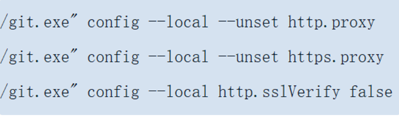

---
# 这是文章的标题
title: github代理配置指南
# 你可以自定义封面图片
# cover: /assets/images/cover1.jpg
# 这是页面的图标
icon: file
# 这是侧边栏的顺序
order: 1
# 设置作者
# author: Ms.Hope
# 设置写作时间
date: 2023-11-28
# 一个页面可以有多个分类
category:
  - 使用指南
# 一个页面可以有多个标签
tag:
  - github
  - 使用指南
# 此页面会在文章列表置顶
# sticky: true
# 此页面会出现在文章收藏中
star: true
isOriginal: true
article: true
timeline: true
# 你可以自定义页脚
# footer: 这是测试显示的页脚
# 你可以自定义版权信息
# copyright: 无版权
---

本文主要介绍github system、global、local三个级别的代理配置及优先级

<!-- more -->
## 指令介绍

### 设置代理
```shell
git config --global http.proxy http://127.0.0.1:[Port]
git config --global https.proxy https://127.0.0.1:1080:[Port]
```
### 取消代理
```shell
git config --global --unset http.proxy
git config --global --unset https.proxy
```
::: tip
[Port]替换为你本地代理的端口
--global 可替换为--system、--local
:::
## 生效优先级
system级指的是程序级别的配置，配置文件在程序的配置目录中
global级是用户级别的配置，配置文件在用户目录中
local级是仓库级别的配置，配置文件在仓库下的.git目录中
::: tip
优先级：local > global > system
:::
## 案例

在一个git脚本中当执行取消代理指令



遇到报错


通过执行代理查看指令
```shell
git config --global --get http.proxy
git config --global --get https.proxy
```
发现global级别配置了代理地址，取消global级别的代理配置后，问题解决


